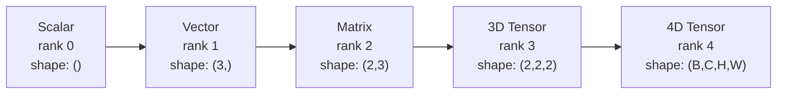
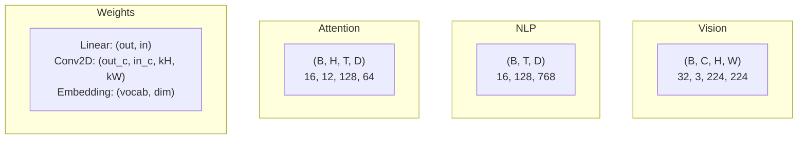
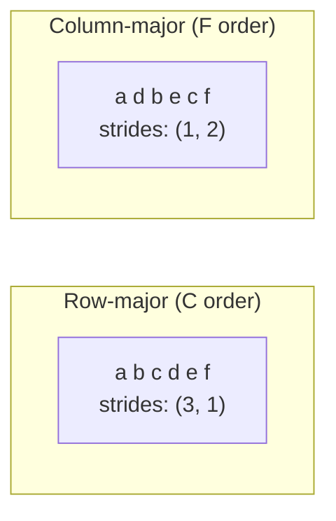
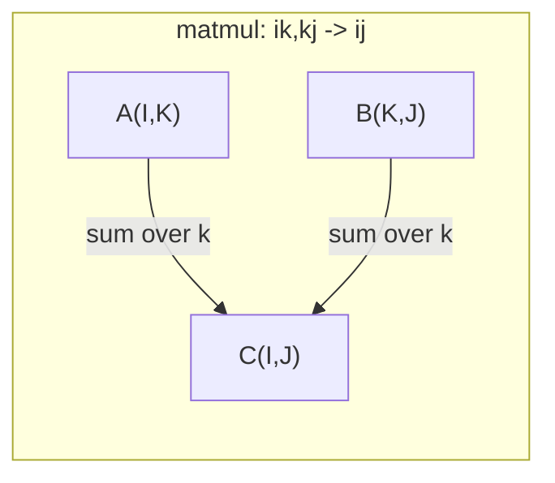

# Операции с тензорами

> Тензоры — это общий язык между данными и глубоким обучением. Через них проходит каждое изображение, каждое предложение, каждый градиент.

**Тип:** Build
**Язык:** Python
**Предварительные требования:** Фаза 1, Уроки 01 (Интуиция линейной алгебры), 02 (Векторы, матрицы и операции)
**Время:** ~90 минут

## Цели обучения

- Реализовать класс тензора с формой, шагами (strides), reshape, transpose и поэлементными операциями с нуля
- Применить правила трансляции (broadcasting) для работы с тензорами разной формы без копирования данных
- Написать einsum-выражения для скалярных произведений, умножений матриц, внешних произведений и пакетных операций
- Проследить точные формы тензоров на каждом шаге многоголового внимания

## Проблема

Вы строите трансформер. Прямой проход выглядит аккуратно. Вы его запускаете и получаете: `RuntimeError: mat1 and mat2 shapes cannot be multiplied (32x768 and 512x768)`. Вы вглядываетесь в формы. Пробуете transpose. Теперь появляется `Expected 4D input (got 3D input)`. Вы добавляете unsqueeze. Ломается что-то ещё.

Ошибки формы — самый распространённый баг в коде глубокого обучения. Концептуально они несложны — у каждой операции есть контракт формы, — но их количество быстро растёт. В трансформере десятки reshape, transpose и broadcast, связанных в цепочку. Одна неверная ось — и ошибка каскадируется. Хуже того: некоторые ошибки формы вообще не вызывают исключений. Они молча производят мусор, транслируясь (broadcasting) вдоль не той оси или суммируя не по той оси.

Матрицы описывают попарные отношения между двумя наборами объектов. Реальные данные не умещаются в два измерения. Пакет из 32 RGB-изображений размером 224x224 — это 4D-тензор: `(32, 3, 224, 224)`. Самовнимание с 12 головами — тоже 4D: `(batch, heads, seq_len, head_dim)`. Вам нужна структура данных, которая обобщается на любое число измерений, с операциями, аккуратно компонующимися во всех них. Эта структура — тензор. Освойте его операции, и ошибки формы станут тривиально отлаживаемыми.

## Концепция

### Что такое тензор

Тензор — это многомерный массив чисел с единым типом данных. Число измерений называется **рангом** (или **порядком**). Каждое измерение — это **ось**. **Форма** — это кортеж, перечисляющий размер вдоль каждой оси.



Общее число элементов = произведение всех размеров. Форма `(2, 3, 4)` содержит `2 * 3 * 4 = 24` элемента.

### Формы тензоров в глубоком обучении

Разные типы данных по соглашению отображаются в определённые формы тензоров.



PyTorch использует NCHW (каналы первыми). TensorFlow по умолчанию использует NHWC (каналы последними). Несовпадающие раскладки вызывают незаметные замедления или ошибки.

### Как устроена раскладка в памяти

2D-массив в памяти — это 1D-последовательность байтов. **Шаги (strides)** показывают, сколько элементов нужно пропустить, чтобы сдвинуться на один шаг вдоль каждой оси.



Transpose не перемещает данные. Он меняет местами шаги (strides), делая тензор **несмежным (non-contiguous)** — элементы строки больше не находятся рядом в памяти.

### Правила трансляции (broadcasting)

Трансляция (broadcasting) позволяет работать с тензорами разной формы без копирования данных. Формы выравниваются справа. Два измерения совместимы, если они равны или одно из них равно 1. Формы с меньшим числом измерений дополняются единицами слева.

```
Tensor A:     (8, 1, 6, 1)
Tensor B:        (7, 1, 5)
Padded B:     (1, 7, 1, 5)
Result:       (8, 7, 6, 5)
```

### Einsum: универсальная тензорная операция

Суммирование Эйнштейна (Einstein summation) обозначает каждую ось буквой. Оси, присутствующие во входе, но не в выходе, суммируются. Оси, присутствующие в обоих, сохраняются.



Ключевые паттерны: `i,i->` (скалярное произведение), `i,j->ij` (внешнее произведение), `ii->` (след), `ij->ji` (транспонирование), `bij,bjk->bik` (пакетное умножение матриц), `bhtd,bhsd->bhts` (оценки внимания).

```figure
tensor-broadcast
```

## Создаём

Код находится в `code/tensors.py`. Каждый шаг ссылается на реализацию там.

### Шаг 1: Хранение тензора и шаги (strides)

Тензор хранит плоский список чисел плюс метаданные о форме. Шаги (strides) сообщают логике индексации, как отображать многомерные индексы в плоские позиции.

```python
class Tensor:
    def __init__(self, data, shape=None):
        if isinstance(data, (list, tuple)):
            self._data, self._shape = self._flatten_nested(data)
        elif isinstance(data, np.ndarray):
            self._data = data.flatten().tolist()
            self._shape = tuple(data.shape)
        else:
            self._data = [data]
            self._shape = ()

        if shape is not None:
            total = reduce(lambda a, b: a * b, shape, 1)
            if total != len(self._data):
                raise ValueError(
                    f"Cannot reshape {len(self._data)} elements into shape {shape}"
                )
            self._shape = tuple(shape)

        self._strides = self._compute_strides(self._shape)

    @staticmethod
    def _compute_strides(shape):
        if len(shape) == 0:
            return ()
        strides = [1] * len(shape)
        for i in range(len(shape) - 2, -1, -1):
            strides[i] = strides[i + 1] * shape[i + 1]
        return tuple(strides)
```

Для формы `(3, 4)` шаги равны `(4, 1)` — пропустить 4 элемента, чтобы продвинуться на одну строку, пропустить 1 элемент, чтобы продвинуться на один столбец.

### Шаг 2: Reshape, squeeze, unsqueeze

Reshape изменяет форму, не меняя порядок элементов. Общее число элементов должно оставаться прежним. Используйте `-1` для одного измерения, чтобы вывести его размер автоматически.

```python
t = Tensor(list(range(12)), shape=(2, 6))
r = t.reshape((3, 4))
r = t.reshape((-1, 3))
```

Squeeze убирает оси размером 1. Unsqueeze добавляет такую ось. Unsqueeze критически важен для трансляции (broadcasting) — вектор смещения `(D,)`, добавляемый к пакету `(B, T, D)`, нужно расширить unsqueeze до `(1, 1, D)`.

```python
t = Tensor(list(range(6)), shape=(1, 3, 1, 2))
s = t.squeeze()
v = Tensor([1, 2, 3])
u = v.unsqueeze(0)
```

### Шаг 3: Transpose и permute

Transpose меняет местами две оси. Permute переставляет все оси. Именно так выполняется преобразование между NCHW и NHWC.

```python
mat = Tensor(list(range(6)), shape=(2, 3))
tr = mat.transpose(0, 1)

t4d = Tensor(list(range(24)), shape=(1, 2, 3, 4))
perm = t4d.permute((0, 2, 3, 1))
```

После transpose или permute тензор становится несмежным в памяти. В PyTorch `view` не работает с несмежными тензорами — используйте `reshape` или сначала вызовите `.contiguous()`.

### Шаг 4: Поэлементные операции и редукции

Поэлементные операции (сложение, умножение, вычитание) применяются независимо к каждому элементу и сохраняют форму. Редукции (sum, mean, max) схлопывают одну или несколько осей.

```python
a = Tensor([[1, 2], [3, 4]])
b = Tensor([[10, 20], [30, 40]])
c = a + b
d = a * 2
s = a.sum(axis=0)
```

Глобальный усредняющий пулинг в CNN: `(B, C, H, W).mean(axis=[2, 3])` даёт `(B, C)`. Усреднение по последовательности в NLP: `(B, T, D).mean(axis=1)` даёт `(B, D)`.

### Шаг 5: Трансляция (broadcasting) в NumPy

Функция `demo_broadcasting_numpy()` в `tensors.py` показывает основные паттерны.

```python
activations = np.random.randn(4, 3)
bias = np.array([0.1, 0.2, 0.3])
result = activations + bias

images = np.random.randn(2, 3, 4, 4)
scale = np.array([0.5, 1.0, 1.5]).reshape(1, 3, 1, 1)
result = images * scale

a = np.array([1, 2, 3]).reshape(-1, 1)
b = np.array([10, 20, 30, 40]).reshape(1, -1)
outer = a * b
```

Попарные расстояния через трансляцию: приведите `(M, 2)` к `(M, 1, 2)`, а `(N, 2)` к `(1, N, 2)`, вычтите, возведите в квадрат, просуммируйте по последней оси, извлеките квадратный корень. Результат: `(M, N)`.

### Шаг 6: Операции einsum

Функции `demo_einsum()` и `demo_einsum_gallery()` последовательно разбирают все распространённые паттерны.

```python
a = np.array([1.0, 2.0, 3.0])
b = np.array([4.0, 5.0, 6.0])
dot = np.einsum("i,i->", a, b)

A = np.array([[1, 2], [3, 4], [5, 6]], dtype=float)
B = np.array([[7, 8, 9], [10, 11, 12]], dtype=float)
matmul = np.einsum("ik,kj->ij", A, B)

batch_A = np.random.randn(4, 3, 5)
batch_B = np.random.randn(4, 5, 2)
batch_mm = np.einsum("bij,bjk->bik", batch_A, batch_B)
```

Вычислительная стоимость свёртки (contraction) равна произведению размеров всех индексов (и сохраняемых, и суммируемых). Для `bij,bjk->bik` при B=32, I=128, J=64, K=128: `32 * 128 * 64 * 128 = 33,554,432` операций умножения-сложения.

### Шаг 7: Механизм внимания через einsum

Функция `demo_attention_einsum()` реализует многоголовое внимание от начала до конца.

```python
B, H, T, D = 2, 4, 8, 16
E = H * D

X = np.random.randn(B, T, E)
W_q = np.random.randn(E, E) * 0.02

Q = np.einsum("bte,ek->btk", X, W_q)
Q = Q.reshape(B, T, H, D).transpose(0, 2, 1, 3)

scores = np.einsum("bhtd,bhsd->bhts", Q, K) / np.sqrt(D)
weights = softmax(scores, axis=-1)
attn_output = np.einsum("bhts,bhsd->bhtd", weights, V)

concat = attn_output.transpose(0, 2, 1, 3).reshape(B, T, E)
output = np.einsum("bte,ek->btk", concat, W_o)
```

Каждый шаг — это тензорная операция: проекция (matmul через einsum), разбиение по головам (reshape + transpose), оценки внимания (пакетный matmul через einsum), взвешенная сумма (пакетный matmul через einsum), объединение голов (transpose + reshape), выходная проекция (matmul через einsum).

## Применяем

### Собственная реализация и NumPy

| Операция | Собственная реализация (класс Tensor) | NumPy |
|---|---|---|
| Создание | `Tensor([[1,2],[3,4]])` | `np.array([[1,2],[3,4]])` |
| Изменение формы | `t.reshape((3,4))` | `a.reshape(3,4)` |
| Транспонирование | `t.transpose(0,1)` | `a.T` или `a.transpose(0,1)` |
| Удаление единичных осей | `t.squeeze(0)` | `np.squeeze(a, 0)` |
| Сумма | `t.sum(axis=0)` | `a.sum(axis=0)` |
| Einsum | Н/Д | `np.einsum("ij,jk->ik", a, b)` |

### Собственная реализация и PyTorch

```python
import torch

t = torch.tensor([[1, 2, 3], [4, 5, 6]], dtype=torch.float32)
t.shape
t.stride()
t.is_contiguous()

t.reshape(3, 2)
t.unsqueeze(0)
t.transpose(0, 1)
t.transpose(0, 1).contiguous()

torch.einsum("ik,kj->ij", A, B)
```

PyTorch добавляет автоматическое дифференцирование (autograd), поддержку GPU и оптимизированные BLAS-ядра. Семантика форм идентична. Если вы понимаете собственную реализацию, ошибки формы в PyTorch становятся читаемыми.

### Каждый слой нейронной сети как тензорная операция

| Операция | Тензорная форма | Einsum |
|---|---|---|
| Линейный слой | `Y = X @ W.T + b` | `"bd,od->bo"` + смещение |
| Проекции QKV для внимания | `Q = X @ W_q` | `"btd,dh->bth"` |
| Оценки внимания | `Q @ K.T / sqrt(d)` | `"bhtd,bhsd->bhts"` |
| Выход внимания | `softmax(scores) @ V` | `"bhts,bhsd->bhtd"` |
| Пакетная нормализация | `(X - mu) / sigma * gamma` | поэлементно + трансляция |
| Функция softmax | `exp(x) / sum(exp(x))` | поэлементно + редукция |

## Публикуем

Этот урок производит два переиспользуемых промпта:

1. **`outputs/prompt-tensor-shapes.md`** — систематический промпт для отладки несовпадений формы тензоров. Включает таблицы решений для каждой распространённой операции (matmul, broadcast, cat, Linear, Conv2d, BatchNorm, softmax) и таблицу поиска исправлений.

2. **`outputs/prompt-tensor-debugger.md`** — пошаговый промпт для отладки, который вы вставляете в любого ИИ-ассистента, когда ошибка формы блокирует вашу работу. Передайте ему сообщение об ошибке и формы ваших тензоров, получите точное исправление.

## Упражнения

1. **Легко — цикл reshape.** Возьмите тензор формы `(2, 3, 4)`. Приведите его к `(6, 4)`, затем к `(24,)`, затем обратно к `(2, 3, 4)`. Проверьте, что порядок элементов сохраняется на каждом шаге, выведя плоские данные.

2. **Средне — реализация трансляции (broadcasting).** Расширьте класс `Tensor` методом `broadcast_to(shape)`, который расширяет измерения размером 1 до целевой формы. Затем измените `_elementwise_op`, чтобы он автоматически транслировал операнды перед операцией. Протестируйте с формами `(3, 1)` и `(1, 4)`, дающими `(3, 4)`.

3. **Сложно — построить einsum с нуля.** Реализуйте базовую функцию `einsum(subscripts, *tensors)`, обрабатывающую как минимум: скалярное произведение (`i,i->`), умножение матриц (`ij,jk->ik`), внешнее произведение (`i,j->ij`) и транспонирование (`ij->ji`). Разберите строку индексов, определите суммируемые индексы и переберите все комбинации индексов. Сравните результаты с `np.einsum`.

4. **Сложно — трекер форм внимания.** Напишите функцию, которая принимает `batch_size`, `seq_len`, `embed_dim` и `num_heads` и выводит точную форму на каждом шаге многоголового внимания: вход, проекция Q/K/V, разбиение по головам, оценки внимания, веса softmax, взвешенная сумма, объединение голов, выходная проекция. Сверьте с выводом `demo_attention_einsum()`.

## Ключевые термины

| Термин | Как обычно говорят | Что это значит на самом деле |
|---|---|---|
| Тензор | «Матрица, только с большим числом измерений» | Многомерный массив с единым типом и определёнными формой, шагами (strides) и операциями |
| Ранг | «Число измерений» | Число осей. У матрицы ранг равен 2, а не рангу этой матрицы в линейно-алгебраическом смысле |
| Форма | «Размер тензора» | Кортеж, перечисляющий размер вдоль каждой оси. `(2, 3)` означает 2 строки, 3 столбца |
| Шаг | «Как устроена раскладка в памяти» | Число элементов, которые нужно пропустить, чтобы продвинуться на одну позицию вдоль каждой оси |
| Трансляция | «Просто работает, когда формы разные» | Строгий набор правил: выравнивание справа, измерения должны быть равны или одно из них должно быть 1 |
| Смежный тензор | «Тензор в нормальном виде» | Элементы хранятся последовательно в памяти без пропусков или изменения порядка относительно логической раскладки |
| Einsum | «Причудливый способ записать matmul» | Общая нотация, выражающая любую свёртку тензора, внешнее произведение, след или транспонирование в одной строке |
| Представление | «То же самое, что reshape» | Тензор, использующий тот же буфер памяти, но с другими метаданными формы/шагов. Не работает с несмежными данными |
| Свёртка | «Суммирование по индексу» | Общая операция, при которой общий индекс между тензорами перемножается и суммируется, давая результат меньшего ранга |
| NCHW / NHWC | «Формат PyTorch против TensorFlow» | Соглашения о раскладке в памяти для тензоров изображений. NCHW ставит каналы перед пространственными измерениями, NHWC — после |

## Дополнительные материалы

- [Трансляция в NumPy](https://numpy.org/doc/stable/user/basics.broadcasting.html) — канонические правила с наглядными примерами
- [Представления тензоров в PyTorch (Tensor Views)](https://pytorch.org/docs/stable/tensor_view.html) — когда view работает, а когда происходит копирование
- [einops](https://github.com/arogozhnikov/einops) — библиотека, которая делает изменение формы тензоров читаемым и безопасным
- [The Illustrated Transformer](https://jalammar.github.io/illustrated-transformer/) — визуализирует формы тензоров, проходящие через внимание
- [Суммирование Эйнштейна в NumPy (einsum)](https://numpy.org/doc/stable/reference/generated/numpy.einsum.html) — полная документация einsum с примерами
