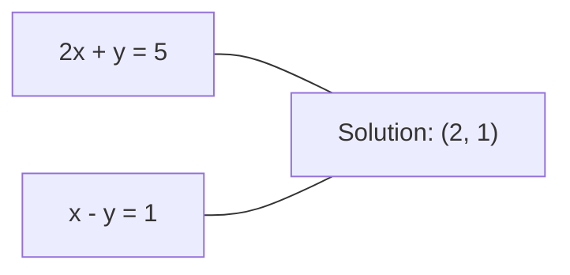
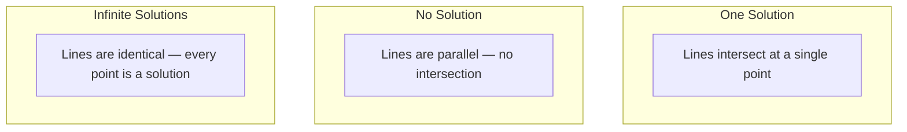

# Линейные системы

> Решение Ax = b — старейшая задача математики, которая до сих пор управляет вашей нейронной сетью.

**Тип:** Build
**Язык:** Python
**Предварительные требования:** Этап 1, уроки 01 («Интуитивное понимание линейной алгебры»), 02 («Векторы и матрицы»), 03 («Матричные преобразования»)
**Время:** ~120 минут

## Цели обучения

- Решать Ax = b методом гауссова исключения с частичным выбором ведущего элемента и обратной подстановкой
- Разлагать матрицы с помощью LU-, QR- и разложения Холецкого и объяснять, когда какое из них уместно
- Выводить нормальные уравнения для метода наименьших квадратов и связывать их с линейной и гребневой регрессией
- Диагностировать плохо обусловленные системы с помощью числа обусловленности и применять регуляризацию для их стабилизации

## Проблема

Каждый раз, когда вы обучаете линейную регрессию, вы решаете линейную систему. Каждый раз, когда вы вычисляете подгонку методом наименьших квадратов, вы решаете линейную систему. Каждый раз, когда слой нейронной сети вычисляет `y = Wx + b`, он вычисляет одну сторону линейной системы. Когда вы добавляете регуляризацию, вы изменяете систему. Когда вы используете гауссовские процессы, вы раскладываете матрицу. Когда вы обращаете ковариационную матрицу для расстояния Махаланобиса, вы решаете линейную систему.

Уравнение Ax = b встречается повсюду. A — матрица известных коэффициентов. b — вектор известных выходов. x — вектор неизвестных, которые нужно найти. В линейной регрессии A — это матрица данных, b — вектор целевых значений, а x — вектор весов. Вся модель сводится к следующему: найти x такое, что Ax максимально близко к b.

В этом уроке с нуля строятся все основные методы решения этого уравнения. Вы поймёте, почему одни методы быстрые, а другие устойчивые, почему одни работают только для квадратных систем, а другие обрабатывают переопределённые, и почему число обусловленности вашей матрицы определяет, имеет ли ваш ответ вообще какой-либо смысл.

## Концепция

### Что означает Ax = b геометрически

Система линейных уравнений имеет геометрическую интерпретацию. Каждое уравнение задаёт гиперплоскость. Решение — это точка (или множество точек), в которой пересекаются все гиперплоскости.

```
2x + y = 5          Two lines in 2D.
x - y  = 1          They intersect at x=2, y=1.
```



Может произойти три вещи:



В матричной форме «одно решение» означает, что A обратима. «Нет решения» означает, что система несовместна. «Бесконечно много решений» означает, что у A есть нулевое пространство. Большинство задач ML попадают в категорию «нет точного решения», потому что у вас больше уравнений (точек данных), чем неизвестных (параметров). Именно здесь на сцену выходит метод наименьших квадратов.

### Взгляд по столбцам против взгляда по строкам

Есть два способа прочитать Ax = b.

**Взгляд по строкам.** Каждая строка A задаёт одно уравнение. Каждое уравнение — гиперплоскость. Решение — это точка, где все они пересекаются.

**Взгляд по столбцам.** Каждый столбец A — это вектор. Вопрос становится таким: какая линейная комбинация столбцов A даёт b?

```
A = | 2  1 |    b = | 5 |
    | 1 -1 |        | 1 |

Row picture: solve 2x + y = 5 and x - y = 1 simultaneously.

Column picture: find x1, x2 such that:
  x1 * [2, 1] + x2 * [1, -1] = [5, 1]
  2 * [2, 1] + 1 * [1, -1] = [4+1, 2-1] = [5, 1]   check.
```

Взгляд по столбцам более фундаментален. Если b лежит в пространстве столбцов A, у системы есть решение. Если b там не лежит, вы находите ближайшую точку в пространстве столбцов. Эта ближайшая точка и есть решение методом наименьших квадратов.

### Гауссово исключение

Гауссово исключение преобразует Ax = b в верхнетреугольную систему Ux = c, которую вы решаете обратной подстановкой. Это самый прямой метод.

Алгоритм:

```
1. For each column k (the pivot column):
   a. Find the largest entry in column k at or below row k (partial pivoting).
   b. Swap that row with row k.
   c. For each row i below k:
      - Compute multiplier m = A[i][k] / A[k][k]
      - Subtract m times row k from row i.
2. Back substitute: solve from the last equation upward.
```

Пример:

```
Original:
| 2  1  1 | 8 |       R2 = R2 - (2)R1     | 2  1   1 |  8 |
| 4  3  3 |20 |  -->  R3 = R3 - (1)R1 --> | 0  1   1 |  4 |
| 2  3  1 |12 |                            | 0  2   0 |  4 |

                       R3 = R3 - (2)R2     | 2  1   1 |  8 |
                                       --> | 0  1   1 |  4 |
                                           | 0  0  -2 | -4 |

Back substitute:
  -2 * x3 = -4    -->  x3 = 2
  x2 + 2  = 4     -->  x2 = 2
  2*x1 + 2 + 2 = 8 --> x1 = 2
```

Гауссово исключение стоит O(n^3) операций. Для системы 1000x1000 это около миллиарда операций с плавающей точкой. Быстро, но можно добиться большего, если нужно решать несколько систем с одной и той же A.

### Частичный выбор ведущего элемента: почему это важно

Без выбора ведущего элемента гауссово исключение может завершиться неудачей или дать бессмысленный результат. Если ведущий элемент равен нулю, вы делите на ноль. Если он маленький, вы усиливаете ошибки округления.

```
Bad pivot:                       With partial pivoting:
| 0.001  1 | 1.001 |            Swap rows first:
| 1      1 | 2     |            | 1      1 | 2     |
                                 | 0.001  1 | 1.001 |
m = 1/0.001 = 1000              m = 0.001/1 = 0.001
R2 = R2 - 1000*R1               R2 = R2 - 0.001*R1
| 0.001  1     | 1.001   |      | 1      1     | 2     |
| 0     -999   | -999.0  |      | 0      0.999 | 0.999 |

x2 = 1.000 (correct)            x2 = 1.000 (correct)
x1 = (1.001 - 1)/0.001          x1 = (2 - 1)/1 = 1.000 (correct)
   = 0.001/0.001 = 1.000        Stable because the multiplier is small.
```

В арифметике с плавающей точкой ограниченной точности версия без выбора ведущего элемента может потерять значащие цифры. Частичный выбор ведущего элемента всегда выбирает наибольший доступный ведущий элемент, чтобы минимизировать усиление ошибки.

### LU-разложение

LU-разложение раскладывает A на нижнетреугольную матрицу L и верхнетреугольную матрицу U: A = LU. Матрица L хранит множители из гауссова исключения. Матрица U — результат исключения.

```
A = L @ U

| 2  1  1 |   | 1  0  0 |   | 2  1   1 |
| 4  3  3 | = | 2  1  0 | @ | 0  1   1 |
| 2  3  1 |   | 1  2  1 |   | 0  0  -2 |
```

Зачем раскладывать вместо того, чтобы просто исключать? Потому что, имея L и U, решение Ax = b для любого нового b стоит всего O(n^2):

```
Ax = b
LUx = b
Let y = Ux:
  Ly = b    (forward substitution, O(n^2))
  Ux = y    (back substitution, O(n^2))
```

Стоимость O(n^3) оплачивается один раз во время разложения. Каждое последующее решение стоит O(n^2). Если вам нужно решить 1000 систем с одной и той же A, но разными векторами b, LU экономит коэффициент 1000/3 от общего объёма работы.

С частичным выбором ведущего элемента вы получаете PA = LU, где P — матрица перестановок, фиксирующая перестановки строк.

### QR-разложение

QR-разложение раскладывает A на ортогональную матрицу Q и верхнетреугольную матрицу R: A = QR.

Ортогональная матрица обладает свойством Q^T Q = I. Её столбцы — ортонормированные векторы. Умножение на Q сохраняет длины и углы.

```
A = Q @ R

Q has orthonormal columns: Q^T Q = I
R is upper triangular

To solve Ax = b:
  QRx = b
  Rx = Q^T b    (just multiply by Q^T, no inversion needed)
  Back substitute to get x.
```

QR численно более устойчив, чем LU, для решения задач наименьших квадратов. Процесс Грама-Шмидта строит Q столбец за столбцом:

```
Given columns a1, a2, ... of A:

q1 = a1 / ||a1||

q2 = a2 - (a2 . q1) * q1        (subtract projection onto q1)
q2 = q2 / ||q2||                (normalize)

q3 = a3 - (a3 . q1) * q1 - (a3 . q2) * q2
q3 = q3 / ||q3||

R[i][j] = qi . aj    for i <= j
```

Каждый шаг удаляет компоненту вдоль всех предыдущих векторов q, оставляя только новое ортогональное направление.

### Разложение Холецкого

Когда A симметрична (A = A^T) и положительно определена (все собственные значения положительны), её можно разложить как A = L L^T, где L — нижнетреугольная матрица. Это разложение Холецкого.

```
A = L @ L^T

| 4  2 |   | 2  0 |   | 2  1 |
| 2  5 | = | 1  2 | @ | 0  2 |

L[i][i] = sqrt(A[i][i] - sum(L[i][k]^2 for k < i))
L[i][j] = (A[i][j] - sum(L[i][k]*L[j][k] for k < j)) / L[j][j]    for i > j
```

Холецкий в два раза быстрее LU и требует вдвое меньше памяти. Он работает только для симметричных положительно определённых матриц, но такие встречаются постоянно:

- Ковариационные матрицы симметричны и положительно полуопределены (положительно определены при регуляризации).
- Матрица ядра в гауссовских процессах симметрична и положительно определена.
- Гессиан выпуклой функции в минимуме симметричен и положительно определён.
- A^T A всегда симметрична и положительно полуопределена.

В гауссовских процессах вы раскладываете матрицу ядра K методом Холецкого, затем решаете K alpha = y, чтобы получить предсказательное среднее. Фактор Холецкого также даёт логарифм определителя для маргинального правдоподобия: log det(K) = 2 * sum(log(diag(L))).

### Метод наименьших квадратов: когда у Ax = b нет точного решения

Если A имеет размер m x n при m > n (уравнений больше, чем неизвестных), система переопределена. Точного решения не существует. Вместо этого вы минимизируете квадратичную ошибку:

```
minimize ||Ax - b||^2

This is the sum of squared residuals:
  sum((A[i,:] @ x - b[i])^2 for i in range(m))
```

Минимизатор удовлетворяет нормальным уравнениям:

```
A^T A x = A^T b
```

Вывод: раскрываем ||Ax - b||^2 = (Ax - b)^T (Ax - b) = x^T A^T A x - 2 x^T A^T b + b^T b. Берём градиент по x, приравниваем к нулю: 2 A^T A x - 2 A^T b = 0.

```
Original system (overdetermined, 4 equations, 2 unknowns):
| 1  1 |         | 3 |
| 1  2 | x     = | 5 |       No exact x satisfies all 4 equations.
| 1  3 |         | 6 |
| 1  4 |         | 8 |

Normal equations:
A^T A = | 4  10 |    A^T b = | 22 |
        | 10 30 |            | 63 |

Solve: x = [1.5, 1.7]

This is linear regression. x[0] is the intercept, x[1] is the slope.
```

### Нормальные уравнения = линейная регрессия

Связь точная. В линейной регрессии ваша матрица данных X имеет одну строку на каждый образец и один столбец на каждый признак. Ваш вектор целевых значений y имеет одну запись на образец. Вектор весов w удовлетворяет:

```
X^T X w = X^T y
w = (X^T X)^(-1) X^T y
```

Это замкнутое решение линейной регрессии. Каждый вызов `sklearn.linear_model.LinearRegression.fit()` вычисляет именно это (или эквивалент через QR или SVD).

Добавьте член регуляризации lambda * I к матрице — и вы получите гребневую регрессию:

```
(X^T X + lambda * I) w = X^T y
w = (X^T X + lambda * I)^(-1) X^T y
```

Регуляризация делает матрицу лучше обусловленной (проще обратить точно) и предотвращает переобучение, стягивая веса к нулю. Матрица X^T X + lambda * I всегда симметрична и положительно определена при lambda > 0, поэтому для её решения можно использовать разложение Холецкого.

### Псевдообратная матрица (Мура-Пенроуза)

Псевдообратная матрица A+ обобщает обращение матрицы на неквадратные и вырожденные матрицы. Для любой матрицы A:

```
x = A+ b

where A+ = V Sigma+ U^T    (computed via SVD)
```

Sigma+ формируется взятием обратной величины каждого ненулевого сингулярного числа и транспонированием результата. Если A = U Sigma V^T, то A+ = V Sigma+ U^T.

```
A = U Sigma V^T        (SVD)

Sigma = | 5  0 |       Sigma+ = | 1/5  0  0 |
        | 0  2 |                | 0  1/2  0 |
        | 0  0 |

A+ = V Sigma+ U^T
```

Псевдообратная матрица даёт решение методом наименьших квадратов с минимальной нормой. Если у системы есть:
- Одно решение: A+ b даёт его.
- Нет решения: A+ b даёт решение методом наименьших квадратов.
- Бесконечно много решений: A+ b даёт решение с наименьшей ||x||.

`np.linalg.lstsq` и `np.linalg.pinv` из NumPy оба используют SVD внутри.

### Число обусловленности

Число обусловленности измеряет, насколько чувствительно решение к малым изменениям входных данных. Для матрицы A число обусловленности равно:

```
kappa(A) = ||A|| * ||A^(-1)|| = sigma_max / sigma_min
```

где sigma_max и sigma_min — наибольшее и наименьшее сингулярные числа.

```
Well-conditioned (kappa ~ 1):        Ill-conditioned (kappa ~ 10^15):
Small change in b -->                Small change in b -->
small change in x                    huge change in x

| 2  0 |   kappa = 2/1 = 2          | 1   1          |   kappa ~ 10^15
| 0  1 |   safe to solve            | 1   1+10^(-15) |   solution is garbage
```

Практические правила:
- kappa < 100: безопасно, решение точное.
- kappa ~ 10^k: вы теряете около k десятичных разрядов точности вашей арифметики с плавающей точкой.
- kappa ~ 10^16 (для float64): решение бессмысленно. Матрица фактически вырождена.

В ML плохая обусловленность возникает, когда признаки почти коллинеарны. Регуляризация (добавление lambda * I) улучшает число обусловленности с sigma_max / sigma_min до (sigma_max + lambda) / (sigma_min + lambda).

### Итеративные методы: метод сопряжённых градиентов

Для очень больших разреженных систем (миллионы неизвестных) прямые методы вроде LU или Холецкого слишком дороги. Итеративные методы приближают решение, улучшая догадку в течение многих итераций.

Метод сопряжённых градиентов (CG) решает Ax = b, когда A симметрична и положительно определена. Он находит точное решение не более чем за n итераций (в точной арифметике), но обычно сходится намного быстрее, если собственные значения A сгруппированы.

```
Algorithm sketch:
  x0 = initial guess (often zero)
  r0 = b - A x0           (residual)
  p0 = r0                 (search direction)

  For k = 0, 1, 2, ...:
    alpha = (rk . rk) / (pk . A pk)
    x_{k+1} = xk + alpha * pk
    r_{k+1} = rk - alpha * A pk
    beta = (r_{k+1} . r_{k+1}) / (rk . rk)
    p_{k+1} = r_{k+1} + beta * pk
    if ||r_{k+1}|| < tolerance: stop
```

CG используется в:
- Крупномасштабной оптимизации (метод Ньютона-CG)
- Решении дискретизаций уравнений в частных производных
- Методах ядра, где матрица ядра слишком велика для разложения
- Предобуславливании для других итеративных решателей

Скорость сходимости зависит от числа обусловленности. Лучше обусловленные системы сходятся быстрее — это ещё одна причина, почему регуляризация помогает.

### Полная картина: какой метод когда

| Метод | Требования | Стоимость | Область применения |
|--------|-------------|------|----------|
| Гауссово исключение | Квадратная невырожденная A | O(n^3) | Разовое решение квадратной системы |
| LU-разложение | Квадратная невырожденная A | Разложение O(n^3) + решение O(n^2) | Многократное решение с одной и той же A |
| QR-разложение | Любая A (m >= n) | O(mn^2) | Метод наименьших квадратов, численно устойчиво |
| Холецкий | Симметричная положительно определённая A | O(n^3/3) | Ковариационные матрицы, гауссовские процессы, гребневая регрессия |
| Нормальные уравнения | Переопределённая (m > n) | O(mn^2 + n^3) | Линейная регрессия (малое n) |
| SVD / псевдообратная матрица | Любая A | O(mn^2) | Системы с дефицитом ранга, решения с минимальной нормой |
| Метод сопряжённых градиентов | Симметричная положительно определённая, разреженная A | O(n * k * nnz) | Большие разреженные системы, k = число итераций |

### Связь с ML

Каждый метод из этого урока встречается в промышленном ML:

**Линейная регрессия.** Замкнутое решение решает нормальные уравнения X^T X w = X^T y. Это делается через Холецкого (если n мало), либо QR (если важна численная устойчивость), либо SVD (если матрица может быть вырожденной по рангу).

**Гребневая регрессия.** Добавляет lambda * I к X^T X. Регуляризованная система (X^T X + lambda * I) w = X^T y всегда разрешима через Холецкого, потому что X^T X + lambda * I симметрична и положительно определена при lambda > 0.

**Гауссовские процессы.** Предсказательное среднее требует решения K alpha = y, где K — матрица ядра. Разложение Холецкого для K — стандартный подход. Логарифм маргинального правдоподобия использует log det(K) = 2 sum(log(diag(L))).

**Инициализация нейронной сети.** Ортогональная инициализация использует QR-разложение для создания весовых матриц, столбцы которых ортонормированы. Это предотвращает коллапс сигнала в глубоких сетях.

**Предобуславливание.** Крупномасштабные оптимизаторы используют неполный Холецкий или неполный LU в качестве предобуславливателей для решателей методом сопряжённых градиентов.

**Проектирование признаков.** Число обусловленности X^T X показывает, коллинеарны ли ваши признаки. Если kappa велика, удалите признаки или добавьте регуляризацию.

```figure
linear-system-conditioning
```

## Реализация

### Шаг 1: Гауссово исключение с частичным выбором ведущего элемента

```python
import numpy as np

def gaussian_elimination(A, b):
    n = len(b)
    Ab = np.hstack([A.astype(float), b.reshape(-1, 1).astype(float)])

    for k in range(n):
        max_row = k + np.argmax(np.abs(Ab[k:, k]))
        Ab[[k, max_row]] = Ab[[max_row, k]]

        if abs(Ab[k, k]) < 1e-12:
            raise ValueError(f"Matrix is singular or nearly singular at pivot {k}")

        for i in range(k + 1, n):
            m = Ab[i, k] / Ab[k, k]
            Ab[i, k:] -= m * Ab[k, k:]

    x = np.zeros(n)
    for i in range(n - 1, -1, -1):
        x[i] = (Ab[i, -1] - Ab[i, i+1:n] @ x[i+1:n]) / Ab[i, i]

    return x
```

### Шаг 2: LU-разложение

```python
def lu_decompose(A):
    n = A.shape[0]
    L = np.eye(n)
    U = A.astype(float).copy()
    P = np.eye(n)

    for k in range(n):
        max_row = k + np.argmax(np.abs(U[k:, k]))
        if max_row != k:
            U[[k, max_row]] = U[[max_row, k]]
            P[[k, max_row]] = P[[max_row, k]]
            if k > 0:
                L[[k, max_row], :k] = L[[max_row, k], :k]

        for i in range(k + 1, n):
            L[i, k] = U[i, k] / U[k, k]
            U[i, k:] -= L[i, k] * U[k, k:]

    return P, L, U

def lu_solve(P, L, U, b):
    n = len(b)
    Pb = P @ b.astype(float)

    y = np.zeros(n)
    for i in range(n):
        y[i] = Pb[i] - L[i, :i] @ y[:i]

    x = np.zeros(n)
    for i in range(n - 1, -1, -1):
        x[i] = (y[i] - U[i, i+1:] @ x[i+1:]) / U[i, i]

    return x
```

### Шаг 3: Разложение Холецкого

```python
def cholesky(A):
    n = A.shape[0]
    L = np.zeros_like(A, dtype=float)

    for i in range(n):
        for j in range(i + 1):
            s = A[i, j] - L[i, :j] @ L[j, :j]
            if i == j:
                if s <= 0:
                    raise ValueError("Matrix is not positive definite")
                L[i, j] = np.sqrt(s)
            else:
                L[i, j] = s / L[j, j]

    return L
```

### Шаг 4: Метод наименьших квадратов через нормальные уравнения

```python
def least_squares_normal(A, b):
    AtA = A.T @ A
    Atb = A.T @ b
    return gaussian_elimination(AtA, Atb)

def ridge_regression(A, b, lam):
    n = A.shape[1]
    AtA = A.T @ A + lam * np.eye(n)
    Atb = A.T @ b
    L = cholesky(AtA)
    y = np.zeros(n)
    for i in range(n):
        y[i] = (Atb[i] - L[i, :i] @ y[:i]) / L[i, i]
    x = np.zeros(n)
    for i in range(n - 1, -1, -1):
        x[i] = (y[i] - L.T[i, i+1:] @ x[i+1:]) / L.T[i, i]
    return x
```

### Шаг 5: Число обусловленности

```python
def condition_number(A):
    U, S, Vt = np.linalg.svd(A)
    return S[0] / S[-1]
```

## Использование

Собираем всё воедино для линейной и гребневой регрессии на реальных данных:

```python
np.random.seed(42)
X_raw = np.random.randn(100, 3)
w_true = np.array([2.0, -1.0, 0.5])
y = X_raw @ w_true + np.random.randn(100) * 0.1

X = np.column_stack([np.ones(100), X_raw])

w_ols = least_squares_normal(X, y)
print(f"OLS weights (ours):    {w_ols}")

w_np = np.linalg.lstsq(X, y, rcond=None)[0]
print(f"OLS weights (numpy):   {w_np}")
print(f"Max difference: {np.max(np.abs(w_ols - w_np)):.2e}")

w_ridge = ridge_regression(X, y, lam=1.0)
print(f"Ridge weights (ours):  {w_ridge}")

from sklearn.linear_model import Ridge
ridge_sk = Ridge(alpha=1.0, fit_intercept=False)
ridge_sk.fit(X, y)
print(f"Ridge weights (sklearn): {ridge_sk.coef_}")
```

## Итог

Этот урок производит:
- `code/linear_systems.py`, содержащий реализации с нуля гауссова исключения, LU-разложения, разложения Холецкого, метода наименьших квадратов и гребневой регрессии
- Работающую демонстрацию того, что нормальные уравнения и LinearRegression из sklearn дают одинаковые веса

## Упражнения

1. Решите систему `[[1,2,3],[4,5,6],[7,8,10]] x = [6, 15, 27]`, используя ваше гауссово исключение, ваш LU-решатель и `np.linalg.solve`. Убедитесь, что все три дают одинаковый ответ в пределах погрешности плавающей точки.

2. Сгенерируйте случайную матрицу X размером 50x5 и целевой вектор y = X @ w_true + шум. Решите относительно w с помощью нормальных уравнений, QR (через `np.linalg.qr`), SVD (через `np.linalg.svd`) и `np.linalg.lstsq`. Сравните все четыре решения. Измерьте число обусловленности X^T X и объясните, как оно влияет на то, какому методу вы доверяете.

3. Создайте почти вырожденную матрицу, сделав два столбца почти идентичными (например, столбец 2 = столбец 1 + 1e-10 * шум). Вычислите её число обусловленности. Решите Ax = b с регуляризацией и без неё (добавьте 0.01 * I). Сравните решения и невязки. Объясните, почему регуляризация помогает.

4. Реализуйте алгоритм сопряжённых градиентов для случайной симметричной положительно определённой матрицы 100x100. Посчитайте, сколько итераций требуется для сходимости до допуска 1e-8. Сравните с теоретическим максимумом в n итераций.

5. Замерьте время работы вашего решателя Холецкого против вашего LU-решателя против `np.linalg.solve` на симметричных положительно определённых матрицах размера 10, 50, 200, 500. Постройте график результатов. Убедитесь, что Холецкий примерно в 2 раза быстрее LU.

## Ключевые термины

| Термин | Что говорят люди | Что это на самом деле означает |
|------|----------------|----------------------|
| Линейная система | «Решить относительно x» | Набор линейных уравнений Ax = b. Найти x означает найти вход, который под действием преобразования A даёт выход b. |
| Гауссово исключение | «Привести строки» | Систематически обнулять элементы ниже диагонали с помощью операций над строками, получая верхнетреугольную систему, решаемую обратной подстановкой. O(n^3). |
| Частичный выбор ведущего элемента | «Менять строки местами ради устойчивости» | Перед исключением в столбце k переставить строку с наибольшим по модулю значением в этом столбце на позицию ведущего элемента. Предотвращает деление на малые числа. |
| LU-разложение | «Разложить на треугольники» | Записать A = LU, где L — нижнетреугольная матрица (хранит множители), а U — верхнетреугольная матрица (результат исключения). Распределяет стоимость O(n^3) на несколько решений. |
| QR-разложение | «Ортогональное разложение» | Записать A = QR, где столбцы Q ортонормированы, а R — верхнетреугольная матрица. Устойчивее, чем LU, для метода наименьших квадратов. |
| Разложение Холецкого | «Квадратный корень из матрицы» | Для симметричной положительно определённой A записать A = LL^T. Вдвое дешевле LU. Используется для ковариационных матриц, матриц ядра и гребневой регрессии. |
| Метод наименьших квадратов | «Лучшая подгонка, когда точное решение невозможно» | Минимизировать сумму квадратов невязок ||Ax - b||^2, когда система переопределена (уравнений больше, чем неизвестных). |
| Нормальные уравнения | «Сокращённый путь через матанализ» | A^T A x = A^T b. Приравнивание градиента ||Ax - b||^2 к нулю. Это И ЕСТЬ замкнутое решение линейной регрессии. |
| Псевдообратная матрица | «Обращение для неквадратных матриц» | A+ = V Sigma+ U^T через SVD. Даёт решение методом наименьших квадратов с минимальной нормой для любой матрицы — квадратной или прямоугольной, вырожденной или нет. |
| Число обусловленности | «Насколько надёжен этот ответ» | kappa = sigma_max / sigma_min. Измеряет чувствительность к возмущениям на входе. Теряется около log10(kappa) десятичных разрядов точности. |
| Гребневая регрессия | «Регуляризованный метод наименьших квадратов» | Решить (X^T X + lambda I) w = X^T y. Добавление lambda I улучшает обусловленность и стягивает веса к нулю. Предотвращает переобучение. |
| Метод сопряжённых градиентов | «Итеративное решение Ax=b для больших матриц» | Итеративный решатель для симметричных положительно определённых систем. Сходится не более чем за n шагов. Практичен для больших разреженных систем, где разложение слишком дорого. |
| Переопределённая система | «Данных больше, чем параметров» | m > n в системе размера m на n. Точного решения не существует. Метод наименьших квадратов находит наилучшее приближение. Это каждая задача регрессии. |
| Обратная подстановка | «Решать снизу вверх» | В верхнетреугольной системе сначала решить последнее уравнение, затем подставлять в обратном порядке. O(n^2). |
| Прямая подстановка | «Решать сверху вниз» | В нижнетреугольной системе сначала решить первое уравнение, затем подставлять далее. O(n^2). Используется на этапе L при решении через LU. |

## Дополнительные материалы

- [MIT 18.06: Linear Algebra](https://ocw.mit.edu/courses/18-06-linear-algebra-spring-2010/) (Gilbert Strang) -- исчерпывающий курс по линейным системам и матричным разложениям
- [Numerical Linear Algebra](https://people.maths.ox.ac.uk/trefethen/text.html) (Trefethen & Bau) -- стандартный справочник, объясняющий численную устойчивость, обусловленность и причины отказа алгоритмов
- [Matrix Computations](https://www.cs.cornell.edu/cv/GolubVanLoan4/golubandvanloan.htm) (Golub & Van Loan) -- энциклопедический справочник по всем матричным алгоритмам
- [3Blue1Brown: Inverse Matrices](https://www.3blue1brown.com/lessons/inverse-matrices) -- наглядное объяснение геометрического смысла решения Ax = b
