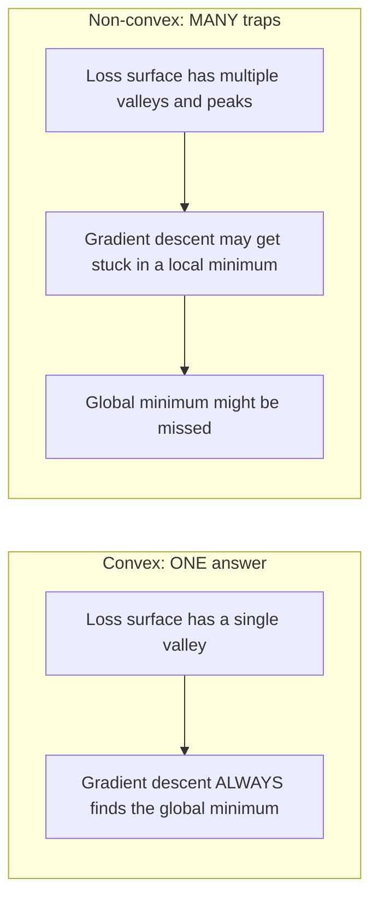
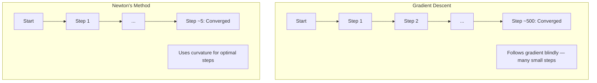
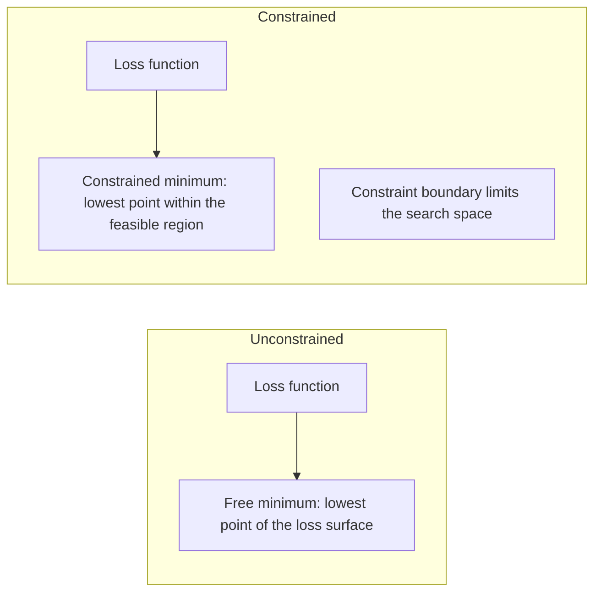
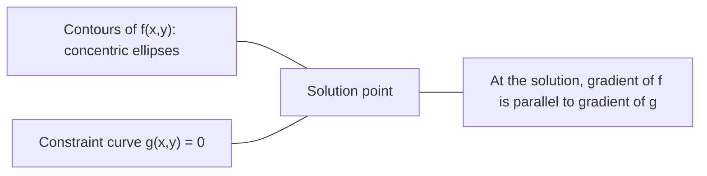

# Выпуклая оптимизация

> У выпуклых задач одна долина. У нейронных сетей их миллионы. Понимание разницы имеет значение.

**Тип:** Build
**Язык:** Python
**Предварительные требования:** этап 1, уроки 04 («Математический анализ для ML»), 08 («Оптимизация»)
**Время:** ~90 минут

## Цели обучения

- Проверять функцию на выпуклость с помощью определения, критерия второй производной и критерия Гессиана
- Реализовать метод Ньютона и сравнить его квадратичную сходимость с градиентным спуском
- Решать задачи оптимизации с ограничениями с помощью множителей Лагранжа и интерпретировать условия KKT
- Объяснять, почему ландшафты функции потерь нейронных сетей невыпуклы, но SGD всё же находит хорошие решения

## Проблема

Урок 08 научил вас градиентному спуску, моменту и Adam. Эти оптимизаторы спускаются вниз по любой поверхности. Но они не дают никаких гарантий. Градиентный спуск на невыпуклом ландшафте может попасть в плохой локальный минимум, застрять в седловой точке или колебаться бесконечно. Вы всё равно использовали его, потому что нейронные сети невыпуклы и альтернативы нет.

Но многие задачи машинного обучения выпуклы. Линейная регрессия, логистическая регрессия, SVM, LASSO, гребневая регрессия. Для них существует нечто более сильное: оптимизация с математическими гарантиями. Выпуклая задача имеет ровно одну долину. Любой алгоритм, спускающийся вниз, достигнет глобального минимума. Не нужны перезапуски. Не нужны расписания скорости обучения. Не нужна молитва.

Понимание выпуклости делает три вещи. Во-первых, оно говорит вам, когда ваша задача лёгкая (выпуклая), а когда сложная (невыпуклая). Во-вторых, оно даёт более быстрые инструменты, такие как метод Ньютона, для выпуклых задач. В-третьих, оно объясняет концепции, встречающиеся повсюду в ML: регуляризацию как ограничение, двойственность в SVM и то, почему глубокое обучение работает, несмотря на нарушение всех приятных свойств, которые даёт выпуклость.

## Концепция

### Выпуклые множества

Множество S выпукло, если для любых двух точек из S отрезок между ними целиком лежит в S.

| Выпуклые множества | Невыпуклые множества |
|---|---|
| **Прямоугольник**: любые две точки внутри можно соединить отрезком, который остаётся внутри | **Звезда/полумесяц**: отрезок между двумя внутренними точками может выходить за пределы множества |
| **Треугольник**: то же свойство выполняется для всех внутренних точек | **Тор (кольцо)**: из-за отверстия некоторые отрезки покидают множество |
| Отрезок между любыми двумя точками остаётся внутри множества | Отрезок между некоторыми парами точек выходит за пределы множества |

Формальный тест: для любых точек x, y из S и любого t из [0, 1] точка tx + (1-t)y также принадлежит S.

Примеры выпуклых множеств:
- Прямая, плоскость, всё пространство R^n
- Шар (окружность, сфера, гиперсфера)
- Полупространство: {x : a^T x <= b}
- Пересечение любого числа выпуклых множеств

Примеры невыпуклых множеств:
- Тор (кольцо)
- Объединение двух непересекающихся окружностей
- Любое множество с «вмятиной» или «дырой»

### Выпуклые функции

Функция f выпукла, если её область определения — выпуклое множество и для любых двух точек x, y из её области определения и любого t из [0, 1]:

```
f(tx + (1-t)y) <= t*f(x) + (1-t)*f(y)
```

Геометрически: отрезок между любыми двумя точками на графике лежит выше графика или на нём.

| Свойство | Выпуклая функция | Невыпуклая функция |
|---|---|---|
| **Тест отрезком** | Отрезок между любыми двумя точками на графике лежит **выше кривой или на ней** | Отрезок между некоторыми точками на графике опускается **ниже** кривой |
| **Форма** | Единственная чаша/долина, изгибающаяся вверх | Несколько пиков и долин со смешанной кривизной |
| **Локальные минимумы** | Каждый локальный минимум является глобальным минимумом | Может существовать несколько локальных минимумов на разной высоте |

Распространённые выпуклые функции:
- f(x) = x^2 (парабола)
- f(x) = |x| (абсолютное значение)
- f(x) = e^x (экспонента)
- f(x) = max(0, x) (ReLU, хотя и кусочно-линейная)
- f(x) = -log(x) при x > 0 (отрицательный логарифм)
- Любая линейная функция f(x) = a^T x + b (одновременно выпуклая и вогнутая)

### Проверка выпуклости

Три практических теста, от самого простого до самого строгого.

**Тест 1: тест второй производной (1D).** Если f''(x) >= 0 для всех x, то f выпукла.

- f(x) = x^2: f''(x) = 2 >= 0. Выпукла.
- f(x) = x^3: f''(x) = 6x. Отрицательна при x < 0. Не выпукла.
- f(x) = e^x: f''(x) = e^x > 0. Выпукла.

**Тест 2: тест Гессиана (многомерный).** Если матрица Гессе H(x) положительно полуопределена для всех x, то f выпукла. Гессиан — это матрица вторых частных производных.

**Тест 3: тест по определению.** Проверьте неравенство f(tx + (1-t)y) <= t*f(x) + (1-t)*f(y) напрямую. Полезно для функций, для которых производные трудно вычислить.

### Почему выпуклость важна

Центральная теорема выпуклой оптимизации:

**Для выпуклой функции каждый локальный минимум является глобальным минимумом.**

Это значит, что градиентный спуск не может застрять. Любой путь вниз приводит к одному и тому же ответу. Алгоритм гарантированно сходится к оптимальному решению.



Следствия:
- Не нужны случайные перезапуски
- Не нужны сложные расписания скорости обучения
- Возможны доказательства сходимости (скорость зависит от свойств функции)
- Решение единственно (с точностью до плоских областей)

### Выпуклое против невыпуклого в ML

| Задача | Выпукла? | Почему |
|---------|---------|-----|
| Линейная регрессия (MSE) | Да | Функция потерь квадратична по весам |
| Логистическая регрессия | Да | Логарифмическая функция потерь выпукла по весам |
| SVM (шарнирная функция потерь) | Да | Максимум линейных функций |
| LASSO (L1-регрессия) | Да | Сумма выпуклых функций выпукла |
| Гребневая регрессия (L2) | Да | Квадратичная + квадратичная = выпуклая |
| Нейронная сеть (любая функция потерь) | Нет | Нелинейные функции активации создают невыпуклый ландшафт |
| Кластеризация k-means | Нет | Дискретный шаг присвоения |
| Матричная факторизация | Нет | Произведение неизвестных |

Линейные модели с выпуклыми функциями потерь выпуклы. В момент, когда вы добавляете скрытые слои с нелинейными функциями активации, выпуклость нарушается.

### Матрица Гессе

Гессиан H функции f: R^n -> R — это матрица n x n вторых частных производных.

```
H[i][j] = d^2 f / (dx_i dx_j)
```

Для f(x, y) = x^2 + 3xy + y^2:

```
df/dx = 2x + 3y       d^2f/dx^2 = 2      d^2f/dxdy = 3
df/dy = 3x + 2y       d^2f/dydx = 3      d^2f/dy^2 = 2

H = [ 2  3 ]
    [ 3  2 ]
```

Гессиан рассказывает о кривизне:
- Все собственные значения положительны: функция изгибается вверх в каждом направлении (выпукла в этой точке)
- Все собственные значения отрицательны: изгибается вниз в каждом направлении (вогнута, локальный максимум)
- Смешанные знаки: седловая точка (изгибается вверх в одних направлениях, вниз в других)
- Нулевое собственное значение: плоская в этом направлении (вырожденный случай)

Для выпуклости Гессиан должен быть положительно полуопределён (все собственные значения >= 0) везде, а не только в одной точке.

### Метод Ньютона

Градиентный спуск использует информацию первого порядка (градиент). Метод Ньютона использует информацию второго порядка (Гессиан). Он строит квадратичное приближение в текущей точке и прыгает прямо к минимуму этой квадратичной функции.

```
Update rule:
  x_new = x - H^(-1) * gradient

Compare to gradient descent:
  x_new = x - lr * gradient
```

Метод Ньютона заменяет скалярную скорость обучения обратным Гессианом. Это автоматически подстраивает размер и направление шага на основе локальной кривизны.



Преимущества:
- Квадратичная сходимость вблизи минимума (ошибка возводится в квадрат на каждом шаге)
- Не нужно подбирать скорость обучения
- Инвариантность к масштабу (работает независимо от того, как вы параметризуете задачу)

Недостатки:
- Вычисление Гессиана стоит O(n^2) памяти и O(n^3) для обращения
- Для нейронной сети с 1 миллионом весов это 10^12 элементов и 10^18 операций
- Непрактично для глубокого обучения

### Оптимизация с ограничениями

Оптимизация без ограничений: минимизировать f(x) по всем x.
Оптимизация с ограничениями: минимизировать f(x) при ограничениях.

Реальные задачи имеют ограничения. Вы хотите минимизировать затраты, но ваш бюджет ограничен. Вы хотите минимизировать ошибку, но сложность вашей модели ограничена.



### Множители Лагранжа

Метод множителей Лагранжа превращает задачу с ограничениями в задачу без ограничений.

Задача: минимизировать f(x) при ограничении g(x) = 0.

Решение: вводится новая переменная (множитель Лагранжа lambda), и решается задача без ограничений:

```
L(x, lambda) = f(x) + lambda * g(x)
```

В решении градиент L равен нулю:

```
dL/dx = df/dx + lambda * dg/dx = 0
dL/dlambda = g(x) = 0
```

Геометрическая интуиция: в точке условного минимума градиент f должен быть параллелен градиенту ограничения g. Если бы они не были параллельны, можно было бы двигаться вдоль поверхности ограничения и дополнительно уменьшить f.



Пример: минимизировать f(x,y) = x^2 + y^2 при ограничении x + y = 1.

```
L = x^2 + y^2 + lambda(x + y - 1)

dL/dx = 2x + lambda = 0  =>  x = -lambda/2
dL/dy = 2y + lambda = 0  =>  y = -lambda/2
dL/dlambda = x + y - 1 = 0

From first two: x = y
Substituting: 2x = 1, so x = y = 0.5, lambda = -1
```

Ближайшая точка на прямой x + y = 1 к началу координат — это (0.5, 0.5).

### Условия KKT

Условия Каруша-Куна-Таккера расширяют множители Лагранжа на ограничения-неравенства.

Задача: минимизировать f(x) при g_i(x) <= 0 для i = 1, ..., m.

Условия KKT (необходимые для оптимальности):

```
1. Stationarity:    df/dx + sum(lambda_i * dg_i/dx) = 0
2. Primal feasibility:  g_i(x) <= 0  for all i
3. Dual feasibility:    lambda_i >= 0  for all i
4. Complementary slackness:  lambda_i * g_i(x) = 0  for all i
```

Дополняющая нежёсткость — ключевая идея: либо ограничение активно (g_i = 0, решение лежит на границе), либо множитель равен нулю (ограничение не имеет значения). Ограничение, не влияющее на решение, имеет lambda = 0.

Условия KKT центральны для SVM. Опорные векторы — это точки данных, для которых ограничение активно (lambda > 0). Все остальные точки данных имеют lambda = 0 и не влияют на границу принятия решения.

### Регуляризация как оптимизация с ограничениями

L1- и L2-регуляризация — не произвольные трюки. Это замаскированные задачи оптимизации с ограничениями.

**L2-регуляризация (гребневая):**

```
minimize  Loss(w)  subject to  ||w||^2 <= t

Equivalent unconstrained form:
minimize  Loss(w) + lambda * ||w||^2
```

Ограничение ||w||^2 <= t задаёт шар (круг в 2D, сфера в 3D). Решение — это точка, где контуры функции потерь впервые касаются этого шара.

**L1-регуляризация (LASSO):**

```
minimize  Loss(w)  subject to  ||w||_1 <= t

Equivalent unconstrained form:
minimize  Loss(w) + lambda * ||w||_1
```

Ограничение ||w||_1 <= t задаёт ромб (повёрнутый квадрат в 2D).

| Свойство | L2-ограничение (окружность) | L1-ограничение (ромб) |
|---|---|---|
| **Форма ограничения** | Окружность (сфера в высоких размерностях) | Ромб (повёрнутый квадрат в 2D) |
| **Где контур потерь касается** | Гладкая граница — любая точка на окружности | Угол — совпадает с осью |
| **Поведение решения** | Веса малы, но ненулевые | Некоторые веса точно равны нулю (разреженность) |
| **Результат** | Сжатие весов | Отбор признаков |

Это объясняет, почему L1 даёт разреженные модели (отбор признаков), в то время как L2 лишь стягивает веса. Ромб имеет углы, выровненные по осям. Контуры функции потерь скорее коснутся угла, обнуляя одно или несколько весов.

### Двойственность

У каждой задачи оптимизации с ограничениями (прямой задачи) есть парная задача (двойственная). Для выпуклых задач прямая и двойственная задачи имеют одно и то же оптимальное значение. Это сильная двойственность.

Лагранжева двойственная функция:

```
Primal: minimize f(x) subject to g(x) <= 0
Lagrangian: L(x, lambda) = f(x) + lambda * g(x)
Dual function: d(lambda) = min_x L(x, lambda)
Dual problem: maximize d(lambda) subject to lambda >= 0
```

Почему двойственность важна:
- Двойственную задачу иногда проще решить, чем прямую
- SVM решаются в двойственной форме, где задача зависит от скалярных произведений между точками данных (это позволяет применить трюк с ядром)
- Двойственная задача даёт нижнюю границу для оптимума прямой задачи, что полезно для проверки качества решения

Конкретно для SVM:

```
Primal: find w, b that maximize the margin 2/||w|| subject to
        y_i(w^T x_i + b) >= 1 for all i

Dual:   maximize sum(alpha_i) - 0.5 * sum_ij(alpha_i * alpha_j * y_i * y_j * x_i^T x_j)
        subject to alpha_i >= 0 and sum(alpha_i * y_i) = 0

The dual only involves dot products x_i^T x_j.
Replace x_i^T x_j with K(x_i, x_j) to get the kernel trick.
```

### Почему глубокое обучение работает, несмотря на невыпуклость

Функции потерь нейронных сетей крайне невыпуклы. По всем классическим меркам их оптимизация должна терпеть неудачу. Тем не менее стохастический градиентный спуск надёжно находит хорошие решения. Это объясняется несколькими факторами.

**Большинство локальных минимумов достаточно хороши.** В пространствах высокой размерности случайные критические точки (где градиент равен нулю) в подавляющем большинстве являются седловыми точками, а не локальными минимумами. Те немногие локальные минимумы, что существуют, как правило, имеют значения потерь, близкие к глобальному минимуму. Застрять в ужасном локальном минимуме крайне маловероятно, когда пространство параметров имеет миллионы измерений.

**Седловые точки, а не локальные минимумы, — настоящее препятствие.** В функции с n параметрами седловая точка имеет смесь направлений положительной и отрицательной кривизны. Для случайной критической точки в высокой размерности вероятность того, что все n собственных значений положительны (локальный минимум), составляет примерно 2^(-n). Почти все критические точки — седловые. Шум SGD помогает выбраться из них.

**Избыточная параметризация сглаживает ландшафт.** Сети с бо́льшим числом параметров, чем обучающих примеров, имеют более гладкие, более связные поверхности потерь. У более широких сетей меньше плохих локальных минимумов. Это противоречит интуиции, но эмпирически подтверждается неизменно.

**Структура ландшафта потерь:**

| Свойство | Пространство низкой размерности | Пространство высокой размерности |
|---|---|---|
| **Ландшафт** | Много изолированных пиков и долин | Гладко связанные долины |
| **Минимумы** | Много изолированных локальных минимумов | Мало плохих локальных минимумов; большинство близки к оптимуму |
| **Навигация** | Трудно найти глобальный минимум | Много путей ведут к хорошим решениям |
| **Критические точки** | Смесь локальных минимумов и седловых точек | Подавляющее большинство — седловые точки, а не локальные минимумы |

**Стохастический шум действует как неявная регуляризация.** Мини-пакетный SGD добавляет шум, который не даёт остановиться в резких минимумах. Резкие минимумы переобучаются; плоские минимумы обобщаются. Шум смещает оптимизацию в сторону плоских областей ландшафта потерь.

### Методы второго порядка на практике

Чистый метод Ньютона непрактичен для больших моделей. Несколько приближений делают информацию второго порядка пригодной для использования.

**L-BFGS (BFGS с ограниченной памятью):** Приближает обратный Гессиан, используя последние m разностей градиента. Требует O(mn) памяти вместо O(n^2). Хорошо работает для задач с числом параметров до ~10 000. Используется в классическом ML (логистическая регрессия, CRF), но не в глубоком обучении.

**Естественный градиент:** Использует матрицу информации Фишера (ожидаемый Гессиан логарифма правдоподобия) вместо стандартного Гессиана. Это учитывает геометрию распределений вероятностей. K-FAC (Kronecker-Factored Approximate Curvature) приближает матрицу Фишера произведением Кронекера, делая её пригодной для нейронных сетей.

**Безгессианова оптимизация:** Использует метод сопряжённых градиентов для решения Hx = g, никогда не формируя H напрямую. Требует только произведений Гессиана на вектор, которые можно вычислить за O(n) с помощью автоматического дифференцирования.

**Диагональные приближения:** Второй момент Adam — это диагональное приближение диагонали Гессиана. AdaHessian расширяет этот подход, используя фактические диагональные элементы Гессиана через оценщик Хатчинсона.

| Метод | Память | Стоимость шага | Когда использовать |
|--------|--------|--------------|-------------|
| Градиентный спуск | O(n) | O(n) | Базовый вариант, большие модели |
| Метод Ньютона | O(n^2) | O(n^3) | Небольшие выпуклые задачи |
| L-BFGS | O(mn) | O(mn) | Выпуклые задачи среднего размера |
| Adam | O(n) | O(n) | Стандарт в глубоком обучении |
| K-FAC | O(n) | O(n) на слой | Исследования, обучение с большими пакетами |

```figure
convex-vs-nonconvex
```

## Реализация

### Шаг 1: Проверка выпуклости

Постройте функцию, которая эмпирически проверяет выпуклость, сэмплируя точки и проверяя определение.

```python
import random
import math

def check_convexity(f, dim, bounds=(-5, 5), samples=1000):
    violations = 0
    for _ in range(samples):
        x = [random.uniform(*bounds) for _ in range(dim)]
        y = [random.uniform(*bounds) for _ in range(dim)]
        t = random.uniform(0, 1)
        mid = [t * xi + (1 - t) * yi for xi, yi in zip(x, y)]
        lhs = f(mid)
        rhs = t * f(x) + (1 - t) * f(y)
        if lhs > rhs + 1e-10:
            violations += 1
    return violations == 0, violations
```

### Шаг 2: Метод Ньютона для 2D

Реализуйте метод Ньютона с явным Гессианом. Сравните скорость сходимости с градиентным спуском.

```python
def newtons_method(f, grad_f, hessian_f, x0, steps=50, tol=1e-12):
    x = list(x0)
    history = [x[:]]
    for _ in range(steps):
        g = grad_f(x)
        H = hessian_f(x)
        det = H[0][0] * H[1][1] - H[0][1] * H[1][0]
        if abs(det) < 1e-15:
            break
        H_inv = [
            [H[1][1] / det, -H[0][1] / det],
            [-H[1][0] / det, H[0][0] / det],
        ]
        dx = [
            H_inv[0][0] * g[0] + H_inv[0][1] * g[1],
            H_inv[1][0] * g[0] + H_inv[1][1] * g[1],
        ]
        x = [x[0] - dx[0], x[1] - dx[1]]
        history.append(x[:])
        if sum(gi ** 2 for gi in g) < tol:
            break
    return history
```

### Шаг 3: Решатель множителей Лагранжа

Решите задачу оптимизации с ограничениями с помощью градиентного спуска на Лагранжиане.

```python
def lagrange_solve(f_grad, g_val, g_grad, x0, lr=0.01,
                   lr_lambda=0.01, steps=5000):
    x = list(x0)
    lam = 0.0
    history = []
    for _ in range(steps):
        fg = f_grad(x)
        gv = g_val(x)
        gg = g_grad(x)
        x = [
            xi - lr * (fgi + lam * ggi)
            for xi, fgi, ggi in zip(x, fg, gg)
        ]
        lam = lam + lr_lambda * gv
        history.append((x[:], lam, gv))
    return history
```

### Шаг 4: Сравнение методов первого и второго порядка

Запустите градиентный спуск и метод Ньютона на одной и той же квадратичной функции. Посчитайте число шагов до сходимости.

```python
def quadratic(x):
    return 5 * x[0] ** 2 + x[1] ** 2

def quadratic_grad(x):
    return [10 * x[0], 2 * x[1]]

def quadratic_hessian(x):
    return [[10, 0], [0, 2]]
```

Метод Ньютона сойдётся за 1 шаг (он точен для квадратичных функций). Градиентному спуску потребуются сотни шагов, потому что собственные значения Гессиана отличаются в 5 раз, создавая вытянутую долину.

## Использование

Анализ выпуклости напрямую применяется при выборе моделей ML и решателей.

Для выпуклых задач (логистическая регрессия, SVM, LASSO):
- Используйте специализированные решатели (liblinear, CVXPY, scipy.optimize.minimize с method='L-BFGS-B')
- Ожидайте единственное глобальное решение
- Методы второго порядка практичны и быстры

Для невыпуклых задач (нейронные сети):
- Используйте методы первого порядка (SGD, Adam)
- Смиритесь с тем, что решение зависит от инициализации и случайности
- Используйте избыточную параметризацию, шум и расписания скорости обучения как неявную регуляризацию
- Не тратьте время на поиск глобального минимума. Хорошего локального минимума достаточно.

```python
from scipy.optimize import minimize

result = minimize(
    fun=lambda w: sum((y - X @ w) ** 2) + 0.1 * sum(w ** 2),
    x0=np.zeros(d),
    method='L-BFGS-B',
    jac=lambda w: -2 * X.T @ (y - X @ w) + 0.2 * w,
)
```

Для SVM двойственная формулировка позволяет использовать трюк с ядром:

```python
from sklearn.svm import SVC

svm = SVC(kernel='rbf', C=1.0)
svm.fit(X_train, y_train)
print(f"Support vectors: {svm.n_support_}")
```

## Упражнения

1. **Галерея выпуклости.** Проверьте эти функции на выпуклость с помощью проверялки: f(x) = x^4, f(x) = sin(x), f(x,y) = x^2 + y^2, f(x,y) = x*y, f(x) = max(x, 0). Объясните, почему каждый результат имеет смысл.

2. **Гонка Ньютона против градиентного спуска.** Запустите оба метода на f(x,y) = 50*x^2 + y^2, начиная с точки (10, 10). Сколько шагов требуется каждому, чтобы достичь потерь < 1e-10? Что происходит с градиентным спуском при увеличении числа обусловленности (отношения наибольшего собственного значения Гессиана к наименьшему)?

3. **Геометрия множителей Лагранжа.** Минимизируйте f(x,y) = (x-3)^2 + (y-3)^2 при ограничении x + 2y = 4. Проверьте решение, убедившись, что градиент f параллелен градиенту g в решении.

4. **Ограничение регуляризации.** Реализуйте оптимизацию с L1-ограничением: минимизируйте (x-3)^2 + (y-2)^2 при |x| + |y| <= 1. Покажите, что решение имеет одну координату, равную нулю (разреженность от ромбовидного ограничения).

5. **Анализ собственных значений Гессиана.** Вычислите Гессиан функции Розенброка в точках (1,1) и (-1,1). Вычислите собственные значения в обеих точках. О чём говорят собственные значения о кривизне в минимуме по сравнению с точкой вдали от него?

## Ключевые термины

| Термин | Что это означает |
|------|---------------|
| Выпуклое множество | Множество, в котором отрезок между любыми двумя его точками остаётся внутри множества |
| Выпуклая функция | Функция, у которой отрезок между любыми двумя точками её графика лежит выше графика или на нём. Эквивалентно: Гессиан всюду положительно полуопределён |
| Локальный минимум | Точка ниже всех соседних точек. Для выпуклых функций каждый локальный минимум является глобальным |
| Глобальный минимум | Самая низкая точка функции на всей области определения |
| Матрица Гессе | Матрица всех вторых частных производных. Кодирует информацию о кривизне |
| Положительно полуопределённая матрица | Матрица, все собственные значения которой неотрицательны. Многомерный аналог условия «вторая производная >= 0» |
| Число обусловленности | Отношение наибольшего собственного значения Гессиана к наименьшему. Большое число обусловленности означает вытянутые долины и медленный градиентный спуск |
| Метод Ньютона | Оптимизатор второго порядка, использующий обратный Гессиан для определения направления и размера шага. Квадратичная сходимость вблизи минимума |
| Множитель Лагранжа | Переменная, вводимая для превращения задачи оптимизации с ограничениями в задачу без ограничений |
| Условия KKT | Необходимые условия оптимальности при ограничениях-неравенствах. Обобщают множители Лагранжа |
| Дополняющая нежёсткость | В решении либо ограничение активно, либо его множитель равен нулю. Никогда оба не отличны от нуля одновременно |
| Двойственность | У каждой задачи с ограничениями есть парная двойственная задача. Для выпуклых задач обе имеют одно и то же оптимальное значение |
| Сильная двойственность | Оптимальные значения прямой и двойственной задач равны. Выполняется для выпуклых задач, удовлетворяющих условию Слейтера |
| L-BFGS | Приближённый метод второго порядка, хранящий последние m разностей градиента вместо полного Гессиана |
| Седловая точка | Точка, где градиент равен нулю, но которая является минимумом в одних направлениях и максимумом в других |
| Избыточная параметризация | Использование большего числа параметров, чем обучающих примеров. Сглаживает ландшафт потерь и уменьшает число плохих локальных минимумов |

## Дополнительные материалы

- [Boyd & Vandenberghe: Convex Optimization](https://web.stanford.edu/~boyd/cvxbook/) - стандартный учебник, бесплатно доступный онлайн
- [Bottou, Curtis, Nocedal: Optimization Methods for Large-Scale Machine Learning (2018)](https://arxiv.org/abs/1606.04838) - связывает теорию выпуклой оптимизации с практикой глубокого обучения
- [Choromanska et al.: The Loss Surfaces of Multilayer Networks (2015)](https://arxiv.org/abs/1412.0233) - объясняет, почему невыпуклые ландшафты нейронных сетей не так плохи, как кажутся
- [Nocedal & Wright: Numerical Optimization](https://link.springer.com/book/10.1007/978-0-387-40065-5) - подробный справочник по методу Ньютона, L-BFGS и оптимизации с ограничениями
