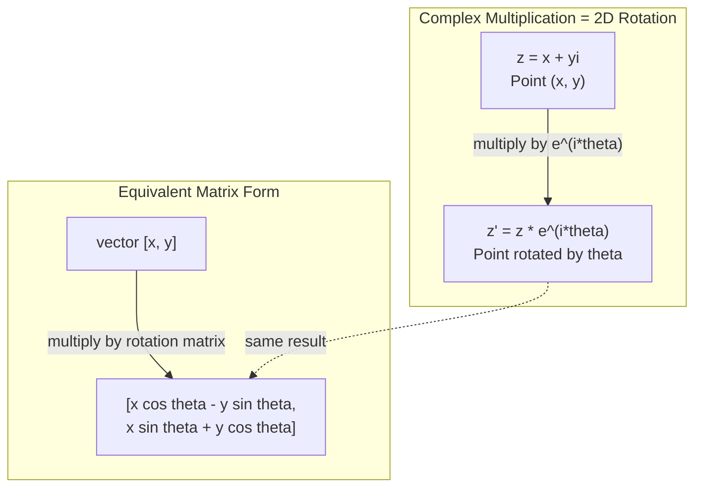
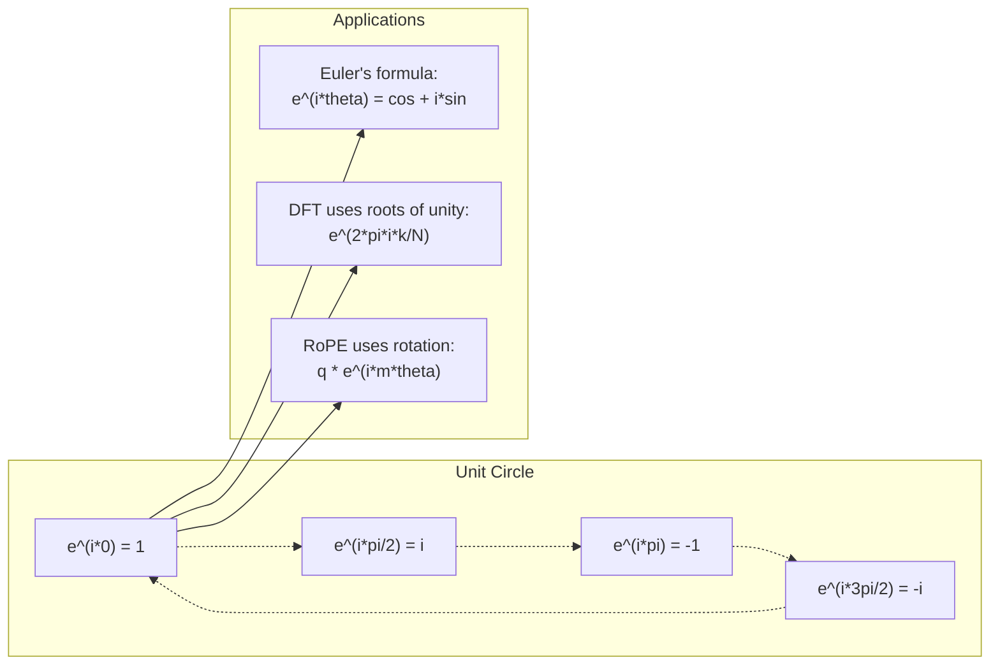

# Комплексные числа для ИИ

> Квадратный корень из -1 — не мнимое число. Это ключ к вращениям, частотам и половине обработки сигналов.

**Тип:** Learn
**Язык:** Python
**Предварительные требования:** Фаза 1, Уроки 01-04 (линейная алгебра, математический анализ)
**Время:** ~60 минут

## Цели обучения

- Выполнять арифметические операции с комплексными числами (сложение, умножение, деление, сопряжение) как в прямоугольной, так и в полярной форме
- Применять формулу Эйлера для перехода между комплексными экспонентами и тригонометрическими функциями
- Реализовать дискретное преобразование Фурье, используя комплексные корни из единицы
- Объяснить, как комплексные вращения лежат в основе RoPE и синусоидальных позиционных кодировок в трансформерах

## Проблема

Вы открываете статью о преобразованиях Фурье, и там повсюду `i`. Вы смотрите на позиционные кодировки трансформера и видите `sin` и `cos` на разных частотах — вещественную и мнимую части комплексных экспонент. Вы читаете о квантовых вычислениях и обнаруживаете, что всё выражено в комплексных векторных пространствах.

Комплексные числа кажутся абстрактными. Числовая система, построенная на квадратном корне из -1, ощущается как математический трюк. Но это не трюк. Это естественный язык вращений и колебаний. Каждый раз, когда что-то вращается, вибрирует или колеблется, комплексные числа — правильный инструмент.

Без понимания комплексных чисел вы не сможете понять дискретное преобразование Фурье. Вы не сможете понять FFT. Вы не сможете понять, как работает RoPE (Rotary Position Embedding) в современных языковых моделях. Вы не сможете понять, почему синусоидальные позиционные кодировки в оригинальной статье о трансформере используют именно такие частоты.

Этот урок строит арифметику комплексных чисел с нуля, связывает её с геометрией и точно показывает, где комплексные числа встречаются в машинном обучении.

## Концепция

### Что такое комплексное число?

Комплексное число состоит из двух частей: вещественной и мнимой.

```
z = a + bi

where:
  a is the real part
  b is the imaginary part
  i is the imaginary unit, defined by i^2 = -1
```

Вот и всё. Вы расширяете числовую прямую до плоскости. Вещественные числа располагаются на одной оси. Мнимые числа — на другой. Каждое комплексное число — это точка на этой плоскости.

### Арифметика комплексных чисел

**Сложение.** Сложите вещественные части друг с другом, сложите мнимые части друг с другом.

```
(a + bi) + (c + di) = (a + c) + (b + d)i

Example: (3 + 2i) + (1 + 4i) = 4 + 6i
```

**Умножение.** Используйте распределительный закон и помните, что i^2 = -1.

```
(a + bi)(c + di) = ac + adi + bci + bdi^2
                 = ac + adi + bci - bd
                 = (ac - bd) + (ad + bc)i

Example: (3 + 2i)(1 + 4i) = 3 + 12i + 2i + 8i^2
                            = 3 + 14i - 8
                            = -5 + 14i
```

**Сопряжение.** Смените знак мнимой части.

```
conjugate of (a + bi) = a - bi
```

Произведение комплексного числа и его сопряжённого всегда вещественно:

```
(a + bi)(a - bi) = a^2 + b^2
```

**Деление.** Умножьте числитель и знаменатель на сопряжённое знаменателя.

```
(a + bi) / (c + di) = (a + bi)(c - di) / (c^2 + d^2)
```

Это устраняет мнимую часть из знаменателя, давая вам чистое комплексное число.

### Комплексная плоскость

Комплексная плоскость сопоставляет каждое комплексное число точке на плоскости 2D. Горизонтальная ось — вещественная ось, вертикальная ось — мнимая ось.

```
z = 3 + 2i  corresponds to the point (3, 2)
z = -1 + 0i corresponds to the point (-1, 0) on the real axis
z = 0 + 4i  corresponds to the point (0, 4) on the imaginary axis
```

Комплексное число одновременно является и точкой, и вектором из начала координат. Именно эта двойная интерпретация делает комплексные числа полезными для геометрии.

### Полярная форма

Любую точку на плоскости можно описать её расстоянием от начала координат и углом от положительной вещественной оси.

```
z = r * (cos(theta) + i*sin(theta))

where:
  r = |z| = sqrt(a^2 + b^2)     (magnitude, or modulus)
  theta = atan2(b, a)             (phase, or argument)
```

Прямоугольная форма (a + bi) удобна для сложения. Полярная форма (r, theta) удобна для умножения.

**Умножение в полярной форме.** Перемножьте модули, сложите углы.

```
z1 = r1 * e^(i*theta1)
z2 = r2 * e^(i*theta2)

z1 * z2 = (r1 * r2) * e^(i*(theta1 + theta2))
```

Именно поэтому комплексные числа идеально подходят для вращений. Умножение на комплексное число с модулем 1 — это чистое вращение.

### Формула Эйлера

Мост между комплексными экспонентами и тригонометрией:

```
e^(i*theta) = cos(theta) + i*sin(theta)
```

Это самая важная формула в этом уроке. При theta = pi:

```
e^(i*pi) = cos(pi) + i*sin(pi) = -1 + 0i = -1

Therefore: e^(i*pi) + 1 = 0
```

Пять фундаментальных констант (e, i, pi, 1, 0), связанных в одном уравнении.

### Почему формула Эйлера важна для ML

Формула Эйлера утверждает, что `e^(i*theta)` описывает единичную окружность по мере изменения theta. При theta = 0 вы находитесь в точке (1, 0). При theta = pi/2 — в точке (0, 1). При theta = pi — в точке (-1, 0). При theta = 3*pi/2 — в точке (0, -1). Полный оборот — это theta = 2*pi.

Это означает, что комплексные экспоненты ЯВЛЯЮТСЯ вращениями. А вращения повсюду в обработке сигналов и ML.

### Связь с 2D-вращениями

Умножение комплексного числа (x + yi) на e^(i*theta) поворачивает точку (x, y) на угол theta вокруг начала координат.

```
Rotation via complex multiplication:
  (x + yi) * (cos(theta) + i*sin(theta))
  = (x*cos(theta) - y*sin(theta)) + (x*sin(theta) + y*cos(theta))i

Rotation via matrix multiplication:
  [cos(theta)  -sin(theta)] [x]   [x*cos(theta) - y*sin(theta)]
  [sin(theta)   cos(theta)] [y] = [x*sin(theta) + y*cos(theta)]
```

Они дают идентичные результаты. Умножение комплексных чисел И ЕСТЬ 2D-вращение. Матрица вращения — это просто умножение комплексных чисел, записанное в матричной нотации.



### Фазоры и вращающиеся сигналы

Комплексная экспонента e^(i*omega*t) — это точка, вращающаяся по единичной окружности с угловой частотой omega. По мере роста t точка описывает окружность.

Вещественная часть этой вращающейся точки — cos(omega*t). Мнимая часть — sin(omega*t). Синусоидальный сигнал — это тень вращающегося комплексного числа.

```
e^(i*omega*t) = cos(omega*t) + i*sin(omega*t)

Real part:      cos(omega*t)    -- a cosine wave
Imaginary part: sin(omega*t)    -- a sine wave
```

Это представление в виде фазора. Вместо отслеживания извилистой синусоиды вы отслеживаете плавно вращающуюся стрелку. Сдвиги фазы становятся смещениями угла. Изменения амплитуды становятся изменениями модуля. Сложение сигналов становится сложением векторов.

### Корни из единицы

N-е корни из единицы — это N точек, равномерно расположенных на единичной окружности:

```
w_k = e^(2*pi*i*k/N)    for k = 0, 1, 2, ..., N-1
```

Для N = 4 корни: 1, i, -1, -i (четыре стороны света компаса).
Для N = 8 вы получаете четыре стороны света плюс четыре диагонали.

Корни из единицы — основа дискретного преобразования Фурье. DFT раскладывает сигнал на компоненты на этих N равномерно расположенных частотах.

### Связь с DFT

Дискретное преобразование Фурье сигнала x[0], x[1], ..., x[N-1]:

```
X[k] = sum_{n=0}^{N-1} x[n] * e^(-2*pi*i*k*n/N)
```

Каждое X[k] измеряет, насколько сигнал коррелирует с k-м корнем из единицы — комплексной синусоидой на частоте k. DFT разбивает сигнал на N вращающихся фазоров и сообщает вам амплитуду и фазу каждого из них.

### Почему i — не мнимое число

Слово «мнимое» (imaginary) — историческая случайность. Декарт использовал его пренебрежительно. Но i не более мнимо, чем отрицательные числа были, когда люди впервые их отвергали. Отрицательные числа отвечают на вопрос: «что получится, если вычесть 5 из 3?» Мнимая единица отвечает на вопрос: «что нужно возвести в квадрат, чтобы получить -1?»

Более полезная трактовка: i — оператор поворота на 90 градусов. Умножьте вещественное число на i один раз — вы повернётесь на 90 градусов к мнимой оси. Умножьте на i снова (i^2) — вы повернётесь ещё на 90 градусов и теперь указываете в отрицательном вещественном направлении. Вот почему i^2 = -1. В этом нет никакой мистики. Это пол-оборота, составленный из двух четверть-оборотов.

Именно поэтому комплексные числа повсюду встречаются в инженерии. Всё, что вращается — электромагнитные волны, квантовые состояния, колебания сигналов, позиционные кодировки, — естественным образом описывается комплексными числами.

### Комплексные экспоненты против тригонометрических функций

До формулы Эйлера инженеры записывали сигналы как A*cos(omega*t + phi) — амплитуда A, частота omega, фаза phi. Это работает, но делает арифметику мучительной. Сложение двух косинусоид с разными фазами требует тригонометрических тождеств.

С комплексными экспонентами тот же сигнал — это A*e^(i*(omega*t + phi)). Сложение двух сигналов — это просто сложение двух комплексных чисел. Умножение (модуляция) — это просто перемножение модулей и сложение углов. Сдвиги фазы становятся сложением углов. Сдвиги частоты становятся умножением на фазоры.

Вся область обработки сигналов перешла на нотацию комплексных экспонент, потому что математика становится чище. «Вещественный сигнал» — это всегда просто вещественная часть комплексного представления. Мнимая часть переносится как учётная запись, заставляя всю алгебру естественным образом сходиться.

### Связь с трансформерами

**Синусоидальные позиционные кодировки** (оригинальная статья о трансформере):

```
PE(pos, 2i) = sin(pos / 10000^(2i/d))
PE(pos, 2i+1) = cos(pos / 10000^(2i/d))
```

Пары sin и cos — это вещественная и мнимая части комплексных экспонент на разных частотах. Каждая частота обеспечивает своё «разрешение» для кодирования позиции. Низкие частоты меняются медленно (грубая позиция). Высокие частоты меняются быстро (точная позиция). Вместе они дают каждой позиции уникальный частотный отпечаток.

**RoPE (Rotary Position Embedding)** идёт дальше. Он явно умножает векторы запросов и ключей на комплексные матрицы вращения. Относительная позиция между двумя токенами становится углом поворота. Внимание вычисляется с использованием этих повёрнутых векторов, что делает модель чувствительной к относительной позиции через комплексное умножение.

| Операция | Алгебраическая форма | Геометрический смысл |
|-----------|---------------|-------------------|
| Сложение | (a+c) + (b+d)i | Сложение векторов на плоскости |
| Умножение | (ac-bd) + (ad+bc)i | Поворот и масштабирование |
| Сопряжение | a - bi | Отражение относительно вещественной оси |
| Модуль | sqrt(a^2 + b^2) | Расстояние от начала координат |
| Фаза | atan2(b, a) | Угол от положительной вещественной оси |
| Деление | умножение на сопряжённое | Обратный поворот и масштабирование |
| Степень | r^n * e^(i*n*theta) | Поворот n раз, масштабирование в r^n раз |



```figure
roots-of-unity
```

## Создаём

### Шаг 1: Класс Complex

Постройте класс комплексных чисел, который поддерживает арифметику, модуль, фазу и преобразование между прямоугольной и полярной формами.

```python
import math

class Complex:
    def __init__(self, real, imag=0.0):
        self.real = real
        self.imag = imag

    def __add__(self, other):
        return Complex(self.real + other.real, self.imag + other.imag)

    def __mul__(self, other):
        r = self.real * other.real - self.imag * other.imag
        i = self.real * other.imag + self.imag * other.real
        return Complex(r, i)

    def __truediv__(self, other):
        denom = other.real ** 2 + other.imag ** 2
        r = (self.real * other.real + self.imag * other.imag) / denom
        i = (self.imag * other.real - self.real * other.imag) / denom
        return Complex(r, i)

    def magnitude(self):
        return math.sqrt(self.real ** 2 + self.imag ** 2)

    def phase(self):
        return math.atan2(self.imag, self.real)

    def conjugate(self):
        return Complex(self.real, -self.imag)
```

### Шаг 2: Преобразование в полярную форму и формула Эйлера

```python
def to_polar(z):
    return z.magnitude(), z.phase()

def from_polar(r, theta):
    return Complex(r * math.cos(theta), r * math.sin(theta))

def euler(theta):
    return Complex(math.cos(theta), math.sin(theta))
```

Проверьте: `euler(theta).magnitude()` всегда должно быть равно 1.0. `euler(0)` должно давать (1, 0). `euler(pi)` должно давать (-1, 0).

### Шаг 3: Вращение

Поворот точки (x, y) на угол theta — это одно умножение комплексных чисел:

```python
point = Complex(3, 4)
rotated = point * euler(math.pi / 4)
```

Модуль остаётся тем же. Меняется только угол.

### Шаг 4: DFT из арифметики комплексных чисел

```python
def dft(signal):
    N = len(signal)
    result = []
    for k in range(N):
        total = Complex(0, 0)
        for n in range(N):
            angle = -2 * math.pi * k * n / N
            total = total + Complex(signal[n], 0) * euler(angle)
        result.append(total)
    return result
```

Это DFT со сложностью O(N^2). Каждый выходной X[k] — это сумма отсчётов сигнала, умноженных на корни из единицы.

### Шаг 5: Обратное DFT

Обратное DFT восстанавливает исходный сигнал из его спектра. Единственные изменения по сравнению с прямым DFT: смените знак в показателе степени и разделите на N.

```python
def idft(spectrum):
    N = len(spectrum)
    result = []
    for n in range(N):
        total = Complex(0, 0)
        for k in range(N):
            angle = 2 * math.pi * k * n / N
            total = total + spectrum[k] * euler(angle)
        result.append(Complex(total.real / N, total.imag / N))
    return result
```

Это даёт вам идеальное восстановление. Примените DFT, затем IDFT, и вы получите обратно исходный сигнал с точностью до машинной точности. Информация не теряется.

### Шаг 6: Корни из единицы

```python
def roots_of_unity(N):
    return [euler(2 * math.pi * k / N) for k in range(N)]
```

Проверьте два свойства:
- Каждый корень имеет модуль ровно 1.
- Сумма всех N корней равна нулю (они взаимно уничтожаются по симметрии).

Эти свойства делают DFT обратимым. Корни из единицы образуют ортогональный базис для частотной области.

## Применяем

В Python есть встроенная поддержка комплексных чисел. Литерал `j` представляет мнимую единицу.

```python
z = 3 + 2j
w = 1 + 4j

print(z + w)
print(z * w)
print(abs(z))

import cmath
print(cmath.phase(z))
print(cmath.exp(1j * cmath.pi))
```

Для массивов numpy обрабатывает комплексные числа нативно:

```python
import numpy as np

z = np.array([1+2j, 3+4j, 5+6j])
print(np.abs(z))
print(np.angle(z))
print(np.conj(z))
print(np.real(z))
print(np.imag(z))

signal = np.sin(2 * np.pi * 5 * np.linspace(0, 1, 128))
spectrum = np.fft.fft(signal)
freqs = np.fft.fftfreq(128, d=1/128)
```

## Публикуем

Запустите `code/complex_numbers.py`, чтобы сгенерировать `outputs/skill-complex-arithmetic.md`.

## Упражнения

1. **Арифметика комплексных чисел вручную.** Вычислите (2 + 3i) * (4 - i) и проверьте с помощью кода. Затем вычислите (5 + 2i) / (1 - 3i). Изобразите оба результата на комплексной плоскости и убедитесь, что умножение повернуло и масштабировало первое число.

2. **Последовательность вращений.** Начните с точки (1, 0). Умножьте на e^(i*pi/6) двенадцать раз. Убедитесь, что вы возвращаетесь в (1, 0) после 12 умножений. Выведите координаты на каждом шаге и подтвердите, что они описывают правильный 12-угольник.

3. **DFT известного сигнала.** Создайте сигнал, представляющий собой сумму sin(2*pi*3*t) и 0.5*sin(2*pi*7*t), сэмплированную в 32 точках. Запустите ваше DFT. Убедитесь, что спектр модуля имеет пики на частотах 3 и 7, причём пик на частоте 7 в два раза ниже пика на частоте 3.

4. **Визуализация корней из единицы.** Вычислите 8 корней из единицы. Убедитесь, что их сумма равна нулю. Убедитесь, что умножение любого корня на примитивный корень e^(2*pi*i/8) даёт следующий корень.

5. **Эквивалентность матрице вращения.** Для 10 случайных углов и 10 случайных точек убедитесь, что умножение комплексных чисел даёт тот же результат, что и умножение матрицы на вектор с матрицей вращения 2x2. Выведите максимальную числовую разницу.

## Ключевые термины

| Термин | Что это означает |
|------|---------------|
| Комплексное число | Число a + bi, где a — вещественная часть, b — мнимая часть, а i^2 = -1 |
| Мнимая единица | Число i, определённое как i^2 = -1. Не мнимое в философском смысле — это оператор вращения |
| Комплексная плоскость | Плоскость 2D, где ось x — вещественная, а ось y — мнимая. Также называется плоскостью Аргана |
| Модуль | Расстояние от начала координат: sqrt(a^2 + b^2). Записывается как \|z\| |
| Фаза (аргумент) | Угол от положительной вещественной оси: atan2(b, a). Записывается как arg(z) |
| Сопряжённое число | Зеркальное отражение относительно вещественной оси: сопряжённое к a + bi — это a - bi |
| Полярная форма | Выражение z как r * e^(i*theta) вместо a + bi. Упрощает умножение |
| Формула Эйлера | e^(i*theta) = cos(theta) + i*sin(theta). Связывает экспоненты с тригонометрией |
| Фазор | Вращающееся комплексное число e^(i*omega*t), представляющее синусоидальный сигнал |
| Корни из единицы | N комплексных чисел e^(2*pi*i*k/N) для k = 0 до N-1. N равномерно расположенных точек на единичной окружности |
| DFT | Дискретное преобразование Фурье. Раскладывает сигнал на комплексные синусоидальные компоненты, используя корни из единицы |
| RoPE | Rotary Position Embedding. Использует комплексное умножение для кодирования относительной позиции во внимании трансформера |

## Дополнительные материалы

- [Наглядное введение в формулу Эйлера](https://betterexplained.com/articles/intuitive-understanding-of-eulers-formula/) — формирует геометрическую интуицию без тяжёлых обозначений
- [Su et al.: RoFormer (2021)](https://arxiv.org/abs/2104.09864) — статья, вводящая Rotary Position Embedding с использованием комплексных вращений
- [Vaswani et al.: Attention Is All You Need (2017)](https://arxiv.org/abs/1706.03762) — оригинальная статья о трансформере с синусоидальными позиционными кодировками
- [3Blue1Brown: формула Эйлера с введением в теорию групп](https://www.youtube.com/watch?v=mvmuCPvRoWQ) — визуальное объяснение того, почему e^(i*pi) = -1
- [Needham: Visual Complex Analysis](https://global.oup.com/academic/product/visual-complex-analysis-9780198534464) — лучшее визуальное изложение комплексных чисел, полное геометрических инсайтов
- [Strang: Introduction to Linear Algebra, Ch. 10](https://math.mit.edu/~gs/linearalgebra/) — комплексные числа в контексте линейной алгебры и собственных значений
