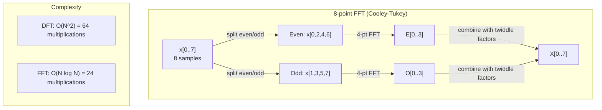
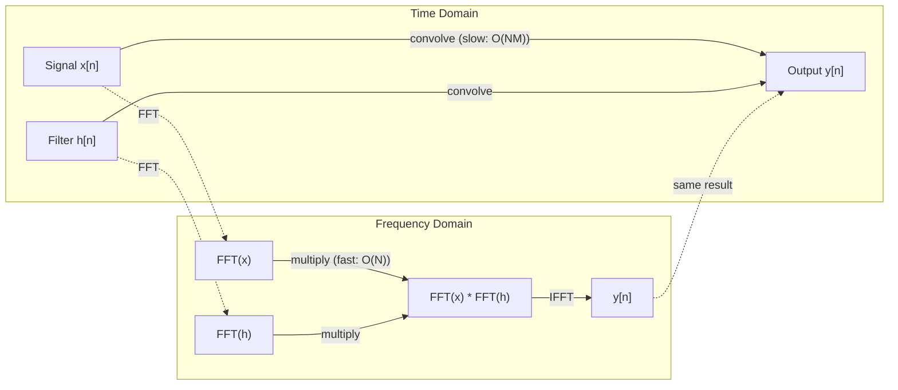

# Преобразование Фурье

> Любой сигнал — это сумма синусоид. Преобразование Фурье говорит вам, каких именно.

**Тип:** Build
**Язык:** Python
**Предварительные требования:** Фаза 1, Уроки 01-04, 19 (комплексные числа)
**Время:** ~90 минут

## Цели обучения

- Реализовать DFT с нуля и проверить его на соответствие быстрому преобразованию Фурье (FFT) Кули — Тьюки со сложностью O(N log N)
- Интерпретировать частотные коэффициенты: извлекать амплитуду, фазу и энергетический спектр сигнала
- Применять теорему о свёртке для выполнения свёртки через умножение с помощью FFT
- Связать частотное разложение Фурье с позиционными кодировками трансформера и свёрточными слоями CNN

## Проблема

Аудиозапись — это последовательность измерений давления во времени. Цена акции — это последовательность значений по дням. Изображение — это сетка интенсивностей пикселей в пространстве. Всё это — данные во временной области (или в пространственной области). Вы видите значения, изменяющиеся по некоторому индексу.

Но многие закономерности невидимы во временной области. Этот аудиосигнал — чистый тон или аккорд? Есть ли у этой цены акции недельный цикл? Есть ли на этом изображении повторяющаяся текстура? Эти вопросы касаются частотного содержания, а временная область его скрывает.

Преобразование Фурье переводит данные из временной области в частотную. Оно берёт сигнал и раскладывает его на синусоиды разных частот. У каждой синусоиды есть амплитуда (насколько она сильна) и фаза (где она начинается). Преобразование Фурье сообщает вам и то, и другое.

Это важно для ML, потому что мышление в частотной области встречается повсюду. Свёрточные нейронные сети выполняют свёртку, которая является умножением в частотной области. Позиционные кодировки трансформера используют частотное разложение для представления позиции. Аудиомодели (распознавание речи, генерация музыки) работают со спектрограммами — частотными представлениями звука. Модели временных рядов ищут периодические закономерности. Понимание преобразования Фурье даёт вам словарь для работы со всем этим.

## Концепция

### Определение DFT

Имея N отсчётов x[0], x[1], ..., x[N-1], дискретное преобразование Фурье (Discrete Fourier Transform, DFT) выдаёт N частотных коэффициентов X[0], X[1], ..., X[N-1]:

```
X[k] = sum_{n=0}^{N-1} x[n] * e^(-2*pi*i*k*n/N)

for k = 0, 1, ..., N-1
```

Каждое X[k] — комплексное число. Его модуль |X[k]| сообщает вам амплитуду частоты k. Его фаза angle(X[k]) сообщает вам фазовое смещение этой частоты.

Ключевая идея: `e^(-2*pi*i*k*n/N)` — это вращающийся фазор на частоте k. DFT вычисляет корреляцию между сигналом и каждой из N равномерно расположенных частот. Если сигнал содержит энергию на частоте k, корреляция велика. Если нет, она близка к нулю.

### Что означает каждый коэффициент

**X[0]: постоянная составляющая (DC component).** Это сумма всех отсчётов — пропорциональна среднему значению. Она представляет постоянное (нулевой частоты) смещение сигнала.

```
X[0] = sum_{n=0}^{N-1} x[n] * e^0 = sum of all samples
```

**X[k] при 1 <= k <= N/2: положительные частоты.** X[k] представляет частоту k циклов на N отсчётов. Чем больше k, тем выше частота (быстрее колебание).

**X[N/2]: частота Найквиста.** Самая высокая частота, которую можно представить с N отсчётами. Выше неё возникает элайзинг (aliasing) — высокие частоты маскируются под низкие.

**X[k] при N/2 < k < N: отрицательные частоты.** Для вещественнозначных сигналов X[N-k] = conj(X[k]). Отрицательные частоты являются зеркальным отражением положительных. Именно поэтому полезная информация содержится в первых N/2 + 1 коэффициентах.

### Обратное DFT

Обратное DFT восстанавливает исходный сигнал из его частотных коэффициентов:

```
x[n] = (1/N) * sum_{k=0}^{N-1} X[k] * e^(2*pi*i*k*n/N)

for n = 0, 1, ..., N-1
```

Единственные отличия от прямого DFT: знак в показателе степени положительный (не отрицательный), и присутствует нормализующий множитель 1/N.

Обратное DFT даёт идеальное восстановление. Информация не теряется. Вы можете перейти из временной области в частотную и обратно без какой-либо ошибки. DFT — это смена базиса: оно заново выражает ту же информацию в другой системе координат.

### FFT: ускоряем вычисления

DFT, как определено выше, имеет сложность O(N^2): для каждого из N выходных коэффициентов вы суммируете по N входным отсчётам. При N = 1 миллион это 10^12 операций.

Быстрое преобразование Фурье (Fast Fourier Transform, FFT) вычисляет тот же результат за O(N log N). При N = 1 миллион это около 20 миллионов операций вместо триллиона. Именно это делает частотный анализ практически применимым.

Алгоритм Кули — Тьюки (наиболее распространённый FFT) работает по принципу «разделяй и властвуй»:

1. Разбейте сигнал на отсчёты с чётными и нечётными индексами.
2. Рекурсивно вычислите DFT для каждой половины.
3. Объедините два DFT половинного размера, используя «поворотные множители» (twiddle factors) e^(-2*pi*i*k/N).

```
X[k] = E[k] + e^(-2*pi*i*k/N) * O[k]          for k = 0, ..., N/2 - 1
X[k + N/2] = E[k] - e^(-2*pi*i*k/N) * O[k]    for k = 0, ..., N/2 - 1

where E = DFT of even-indexed samples
      O = DFT of odd-indexed samples
```

Симметрия означает, что каждый уровень рекурсии выполняет работу O(N), а уровней всего log2(N). Итого: O(N log N).



FFT требует, чтобы длина сигнала была степенью двойки. На практике сигналы дополняются нулями до следующей степени двойки.

### Спектральный анализ

**Энергетический спектр (power spectrum)** — это |X[k]|^2, квадрат модуля каждого частотного коэффициента. Он показывает, сколько энергии приходится на каждую частоту.

**Фазовый спектр (phase spectrum)** — это angle(X[k]), фазовое смещение каждой частоты. В большинстве задач анализа вас интересует энергетический спектр, а фазу вы игнорируете.

```
Power at frequency k:  P[k] = |X[k]|^2 = X[k].real^2 + X[k].imag^2
Phase at frequency k:  phi[k] = atan2(X[k].imag, X[k].real)
```

### Частотное разрешение

Частотное разрешение DFT зависит от числа отсчётов N и частоты дискретизации fs.

```
Frequency of bin k:      f_k = k * fs / N
Frequency resolution:    delta_f = fs / N
Maximum frequency:       f_max = fs / 2  (Nyquist)
```

Чтобы различить две близко расположенные частоты, нужно больше отсчётов. Чтобы захватить высокие частоты, нужна более высокая частота дискретизации.

### Теорема о свёртке

Это один из важнейших результатов в обработке сигналов, напрямую относящийся к CNN.

**Свёртка во временной области равна поэлементному умножению в частотной области.**

```
x * h = IFFT(FFT(x) . FFT(h))

where * is convolution and . is element-wise multiplication
```

Почему это важно:

- Прямая свёртка двух сигналов длины N и M занимает O(N*M) операций.
- Свёртка на основе FFT занимает O(N log N): преобразуйте оба сигнала, перемножьте, преобразуйте обратно.
- Для больших ядер свёртка через FFT значительно быстрее.
- Именно это происходит в свёрточных слоях с большими рецептивными полями.

Примечание: DFT вычисляет циклическую свёртку (сигнал заворачивается сам на себя). Для линейной свёртки (без заворачивания) дополните оба сигнала нулями до длины N + M - 1 перед вычислением.



### Оконное преобразование

DFT предполагает, что сигнал периодичен — оно рассматривает N отсчётов как один период бесконечно повторяющегося сигнала. Если сигнал не начинается и не заканчивается одним и тем же значением, это создаёт разрыв на границе, который проявляется как ложное высокочастотное содержание. Это называется спектральной утечкой (spectral leakage).

Оконное преобразование уменьшает утечку, сводя сигнал к нулю на обоих концах перед вычислением DFT.

Распространённые окна:

| Окно | Форма | Ширина главного лепестка | Уровень боковых лепестков | Область применения |
|--------|-------|----------------|-----------------|----------|
| Прямоугольное | Плоское (без окна) | Наименьшая | Наивысший (-13 дБ) | Когда сигнал точно периодичен на N отсчётах |
| Ханна | Приподнятый косинус | Умеренная | Низкий (-31 дБ) | Спектральный анализ общего назначения |
| Хэмминга | Модифицированный косинус | Умеренная | Ниже (-42 дБ) | Обработка аудио, анализ речи |
| Блэкмана | Тройной косинус | Широкая | Очень низкий (-58 дБ) | Когда критично подавление боковых лепестков |

```
Hann window:    w[n] = 0.5 * (1 - cos(2*pi*n / (N-1)))
Hamming window: w[n] = 0.54 - 0.46 * cos(2*pi*n / (N-1))
```

Примените окно, поэлементно умножив его на сигнал перед DFT: `X = DFT(x * w)`.

### Свойства DFT

| Свойство | Временная область | Частотная область |
|----------|-------------|-----------------|
| Линейность | a*x + b*y | a*X + b*Y |
| Сдвиг во времени | x[n - k] | X[f] * e^(-2*pi*i*f*k/N) |
| Сдвиг по частоте | x[n] * e^(2*pi*i*f0*n/N) | X[f - f0] |
| Свёртка | x * h | X * H (поэлементно) |
| Умножение | x * h (поэлементно) | X * H (циклическая свёртка, масштабированная на 1/N) |
| Теорема Парсеваля | sum \|x[n]\|^2 | (1/N) * sum \|X[k]\|^2 |
| Сопряжённая симметрия (для вещественного входа) | x[n] вещественно | X[k] = conj(X[N-k]) |

Теорема Парсеваля утверждает, что полная энергия одинакова в обеих областях. Энергия сохраняется в ходе преобразования.

### Связь с позиционными кодировками

Оригинальный трансформер использует синусоидальные позиционные кодировки:

```
PE(pos, 2i)   = sin(pos / 10000^(2i/d_model))
PE(pos, 2i+1) = cos(pos / 10000^(2i/d_model))
```

Каждая пара измерений (2i, 2i+1) колеблется на своей частоте. Частоты геометрически распределены от высоких (измерения 0, 1) до низких (последние измерения). Это даёт каждой позиции уникальный паттерн по всем частотным полосам — аналогично тому, как коэффициенты Фурье однозначно идентифицируют сигнал.

Ключевые свойства, которые это обеспечивает:

- **Уникальность:** никакие две позиции не имеют одинаковой кодировки.
- **Ограниченные значения:** sin и cos всегда находятся в [-1, 1].
- **Относительная позиция:** кодировку позиции p+k можно выразить как линейную функцию кодировки позиции p. Модель может научиться обращать внимание на относительные позиции.

### Связь с CNN

Свёрточный слой применяет обученный фильтр (ядро) ко входу, скользя им по сигналу или изображению. Математически это операция свёртки.

По теореме о свёртке, это эквивалентно:
1. Применить FFT ко входу
2. Применить FFT к ядру
3. Перемножить в частотной области
4. Применить IFFT к результату

Стандартные реализации CNN используют прямую свёртку (быстрее для малых ядер 3x3). Но для больших ядер или глобальной свёртки подходы на основе FFT значительно быстрее. Некоторые архитектуры (например, FNet) полностью заменяют внимание на FFT, достигая конкурентоспособной точности со сложностью O(N log N) вместо O(N^2).

### Спектрограммы и кратковременное преобразование Фурье

Одно FFT даёт вам частотное содержание всего сигнала, но ничего не говорит о том, когда эти частоты возникают. Чирп (сигнал, частота которого растёт со временем) и аккорд (все частоты присутствуют одновременно) могут иметь одинаковый спектр модулей.

Кратковременное преобразование Фурье (Short-Time Fourier Transform, STFT) решает эту проблему, вычисляя FFT на перекрывающихся окнах сигнала. Результат — спектрограмма: двумерное представление, где на одной оси время, а на другой — частота. Интенсивность в каждой точке показывает энергию на этой частоте в этот момент времени.

```
STFT procedure:
1. Choose a window size (e.g., 1024 samples)
2. Choose a hop size (e.g., 256 samples -- 75% overlap)
3. For each window position:
   a. Extract the windowed segment
   b. Apply a Hann/Hamming window
   c. Compute FFT
   d. Store the magnitude spectrum as one column of the spectrogram
```

Спектрограммы — стандартное входное представление для аудиомоделей ML. Модели распознавания речи (Whisper, DeepSpeech) работают с мел-спектрограммами — спектрограммами, в которых частоты отображены на мел-шкалу, лучше соответствующую человеческому восприятию высоты тона.

### Элайзинг

Если сигнал содержит частоты выше fs/2 (частоты Найквиста), дискретизация с частотой fs создаст элайзинговые копии. Сигнал 90 Гц, дискретизированный с частотой 100 Гц, выглядит идентично сигналу 10 Гц. Различить их по одним лишь отсчётам невозможно.

```
Example:
  True signal: 90 Hz sine wave
  Sampling rate: 100 Hz
  Apparent frequency: 100 - 90 = 10 Hz

  The samples from the 90 Hz signal at 100 Hz sampling rate
  are identical to the samples from a 10 Hz signal.
  No amount of math can recover the original 90 Hz.
```

Именно поэтому аналого-цифровые преобразователи включают в себя антиэлайзинговые фильтры, которые устраняют частоты выше Найквиста перед дискретизацией. В ML элайзинг возникает при понижении дискретизации карт признаков без надлежащей низкочастотной фильтрации — некоторые архитектуры решают эту проблему с помощью слоёв пулинга с подавлением элайзинга.

### Дополнение нулями не увеличивает разрешение

Распространённое заблуждение: дополнение сигнала нулями перед FFT улучшает частотное разрешение. Это не так. Дополнение нулями интерполирует между существующими частотными бинами, давая вам спектр, который выглядит более гладким. Но оно не может выявить частотные детали, которых не было в исходных отсчётах.

Истинное частотное разрешение зависит только от времени наблюдения T = N / fs. Чтобы различить две частоты, разделённые delta_f, вам нужно как минимум T = 1 / delta_f секунд данных. Никакое дополнение нулями не изменит этот фундаментальный предел.

```figure
fourier-synthesis
```

## Создаём

### Шаг 1: DFT с нуля

DFT со сложностью O(N^2) следует напрямую из определения.

```python
import math

class Complex:
    ...

def dft(x):
    N = len(x)
    result = []
    for k in range(N):
        total = Complex(0, 0)
        for n in range(N):
            angle = -2 * math.pi * k * n / N
            w = Complex(math.cos(angle), math.sin(angle))
            xn = x[n] if isinstance(x[n], Complex) else Complex(x[n])
            total = total + xn * w
        result.append(total)
    return result
```

### Шаг 2: Обратное DFT

Та же структура, положительный показатель степени, деление на N.

```python
def idft(X):
    N = len(X)
    result = []
    for n in range(N):
        total = Complex(0, 0)
        for k in range(N):
            angle = 2 * math.pi * k * n / N
            w = Complex(math.cos(angle), math.sin(angle))
            total = total + X[k] * w
        result.append(Complex(total.real / N, total.imag / N))
    return result
```

### Шаг 3: FFT (Кули — Тьюки)

Рекурсивное FFT требует длины, равной степени двойки. Разбейте на чётные и нечётные, рекурсивно вызовите, объедините с помощью поворотных множителей.

```python
def fft(x):
    N = len(x)
    if N <= 1:
        return [x[0] if isinstance(x[0], Complex) else Complex(x[0])]
    if N % 2 != 0:
        return dft(x)

    even = fft([x[i] for i in range(0, N, 2)])
    odd = fft([x[i] for i in range(1, N, 2)])

    result = [Complex(0)] * N
    for k in range(N // 2):
        angle = -2 * math.pi * k / N
        twiddle = Complex(math.cos(angle), math.sin(angle))
        t = twiddle * odd[k]
        result[k] = even[k] + t
        result[k + N // 2] = even[k] - t
    return result
```

### Шаг 4: Вспомогательные функции спектрального анализа

```python
def power_spectrum(X):
    return [xk.real ** 2 + xk.imag ** 2 for xk in X]

def convolve_fft(x, h):
    N = len(x) + len(h) - 1
    padded_N = 1
    while padded_N < N:
        padded_N *= 2

    x_padded = x + [0.0] * (padded_N - len(x))
    h_padded = h + [0.0] * (padded_N - len(h))

    X = fft(x_padded)
    H = fft(h_padded)

    Y = [xk * hk for xk, hk in zip(X, H)]

    y = idft(Y)
    return [y[n].real for n in range(N)]
```

## Применяем

Для реальной работы используйте FFT из numpy, которое опирается на высоко оптимизированные библиотеки C.

```python
import numpy as np

signal = np.sin(2 * np.pi * 5 * np.arange(256) / 256)
spectrum = np.fft.fft(signal)
freqs = np.fft.fftfreq(256, d=1/256)

power = np.abs(spectrum) ** 2

positive_freqs = freqs[:len(freqs)//2]
positive_power = power[:len(power)//2]
```

Для оконного преобразования и более продвинутого спектрального анализа:

```python
from scipy.signal import windows, stft

window = windows.hann(256)
windowed = signal * window
spectrum = np.fft.fft(windowed)
```

Для свёртки:

```python
from scipy.signal import fftconvolve

result = fftconvolve(signal, kernel, mode='full')
```

Для спектрограмм:

```python
from scipy.signal import stft

frequencies, times, Zxx = stft(signal, fs=sample_rate, nperseg=256)
spectrogram = np.abs(Zxx) ** 2
```

Матрица спектрограммы имеет форму (n_frequencies, n_time_frames). Каждый столбец — это энергетический спектр в одном временном окне. Именно это аудиомодели ML получают на вход.

## Публикуем

Запустите `code/fourier.py`, чтобы сгенерировать `outputs/prompt-spectral-analyzer.md`.

## Упражнения

1. **Определение чистого тона.** Создайте сигнал с одной синусоидой неизвестной частоты (от 1 до 50 Гц), сэмплированный с частотой 128 Гц в течение 1 секунды. Используйте своё DFT, чтобы определить частоту. Убедитесь, что ответ совпадает. Теперь добавьте гауссов шум со стандартным отклонением 0.5 и повторите. Как шум влияет на спектр?

2. **Проверка FFT против DFT.** Сгенерируйте случайный сигнал длины 64. Вычислите и DFT (O(N^2)), и FFT. Убедитесь, что все коэффициенты совпадают с точностью до 1e-10. Замерьте время работы обеих функций на сигналах длины 256, 512, 1024 и 2048. Постройте график отношения времени DFT к времени FFT.

3. **Доказательство теоремы о свёртке на примере.** Создайте сигнал x = [1, 2, 3, 4, 0, 0, 0, 0] и фильтр h = [1, 1, 1, 0, 0, 0, 0, 0]. Вычислите их циклическую свёртку напрямую (вложенным циклом). Затем вычислите её через FFT (преобразование, умножение, обратное преобразование). Убедитесь, что результаты совпадают. Теперь выполните линейную свёртку, дополнив данные нулями надлежащим образом.

4. **Эффекты оконного преобразования.** Создайте сигнал, представляющий собой сумму двух синусоид на 10 Гц и 12 Гц (очень близких). Сэмплируйте с частотой 128 Гц в течение 1 секунды. Вычислите энергетический спектр без окна, с окном Ханна и с окном Хэмминга. Какое окно легче всего позволяет различить два пика? Почему?

5. **Анализ позиционных кодировок.** Сгенерируйте синусоидальные позиционные кодировки для d_model = 128 и max_pos = 512. Для каждой пары позиций (p1, p2) вычислите скалярное произведение их кодировок. Покажите, что скалярное произведение зависит только от |p1 - p2|, а не от абсолютных позиций. Что происходит со скалярным произведением по мере увеличения расстояния?

## Ключевые термины

| Термин | Что это означает |
|------|---------------|
| DFT (дискретное преобразование Фурье) | Преобразует N отсчётов временной области в N коэффициентов частотной области. Каждый коэффициент — это корреляция с комплексной синусоидой на данной частоте |
| FFT (быстрое преобразование Фурье) | Алгоритм со сложностью O(N log N) для вычисления DFT. Алгоритм Кули — Тьюки рекурсивно разбивает на чётные/нечётные индексы |
| Обратное DFT | Восстанавливает сигнал временной области из частотных коэффициентов. Та же формула, что и у DFT, с обращённым знаком показателя степени и масштабированием на 1/N |
| Частотный бин | Каждый индекс k в выходе DFT представляет частоту k*fs/N Гц. «Бин» — это дискретный частотный слот |
| Постоянная составляющая (DC component) | X[0], коэффициент нулевой частоты. Пропорционален среднему значению сигнала |
| Частота Найквиста | fs/2, максимальная частота, представимая при частоте дискретизации fs. Частоты выше неё подвергаются элайзингу |
| Энергетический спектр | \|X[k]\|^2, квадрат модуля каждого частотного коэффициента. Показывает распределение энергии по частотам |
| Фазовый спектр | angle(X[k]), фазовое смещение каждой частотной составляющей. Часто игнорируется при анализе |
| Спектральная утечка | Ложное частотное содержание, вызванное трактовкой непериодического сигнала как периодического. Уменьшается оконным преобразованием |
| Оконная функция | Сужающая функция (Ханна, Хэмминга, Блэкмана), применяемая перед DFT для уменьшения спектральной утечки |
| Поворотный множитель (twiddle factor) | Комплексная экспонента e^(-2*pi*i*k/N), используемая для объединения под-DFT в бабочковых вычислениях FFT |
| Теорема о свёртке | Свёртка во временной области равна поэлементному умножению в частотной области. Фундаментальна для обработки сигналов и CNN |
| Циклическая свёртка | Свёртка, при которой сигнал заворачивается сам на себя. Именно её естественным образом вычисляет DFT |
| Линейная свёртка | Стандартная свёртка без заворачивания. Достигается дополнением нулями перед DFT |
| Теорема Парсеваля | Полная энергия сохраняется в ходе преобразования Фурье. sum \|x[n]\|^2 = (1/N) sum \|X[k]\|^2 |
| Элайзинг | Когда частоты выше Найквиста проявляются как более низкие частоты из-за недостаточной частоты дискретизации |

## Дополнительные материалы

- [Cooley & Tukey: An Algorithm for the Machine Calculation of Complex Fourier Series (1965)](https://www.ams.org/journals/mcom/1965-19-090/S0025-5718-1965-0178586-1/) — оригинальная статья о FFT, изменившая вычислительную технику
- [3Blue1Brown: But what is the Fourier Transform?](https://www.youtube.com/watch?v=spUNpyF58BY) — лучшее визуальное введение в преобразования Фурье
- [Lee-Thorp et al.: FNet: Mixing Tokens with Fourier Transforms (2021)](https://arxiv.org/abs/2105.03824) — заменяет self-attention на FFT в трансформерах
- [Smith: The Scientist and Engineer's Guide to Digital Signal Processing](http://www.dspguide.com/) — бесплатный онлайн-учебник, подробно охватывающий FFT, оконное преобразование и спектральный анализ
- [Vaswani et al.: Attention Is All You Need (2017)](https://arxiv.org/abs/1706.03762) — синусоидальные позиционные кодировки, выведенные из частотного разложения Фурье
- [Radford et al.: Whisper (2022)](https://arxiv.org/abs/2212.04356) — распознавание речи с использованием мел-спектрограмм в качестве входного представления
