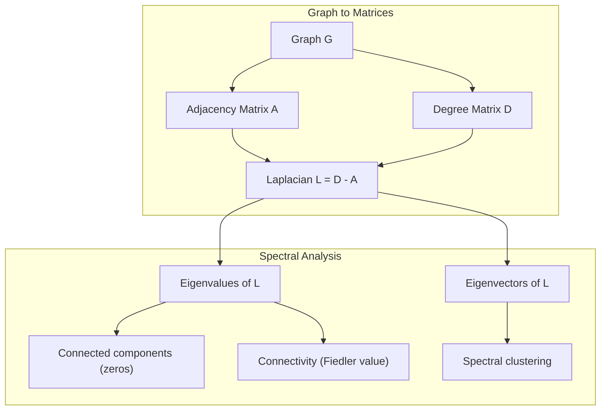
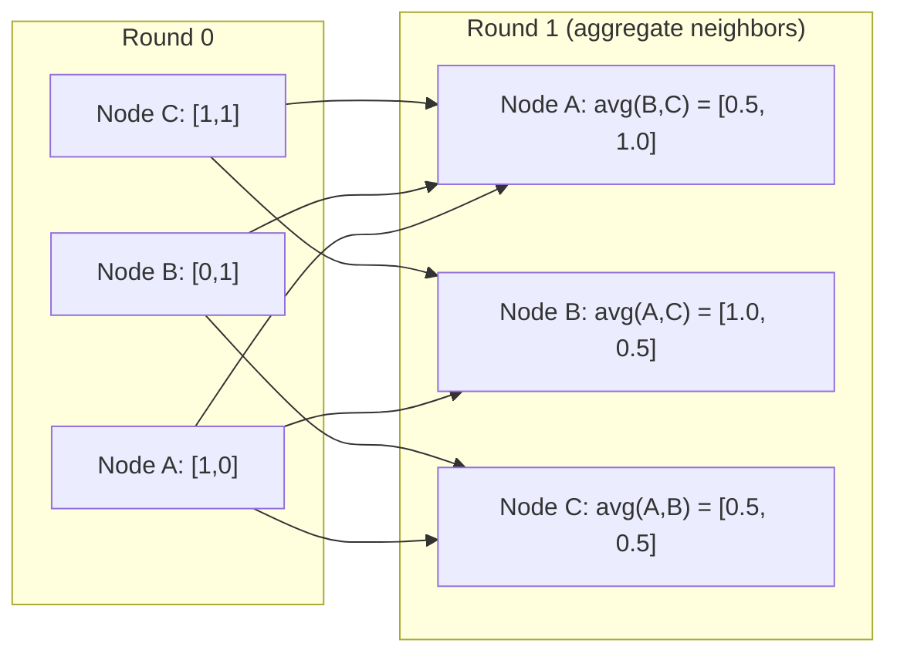

# Теория графов для машинного обучения

> Графы — это структура данных для отношений. Если в ваших данных есть связи, вам нужна теория графов.

**Тип:** Build
**Язык:** Python
**Предварительные требования:** Фаза 1, Уроки 01-03 (линейная алгебра, матрицы)
**Время:** ~90 минут

## Цели обучения

- Построить класс графа с представлениями в виде матрицы/списка смежности и реализовать обходы BFS и DFS
- Вычислить лапласиан графа и использовать его собственные значения для обнаружения связных компонент и кластеризации узлов
- Реализовать один раунд передачи сообщений в стиле GNN как умножение на нормализованную матрицу смежности
- Применить спектральную кластеризацию для разбиения графа с использованием вектора Фидлера

## Проблема

Социальные сети, молекулы, базы знаний, цитатные сети, карты дорог — всё это графы. Традиционный ML рассматривает данные как плоские таблицы. Каждая строка независима. Каждый признак — это столбец. Но когда важна структура связей, таблицы не справляются.

Рассмотрим социальную сеть. Вы хотите предсказать, какой продукт купит пользователь. Важна история его покупок. Но история покупок его друзей важнее. Связи несут сигнал.

Или рассмотрим молекулу. Вы хотите предсказать, свяжется ли она с белком. Атомы важны, но по-настоящему важно то, как атомы связаны друг с другом. Структура — это и есть данные.

Графовые нейронные сети (Graph Neural Networks, GNN) — самая быстрорастущая область глубокого обучения. Они лежат в основе разработки лекарств, социальных рекомендаций, обнаружения мошенничества и рассуждений над графами знаний. Каждая GNN строится на одном и том же фундаменте: базовой теории графов.

Вам нужны четыре вещи:
1. Способ представлять графы в виде матриц (чтобы их можно было перемножать)
2. Алгоритмы обхода для исследования структуры графа
3. Лапласиан — самая важная матрица в спектральной теории графов
4. Передача сообщений — операция, благодаря которой работают GNN

## Концепция

### Графы: узлы и рёбра

Граф G = (V, E) состоит из вершин (узлов) V и рёбер E. Каждое ребро соединяет два узла.

**Направленный и ненаправленный.** В ненаправленном графе ребро (u, v) означает, что u связан с v И v связан с u. В направленном графе (орграфе) ребро (u, v) означает, что u указывает на v, но не обязательно наоборот.

**Взвешенный и невзвешенный.** В невзвешенном графе рёбра либо есть, либо их нет. Во взвешенном графе у каждого ребра есть числовой вес — расстояние, стоимость, сила связи.

| Тип графа | Пример |
|-----------|---------|
| Ненаправленный, невзвешенный | Сеть дружеских связей Facebook |
| Направленный, невзвешенный | Сеть подписок Twitter |
| Ненаправленный, взвешенный | Карта дорог (расстояния) |
| Направленный, взвешенный | Ссылки веб-страниц (оценки PageRank) |

### Матрица смежности

Матрица смежности A — базовое представление. Для графа с n узлами:

```
A[i][j] = 1    if there is an edge from node i to node j
A[i][j] = 0    otherwise
```

Для ненаправленных графов A симметрична: A[i][j] = A[j][i]. Для взвешенных графов A[i][j] = вес ребра (i, j).

**Пример — треугольник:**

```
Nodes: 0, 1, 2
Edges: (0,1), (1,2), (0,2)

A = [[0, 1, 1],
     [1, 0, 1],
     [1, 1, 0]]
```

Матрица смежности — вход для каждой GNN. Матричные операции над A соответствуют операциям над графом.

### Степень

Степень узла — это число рёбер, связанных с ним. Для направленных графов различают входящую степень (in-degree, входящие рёбра) и исходящую степень (out-degree, исходящие рёбра).

Матрица степеней D диагональна:

```
D[i][i] = degree of node i
D[i][j] = 0    for i != j
```

Для примера с треугольником: D = diag(2, 2, 2), потому что каждый узел связан с двумя другими.

Степень говорит о важности узла. Высокая степень = узел-хаб. Распределение степеней сети раскрывает её структуру. Социальные сети подчиняются степенным законам (мало хабов, много листовых узлов). У случайных графов степени распределены по Пуассону.

### BFS и DFS

Два фундаментальных алгоритма обхода графа. Вам нужны оба.

**Поиск в ширину (Breadth-First Search, BFS):** сначала исследуйте всех соседей, затем соседей соседей. Использует очередь (FIFO).

```
BFS from node 0:
  Visit 0
  Queue: [1, 2]        (neighbors of 0)
  Visit 1
  Queue: [2, 3]        (add neighbors of 1)
  Visit 2
  Queue: [3]           (neighbors of 2 already visited)
  Visit 3
  Queue: []            (done)
```

BFS находит кратчайшие пути в невзвешенных графах. Расстояние от начального узла до любого другого равно уровню BFS, на котором этот узел был впервые обнаружен. Именно поэтому BFS используется для расстояний по числу переходов в социальных сетях.

**Поиск в глубину (Depth-First Search, DFS):** идите как можно глубже, прежде чем вернуться назад. Использует стек (LIFO) или рекурсию.

```
DFS from node 0:
  Visit 0
  Stack: [1, 2]        (neighbors of 0)
  Visit 2               (pop from stack)
  Stack: [1, 3]         (add neighbors of 2)
  Visit 3               (pop from stack)
  Stack: [1]
  Visit 1               (pop from stack)
  Stack: []             (done)
```

DFS полезен для:
- Поиска связных компонент (запустите DFS из непосещённых узлов)
- Обнаружения циклов (обратные рёбра в дереве DFS)
- Топологической сортировки (обратный порядок завершения DFS)

| Алгоритм | Структура данных | Находит | Область применения |
|-----------|---------------|-------|----------|
| BFS | Очередь | Кратчайшие пути | Расстояния в социальной сети, обход графа знаний |
| DFS | Стек | Компоненты, циклы | Связность, топологическая сортировка |

### Лапласиан графа

L = D - A. Самая важная матрица в спектральной теории графов.

Для треугольника:

```
D = [[2, 0, 0],    A = [[0, 1, 1],    L = [[2, -1, -1],
     [0, 2, 0],         [1, 0, 1],         [-1, 2, -1],
     [0, 0, 2]]         [1, 1, 0]]         [-1, -1,  2]]
```

У лапласиана есть замечательные свойства:

1. **L положительно полуопределена.** Все собственные значения >= 0.

2. **Число нулевых собственных значений равно числу связных компонент.** У связного графа ровно одно нулевое собственное значение. У графа с 3 несвязными компонентами — три нулевых собственных значения.

3. **Наименьшее ненулевое собственное значение (значение Фидлера) измеряет связность.** Большое значение Фидлера означает, что граф хорошо связан. Малое значение Фидлера означает, что у графа есть слабое место — узкое горлышко.

4. **Собственный вектор, соответствующий значению Фидлера (вектор Фидлера), раскрывает наилучшее разбиение.** Узлы с положительными значениями попадают в одну группу, узлы с отрицательными значениями — в другую. Это спектральная кластеризация.



### Спектральные свойства

Собственные значения матрицы смежности и лапласиана раскрывают структурные свойства без какого-либо обхода.

**Спектральная кластеризация** работает так:
1. Вычислите лапласиан L
2. Найдите k наименьших собственных векторов L (пропустите первый, который состоит из единиц для связных графов)
3. Используйте эти собственные векторы как новые координаты для каждого узла
4. Запустите k-means на этих координатах

Почему это работает? Собственные векторы L кодируют «самые гладкие» функции на графе. Хорошо связанные узлы получают похожие значения собственного вектора. Узлы, разделённые узким горлышком, получают разные значения. Собственные векторы естественным образом разделяют кластеры.

**Связь со случайными блужданиями.** Нормализованный лапласиан связан со случайными блужданиями на графе. Стационарное распределение случайного блуждания пропорционально степени узла. Время смешивания (насколько быстро блуждание сходится) зависит от спектрального разрыва.

### Передача сообщений

Основная операция графовых нейронных сетей. Каждый узел собирает сообщения от своих соседей, агрегирует их и обновляет своё собственное состояние.

```
h_v^(k+1) = UPDATE(h_v^(k), AGGREGATE({h_u^(k) : u in neighbors(v)}))
```

В простейшей форме AGGREGATE = среднее, а UPDATE = линейное преобразование + активация:

```
h_v^(k+1) = sigma(W * mean({h_u^(k) : u in neighbors(v)}))
```

Это матричное умножение в замаскированном виде. Если H — матрица всех признаков узлов, а A — матрица смежности:

```
H^(k+1) = sigma(A_norm * H^(k) * W)
```

где A_norm — нормализованная матрица смежности (сумма каждой строки равна 1).

Один раунд передачи сообщений позволяет каждому узлу «увидеть» своих непосредственных соседей. Два раунда позволяют увидеть соседей соседей. K раундов дают каждому узлу информацию из его K-шаговой окрестности.



### Концепции и применения в ML

| Концепция | Применение в ML |
|---------|---------------|
| Матрица смежности | Входное представление для GNN |
| Лапласиан графа | Спектральная кластеризация, обнаружение сообществ |
| BFS/DFS | Обход графа знаний, поиск путей |
| Распределение степеней | Важность узла, конструирование признаков |
| Передача сообщений | Слои GNN (GCN, GAT, GraphSAGE) |
| Собственные значения L | Обнаружение сообществ, разбиение графа |
| Спектральная кластеризация | Группировка узлов без учителя |
| PageRank | Важность узла, веб-поиск |

```figure
graph-degree-distribution
```

## Создаём

### Шаг 1: Класс графа с нуля

```python
class Graph:
    def __init__(self, n_nodes, directed=False):
        self.n = n_nodes
        self.directed = directed
        self.adj = {i: {} for i in range(n_nodes)}

    def add_edge(self, u, v, weight=1.0):
        self.adj[u][v] = weight
        if not self.directed:
            self.adj[v][u] = weight

    def neighbors(self, node):
        return list(self.adj[node].keys())

    def degree(self, node):
        return len(self.adj[node])

    def adjacency_matrix(self):
        import numpy as np
        A = np.zeros((self.n, self.n))
        for u in range(self.n):
            for v, w in self.adj[u].items():
                A[u][v] = w
        return A

    def degree_matrix(self):
        import numpy as np
        D = np.zeros((self.n, self.n))
        for i in range(self.n):
            D[i][i] = self.degree(i)
        return D

    def laplacian(self):
        return self.degree_matrix() - self.adjacency_matrix()
```

Список смежности (`self.adj`) эффективно хранит соседей. Преобразование в матрицу смежности использует numpy, потому что все спектральные операции в нём нуждаются.

### Шаг 2: BFS и DFS

```python
from collections import deque

def bfs(graph, start):
    visited = set()
    order = []
    distances = {}
    queue = deque([(start, 0)])
    visited.add(start)
    while queue:
        node, dist = queue.popleft()
        order.append(node)
        distances[node] = dist
        for neighbor in graph.neighbors(node):
            if neighbor not in visited:
                visited.add(neighbor)
                queue.append((neighbor, dist + 1))
    return order, distances


def dfs(graph, start):
    visited = set()
    order = []
    stack = [start]
    while stack:
        node = stack.pop()
        if node in visited:
            continue
        visited.add(node)
        order.append(node)
        for neighbor in reversed(graph.neighbors(node)):
            if neighbor not in visited:
                stack.append(neighbor)
    return order
```

BFS использует deque (двустороннюю очередь) для O(1) popleft. DFS использует список в качестве стека. Оба посещают каждый узел ровно один раз — время O(V + E).

### Шаг 3: Связные компоненты и собственные значения лапласиана

```python
def connected_components(graph):
    visited = set()
    components = []
    for node in range(graph.n):
        if node not in visited:
            order, _ = bfs(graph, node)
            visited.update(order)
            components.append(order)
    return components


def laplacian_eigenvalues(graph):
    import numpy as np
    L = graph.laplacian()
    eigenvalues = np.linalg.eigvalsh(L)
    return eigenvalues
```

`eigvalsh` предназначена для симметричных матриц — лапласиан всегда симметричен для ненаправленных графов. Она возвращает собственные значения в порядке возрастания. Посчитайте нули, чтобы найти число связных компонент.

### Шаг 4: Спектральная кластеризация

```python
def spectral_clustering(graph, k=2):
    import numpy as np
    L = graph.laplacian()
    eigenvalues, eigenvectors = np.linalg.eigh(L)
    features = eigenvectors[:, 1:k+1]

    labels = np.zeros(graph.n, dtype=int)
    for i in range(graph.n):
        if features[i, 0] >= 0:
            labels[i] = 0
        else:
            labels[i] = 1
    return labels
```

При k=2 знак вектора Фидлера разбивает граф на два кластера. При k>2 вам нужно запустить k-means на первых k собственных векторах (исключая тривиальный собственный вектор из единиц).

### Шаг 5: Передача сообщений

```python
def message_passing(graph, features, weight_matrix):
    import numpy as np
    A = graph.adjacency_matrix()
    row_sums = A.sum(axis=1, keepdims=True)
    row_sums[row_sums == 0] = 1
    A_norm = A / row_sums
    aggregated = A_norm @ features
    output = aggregated @ weight_matrix
    return output
```

Это один раунд передачи сообщений GNN. Новые признаки каждого узла — это взвешенное среднее признаков его соседей, преобразованное матрицей весов. Сложите несколько раундов, чтобы распространить информацию дальше.

## Применяем

С networkx и numpy те же операции выполняются в одну строку:

```python
import networkx as nx
import numpy as np

G = nx.karate_club_graph()

A = nx.adjacency_matrix(G).toarray()
L = nx.laplacian_matrix(G).toarray()

eigenvalues = np.linalg.eigvalsh(L.astype(float))
print(f"Smallest eigenvalues: {eigenvalues[:5]}")
print(f"Connected components: {nx.number_connected_components(G)}")

communities = nx.community.greedy_modularity_communities(G)
print(f"Communities found: {len(communities)}")

pr = nx.pagerank(G)
top_nodes = sorted(pr.items(), key=lambda x: x[1], reverse=True)[:5]
print(f"Top 5 PageRank nodes: {top_nodes}")
```

networkx обрабатывает графы любого размера с оптимизированными бэкендами на C. Используйте его в продакшене. Используйте вашу реализацию с нуля, чтобы понимать, что он делает.

### Спектральный анализ на numpy

```python
import numpy as np

A = np.array([
    [0, 1, 1, 0, 0],
    [1, 0, 1, 0, 0],
    [1, 1, 0, 1, 0],
    [0, 0, 1, 0, 1],
    [0, 0, 0, 1, 0]
])

D = np.diag(A.sum(axis=1))
L = D - A

eigenvalues, eigenvectors = np.linalg.eigh(L)
print(f"Eigenvalues: {np.round(eigenvalues, 4)}")
print(f"Fiedler value: {eigenvalues[1]:.4f}")
print(f"Fiedler vector: {np.round(eigenvectors[:, 1], 4)}")

fiedler = eigenvectors[:, 1]
group_a = np.where(fiedler >= 0)[0]
group_b = np.where(fiedler < 0)[0]
print(f"Cluster A: {group_a}")
print(f"Cluster B: {group_b}")
```

Вектор Фидлера выполняет всю основную работу. Положительные элементы — в одном кластере, отрицательные — в другом. Никакой итеративной оптимизации не требуется — только одно разложение по собственным значениям.

## Публикуем

Этот урок производит:
- `outputs/skill-graph-analysis.md` — справочник по навыку анализа данных со структурой графа

## Связи

| Концепция | Где встречается |
|---------|------------------|
| Матрица смежности | Вход GCN, GAT, GraphSAGE |
| Лапласиан | Спектральная кластеризация, фильтры ChebNet |
| BFS | Обход графа знаний, запросы кратчайших путей |
| Передача сообщений | Каждый слой GNN, нейронная передача сообщений |
| Спектральный разрыв | Связность графа, время смешивания случайных блужданий |
| Распределение степеней | Сети со степенным законом, конструирование признаков узлов |
| Связные компоненты | Предобработка, обработка несвязных графов |
| PageRank | Ранжирование важности узлов, инициализация внимания |

GNN заслуживают отдельного упоминания. Операция графовой свёртки в GCN (Kipf & Welling, 2017) использует матрицу смежности с добавленными петлями (self-loops), A_hat = A + I:

```text
H^(l+1) = sigma(D_hat^(-1/2) * A_hat * D_hat^(-1/2) * H^(l) * W^(l))
```

где A_hat = A + I (смежность плюс петли) и D_hat — матрица степеней A_hat. Петли обеспечивают включение собственных признаков каждого узла при агрегации. Это в точности передача сообщений с симметричной нормализацией. D_hat^(-1/2) * A_hat * D_hat^(-1/2) — это нормализованная матрица смежности. Лапласиан появляется здесь потому, что эта нормализация связана с L_sym = I - D^(-1/2) * A * D^(-1/2). Понимание лапласиана означает понимание того, почему работают GCN.

## Упражнения

1. **Реализуйте PageRank с нуля.** Начните с равномерных оценок. На каждом шаге: score(v) = (1-d)/n + d * sum(score(u)/out_degree(u)) для всех u, указывающих на v. Используйте d=0.85. Выполняйте до сходимости (изменение < 1e-6). Протестируйте на небольшом веб-графе.

2. **Найдите сообщества с помощью спектральной кластеризации.** Создайте граф с двумя чётко разделёнными кластерами (например, две клики, соединённые одним ребром). Запустите спектральную кластеризацию и убедитесь, что она находит правильное разбиение. Что происходит по мере добавления рёбер между кластерами?

3. **Реализуйте алгоритм Дейкстры** для кратчайших путей во взвешенных графах. Сравните результаты с BFS на том же графе с равномерными весами.

4. **Постройте 2-слойную сеть передачи сообщений.** Примените передачу сообщений дважды с разными матрицами весов. Покажите, что после 2 раундов каждый узел обладает информацией из своей 2-шаговой окрестности.

5. **Проанализируйте реальный граф.** Используйте граф Karate Club (34 узла, 78 рёбер). Вычислите распределение степеней, собственные значения лапласиана и спектральную кластеризацию. Сравните результат спектральной кластеризации с известным истинным разбиением.

## Ключевые термины

| Термин | Что говорят люди | Что это на самом деле означает |
|------|----------------|----------------------|
| Граф | «Узлы и рёбра» | Математическая структура G=(V,E), кодирующая попарные отношения |
| Матрица смежности | «Таблица связей» | Матрица n x n, где A[i][j] = 1, если узлы i и j связаны |
| Степень | «Насколько связан узел» | Число рёбер, касающихся узла |
| Лапласиан | «D минус A» | L = D - A, матрица, чьи собственные значения раскрывают структуру графа |
| Значение Фидлера | «Алгебраическая связность» | Наименьшее ненулевое собственное значение L, измеряющее, насколько хорошо связан граф |
| BFS | «Поуровневый поиск» | Обход, который посещает всех соседей прежде, чем углубиться дальше, находит кратчайшие пути |
| DFS | «Сначала вглубь» | Обход, который следует по одному пути до конца, прежде чем вернуться назад |
| Передача сообщений | «Узлы общаются с соседями» | Каждый узел агрегирует информацию от своих соседей — основа GNN |
| Спектральная кластеризация | «Кластеризация по собственным векторам» | Разбиение графа с использованием собственных векторов его лапласиана |
| Связная компонента | «Отдельный кусок» | Максимальный подграф, в котором каждый узел может достичь любого другого узла |

## Дополнительные материалы

- **Kipf & Welling (2017)** — «Semi-Supervised Classification with Graph Convolutional Networks». Статья, положившая начало современным GNN. Показывает, что спектральные графовые свёртки сводятся к передаче сообщений.
- **Spielman (2012)** — конспекты лекций «Spectral Graph Theory». Исчерпывающее введение в лапласианы, спектральные разрывы и разбиение графов.
- **Hamilton (2020)** — «Graph Representation Learning». Книга, охватывающая GNN от основ до приложений.
- **Bronstein et al. (2021)** — «Geometric Deep Learning: Grids, Groups, Graphs, Geodesics, and Gauges». Статья, объединяющая различные подходы в единую систему.
- **Veličković et al. (2018)** — «Graph Attention Networks». Расширяет передачу сообщений механизмами внимания.
