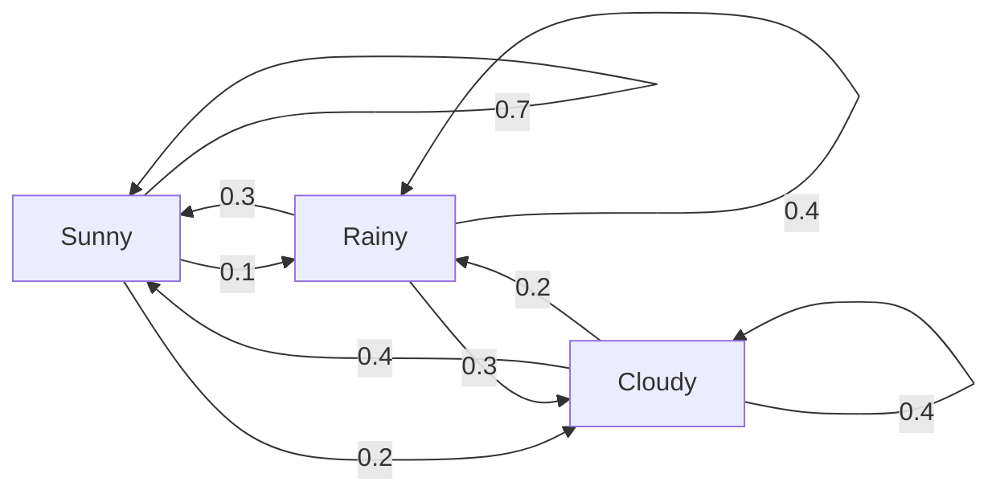
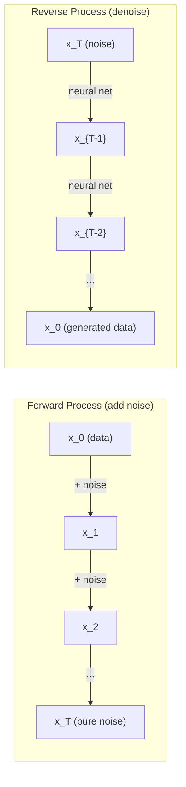

# Стохастические процессы

> Случайность со структурой. Математика, лежащая в основе случайных блужданий, марковских цепей и диффузионных моделей.

**Тип:** Learn
**Язык:** Python
**Предварительные требования:** Фаза 1, Уроки 06-07 (вероятность, теорема Байеса)
**Время:** ~75 минут

## Цели обучения

- Смоделировать одномерные и двумерные случайные блуждания и проверить масштабирование смещения по закону sqrt(n)
- Построить симулятор марковской цепи и вычислить её стационарное распределение с помощью собственного разложения
- Реализовать MCMC-алгоритм Метрополиса — Гастингса и динамику Ланжевена для сэмплирования из целевых распределений
- Связать прямой диффузионный процесс с броуновским движением и объяснить, как обратный процесс генерирует данные

## Проблема

Многие системы ИИ включают случайность, которая эволюционирует во времени. Не статическую случайность — структурированную, последовательную случайность, где каждый шаг зависит от предыдущего.

Языковые модели генерируют токены по одному. Каждый токен зависит от предыдущего контекста. Модель выдаёт распределение вероятностей, сэмплирует из него и переходит дальше. Это и есть стохастический процесс.

Диффузионные модели добавляют шум к изображению шаг за шагом, пока оно не превратится в чистый шум. Затем они обращают процесс, убирая шум шаг за шагом, пока не появится новое изображение. Прямой процесс — это марковская цепь. Обратный процесс — это обученная марковская цепь, работающая в обратном направлении.

Агенты обучения с подкреплением совершают действия в среде. Каждое действие с некоторой вероятностью приводит к новому состоянию. Агент следует случайной политике в случайном мире. В целом это марковский процесс принятия решений.

Сэмплирование MCMC — основа байесовского вывода — строит марковскую цепь, стационарным распределением которой является апостериорное распределение, из которого вы хотите сэмплировать.

Всё это опирается на четыре фундаментальные идеи:
1. Случайные блуждания — простейший стохастический процесс
2. Марковские цепи — структурированная случайность с матрицей переходов
3. Динамика Ланжевена — градиентный спуск с шумом
4. Метрополис — Гастингс — сэмплирование из произвольного распределения

## Концепция

### Случайные блуждания

Начните с позиции 0. На каждом шаге подбрасывайте честную монету. Орёл: сдвиг вправо (+1). Решка: сдвиг влево (-1).

После n шагов ваша позиция — это сумма n случайных значений +/-1. Ожидаемая позиция равна 0 (блуждание несмещённое). Но ожидаемое расстояние от начала координат растёт как sqrt(n).

Это противоречит интуиции. Блуждание честное — нет сноса ни в ту, ни в другую сторону. Но со временем оно уходит всё дальше и дальше от точки старта. Стандартное отклонение после n шагов равно sqrt(n).

```
Step 0:  Position = 0
Step 1:  Position = +1 or -1
Step 2:  Position = +2, 0, or -2
...
Step 100: Expected distance from origin ~ 10 (sqrt(100))
Step 10000: Expected distance from origin ~ 100 (sqrt(10000))
```

**В 2D** блуждание перемещается вверх, вниз, влево или вправо с равной вероятностью. То же масштабирование sqrt(n) применимо к расстоянию от начала координат. Траектория образует фракталоподобный узор.

**Почему sqrt(n)?** Каждый шаг равен +1 или -1 с равной вероятностью. После n шагов позиция S_n = X_1 + X_2 + ... + X_n, где каждое X_i равно +/-1. Дисперсия каждого шага равна 1, а шаги независимы, поэтому Var(S_n) = n. Стандартное отклонение = sqrt(n). По центральной предельной теореме S_n / sqrt(n) сходится к стандартному нормальному распределению.

Это масштабирование sqrt(n) встречается повсюду в машинном обучении. Шум SGD масштабируется как 1/sqrt(batch_size). Размерности эмбеддингов масштабируются как sqrt(d). Квадратный корень — отличительный признак независимых случайных сложений.

**Связь с броуновским движением.** Возьмите случайное блуждание с размером шага 1/sqrt(n) и n шагами за единицу времени. Когда n стремится к бесконечности, блуждание сходится к броуновскому движению B(t) — процессу в непрерывном времени, где B(t) имеет нормальное распределение со средним 0 и дисперсией t.

Броуновское движение — математическая основа диффузии. Оно моделирует случайное дрожание частиц в жидкости, колебания цен акций и — что особенно важно — процесс шума в диффузионных моделях.

**Разорение игрока.** Случайный блуждающий начинает в позиции k, с поглощающими барьерами в 0 и N. Какова вероятность достичь N раньше, чем 0? Для честного блуждания: P(достичь N) = k/N. Это удивительно просто и элегантно. Это связано с теорией мартингалов — честное случайное блуждание является мартингалом (ожидаемое будущее значение = текущее значение).

### Марковские цепи

Марковская цепь — это система, которая переходит между состояниями согласно фиксированным вероятностям. Ключевое свойство: следующее состояние зависит только от текущего состояния, а не от истории.

```
P(X_{t+1} = j | X_t = i, X_{t-1} = ...) = P(X_{t+1} = j | X_t = i)
```

Это марковское свойство. Оно означает, что всю динамику можно описать матрицей переходов P:

```
P[i][j] = probability of going from state i to state j
```

Каждая строка P в сумме даёт 1 (вы должны куда-то перейти).

**Пример — погода:**

```
States: Sunny (0), Rainy (1), Cloudy (2)

P = [[0.7, 0.1, 0.2],    (if sunny: 70% sunny, 10% rainy, 20% cloudy)
     [0.3, 0.4, 0.3],    (if rainy: 30% sunny, 40% rainy, 30% cloudy)
     [0.4, 0.2, 0.4]]    (if cloudy: 40% sunny, 20% rainy, 40% cloudy)
```

Начните в любом состоянии. После множества переходов распределение состояний сходится к стационарному распределению pi, где pi * P = pi. Это левый собственный вектор P с собственным значением 1.

Для цепи погоды стационарное распределение равно [0.55, 0.18, 0.27] — в долгосрочной перспективе солнечно 55% времени независимо от начального состояния.



**Вычисление стационарного распределения.** Есть два подхода:

1. **Метод степеней**: многократно умножайте любое начальное распределение на P. После достаточного числа итераций оно сходится.
2. **Метод собственных значений**: найдите левый собственный вектор P с собственным значением 1. Это собственный вектор P^T с собственным значением 1.

Оба подхода требуют, чтобы цепь удовлетворяла условиям сходимости.

**Условия сходимости.** Марковская цепь сходится к единственному стационарному распределению, если она:
- **Неприводима (irreducible)**: каждое состояние достижимо из любого другого состояния
- **Апериодична (aperiodic)**: цепь не циклится с фиксированным периодом

Большинство цепей, встречающихся в машинном обучении, удовлетворяют обоим условиям.

**Поглощающие состояния.** Состояние является поглощающим, если, войдя в него, вы никогда его не покидаете (P[i][i] = 1). Поглощающие марковские цепи моделируют процессы с терминальными состояниями — игру, которая заканчивается, клиента, который уходит, последовательность токенов, которая достигает токена конца текста.

**Время смешивания.** Сколько шагов нужно, чтобы цепь оказалась «близко» к стационарному распределению? Формально — число шагов, за которое расстояние полной вариации от стационарности опускается ниже некоторого порога. Быстрое смешивание = требуется мало шагов. Спектральная щель P (1 минус второе по величине собственное значение) определяет время смешивания. Больше щель = быстрее смешивание.

### Связь с языковыми моделями

Генерация токенов в языковой модели приближённо является марковским процессом. При заданном текущем контексте модель выдаёт распределение по следующему токену. Температура контролирует резкость распределения:

```
P(token_i) = exp(logit_i / temperature) / sum(exp(logit_j / temperature))
```

- Температура = 1.0: стандартное распределение
- Температура < 1.0: резче (более детерминировано)
- Температура > 1.0: более плоское (более случайно)
- Температура -> 0: argmax (жадный выбор)

Top-k сэмплирование усекает распределение до k токенов с наибольшей вероятностью. Top-p (nucleus) сэмплирование усекает до наименьшего набора токенов, чья суммарная вероятность превышает p. Оба метода изменяют вероятности марковских переходов.

### Броуновское движение

Предел случайного блуждания в непрерывном времени. Позиция B(t) обладает тремя свойствами:
1. B(0) = 0
2. B(t) - B(s) имеет нормальное распределение со средним 0 и дисперсией t - s (при t > s)
3. Приращения на непересекающихся интервалах независимы

Броуновское движение непрерывно, но нигде не дифференцируемо — оно дрожит на любом масштабе. Траектория имеет фрактальную размерность 2 на плоскости.

В дискретной симуляции броуновское движение аппроксимируется так:

```
B(t + dt) = B(t) + sqrt(dt) * z,    where z ~ N(0, 1)
```

Масштабирование sqrt(dt) важно. Оно следует из центральной предельной теоремы, применённой к случайным блужданиям.

### Динамика Ланжевена

Градиентный спуск находит минимум функции. Динамика Ланжевена находит распределение вероятностей, пропорциональное exp(-U(x)/T), где U — функция энергии, а T — температура.

```
x_{t+1} = x_t - dt * gradient(U(x_t)) + sqrt(2 * T * dt) * z_t
```

На частицу действуют две силы:
1. **Градиентная сила** (-dt * gradient(U)): толкает к низкой энергии (как в градиентном спуске)
2. **Случайная сила** (sqrt(2*T*dt) * z): толкает в случайных направлениях (исследование)

При температуре T = 0 это чистый градиентный спуск. При высокой температуре это почти случайное блуждание. При правильной температуре частица исследует энергетический ландшафт и проводит больше времени в областях с низкой энергией.

**Связь с диффузионными моделями.** Прямой процесс диффузионной модели:

```
x_t = sqrt(alpha_t) * x_{t-1} + sqrt(1 - alpha_t) * noise
```

Это марковская цепь, которая постепенно смешивает данные с шумом. После достаточного числа шагов x_T становится чистым гауссовским шумом.

Обратный процесс — переход от шума обратно к данным — тоже марковская цепь, но её вероятности переходов выучиваются нейронной сетью. Сеть учится предсказывать шум, добавленный на каждом шаге, а затем вычитает его.



### MCMC: марковские цепи Монте-Карло

Иногда нужно сэмплировать из распределения p(x), которое можно вычислить (с точностью до константы), но из которого нельзя сэмплировать напрямую. Классический пример — апостериорные распределения в байесовской статистике: известно произведение правдоподобия и априорного распределения, но нормирующая константа неподъёмна для вычисления.

**Метрополис — Гастингс** строит марковскую цепь, стационарным распределением которой является p(x):

1. Начните с некоторой позиции x
2. Предложите новую позицию x' из распределения предложений Q(x'|x)
3. Вычислите коэффициент принятия: a = p(x') * Q(x|x') / (p(x) * Q(x'|x))
4. Примите x' с вероятностью min(1, a). Иначе останьтесь в x.
5. Повторите.

Если Q симметрична (например, Q(x'|x) = Q(x|x') = N(x, sigma^2)), отношение упрощается до a = p(x') / p(x). Нужно лишь отношение вероятностей — нормирующая константа сокращается.

При мягких условиях цепь гарантированно сходится к p(x). Но сходимость может быть медленной, если предложение слишком мало (случайное блуждание) или слишком велико (высокая доля отклонений). Настройка распределения предложений — искусство MCMC.

**Почему это работает.** Коэффициент принятия обеспечивает детальный баланс: вероятность находиться в x и перейти в x' равна вероятности находиться в x' и перейти в x. Детальный баланс означает, что p(x) — это стационарное распределение цепи. Поэтому после достаточного числа шагов образцы поступают из p(x).

**Практические соображения:**
- **Разогрев (burn-in)**: отбросьте первые N образцов. Цепи нужно время, чтобы достичь стационарного распределения из начальной точки.
- **Прореживание (thinning)**: оставляйте каждый k-й образец, чтобы уменьшить автокорреляцию.
- **Несколько цепей**: запустите несколько цепей из разных начальных точек. Если они сходятся к одному и тому же распределению, это свидетельствует о сходимости.
- **Доля принятия**: для гауссовских предложений в d измерениях оптимальная доля принятия составляет около 23% (Roberts & Rosenthal, 2001). Слишком высокая — цепь почти не двигается. Слишком низкая — она всё отклоняет.

### Стохастические процессы в ИИ

| Процесс | Применение в ИИ |
|---------|-----------------|
| Случайное блуждание | Исследование в RL, эмбеддинги Node2Vec |
| Марковская цепь | Генерация текста, сэмплирование MCMC |
| Броуновское движение | Диффузионные модели (прямой процесс) |
| Динамика Ланжевена | Генеративные модели на основе скор-функции, SGLD |
| Марковский процесс принятия решений | Обучение с подкреплением |
| Метрополис — Гастингс | Байесовский вывод, сэмплирование из апостериорного распределения |

```figure
random-walk-diffusion
```

## Создаём

### Шаг 1: симулятор случайного блуждания

```python
import numpy as np

def random_walk_1d(n_steps, seed=None):
    rng = np.random.RandomState(seed)
    steps = rng.choice([-1, 1], size=n_steps)
    positions = np.concatenate([[0], np.cumsum(steps)])
    return positions


def random_walk_2d(n_steps, seed=None):
    rng = np.random.RandomState(seed)
    directions = rng.choice(4, size=n_steps)
    dx = np.zeros(n_steps)
    dy = np.zeros(n_steps)
    dx[directions == 0] = 1   # right
    dx[directions == 1] = -1  # left
    dy[directions == 2] = 1   # up
    dy[directions == 3] = -1  # down
    x = np.concatenate([[0], np.cumsum(dx)])
    y = np.concatenate([[0], np.cumsum(dy)])
    return x, y
```

Одномерное блуждание хранит накопленные суммы. Каждый шаг равен +1 или -1. После n шагов позиция — это сумма. Дисперсия растёт линейно с n, поэтому стандартное отклонение растёт как sqrt(n).

### Шаг 2: марковская цепь

```python
class MarkovChain:
    def __init__(self, transition_matrix, state_names=None):
        self.P = np.array(transition_matrix, dtype=float)
        self.n_states = len(self.P)
        self.state_names = state_names or [str(i) for i in range(self.n_states)]

    def step(self, current_state, rng=None):
        if rng is None:
            rng = np.random.RandomState()
        probs = self.P[current_state]
        return rng.choice(self.n_states, p=probs)

    def simulate(self, start_state, n_steps, seed=None):
        rng = np.random.RandomState(seed)
        states = [start_state]
        current = start_state
        for _ in range(n_steps):
            current = self.step(current, rng)
            states.append(current)
        return states

    def stationary_distribution(self):
        eigenvalues, eigenvectors = np.linalg.eig(self.P.T)
        idx = np.argmin(np.abs(eigenvalues - 1.0))
        stationary = np.real(eigenvectors[:, idx])
        stationary = stationary / stationary.sum()
        return np.abs(stationary)
```

Стационарное распределение — это левый собственный вектор P с собственным значением 1. Мы находим его, вычисляя собственные векторы P^T (транспонирование превращает левые собственные векторы в правые).

### Шаг 3: динамика Ланжевена

```python
def langevin_dynamics(grad_U, x0, dt, temperature, n_steps, seed=None):
    rng = np.random.RandomState(seed)
    x = np.array(x0, dtype=float)
    trajectory = [x.copy()]
    for _ in range(n_steps):
        noise = rng.randn(*x.shape)
        x = x - dt * grad_U(x) + np.sqrt(2 * temperature * dt) * noise
        trajectory.append(x.copy())
    return np.array(trajectory)
```

Градиент толкает x к низкой энергии. Шум не даёт застрять. В равновесии распределение образцов пропорционально exp(-U(x)/temperature).

### Шаг 4: Метрополис — Гастингс

```python
def metropolis_hastings(target_log_prob, proposal_std, x0, n_samples, seed=None):
    rng = np.random.RandomState(seed)
    x = np.array(x0, dtype=float)
    samples = [x.copy()]
    accepted = 0
    for _ in range(n_samples - 1):
        x_proposed = x + rng.randn(*x.shape) * proposal_std
        log_ratio = target_log_prob(x_proposed) - target_log_prob(x)
        if np.log(rng.rand()) < log_ratio:
            x = x_proposed
            accepted += 1
        samples.append(x.copy())
    acceptance_rate = accepted / (n_samples - 1)
    return np.array(samples), acceptance_rate
```

Алгоритм предлагает новую точку, проверяет, выше ли у неё вероятность (либо принимает её с вероятностью, пропорциональной отношению), и повторяет. Для хорошего смешивания доля принятия должна быть около 23-50%.

## Применяем

На практике для этих алгоритмов используют устоявшиеся библиотеки. Но понимание механики важно для отладки и настройки.

```python
import numpy as np

rng = np.random.RandomState(42)
walk = np.cumsum(rng.choice([-1, 1], size=10000))
print(f"Final position: {walk[-1]}")
print(f"Expected distance: {np.sqrt(10000):.1f}")
print(f"Actual distance: {abs(walk[-1])}")
```

### numpy для матриц переходов

```python
import numpy as np

P = np.array([[0.7, 0.1, 0.2],
              [0.3, 0.4, 0.3],
              [0.4, 0.2, 0.4]])

distribution = np.array([1.0, 0.0, 0.0])
for _ in range(100):
    distribution = distribution @ P

print(f"Stationary distribution: {np.round(distribution, 4)}")
```

Многократно умножайте начальное распределение на P. После достаточного числа итераций оно сходится к стационарному распределению независимо от точки старта. Это метод степеней для нахождения доминирующего левого собственного вектора.

### Связи с реальными фреймворками

- **Диффузия в PyTorch:** `DDPMScheduler` в Hugging Face `diffusers` реализует прямую и обратную марковские цепи
- **NumPyro / PyMC:** используют MCMC (сэмплер NUTS, улучшающий Метрополис — Гастингс) для байесовского вывода
- **Gymnasium (RL):** функция шага среды задаёт марковский процесс принятия решений

### Проверка сходимости марковской цепи

```python
import numpy as np

P = np.array([[0.9, 0.1], [0.3, 0.7]])

eigenvalues = np.linalg.eigvals(P)
spectral_gap = 1 - sorted(np.abs(eigenvalues))[-2]
print(f"Eigenvalues: {eigenvalues}")
print(f"Spectral gap: {spectral_gap:.4f}")
print(f"Approximate mixing time: {1/spectral_gap:.1f} steps")
```

Спектральная щель показывает, насколько быстро цепь забывает своё начальное состояние. Щель 0.2 означает примерно 5 шагов до смешивания. Щель 0.01 означает примерно 100 шагов. Всегда проверяйте это перед запуском длительных симуляций — медленно смешивающаяся цепь впустую расходует вычислительные ресурсы.

## Публикуем

Этот урок производит:
- `outputs/prompt-stochastic-process-advisor.md` — промпт, который помогает определить, какой стохастический процесс подходит для данной задачи

## Связи

| Концепция | Где встречается |
|-----------|----------------|
| Случайное блуждание | Графовые эмбеддинги Node2Vec, исследование в RL |
| Марковская цепь | Генерация токенов в LLM, сэмплирование MCMC |
| Броуновское движение | Прямой диффузионный процесс в DDPM, модели на основе SDE |
| Динамика Ланжевена | Генеративные модели на основе скор-функции, стохастическая градиентная динамика Ланжевена (SGLD) |
| Стационарное распределение | Целевое распределение при сходимости MCMC, PageRank |
| Метрополис — Гастингс | Сэмплирование из байесовского апостериорного распределения, имитация отжига |
| Температура | Сэмплирование в LLM, исследование по Больцману в RL, имитация отжига |
| Время смешивания | Скорость сходимости MCMC, анализ спектральной щели |
| Поглощающее состояние | Токен конца последовательности, терминальные состояния в RL |
| Детальный баланс | Гарантия корректности сэмплеров MCMC |

Диффузионные модели заслуживают особого внимания. DDPM (Ho et al., 2020) определяет прямую марковскую цепь:

```
q(x_t | x_{t-1}) = N(x_t; sqrt(1-beta_t) * x_{t-1}, beta_t * I)
```

где beta_t — расписание шума. После T шагов x_T приблизительно равно N(0, I). Обратный процесс параметризуется нейронной сетью, которая предсказывает шум:

```
p_theta(x_{t-1} | x_t) = N(x_{t-1}; mu_theta(x_t, t), sigma_t^2 * I)
```

Каждый шаг генерации — это шаг в обученной марковской цепи. Понимание марковских цепей означает понимание того, как и почему диффузионные модели генерируют данные.

SGLD (стохастическая градиентная динамика Ланжевена) сочетает градиентный спуск по мини-пакетам с шумом Ланжевена. Вместо вычисления полного градиента используется стохастическая оценка с добавлением калиброванного шума. По мере затухания скорости обучения SGLD переходит от оптимизации к сэмплированию — вы бесплатно получаете приближённые образцы из апостериорного распределения. Это один из самых простых способов получить оценки неопределённости от нейронной сети.

Главный вывод из всех этих связей: стохастические процессы — не просто теоретические инструменты. Это вычислительные механизмы внутри современных систем ИИ. Когда вы настраиваете температуру LLM, вы регулируете марковскую цепь. Когда вы обучаете диффузионную модель, вы учитесь обращать процесс, подобный броуновскому движению. Когда вы выполняете байесовский вывод, вы строите цепь, которая сходится к апостериорному распределению.

## Упражнения

1. **Смоделируйте 1000 случайных блужданий по 10000 шагов.** Постройте распределение конечных позиций. Убедитесь, что оно приблизительно гауссовское со средним 0 и стандартным отклонением sqrt(10000) = 100.

2. **Постройте генератор текста на основе марковской цепи.** Обучите его на небольшом корпусе: для каждого слова подсчитайте переходы к следующему слову. Постройте матрицу переходов. Генерируйте новые предложения, сэмплируя из цепи.

3. **Реализуйте имитацию отжига** с помощью Метрополиса — Гастингса. Начните с высокой температуры (принимайте почти всё) и постепенно охлаждайтесь (принимайте только улучшения). Используйте это, чтобы найти минимум функции со множеством локальных минимумов.

4. **Сравните динамику Ланжевена при разных температурах.** Сэмплируйте из потенциала с двумя ямами U(x) = (x^2 - 1)^2. При низкой температуре образцы скапливаются в одной яме. При высокой температуре они распределяются по обеим. Найдите критическую температуру, при которой цепь смешивается между ямами.

5. **Реализуйте прямой диффузионный процесс.** Начните с одномерного сигнала (например, синусоиды). Постепенно добавляйте шум за 100 шагов по линейному расписанию шума. Покажите, как сигнал деградирует до чистого шума. Затем реализуйте простой денойзер, который обращает процесс (даже наивный, который просто вычитает оценённый шум).

## Ключевые термины

| Термин | Как обычно говорят | Что это означает на самом деле |
|--------|--------------------|--------------------------------|
| Случайное блуждание | «Движение подбрасыванием монеты» | Процесс, в котором позиция изменяется на случайную величину на каждом шаге |
| Марковское свойство | «Без памяти» | Будущее зависит только от текущего состояния, а не от истории |
| Матрица переходов | «Таблица вероятностей» | P[i][j] = вероятность перехода из состояния i в состояние j |
| Стационарное распределение | «Долгосрочное среднее» | Распределение pi, где pi*P = pi — равновесие цепи |
| Броуновское движение | «Случайное дрожание» | Предел случайного блуждания в непрерывном времени, B(t) ~ N(0, t) |
| Динамика Ланжевена | «Градиентный спуск с шумом» | Правило обновления, сочетающее детерминированный градиент и случайное возмущение |
| MCMC | «Блуждание к цели» | Построение марковской цепи, стационарное распределение которой — нужное вам |
| Метрополис — Гастингс | «Предложить и принять/отклонить» | Алгоритм MCMC, использующий коэффициенты принятия для обеспечения сходимости |
| Температура | «Регулятор случайности» | Параметр, управляющий балансом между исследованием и использованием |
| Диффузионный процесс | «Шум туда, шум обратно» | Прямой процесс: постепенно добавляет шум. Обратный: постепенно удаляет его. Генерирует данные |

## Дополнительные материалы

- **Ho, Jain, Abbeel (2020)** -- «Denoising Diffusion Probabilistic Models». Статья DDPM, положившая начало революции диффузионных моделей. Понятный вывод прямой и обратной марковских цепей.
- **Song & Ermon (2019)** -- «Generative Modeling by Estimating Gradients of the Data Distribution». Подход на основе скор-функции, использующий динамику Ланжевена для сэмплирования.
- **Roberts & Rosenthal (2004)** -- «General state space Markov chains and MCMC algorithms». Теория, объясняющая, когда и почему работает MCMC.
- **Norris (1997)** -- «Markov Chains». Стандартный учебник. Охватывает сходимость, стационарные распределения и времена достижения.
- **Welling & Teh (2011)** -- «Bayesian Learning via Stochastic Gradient Langevin Dynamics». Сочетает SGD с динамикой Ланжевена для масштабируемого байесовского вывода.
