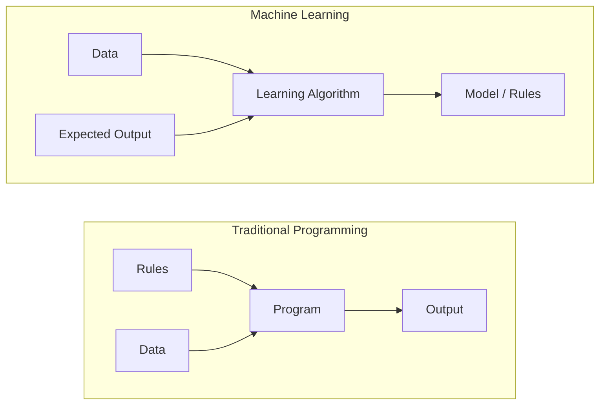
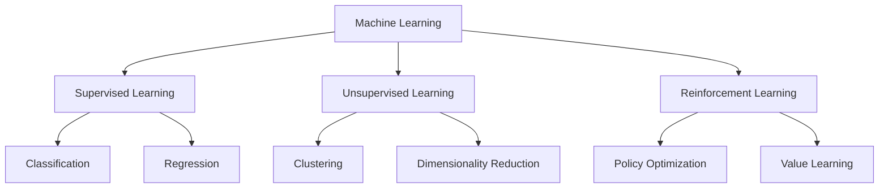
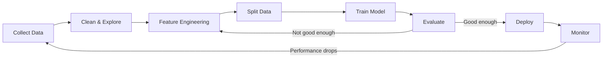
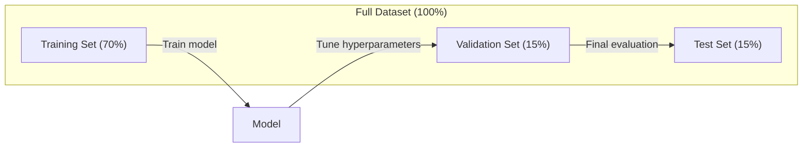
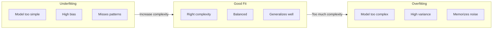
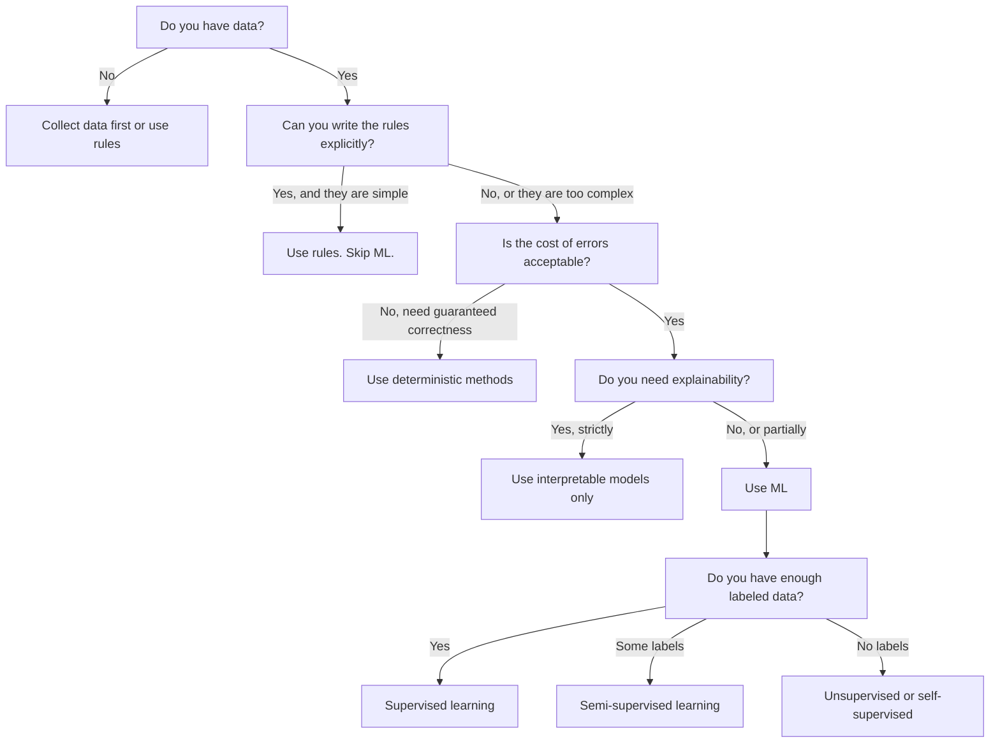

# Что такое машинное обучение

> Машинное обучение — это обучение компьютеров находить закономерности в данных вместо написания правил вручную.

**Тип:** Learn
**Языки:** Python
**Предварительные требования:** Фаза 1 (Основы математики)
**Время:** ~45 минут

## Цели обучения

- Объяснить разницу между обучением с учителем, обучением без учителя и обучением с подкреплением и определять, какой тип подходит для конкретной задачи
- Реализовать с нуля классификатор по ближайшему центроиду и оценить его в сравнении со случайным базовым уровнем
- Различать задачи классификации и регрессии и выбирать подходящую функцию потерь для каждой
- Оценивать, подходит ли данная бизнес-задача для машинного обучения или лучше решается детерминированными правилами

## Проблема

Вы хотите создать спам-фильтр. Традиционный подход: сесть и написать сотни правил. «Если письмо содержит "БЕСПЛАТНЫЕ ДЕНЬГИ", пометить как спам. Если в нём больше 3 восклицательных знаков, пометить как спам». Вы тратите недели на написание правил. Затем спамеры меняют формулировки. Ваши правила перестают работать. Вы пишете новые правила. Цикл никогда не заканчивается.

Машинное обучение переворачивает эту логику. Вместо того чтобы писать правила, вы даёте компьютеру тысячи размеченных писем («спам» или «не спам») и позволяете ему самому вывести правила. Компьютер находит закономерности, до которых вы никогда бы не додумались. Когда спамеры меняют тактику, вы обучаете модель заново на новых данных вместо переписывания кода.

Этот сдвиг от «программирования правил» к «обучению на данных» — суть машинного обучения. Так работает каждая рекомендательная система, голосовой помощник, беспилотный автомобиль и языковая модель.

## Концепция

### Обучение на данных, а не на правилах

Традиционное программирование и машинное обучение решают задачи в противоположных направлениях.



Традиционное программирование: вы пишете правила. Программа применяет их к данным, чтобы получить результат.

Машинное обучение: вы предоставляете данные и ожидаемые результаты. Алгоритм сам находит правила.

«Модель», получаемая в результате обучения, И ЕСТЬ правила, закодированные в виде чисел (весов, параметров). Она обобщает увиденные примеры, чтобы делать предсказания на данных, которые никогда раньше не видела.

### Три вида машинного обучения



**Обучение с учителем (supervised learning)**: у вас есть пары «вход-выход». Модель учится сопоставлять входы с выходами.
- «Вот 10 000 фотографий с метками "кошка" или "собака". Научись их различать».
- «Вот признаки домов и их цены. Научись предсказывать цену».

**Обучение без учителя (unsupervised learning)**: у вас есть только входы, без меток. Модель сама находит структуру.
- «Вот 10 000 историй покупок клиентов. Найди естественные группы».
- «Вот точки данных с 1000 измерений. Сократи до 2 измерений, сохранив структуру».

**Обучение с подкреплением (reinforcement learning)**: агент совершает действия в среде и получает вознаграждения или штрафы. Он учится стратегии (policy), максимизирующей суммарное вознаграждение.
- «Играй в эту игру. +1 за победу, -1 за поражение. Найди стратегию».
- «Управляй этой рукой робота. +1 за захват объекта, -0.01 за каждую впустую потраченную секунду».

Большая часть того, что вы будете строить на практике, использует обучение с учителем. Обучение без учителя часто применяется для предобработки и разведочного анализа. Обучение с подкреплением лежит в основе игрового ИИ, робототехники и RLHF для языковых моделей.

### За пределами трёх основных видов

Три категории выше выглядят чётко, но в реальных задачах машинного обучения границы между ними часто размываются.

**Частично контролируемое обучение (semi-supervised learning)** использует небольшой набор размеченных данных и большой набор неразмеченных. У вас может быть 100 размеченных медицинских снимков и 100 000 неразмеченных. Методы включают:

- **Распространение меток (label propagation):** постройте граф, соединяющий похожие точки данных. Метки распространяются от размеченных узлов к неразмеченным соседям через граф.
- **Псевдоразметка (pseudo-labeling):** обучите модель на размеченных данных, используйте её для предсказания меток неразмеченных данных, затем обучите заново на всех данных. Модель самостоятельно формирует собственный обучающий набор.
- **Регуляризация согласованности (consistency regularization):** модель должна выдавать одинаковое предсказание для входа и его слегка изменённой версии. Это работает даже без меток.

**Самоконтролируемое обучение (self-supervised learning)** создаёт сигнал обучения из самих данных. Разметка человеком вообще не нужна. Модель сама формирует задачу предсказания из структуры данных.

- **Моделирование языка с масками (masked language modeling, BERT):** скройте 15% слов в предложении, обучите модель предсказывать пропущенные слова. «Метки» берутся из исходного текста.
- **Контрастивное обучение (contrastive learning, SimCLR):** возьмите изображение, создайте две аугментированные версии. Обучите модель распознавать, что они получены из одного изображения, отличая их от аугментированных версий других изображений.
- **Предсказание следующего токена (next-token prediction, GPT):** предсказывайте следующее слово по всем предыдущим словам. Каждый текстовый документ становится обучающим примером.

Это не отдельные категории помимо трёх основных. Это стратегии, сочетающие идеи обучения с учителем и без учителя. Самоконтролируемое обучение технически является обучением с учителем (модель что-то предсказывает), но метки генерируются автоматически, а не человеком.

### Классификация против регрессии

Это два основных вида задач обучения с учителем.

| Аспект | Классификация | Регрессия |
|--------|---------------|------------|
| Результат | Дискретные категории | Непрерывные числа |
| Пример | «Это письмо — спам?» | «Какой будет цена дома?» |
| Пространство выходов | {кошка, собака, птица} | Любое вещественное число |
| Функция потерь | Кросс-энтропия, точность | Среднеквадратичная ошибка, MAE |
| Решение | Границы между классами | Кривая, аппроксимирующая данные |

Классификация отвечает на вопрос «какая категория?». Регрессия отвечает на вопрос «сколько?».

Некоторые задачи можно сформулировать и так, и так. Предсказание, вырастет акция или упадёт, — это классификация. Предсказание точной цены — это регрессия.

### Рабочий процесс машинного обучения

Каждый проект машинного обучения следует одному и тому же конвейеру, независимо от алгоритма.



**Сбор данных**: соберите исходные данные. Больше данных почти всегда лучше, но качество важнее количества.

**Очистка и разведочный анализ**: обработайте пропущенные значения, удалите дубликаты, визуализируйте распределения, найдите аномалии. Этот этап часто занимает 60-80% всего времени проекта.

**Конструирование признаков**: преобразуйте исходные данные в признаки, которые может использовать модель. Превратите даты в день недели. Нормализуйте числовые столбцы. Закодируйте категориальные переменные. Хорошие признаки важнее навороченных алгоритмов.

**Разделение данных**: разделите данные на обучающую, валидационную и тестовую выборки. Модель обучается на обучающих данных, вы настраиваете гиперпараметры на валидационных данных, а итоговую производительность отчитываете на тестовых данных.

**Обучение модели**: подайте обучающие данные в алгоритм. Алгоритм подстраивает внутренние параметры, чтобы минимизировать функцию потерь.

**Оценивание**: измерьте производительность на валидационных/тестовых данных. Если результат неприемлем, вернитесь назад и попробуйте другие признаки, алгоритмы или гиперпараметры.

**Развёртывание**: разместите модель в продакшене, где она делает предсказания на новых данных.

**Мониторинг**: отслеживайте производительность во времени. Распределения данных меняются (дрейф данных), и модели деградируют. Когда производительность падает, обучите модель заново.

### Разбиения на обучающую, валидационную и тестовую выборки

Это самое важное понятие, в котором ошибаются новички. Модель нужно оценивать на данных, которых она никогда не видела во время обучения. Иначе вы измеряете запоминание, а не обучение.



| Разбиение | Назначение | Когда используется | Типичный размер |
|-------|---------|-----------|-------------|
| Обучающая | Модель учится на этих данных | Во время обучения | 60-80% |
| Валидационная | Настройка гиперпараметров, сравнение моделей | После каждого запуска обучения | 10-20% |
| Тестовая | Итоговая непредвзятая оценка производительности | Один раз, в самом конце | 10-20% |

Тестовая выборка неприкосновенна. Вы смотрите на неё ровно один раз. Если вы продолжаете корректировать модель на основе результатов на тесте, вы фактически обучаетесь на тестовой выборке, и заявленные показатели теряют смысл.

Для небольших наборов данных используйте k-блочную кросс-валидацию: разделите данные на k частей, обучайтесь на k-1 частях, проверяйте на оставшейся, меняйте части по кругу и усредняйте результаты.

### Переобучение против недообучения



**Недообучение**: модель слишком проста, чтобы уловить закономерности в данных. Прямая линия, пытающаяся аппроксимировать криволинейную зависимость. Ошибка на обучении высокая. Ошибка на тесте высокая.

**Переобучение**: модель слишком сложна и запоминает обучающие данные, включая их шум. Извилистая кривая, проходящая через каждую обучающую точку, но не работающая на новых данных. Ошибка на обучении низкая. Ошибка на тесте высокая.

**Хорошая подгонка**: модель улавливает реальные закономерности, не запоминая шум. Ошибка и на обучении, и на тесте достаточно низкая.

Признаки переобучения:
- Точность на обучении намного выше, чем на валидации
- Модель хорошо работает на обучающих данных, но плохо на новых
- Добавление большего количества обучающих данных улучшает результат (модель запоминала, а не обучалась)

Способы борьбы с переобучением:
- Получите больше обучающих данных
- Уменьшите сложность модели (меньше параметров, более простая архитектура)
- Регуляризация (добавьте штраф за большие веса)
- Дропаут (случайно обнуляйте нейроны во время обучения)
- Ранняя остановка (остановите обучение, когда ошибка на валидации начинает расти)

Способы борьбы с недообучением:
- Используйте более сложную модель
- Добавьте больше признаков
- Уменьшите регуляризацию
- Обучайте дольше

### Компромисс между смещением и разбросом

Это математическая основа, стоящая за переобучением и недообучением.

**Смещение (bias)**: ошибка из-за неверных предположений модели. Линейная модель имеет высокое смещение, когда истинная зависимость нелинейна. Высокое смещение приводит к недообучению.

**Разброс (variance)**: ошибка из-за чувствительности к небольшим колебаниям в обучающих данных. Модель с высоким разбросом даёт очень разные предсказания при обучении на разных подвыборках данных. Высокий разброс приводит к переобучению.

| Сложность модели | Смещение | Разброс | Результат |
|-----------------|------|----------|--------|
| Слишком низкая (линейная модель для криволинейных данных) | Высокое | Низкий | Недообучение |
| В самый раз | Среднее | Средний | Хорошее обобщение |
| Слишком высокая (полином 20-й степени для 10 точек) | Низкое | Высокий | Переобучение |

Total error = Bias^2 + Variance + Irreducible noise

Неустранимый шум нельзя уменьшить (это случайность, присущая самим данным). Нужно найти оптимальную точку, в которой выражение bias^2 + variance минимально.

### Теорема об отсутствии бесплатных обедов (No Free Lunch)

Не существует единого алгоритма, который лучше всех работает для каждой задачи. Алгоритм, хорошо показывающий себя на одном классе задач, будет работать хуже на другом. Именно поэтому специалисты по данным пробуют несколько алгоритмов и сравнивают результаты.

На практике выбор зависит от:
- Сколько у вас данных
- Сколько признаков
- Линейна зависимость или нелинейна
- Нужна ли вам интерпретируемость
- Сколько вычислительных ресурсов вы можете себе позволить

### Когда НЕ стоит использовать машинное обучение

Машинное обучение — мощный инструмент, но не всегда подходящий. Прежде чем браться за модель, спросите себя, действительно ли она нужна.

**Не используйте машинное обучение, если:**

- **Правила простые и чётко определены.** Расчёт налогов, алгоритмы сортировки, преобразование единиц измерения. Если логику можно записать в нескольких условных операторах if, модель добавляет сложность без всякой пользы.
- **У вас нет данных или их очень мало.** Машинному обучению нужны примеры, на которых можно учиться. Имея 10 точек данных, нельзя обучить ничего осмысленного. Сначала соберите данные.
- **Цена ошибки катастрофична, и вам нужна гарантированная корректность.** Расчёт дозировки лекарств, управление ядерным реактором, криптографическая верификация. Модели машинного обучения вероятностны. Иногда они будут ошибаться. Если «иногда ошибается» неприемлемо, используйте детерминированные методы.
- **Задачу решает таблица соответствий или эвристика.** Если простой порог или таблица покрывают 99% случаев, добавление машинного обучения повышает затраты на поддержку без ощутимого улучшения.
- **Вы не можете объяснить решение, а объяснимость обязательна.** Регулируемые отрасли (кредитование, страхование, уголовное правосудие) иногда требуют, чтобы каждое решение было полностью объяснимо. Некоторые модели машинного обучения интерпретируемы (линейная регрессия, небольшие деревья решений). Большинство — нет.
- **Задача меняется быстрее, чем вы успеваете обучать модель заново.** Если правила меняются ежедневно, а повторное обучение занимает неделю, модель всегда устаревшая.

Используйте эту блок-схему принятия решений:



```figure
f3-learning-boundary
```

## Создаём

Код в `code/ml_intro.py` реализует классификатор по ближайшему центроиду с нуля — простейший из возможных алгоритмов машинного обучения. Он демонстрирует основную идею: обучиться на данных, затем делать предсказания на новых данных.

### Шаг 1: Классификатор по ближайшему центроиду с нуля

Классификатор по ближайшему центроиду вычисляет центр (среднее) каждого класса в обучающих данных. Для предсказания он относит каждую новую точку к классу, центр которого ближе всего.

```python
class NearestCentroid:
    def fit(self, X, y):
        self.classes = np.unique(y)
        self.centroids = np.array([
            X[y == c].mean(axis=0) for c in self.classes
        ])

    def predict(self, X):
        distances = np.array([
            np.sqrt(((X - c) ** 2).sum(axis=1))
            for c in self.centroids
        ])
        return self.classes[distances.argmin(axis=0)]
```

Это весь алгоритм. Fit вычисляет два средних значения. Predict вычисляет расстояния. Никакого градиентного спуска, никаких итераций, никаких гиперпараметров.

### Шаг 2: Обучение на синтетических данных

Мы генерируем двумерный набор данных для классификации с двумя слегка перекрывающимися классами. Классификатор по центроидам проводит линейную границу решения между центрами классов.

```python
rng = np.random.RandomState(42)
X_class0 = rng.randn(100, 2) + np.array([1.0, 1.0])
X_class1 = rng.randn(100, 2) + np.array([-1.0, -1.0])
X = np.vstack([X_class0, X_class1])
y = np.array([0] * 100 + [1] * 100)
```

### Шаг 3: Сравнение с базовым уровнем

Каждую модель машинного обучения нужно сравнивать с тривиальным базовым уровнем. Здесь базовый уровень предсказывает случайный класс. Если ваша модель не превосходит случайное угадывание, что-то не так.

```python
baseline_preds = rng.choice([0, 1], size=len(y_test))
baseline_acc = np.mean(baseline_preds == y_test)
```

Классификатор по центроидам должен показывать точность около 90%+ на этом чистом наборе данных. Случайный базовый уровень даёт около 50%.

### Почему это важно

Классификатор по ближайшему центроиду тривиально прост. У него нет гиперпараметров, итераций, градиентного спуска. Но он отражает фундаментальный паттерн машинного обучения:

1. **Обучение** представления на обучающих данных (центроиды)
2. **Предсказание** на новых данных с использованием этого представления (ближайшее расстояние)
3. **Оценивание** в сравнении с базовым уровнем (случайное угадывание)

Каждый алгоритм машинного обучения, от логистической регрессии до трансформеров, следует этому же трёхшаговому паттерну. Представление становится сложнее, но рабочий процесс остаётся тем же.

### Шаг 4: Что классификатор по центроидам не умеет

Классификатор по ближайшему центроиду предполагает, что каждый класс образует одно единое облако точек. Он проводит линейные границы решения. Он не справляется, когда:

- Классы состоят из нескольких кластеров (например, цифру «1» можно написать несколькими разными способами)
- Граница решения нелинейна (например, один класс охватывает другой)
- Признаки имеют очень разные масштабы (расстояние определяется признаком с наибольшим масштабом)

Эти ограничения мотивируют появление каждого следующего алгоритма, который вы изучите. Метод k ближайших соседей справляется с несколькими кластерами. Деревья решений справляются с нелинейными границами. Масштабирование признаков решает проблему масштаба. Каждый урок опирается на ограничения предыдущего.

## Применяем

sklearn предоставляет `NearestCentroid` и генераторы синтетических данных:

```python
from sklearn.neighbors import NearestCentroid
from sklearn.datasets import make_classification
from sklearn.model_selection import train_test_split

X, y = make_classification(
    n_samples=500, n_features=2, n_redundant=0,
    n_clusters_per_class=1, random_state=42
)
X_train, X_test, y_train, y_test = train_test_split(X, y, test_size=0.3)

clf = NearestCentroid()
clf.fit(X_train, y_train)
print(f"Accuracy: {clf.score(X_test, y_test):.3f}")
```

## Публикуем

Этот урок создаёт `outputs/prompt-ml-problem-framer.md` -- промпт, превращающий расплывчатые бизнес-задачи в конкретные задачи машинного обучения. Дайте ему описание задачи («мы хотим снизить отток клиентов» или «предсказать спрос на следующий квартал»), и он определит тип обучения, задаст целевую переменную для предсказания, перечислит кандидатов в признаки, выберет метрику успеха, установит базовый уровень и укажет на подводные камни вроде утечки данных или дисбаланса классов. Используйте его в начале любого проекта машинного обучения, чтобы не строить не то, что нужно.

## Ключевые термины

| Термин | Как обычно говорят | Что это значит на самом деле |
|------|----------------|----------------------|
| Модель | «Это ИИ» | Математическая функция с обучаемыми параметрами, отображающая входы в выходы |
| Обучение | «Обучаем ИИ» | Запуск алгоритма оптимизации для подстройки параметров модели так, чтобы предсказания совпадали с известными выходами |
| Признак | «Входной столбец» | Измеримое свойство данных, которое модель использует для предсказаний |
| Метка | «Правильный ответ» | Известный выход для обучающего примера, используемый для вычисления сигнала ошибки |
| Гиперпараметр | «Настройка, которую подкручивают» | Параметр, заданный до обучения и управляющий процессом обучения (скорость обучения, число слоёв) |
| Функция потерь | «Насколько модель ошибается» | Функция, измеряющая разрыв между предсказанными и фактическими выходами, которую обучение стремится минимизировать |
| Переобучение | «Запомнила тест» | Модель выучила специфичный для обучения шум вместо общих закономерностей, поэтому не работает на новых данных |
| Недообучение | «Ничему не научилась» | Модель слишком проста, чтобы уловить реальные закономерности в данных |
| Обобщение | «Работает на новых данных» | Способность модели делать точные предсказания на данных, на которых она не обучалась |
| Кросс-валидация | «Тестирование на разных кусках» | Многократное разбиение данных на обучающие/тестовые блоки с усреднением результатов, дающее более надёжную оценку производительности |
| Регуляризация | «Удержание весов маленькими» | Добавление штрафного члена к функции потерь, препятствующего чрезмерному усложнению модели |
| Дрейф данных | «Мир изменился» | Статистическое распределение поступающих данных со временем смещается, что ухудшает производительность модели |

## Упражнения

1. Возьмите любой набор данных (например, Iris, Titanic). Разделите его в пропорции 70/15/15 на обучающую/валидационную/тестовую выборки. Объясните, почему нельзя настраивать гиперпараметры на тестовой выборке.
2. Перечислите три задачи из реального мира. Для каждой определите, классификация это, регрессия или кластеризация, и с учителем она решается или без.
3. Модель показывает точность 99% на обучающих данных, но 60% на тестовых. Диагностируйте проблему и перечислите три способа её исправить.

## Дополнительные материалы

- [An Introduction to Statistical Learning](https://www.statlearning.com/) — бесплатный учебник, охватывающий все классические методы машинного обучения с практическими примерами
- [Вводный экспресс-курс Google по машинному обучению](https://developers.google.com/machine-learning/crash-course) — краткое визуальное введение в понятия машинного обучения
- [Руководство пользователя Scikit-learn](https://scikit-learn.org/stable/user_guide.html) — практический справочник по реализации машинного обучения на Python
