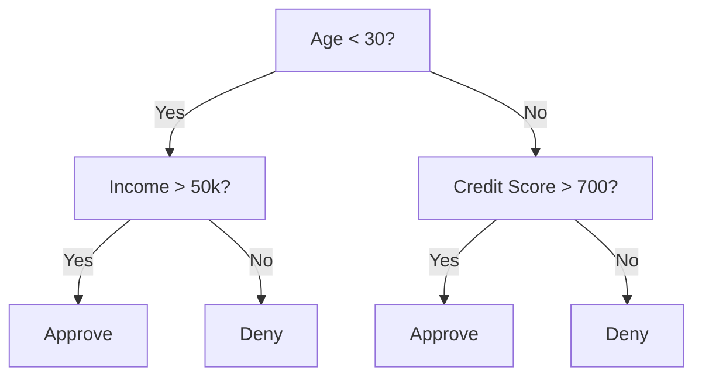
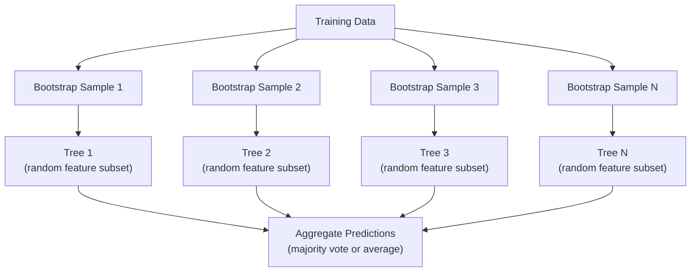

# Деревья решений и случайные леса

> Дерево решений — это всего лишь блок-схема. Но лес из них — один из самых мощных инструментов в ML.

**Тип:** Build
**Язык:** Python
**Предварительные требования:** Фаза 1 (Уроки 09 Теория информации, 06 Вероятность)
**Время:** ~90 минут

## Цели обучения

- Реализовать вычисления примеси Джини, энтропии и прироста информации для поиска оптимальных разбиений дерева решений
- Построить классификатор дерева решений с нуля с контролем предварительной обрезки (максимальная глубина, минимальное число образцов)
- Построить случайный лес с использованием бутстрэп-сэмплирования и рандомизации признаков и объяснить, почему это снижает дисперсию
- Сравнить важность признаков MDI с важностью на основе перестановок и определить, когда MDI смещена

## Проблема

У вас есть табличные данные. Строки — это образцы, столбцы — признаки, и есть целевой столбец, который вы хотите предсказать. Вы могли бы бросить на это нейронную сеть. Но для табличных данных модели на основе деревьев (деревья решений, случайные леса, градиентный бустинг деревьев) стабильно превосходят глубокое обучение. Соревнования Kaggle по структурированным данным доминируют XGBoost и LightGBM, а не трансформеры.

Почему? Деревья работают со смешанными типами признаков (числовыми и категориальными) без предобработки. Они работают с нелинейными зависимостями без конструирования признаков. Они интерпретируемы: вы можете посмотреть на дерево и увидеть, почему было сделано именно такое предсказание. А случайные леса, усредняющие множество деревьев, очень устойчивы к переобучению на наборах данных умеренного размера.

Этот урок строит деревья решений с нуля с помощью рекурсивного разбиения, а затем строит поверх них случайный лес. Вы реализуете математику, лежащую в основе критериев разбиения (примесь Джини, энтропия, прирост информации), и поймёте, почему ансамбль слабых обучателей становится сильным.

## Концепция

### Что делает дерево решений

Дерево решений разбивает пространство признаков на прямоугольные области, задавая последовательность вопросов да/нет.



Каждый внутренний узел проверяет признак относительно порога. Каждый листовой узел делает предсказание. Чтобы классифицировать новую точку данных, вы начинаете с корня и следуете по ветвям, пока не достигнете листа.

Дерево строится сверху вниз, выбирая в каждом узле признак и порог, которые лучше всего разделяют данные. «Лучше всего» определяется критерием разбиения.

### Критерии разбиения: измерение примеси

В каждом узле у нас есть набор образцов. Мы хотим разбить их так, чтобы получившиеся дочерние узлы были максимально «чистыми», то есть каждый дочерний узел содержал в основном один класс.

**Примесь Джини (Gini impurity)** измеряет вероятность того, что случайно выбранный образец будет неправильно классифицирован, если его пометить в соответствии с распределением классов в этом узле.

```
Gini(S) = 1 - sum(p_k^2)

where p_k is the proportion of class k in set S.
```

Для чистого узла (все одного класса) Gini = 0. Для бинарного разбиения 50/50 Gini = 0.5. Чем меньше, тем лучше.

```
Example: 6 cats, 4 dogs

Gini = 1 - (0.6^2 + 0.4^2) = 1 - (0.36 + 0.16) = 0.48
```

**Энтропия (Entropy)** измеряет информационное содержание (беспорядок) в узле. Рассмотрена в Фазе 1, Урок 09.

```
Entropy(S) = -sum(p_k * log2(p_k))
```

Для чистого узла энтропия = 0. Для бинарного разбиения 50/50 энтропия = 1.0. Чем меньше, тем лучше.

```
Example: 6 cats, 4 dogs

Entropy = -(0.6 * log2(0.6) + 0.4 * log2(0.4))
        = -(0.6 * -0.737 + 0.4 * -1.322)
        = 0.442 + 0.529
        = 0.971 bits
```

**Прирост информации (Information gain)** — это уменьшение примеси (энтропии или Джини) после разбиения.

```
IG(S, feature, threshold) = Impurity(S) - weighted_avg(Impurity(S_left), Impurity(S_right))

where the weights are the proportions of samples in each child.
```

Жадный алгоритм в каждом узле: перебрать каждый признак и каждый возможный порог. Выбрать пару (признак, порог), которая максимизирует прирост информации.

### Как работает разбиение

Для набора данных с n признаками и m образцами в текущем узле:

1. Для каждого признака j (j = 1 до n):
   - Отсортировать образцы по признаку j
   - Попробовать каждую среднюю точку между последовательными различными значениями в качестве порога
   - Вычислить прирост информации для каждого порога
2. Выбрать признак и порог с наибольшим приростом информации
3. Разбить данные на левую (признак <= порог) и правую (признак > порог) части
4. Рекурсивно повторить для каждого дочернего узла

Этот жадный подход не гарантирует глобально оптимальное дерево. Поиск оптимального дерева является NP-трудной задачей. Но жадное разбиение хорошо работает на практике.

### Условия остановки

Без условий остановки дерево растёт, пока каждый лист не станет чистым (один образец на лист). Это идеально запоминает обучающие данные и ужасно обобщается.

**Предварительная обрезка (Pre-pruning)** останавливает дерево до того, как оно полностью вырастет:
- Максимальная глубина: остановить разбиение, когда дерево достигает заданной глубины
- Минимальное число образцов на лист: остановиться, если в узле меньше k образцов
- Минимальный прирост информации: остановиться, если лучшее разбиение улучшает примесь меньше, чем на пороговое значение
- Максимальное число листьев: ограничить общее количество листьев

**Последующая обрезка (Post-pruning)** выращивает полное дерево, а затем подрезает его:
- Обрезка по цене-сложности (используется в scikit-learn): добавляет штраф, пропорциональный числу листьев. Увеличение штрафа даёт меньшие деревья
- Обрезка по уменьшению ошибки: удалить поддерево, если ошибка на валидации не увеличивается

Предварительная обрезка проще и быстрее. Последующая обрезка часто даёт лучшие деревья, потому что она не останавливает преждевременно разбиения, которые могли бы привести к полезным дальнейшим разбиениям.

### Деревья решений для регрессии

Для регрессии предсказание листа — это среднее значений целевой переменной в этом листе. Критерий разбиения тоже меняется:

**Уменьшение дисперсии (Variance reduction)** заменяет прирост информации:

```
VR(S, feature, threshold) = Var(S) - weighted_avg(Var(S_left), Var(S_right))
```

Выбрать разбиение, которое максимально уменьшает дисперсию. Дерево разбивает входное пространство на области и предсказывает константу (среднее) в каждой области.

### Случайные леса: сила ансамблей

Одно дерево решений имеет высокую дисперсию. Небольшие изменения в данных могут дать совершенно другие деревья. Случайные леса исправляют это, усредняя множество деревьев.



Два источника случайности делают деревья разнообразными:

**Бэггинг (bagging, bootstrap aggregating):** Каждое дерево обучается на бутстрэп-выборке — случайной выборке с возвращением из обучающих данных. Около 63% исходных образцов появляются в каждой бутстрэп-выборке (остальные — это out-of-bag образцы, которые можно использовать для валидации).

**Рандомизация признаков (Feature randomization):** При каждом разбиении рассматривается только случайное подмножество признаков. Для классификации по умолчанию используется sqrt(n_features). Для регрессии — n_features/3. Это предотвращает разбиение всех деревьев по одному и тому же доминирующему признаку.

Ключевая идея: усреднение множества некоррелированных деревьев уменьшает дисперсию без увеличения смещения. Каждое отдельное дерево может быть посредственным. Ансамбль силён.

### Важность признаков

Случайные леса естественным образом предоставляют оценки важности признаков. Самый распространённый метод:

**Среднее уменьшение примеси (Mean Decrease in Impurity, MDI):** Для каждого признака просуммировать общее уменьшение примеси по всем деревьям и всем узлам, где этот признак используется. Признаки, дающие большее уменьшение примеси на более ранних разбиениях, важнее.

```
importance(feature_j) = sum over all nodes where feature_j is used:
    (n_samples_at_node / n_total_samples) * impurity_decrease
```

Это быстро (вычисляется во время обучения), но смещено в сторону признаков высокой мощности (кардинальности) и признаков со множеством возможных точек разбиения.

**Важность на основе перестановок (Permutation importance)** — альтернатива: перемешать значения одного признака и измерить, насколько упадёт точность модели. Более надёжно, но медленнее.

### Когда деревья превосходят нейронные сети

Деревья и леса доминируют над нейронными сетями на табличных данных. Несколько причин:

| Фактор | Деревья | Нейронные сети |
|--------|-------|----------------|
| Смешанные типы (числовые + категориальные) | Нативная поддержка | Нужно кодирование |
| Малые наборы данных (< 10 тыс. строк) | Работают хорошо | Переобучаются |
| Взаимодействия признаков | Находятся при разбиении | Нужно проектирование архитектуры |
| Интерпретируемость | Полная прозрачность | Чёрный ящик |
| Время обучения | Минуты | Часы |
| Чувствительность к гиперпараметрам | Низкая | Высокая |

Нейронные сети выигрывают, когда данные имеют пространственную или последовательную структуру (изображения, текст, аудио). Для плоских таблиц признаков деревья — выбор по умолчанию.

```figure
decision-tree-depth
```

## Создаём

### Шаг 1: Примесь Джини и энтропия

Постройте оба критерия разбиения с нуля и проверьте, что они согласуются в том, какие разбиения хороши.

```python
import math

def gini_impurity(labels):
    n = len(labels)
    if n == 0:
        return 0.0
    counts = {}
    for label in labels:
        counts[label] = counts.get(label, 0) + 1
    return 1.0 - sum((c / n) ** 2 for c in counts.values())

def entropy(labels):
    n = len(labels)
    if n == 0:
        return 0.0
    counts = {}
    for label in labels:
        counts[label] = counts.get(label, 0) + 1
    return -sum(
        (c / n) * math.log2(c / n) for c in counts.values() if c > 0
    )
```

### Шаг 2: Найти лучшее разбиение

Перебрать каждый признак и каждый порог. Вернуть тот, что даёт наибольший прирост информации.

```python
def information_gain(parent_labels, left_labels, right_labels, criterion="gini"):
    measure = gini_impurity if criterion == "gini" else entropy
    n = len(parent_labels)
    n_left = len(left_labels)
    n_right = len(right_labels)
    if n_left == 0 or n_right == 0:
        return 0.0
    parent_impurity = measure(parent_labels)
    child_impurity = (
        (n_left / n) * measure(left_labels) +
        (n_right / n) * measure(right_labels)
    )
    return parent_impurity - child_impurity
```

### Шаг 3: Построить класс DecisionTree

Рекурсивное разбиение, предсказание и отслеживание важности признаков. Метод `_build` — сердце дерева: он останавливает построение, когда узел становится чистым или достигается ограничение предварительной обрезки; в противном случае он выбирает лучшее разбиение и рекурсивно строит оба дочерних узла.

```python
import random

class DecisionTree:
    def __init__(self, max_depth=None, min_samples_split=2,
                 min_samples_leaf=1, criterion="gini",
                 max_features=None):
        self.max_depth = max_depth
        self.min_samples_split = min_samples_split
        self.min_samples_leaf = min_samples_leaf
        self.criterion = criterion
        self.max_features = max_features
        self.tree = None
        self.feature_importances_ = None

    def fit(self, X, y):
        self.n_features = len(X[0])
        self.feature_importances_ = [0.0] * self.n_features
        self.n_samples = len(X)
        self.tree = self._build(X, y, depth=0)
        total = sum(self.feature_importances_)
        if total > 0:
            self.feature_importances_ = [
                fi / total for fi in self.feature_importances_
            ]

    def predict(self, X):
        return [self._predict_one(x, self.tree) for x in X]

    def _build(self, X, y, depth):
        if len(set(y)) == 1:
            return {"leaf": True, "value": y[0]}

        if self.max_depth is not None and depth >= self.max_depth:
            return self._make_leaf(y)

        if len(y) < self.min_samples_split:
            return self._make_leaf(y)

        best_feature, best_threshold, best_gain = self._best_split(X, y)

        if best_feature is None or best_gain <= 0:
            return self._make_leaf(y)

        left_X, left_y, right_X, right_y = self._split_data(
            X, y, best_feature, best_threshold
        )

        if len(left_y) < self.min_samples_leaf or len(right_y) < self.min_samples_leaf:
            return self._make_leaf(y)

        weight = len(y) / self.n_samples
        self.feature_importances_[best_feature] += weight * best_gain

        return {
            "leaf": False,
            "feature": best_feature,
            "threshold": best_threshold,
            "left": self._build(left_X, left_y, depth + 1),
            "right": self._build(right_X, right_y, depth + 1),
        }

    def _make_leaf(self, y):
        counts = {}
        for label in y:
            counts[label] = counts.get(label, 0) + 1
        return {"leaf": True, "value": max(counts, key=counts.get)}

    def _best_split(self, X, y):
        best_feature = None
        best_threshold = None
        best_gain = -1.0

        if self.max_features == "sqrt":
            k = max(1, int(math.sqrt(self.n_features)))
            feature_indices = random.sample(range(self.n_features), k)
        elif isinstance(self.max_features, int):
            if self.max_features < 1:
                raise ValueError("max_features must be at least 1 when given as an integer")
            k = min(self.max_features, self.n_features)
            feature_indices = random.sample(range(self.n_features), k)
        else:
            feature_indices = list(range(self.n_features))

        for feature_idx in feature_indices:
            values = sorted(set(X[i][feature_idx] for i in range(len(X))))
            if len(values) <= 1:
                continue

            for i in range(len(values) - 1):
                threshold = (values[i] + values[i + 1]) / 2.0
                left_y = [y[j] for j in range(len(X)) if X[j][feature_idx] <= threshold]
                right_y = [y[j] for j in range(len(X)) if X[j][feature_idx] > threshold]

                if len(left_y) < self.min_samples_leaf or len(right_y) < self.min_samples_leaf:
                    continue

                gain = information_gain(y, left_y, right_y, self.criterion)
                if gain > best_gain:
                    best_gain = gain
                    best_feature = feature_idx
                    best_threshold = threshold

        return best_feature, best_threshold, best_gain

    def _split_data(self, X, y, feature, threshold):
        left_X, left_y, right_X, right_y = [], [], [], []
        for i in range(len(X)):
            if X[i][feature] <= threshold:
                left_X.append(X[i])
                left_y.append(y[i])
            else:
                right_X.append(X[i])
                right_y.append(y[i])
        return left_X, left_y, right_X, right_y

    def _predict_one(self, x, node):
        if node["leaf"]:
            return node["value"]
        if x[node["feature"]] <= node["threshold"]:
            return self._predict_one(x, node["left"])
        return self._predict_one(x, node["right"])
```

### Шаг 4: Построить класс RandomForest

Бутстрэп-сэмплирование, рандомизация признаков и голосование большинством.

```python
class RandomForest:
    def __init__(self, n_trees=100, max_depth=None,
                 min_samples_split=2, max_features="sqrt",
                 criterion="gini"):
        self.n_trees = n_trees
        self.max_depth = max_depth
        self.min_samples_split = min_samples_split
        self.max_features = max_features
        self.criterion = criterion
        self.trees = []

    def fit(self, X, y):
        n = len(X)
        for _ in range(self.n_trees):
            indices = [random.randint(0, n - 1) for _ in range(n)]
            X_boot = [X[i] for i in indices]
            y_boot = [y[i] for i in indices]
            tree = DecisionTree(
                max_depth=self.max_depth,
                min_samples_split=self.min_samples_split,
                max_features=self.max_features,
                criterion=self.criterion,
            )
            tree.fit(X_boot, y_boot)
            self.trees.append(tree)

    def predict(self, X):
        all_preds = [tree.predict(X) for tree in self.trees]
        predictions = []
        for i in range(len(X)):
            votes = {}
            for preds in all_preds:
                v = preds[i]
                votes[v] = votes.get(v, 0) + 1
            predictions.append(max(votes, key=votes.get))
        return predictions
```

См. `code/trees.py` для полной реализации со всеми вспомогательными методами.

## Применяем

С scikit-learn обучение случайного леса занимает три строки:

```python
from sklearn.ensemble import RandomForestClassifier
from sklearn.datasets import load_iris
from sklearn.model_selection import train_test_split

X, y = load_iris(return_X_y=True)
X_train, X_test, y_train, y_test = train_test_split(X, y, random_state=42)

rf = RandomForestClassifier(n_estimators=100, random_state=42)
rf.fit(X_train, y_train)
print(f"Accuracy: {rf.score(X_test, y_test):.4f}")
print(f"Feature importances: {rf.feature_importances_}")
```

На практике градиентный бустинг деревьев (XGBoost, LightGBM, CatBoost) часто сильнее случайных лесов, потому что они строят деревья последовательно, причём каждое дерево исправляет ошибки предыдущих. Но случайные леса сложнее неправильно настроить, и они почти не требуют настройки гиперпараметров.

## Публикуем

Этот урок производит `outputs/prompt-tree-interpreter.md` — промпт, который интерпретирует разбиения дерева решений для бизнес-стейкхолдеров. Передайте ему структуру обученного дерева (глубину, признаки, пороги разбиений, точность) — и он переводит модель в правила на понятном языке, ранжирует важность признаков, отмечает переобучение или утечку данных и рекомендует дальнейшие шаги. Используйте его каждый раз, когда нужно объяснить модель на основе дерева тому, кто не читает код.

## Упражнения

1. Обучите одно дерево решений на 2D-наборе данных с 3 классами. Вручную проследите разбиения и нарисуйте прямоугольные границы решений. Сравните границы при max_depth=2 и max_depth=10.

2. Реализуйте разбиение по уменьшению дисперсии для регрессионных деревьев. Сгенерируйте y = sin(x) + noise для 200 точек и обучите своё регрессионное дерево. Постройте кусочно-постоянные предсказания дерева на фоне истинной кривой.

3. Постройте случайный лес с 1, 5, 10, 50 и 200 деревьями. Постройте графики точности на обучении и на тесте в зависимости от числа деревьев. Заметьте, что точность на тесте выходит на плато, но не снижается (леса устойчивы к переобучению).

4. Сравните примесь Джини и энтропию как критерии разбиения на 5 разных наборах данных. Измерьте точность и глубину дерева. В большинстве случаев они дают почти идентичные результаты. Объясните почему.

5. Реализуйте важность на основе перестановок. Сравните её с важностью MDI на наборе данных, где один признак — случайный шум, но с высокой мощностью (кардинальностью). MDI поставит шумовой признак высоко в рейтинге. Важность на основе перестановок — нет.

## Ключевые термины

| Term | Что говорят люди | Что это на самом деле означает |
|------|----------------|----------------------|
| Decision tree | «Блок-схема для предсказаний» | Модель, разбивающая пространство признаков на прямоугольные области путём обучения последовательности разбиений if/else |
| Gini impurity | «Насколько перемешан узел» | Вероятность неправильной классификации случайного образца в узле. 0 = чистый, 0.5 = максимальная примесь для бинарного случая |
| Entropy | «Беспорядок в узле» | Информационное содержание узла. 0 = чистый, 1.0 = максимальная неопределённость для бинарного случая. Из теории информации |
| Information gain | «Насколько хорошо разбиение» | Уменьшение примеси после разбиения. Жадный критерий выбора разбиений |
| Pre-pruning | «Остановить дерево раньше» | Раннее прекращение роста дерева заданием максимальной глубины, минимального числа образцов или порога минимального прироста |
| Post-pruning | «Подрезать дерево после» | Выращивание полного дерева с последующим удалением поддеревьев, не улучшающих качество на валидации |
| Bagging | «Обучение на случайных подмножествах» | Bootstrap aggregating. Обучение каждой модели на своей случайной выборке с возвращением |
| Random forest | «Куча деревьев» | Ансамбль деревьев решений, каждое из которых обучено на бутстрэп-выборке со случайными подмножествами признаков на каждом разбиении |
| Feature importance (MDI) | «Какие признаки важны» | Суммарное уменьшение примеси, вносимое каждым признаком, просуммированное по всем деревьям и узлам |
| Permutation importance | «Перемешать и проверить» | Падение точности при случайном перемешивании значений признака. Более надёжна, чем MDI, для шумных признаков |
| Variance reduction | «Регрессионная версия прироста информации» | Регрессионный аналог прироста информации. Выбирает разбиение, максимально уменьшающее дисперсию целевой переменной |
| Bootstrap sample | «Случайная выборка с повторами» | Случайная выборка, взятая с возвращением из исходного набора данных. Того же размера, но с дубликатами |

## Дополнительные материалы

- [Breiman: Random Forests (2001)](https://link.springer.com/article/10.1023/A:1010933404324) — оригинальная статья о случайных лесах
- [Grinsztajn et al.: Why do tree-based models still outperform deep learning on tabular data? (2022)](https://arxiv.org/abs/2207.08815) — строгое сравнение деревьев и нейронных сетей на табличных задачах
- [Документация scikit-learn по деревьям решений](https://scikit-learn.org/stable/modules/tree.html) — практическое руководство с инструментами визуализации
- [XGBoost: A Scalable Tree Boosting System (Chen & Guestrin, 2016)](https://arxiv.org/abs/1603.02754) — статья о градиентном бустинге, которая доминирует на Kaggle
