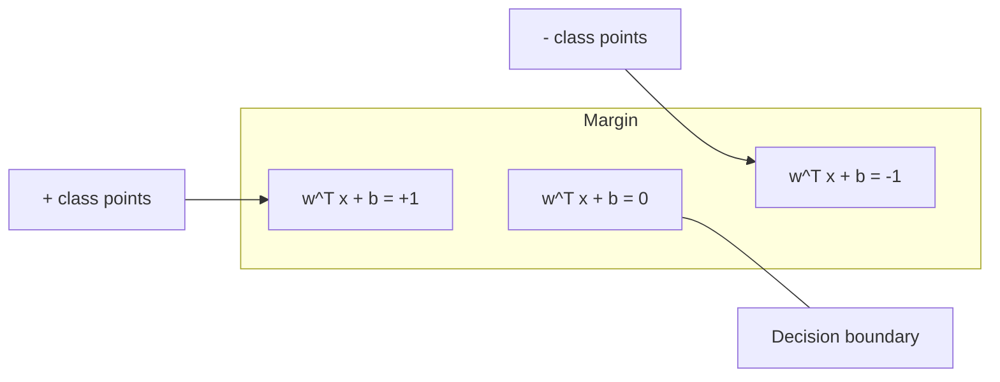
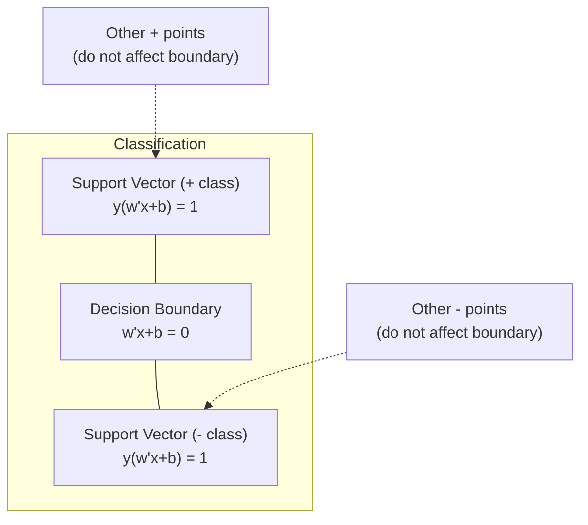
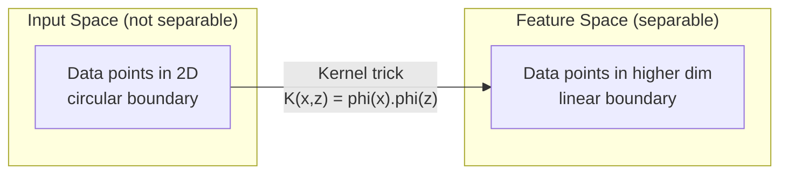

# Метод опорных векторов

> Найдите самую широкую улицу между двумя классами. В этом вся идея.

**Тип:** Build
**Язык:** Python
**Предварительные требования:** Фаза 1 (Уроки 08 Оптимизация, 14 Нормы и расстояния, 18 Выпуклая оптимизация)
**Время:** ~90 минут

## Цели обучения

- Реализовать линейный SVM с нуля, используя hinge loss и градиентный спуск для прямой (primal) формулировки
- Объяснить принцип максимального зазора и определить опорные векторы в обученной модели
- Сравнить линейное, полиномиальное и RBF-ядра и объяснить, как трюк с ядром позволяет избежать явного отображения в пространство высокой размерности
- Оценить компромисс, который контролирует параметр C, между шириной зазора и ошибками классификации

## Проблема

У вас есть два класса точек данных, и вам нужно провести линию (или гиперплоскость), разделяющую их. Подойти могут бесконечно много линий. Какую выбрать?

Ту, у которой самый большой зазор. Зазор — это расстояние между границей решения и ближайшими точками данных с каждой стороны. Более широкий зазор означает, что классификатор увереннее и лучше обобщается на новые данные.

Эта интуиция приводит к методу опорных векторов (Support Vector Machines, SVM) — одному из самых математически элегантных алгоритмов в ML. SVM были доминирующим методом классификации до глубокого обучения и остаются лучшим выбором для малых наборов данных, данных высокой размерности и задач, где нужна принципиальная, хорошо изученная модель с теоретическими гарантиями.

SVM напрямую связаны с Фазой 1: оптимизация выпукла (Урок 18), зазор измеряется с помощью норм (Урок 14), а трюк с ядром использует скалярные произведения для работы с нелинейными границами, никогда не вычисляя ничего в пространстве высокой размерности.

## Концепция

### Классификатор максимального зазора

Дано линейно разделимые данные с метками y_i из {-1, +1} и векторами признаков x_i, нам нужна гиперплоскость w^T x + b = 0, разделяющая классы.

Расстояние от точки x_i до гиперплоскости:

```
distance = |w^T x_i + b| / ||w||
```

Для правильно классифицированной точки: y_i * (w^T x_i + b) > 0. Зазор — это удвоенное расстояние от гиперплоскости до ближайшей точки с любой стороны.



Задача оптимизации:

```
maximize    2 / ||w||     (the margin width)
subject to  y_i * (w^T x_i + b) >= 1  for all i
```

Эквивалентно (минимизировать ||w||^2 проще для оптимизации):

```
minimize    (1/2) ||w||^2
subject to  y_i * (w^T x_i + b) >= 1  for all i
```

Это выпуклая квадратичная программа. У неё единственное глобальное решение. Точки данных, которые находятся точно на границах зазора (где y_i * (w^T x_i + b) = 1), называются опорными векторами. Только они определяют границу решения. Переместите или удалите любую точку, не являющуюся опорным вектором, — и граница не изменится.

### Опорные векторы: критически важное меньшинство



Большинство обучающих точек не имеют значения. Важны только опорные векторы. Именно поэтому SVM экономно расходуют память во время предсказания: нужно хранить только опорные векторы, а не весь обучающий набор.

Число опорных векторов также даёт границу для ошибки обобщения. Чем меньше опорных векторов относительно размера набора данных, тем лучше обобщение.

### Мягкий зазор: работа с шумом с помощью параметра C

Реальные данные редко бывают идеально разделимы. Некоторые точки могут оказаться не на той стороне границы или внутри зазора. Формулировка мягкого зазора допускает нарушения, вводя вспомогательные (slack) переменные.

```
minimize    (1/2) ||w||^2 + C * sum(xi_i)
subject to  y_i * (w^T x_i + b) >= 1 - xi_i
            xi_i >= 0  for all i
```

Вспомогательная переменная xi_i измеряет, насколько сильно точка i нарушает зазор. C контролирует компромисс:

| Значение C | Поведение |
|---------|----------|
| Большое C | Сильно штрафует нарушения. Узкий зазор, меньше ошибок классификации. Переобучение |
| Малое C | Допускает больше нарушений. Широкий зазор, больше ошибок классификации. Недообучение |

C — это обратная сила регуляризации. Большое C = меньше регуляризации. Малое C = больше регуляризации.

### Hinge loss: функция потерь SVM

Формулировку SVM с мягким зазором можно переписать как задачу оптимизации без ограничений:

```
minimize    (1/2) ||w||^2 + C * sum(max(0, 1 - y_i * (w^T x_i + b)))
```

Слагаемое max(0, 1 - y_i * f(x_i)) — это hinge loss. Оно равно нулю, когда точка правильно классифицирована и находится за пределами зазора. Оно линейно, когда точка находится внутри зазора или неправильно классифицирована.

```
Hinge loss for a single point:

loss
  |
  | \
  |  \
  |   \
  |    \
  |     \_______________
  |
  +-----|-----|-------->  y * f(x)
       0     1

Zero loss when y*f(x) >= 1 (correctly classified, outside margin).
Linear penalty when y*f(x) < 1.
```

Сравните с логистической потерей (логистическая регрессия):

```
Hinge:     max(0, 1 - y*f(x))          Hard cutoff at margin
Logistic:  log(1 + exp(-y*f(x)))        Smooth, never exactly zero
```

Hinge loss даёт разреженные решения (только опорные векторы дают ненулевой вклад). Логистическая потеря использует все точки данных. Это делает SVM более экономными по памяти во время предсказания.

### Обучение линейного SVM с помощью градиентного спуска

Вы можете обучить линейный SVM с помощью градиентного спуска на hinge loss плюс L2-регуляризация, не решая ограниченную QP-задачу:

```
L(w, b) = (lambda/2) * ||w||^2 + (1/n) * sum(max(0, 1 - y_i * (w^T x_i + b)))

Gradient with respect to w:
  If y_i * (w^T x_i + b) >= 1:  dL/dw = lambda * w
  If y_i * (w^T x_i + b) < 1:   dL/dw = lambda * w - y_i * x_i

Gradient with respect to b:
  If y_i * (w^T x_i + b) >= 1:  dL/db = 0
  If y_i * (w^T x_i + b) < 1:   dL/db = -y_i
```

Это называется прямой (primal) формулировкой. Она выполняется за O(n * d) на эпоху, где n — число образцов, а d — число признаков. Для больших разреженных данных высокой размерности (классификация текста) это быстро.

### Двойственная формулировка и трюк с ядром

Лагранжева двойственная задача SVM (из Фазы 1, Урок 18, условия KKT):

```
maximize    sum(alpha_i) - (1/2) * sum_ij(alpha_i * alpha_j * y_i * y_j * (x_i . x_j))
subject to  0 <= alpha_i <= C
            sum(alpha_i * y_i) = 0
```

Двойственная задача включает только скалярные произведения x_i . x_j между точками данных. Это ключевая идея. Замените каждое скалярное произведение функцией ядра K(x_i, x_j), и SVM сможет обучать нелинейные границы, никогда явно не вычисляя преобразование.

```
Linear kernel:      K(x, z) = x . z
Polynomial kernel:  K(x, z) = (x . z + c)^d
RBF (Gaussian):     K(x, z) = exp(-gamma * ||x - z||^2)
```

RBF-ядро отображает данные в пространство бесконечной размерности. Точки, близкие во входном пространстве, имеют значение ядра около 1. Точки, далёкие друг от друга, имеют значение ядра около 0. Оно может обучить любую гладкую границу решения.



Трюк с ядром вычисляет скалярное произведение в пространстве высокой размерности, никогда туда не попадая. Для полиномиального ядра степени d в D измерениях явное пространство признаков имеет O(D^d) измерений. Но K(x, z) вычисляется за время O(D).

### SVM для регрессии (SVR)

Метод опорных векторов для регрессии подгоняет трубку шириной epsilon вокруг данных. Точки внутри трубки имеют нулевую потерю. Точки вне трубки штрафуются линейно.

```
minimize    (1/2) ||w||^2 + C * sum(xi_i + xi_i*)
subject to  y_i - (w^T x_i + b) <= epsilon + xi_i
            (w^T x_i + b) - y_i <= epsilon + xi_i*
            xi_i, xi_i* >= 0
```

Параметр epsilon контролирует ширину трубки. Более широкая трубка = меньше опорных векторов = более гладкая подгонка. Более узкая трубка = больше опорных векторов = более точная подгонка.

### Почему SVM проиграли глубокому обучению (и когда они всё ещё побеждают)

SVM доминировали в ML с конца 1990-х до начала 2010-х. Глубокое обучение превзошло их по нескольким причинам:

| Фактор | SVM | Глубокое обучение |
|--------|------|---------------|
| Конструирование признаков | Требуется | Обучает признаки само |
| Масштабируемость | От O(n^2) до O(n^3) для ядра | O(n) на эпоху с SGD |
| Изображения/текст/аудио | Нужны признаки, сконструированные вручную | Обучается на сырых данных |
| Большие наборы данных (>100 тыс.) | Медленно | Хорошо масштабируется |
| Ускорение на GPU | Ограниченная польза | Огромное ускорение |

SVM всё ещё побеждают в следующих ситуациях:
- Малые наборы данных (от сотен до нескольких тысяч образцов)
- Разреженные данные высокой размерности (текст с признаками TF-IDF)
- Когда нужны математические гарантии (границы зазора)
- Когда время обучения должно быть минимальным (линейный SVM очень быстр)
- Бинарная классификация с чёткой структурой зазора
- Обнаружение аномалий (one-class SVM)

```figure
svm-margin
```

## Создаём

### Шаг 1: Hinge loss и градиент

Основа. Вычислите hinge loss для пакета данных и его градиент.

```python
def hinge_loss(X, y, w, b):
    n = len(X)
    total_loss = 0.0
    for i in range(n):
        margin = y[i] * (dot(w, X[i]) + b)
        total_loss += max(0.0, 1.0 - margin)
    return total_loss / n
```

### Шаг 2: Линейный SVM через градиентный спуск

Обучение путём минимизации регуляризованного hinge loss. Решатель QP не нужен.

```python
class LinearSVM:
    def __init__(self, lr=0.001, lambda_param=0.01, n_epochs=1000):
        self.lr = lr
        self.lambda_param = lambda_param
        self.n_epochs = n_epochs
        self.w = None
        self.b = 0.0

    def fit(self, X, y):
        n_features = len(X[0])
        self.w = [0.0] * n_features
        self.b = 0.0

        for epoch in range(self.n_epochs):
            for i in range(len(X)):
                margin = y[i] * (dot(self.w, X[i]) + self.b)
                if margin >= 1:
                    self.w = [wj - self.lr * self.lambda_param * wj
                              for wj in self.w]
                else:
                    self.w = [wj - self.lr * (self.lambda_param * wj - y[i] * X[i][j])
                              for j, wj in enumerate(self.w)]
                    self.b -= self.lr * (-y[i])

    def predict(self, X):
        return [1 if dot(self.w, x) + self.b >= 0 else -1 for x in X]
```

### Шаг 3: Функции ядра

Реализуйте линейное, полиномиальное и RBF-ядра.

```python
def linear_kernel(x, z):
    return dot(x, z)

def polynomial_kernel(x, z, degree=3, c=1.0):
    return (dot(x, z) + c) ** degree

def rbf_kernel(x, z, gamma=0.5):
    diff = [xi - zi for xi, zi in zip(x, z)]
    return math.exp(-gamma * dot(diff, diff))
```

### Шаг 4: Определение зазора и опорных векторов

После обучения определите, какие точки являются опорными векторами, и вычислите ширину зазора.

```python
def find_support_vectors(X, y, w, b, tol=1e-3):
    support_vectors = []
    for i in range(len(X)):
        margin = y[i] * (dot(w, X[i]) + b)
        if abs(margin - 1.0) < tol:
            support_vectors.append(i)
    return support_vectors
```

См. `code/svm.py` для полной реализации со всеми демонстрациями.

## Применяем

С scikit-learn:

```python
from sklearn.svm import SVC, LinearSVC, SVR
from sklearn.preprocessing import StandardScaler
from sklearn.pipeline import Pipeline

clf = Pipeline([
    ("scaler", StandardScaler()),
    ("svm", SVC(kernel="rbf", C=1.0, gamma="scale")),
])
clf.fit(X_train, y_train)
print(f"Accuracy: {clf.score(X_test, y_test):.4f}")
print(f"Support vectors: {clf['svm'].n_support_}")
```

Важно: всегда масштабируйте признаки перед обучением SVM. SVM чувствительны к масштабу признаков, потому что зазор зависит от ||w||, а немасштабированные признаки искажают геометрию.

Для больших наборов данных используйте `LinearSVC` (прямая формулировка, O(n) на эпоху) вместо `SVC` (двойственная формулировка, от O(n^2) до O(n^3)):

```python
from sklearn.svm import LinearSVC

clf = Pipeline([
    ("scaler", StandardScaler()),
    ("svm", LinearSVC(C=1.0, max_iter=10000)),
])
```

## Упражнения

1. Сгенерируйте 2D линейно разделимый набор данных. Обучите ваш LinearSVM и определите опорные векторы. Убедитесь, что опорные векторы — это точки, ближайшие к границе решения.

2. Изменяйте C от 0.001 до 1000 на зашумлённом наборе данных. Постройте границу решения для каждого значения C. Понаблюдайте за переходом от широкого зазора (недообучение) к узкому зазору (переобучение).

3. Создайте набор данных, где границы классов круговые (не линейные). Покажите, что линейный SVM не справляется. Вычислите матрицу RBF-ядра и покажите, что классы становятся разделимыми в пространстве признаков, порождённом ядром.

4. Сравните hinge loss и логистическую потерю на одном и том же наборе данных. Обучите линейный SVM и логистическую регрессию. Посчитайте, сколько обучающих точек вносят вклад в границу решения каждой модели (опорные векторы против всех точек).

5. Реализуйте SVR (epsilon-нечувствительная потеря). Подгоните её к y = sin(x) + noise. Постройте epsilon-трубку вокруг предсказаний и выделите опорные векторы (точки вне трубки).

## Ключевые термины

| Term | Что это на самом деле означает |
|------|----------------------|
| Support vectors | Обучающие точки, ближайшие к границе решения. Единственные точки, определяющие гиперплоскость |
| Margin | Расстояние между границей решения и ближайшими опорными векторами. SVM максимизируют его |
| Hinge loss | max(0, 1 - y*f(x)). Ноль, когда точка правильно классифицирована и находится за пределами зазора. Линейный штраф в остальных случаях |
| C parameter | Компромисс между шириной зазора и ошибками классификации. Большое C = узкий зазор, малое C = широкий зазор |
| Soft margin | Формулировка SVM, допускающая нарушения зазора с помощью вспомогательных переменных. Работает с неразделимыми данными |
| Kernel trick | Вычисление скалярных произведений в пространстве признаков высокой размерности без явного отображения в это пространство |
| Linear kernel | K(x, z) = x . z. Эквивалентно обычному скалярному произведению. Для линейно разделимых данных |
| RBF kernel | K(x, z) = exp(-gamma * \|\|x-z\|\|^2). Отображает в бесконечную размерность. Обучает любую гладкую границу |
| Polynomial kernel | K(x, z) = (x . z + c)^d. Отображает в пространство признаков полиномиальных комбинаций |
| Dual formulation | Переформулировка задачи SVM, зависящая только от скалярных произведений между точками данных. Делает возможным использование ядер |
| SVR | Support Vector Regression (метод опорных векторов для регрессии). Подгоняет epsilon-трубку вокруг данных. Точки внутри трубки имеют нулевую потерю |
| Slack variables | xi_i: измеряет, насколько точка нарушает зазор. Ноль для правильно классифицированных точек за пределами зазора |
| Maximum margin | Принцип выбора гиперплоскости, максимизирующей расстояние до ближайших точек каждого класса |

## Дополнительные материалы

- [Vapnik: The Nature of Statistical Learning Theory (1995)](https://link.springer.com/book/10.1007/978-1-4757-3264-1) — основополагающий текст о SVM и статистическом обучении
- [Cortes & Vapnik: Support-vector networks (1995)](https://link.springer.com/article/10.1007/BF00994018) — оригинальная статья об SVM
- [Platt: Sequential Minimal Optimization (1998)](https://www.microsoft.com/en-us/research/publication/sequential-minimal-optimization-a-fast-algorithm-for-training-support-vector-machines/) — алгоритм SMO, сделавший обучение SVM практичным
- [Документация scikit-learn по SVM](https://scikit-learn.org/stable/modules/svm.html) — практическое руководство с деталями реализации
- [LIBSVM: A Library for Support Vector Machines](https://www.csie.ntu.edu.tw/~cjlin/libsvm/) — C++ библиотека, лежащая в основе большинства реализаций SVM
