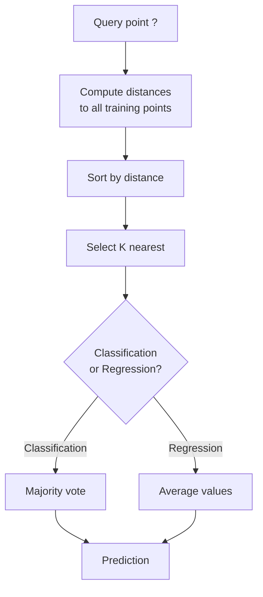
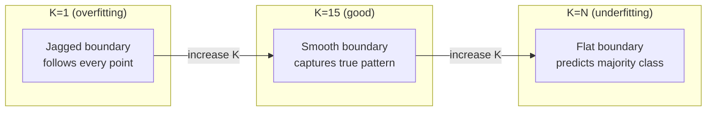
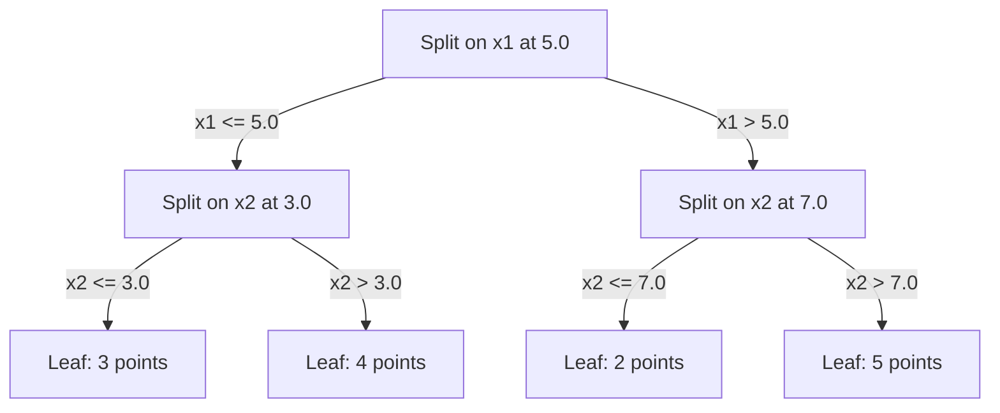

# K ближайших соседей и расстояния

> Храните всё. Предсказывайте, глядя на соседей. Простейший алгоритм, который действительно работает.

**Тип:** Build
**Язык:** Python
**Предварительные требования:** Фаза 1 (Урок 14. Нормы и расстояния)
**Время:** ~90 минут

## Цели обучения

- Реализовать классификацию и регрессию методом K ближайших соседей с нуля, с настраиваемым K и голосованием с учётом весов по расстоянию
- Сравнить метрики расстояния L1, L2, косинусную и Минковского и выбрать подходящую для заданного типа данных
- Объяснить проклятие размерности и показать, почему KNN деградирует в пространствах высокой размерности
- Построить KD-дерево для эффективного поиска ближайших соседей и проанализировать, когда оно превосходит полный перебор

## Проблема

У вас есть набор данных. Появляется новая точка данных. Нужно классифицировать её или предсказать её значение. Вместо того чтобы обучать параметры на данных (как в линейной регрессии или SVM), вы просто находите K обучающих точек, ближайших к новой точке, и даёте им проголосовать.

Это и есть метод K ближайших соседей (KNN). У него нет фазы обучения. Нет параметров, которые нужно выучить. Нет функции потерь, которую нужно минимизировать. Вы храните весь обучающий набор и вычисляете расстояния в момент предсказания.

Звучит слишком просто, чтобы работать. Но KNN на удивление конкурентоспособен для многих задач, особенно на малых и средних наборах данных, а глубокое понимание этого метода раскрывает фундаментальные концепции: выбор метрики расстояния (связано с Фазой 1, Уроком 14), проклятие размерности и различие между ленивым и активным обучением.

KNN также встречается повсюду в современном ИИ, просто под другими именами. Векторные базы данных выполняют KNN-поиск по эмбеддингам. Генерация с дополнением поиском (RAG) находит K ближайших фрагментов документов. Рекомендательные системы находят похожих пользователей или товары. Алгоритм тот же самый. Различаются масштаб и структуры данных.

## Концепция

### Как работает KNN

Дан набор размеченных точек и новая точка запроса:

1. Вычислить расстояние от запроса до каждой точки набора данных
2. Отсортировать по расстоянию
3. Взять K ближайших точек
4. Для классификации: голосование большинством среди K соседей
5. Для регрессии: усреднение (или взвешенное усреднение) значений K соседей



Это весь алгоритм целиком. Никакой подгонки. Никакого градиентного спуска. Никаких эпох.

### Выбор K

K — единственный гиперпараметр. Он управляет компромиссом между смещением и разбросом:

| K | Поведение |
|---|----------|
| K = 1 | Граница решения проходит через каждую точку. Нулевая ошибка на обучении. Высокий разброс. Переобучение |
| Малое K (3-5) | Чувствителен к локальной структуре. Способен захватывать сложные границы |
| Большое K | Более гладкие границы. Более устойчив к шуму. Может недообучаться |
| K = N | Предсказывает мажоритарный класс для каждой точки. Максимальное смещение |

Обычная отправная точка — K = sqrt(N) для набора данных из N точек. Используйте нечётное K для бинарной классификации, чтобы избежать ничьих.



### Метрики расстояния

Функция расстояния определяет, что значит «близко». Разные метрики дают разных соседей и разные предсказания.

**L2 (евклидово расстояние)** используется по умолчанию. Расстояние по прямой.

```
d(a, b) = sqrt(sum((a_i - b_i)^2))
```

Чувствительно к масштабу признаков. Всегда стандартизируйте признаки перед использованием L2 в KNN.

**L1 (манхэттенское расстояние)** суммирует абсолютные разности. Более устойчиво к выбросам, чем L2, поскольку не возводит разности в квадрат.

```
d(a, b) = sum(|a_i - b_i|)
```

**Косинусное расстояние** измеряет угол между векторами, игнорируя величину. Незаменимо для текстовых данных и эмбеддингов.

```
d(a, b) = 1 - (a . b) / (||a|| * ||b||)
```

**Расстояние Минковского** обобщает L1 и L2 с помощью параметра p.

```
d(a, b) = (sum(|a_i - b_i|^p))^(1/p)

p=1: Manhattan
p=2: Euclidean
p->inf: Chebyshev (max absolute difference)
```

Какую метрику использовать, зависит от данных:

| Тип данных | Лучшая метрика | Почему |
|-----------|------------|-----|
| Числовые признаки, схожий масштаб | L2 (евклидово) | По умолчанию, подходит для пространственных данных |
| Числовые признаки, выбросы | L1 (манхэттенское) | Устойчиво, не усиливает большие разности |
| Текстовые эмбеддинги | Косинусное | Величина — это шум, направление — это смысл |
| Разреженные данные высокой размерности | Косинусное или L1 | L2 страдает от проклятия размерности |
| Смешанные типы | Пользовательская метрика | Комбинируйте метрики по типу признака |

### Взвешенный KNN

Стандартный KNN даёт равный вес всем K соседям. Но сосед на расстоянии 0.1 должен значить больше, чем сосед на расстоянии 5.0.

**KNN с взвешиванием по расстоянию** взвешивает каждого соседа обратно пропорционально расстоянию:

```
weight_i = 1 / (distance_i + epsilon)

For classification: weighted vote
For regression:     weighted average = sum(w_i * y_i) / sum(w_i)
```

Epsilon предотвращает деление на ноль, когда точка запроса точно совпадает с обучающей точкой.

Взвешенный KNN менее чувствителен к выбору K, поскольку дальние соседи вносят очень малый вклад независимо от его значения.

### Проклятие размерности

Производительность KNN деградирует в пространствах высокой размерности. Это не смутное опасение. Это математический факт.

**Проблема 1: расстояния сходятся.** По мере роста размерности отношение максимального расстояния к минимальному стремится к 1. Все точки становятся одинаково «далёкими» от запроса.

```
In d dimensions, for random uniform points:

d=2:    max_dist / min_dist = varies widely
d=100:  max_dist / min_dist ~ 1.01
d=1000: max_dist / min_dist ~ 1.001

When all distances are nearly equal, "nearest" is meaningless.
```

**Проблема 2: объём взрывается.** Чтобы захватить K соседей в пределах фиксированной доли данных, нужно расширить радиус поиска, чтобы охватить гораздо большую долю пространства признаков. «Окрестность» в высоких размерностях охватывает большую часть пространства.

**Проблема 3: доминируют углы.** В единичном гиперкубе размерности d бо́льшая часть объёма сосредоточена вблизи углов, а не в центре. Сфера, вписанная в куб, содержит исчезающе малую долю объёма по мере роста d.

Практическое следствие: KNN хорошо работает примерно до 20-50 признаков. Сверх этого нужно снижение размерности (PCA, UMAP, t-SNE) перед применением KNN, либо использование древовидных структур поиска, эксплуатирующих внутреннюю более низкую размерность данных.

### KD-деревья: быстрый поиск ближайших соседей

Полный перебор в KNN вычисляет расстояние от запроса до каждой обучающей точки. Это O(n * d) на запрос. Для больших наборов данных это слишком медленно.

KD-дерево рекурсивно разбивает пространство вдоль осей признаков. На каждом уровне оно разделяет данные по одному измерению по медианному значению.



Чтобы найти ближайшего соседа, дерево обходится до листа, содержащего запрос, а затем происходит возврат назад и проверка соседних разбиений, только если они могут содержать более близкие точки.

Среднее время запроса: O(log n) при низкой размерности. Но KD-деревья деградируют до O(n) в пространствах высокой размерности (d > 20), потому что возврат назад отсекает всё меньше и меньше ветвей.

### Ball-деревья: лучше для умеренной размерности

Ball-деревья разбивают данные на вложенные гиперсферы вместо параллельных осям блоков. Каждый узел определяет шар (центр + радиус), содержащий все точки этого поддерева.

Преимущества перед KD-деревьями:
- Лучше работают при умеренной размерности (до ~50)
- Обрабатывают структуру, не выровненную по осям
- Более плотные ограничивающие объёмы означают, что при поиске отсекается больше ветвей

И KD-деревья, и ball-деревья — точные алгоритмы. Для по-настоящему масштабного поиска (миллионы точек, сотни измерений) вместо них используются методы приближённого поиска ближайших соседей (HNSW, IVF, продуктовое квантование). Они рассматриваются в Фазе 1, Уроке 14.

### Ленивое обучение против активного обучения

KNN — это ленивый обучатель: он не выполняет никакой работы во время обучения и всю работу — во время предсказания. Большинство других алгоритмов (линейная регрессия, SVM, нейронные сети) — активные обучатели: они выполняют тяжёлые вычисления во время обучения, чтобы построить компактную модель, после чего предсказания выполняются быстро.

| Аспект | Ленивый (KNN) | Активный (SVM, нейросеть) |
|--------|------------|------------------------|
| Время обучения | O(1), просто сохранить данные | O(n * epochs) |
| Время предсказания | O(n * d) на запрос | O(d) или O(параметры) |
| Память при предсказании | Хранит весь обучающий набор | Хранит только параметры модели |
| Адаптация к новым данным | Добавление точек мгновенно | Переобучение модели |
| Граница решения | Неявная, вычисляется на лету | Явная, фиксируется после обучения |

Ленивое обучение идеально, когда:
- Набор данных часто меняется (добавление/удаление точек без переобучения)
- Нужны предсказания для очень малого числа запросов
- Требуется нулевое время обучения
- Набор данных достаточно мал, чтобы полный перебор был быстрым

### KNN для регрессии

Вместо голосования большинством KNN для регрессии усредняет целевые значения K соседей.

```
prediction = (1/K) * sum(y_i for i in K nearest neighbors)

Or with distance weighting:
prediction = sum(w_i * y_i) / sum(w_i)
where w_i = 1 / distance_i
```

Регрессия KNN даёт кусочно-постоянные (или кусочно-гладкие при взвешивании) предсказания. Она не может экстраполировать за пределы диапазона обучающих данных. Если все обучающие целевые значения лежат между 0 и 100, KNN никогда не предскажет 200.

```figure
knn-smoothness
```

## Создаём

### Шаг 1: Функции расстояния

Реализуйте расстояния L1, L2, косинусное и Минковского. Они напрямую связаны с Фазой 1, Уроком 14.

```python
import math

def l2_distance(a, b):
    return math.sqrt(sum((ai - bi) ** 2 for ai, bi in zip(a, b)))

def l1_distance(a, b):
    return sum(abs(ai - bi) for ai, bi in zip(a, b))

def cosine_distance(a, b):
    dot_val = sum(ai * bi for ai, bi in zip(a, b))
    norm_a = math.sqrt(sum(ai ** 2 for ai in a))
    norm_b = math.sqrt(sum(bi ** 2 for bi in b))
    if norm_a == 0 or norm_b == 0:
        return 1.0
    return 1.0 - dot_val / (norm_a * norm_b)

def minkowski_distance(a, b, p=2):
    if p == float('inf'):
        return max(abs(ai - bi) for ai, bi in zip(a, b))
    return sum(abs(ai - bi) ** p for ai, bi in zip(a, b)) ** (1 / p)
```

### Шаг 2: Классификатор и регрессор KNN

Постройте полный KNN с настраиваемым K, метрикой расстояния и опциональным взвешиванием по расстоянию.

```python
class KNN:
    def __init__(self, k=5, distance_fn=l2_distance, weighted=False,
                 task="classification"):
        self.k = k
        self.distance_fn = distance_fn
        self.weighted = weighted
        self.task = task
        self.X_train = None
        self.y_train = None

    def fit(self, X, y):
        self.X_train = X
        self.y_train = y

    def predict(self, X):
        return [self._predict_one(x) for x in X]
```

### Шаг 3: KD-дерево для эффективного поиска

Постройте KD-дерево с нуля, которое рекурсивно разбивает по медиане каждого измерения.

```python
class KDTree:
    def __init__(self, X, indices=None, depth=0):
        # Recursively partition the data
        self.axis = depth % len(X[0])
        # Split on median of the current axis
        ...

    def query(self, point, k=1):
        # Traverse to leaf, then backtrack
        ...
```

Полную реализацию со всеми вспомогательными методами и демонстрациями см. в `code/knn.py`.

### Шаг 4: Масштабирование признаков

KNN требует масштабирования признаков, потому что расстояния чувствительны к величинам признаков. Признак в диапазоне от 0 до 1000 будет доминировать над признаком в диапазоне от 0 до 1.

```python
def standardize(X):
    n = len(X)
    d = len(X[0])
    means = [sum(X[i][j] for i in range(n)) / n for j in range(d)]
    stds = [
        max(1e-10, (sum((X[i][j] - means[j]) ** 2 for i in range(n)) / n) ** 0.5)
        for j in range(d)
    ]
    return [[((X[i][j] - means[j]) / stds[j]) for j in range(d)] for i in range(n)], means, stds
```

## Применяем

С помощью scikit-learn:

```python
from sklearn.neighbors import KNeighborsClassifier
from sklearn.preprocessing import StandardScaler
from sklearn.pipeline import Pipeline

clf = Pipeline([
    ("scaler", StandardScaler()),
    ("knn", KNeighborsClassifier(n_neighbors=5, metric="euclidean")),
])
clf.fit(X_train, y_train)
print(f"Accuracy: {clf.score(X_test, y_test):.4f}")
```

Scikit-learn автоматически использует KD-деревья или ball-деревья, когда набор данных достаточно велик, а размерность достаточно мала. Для данных высокой размерности он переходит к полному перебору. Управлять этим можно параметром `algorithm`.

Для по-настоящему масштабного поиска ближайших соседей (миллионы векторов) используйте FAISS, Annoy или векторную базу данных:

```python
import faiss

index = faiss.IndexFlatL2(dimension)
index.add(embeddings)
distances, indices = index.search(query_vectors, k=5)
```

## Упражнения

1. Реализуйте классификацию KNN на 2D-наборе данных с 3 классами. Постройте график границы решения для K=1, K=5, K=15 и K=N. Проследите переход от переобучения к недообучению.

2. Сгенерируйте 1000 случайных точек в пространствах размерности 2, 5, 10, 50, 100 и 500. Для каждой размерности вычислите отношение максимального попарного расстояния к минимальному попарному расстоянию. Постройте график зависимости отношения от размерности, чтобы визуализировать проклятие размерности.

3. Сравните расстояния L1, L2 и косинусное для KNN на задаче классификации текстов (используйте TF-IDF-векторы). Какая метрика даёт лучшую точность? Почему косинусное расстояние обычно выигрывает для текста?

4. Реализуйте KD-дерево и измерьте время запроса в сравнении с полным перебором для наборов данных из 1к, 10к и 100к точек в 2D, 10D и 50D. При какой размерности KD-дерево перестаёт быть быстрее полного перебора?

5. Постройте взвешенный KNN-регрессор для y = sin(x) + шум. Сравните его с невзвешенным KNN для K=3, 10, 30. Покажите, что взвешивание даёт более гладкие предсказания, особенно для больших K.

## Ключевые термины

| Термин | Что это на самом деле означает |
|------|----------------------|
| K ближайших соседей | Непараметрический алгоритм, предсказывающий путём поиска K ближайших к запросу обучающих точек |
| Ленивое обучение | Никаких вычислений во время обучения. Вся работа происходит во время предсказания. KNN — канонический пример |
| Активное обучение | Тяжёлые вычисления во время обучения для построения компактной модели. Большинство алгоритмов ML — активные |
| Проклятие размерности | В пространствах высокой размерности расстояния сходятся, а окрестности расширяются, охватывая почти всё пространство, из-за чего KNN становится неэффективным |
| KD-дерево | Бинарное дерево, рекурсивно разбивающее пространство вдоль осей признаков. Запросы за O(log n) при низкой размерности |
| Ball-дерево | Дерево вложенных гиперсфер. Работает лучше, чем KD-деревья, при умеренной размерности (до ~50) |
| Взвешенный KNN | Соседи взвешиваются обратно пропорционально расстоянию. Более близкие соседи сильнее влияют на предсказание |
| Масштабирование признаков | Приведение признаков к сопоставимым диапазонам. Требуется для методов, основанных на расстоянии, таких как KNN |
| Голосование большинством | Классификация путём подсчёта того, какой класс наиболее распространён среди K соседей |
| Полный перебор | Вычисление расстояния до каждой обучающей точки. O(n*d) на запрос. Точный, но медленный при большом n |
| Приближённый поиск ближайших соседей | Алгоритмы (HNSW, LSH, IVF), находящие приближённо ближайшие точки намного быстрее точного поиска |
| Диаграмма Вороного | Разбиение пространства, где каждая область содержит все точки, более близкие к одной обучающей точке, чем к любой другой. KNN при K=1 строит границы Вороного |

## Дополнительные материалы

- [Cover & Hart: Nearest Neighbor Pattern Classification (1967)](https://ieeexplore.ieee.org/document/1053964) - основополагающая статья о KNN, доказывающая, что частота ошибок не более чем вдвое превышает байесовский оптимум
- [Friedman, Bentley, Finkel: An Algorithm for Finding Best Matches in Logarithmic Expected Time (1977)](https://dl.acm.org/doi/10.1145/355744.355745) - оригинальная статья о KD-деревьях
- [Beyer et al.: When Is "Nearest Neighbor" Meaningful? (1999)](https://link.springer.com/chapter/10.1007/3-540-49257-7_15) - формальный анализ проклятия размерности для поиска ближайших соседей
- [scikit-learn Nearest Neighbors documentation](https://scikit-learn.org/stable/modules/neighbors.html) - практическое руководство по выбору алгоритма
- [FAISS: A Library for Efficient Similarity Search](https://github.com/facebookresearch/faiss) - библиотека Meta для приближённого поиска ближайших соседей в масштабе миллиардов
