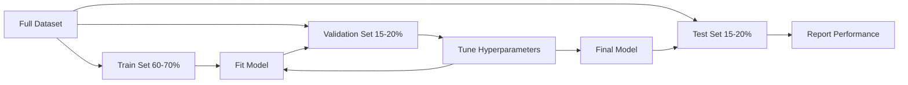

# Оценивание моделей

> Модель настолько хороша, насколько хорош способ её измерения.

**Тип:** Build
**Языки:** Python
**Предварительные требования:** этап 1 («Вероятность и распределения», «Статистика для ML»), уроки 1–8 этапа 2
**Время:** ~90 минут

## Цели обучения

- Реализовать K-fold и стратифицированную K-fold кросс-валидацию с нуля и объяснить, почему стратификация важна для несбалансированных данных
- Вычислить precision, recall, F1, AUC-ROC и метрики регрессии (MSE, RMSE, MAE, R-квадрат) с нуля
- Интерпретировать кривые обучения, чтобы диагностировать, страдает ли модель от высокого смещения или высокой дисперсии
- Выявлять типичные ошибки оценивания, включая утечку данных, неверный выбор метрики и загрязнение тестового набора

## Проблема

Вы обучили модель. Она даёт 95% точности на ваших данных. Хороша ли она?

Может быть. А может и нет. Если 95% ваших данных принадлежит одному классу, модель, которая всегда предсказывает этот класс, получит 95% точности, оставаясь при этом совершенно бесполезной. Если вы оценивали модель на тех же данных, на которых обучали, число 95% ничего не значит, потому что модель просто запомнила ответы. Если в вашем наборе данных есть временная составляющая, а вы случайно перемешали данные перед разбиением, ваша модель может использовать будущие данные для предсказания прошлого.

Оценивание моделей — это место, где чаще всего ошибаются в ML-проектах. Неверная метрика заставляет плохую модель выглядеть хорошей. Неверное разбиение позволяет модели «жульничать». Неверное сравнение заставляет вас выбрать модель похуже. Правильное оценивание — не опция. Это разница между моделью, которая работает в продакшене, и моделью, которая ломается в момент встречи с реальными данными.

## Суть

### Обучающий, валидационный и тестовый наборы



Три разбиения, три назначения:

- **Обучающий набор (training set)**: модель учится на этих данных. Она видит эти примеры во время обучения.
- **Валидационный набор (validation set)**: используется для подбора гиперпараметров и выбора между моделями. Модель никогда не обучается на этих данных, но ваши решения зависят от них.
- **Тестовый набор (test set)**: используется ровно один раз, в самом конце, чтобы сообщить итоговую эффективность. Если вы посмотрели на результат на тестовом наборе, а затем вернулись менять модель, это больше не тестовый набор. Он стал вторым валидационным набором.

Тестовый набор — это ваша гарантия того, что заявленная эффективность отражает поведение модели на по-настоящему невиданных данных.

### K-fold кросс-валидация

На небольших наборах данных единственное разбиение на обучающую и валидационную части расходует данные впустую и даёт шумные оценки. K-fold кросс-валидация использует все данные и для обучения, и для валидации:

```mermaid
flowchart TB
    subgraph Fold1["Fold 1"]
        direction LR
        V1["Val"] --- T1a["Train"] --- T1b["Train"] --- T1c["Train"] --- T1d["Train"]
    end
    subgraph Fold2["Fold 2"]
        direction LR
        T2a["Train"] --- V2["Val"] --- T2b["Train"] --- T2c["Train"] --- T2d["Train"]
    end
    subgraph Fold3["Fold 3"]
        direction LR
        T3a["Train"] --- T3b["Train"] --- V3["Val"] --- T3c["Train"] --- T3d["Train"]
    end
    subgraph Fold4["Fold 4"]
        direction LR
        T4a["Train"] --- T4b["Train"] --- T4c["Train"] --- V4["Val"] --- T4d["Train"]
    end
    subgraph Fold5["Fold 5"]
        direction LR
        T5a["Train"] --- T5b["Train"] --- T5c["Train"] --- T5d["Train"] --- V5["Val"]
    end
    Fold1 --> R["Average scores"]
    Fold2 --> R
    Fold3 --> R
    Fold4 --> R
    Fold5 --> R
```



1. Разбейте данные на K блоков (folds) равного размера
2. Для каждого блока обучите модель на K-1 блоках и провалидируйте на оставшемся
3. Усредните K значений валидационной метрики

K=5 или K=10 — стандартный выбор. Каждая точка данных используется для валидации ровно один раз. Средняя оценка стабильнее, чем оценка по любому одному разбиению.

**Стратифицированная K-fold (Stratified K-fold)**: сохраняет распределение классов в каждом блоке. Если ваш набор данных на 70% состоит из класса A и на 30% из класса B, каждый блок будет иметь примерно такое же соотношение. Это важно для несбалансированных наборов данных, где случайное разбиение может отправить все образцы меньшинства в один блок.

### Метрики классификации

**Матрица ошибок (confusion matrix)**: основа основ. Для бинарной классификации:

|  | Предсказан положительный класс | Предсказан отрицательный класс |
|--|---|---|
| Фактически положительный класс | Истинно положительный результат (TP) | Ложноотрицательный результат (FN) |
| Фактически отрицательный класс | Ложноположительный результат (FP) | Истинно отрицательный результат (TN) |

Из этой матрицы следуют все остальные метрики:

- **Accuracy (точность)** = (TP + TN) / (TP + TN + FP + FN). Доля верных предсказаний. Вводит в заблуждение при несбалансированных классах.
- **Precision (точность предсказаний)** = TP / (TP + FP). Из всего, что предсказано как положительное, сколько действительно оказалось таким? Используйте, когда ложные срабатывания дорого обходятся (например, спам-фильтр помечает настоящее письмо как спам).
- **Recall (полнота, sensitivity)** = TP / (TP + FN). Из всех реальных положительных случаев, сколько мы поймали? Используйте, когда ложноотрицательные случаи дорого обходятся (например, скрининг рака пропускает опухоль).
- **F1 score** = 2 * precision * recall / (precision + recall). Гармоническое среднее precision и recall. Уравновешивает обе метрики, когда ни одна из них явно не доминирует.
- **AUC-ROC**: площадь под ROC-кривой (Receiver Operating Characteristic). Отображает долю истинно положительных предсказаний в зависимости от доли ложноположительных при разных порогах классификации. AUC = 0.5 означает случайное угадывание, AUC = 1.0 означает идеальное разделение классов. Не зависит от порога: измеряет, насколько хорошо модель ранжирует положительные примеры выше отрицательных, независимо от выбранного порога отсечения.

### Метрики регрессии

- **MSE** (Mean Squared Error, среднеквадратичная ошибка) = mean((y_true - y_pred)^2). Штрафует большие ошибки квадратично. Чувствительна к выбросам.
- **RMSE** (Root Mean Squared Error, корень из среднеквадратичной ошибки) = sqrt(MSE). Те же единицы измерения, что и у целевой переменной. Интерпретировать проще, чем MSE.
- **MAE** (Mean Absolute Error, средняя абсолютная ошибка) = mean(|y_true - y_pred|). Рассматривает все ошибки линейно. Более устойчива к выбросам, чем MSE.
- **R-квадрат (R-squared)** = 1 - SS_res / SS_tot, где SS_res = sum((y_true - y_pred)^2), а SS_tot = sum((y_true - y_mean)^2). Доля дисперсии, объяснённая моделью. R^2 = 1.0 — идеально. R^2 = 0.0 означает, что модель не лучше, чем постоянное предсказание среднего значения. R^2 может быть отрицательным, если модель хуже, чем среднее.

### Кривые обучения

Отобразите обучающую и валидационную оценки как функцию размера обучающего набора:

- **Высокое смещение (недообучение)**: обе кривые сходятся к низкой оценке. Больше данных не поможет. Нужна более сложная модель.
- **Высокая дисперсия (переобучение)**: обучающая оценка высока, а валидационная значительно ниже. Разрыв между ними большой. Больше данных должно помочь.

### Кривые валидации

Отобразите обучающую и валидационную оценки как функцию гиперпараметра:

- При низкой сложности: обе оценки низкие (недообучение)
- При правильной сложности: обе оценки высоки и близки друг к другу
- При высокой сложности: обучающая оценка остаётся высокой, а валидационная падает (переобучение)

Оптимальное значение гиперпараметра — то, при котором валидационная оценка достигает пика.

### Типичные ошибки оценивания

**Утечка данных (data leakage)**: информация из тестового набора просачивается в обучение. Примеры: подгонка scaler по всему набору данных перед разбиением, включение будущих данных в предсказание временных рядов, использование признака, производного от целевой переменной. Всегда сначала разбивайте данные, затем предобрабатывайте.

**Дисбаланс классов**: 99% транзакций легитимны, 1% — мошенничество. Модель, которая всегда предсказывает «легитимно», получает 99% точности. Используйте вместо этого precision, recall, F1 или AUC-ROC.

**Неверная метрика**: оптимизация accuracy, когда следует оптимизировать recall (медицинская диагностика), или оптимизация RMSE, когда в данных есть выраженные выбросы (используйте вместо этого MAE).

**Отказ от стратифицированных разбиений**: при несбалансированных данных случайное разбиение может отправить в валидационный блок очень мало образцов меньшинства, что даёт нестабильные оценки.

**Слишком частое тестирование**: каждый раз, когда вы смотрите на результат на тестовом наборе и подстраиваете модель, вы переобучаетесь под тестовый набор. Тестовый набор предназначен для однократного использования.

```figure
precision-recall-threshold
```

## Реализация

### Шаг 1: разбиение на обучающую, валидационную и тестовую части

```python
import random
import math


def train_val_test_split(X, y, train_ratio=0.6, val_ratio=0.2, seed=42):
    random.seed(seed)
    n = len(X)
    indices = list(range(n))
    random.shuffle(indices)

    train_end = int(n * train_ratio)
    val_end = int(n * (train_ratio + val_ratio))

    train_idx = indices[:train_end]
    val_idx = indices[train_end:val_end]
    test_idx = indices[val_end:]

    X_train = [X[i] for i in train_idx]
    y_train = [y[i] for i in train_idx]
    X_val = [X[i] for i in val_idx]
    y_val = [y[i] for i in val_idx]
    X_test = [X[i] for i in test_idx]
    y_test = [y[i] for i in test_idx]

    return X_train, y_train, X_val, y_val, X_test, y_test
```

### Шаг 2: K-fold и стратифицированная K-fold кросс-валидация

```python
def kfold_split(n, k=5, seed=42):
    random.seed(seed)
    indices = list(range(n))
    random.shuffle(indices)

    fold_size = n // k
    folds = []

    for i in range(k):
        start = i * fold_size
        end = start + fold_size if i < k - 1 else n
        val_idx = indices[start:end]
        train_idx = indices[:start] + indices[end:]
        folds.append((train_idx, val_idx))

    return folds


def stratified_kfold_split(y, k=5, seed=42):
    random.seed(seed)

    class_indices = {}
    for i, label in enumerate(y):
        class_indices.setdefault(label, []).append(i)

    for label in class_indices:
        random.shuffle(class_indices[label])

    folds = [{"train": [], "val": []} for _ in range(k)]

    for label, indices in class_indices.items():
        fold_size = len(indices) // k
        for i in range(k):
            start = i * fold_size
            end = start + fold_size if i < k - 1 else len(indices)
            val_part = indices[start:end]
            train_part = indices[:start] + indices[end:]
            folds[i]["val"].extend(val_part)
            folds[i]["train"].extend(train_part)

    return [(f["train"], f["val"]) for f in folds]


def cross_validate(X, y, model_fn, k=5, metric_fn=None, stratified=False):
    n = len(X)

    if stratified:
        folds = stratified_kfold_split(y, k)
    else:
        folds = kfold_split(n, k)

    scores = []
    for train_idx, val_idx in folds:
        X_train = [X[i] for i in train_idx]
        y_train = [y[i] for i in train_idx]
        X_val = [X[i] for i in val_idx]
        y_val = [y[i] for i in val_idx]

        model = model_fn()
        model.fit(X_train, y_train)
        predictions = [model.predict(x) for x in X_val]

        if metric_fn:
            score = metric_fn(y_val, predictions)
        else:
            score = sum(1 for yt, yp in zip(y_val, predictions) if yt == yp) / len(y_val)
        scores.append(score)

    return scores
```

### Шаг 3: матрица ошибок и метрики классификации

```python
def confusion_matrix(y_true, y_pred):
    tp = sum(1 for yt, yp in zip(y_true, y_pred) if yt == 1 and yp == 1)
    tn = sum(1 for yt, yp in zip(y_true, y_pred) if yt == 0 and yp == 0)
    fp = sum(1 for yt, yp in zip(y_true, y_pred) if yt == 0 and yp == 1)
    fn = sum(1 for yt, yp in zip(y_true, y_pred) if yt == 1 and yp == 0)
    return tp, tn, fp, fn


def accuracy(y_true, y_pred):
    tp, tn, fp, fn = confusion_matrix(y_true, y_pred)
    total = tp + tn + fp + fn
    return (tp + tn) / total if total > 0 else 0.0


def precision(y_true, y_pred):
    tp, tn, fp, fn = confusion_matrix(y_true, y_pred)
    return tp / (tp + fp) if (tp + fp) > 0 else 0.0


def recall(y_true, y_pred):
    tp, tn, fp, fn = confusion_matrix(y_true, y_pred)
    return tp / (tp + fn) if (tp + fn) > 0 else 0.0


def f1_score(y_true, y_pred):
    p = precision(y_true, y_pred)
    r = recall(y_true, y_pred)
    return 2 * p * r / (p + r) if (p + r) > 0 else 0.0


def roc_curve(y_true, y_scores):
    thresholds = sorted(set(y_scores), reverse=True)
    tpr_list = []
    fpr_list = []

    total_positives = sum(y_true)
    total_negatives = len(y_true) - total_positives

    for threshold in thresholds:
        y_pred = [1 if s >= threshold else 0 for s in y_scores]
        tp = sum(1 for yt, yp in zip(y_true, y_pred) if yt == 1 and yp == 1)
        fp = sum(1 for yt, yp in zip(y_true, y_pred) if yt == 0 and yp == 1)

        tpr = tp / total_positives if total_positives > 0 else 0.0
        fpr = fp / total_negatives if total_negatives > 0 else 0.0

        tpr_list.append(tpr)
        fpr_list.append(fpr)

    return fpr_list, tpr_list, thresholds


def auc_roc(y_true, y_scores):
    fpr_list, tpr_list, _ = roc_curve(y_true, y_scores)

    pairs = sorted(zip(fpr_list, tpr_list))
    fpr_sorted = [p[0] for p in pairs]
    tpr_sorted = [p[1] for p in pairs]

    area = 0.0
    for i in range(1, len(fpr_sorted)):
        width = fpr_sorted[i] - fpr_sorted[i - 1]
        height = (tpr_sorted[i] + tpr_sorted[i - 1]) / 2
        area += width * height

    return area
```

### Шаг 4: метрики регрессии

```python
def mse(y_true, y_pred):
    n = len(y_true)
    return sum((yt - yp) ** 2 for yt, yp in zip(y_true, y_pred)) / n


def rmse(y_true, y_pred):
    return math.sqrt(mse(y_true, y_pred))


def mae(y_true, y_pred):
    n = len(y_true)
    return sum(abs(yt - yp) for yt, yp in zip(y_true, y_pred)) / n


def r_squared(y_true, y_pred):
    mean_y = sum(y_true) / len(y_true)
    ss_res = sum((yt - yp) ** 2 for yt, yp in zip(y_true, y_pred))
    ss_tot = sum((yt - mean_y) ** 2 for yt in y_true)
    if ss_tot == 0:
        return 0.0
    return 1.0 - ss_res / ss_tot
```

### Шаг 5: кривые обучения

```python
def learning_curve(X, y, model_fn, metric_fn, train_sizes=None, val_ratio=0.2, seed=42):
    random.seed(seed)
    n = len(X)
    indices = list(range(n))
    random.shuffle(indices)

    val_size = int(n * val_ratio)
    val_idx = indices[:val_size]
    pool_idx = indices[val_size:]

    X_val = [X[i] for i in val_idx]
    y_val = [y[i] for i in val_idx]

    if train_sizes is None:
        train_sizes = [int(len(pool_idx) * r) for r in [0.1, 0.2, 0.4, 0.6, 0.8, 1.0]]

    train_scores = []
    val_scores = []

    for size in train_sizes:
        subset = pool_idx[:size]
        X_train = [X[i] for i in subset]
        y_train = [y[i] for i in subset]

        model = model_fn()
        model.fit(X_train, y_train)

        train_pred = [model.predict(x) for x in X_train]
        val_pred = [model.predict(x) for x in X_val]

        train_scores.append(metric_fn(y_train, train_pred))
        val_scores.append(metric_fn(y_val, val_pred))

    return train_sizes, train_scores, val_scores
```

### Шаг 6: простой классификатор для тестирования и полная демонстрация

```python
class SimpleLogistic:
    def __init__(self, lr=0.1, epochs=100):
        self.lr = lr
        self.epochs = epochs
        self.weights = None
        self.bias = 0.0

    def sigmoid(self, z):
        z = max(-500, min(500, z))
        return 1.0 / (1.0 + math.exp(-z))

    def fit(self, X, y):
        n_features = len(X[0])
        self.weights = [0.0] * n_features
        self.bias = 0.0

        for _ in range(self.epochs):
            for xi, yi in zip(X, y):
                z = sum(w * x for w, x in zip(self.weights, xi)) + self.bias
                pred = self.sigmoid(z)
                error = yi - pred
                for j in range(n_features):
                    self.weights[j] += self.lr * error * xi[j]
                self.bias += self.lr * error

    def predict_proba(self, x):
        z = sum(w * xi for w, xi in zip(self.weights, x)) + self.bias
        return self.sigmoid(z)

    def predict(self, x):
        return 1 if self.predict_proba(x) >= 0.5 else 0


class SimpleLinearRegression:
    def __init__(self, lr=0.001, epochs=200):
        self.lr = lr
        self.epochs = epochs
        self.weights = None
        self.bias = 0.0

    def fit(self, X, y):
        n_features = len(X[0])
        self.weights = [0.0] * n_features
        self.bias = 0.0
        n = len(X)

        for _ in range(self.epochs):
            for xi, yi in zip(X, y):
                pred = sum(w * x for w, x in zip(self.weights, xi)) + self.bias
                error = yi - pred
                for j in range(n_features):
                    self.weights[j] += self.lr * error * xi[j] / n
                self.bias += self.lr * error / n

    def predict(self, x):
        return sum(w * xi for w, xi in zip(self.weights, x)) + self.bias


def standardize(values):
    n = len(values)
    mean = sum(values) / n
    var = sum((v - mean) ** 2 for v in values) / n
    std = math.sqrt(var) if var > 0 else 1.0
    return [(v - mean) / std for v in values], mean, std


def make_classification_data(n=300, seed=42):
    random.seed(seed)
    X = []
    y = []
    for _ in range(n):
        x1 = random.gauss(0, 1)
        x2 = random.gauss(0, 1)
        label = 1 if (x1 + x2 + random.gauss(0, 0.5)) > 0 else 0
        X.append([x1, x2])
        y.append(label)
    return X, y


def make_regression_data(n=200, seed=42):
    random.seed(seed)
    X = []
    y = []
    for _ in range(n):
        x1 = random.uniform(0, 10)
        x2 = random.uniform(0, 5)
        target = 3 * x1 + 2 * x2 + random.gauss(0, 2)
        X.append([x1, x2])
        y.append(target)
    return X, y


def make_imbalanced_data(n=300, minority_ratio=0.05, seed=42):
    random.seed(seed)
    X = []
    y = []
    for _ in range(n):
        if random.random() < minority_ratio:
            x1 = random.gauss(3, 0.5)
            x2 = random.gauss(3, 0.5)
            label = 1
        else:
            x1 = random.gauss(0, 1)
            x2 = random.gauss(0, 1)
            label = 0
        X.append([x1, x2])
        y.append(label)
    return X, y


if __name__ == "__main__":
    X_clf, y_clf = make_classification_data(300)

    print("=== Train/Validation/Test Split ===")
    X_train, y_train, X_val, y_val, X_test, y_test = train_val_test_split(X_clf, y_clf)
    print(f"  Train: {len(X_train)}, Val: {len(X_val)}, Test: {len(X_test)}")
    print(f"  Train class distribution: {sum(y_train)}/{len(y_train)} positive")
    print(f"  Val class distribution: {sum(y_val)}/{len(y_val)} positive")

    model = SimpleLogistic(lr=0.1, epochs=200)
    model.fit(X_train, y_train)

    print("\n=== Classification Metrics ===")
    y_pred = [model.predict(x) for x in X_test]
    tp, tn, fp, fn = confusion_matrix(y_test, y_pred)
    print(f"  Confusion matrix: TP={tp}, TN={tn}, FP={fp}, FN={fn}")
    print(f"  Accuracy:  {accuracy(y_test, y_pred):.4f}")
    print(f"  Precision: {precision(y_test, y_pred):.4f}")
    print(f"  Recall:    {recall(y_test, y_pred):.4f}")
    print(f"  F1 Score:  {f1_score(y_test, y_pred):.4f}")

    y_scores = [model.predict_proba(x) for x in X_test]
    auc = auc_roc(y_test, y_scores)
    print(f"  AUC-ROC:   {auc:.4f}")

    print("\n=== K-Fold Cross-Validation (K=5) ===")
    cv_scores = cross_validate(
        X_clf, y_clf,
        model_fn=lambda: SimpleLogistic(lr=0.1, epochs=200),
        k=5,
        metric_fn=accuracy,
    )
    mean_cv = sum(cv_scores) / len(cv_scores)
    std_cv = math.sqrt(sum((s - mean_cv) ** 2 for s in cv_scores) / len(cv_scores))
    print(f"  Fold scores: {[round(s, 4) for s in cv_scores]}")
    print(f"  Mean: {mean_cv:.4f} (+/- {std_cv:.4f})")

    print("\n=== Stratified K-Fold Cross-Validation (K=5) ===")
    strat_scores = cross_validate(
        X_clf, y_clf,
        model_fn=lambda: SimpleLogistic(lr=0.1, epochs=200),
        k=5,
        metric_fn=accuracy,
        stratified=True,
    )
    strat_mean = sum(strat_scores) / len(strat_scores)
    strat_std = math.sqrt(sum((s - strat_mean) ** 2 for s in strat_scores) / len(strat_scores))
    print(f"  Fold scores: {[round(s, 4) for s in strat_scores]}")
    print(f"  Mean: {strat_mean:.4f} (+/- {strat_std:.4f})")

    print("\n=== Imbalanced Data: Why Accuracy Lies ===")
    X_imb, y_imb = make_imbalanced_data(300, minority_ratio=0.05)
    positives = sum(y_imb)
    print(f"  Class distribution: {positives} positive, {len(y_imb) - positives} negative ({positives/len(y_imb)*100:.1f}% positive)")

    always_negative = [0] * len(y_imb)
    print(f"  Always-negative baseline:")
    print(f"    Accuracy:  {accuracy(y_imb, always_negative):.4f}")
    print(f"    Precision: {precision(y_imb, always_negative):.4f}")
    print(f"    Recall:    {recall(y_imb, always_negative):.4f}")
    print(f"    F1 Score:  {f1_score(y_imb, always_negative):.4f}")

    X_tr_i, y_tr_i, X_v_i, y_v_i, X_te_i, y_te_i = train_val_test_split(X_imb, y_imb)
    model_imb = SimpleLogistic(lr=0.5, epochs=500)
    model_imb.fit(X_tr_i, y_tr_i)
    y_pred_imb = [model_imb.predict(x) for x in X_te_i]
    print(f"\n  Trained model on imbalanced data:")
    print(f"    Accuracy:  {accuracy(y_te_i, y_pred_imb):.4f}")
    print(f"    Precision: {precision(y_te_i, y_pred_imb):.4f}")
    print(f"    Recall:    {recall(y_te_i, y_pred_imb):.4f}")
    print(f"    F1 Score:  {f1_score(y_te_i, y_pred_imb):.4f}")

    print("\n=== Regression Metrics ===")
    X_reg, y_reg = make_regression_data(200)

    col0 = [x[0] for x in X_reg]
    col1 = [x[1] for x in X_reg]
    col0_s, m0, s0 = standardize(col0)
    col1_s, m1, s1 = standardize(col1)
    X_reg_scaled = [[col0_s[i], col1_s[i]] for i in range(len(X_reg))]

    X_tr_r, y_tr_r, X_v_r, y_v_r, X_te_r, y_te_r = train_val_test_split(X_reg_scaled, y_reg)
    reg_model = SimpleLinearRegression(lr=0.01, epochs=500)
    reg_model.fit(X_tr_r, y_tr_r)
    y_pred_r = [reg_model.predict(x) for x in X_te_r]

    print(f"  MSE:       {mse(y_te_r, y_pred_r):.4f}")
    print(f"  RMSE:      {rmse(y_te_r, y_pred_r):.4f}")
    print(f"  MAE:       {mae(y_te_r, y_pred_r):.4f}")
    print(f"  R-squared: {r_squared(y_te_r, y_pred_r):.4f}")

    mean_baseline = [sum(y_tr_r) / len(y_tr_r)] * len(y_te_r)
    print(f"\n  Mean baseline:")
    print(f"    MSE:       {mse(y_te_r, mean_baseline):.4f}")
    print(f"    R-squared: {r_squared(y_te_r, mean_baseline):.4f}")

    print("\n=== Learning Curve ===")
    sizes, train_sc, val_sc = learning_curve(
        X_clf, y_clf,
        model_fn=lambda: SimpleLogistic(lr=0.1, epochs=200),
        metric_fn=accuracy,
    )
    print(f"  {'Size':>6} {'Train':>8} {'Val':>8}")
    for s, tr, va in zip(sizes, train_sc, val_sc):
        print(f"  {s:>6} {tr:>8.4f} {va:>8.4f}")

    print("\n=== Statistical Model Comparison ===")
    model_a_scores = cross_validate(
        X_clf, y_clf,
        model_fn=lambda: SimpleLogistic(lr=0.1, epochs=100),
        k=5, metric_fn=accuracy,
    )
    model_b_scores = cross_validate(
        X_clf, y_clf,
        model_fn=lambda: SimpleLogistic(lr=0.1, epochs=500),
        k=5, metric_fn=accuracy,
    )
    diffs = [a - b for a, b in zip(model_a_scores, model_b_scores)]
    mean_diff = sum(diffs) / len(diffs)
    std_diff = math.sqrt(sum((d - mean_diff) ** 2 for d in diffs) / len(diffs))
    t_stat = mean_diff / (std_diff / math.sqrt(len(diffs))) if std_diff > 0 else 0.0
    print(f"  Model A (100 epochs) mean: {sum(model_a_scores)/len(model_a_scores):.4f}")
    print(f"  Model B (500 epochs) mean: {sum(model_b_scores)/len(model_b_scores):.4f}")
    print(f"  Mean difference: {mean_diff:.4f}")
    print(f"  Paired t-statistic: {t_stat:.4f}")
    print(f"  (|t| > 2.78 for significance at p<0.05 with df=4)")
```

## Практика

С scikit-learn оценивание встроено в рабочий процесс:

```python
from sklearn.model_selection import cross_val_score, StratifiedKFold, learning_curve
from sklearn.metrics import (
    accuracy_score, precision_score, recall_score, f1_score,
    roc_auc_score, confusion_matrix, mean_squared_error, r2_score,
)
from sklearn.linear_model import LogisticRegression

model = LogisticRegression()
scores = cross_val_score(model, X, y, cv=StratifiedKFold(5), scoring="f1")
```

Версии, написанные с нуля, показывают, что именно делает кросс-валидация (никакой магии, только циклы и отслеживание индексов), как вычисляется каждая метрика (просто подсчёт TP/FP/TN/FN) и почему важна стратификация (сохранение соотношения классов в каждом блоке). Библиотечные версии добавляют параллелизм, больше вариантов метрик и интеграцию с конвейерами.

## Что получится

Этот урок производит:
- `outputs/skill-evaluation.md` — навык, охватывающий стратегию оценивания для моделей классификации и регрессии

## Упражнения

1. Реализуйте кривые precision-recall: постройте precision в зависимости от recall при разных порогах. Вычислите среднюю точность (площадь под PR-кривой). Сравните PR-кривую с ROC-кривой на несбалансированном наборе данных и объясните, когда какая из них информативнее.
2. Постройте цикл вложенной кросс-валидации: внешний цикл оценивает эффективность модели, внутренний цикл подбирает гиперпараметры. Используйте его, чтобы честно сравнить две модели, не допуская утечки валидационных данных в оценивание.
3. Реализуйте перестановочный тест (permutation test) для сравнения моделей: перемешайте метки, переобучите модель и измерьте эффективность. Повторите 100 раз, чтобы построить нулевое распределение. Вычислите p-значение для наблюдаемой эффективности модели относительно этого распределения.

## Ключевые термины

| Термин | Как обычно говорят | Что это означает на самом деле |
|------|----------------|----------------------|
| Переобучение | «Запоминание обучающих данных» | Модель улавливает шум в обучающих данных, показывая хорошие результаты на обучении, но плохие на невиданных данных |
| Кросс-валидация | «Тестирование на разных подмножествах» | Систематическая ротация того, какая часть данных используется для валидации, с усреднением результатов по всем ротациям |
| Точность предсказаний (precision) | «Сколько из предсказанных положительных случаев верны» | TP / (TP + FP): доля положительных предсказаний, которые действительно положительны |
| Полнота (recall) | «Сколько реальных положительных случаев мы нашли» | TP / (TP + FN): доля реальных положительных случаев, которые были правильно определены |
| AUC-ROC | «Насколько хорошо модель разделяет классы» | Площадь под кривой доли истинно положительных предсказаний относительно доли ложноположительных при всех порогах, от 0.5 (случайно) до 1.0 (идеально) |
| R-квадрат | «Какая доля дисперсии объяснена» | 1 - (сумма квадратов остатков / общая сумма квадратов): доля дисперсии целевой переменной, охваченная моделью |
| Утечка данных | «Модель сжульничала» | Использование во время обучения информации, которая была бы недоступна во время предсказания, что приводит к завышенной оценке эффективности |
| Кривая обучения | «Как эффективность меняется с ростом объёма данных» | График обучающей и валидационной оценок в зависимости от размера обучающего набора, показывающий недообучение или переобучение |
| Стратифицированное разбиение | «Сохранение сбалансированности соотношения классов» | Разбиение данных так, чтобы каждое подмножество имело ту же долю каждого класса, что и полный набор данных |

## Дополнительные материалы

- [scikit-learn Model Selection Guide](https://scikit-learn.org/stable/model_selection.html) - исчерпывающий справочник по кросс-валидации, метрикам и подбору гиперпараметров
- [Beyond Accuracy: Precision and Recall (Google ML Crash Course)](https://developers.google.com/machine-learning/crash-course/classification/precision-and-recall) - понятное объяснение с интерактивными примерами
- [A Survey of Cross-Validation Procedures (Arlot & Celisse, 2010)](https://projecteuclid.org/journals/statistics-surveys/volume-4/issue-none/A-survey-of-cross-validation-procedures-for-model-selection/10.1214/09-SS054.full) - строгий разбор того, когда и почему работают разные стратегии кросс-валидации
