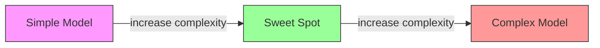
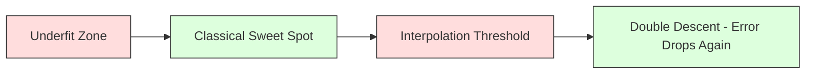
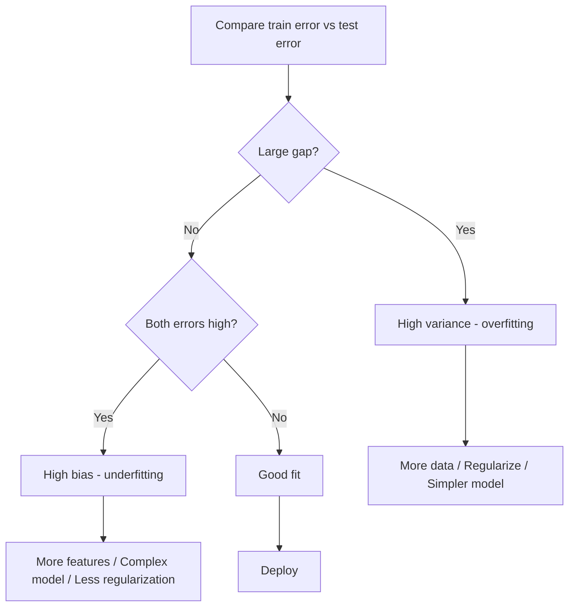
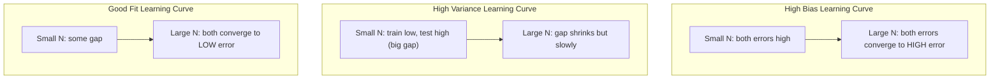
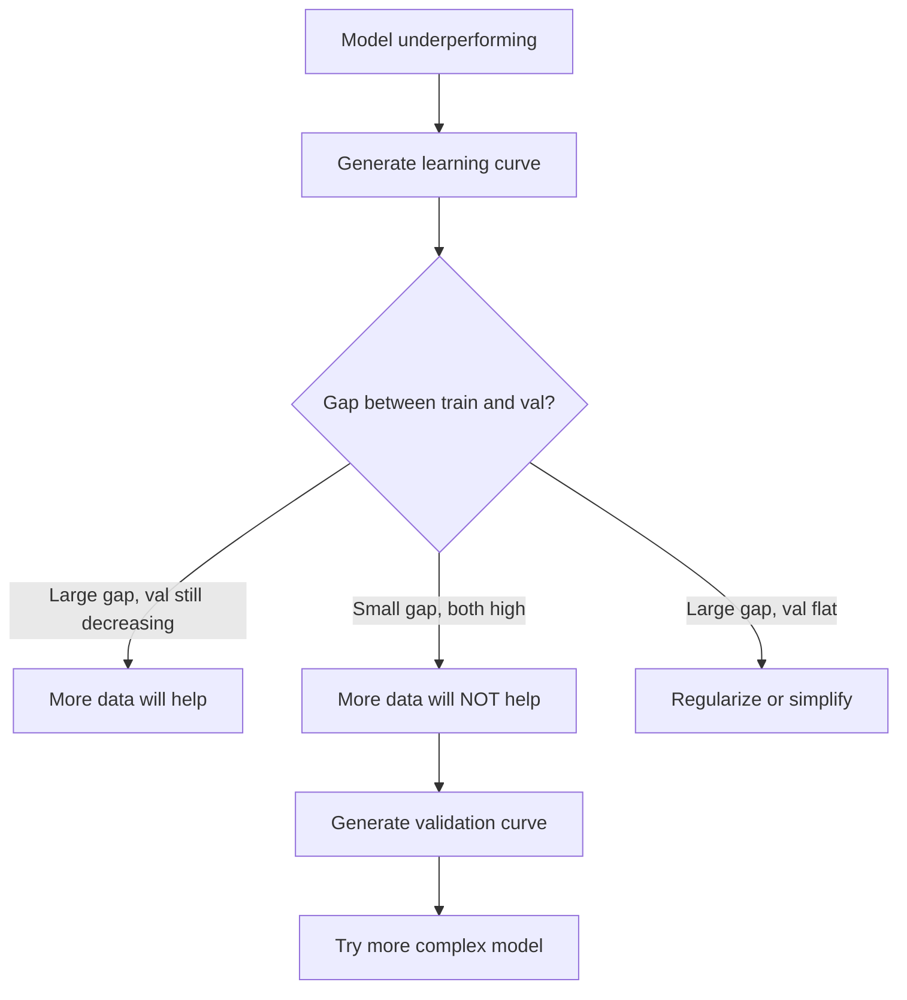

# Компромисс смещения и дисперсии

> Любая ошибка модели происходит из одного из трёх источников: смещения, дисперсии или шума. Вы можете контролировать только первые два.

**Тип:** Learn
**Язык:** Python
**Предварительные требования:** этап 2, уроки 01–09 (основы машинного обучения, регрессия, классификация, оценивание)
**Время:** ~75 минут

## Цели обучения

- Вывести разложение смещение-дисперсия для ожидаемой ошибки предсказания и объяснить роль неустранимого шума
- Диагностировать, страдает ли модель от высокого смещения или высокой дисперсии, используя паттерны ошибки на обучении и тесте
- Объяснить, как методы регуляризации (L1, L2, дропаут, ранняя остановка) обменивают смещение на дисперсию
- Реализовать эксперименты, визуализирующие компромисс смещения и дисперсии для моделей возрастающей сложности

## Проблема

Вы обучили модель. У неё есть некоторая ошибка на тестовых данных. Откуда берётся эта ошибка?

Если ваша модель слишком простая (линейная регрессия на криволинейном наборе данных), она будет систематически промахиваться мимо истинной закономерности. Это смещение (bias). Если ваша модель слишком сложная (полином 20-й степени на 15 точках данных), она идеально впишется в обучающие данные, но будет давать совершенно разные предсказания на новых данных. Это дисперсия (variance).

Вы не можете минимизировать и то, и другое одновременно при фиксированной ёмкости модели. Снижаете смещение — растёт дисперсия. Снижаете дисперсию — растёт смещение. Понимание этого компромисса — самый полезный диагностический навык в машинном обучении. Он подсказывает, стоит ли делать модель сложнее или проще, нужно ли собрать больше данных или спроектировать признаки лучше, стоит ли усилить регуляризацию или ослабить её.

## Суть

### Смещение: систематическая ошибка

Смещение измеряет, насколько среднее предсказание вашей модели отличается от истинного значения. Если бы вы обучили одну и ту же модель на множестве разных обучающих наборов, взятых из одного распределения, и усреднили предсказания, смещение — это разрыв между этим средним и истиной.

Высокое смещение означает, что модель слишком жёсткая, чтобы уловить реальную закономерность. Прямая линия, подогнанная под параболу, всегда будет промахиваться мимо кривой, сколько бы данных вы ни дали. Это недообучение (underfitting).

```
High bias (underfitting):
  Model always predicts roughly the same wrong thing.
  Training error: HIGH
  Test error: HIGH
  Gap between them: SMALL
```

### Дисперсия: чувствительность к обучающим данным

Дисперсия измеряет, насколько сильно меняются ваши предсказания при обучении на разных подмножествах данных. Если небольшие изменения в обучающем наборе вызывают большие изменения в модели, дисперсия высока.

Высокая дисперсия означает, что модель подгоняется под шум в обучающих данных, а не под истинный сигнал. Полином 20-й степени пройдёт через каждую обучающую точку, но будет дико колебаться между ними. Это переобучение (overfitting).

```
High variance (overfitting):
  Model fits training data perfectly but fails on new data.
  Training error: LOW
  Test error: HIGH
  Gap between them: LARGE
```

### Разложение

Для любой точки x ожидаемая ошибка предсказания при квадратичной функции потерь раскладывается точно:

```
Expected Error = Bias^2 + Variance + Irreducible Noise

where:
  Bias^2   = (E[f_hat(x)] - f(x))^2
  Variance = E[(f_hat(x) - E[f_hat(x)])^2]
  Noise    = E[(y - f(x))^2]             (sigma^2)
```

- `f(x)` — истинная функция
- `f_hat(x)` — предсказание вашей модели
- `E[...]` — математическое ожидание по разным обучающим наборам
- `y` — наблюдаемая метка (истинная функция плюс шум)

Слагаемое шума неустранимо. Ни одна модель не может показать результат лучше, чем sigma^2, на зашумлённых данных. Ваша задача — найти правильный баланс между квадратом смещения и дисперсией.

### Сложность модели и ошибка



Классическая U-образная кривая:

| Сложность | Смещение | Дисперсия | Общая ошибка |
|-----------|------|----------|-------------|
| Слишком низкая | ВЫСОКОЕ | НИЗКАЯ | ВЫСОКАЯ (недообучение) |
| Оптимальная | УМЕРЕННОЕ | УМЕРЕННАЯ | МИНИМАЛЬНАЯ |
| Слишком высокая | НИЗКОЕ | ВЫСОКАЯ | ВЫСОКАЯ (переобучение) |

### Регуляризация как управление компромиссом смещения и дисперсии

Регуляризация намеренно увеличивает смещение, чтобы уменьшить дисперсию. Она ограничивает модель так, чтобы та не могла гнаться за шумом.

- **L2 (Ridge):** уменьшает все веса в сторону нуля. Сохраняет все признаки, но снижает их влияние.
- **L1 (Lasso):** обнуляет некоторые веса полностью. Выполняет отбор признаков.
- **Dropout (дропаут):** случайным образом отключает нейроны во время обучения. Вынуждает формировать избыточные представления.
- **Early stopping (ранняя остановка):** останавливает обучение до того, как модель полностью подгонится под обучающие данные.

Сила регуляризации (lambda, доля дропаута, число эпох) напрямую определяет, где вы находитесь на кривой смещения-дисперсии. Больше регуляризации означает больше смещения, меньше дисперсии.

### Двойной спуск: современный взгляд

Классическая теория гласит: после точки оптимума любое усложнение только вредит. Но исследования начиная с 2019 года показали нечто неожиданное. Если продолжать увеличивать ёмкость модели далеко за порог интерполяции (где у модели достаточно параметров, чтобы идеально подогнаться под обучающие данные), тестовая ошибка может снова снизиться.



Этот феномен «двойного спуска» (double descent) объясняет, почему массово перепараметризованные нейронные сети (с гораздо большим числом параметров, чем обучающих примеров) всё равно хорошо обобщаются. Классический компромисс смещения и дисперсии не ошибочен, но он неполон для современного режима.

Ключевые наблюдения о двойном спуске:
- Он происходит в линейных моделях, деревьях решений и нейронных сетях
- В зоне интерполяции больше данных может фактически навредить (sample-wise double descent)
- Больше эпох обучения тоже может это вызвать (epoch-wise double descent)
- Регуляризация сглаживает пик, но не устраняет его

Почему это происходит? На пороге интерполяции у модели ровно столько ёмкости, чтобы подогнаться под все обучающие точки. Она вынуждена принять очень специфичное решение, проходящее через каждую точку, и небольшие возмущения в данных вызывают большие изменения в подгонке. Именно здесь дисперсия достигает пика. За порогом у модели есть множество возможных решений, идеально подгоняющихся под данные. Алгоритм обучения (например, градиентный спуск с неявной регуляризацией) склонен выбирать среди них самое простое. Именно эта неявная склонность к простым решениям объясняет, почему перепараметризованные модели хорошо обобщаются.

| Режим | Соотношение параметров и примеров | Поведение |
|--------|----------------------|----------|
| Недопараметризованный | p << n | Действует классический компромисс |
| Порог интерполяции | p ~ n | Дисперсия достигает пика, тестовая ошибка резко возрастает |
| Перепараметризованный | p >> n | Вступает в действие неявная регуляризация, тестовая ошибка снижается |

С практической точки зрения: если вы используете нейронные сети или крупные ансамбли деревьев, не останавливайтесь на пороге интерполяции. Либо оставайтесь заметно ниже него (с явной регуляризацией), либо уходите далеко за него. Худшее место — оказаться ровно на пороге.

### Диагностика вашей модели



| Симптом | Диагноз | Решение |
|---------|-----------|-----|
| Высокая обучающая ошибка, высокая тестовая ошибка | Смещение | Больше признаков, более сложная модель, слабее регуляризация |
| Низкая обучающая ошибка, высокая тестовая ошибка | Дисперсия | Больше данных, регуляризация, более простая модель, дропаут |
| Низкая обучающая ошибка, низкая тестовая ошибка | Хорошая подгонка | Запускайте в работу |
| Обучающая ошибка снижается, тестовая растёт | Идёт переобучение | Ранняя остановка |

### Практические стратегии

**Когда проблема в смещении:**
- Добавьте полиномиальные признаки или признаки взаимодействия
- Используйте более гибкую модель (ансамбль деревьев вместо линейной)
- Уменьшите силу регуляризации
- Обучайте дольше (если модель ещё не сошлась)

**Когда проблема в дисперсии:**
- Соберите больше обучающих данных
- Используйте бэггинг (случайные леса)
- Усильте регуляризацию (больше lambda, больше дропаута)
- Отбор признаков (уберите шумные признаки)
- Используйте кросс-валидацию, чтобы выявить проблему раньше

### Ансамблевые методы и снижение дисперсии

Ансамблевые методы — самый практичный инструмент борьбы с дисперсией.

**Bagging (Bootstrap Aggregating, бэггинг)** обучает несколько моделей на разных бутстрэп-выборках обучающих данных, а затем усредняет их предсказания. У каждой отдельной модели высокая дисперсия, но у среднего дисперсия гораздо ниже. Случайные леса — это бэггинг, применённый к деревьям решений.

Почему это работает математически: если усреднить N независимых предсказаний, каждое с дисперсией sigma^2, дисперсия среднего равна sigma^2 / N. Модели не являются по-настоящему независимыми (все они видят похожие данные), поэтому снижение меньше, чем 1/N, но всё равно существенно.

**Boosting (бустинг)** снижает смещение, последовательно строя модели, где каждая новая модель фокусируется на ошибках уже построенного ансамбля. Градиентный бустинг и AdaBoost — основные примеры. Бустинг может переобучиться, если добавить слишком много моделей, поэтому нужна ранняя остановка или регуляризация.

| Метод | Основной эффект | Изменение смещения | Изменение дисперсии |
|--------|---------------|-------------|-----------------|
| Бэггинг | Снижает дисперсию | Не меняется | Снижается |
| Бустинг | Снижает смещение | Снижается | Может возрасти |
| Стекинг | Снижает и то и другое | Зависит от метамодели | Зависит от базовых моделей |
| Дропаут | Неявный бэггинг | Немного возрастает | Снижается |

**Практическое правило:** если у вашей базовой модели высокая дисперсия (глубокие деревья, полиномы высокой степени), используйте бэггинг. Если у вашей базовой модели высокое смещение (неглубокие пни, простые линейные модели), используйте бустинг.

### Кривые обучения

Кривые обучения отображают обучающую и валидационную ошибку как функцию размера обучающего набора. Это самый практичный диагностический инструмент, который у вас есть. В отличие от однократного сравнения обучающей и тестовой ошибок, кривые обучения показывают траекторию вашей модели и подсказывают, поможет ли увеличение объёма данных.



Как их читать:

| Сценарий | Обучающая ошибка | Валидационная ошибка | Разрыв | Что это означает | Что делать |
|----------|---------------|-----------------|-----|---------------|------------|
| Высокое смещение | Высокая | Высокая | Небольшой | Модель не может уловить закономерность | Добавить признаки, усложнить модель, ослабить регуляризацию |
| Высокая дисперсия | Низкая | Высокая | Большой | Модель запоминает обучающие данные | Собрать больше данных, применить регуляризацию или упростить модель |
| Хорошая подгонка | Умеренная | Умеренная | Небольшой | Модель хорошо обобщает | Запускать в работу |
| Высокая дисперсия, есть улучшение | Низкая | Снижается с увеличением объёма данных | Сокращается | Проблему дисперсии можно решить с помощью данных | Собрать больше данных |
| Высокое смещение, без изменений | Высокая | Высокая и не меняется | Небольшой и не меняется | Больше данных НЕ поможет | Изменить архитектуру модели |

Ключевое наблюдение: если обе кривые вышли на плато, разрыв между ними небольшой, но обе ошибки высоки, больше данных бесполезно. Нужна более качественная модель. Если разрыв большой и всё ещё сокращается, больше данных поможет.

### Как строить кривые обучения

Есть два подхода:

**Подход 1: варьировать размер обучающего набора, модель зафиксирована.** Держите модель и гиперпараметры неизменными. Обучайте на всё увеличивающихся подмножествах обучающих данных. Измеряйте обучающую и валидационную ошибку на каждом размере. Это стандартная кривая обучения.

**Подход 2: варьировать сложность модели, данные зафиксированы.** Держите данные неизменными. Пройдитесь по параметру сложности (степень полинома, глубина дерева, число слоёв). Измеряйте обучающую и валидационную ошибку при каждой сложности. Это кривая валидации, и она показывает компромисс смещения и дисперсии напрямую.

Оба подхода дополняют друг друга. Первый подсказывает, поможет ли больше данных. Второй подсказывает, поможет ли другая модель. Запускайте оба, прежде чем принимать решение о следующем шаге.



```figure
bias-variance
```

## Реализация

Код в `code/bias_variance.py` запускает полный эксперимент по разложению смещения и дисперсии. Вот подход, шаг за шагом.

### Шаг 1: генерация синтетических данных из известной функции

Мы используем `f(x) = sin(1.5x) + 0.5x` с гауссовым шумом. Знание истинной функции позволяет вычислить точное смещение и дисперсию.

```python
def true_function(x):
    return np.sin(1.5 * x) + 0.5 * x

def generate_data(n_samples=30, noise_std=0.5, x_range=(-3, 3), seed=None):
    rng = np.random.RandomState(seed)
    x = rng.uniform(x_range[0], x_range[1], n_samples)
    y = true_function(x) + rng.normal(0, noise_std, n_samples)
    return x, y
```

### Шаг 2: бутстрэп-выборка и полиномиальная подгонка

Для каждой степени полинома мы формируем множество бутстрэп-обучающих наборов, подгоняем полином и записываем предсказания на фиксированной тестовой сетке. Это даёт распределение предсказаний в каждой тестовой точке.

```python
def fit_polynomial(x_train, y_train, degree, lam=0.0):
    X = np.column_stack([x_train ** d for d in range(degree + 1)])
    if lam > 0:
        penalty = lam * np.eye(X.shape[1])
        penalty[0, 0] = 0
        w = np.linalg.solve(X.T @ X + penalty, X.T @ y_train)
    else:
        w = np.linalg.lstsq(X, y_train, rcond=None)[0]
    return w
```

Мы подгоняем модель на 200 разных бутстрэп-выборках. Каждая бутстрэп-выборка взята из одного и того же исходного распределения, но содержит разные точки.

### Шаг 3: вычисление разложения на квадрат смещения и дисперсию

Имея 200 наборов предсказаний в каждой тестовой точке, мы можем вычислить разложение напрямую из определения:

```python
mean_pred = predictions.mean(axis=0)
bias_sq = np.mean((mean_pred - y_true) ** 2)
variance = np.mean(predictions.var(axis=0))
total_error = np.mean(np.mean((predictions - y_true) ** 2, axis=1))
```

- `mean_pred` — это E[f_hat(x)], оценённое по бутстрэп-выборкам
- `bias_sq` — это квадрат разрыва между средним предсказанием и истиной
- `variance` — это средний разброс предсказаний по бутстрэп-выборкам
- `total_error` должно приблизительно равняться bias^2 + variance + noise

### Шаг 4: кривые обучения

Кривые обучения проходятся по размеру обучающего набора при фиксированной сложности модели. Они показывают, ограничена ли ваша модель данными или ёмкостью.

```python
def demo_learning_curves():
    sizes = [10, 15, 20, 30, 50, 75, 100, 150, 200, 300]
    degree = 5

    for n in sizes:
        train_errors = []
        test_errors = []
        for seed in range(50):
            x_train, y_train = generate_data(n_samples=n, seed=seed * 100)
            w = fit_polynomial(x_train, y_train, degree)
            train_pred = predict_polynomial(x_train, w)
            train_mse = np.mean((train_pred - y_train) ** 2)
            test_pred = predict_polynomial(x_test, w)
            test_mse = np.mean((test_pred - y_test) ** 2)
            train_errors.append(train_mse)
            test_errors.append(test_mse)
        # Average over runs gives the learning curve point
```

Для высокодисперсионной модели (степень 5 при малом объёме данных) наблюдается следующее:
- Обучающая ошибка начинается низкой и растёт по мере того, как больше данных затрудняет запоминание
- Тестовая ошибка начинается высокой и снижается по мере того, как модель получает больше сигнала
- Разрыв сокращается с ростом объёма данных

Для высокосмещённой модели (степень 1) обе ошибки быстро сходятся к одному и тому же высокому значению, и больше данных не помогает.

### Шаг 5: перебор силы регуляризации

Код также включает `demo_regularization_sweep()`, который фиксирует полином высокой степени (степень 15) и перебирает силу Ridge-регуляризации от 0,001 до 100. Это показывает компромисс смещения и дисперсии под другим углом: вместо варьирования сложности модели мы варьируем силу ограничения.

```python
def demo_regularization_sweep():
    alphas = [0.001, 0.005, 0.01, 0.05, 0.1, 0.5, 1.0, 5.0, 10.0, 50.0, 100.0]
    for alpha in alphas:
        results = bias_variance_decomposition([15], lam=alpha)
        r = results[15]
        print(f"alpha={alpha:.3f}  bias={r['bias_sq']:.4f}  var={r['variance']:.4f}")
```

При низком alpha полином 15-й степени почти не ограничен. Дисперсия доминирует, потому что модель гонится за шумом в каждой бутстрэп-выборке. При высоком alpha штраф настолько силён, что модель фактически становится почти постоянной функцией. Доминирует смещение. Оптимальное alpha находится между этими крайностями.

Это та же U-образная кривая, что и при варьировании степени полинома, но управляемая непрерывным параметром вместо дискретного. На практике регуляризация — предпочтительный способ управления компромиссом, потому что она позволяет точную настройку без изменения набора признаков.

## Практика

sklearn предоставляет `learning_curve` и `validation_curve` для автоматизации этой диагностики без написания бутстрэп-циклов вручную.

### Кривая валидации: перебор сложности модели

```python
from sklearn.model_selection import validation_curve
from sklearn.pipeline import make_pipeline
from sklearn.preprocessing import PolynomialFeatures
from sklearn.linear_model import Ridge

degrees = list(range(1, 16))
train_scores_all = []
val_scores_all = []

for d in degrees:
    pipe = make_pipeline(PolynomialFeatures(d), Ridge(alpha=0.01))
    train_scores, val_scores = validation_curve(
        pipe, X, y, param_name="polynomialfeatures__degree",
        param_range=[d], cv=5, scoring="neg_mean_squared_error"
    )
    train_scores_all.append(-train_scores.mean())
    val_scores_all.append(-val_scores.mean())
```

Это напрямую даёт кривую компромисса смещения и дисперсии. Там, где валидационная оценка хуже всего относительно обучающей, доминирует дисперсия. Там, где обе оценки плохи, доминирует смещение.

### Кривая обучения: перебор размера обучающего набора

```python
from sklearn.model_selection import learning_curve

pipe = make_pipeline(PolynomialFeatures(5), Ridge(alpha=0.01))
train_sizes, train_scores, val_scores = learning_curve(
    pipe, X, y, train_sizes=np.linspace(0.1, 1.0, 10),
    cv=5, scoring="neg_mean_squared_error"
)
train_mse = -train_scores.mean(axis=1)
val_mse = -val_scores.mean(axis=1)
```

Постройте `train_mse` и `val_mse` в зависимости от `train_sizes`. Форма графика расскажет всё о вашей модели.

### Кросс-валидация с перебором регуляризации

```python
from sklearn.model_selection import cross_val_score

alphas = [0.001, 0.01, 0.1, 1.0, 10.0, 100.0]
for alpha in alphas:
    pipe = make_pipeline(PolynomialFeatures(10), Ridge(alpha=alpha))
    scores = cross_val_score(pipe, X, y, cv=5, scoring="neg_mean_squared_error")
    print(f"alpha={alpha:>7.3f}  MSE={-scores.mean():.4f} +/- {scores.std():.4f}")
```

Это перебирает силу регуляризации при фиксированной сложности модели. Вы увидите тот же компромисс смещения и дисперсии: низкое alpha означает высокую дисперсию, высокое alpha означает высокое смещение.

### Собираем всё вместе: полный диагностический рабочий процесс

На практике эти диагностики выполняются последовательно:

1. Обучите модель. Вычислите обучающую и тестовую ошибку.
2. Если обе высоки: у вас проблема смещения. Переходите к шагу 4.
3. Если обучающая ошибка низкая, а тестовая высокая: у вас проблема дисперсии. Постройте кривую обучения, чтобы понять, поможет ли больше данных. Если нет — регуляризуйте.
4. Постройте кривую валидации, перебирая основной параметр сложности. Найдите точку оптимума.
5. В точке оптимума постройте кривую обучения. Если разрыв всё ещё велик, нужно больше данных или регуляризация.
6. Попробуйте Ridge/Lasso с разными значениями alpha, используя `cross_val_score`. Выберите alpha, при котором кросс-валидационная ошибка минимальна.

Это занимает 10-15 минут вычислений для большинства табличных наборов данных и экономит часы догадок.

## Что получится

Этот урок производит: `outputs/prompt-model-diagnostics.md`

## Упражнения

1. Запустите разложение с `noise_std=0` (без шума). Что происходит с неустранимой ошибкой? Меняется ли оптимальная сложность?

2. Увеличьте размер обучающего набора с 30 до 300. Как это влияет на компонент дисперсии? Сдвигается ли оптимальная степень полинома?

3. Добавьте в эксперимент L2-регуляризацию (Ridge-регрессию). Для полинома фиксированной высокой степени (степень 15) переберите lambda от 0 до 100. Постройте квадрат смещения и дисперсию как функции lambda.

4. Замените истинную функцию с полинома на `sin(x)`. Как меняется разложение смещения и дисперсии? Остаётся ли чёткая оптимальная степень?

5. Реализуйте простую обёртку для бутстрэп-агрегирования (бэггинга): обучите 10 моделей на бутстрэп-выборках и усредните предсказания. Покажите, что это снижает дисперсию, почти не увеличивая смещение.

## Ключевые термины

| Термин | Как обычно говорят | Что это на самом деле означает |
|------|----------------|----------------------|
| Смещение | «Модель слишком простая» | Систематическая ошибка из-за неверных предположений. Разрыв между средним предсказанием модели и истиной. |
| Дисперсия | «Модель переобучается» | Ошибка из-за чувствительности к обучающим данным. Насколько сильно меняются предсказания на разных обучающих наборах. |
| Неустранимая ошибка | «Шум в данных» | Ошибка из-за случайности в истинном процессе порождения данных. Ни одна модель не может её устранить. |
| Недообучение | «Недостаточное обучение» | У модели высокое смещение. Она промахивается мимо реальной закономерности даже на обучающих данных. |
| Переобучение | «Запоминание данных» | У модели высокая дисперсия. Она подгоняется под шум в обучающих данных, который не обобщается. |
| Регуляризация | «Ограничение модели» | Добавление штрафа для снижения сложности модели, то есть обмен смещения на более низкую дисперсию. |
| Двойной спуск | «Больше параметров может помочь» | Тестовая ошибка снова снижается, когда ёмкость модели значительно превышает порог интерполяции. |
| Сложность модели | «Насколько гибкая модель» | Способность модели подгоняться под произвольные закономерности. Определяется архитектурой, признаками или регуляризацией. |

## Дополнительные материалы

- [Hastie, Tibshirani, Friedman: Elements of Statistical Learning, Ch. 7](https://hastie.su.domains/ElemStatLearn/) -- исчерпывающее изложение разложения смещения и дисперсии
- [Belkin et al., Reconciling modern machine learning practice and the bias-variance trade-off (2019)](https://arxiv.org/abs/1812.11118) -- статья про двойной спуск
- [Nakkiran et al., Deep Double Descent (2019)](https://arxiv.org/abs/1912.02292) -- двойной спуск по эпохам и по объёму выборки
- [Scott Fortmann-Roe: Understanding the Bias-Variance Tradeoff](http://scott.fortmann-roe.com/docs/BiasVariance.html) -- наглядное визуальное объяснение
