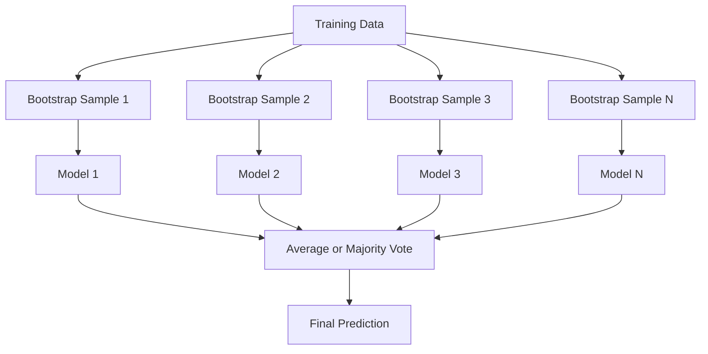
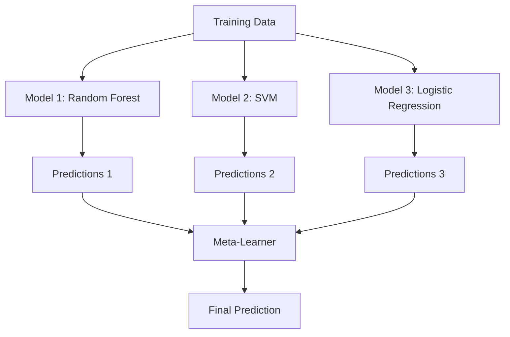

# Ансамблевые методы

> Группа слабых алгоритмов, объединённая правильным образом, становится сильным алгоритмом. Это не метафора. Это теорема.

**Тип:** Build
**Язык:** Python
**Предварительные требования:** Фаза 2, Урок 10 (Компромисс смещения и дисперсии)
**Время:** ~120 минут

## Цели обучения

- Реализовать AdaBoost и градиентный бустинг с нуля и объяснить, как бустинг последовательно снижает смещение
- Построить бэггинг-ансамбль и продемонстрировать, как усреднение декоррелированных моделей снижает дисперсию, не увеличивая смещение
- Сравнить бэггинг, бустинг и стекинг с точки зрения того, на какую составляющую ошибки нацелен каждый метод
- Оценить разнообразие ансамбля и объяснить, почему точность голосования большинством растёт с увеличением числа независимых слабых алгоритмов

## Проблема

Одно дерево решений быстро обучается и легко интерпретируется, но переобучается. Одна линейная модель недообучается на сложных границах. Вы могли бы потратить дни на проектирование идеальной архитектуры модели. А могли бы объединить набор несовершенных моделей и получить нечто лучшее, чем любая из них по отдельности.

Ансамблевые методы делают именно это. Это самая надёжная техника для победы в соревнованиях Kaggle по табличным данным, они лежат в основе большинства production ML-систем и наглядно иллюстрируют компромисс смещения и дисперсии в действии. Бэггинг снижает дисперсию. Бустинг снижает смещение. Стекинг учится определять, каким моделям доверять на каких входных данных.

## Концепция

### Почему ансамбли работают

Предположим, у вас есть N независимых классификаторов, каждый с точностью p > 0.5. Точность голосования большинством составляет:

```
P(majority correct) = sum over k > N/2 of C(N,k) * p^k * (1-p)^(N-k)
```

Для 21 классификатора с точностью 60% каждый точность голосования большинством составляет около 74%. При 101 классификаторе она возрастает до 84%. Ошибки взаимно компенсируются, когда модели совершают разные ошибки.

Ключевое требование — **разнообразие**. Если все модели совершают одни и те же ошибки, их объединение ничего не даёт. Ансамбли работают, потому что порождают разнообразные модели за счёт:

- Разных обучающих подвыборок (бэггинг)
- Разных подмножеств признаков (случайные леса)
- Последовательного исправления ошибок (бустинг)
- Разных семейств моделей (стекинг)

### Бэггинг (Bootstrap Aggregating)

Бэггинг создаёт разнообразие, обучая каждую модель на своей bootstrap-выборке обучающих данных.



Bootstrap-выборка формируется с возвращением из исходных данных и имеет тот же размер, что и исходная выборка. Около 63.2% уникальных примеров попадают в каждую bootstrap-выборку. Оставшиеся 36.8% (out-of-bag примеры) образуют бесплатную валидационную выборку.

Бэггинг снижает дисперсию, почти не увеличивая смещение. Каждое отдельное дерево переобучается на своей bootstrap-выборке, но переобучение у каждого дерева своё, поэтому усреднение компенсирует шум.

**Случайные леса** — это бэггинг с дополнительным трюком: при каждом разбиении рассматривается только случайное подмножество признаков. Это создаёт ещё большее разнообразие деревьев. Типичное число кандидатных признаков — `sqrt(n_features)` для классификации и `n_features / 3` для регрессии.

### Бустинг (последовательное исправление ошибок)

Бустинг обучает модели последовательно. Каждая новая модель фокусируется на примерах, на которых ошиблись предыдущие модели.


Бустинг снижает смещение. Каждая новая модель исправляет систематические ошибки ансамбля, накопленные к этому моменту. Итоговое предсказание — взвешенная сумма всех моделей, где более точные модели получают больший вес.

Компромисс в том, что бустинг может переобучиться, если запустить слишком много раундов, поскольку он продолжает подгоняться под всё более сложные примеры, часть из которых может быть шумом.

### AdaBoost

AdaBoost (Adaptive Boosting) стал первым практически применимым алгоритмом бустинга. Он работает с любым базовым алгоритмом, обычно с решающими пнями (decision stump) — деревьями глубины 1.

Алгоритм:

```
1. Initialize sample weights: w_i = 1/N for all i

2. For t = 1 to T:
   a. Train weak learner h_t on weighted data
   b. Compute weighted error:
      err_t = sum(w_i * I(h_t(x_i) != y_i)) / sum(w_i)
   c. Compute model weight:
      alpha_t = 0.5 * ln((1 - err_t) / err_t)
   d. Update sample weights:
      w_i = w_i * exp(-alpha_t * y_i * h_t(x_i))
   e. Normalize weights to sum to 1

3. Final prediction: H(x) = sign(sum(alpha_t * h_t(x)))
```

Модели с меньшей ошибкой получают больший alpha. Неправильно классифицированные примеры получают больший вес, чтобы следующая модель сосредоточилась на них.

### Градиентный бустинг

Градиентный бустинг обобщает бустинг на произвольные функции потерь. Вместо перевзвешивания примеров он подгоняет каждую новую модель под остатки (отрицательный градиент функции потерь) текущего ансамбля.

```
1. Initialize: F_0(x) = argmin_c sum(L(y_i, c))

2. For t = 1 to T:
   a. Compute pseudo-residuals:
      r_i = -dL(y_i, F_{t-1}(x_i)) / dF_{t-1}(x_i)
   b. Fit a tree h_t to the residuals r_i
   c. Find optimal step size:
      gamma_t = argmin_gamma sum(L(y_i, F_{t-1}(x_i) + gamma * h_t(x_i)))
   d. Update:
      F_t(x) = F_{t-1}(x) + learning_rate * gamma_t * h_t(x)

3. Final prediction: F_T(x)
```

Для функции потерь среднеквадратичной ошибки псевдо-остатки — это просто настоящие остатки: `r_i = y_i - F_{t-1}(x_i)`. Каждое дерево буквально подгоняется под ошибки предыдущего ансамбля.

Скорость обучения (shrinkage, сжатие) определяет вклад каждого дерева. Меньшая скорость обучения требует больше деревьев, но обеспечивает лучшую обобщающую способность. Типичные значения: от 0.01 до 0.3.

### XGBoost: почему он доминирует на табличных данных

XGBoost (eXtreme Gradient Boosting) — это градиентный бустинг с инженерными оптимизациями, которые делают его быстрым, точным и устойчивым к переобучению:

- **Регуляризованная целевая функция:** штрафы L1 и L2 на веса листьев не позволяют отдельным деревьям быть слишком уверенными
- **Аппроксимация второго порядка:** использует первую и вторую производные функции потерь, что даёт более качественные решения о разбиениях
- **Разбиения с учётом разреженности:** обрабатывает пропущенные значения нативно, обучаясь наилучшему направлению для пропущенных данных при каждом разбиении
- **Подвыборка столбцов:** подобно случайным лесам, сэмплирует признаки при каждом разбиении для разнообразия
- **Взвешенный квантильный эскиз:** эффективно находит точки разбиения для непрерывных признаков на распределённых данных
- **Блочная структура с учётом кеша:** расположение данных в памяти оптимизировано под линии кеша процессора

На табличных данных XGBoost (и его преемник LightGBM) стабильно превосходит нейронные сети. В обозримом будущем это не изменится. Если ваши данные умещаются в таблицу со строками и столбцами, начинайте с градиентного бустинга.

### Стекинг (мета-обучение)

Стекинг использует предсказания нескольких базовых моделей в качестве признаков для мета-модели.



Мета-модель учится определять, какой базовой модели доверять для каких входных данных. Если случайный лес лучше работает в одних областях, а SVM — в других, мета-модель научится соответствующим образом распределять решения.

Чтобы избежать утечки данных, предсказания базовых моделей должны генерироваться с помощью кросс-валидации на обучающей выборке. Нельзя обучать базовые модели и генерировать мета-признаки на одних и тех же данных.

### Голосование

Самый простой ансамбль. Предсказания просто объединяются напрямую.

- **Жёсткое голосование (hard voting):** голосование большинством по меткам классов.
- **Мягкое голосование (soft voting):** усреднение предсказанных вероятностей, выбор класса с наибольшей средней вероятностью. Обычно работает лучше, поскольку использует информацию об уверенности модели.

```figure
f3-ensemble-average
```

## Создаём

### Шаг 1. Решающий пень (базовый алгоритм)

Код в `code/ensembles.py` реализует всё с нуля. Начнём с решающего пня: дерева с единственным разбиением.

```python
class DecisionStump:
    def __init__(self):
        self.feature_idx = None
        self.threshold = None
        self.polarity = 1
        self.alpha = None

    def fit(self, X, y, weights):
        n_samples, n_features = X.shape
        best_error = float("inf")

        for f in range(n_features):
            thresholds = np.unique(X[:, f])
            for thresh in thresholds:
                for polarity in [1, -1]:
                    pred = np.ones(n_samples)
                    pred[polarity * X[:, f] < polarity * thresh] = -1
                    error = np.sum(weights[pred != y])
                    if error < best_error:
                        best_error = error
                        self.feature_idx = f
                        self.threshold = thresh
                        self.polarity = polarity

    def predict(self, X):
        n = X.shape[0]
        pred = np.ones(n)
        idx = self.polarity * X[:, self.feature_idx] < self.polarity * self.threshold
        pred[idx] = -1
        return pred
```

### Шаг 2. AdaBoost с нуля

```python
class AdaBoostScratch:
    def __init__(self, n_estimators=50):
        self.n_estimators = n_estimators
        self.stumps = []
        self.alphas = []

    def fit(self, X, y):
        n = X.shape[0]
        weights = np.full(n, 1 / n)

        for _ in range(self.n_estimators):
            stump = DecisionStump()
            stump.fit(X, y, weights)
            pred = stump.predict(X)

            err = np.sum(weights[pred != y])
            err = np.clip(err, 1e-10, 1 - 1e-10)

            alpha = 0.5 * np.log((1 - err) / err)
            weights *= np.exp(-alpha * y * pred)
            weights /= weights.sum()

            stump.alpha = alpha
            self.stumps.append(stump)
            self.alphas.append(alpha)

    def predict(self, X):
        total = sum(a * s.predict(X) for a, s in zip(self.alphas, self.stumps))
        return np.sign(total)
```

### Шаг 3. Градиентный бустинг с нуля

```python
class GradientBoostingScratch:
    def __init__(self, n_estimators=100, learning_rate=0.1, max_depth=3):
        self.n_estimators = n_estimators
        self.lr = learning_rate
        self.max_depth = max_depth
        self.trees = []
        self.initial_pred = None

    def fit(self, X, y):
        self.initial_pred = np.mean(y)
        current_pred = np.full(len(y), self.initial_pred)

        for _ in range(self.n_estimators):
            residuals = y - current_pred
            tree = SimpleRegressionTree(max_depth=self.max_depth)
            tree.fit(X, residuals)
            update = tree.predict(X)
            current_pred += self.lr * update
            self.trees.append(tree)

    def predict(self, X):
        pred = np.full(X.shape[0], self.initial_pred)
        for tree in self.trees:
            pred += self.lr * tree.predict(X)
        return pred
```

### Шаг 4. Сравнение со sklearn

Код проверяет, что наши реализации с нуля дают точность, сопоставимую с `AdaBoostClassifier` и `GradientBoostingClassifier` из sklearn, и сравнивает все методы бок о бок.

## Применяем

### Когда использовать каждый метод

| Метод | Снижает | Лучше всего для | На что обратить внимание |
|--------|---------|----------|---------------|
| Бэггинг / случайный лес | Дисперсию | Шумные данные, много признаков | Не помогает со смещением |
| AdaBoost | Смещение | Чистые данные, простые базовые алгоритмы | Чувствителен к выбросам и шуму |
| Градиентный бустинг | Смещение | Табличные данные, соревнования | Медленное обучение, легко переобучить без настройки |
| XGBoost / LightGBM | Оба | Production ML на табличных данных | Много гиперпараметров |
| Стекинг | Оба | Получение последних 1-2% точности | Сложный, риск переобучения мета-модели |
| Голосование | Дисперсию | Быстрое объединение разнообразных моделей | Помогает только если модели разнообразны |

### Production-стек для табличных данных

Для большинства задач предсказания на табличных данных стоит пробовать в таком порядке:

1. **LightGBM или XGBoost** с параметрами по умолчанию
2. Настройте n_estimators, learning_rate, max_depth, min_child_weight
3. Если нужны последние 0.5%, постройте стекинг-ансамбль из 3-5 разнообразных моделей
4. Используйте кросс-валидацию на всех этапах

Нейронные сети на табличных данных почти всегда хуже градиентного бустинга, несмотря на продолжающиеся попытки исследователей. TabNet, NODE и похожие архитектуры иногда сравниваются по качеству, но редко превосходят хорошо настроенный XGBoost.

## Публикуем

Этот урок производит `outputs/prompt-ensemble-selector.md` - промпт, который помогает выбрать подходящий ансамблевый метод для конкретного набора данных. Опишите свои данные (размер, типы признаков, уровень шума, баланс классов) и решаемую задачу. Промпт проводит по контрольному списку решений, рекомендует метод, предлагает начальные гиперпараметры и предупреждает о типичных ошибках для этого метода. Также производит `outputs/skill-ensemble-builder.md` с полным руководством по выбору.

## Упражнения

1. Измените реализацию AdaBoost так, чтобы отслеживать точность на обучающей выборке после каждого раунда. Постройте график точности в зависимости от числа моделей. Когда она сходится?

2. Реализуйте случайный лес с нуля, добавив случайную подвыборку признаков к дереву регрессии. Обучите 100 деревьев с `max_features=sqrt(n_features)` и усредните предсказания. Сравните снижение дисперсии с одиночным деревом.

3. В реализации градиентного бустинга добавьте раннюю остановку: отслеживайте функцию потерь на валидации после каждого раунда и останавливайтесь, если она не улучшается в течение 10 раундов подряд. Сколько деревьев требуется на самом деле?

4. Постройте стекинг-ансамбль из трёх базовых моделей (логистическая регрессия, дерево решений, k ближайших соседей) и мета-модели на основе логистической регрессии. Используйте 5-блочную кросс-валидацию для генерации мета-признаков. Сравните с каждой базовой моделью по отдельности.

5. Запустите XGBoost на том же наборе данных с параметрами по умолчанию. Сравните его точность с вашим градиентным бустингом, реализованным с нуля. Замерьте время работы обоих. Насколько велика разница в скорости?

## Ключевые термины

| Термин | Что говорят люди | Что это на самом деле означает |
|------|----------------|----------------------|
| Bagging | «Обучаем на случайных подвыборках» | Bootstrap aggregating: обучение моделей на bootstrap-выборках, усреднение предсказаний для снижения дисперсии |
| Boosting | «Фокусируемся на сложных примерах» | Последовательное обучение моделей, каждая из которых исправляет накопленные ошибки ансамбля, для снижения смещения |
| AdaBoost | «Перевзвешиваем данные» | Бустинг через обновление весов примеров; неправильно классифицированные точки получают больший вес для следующего алгоритма |
| Gradient boosting | «Подгоняемся под остатки» | Бустинг через подгонку каждой новой модели под отрицательный градиент функции потерь |
| XGBoost | «Оружие для Kaggle» | Градиентный бустинг с регуляризацией, оптимизацией второго порядка и системными приёмами ускорения |
| Stacking | «Модели поверх моделей» | Использование предсказаний базовых моделей в качестве входных признаков для мета-модели |
| Random forest | «Много рандомизированных деревьев» | Бэггинг на деревьях решений с добавлением случайной подвыборки признаков при каждом разбиении для разнообразия |
| Ensemble diversity | «Совершаем разные ошибки» | Модели должны быть некоррелированы в своих ошибках, чтобы ансамбль превосходил отдельные модели |
| Out-of-bag error | «Бесплатная валидация» | Примеры, не попавшие в bootstrap-выборку (~36.8%), служат валидационной выборкой без необходимости выделять отдельный holdout |

## Дополнительные материалы

- [Schapire & Freund: Boosting: Foundations and Algorithms](https://mitpress.mit.edu/9780262526036/) - книга создателей AdaBoost
- [Friedman: Greedy Function Approximation: A Gradient Boosting Machine (2001)](https://statweb.stanford.edu/~jhf/ftp/trebst.pdf) - оригинальная статья о градиентном бустинге
- [Chen & Guestrin: XGBoost (2016)](https://arxiv.org/abs/1603.02754) - статья об XGBoost
- [Wolpert: Stacked Generalization (1992)](https://www.sciencedirect.com/science/article/abs/pii/S0893608005800231) - оригинальная статья о стекинге
- [scikit-learn Ensemble Methods](https://scikit-learn.org/stable/modules/ensemble.html) - практический справочник
