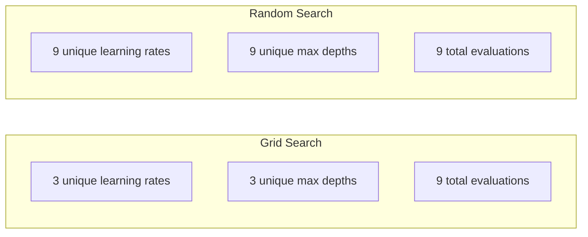
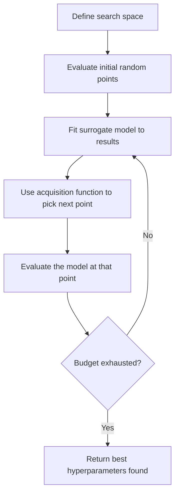
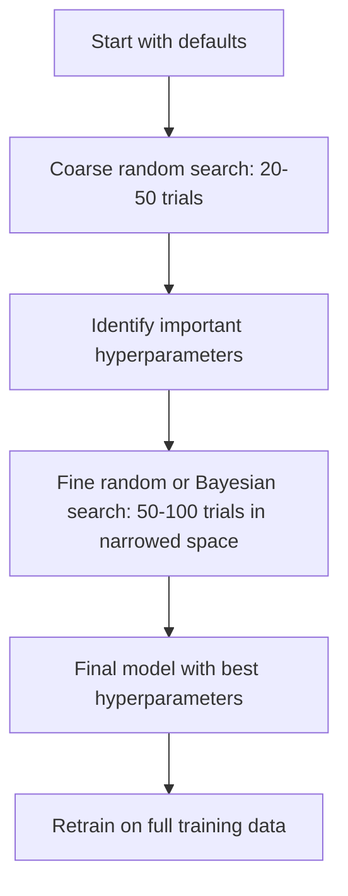
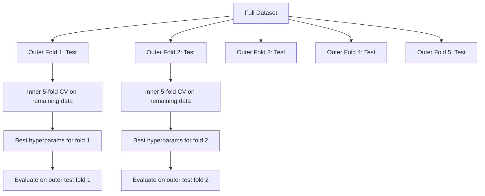

# Настройка гиперпараметров

> Гиперпараметры — это регуляторы, которые вы настраиваете перед началом обучения. От того, насколько хорошо вы их настроите, зависит разница между посредственной моделью и отличной.

**Тип:** Build
**Язык:** Python
**Предварительные требования:** Фаза 2, Урок 11 (Ансамблевые методы)
**Время:** ~90 минут

## Цели обучения

- Реализовать поиск по сетке, случайный поиск и байесовскую оптимизацию с нуля и сравнить их эффективность по числу проб
- Объяснить, почему случайный поиск превосходит поиск по сетке, когда большинство гиперпараметров имеют низкую эффективную размерность
- Построить цикл байесовской оптимизации, использующий суррогатную модель и функцию сбора данных для направления поиска
- Спроектировать стратегию настройки гиперпараметров, которая предотвращает переобучение на валидационной выборке за счёт правильной кросс-валидации

## Проблема

У вашей модели градиентного бустинга есть скорость обучения, число деревьев, максимальная глубина, минимальное число примеров на лист, доля подвыборки и доля подвыборки столбцов. Это шесть гиперпараметров. Если у каждого по 5 разумных значений, сетка содержит 5^6 = 15,625 комбинаций. Обучение каждой занимает 10 секунд. Это 43 часа вычислений, чтобы перебрать их все.

Поиск по сетке — очевидный подход и худший при масштабировании. Случайный поиск справляется лучше при меньших вычислительных затратах. Байесовская оптимизация работает ещё лучше, обучаясь на прошлых оценках. Знание того, какую стратегию использовать и какие гиперпараметры действительно важны, экономит дни впустую потраченного GPU-времени.

## Концепция

### Параметры и гиперпараметры

Параметры выучиваются в процессе обучения (веса, смещения, пороги разбиения). Гиперпараметры задаются до начала обучения и определяют, как происходит обучение.

| Гиперпараметр | Что контролирует | Типичный диапазон |
|---------------|-----------------|---------------|
| Скорость обучения | Размер шага на каждое обновление | 0.001 to 1.0 |
| Число деревьев/эпох | Как долго обучать | 10 to 10,000 |
| Максимальная глубина | Сложность модели | 1 to 30 |
| Регуляризация (lambda) | Предотвращение переобучения | 0.0001 to 100 |
| Размер пакета | Шум оценки градиента | 16 to 512 |
| Коэффициент dropout | Доля отключаемых нейронов | 0.0 to 0.5 |

### Поиск по сетке

Поиск по сетке перебирает каждую комбинацию заданных значений. Он исчерпывающий и прост для понимания, но масштабируется экспоненциально с ростом числа гиперпараметров.

```
Grid for 2 hyperparameters:

  learning_rate: [0.01, 0.1, 1.0]
  max_depth:     [3, 5, 7]

  Evaluations: 3 x 3 = 9 combinations

  (0.01, 3)  (0.01, 5)  (0.01, 7)
  (0.1,  3)  (0.1,  5)  (0.1,  7)
  (1.0,  3)  (1.0,  5)  (1.0,  7)
```

У поиска по сетке есть фундаментальный недостаток: если один гиперпараметр важен, а другой нет, большинство оценок расходуются впустую. Из 9 оценок вы получаете всего 3 уникальных значения важного параметра.

### Случайный поиск

Случайный поиск сэмплирует гиперпараметры из распределений вместо сетки. При том же бюджете в 9 оценок вы получаете 9 уникальных значений каждого гиперпараметра.



Почему случайный поиск обгоняет поиск по сетке (Bergstra & Bengio, 2012):

- У большинства гиперпараметров низкая эффективная размерность. Для конкретной задачи обычно важны только 1-2 из 6 гиперпараметров.
- Поиск по сетке расходует оценки на неважные измерения.
- Случайный поиск при том же бюджете плотнее покрывает важные измерения.
- При 60 случайных пробах у вас 95%-й шанс найти точку в пределах 5% от оптимума (если он существует в пространстве поиска).

### Байесовская оптимизация

Случайный поиск игнорирует результаты. Он не учится тому, что высокая скорость обучения приводит к расхождению или что глубина 3 стабильно превосходит глубину 10. Байесовская оптимизация использует прошлые оценки, чтобы решить, где искать дальше.



Два ключевых компонента:

**Суррогатная модель:** дешёвая в вычислении модель (обычно гауссовский процесс), приближающая дорогую целевую функцию. Она даёт как предсказание, так и оценку неопределённости в любой точке пространства поиска.

**Функция сбора данных (acquisition function):** решает, где оценивать дальше, балансируя эксплуатацию (поиск рядом с известными хорошими точками) и исследование (поиск там, где неопределённость высока). Распространённые варианты:

- **Expected Improvement (EI, ожидаемое улучшение):** насколько улучшения относительно текущего лучшего результата мы ожидаем в этой точке?
- **Upper Confidence Bound (UCB, верхняя доверительная граница):** предсказание плюс кратная неопределённость. Более высокий UCB означает, что точка либо перспективна, либо не исследована.
- **Probability of Improvement (PI, вероятность улучшения):** какова вероятность, что эта точка превзойдёт текущий лучший результат?

Байесовская оптимизация обычно находит лучшие гиперпараметры, чем случайный поиск, при в 2-5 раз меньшем числе оценок. Накладные расходы на подгонку суррогатной модели пренебрежимо малы по сравнению с обучением самой модели.

### Ранняя остановка

Не каждый прогон обучения должен доводиться до конца. Если конфигурация явно плоха после 10 эпох, остановите её и переходите дальше. Это ранняя остановка в контексте поиска гиперпараметров.

Стратегии:
- **На основе терпения (patience-based):** остановиться, если функция потерь на валидации не улучшалась N эпох подряд
- **Медианное прунинг (median pruning):** остановиться, если промежуточный результат пробы хуже медианы завершённых проб на том же шаге
- **Hyperband:** выделить небольшие бюджеты множеству конфигураций, затем постепенно увеличивать бюджет для лучших из них

Hyperband особенно эффективен. Он запускает 81 конфигурацию по 1 эпохе каждая, оставляет лучшую треть, даёт им 3 эпохи, снова оставляет лучшую треть и так далее. Это позволяет находить хорошие конфигурации в 10-50 раз быстрее, чем при оценке всех конфигураций на полном бюджете.

### Планировщики скорости обучения

Скорость обучения почти всегда самый важный гиперпараметр. Вместо того чтобы держать её фиксированной, планировщики корректируют её в процессе обучения.

| Планировщик | Формула | Когда использовать |
|-----------|---------|-------------|
| Ступенчатое затухание | Умножение на 0.1 каждые N эпох | Классическое обучение CNN |
| Косинусный отжиг | lr * 0.5 * (1 + cos(pi * t / T)) | Современный вариант по умолчанию |
| Разогрев + затухание | Линейный рост, затем косинусное затухание | Трансформеры |
| One-cycle | Рост, затем снижение в течение одного цикла | Быстрая сходимость |
| Снижение на плато | Снижение в N раз, когда метрика перестаёт улучшаться | Безопасный вариант по умолчанию |

### Важность гиперпараметров

Не все гиперпараметры одинаково важны. Исследования случайных лесов (Probst et al., 2019) и градиентного бустинга показывают устойчивые закономерности:

**Высокая важность:**
- Скорость обучения (настраивайте первой)
- Число моделей / эпох (используйте раннюю остановку вместо настройки)
- Сила регуляризации

**Средняя важность:**
- Максимальная глубина / число слоёв
- Минимальное число примеров на лист / weight decay
- Доля подвыборки

**Низкая важность:**
- Максимальное число признаков (для случайных лесов)
- Конкретный выбор функции активации
- Размер пакета (в разумном диапазоне)

Сначала настраивайте важные, остальное оставляйте по умолчанию.

### Практическая стратегия



Конкретный рабочий процесс:

1. **Начните со значений по умолчанию.** Они выбраны опытными практиками и часто дают 80% результата.
2. **Грубый случайный поиск.** Широкие диапазоны, 20-50 проб. Используйте раннюю остановку, чтобы быстро отбрасывать плохие прогоны.
3. **Проанализируйте результаты.** Какие гиперпараметры коррелируют с производительностью? Сузьте пространство поиска.
4. **Точный поиск.** Байесовская оптимизация или сфокусированный случайный поиск в суженном пространстве. 50-100 проб.
5. **Переобучите на всех обучающих данных** с найденными лучшими гиперпараметрами.

### Интеграция с кросс-валидацией

Настраивать гиперпараметры на одном валидационном разбиении рискованно. Лучшие гиперпараметры могут переобучиться под конкретный валидационный фолд. Вложенная кросс-валидация решает это, используя два цикла:

- **Внешний цикл** (оценка): делит данные на train+val и test. Даёт непредвзятую оценку производительности.
- **Внутренний цикл** (настройка): делит train+val на train и val. Находит лучшие гиперпараметры.



Каждый внешний фолд независимо находит свои лучшие гиперпараметры. Внешние оценки — это непредвзятая оценка способности к обобщению.

С sklearn:

```python
from sklearn.model_selection import cross_val_score, GridSearchCV
from sklearn.ensemble import GradientBoostingRegressor

inner_cv = GridSearchCV(
    GradientBoostingRegressor(),
    param_grid={
        "learning_rate": [0.01, 0.05, 0.1],
        "max_depth": [2, 3, 5],
        "n_estimators": [50, 100, 200],
    },
    cv=5,
    scoring="neg_mean_squared_error",
)

outer_scores = cross_val_score(
    inner_cv, X, y, cv=5, scoring="neg_mean_squared_error"
)

print(f"Nested CV MSE: {-outer_scores.mean():.4f} +/- {outer_scores.std():.4f}")
```

Это дорого (5 внешних фолдов x 5 внутренних фолдов x 27 точек сетки = 675 обучений модели), но даёт надёжную оценку производительности. Используйте её при публикации итоговых результатов в статьях или когда цена решения высока.

### Практические советы

**Начинайте со скорости обучения.** Это всегда самый важный гиперпараметр для градиентных методов. Плохая скорость обучения делает всё остальное неважным. Зафиксируйте остальные гиперпараметры на значениях по умолчанию и сначала переберите скорость обучения.

**Используйте лог-равномерные распределения для скорости обучения и регуляризации.** Разница между 0.001 и 0.01 значит столько же, сколько разница между 0.1 и 1.0. Линейный перебор расходует бюджет впустую на большом конце диапазона.

**Используйте раннюю остановку вместо настройки n_estimators.** Для бустинга и нейронных сетей задайте n_estimators или число эпох большим и позвольте ранней остановке решать, когда остановиться. Это убирает один гиперпараметр из поиска.

**Распределение бюджета.** Тратьте 60% бюджета настройки на 2 самых важных гиперпараметра. Оставшиеся 40% — на всё остальное. На эти 2 гиперпараметра приходится большая часть вариации производительности.

**Масштаб имеет значение.** Никогда не ищите размер пакета по логарифмической шкале (16, 32, 64 — это нормально). Всегда ищите скорость обучения по логарифмической шкале. Согласуйте распределение поиска с тем, как гиперпараметр влияет на модель.

| Тип модели | Главные гиперпараметры | Рекомендуемый поиск | Бюджет |
|-----------|--------------------|--------------------|--------|
| Случайный лес | n_estimators, max_depth, min_samples_leaf | Случайный поиск, 50 проб | Низкий (быстрое обучение) |
| Градиентный бустинг | learning_rate, n_estimators, max_depth | Байесовский, 100 проб + ранняя остановка | Средний |
| Нейронная сеть | learning_rate, weight_decay, batch_size | Байесовский или случайный, 100+ проб | Высокий (медленное обучение) |
| SVM | C, gamma (RBF-ядро) | Сетка по логарифмической шкале, 25-50 проб | Низкий (2 параметра) |
| Lasso/Ridge | alpha | 1D-поиск по логарифмической шкале, 20 проб | Очень низкий |
| XGBoost | learning_rate, max_depth, subsample, colsample | Байесовский, 100-200 проб + ранняя остановка | Средний |

**Если сомневаетесь:** случайный поиск с числом проб в 2 раза больше числа гиперпараметров (например, 6 гиперпараметров = минимум 12+ проб). Вы удивитесь, как часто случайный поиск с 50 пробами обгоняет тщательно спроектированный поиск по сетке.

```figure
k-fold-cv
```

## Создаём

### Шаг 1. Поиск по сетке с нуля

Код в `code/tuning.py` реализует поиск по сетке, случайный поиск и простой байесовский оптимизатор с нуля.

```python
def grid_search(model_fn, param_grid, X_train, y_train, X_val, y_val):
    keys = list(param_grid.keys())
    values = list(param_grid.values())
    best_score = -float("inf")
    best_params = None
    n_evals = 0

    for combo in itertools.product(*values):
        params = dict(zip(keys, combo))
        model = model_fn(**params)
        model.fit(X_train, y_train)
        score = evaluate(model, X_val, y_val)
        n_evals += 1

        if score > best_score:
            best_score = score
            best_params = params

    return best_params, best_score, n_evals
```

### Шаг 2. Случайный поиск с нуля

```python
def random_search(model_fn, param_distributions, X_train, y_train,
                  X_val, y_val, n_iter=50, seed=42):
    rng = np.random.RandomState(seed)
    best_score = -float("inf")
    best_params = None

    for _ in range(n_iter):
        params = {k: sample(v, rng) for k, v in param_distributions.items()}
        model = model_fn(**params)
        model.fit(X_train, y_train)
        score = evaluate(model, X_val, y_val)

        if score > best_score:
            best_score = score
            best_params = params

    return best_params, best_score, n_iter
```

### Шаг 3. Байесовская оптимизация (упрощённая)

Основная идея: подогнать гауссовский процесс к наблюдаемым парам (гиперпараметр, оценка), затем использовать функцию сбора данных, чтобы решить, куда смотреть дальше.

```python
class SimpleBayesianOptimizer:
    def __init__(self, search_space, n_initial=5):
        self.search_space = search_space
        self.n_initial = n_initial
        self.X_observed = []
        self.y_observed = []

    def _kernel(self, x1, x2, length_scale=1.0):
        dists = np.sum((x1[:, None, :] - x2[None, :, :]) ** 2, axis=2)
        return np.exp(-0.5 * dists / length_scale ** 2)

    def _fit_gp(self, X_new):
        X_obs = np.array(self.X_observed)
        y_obs = np.array(self.y_observed)
        y_mean = y_obs.mean()
        y_centered = y_obs - y_mean

        K = self._kernel(X_obs, X_obs) + 1e-4 * np.eye(len(X_obs))
        K_star = self._kernel(X_new, X_obs)

        L = np.linalg.cholesky(K)
        alpha = np.linalg.solve(L.T, np.linalg.solve(L, y_centered))
        mu = K_star @ alpha + y_mean

        v = np.linalg.solve(L, K_star.T)
        var = 1.0 - np.sum(v ** 2, axis=0)
        var = np.maximum(var, 1e-6)

        return mu, var

    def _expected_improvement(self, mu, var, best_y):
        sigma = np.sqrt(var)
        z = (mu - best_y) / (sigma + 1e-10)
        ei = sigma * (z * norm_cdf(z) + norm_pdf(z))
        return ei

    def suggest(self):
        if len(self.X_observed) < self.n_initial:
            return sample_random(self.search_space)

        candidates = [sample_random(self.search_space) for _ in range(500)]
        X_cand = np.array([to_vector(c) for c in candidates])
        mu, var = self._fit_gp(X_cand)
        ei = self._expected_improvement(mu, var, max(self.y_observed))
        return candidates[np.argmax(ei)]

    def observe(self, params, score):
        self.X_observed.append(to_vector(params))
        self.y_observed.append(score)
```

Суррогатный GP даёт две вещи в каждой точке-кандидате: предсказанную оценку (mu) и неопределённость (var). Expected Improvement балансирует их: он отдаёт предпочтение точкам, где модель предсказывает высокие оценки, ИЛИ где высока неопределённость. Поначалу у большинства точек высокая неопределённость, поэтому оптимизатор исследует пространство. Позже он фокусируется на наиболее перспективной области.

### Шаг 4. Сравнение всех методов

Запустите все три метода на одной и той же синтетической целевой функции и сравните. В этом сравнении используется упрощённая обёртка, вызывающая каждый оптимизатор с прямой целевой функцией (без обучения модели), поэтому API отличается от реализаций на основе моделей выше:

```python
def synthetic_objective(params):
    lr = params["learning_rate"]
    depth = params["max_depth"]
    return -(np.log10(lr) + 2) ** 2 - (depth - 4) ** 2 + 10

param_grid = {
    "learning_rate": [0.001, 0.01, 0.1, 1.0],
    "max_depth": [2, 3, 4, 5, 6, 7, 8],
}

grid_best = None
grid_score = -float("inf")
grid_history = []
for combo in itertools.product(*param_grid.values()):
    params = dict(zip(param_grid.keys(), combo))
    score = synthetic_objective(params)
    grid_history.append((params, score))
    if score > grid_score:
        grid_score = score
        grid_best = params

param_dist = {
    "learning_rate": ("log_float", 0.001, 1.0),
    "max_depth": ("int", 2, 8),
}

rand_best = None
rand_score = -float("inf")
rand_history = []
rng = np.random.RandomState(42)
for _ in range(28):
    params = {k: sample(v, rng) for k, v in param_dist.items()}
    score = synthetic_objective(params)
    rand_history.append((params, score))
    if score > rand_score:
        rand_score = score
        rand_best = params

optimizer = SimpleBayesianOptimizer(param_dist, n_initial=5)
bayes_history = []
for _ in range(28):
    params = optimizer.suggest()
    score = synthetic_objective(params)
    optimizer.observe(params, score)
    bayes_history.append((params, score))
bayes_score = max(s for _, s in bayes_history)

print(f"{'Method':<20} {'Best Score':>12} {'Evaluations':>12}")
print("-" * 50)
print(f"{'Grid Search':<20} {grid_score:>12.4f} {len(grid_history):>12}")
print(f"{'Random Search':<20} {rand_score:>12.4f} {len(rand_history):>12}")
print(f"{'Bayesian Opt':<20} {bayes_score:>12.4f} {len(bayes_history):>12}")
```

При одинаковом бюджете байесовская оптимизация обычно находит лучшую оценку быстрее всего, поскольку не расходует оценки на заведомо плохие области. Случайный поиск покрывает больше пространства, чем поиск по сетке. Поиск по сетке выигрывает только когда у вас очень мало гиперпараметров и вы можете позволить себе исчерпывающий перебор.

## Применяем

### Optuna на практике

Optuna — рекомендуемая библиотека для серьёзной настройки гиперпараметров. Она поддерживает прунинг, распределённый поиск и визуализацию «из коробки».

```python
import optuna

def objective(trial):
    lr = trial.suggest_float("learning_rate", 1e-4, 1e-1, log=True)
    n_est = trial.suggest_int("n_estimators", 50, 500)
    max_depth = trial.suggest_int("max_depth", 2, 10)

    model = GradientBoostingRegressor(
        learning_rate=lr,
        n_estimators=n_est,
        max_depth=max_depth,
    )
    model.fit(X_train, y_train)
    return mean_squared_error(y_val, model.predict(X_val))

study = optuna.create_study(direction="minimize")
study.optimize(objective, n_trials=100)

print(f"Best params: {study.best_params}")
print(f"Best MSE: {study.best_value:.4f}")
```

Ключевые возможности Optuna:
- `suggest_float(..., log=True)` для параметров, которые лучше искать по логарифмической шкале (скорость обучения, регуляризация)
- `suggest_int` для целочисленных параметров
- `suggest_categorical` для дискретных вариантов выбора
- Встроенный MedianPruner для ранней остановки плохих проб
- `study.trials_dataframe()` для анализа

### Optuna с прунингом

Прунинг рано останавливает бесперспективные пробы, экономя огромное количество вычислений. Вот шаблон:

```python
import optuna
from sklearn.model_selection import cross_val_score

def objective(trial):
    params = {
        "learning_rate": trial.suggest_float("lr", 1e-4, 0.5, log=True),
        "max_depth": trial.suggest_int("max_depth", 2, 10),
        "n_estimators": trial.suggest_int("n_estimators", 50, 500),
        "subsample": trial.suggest_float("subsample", 0.5, 1.0),
    }

    model = GradientBoostingRegressor(**params)
    scores = cross_val_score(model, X_train, y_train, cv=3,
                             scoring="neg_mean_squared_error")
    mean_score = -scores.mean()

    trial.report(mean_score, step=0)
    if trial.should_prune():
        raise optuna.TrialPruned()

    return mean_score

pruner = optuna.pruners.MedianPruner(n_startup_trials=10, n_warmup_steps=5)
study = optuna.create_study(direction="minimize", pruner=pruner)
study.optimize(objective, n_trials=200)
```

`MedianPruner` останавливает пробу, если её промежуточное значение хуже медианы всех завершённых проб на том же шаге. Прунинг требует вызова `trial.report()` для отчёта о промежуточных метриках и `trial.should_prune()` для проверки, нужно ли остановить пробу. `n_startup_trials=10` гарантирует, что как минимум 10 проб завершатся полностью до того, как начнёт действовать прунинг. Обычно это экономит 40-60% суммарных вычислений.

### Встроенные тюнеры sklearn

Для быстрых экспериментов sklearn предоставляет `GridSearchCV`, `RandomizedSearchCV` и `HalvingRandomSearchCV`:

```python
from sklearn.model_selection import RandomizedSearchCV
from scipy.stats import loguniform, randint

param_dist = {
    "learning_rate": loguniform(1e-4, 0.5),
    "max_depth": randint(2, 10),
    "n_estimators": randint(50, 500),
}

search = RandomizedSearchCV(
    GradientBoostingRegressor(),
    param_dist,
    n_iter=100,
    cv=5,
    scoring="neg_mean_squared_error",
    random_state=42,
    n_jobs=-1,
)
search.fit(X_train, y_train)
print(f"Best params: {search.best_params_}")
print(f"Best CV MSE: {-search.best_score_:.4f}")
```

Используйте `loguniform` из scipy для скорости обучения и регуляризации. Используйте `randint` для целочисленных гиперпараметров. Флаг `n_jobs=-1` распараллеливает работу по всем ядрам процессора.

### Типичные ошибки при настройке гиперпараметров

**Утечка данных через препроцессинг.** Если вы подгоняете scaler на полном наборе данных до кросс-валидации, информация из валидационного фолда просачивается в обучение. Всегда помещайте препроцессинг внутрь `Pipeline`, чтобы он подгонялся только на обучающем фолде.

**Переобучение на валидационной выборке.** Запуск тысяч проб фактически означает обучение на валидационной выборке. Используйте вложенную кросс-валидацию для итоговых оценок производительности или выделите отдельную тестовую выборку, к которой вы не прикасаетесь во время настройки.

**Слишком узкий диапазон поиска.** Если ваше лучшее значение находится на границе пространства поиска, вы искали недостаточно широко. Оптимальное значение может быть за пределами вашего диапазона. Всегда проверяйте, находятся ли лучшие параметры на краях.

**Игнорирование эффектов взаимодействия.** Скорость обучения и число моделей сильно взаимодействуют в бустинге. Низкая скорость обучения требует больше моделей. Настройка их по отдельности даёт худшие результаты, чем совместная настройка.

**Отказ от ранней остановки для итеративных моделей.** Для градиентного бустинга и нейронных сетей задайте n_estimators или число эпох большим значением и используйте раннюю остановку. Это строго лучше, чем настраивать число итераций как гиперпараметр.

## Упражнения

1. Запустите поиск по сетке и случайный поиск с одинаковым общим бюджетом (например, 50 оценок). Сравните найденные лучшие оценки. Повторите эксперимент 10 раз с разными сидами. Как часто побеждает случайный поиск?

2. Реализуйте Hyperband с нуля. Начните с 81 конфигурации, каждая обучается 1 эпоху. На каждом раунде оставляйте лучшую 1/3 и утраивайте их бюджет. Сравните суммарные вычисления (сумму всех эпох по всем конфигурациям) с запуском 81 конфигурации на полном бюджете.

3. Добавьте планировщик скорости обучения (косинусный отжиг) к реализации градиентного бустинга из Урока 11. Помогает ли это по сравнению с фиксированной скоростью обучения?

4. Используйте Optuna для настройки RandomForestClassifier на реальном наборе данных (например, наборе данных о раке молочной железы из sklearn). Используйте `optuna.visualization.plot_param_importances(study)`, чтобы увидеть, какие гиперпараметры важнее всего. Совпадает ли это с рейтингом важности из этого урока?

5. Реализуйте простую функцию сбора данных (Expected Improvement) и продемонстрируйте баланс исследования и эксплуатации. Постройте график среднего значения и неопределённости суррогатной модели и покажите, где EI выбирает следующую точку для оценки.

## Ключевые термины

| Термин | Что говорят люди | Что это на самом деле означает |
|------|----------------|----------------------|
| Hyperparameter | «Настройка, которую вы выбираете» | Значение, задаваемое до обучения и управляющее процессом обучения, а не выучиваемое из данных |
| Grid search | «Перебрать всё» | Исчерпывающий перебор заданной сетки параметров. Экспоненциальная стоимость. |
| Random search | «Просто сэмплировать случайно» | Сэмплирование гиперпараметров из распределений. Лучше покрывает важные измерения, чем поиск по сетке. |
| Bayesian optimization | «Умный поиск» | Использует суррогатную модель целевой функции, чтобы решить, где оценивать дальше, балансируя исследование и эксплуатацию |
| Surrogate model | «Дешёвое приближение» | Модель (обычно гауссовский процесс), приближающая дорогую целевую функцию по наблюдаемым оценкам |
| Acquisition function | «Куда смотреть дальше» | Оценивает точки-кандидаты, балансируя ожидаемое улучшение с неопределённостью. EI и UCB — распространённые варианты. |
| Early stopping | «Не тратить время впустую» | Досрочное прекращение обучения, когда производительность на валидации перестаёт улучшаться |
| Hyperband | «Турнирная сетка для конфигураций» | Адаптивное распределение ресурсов: запустить много конфигураций с маленькими бюджетами, оставить лучшие и увеличить их бюджеты |
| Learning rate scheduler | «Меняем lr во время обучения» | Функция, корректирующая скорость обучения на протяжении обучения для лучшей сходимости |

## Дополнительные материалы

- [Bergstra & Bengio: Random Search for Hyper-Parameter Optimization (2012)](https://jmlr.org/papers/v13/bergstra12a.html) - статья, показавшая, что случайный поиск обгоняет сеточный
- [Snoek et al., Practical Bayesian Optimization of Machine Learning Algorithms (2012)](https://arxiv.org/abs/1206.2944) - байесовская оптимизация для ML
- [Li et al., Hyperband: A Novel Bandit-Based Approach (2018)](https://jmlr.org/papers/v18/16-558.html) - статья о Hyperband
- [Optuna: A Next-generation Hyperparameter Optimization Framework](https://arxiv.org/abs/1907.10902) - статья об Optuna
- [Probst et al., Tunability: Importance of Hyperparameters (2019)](https://jmlr.org/papers/v20/18-444.html) - какие гиперпараметры важны
