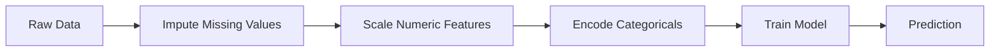
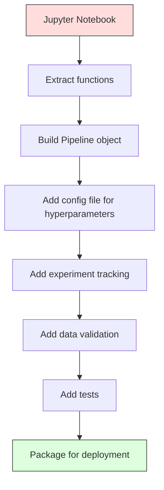

# ML-конвейеры

> Продукт — не модель. Продукт — это конвейер. Конвейер — это всё, от исходных данных до развёрнутого предсказания, и каждый шаг должен быть воспроизводим.

**Тип:** Build
**Язык:** Python
**Предварительные требования:** Фаза 2, Урок 12 (Настройка гиперпараметров)
**Время:** ~120 минут

## Цели обучения

- Построить ML-конвейер с нуля, объединяющий импутацию, масштабирование, кодирование и обучение модели в единый воспроизводимый объект
- Выявить сценарии утечки данных и объяснить, как конвейеры предотвращают их, подгоняя трансформеры только на обучающих данных
- Построить ColumnTransformer, применяющий разный препроцессинг к числовым и категориальным признакам
- Реализовать сериализацию конвейера и продемонстрировать, что один и тот же обученный конвейер даёт идентичные результаты при обучении и в production

## Проблема

У вас есть ноутбук, который загружает данные, заполняет пропущенные значения медианой, масштабирует признаки, обучает модель и выводит точность. Он работает. Вы выкатываете его.

Месяц спустя кто-то переобучает модель и получает другие результаты. Медиана была вычислена на полном наборе данных, включая тестовые (утечка данных). Параметры масштабирования не были сохранены, поэтому инференс использует другую статистику. Код проектирования признаков был скопирован между обучением и обслуживанием, и копии разошлись. У категориального столбца в production появилось новое значение, которого энкодер никогда не видел.

Это не гипотетические случаи. Это самые распространённые причины сбоев ML-систем в production. Конвейеры решают все эти проблемы, упаковывая каждый шаг преобразования в единый, упорядоченный, воспроизводимый объект.

## Концепция

### Что такое конвейер

Конвейер — это упорядоченная последовательность преобразований данных, за которой следует модель. Каждый шаг принимает на вход выход предыдущего шага. Весь конвейер подгоняется один раз на обучающих данных. Во время инференса тот же обученный конвейер преобразует новые данные и выдаёт предсказания.



Конвейер гарантирует:
- Преобразования подгоняются только на обучающих данных (без утечки)
- Те же преобразования применяются во время инференса
- Весь объект можно сериализовать и развернуть как единый артефакт
- Кросс-валидация применяет конвейер отдельно к каждому фолду, предотвращая скрытую утечку

### Утечка данных: тихий убийца

Утечка данных происходит, когда информация из тестовой выборки или будущих данных попадает в обучение. Конвейеры предотвращают самые распространённые её формы.

**С утечкой (неправильно):**
```python
X = df.drop("target", axis=1)
y = df["target"]

scaler = StandardScaler()
X_scaled = scaler.fit_transform(X)

X_train, X_test = X_scaled[:800], X_scaled[800:]
y_train, y_test = y[:800], y[800:]
```

Scaler увидел тестовые данные. Среднее и стандартное отклонение включают тестовые примеры. Это завышает оценки точности.

**Правильно:**
```python
X_train, X_test = X[:800], X[800:]

scaler = StandardScaler()
X_train_scaled = scaler.fit_transform(X_train)
X_test_scaled = scaler.transform(X_test)
```

С конвейером вам не нужно об этом думать. Конвейер обрабатывает это автоматически.

### sklearn Pipeline

`Pipeline` из sklearn объединяет трансформеры и оценщик в цепочку. Он предоставляет `.fit()`, `.predict()` и `.score()`, которые применяют все шаги по порядку.

```python
from sklearn.pipeline import Pipeline
from sklearn.preprocessing import StandardScaler
from sklearn.linear_model import LogisticRegression

pipe = Pipeline([
    ("scaler", StandardScaler()),
    ("model", LogisticRegression()),
])

pipe.fit(X_train, y_train)
predictions = pipe.predict(X_test)
```

Когда вы вызываете `pipe.fit(X_train, y_train)`:
1. Scaler вызывает `fit_transform` на X_train
2. Модель вызывает `fit` на масштабированном X_train

Когда вы вызываете `pipe.predict(X_test)`:
1. Scaler вызывает `transform` (не fit_transform) на X_test
2. Модель вызывает `predict` на масштабированном X_test

Scaler никогда не видит тестовые данные во время подгонки. В этом весь смысл.

### ColumnTransformer: разные конвейеры для разных столбцов

В реальных наборах данных есть числовые и категориальные столбцы, которым нужен разный препроцессинг. `ColumnTransformer` решает эту задачу.

```python
from sklearn.compose import ColumnTransformer
from sklearn.preprocessing import StandardScaler, OneHotEncoder
from sklearn.impute import SimpleImputer

numeric_pipe = Pipeline([
    ("impute", SimpleImputer(strategy="median")),
    ("scale", StandardScaler()),
])

categorical_pipe = Pipeline([
    ("impute", SimpleImputer(strategy="most_frequent")),
    ("encode", OneHotEncoder(handle_unknown="ignore")),
])

preprocessor = ColumnTransformer([
    ("num", numeric_pipe, ["age", "income", "score"]),
    ("cat", categorical_pipe, ["city", "gender", "plan"]),
])

full_pipeline = Pipeline([
    ("preprocess", preprocessor),
    ("model", GradientBoostingClassifier()),
])
```

`handle_unknown="ignore"` в OneHotEncoder критически важен для production. Когда появляется новая категория (город, которого модель никогда не видела), он выдаёт нулевой вектор вместо аварийного завершения.

### Отслеживание экспериментов

Конвейер делает обучение воспроизводимым, но вам также нужно отслеживать, что происходило в разных экспериментах: какие гиперпараметры использовались, какая версия набора данных, какими были метрики, какой код выполнялся.

**MLflow** — самое распространённое решение с открытым исходным кодом:

```python
import mlflow

with mlflow.start_run():
    mlflow.log_param("max_depth", 5)
    mlflow.log_param("n_estimators", 100)
    mlflow.log_param("learning_rate", 0.1)

    pipe.fit(X_train, y_train)
    accuracy = pipe.score(X_test, y_test)

    mlflow.log_metric("accuracy", accuracy)
    mlflow.sklearn.log_model(pipe, "model")
```

Каждый запуск записывается с параметрами, метриками, артефактами и полной моделью. Вы можете сравнивать запуски, воспроизводить любой эксперимент и разворачивать любую версию модели.

**Weights & Biases (wandb)** предоставляет ту же функциональность с размещённой в облаке панелью:

```python
import wandb

wandb.init(project="my-pipeline")
wandb.config.update({"max_depth": 5, "n_estimators": 100})

pipe.fit(X_train, y_train)
accuracy = pipe.score(X_test, y_test)

wandb.log({"accuracy": accuracy})
```

### Версионирование моделей

После отслеживания экспериментов вам нужно управлять версиями моделей. Какая модель в production? Какая в staging? Какая была на прошлой неделе?

Model Registry в MLflow предоставляет:
- **Отслеживание версий:** каждая сохранённая модель получает номер версии
- **Переходы между стадиями:** «Staging», «Production», «Archived»
- **Рабочий процесс утверждения:** модели должны быть явно продвинуты в production
- **Откат:** мгновенное переключение на предыдущую версию

### Версионирование данных с DVC

Код версионируется с помощью git. Данные тоже нужно версионировать, но git не справляется с большими файлами. DVC (Data Version Control) решает эту задачу.

```
dvc init
dvc add data/training.csv
git add data/training.csv.dvc data/.gitignore
git commit -m "Track training data"
dvc push
```

DVC хранит сами данные в удалённом хранилище (S3, GCS, Azure), а в git хранит небольшой файл `.dvc`, фиксирующий хеш. Когда вы переключаетесь на коммит git, `dvc checkout` восстанавливает точно те данные, которые использовались.

Это означает, что каждый коммит git фиксирует и код, и данные. Полная воспроизводимость.

### Воспроизводимые эксперименты

Для воспроизводимого эксперимента нужны четыре вещи:

1. **Фиксированные случайные сиды:** задайте сиды для numpy, random и фреймворка (torch, sklearn)
2. **Зафиксированные зависимости:** requirements.txt или poetry.lock с точными версиями
3. **Версионированные данные:** DVC или аналог
4. **Конфигурационные файлы:** все гиперпараметры в конфиге, а не захардкожены

```python
import numpy as np
import random

def set_seed(seed=42):
    random.seed(seed)
    np.random.seed(seed)
    try:
        import torch
        torch.manual_seed(seed)
        torch.cuda.manual_seed_all(seed)
        torch.backends.cudnn.deterministic = True
    except ImportError:
        pass
```

### От ноутбука к production-конвейеру



Типичное развитие:

1. **Исследование в ноутбуке:** быстрые эксперименты, визуализации, идеи признаков
2. **Извлечение функций:** перенос препроцессинга, проектирования признаков и оценивания в модули
3. **Построение конвейера:** объединение преобразований в sklearn Pipeline или собственный класс
4. **Управление конфигурацией:** перенос всех гиперпараметров в конфиг YAML/JSON
5. **Отслеживание экспериментов:** добавление логирования MLflow или wandb
6. **Валидация данных:** проверка схемы, распределений и паттернов пропущенных значений перед обучением
7. **Тесты:** модульные тесты для трансформеров, интеграционные тесты для всего конвейера
8. **Развёртывание:** сериализация конвейера, обёртка в API (FastAPI, Flask), контейнеризация

### Типичные ошибки в конвейерах

| Ошибка | Почему это плохо | Исправление |
|---------|-------------|-----|
| Подгонка на полных данных перед разбиением | Утечка данных | Используйте Pipeline с cross_val_score |
| Проектирование признаков вне конвейера | Разные преобразования при обучении и обслуживании | Поместите все преобразования в Pipeline |
| Необработка неизвестных категорий | Аварийное завершение в production на новых значениях | OneHotEncoder(handle_unknown="ignore") |
| Захардкоженные имена столбцов | Ломается при изменении схемы | Используйте списки имён столбцов из конфига |
| Отсутствие валидации данных | Незаметно неверные предсказания на плохих данных | Добавьте проверки схемы перед предсказанием |
| Расхождение обучения и обслуживания | Модель видит разные признаки в production | Один объект Pipeline для обоих |

```figure
f3-pipeline-flow
```

## Создаём

Код в `code/pipeline.py` строит полный ML-конвейер с нуля:

### Шаг 1. Собственный трансформер

```python
class CustomTransformer:
    def __init__(self):
        self.means = None
        self.stds = None

    def fit(self, X):
        self.means = np.mean(X, axis=0)
        self.stds = np.std(X, axis=0)
        self.stds[self.stds == 0] = 1.0
        return self

    def transform(self, X):
        return (X - self.means) / self.stds

    def fit_transform(self, X):
        return self.fit(X).transform(X)
```

### Шаг 2. Конвейер с нуля

```python
class PipelineFromScratch:
    def __init__(self, steps):
        self.steps = steps

    def fit(self, X, y=None):
        X_current = X.copy()
        for name, step in self.steps[:-1]:
            X_current = step.fit_transform(X_current)
        name, model = self.steps[-1]
        model.fit(X_current, y)
        return self

    def predict(self, X):
        X_current = X.copy()
        for name, step in self.steps[:-1]:
            X_current = step.transform(X_current)
        name, model = self.steps[-1]
        return model.predict(X_current)
```

### Шаг 3. Кросс-валидация с конвейером

Код демонстрирует, как кросс-валидация с конвейером предотвращает утечку данных: scaler подгоняется отдельно на обучающих данных каждого фолда.

### Шаг 4. Полный production-конвейер со sklearn

Полный конвейер с `ColumnTransformer`, несколькими путями препроцессинга и моделью, обученный с правильной кросс-валидацией и логированием экспериментов.

## Публикуем

Этот урок производит:
- `outputs/prompt-ml-pipeline.md` - навык для построения и отладки ML-конвейеров
- `code/pipeline.py` - полный конвейер с нуля до sklearn

## Упражнения

1. Постройте конвейер, обрабатывающий набор данных с 3 числовыми и 2 категориальными столбцами. Используйте `ColumnTransformer`, чтобы применить импутацию медианой + масштабирование к числовым и импутацию модой + one-hot-кодирование к категориальным. Обучите с 5-блочной кросс-валидацией.

2. Намеренно внесите утечку данных: подгоните scaler на полном наборе данных перед разбиением. Сравните оценку кросс-валидации (с утечкой) с оценкой кросс-валидации конвейера (чистой). Насколько велика разница?

3. Сериализуйте свой конвейер с помощью `joblib.dump`. Загрузите его в отдельном скрипте и выполните предсказания. Проверьте, что предсказания идентичны.

4. Добавьте в конвейер собственный трансформер, создающий полиномиальные признаки (степени 2) для двух самых важных числовых столбцов. Куда его следует поместить в конвейере?

5. Настройте отслеживание MLflow для конвейера. Запустите 5 экспериментов с разными гиперпараметрами. Используйте интерфейс MLflow (`mlflow ui`), чтобы сравнить запуски и выбрать лучшую модель.

## Ключевые термины

| Термин | Что говорят люди | Что это на самом деле означает |
|------|----------------|----------------------|
| Pipeline | «Цепочка преобразований + модель» | Упорядоченная последовательность подогнанных трансформеров и модели, применяемая как единое целое для предотвращения утечки |
| Data leakage | «Информация из теста просочилась в обучение» | Использование информации извне обучающей выборки при построении модели, что завышает оценки производительности |
| ColumnTransformer | «Разный препроцессинг для разных столбцов» | Применяет разные конвейеры к разным подмножествам столбцов, объединяя результаты |
| Experiment tracking | «Логирование ваших запусков» | Запись параметров, метрик, артефактов и версий кода для каждого запуска обучения |
| MLflow | «Отслеживать и разворачивать модели» | Платформа с открытым исходным кодом для отслеживания экспериментов, реестра моделей и развёртывания |
| DVC | «Git для данных» | Система контроля версий для больших файлов данных, хранящая хеши в git, а данные - в удалённом хранилище |
| Model registry | «Каталог версий моделей» | Система, отслеживающая версии моделей с метками стадий (staging, production, archived) |
| Training/serving skew | «В ноутбуке всё работало» | Различия в том, как данные обрабатываются при обучении и при инференсе, вызывающие незаметные ошибки |
| Reproducibility | «Тот же код, тот же результат» | Способность получать идентичные результаты из одного и того же кода, данных и конфигурации |

## Дополнительные материалы

- [scikit-learn Pipeline docs](https://scikit-learn.org/stable/modules/compose.html) - официальный справочник по конвейерам
- [MLflow documentation](https://mlflow.org/docs/latest/index.html) - отслеживание экспериментов и реестр моделей
- [DVC documentation](https://dvc.org/doc) - версионирование данных
- [Sculley et al., Hidden Technical Debt in Machine Learning Systems (2015)](https://papers.nips.cc/paper/2015/hash/86df7dcfd896fcaf2674f757a2463eba-Abstract.html) - основополагающая статья о сложности ML-систем
- [Google ML Best Practices: Rules of ML](https://developers.google.com/machine-learning/guides/rules-of-ml) - практические рекомендации по production ML
