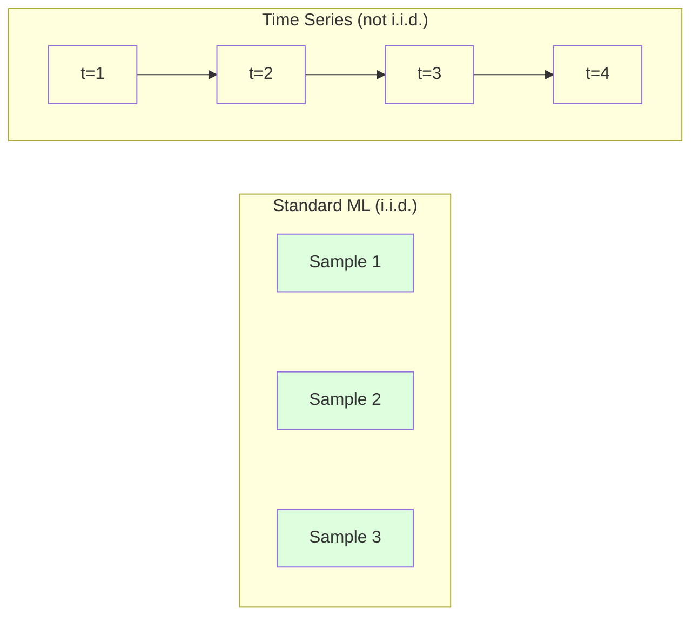
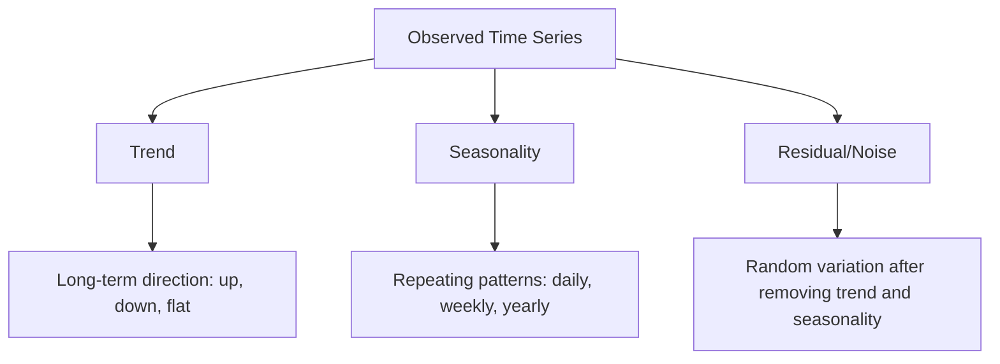
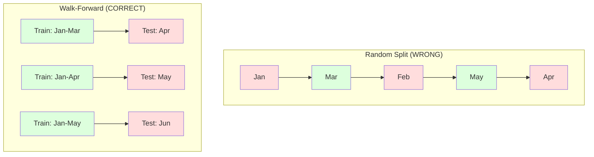

# Основы временных рядов

> Прошлые результаты действительно предсказывают будущие — если сначала проверить стационарность.

**Тип:** Build
**Язык:** Python
**Предварительные требования:** Фаза 2, Уроки 01-09
**Время:** ~90 минут

## Цели обучения

- Разложить временной ряд на компоненты тренда, сезонности и остатка и проверить стационарность
- Реализовать лаговые признаки и скользящие статистики, чтобы превратить временной ряд в задачу обучения с учителем
- Построить фреймворк скользящей проверки (walk-forward validation), предотвращающий утечку будущих данных в обучение
- Объяснить, почему случайное разбиение на обучающую и тестовую выборки некорректно для временных рядов, и продемонстрировать разрыв в качестве по сравнению с корректным временным разбиением

## Проблема

У вас есть данные, упорядоченные по времени. Дневные продажи, почасовая температура, поминутная загрузка CPU, недельные цены акций. Вы хотите предсказать следующее значение, следующую неделю, следующий квартал.

Вы берётесь за свой стандартный набор инструментов ML: случайное разбиение на обучающую и тестовую выборки, кросс-валидация, матрица признаков на входе, предсказание на выходе. Каждый шаг неверен.

Временные ряды нарушают предположения, на которые опирается стандартный ML. Образцы не независимы — сегодняшняя температура зависит от вчерашней. Случайные разбиения допускают утечку будущей информации в прошлое. Признаки, которые отлично выглядят на бэктесте, отказывают в продакшене, потому что опираются на паттерны, которые со временем смещаются.

Модель, которая показывает 95% точности при случайной кросс-валидации, может показать 55% при корректной оценке с учётом времени. Это не формальность. Это разница между моделью, которая работает на бумаге, и моделью, которая работает в продакшене.

Этот урок охватывает основы: что делает временные данные особенными, как честно оценивать модели и как превратить временной ряд в признаки, пригодные для стандартных моделей ML.

## Концепция

### Что делает временные ряды особенными

Стандартный ML предполагает i.i.d. — независимое одинаковое распределение (independent and identically distributed). Каждый образец берётся из одного и того же распределения, независимо от других образцов. Временные ряды нарушают оба условия:

- **Не независимы.** Сегодняшняя цена акции зависит от вчерашней. Продажи этой недели коррелируют с продажами прошлой недели.
- **Не одинаково распределены.** Распределение смещается со временем. Продажи в декабре выглядят иначе, чем продажи в марте.

Эти нарушения не мелочь. Они меняют то, как вы строите признаки, как оцениваете модели и какие алгоритмы работают.



В стандартном ML образцы взаимозаменяемы. Их перемешивание ничего не меняет. Во временных рядах порядок — это всё. Перемешивание разрушает сигнал.

### Компоненты временного ряда

Каждый временной ряд — это комбинация:



- **Тренд**: долгосрочное направление. Выручка, растущая на 10% в год. Рост глобальной температуры.
- **Сезонность**: повторяющиеся паттерны с фиксированными интервалами. Всплеск розничных продаж в декабре. Пик использования кондиционеров в июле.
- **Остаток**: всё, что осталось после удаления тренда и сезонности. Если остаток выглядит как белый шум, разложение захватило весь сигнал.

### Стационарность

Временной ряд стационарен, если его статистические свойства (среднее, дисперсия, автокорреляция) не меняются со временем. Большинство методов прогнозирования предполагают стационарность.

**Почему это важно:** у нестационарного ряда среднее «дрейфует». Модель, обученная на данных за январь, выучила иное среднее, чем то, которое покажет февраль. Она будет систематически ошибаться.

**Как проверить:** вычислить скользящее среднее и скользящее стандартное отклонение по окнам. Если они дрейфуют, ряд нестационарен.

**Как исправить:** дифференцирование. Вместо моделирования исходных значений моделируется изменение между последовательными значениями:

```
diff[t] = value[t] - value[t-1]
```

Если один раунд дифференцирования не делает ряд стационарным, примените его снова (дифференцирование второго порядка). Большинству реальных рядов требуется не более двух раундов.

**Пример:**

Исходный ряд: [100, 102, 106, 112, 120]
Первая разность:  [2, 4, 6, 8] (всё ещё растёт)
Вторая разность:  [2, 2, 2] (константа — стационарен)

Исходный ряд имел квадратичный тренд. Первое дифференцирование превратило его в линейный тренд. Второе дифференцирование сделало его плоским. На практике редко требуется больше двух раундов.

**Формальный тест:** расширенный тест Дики — Фуллера (Augmented Dickey-Fuller, ADF) — стандартный статистический тест на стационарность. Нулевая гипотеза: «ряд нестационарен». p-значение ниже 0.05 означает, что нулевую гипотезу можно отвергнуть и сделать вывод о стационарности. Мы не реализуем ADF с нуля (для этого нужны таблицы асимптотических распределений), но подход со скользящими статистиками в нашем коде даёт практическую визуальную проверку.

### Автокорреляция

Автокорреляция измеряет, насколько значение в момент t коррелирует со значением в момент t-k (k шагов назад). Автокорреляционная функция (ACF) отображает эту корреляцию для каждого лага k.

**ACF показывает вам:**
- Насколько далеко назад «помнит» ряд. Если ACF падает до нуля после лага 5, значения более чем 5 шагов назад не имеют значения.
- Есть ли сезонность. Если ACF даёт всплеск на лаге 12 (месячные данные), есть годовая сезонность.
- Сколько лаговых признаков создавать. Используйте лаги вплоть до того момента, где ACF становится незначимой.

**PACF (частная автокорреляционная функция)** устраняет косвенные корреляции. Если сегодняшнее значение коррелирует со значением 3 дня назад только потому, что оба коррелируют со вчерашним, PACF на лаге 3 будет равна нулю, тогда как ACF на лаге 3 — нет.

### Лаговые признаки: превращение временного ряда в обучение с учителем

Стандартным моделям ML нужна матрица признаков X и целевая переменная y. Временной ряд даёт вам единственный столбец значений. Мостом между ними служат лаговые признаки.

Возьмите ряд [10, 12, 14, 13, 15] и создайте признаки lag-1 и lag-2:

| lag_2 | lag_1 | Целевая переменная |
|-------|-------|--------|
| 10    | 12    | 14     |
| 12    | 14    | 13     |
| 14    | 13    | 15     |

Теперь у вас стандартная задача регрессии. Любая модель ML (линейная регрессия, случайный лес, градиентный бустинг) может предсказывать целевую переменную по лагам.

Дополнительные признаки, которые можно сконструировать:
- **Скользящие статистики:** среднее, стандартное отклонение, минимум, максимум за последние k значений
- **Календарные признаки:** день недели, месяц, is_holiday, is_weekend
- **Разностные значения:** изменение относительно предыдущего шага
- **Расширяющиеся статистики:** кумулятивное среднее, кумулятивная сумма
- **Признаки-отношения:** текущее значение / скользящее среднее (насколько далеко от недавнего среднего)
- **Признаки взаимодействия:** lag_1 * day_of_week (влияние дня недели на моментум)

**Сколько лагов использовать?** Используйте автокорреляционную функцию. Если ACF значима вплоть до лага 10, используйте как минимум 10 лагов. Если есть недельная сезонность, включите лаг 7 (и, возможно, 14). Больше лагов дают модели больше истории, но и больше признаков для подгонки, что повышает риск переобучения.

**Ловушка выравнивания целевой переменной.** При создании лаговых признаков целевой переменной должно быть значение в момент t, а все признаки должны использовать значения в момент t-1 или раньше. Если вы случайно включите значение в момент t как признак, у вас получится идеальный предиктор — и совершенно бесполезная модель. Это самая распространённая ошибка в конструировании признаков для временных рядов.

### Скользящая проверка (Walk-Forward Validation)

Это самая важная концепция в этом уроке. Стандартная k-блочная кросс-валидация случайным образом распределяет образцы между обучением и тестом. Для временных рядов это приводит к утечке будущей информации.



Скользящая проверка:
1. Обучение на данных вплоть до момента t
2. Предсказание в момент t+1 (или от t+1 до t+k для многошагового прогноза)
3. Сдвиг окна вперёд
4. Повтор

Каждый тестовый блок содержит только данные, идущие после всех обучающих данных. Никакой утечки из будущего. Это даёт честную оценку того, как модель будет работать после развёртывания.

**Расширяющееся окно** использует все исторические данные для обучения (окно растёт). **Скользящее окно** использует обучающее окно фиксированного размера (окно сдвигается). Используйте расширяющееся окно, если считаете, что старые данные всё ещё актуальны. Используйте скользящее окно, если мир меняется и старые данные вредят.

### Интуиция ARIMA

ARIMA — классическая модель временных рядов. У неё три компонента:

- **AR (авторегрессия):** предсказание по прошлым значениям. AR(p) использует последние p значений.
- **I (интегрированность):** дифференцирование для достижения стационарности. I(d) применяет d раундов дифференцирования.
- **MA (скользящее среднее):** предсказание по прошлым ошибкам прогноза. MA(q) использует последние q ошибок.

ARIMA(p, d, q) объединяет все три компонента. Вы выбираете p, d, q на основе анализа ACF/PACF или автоматического поиска (auto-ARIMA).

Мы не будем реализовывать ARIMA с нуля — для этого требуется численная оптимизация, выходящая за рамки этого урока. Ключевая идея — понять, что делает каждый компонент, чтобы уметь интерпретировать результаты ARIMA и знать, когда её применять.

### Когда что использовать

| Подход | Лучше всего подходит для | Поддерживает сезонность | Поддерживает внешние признаки |
|----------|---------|-------------------|------------------------|
| Лаговые признаки + ML | Табличных данных со множеством внешних признаков | С календарными признаками | Да |
| ARIMA | Одного одномерного ряда, краткосрочно | Вариант SARIMA | Нет (ARIMAX — ограниченно) |
| Экспоненциальное сглаживание | Простого тренда + сезонности | Да (Хольта — Винтерса) | Нет |
| Prophet | Бизнес-прогнозирования, праздников | Да (ряды Фурье) | Ограниченно |
| Нейронные сети (LSTM, Transformer) | Длинных последовательностей, многих рядов | Выученная | Да |

Для большинства практических задач лаговые признаки + градиентный бустинг — самая сильная отправная точка. Он естественным образом обрабатывает внешние признаки, не требует стационарности и легко отлаживается.

### Горизонты прогнозирования и стратегии

Одношаговое прогнозирование предсказывает один шаг вперёд. Многошаговое прогнозирование предсказывает несколько шагов. Есть три стратегии:

**Рекурсивная (итеративная):** предсказать один шаг вперёд, использовать предсказание как вход для следующего шага. Проста, но ошибки накапливаются — каждое предсказание использует предыдущее предсказание, поэтому ошибки усиливают друг друга.

**Прямая:** обучить отдельную модель для каждого горизонта. Модель 1 предсказывает t+1, модель 5 предсказывает t+5. Ошибки не накапливаются, но у каждой модели меньше обучающих образцов, и они не делятся информацией друг с другом.

**Многовыходная:** обучить одну модель, которая выдаёт все горизонты одновременно. Делится информацией между горизонтами, но требует модели, поддерживающей несколько выходов (или собственной функции потерь).

Для большинства практических задач начинайте с рекурсивной стратегии для коротких горизонтов (1-5 шагов) и с прямой — для более длинных горизонтов.

### Типичные ошибки во временных рядах

| Ошибка | Почему возникает | Как исправить |
|---------|---------------|-----------|
| Случайное разбиение на обучение/тест | Привычка из стандартного ML | Использовать скользящую проверку или временное разбиение |
| Использование признаков из будущего | Признак в момент t включён по ошибке | Проверять каждый признак на временное выравнивание |
| Переобучение на сезонность | Модель запоминает календарные паттерны | Оставить полный сезонный цикл в тестовой выборке |
| Игнорирование изменений масштаба | Выручка удваивается, но паттерны сохраняются | Моделировать процентное изменение вместо абсолютного |
| Слишком много лаговых признаков | «Больше истории — лучше» | Использовать ACF для определения релевантных лагов |
| Отсутствие дифференцирования | «Модель сама разберётся» | Древовидные модели справляются с трендами; линейным моделям нужна стационарность |

```figure
f3-series-decompose
```

## Создаём

Код в `code/time_series.py` реализует базовые строительные блоки с нуля.

### Генератор лаговых признаков

```python
def make_lag_features(series, n_lags):
    n = len(series)
    X = np.full((n, n_lags), np.nan)
    for lag in range(1, n_lags + 1):
        X[lag:, lag - 1] = series[:-lag]
    valid = ~np.isnan(X).any(axis=1)
    return X[valid], series[valid]
```

Это преобразует одномерный ряд в матрицу признаков, где каждая строка содержит последние `n_lags` значений в качестве признаков, а текущее значение — в качестве целевой переменной.

### Скользящая кросс-валидация

```python
def walk_forward_split(n_samples, n_splits=5, min_train=50):
    assert min_train < n_samples, "min_train must be less than n_samples"
    step = max(1, (n_samples - min_train) // n_splits)
    for i in range(n_splits):
        train_end = min_train + i * step
        test_end = min(train_end + step, n_samples)
        if train_end >= n_samples:
            break
        yield slice(0, train_end), slice(train_end, test_end)
```

Каждое разбиение гарантирует, что обучающие данные строго предшествуют тестовым. Обучающее окно расширяется с каждым блоком.

### Простая авторегрессионная модель

Чистая AR-модель — это просто линейная регрессия на лаговых признаках:

```python
class SimpleAR:
    def __init__(self, n_lags=5):
        self.n_lags = n_lags
        self.weights = None
        self.bias = None

    def fit(self, series):
        X, y = make_lag_features(series, self.n_lags)
        # Solve via normal equations
        X_b = np.column_stack([np.ones(len(X)), X])
        theta = np.linalg.lstsq(X_b, y, rcond=None)[0]
        self.bias = theta[0]
        self.weights = theta[1:]
        return self
```

Концептуально это идентично линейной регрессии из Урока 02, но применённой к сдвинутым во времени версиям одной и той же переменной.

### Проверка стационарности

Код вычисляет скользящие статистики для визуальной и численной оценки стационарности:

```python
def check_stationarity(series, window=50):
    rolling_mean = np.array([
        series[max(0, i - window):i].mean()
        for i in range(1, len(series) + 1)
    ])
    rolling_std = np.array([
        series[max(0, i - window):i].std()
        for i in range(1, len(series) + 1)
    ])
    return rolling_mean, rolling_std
```

Если скользящее среднее дрейфует или скользящее стандартное отклонение меняется, ряд нестационарен. Примените дифференцирование и проверьте снова.

Код также проверяет стационарность, сравнивая первую и вторую половины ряда. Если средние различаются более чем на половину стандартного отклонения или отношение дисперсий превышает 2x, ряд помечается как нестационарный.

### Автокорреляция

```python
def autocorrelation(series, max_lag=20):
    n = len(series)
    mean = series.mean()
    var = series.var()
    acf = np.zeros(max_lag + 1)
    for k in range(max_lag + 1):
        cov = np.mean((series[:n-k] - mean) * (series[k:] - mean))
        acf[k] = cov / var if var > 0 else 0
    return acf
```

## Применяем

В sklearn лаговые признаки используются напрямую с любым регрессором:

```python
from sklearn.linear_model import Ridge
from sklearn.ensemble import GradientBoostingRegressor

X, y = make_lag_features(series, n_lags=10)

for train_idx, test_idx in walk_forward_split(len(X)):
    model = Ridge(alpha=1.0)
    model.fit(X[train_idx], y[train_idx])
    predictions = model.predict(X[test_idx])
```

Для ARIMA используйте statsmodels:

```python
from statsmodels.tsa.arima.model import ARIMA

model = ARIMA(train_series, order=(5, 1, 2))
fitted = model.fit()
forecast = fitted.forecast(steps=30)
```

Код в `time_series.py` демонстрирует оба подхода и сравнивает их с помощью скользящей проверки.

### sklearn TimeSeriesSplit

sklearn предоставляет `TimeSeriesSplit`, реализующий скользящую проверку:

```python
from sklearn.model_selection import TimeSeriesSplit

tscv = TimeSeriesSplit(n_splits=5)
for train_index, test_index in tscv.split(X):
    X_train, X_test = X[train_index], X[test_index]
    y_train, y_test = y[train_index], y[test_index]
    model.fit(X_train, y_train)
    score = model.score(X_test, y_test)
```

Это эквивалентно нашей реализации `walk_forward_split` с нуля, но интегрировано во фреймворк кросс-валидации sklearn. Вы можете использовать её с `cross_val_score`:

```python
from sklearn.model_selection import cross_val_score

scores = cross_val_score(model, X, y, cv=TimeSeriesSplit(n_splits=5))
print(f"Mean score: {scores.mean():.4f} +/- {scores.std():.4f}")
```

### Метрики оценки

Прогнозирование временных рядов использует метрики регрессии, но с учётом временного контекста:

- **MAE (средняя абсолютная ошибка):** среднее значение |y_true - y_pred|. Легко интерпретировать в исходных единицах. «В среднем предсказания отклоняются на 3.2 градуса».
- **RMSE (корень из среднеквадратичной ошибки):** квадратный корень из среднеквадратичной ошибки. Штрафует за крупные ошибки сильнее, чем MAE. Используйте, когда крупные ошибки хуже, чем множество мелких.
- **MAPE (средняя абсолютная процентная ошибка):** среднее значение |error / true_value| * 100. Не зависит от масштаба, полезна для сравнения между разными рядами. Но не определена, когда истинные значения равны нулю.
- **Сравнение с наивным базовым уровнем:** всегда сравнивайте с простыми базовыми решениями. Сезонный наивный базовый уровень предсказывает значение на один период назад (вчера, на прошлой неделе). Если ваша модель не может превзойти наивную, что-то не так.

### Скользящие признаки

Код демонстрирует добавление скользящих статистик (среднее, стандартное отклонение, минимум, максимум по окнам в 7 и 14 дней) к лаговым признакам. Они дают модели информацию о недавних трендах и волатильности, которую одни лаговые признаки не улавливают.

Например, если скользящее среднее растёт, это указывает на восходящий тренд. Если скользящее стандартное отклонение увеличивается, это указывает на растущую волатильность. Это те паттерны, которые древовидные модели способны выучить, а линейные — нет.

## Публикуем

Этот урок производит:
- `outputs/prompt-time-series-advisor.md` — промпт для формулирования задач по временным рядам
- `code/time_series.py` — лаговые признаки, скользящая проверка, AR-модель, проверки стационарности

### Базовые решения, которые нужно превзойти

Прежде чем строить любую модель, установите базовые решения:

1. **Последнее значение (персистентность).** Предскажите, что завтра будет таким же, как сегодня. Для многих рядов это на удивление трудно превзойти.
2. **Сезонный наивный подход.** Предскажите, что сегодня будет таким же, как тот же день на прошлой неделе (или в прошлом году). Если ваша модель не может это превзойти, она не выучила ничего полезного, кроме сезонности.
3. **Скользящее среднее.** Предскажите среднее последних k значений. Сглаживает шум, но не улавливает резкие изменения.

Если ваша навороченная модель ML проигрывает сезонному наивному базовому уровню, у вас есть ошибка. Чаще всего это: утечка будущего в признаках, неверный метод оценки или ряд по-настоящему случаен и непредсказуем.

### Практические советы

1. **Начните с построения графика.** Прежде чем моделировать что-либо, постройте график исходного ряда. Ищите тренды, сезонность, выбросы, структурные разрывы (внезапные изменения поведения). 30-секундный визуальный осмотр часто говорит больше, чем час автоматизированного анализа.

2. **Сначала дифференцируйте, потом моделируйте.** Если у ряда есть явный тренд, продифференцируйте его перед созданием лаговых признаков. Древовидные модели справляются с трендами, а линейные — нет, и дифференцирование никогда не вредит.

3. **Оставьте для теста как минимум один полный сезонный цикл.** Если у вас недельная сезонность, тестовому набору нужна как минимум одна полная неделя. Если месячная — как минимум один полный месяц. Иначе вы не сможете оценить, уловила ли модель сезонный паттерн.

4. **Мониторьте в продакшене.** Модели временных рядов деградируют со временем по мере изменения мира. Отслеживайте ошибки предсказания на скользящей основе. Когда ошибки начинают расти, переобучите модель на недавних данных.

5. **Остерегайтесь смены режима.** Модель, обученная на допандемийных данных, не предскажет поведение после пандемии. Включайте индикаторы известных смен режима в качестве признаков или используйте скользящее окно, забывающее старые данные.

6. **Логарифмируйте асимметричные ряды.** Выручка, цены и количества часто имеют правостороннюю асимметрию. Взятие логарифма стабилизирует дисперсию и превращает мультипликативные паттерны в аддитивные, с которыми справляются линейные модели. Прогнозируйте в лог-пространстве, затем экспонируйте, чтобы вернуться к исходным единицам.

## Упражнения

1. **Эксперимент со стационарностью.** Сгенерируйте ряд с линейным трендом. Проверьте стационарность с помощью скользящих статистик. Примените первое дифференцирование. Проверьте снова. Сколько раундов дифференцирования требуется для квадратичного тренда?

2. **Выбор лагов.** Вычислите ACF на сезонном ряде (период=7). У каких лагов самая высокая автокорреляция? Создайте лаговые признаки, используя только эти лаги (не последовательные лаги). Улучшается ли точность по сравнению с использованием лагов от 1 до 7?

3. **Скользящая проверка против случайного разбиения.** Обучите регрессию Ridge на лаговых признаках. Оцените со случайным разбиением 80/20 и со скользящей проверкой. Насколько случайное разбиение завышает оценку качества?

4. **Конструирование признаков.** Добавьте к лаговым признакам скользящее среднее (window=7), скользящее стандартное отклонение (window=7) и признаки дня недели. Сравните точность с этими дополнениями и без них, используя скользящую проверку.

5. **Многошаговое прогнозирование.** Измените AR-модель так, чтобы она предсказывала на 5 шагов вперёд вместо 1. Сравните две стратегии: (a) предсказать один шаг, использовать предсказание как вход для следующего шага (рекурсивная), и (b) обучить отдельные модели для каждого горизонта (прямая). Какая точнее?

## Ключевые термины

| Термин | Что говорят люди | Что это на самом деле означает |
|------|----------------|----------------------|
| Стационарность | «Статистики не меняются со временем» | Ряд, у которого среднее, дисперсия и структура автокорреляции постоянны во времени |
| Дифференцирование | «Вычесть последовательные значения» | Вычисление y[t] - y[t-1] для устранения трендов и достижения стационарности |
| Автокорреляция (ACF) | «Как ряд коррелирует сам с собой» | Корреляция между временным рядом и его сдвинутой во времени копией как функция лага |
| Частная автокорреляция (PACF) | «Только прямая корреляция» | Автокорреляция на лаге k после устранения влияния всех более коротких лагов |
| Лаговые признаки | «Прошлые значения в качестве входов» | Использование y[t-1], y[t-2], ..., y[t-k] в качестве признаков для предсказания y[t] |
| Скользящая проверка (Walk-forward validation) | «Кросс-валидация с учётом времени» | Оценка, при которой обучающие данные всегда хронологически предшествуют тестовым |
| ARIMA | «Классическая модель временных рядов» | AutoRegressive Integrated Moving Average (авторегрессионная интегрированная модель скользящего среднего): объединяет прошлые значения (AR), дифференцирование (I) и прошлые ошибки (MA) |
| Сезонность | «Повторяющиеся календарные паттерны» | Регулярные, предсказуемые циклы во временном ряде, привязанные к календарным периодам (дневным, недельным, годовым) |
| Тренд | «Долгосрочное направление» | Устойчивое увеличение или уменьшение уровня ряда со временем |
| Расширяющееся окно | «Использовать всю историю» | Скользящая проверка, при которой обучающий набор растёт с каждым блоком |
| Скользящее окно | «История фиксированного размера» | Скользящая проверка, при которой обучающий набор — это окно фиксированной длины, сдвигающееся вперёд |

## Дополнительные материалы

- [Hyndman and Athanasopoulos, Forecasting: Principles and Practice (3rd ed.)](https://otexts.com/fpp3/) — лучший бесплатный учебник по прогнозированию временных рядов
- [Документация scikit-learn по Time Series Split](https://scikit-learn.org/stable/modules/generated/sklearn.model_selection.TimeSeriesSplit.html) — сплиттер для скользящей проверки в sklearn
- [Документация statsmodels по ARIMA](https://www.statsmodels.org/stable/generated/statsmodels.tsa.arima.model.ARIMA.html) — реализация ARIMA с диагностикой
- [Makridakis et al., The M5 Competition (2022)](https://www.sciencedirect.com/science/article/pii/S0169207021001874) — масштабное соревнование по прогнозированию, показывающее методы ML против статистических методов
