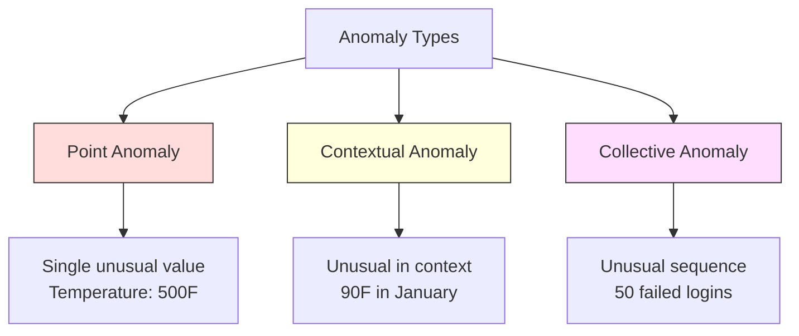
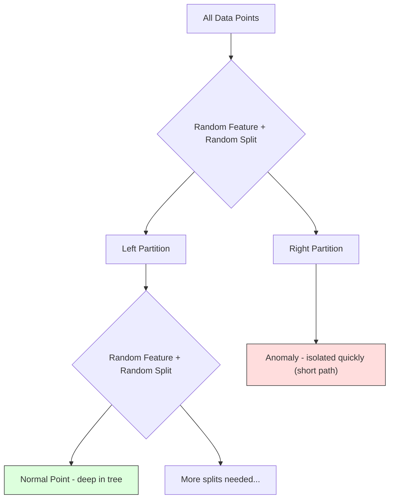
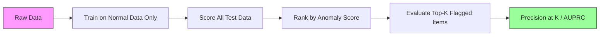

# Обнаружение аномалий

> Нормальное легко определить. Аномальное — это всё, что не вписывается.

**Тип:** Build
**Язык:** Python
**Предварительные требования:** Фаза 2, Уроки 01-09
**Время:** ~75 минут

## Цели обучения

- Реализовать методы обнаружения аномалий Z-score, IQR и Isolation Forest с нуля
- Различать точечные, контекстные и коллективные аномалии и выбирать подходящий метод обнаружения для каждой
- Объяснить, почему обнаружение аномалий формулируется как моделирование нормальных данных, а не классификация аномалий
- Сравнить обучение без учителя для обнаружения аномалий с обучением с учителем для классификации и оценить компромисс между покрытием новых аномалий и точностью

## Проблема

Кредитная карта используется в Нью-Йорке в 14:00, а затем в Токио в 14:05. Датчик на заводе показывает 150 градусов при норме 80-120. Сервер отправляет 50 000 запросов в секунду при среднесуточном значении 200.

Это аномалии. Их поиск важен. Мошенничество стоит миллиарды. Отказы оборудования стоят простоя. Сетевые вторжения стоят данных.

Проблема в том, что размеченные примеры аномалий редко доступны. Мошенничество составляет 0.1% транзакций. Отказы оборудования случаются несколько раз в год. Обучить стандартный классификатор нельзя, потому что в классе «аномалия» почти нет данных для обучения. Даже если какая-то разметка есть, увиденные аномалии — не единственный тип, с которым вы столкнётесь. Завтрашняя схема мошенничества выглядит иначе, чем сегодняшняя.

Обнаружение аномалий переворачивает задачу. Вместо того чтобы учить, что является аномальным, учат, что является нормальным. Всё, что отклоняется от нормы, подозрительно. Это работает без разметки, адаптируется к новым типам аномалий и масштабируется на огромные наборы данных.

## Концепция

### Типы аномалий

Не все аномалии одинаковы:

- **Точечные аномалии.** Отдельная точка данных, необычная вне зависимости от контекста. Показание температуры 500 градусов. Транзакция на $50,000 со счёта, который обычно тратит $50.
- **Контекстные аномалии.** Точка данных, необычная с учётом контекста. Температура 90 градусов нормальна летом и аномальна зимой. Одно и то же значение, разный контекст.
- **Коллективные аномалии.** Последовательность точек данных, необычная как группа, даже если каждая отдельная точка может быть нормальной. Пять неудачных попыток входа — это нормально. Пятьдесят подряд — это атака перебором.

Большинство методов обнаруживают точечные аномалии. Контекстным аномалиям нужны признаки времени или местоположения. Коллективным аномалиям нужны методы, учитывающие последовательность.



### Формулировка без учителя

В стандартной классификации у вас есть разметка для обоих классов. При обнаружении аномалий обычно встречается одна из трёх ситуаций:

1. **Полностью без учителя.** Разметки нет вообще. Детектор обучается на всех данных в надежде, что аномалий достаточно мало, чтобы не исказить модель «нормы».
2. **С частичным учителем (semi-supervised).** Есть чистый набор данных, содержащий только норму. Обучение проводится на этом чистом наборе, а оценка — на всём остальном. Это самый надёжный вариант, когда он доступен.
3. **Со слабым учителем (weakly supervised).** Есть немного размеченных аномалий. Их используют для оценки, а не для обучения. Обучение проводится без учителя, а затем на размеченном подмножестве измеряются точность и полнота.

Ключевая идея: обнаружение аномалий принципиально отличается от классификации. Моделируется распределение нормальных данных, а не граница решения между двумя классами.

### Обучение с учителем и без учителя: компромисс

Если размеченные аномалии всё же есть, использовать ли их для обучения (классификация с учителем) или только для оценки (обнаружение без учителя)?

**С учителем (трактовка как классификации):**
- Улавливает именно те типы аномалий, которые уже встречались
- Более высокая точность на известных типах аномалий
- Полностью упускает новые типы аномалий
- Требует переобучения при появлении новых типов аномалий
- Нужно достаточно примеров аномалий (часто их слишком мало)

**Без учителя (моделирование нормы, отметка отклонений):**
- Улавливает любое отклонение от нормы, включая новые типы
- Не требует размеченных аномалий
- Более высокая доля ложных срабатываний (не всё необычное — плохо)
- Более устойчиво к смещению распределения

На практике лучшие системы сочетают оба подхода: обнаружение без учителя для широкого покрытия, модели с учителем для известных приоритетных типов аномалий и проверку человеком для неоднозначных случаев.

### Метод Z-score

Самый простой подход. Вычисляются среднее и стандартное отклонение каждого признака. Точка отмечается, если она отстоит от среднего более чем на k стандартных отклонений.

```text
z_score = (x - mean) / std
anomaly if |z_score| > threshold
```

Порог по умолчанию — 3.0 (99.7% нормальных данных попадает в пределы 3 стандартных отклонений для гауссова распределения).

**Сильные стороны:** просто. Быстро. Интерпретируемо («это значение отстоит от нормы на 4.5 стандартных отклонения»).

**Слабые стороны:** предполагает нормальное распределение данных. Чувствителен к выбросам в обучающих данных (выбросы смещают среднее и завышают стандартное отклонение, из-за чего их сложнее обнаружить). Не работает на мультимодальных распределениях.

**Когда хорошо работает:** мониторинг одного признака, когда данные примерно колоколообразны. Время отклика сервера, производственные допуски, показания датчиков со стабильным базовым уровнем.

**Когда не работает:** данные с несколькими кластерами (два офиса с разной базовой температурой), скошенные данные (суммы транзакций, где $1000 — редкость, но не аномалия), данные с выбросами в обучающей выборке.

### Метод IQR

Более устойчив, чем Z-score. Использует межквартильный размах вместо среднего и стандартного отклонения.

```
Q1 = 25th percentile
Q3 = 75th percentile
IQR = Q3 - Q1
lower_bound = Q1 - factor * IQR
upper_bound = Q3 + factor * IQR
anomaly if x < lower_bound or x > upper_bound
```

Коэффициент по умолчанию — 1.5.

**Сильные стороны:** устойчив к выбросам (на процентили не влияют экстремальные значения). Работает на скошенных распределениях. Не требует предположения о нормальности.

**Слабые стороны:** только одномерный (применяется к каждому признаку независимо). Не может обнаружить аномалии, необычные лишь при совместном рассмотрении признаков (точка может быть нормальной по каждому признаку отдельно, но аномальной в совместном пространстве).

**Практическое замечание:** коэффициент 1.5 в IQR соответствует «усам» на диаграмме размаха (box plot). Точки за пределами усов — потенциальные выбросы. Использование 3.0 вместо 1.5 делает детектор более консервативным (меньше отметок, меньше ложных срабатываний). Правильный коэффициент зависит от вашей терпимости к ложным тревогам.

### Isolation Forest

Ключевая идея: аномалий мало, и они отличаются от остальных. При случайном разбиении данных аномалии легче изолировать — им требуется меньше случайных разбиений, чтобы отделиться от остальных.



**Как это работает:**
1. Строится множество случайных деревьев (Isolation Forest)
2. На каждом узле выбирается случайный признак и случайное значение разбиения между минимумом и максимумом признака
3. Разбиение продолжается, пока каждая точка не будет изолирована (в собственном листе)
4. У аномалий средняя длина пути по всем деревьям короче

**Почему это работает:** нормальные точки находятся в плотных областях. Чтобы отделить точку от соседей, нужно много случайных разбиений. Аномалии находятся в разреженных областях. Для их изоляции достаточно одного-двух случайных разбиений.

Оценка аномальности основана на средней длине пути по всем деревьям, нормированной на ожидаемую длину пути случайного двоичного дерева поиска:

```
score(x) = 2^(-average_path_length(x) / c(n))
```

Где `c(n)` — ожидаемая длина пути для n образцов. Оценка около 1 означает аномалию. Оценка около 0.5 означает норму. Оценка около 0 означает «очень норму» (глубоко в плотных кластерах).

**Сильные стороны:** не требует предположений о распределении. Работает в высоких размерностях. Хорошо масштабируется (сублинейно относительно размера выборки, так как каждое дерево использует подвыборку). Обрабатывает смешанные типы признаков.

**Слабые стороны:** плохо справляется с аномалиями в плотных областях (эффект маскировки). Случайное разбиение менее эффективно, когда много признаков нерелевантны.

**Ключевые гиперпараметры:**
- `n_estimators`: число деревьев. Обычно достаточно 100. Больше деревьев дают более стабильные оценки, но замедляют вычисления.
- `max_samples`: число образцов на дерево. В оригинальной статье значение по умолчанию — 256. Меньшие значения делают отдельные деревья менее точными, но повышают разнообразие. Именно подвыборка делает Isolation Forest быстрым — каждое дерево видит небольшую долю данных.
- `contamination`: ожидаемая доля аномалий. Используется только для задания порога. Не влияет на сами оценки.

### Local Outlier Factor (LOF)

LOF сравнивает локальную плотность вокруг точки с плотностью вокруг её соседей. Точка в разреженной области, окружённой плотными областями, считается аномальной.

**Как это работает:**
1. Для каждой точки находятся её k ближайших соседей
2. Вычисляется локальная достижимая плотность (насколько плотна окрестность)
3. Плотность каждой точки сравнивается с плотностью её соседей
4. Если плотность точки значительно ниже плотности соседей, она считается выбросом

**Оценка LOF:**
- LOF около 1.0 означает плотность, сходную с соседями (норма)
- LOF больше 1.0 означает более низкую плотность, чем у соседей (потенциальная аномалия)
- LOF значительно больше 1.0 (например, 2.0+) означает значительно более низкую плотность (вероятная аномалия)

«Локальность» здесь критична. Рассмотрим набор данных с двумя кластерами: плотный кластер из 1000 точек и разреженный кластер из 50 точек. Точка на краю разреженного кластера не является необычной глобально — у неё 50 соседей. Но она локально необычна, если её ближайшие соседи плотнее, чем она сама. LOF улавливает этот нюанс, который упускают глобальные методы.

**Сильные стороны:** обнаруживает локальные аномалии (точки, необычные в своей окрестности, даже если они не необычны глобально). Работает на кластерах разной плотности.

**Слабые стороны:** медленный на больших наборах данных (O(n^2) при наивной реализации). Чувствителен к выбору k. Плохо работает в очень высоких размерностях (проклятие размерности влияет на вычисление расстояний).

### Сравнение

| Метод | Предположения | Скорость | Работает в высоких размерностях | Обнаруживает локальные аномалии |
|--------|------------|-------|-------------------|------------------------|
| Z-score | Нормальное распределение | Очень быстро | Да (по признаку) | Нет |
| IQR | Нет (по признаку) | Очень быстро | Да (по признаку) | Нет |
| Isolation Forest | Нет | Быстро | Да | Частично |
| LOF | Расстояние осмысленно | Медленно | Плохо | Да |

### Сложности оценивания

Оценить детекторы аномалий сложнее, чем классификаторы:

- **Экстремальный дисбаланс классов.** При 0.1% аномалий предсказание «норма» для всего даёт 99.9% точности (accuracy). Accuracy бесполезна.
- **AUROC вводит в заблуждение.** При сильном дисбалансе AUROC может выглядеть хорошо, даже когда модель упускает большинство аномалий при практических порогах.
- **Более удачные метрики:** Precision@k (доля реальных аномалий среди топ-k отмеченных объектов), AUPRC (площадь под кривой точность-полнота) и полнота при фиксированной доле ложных срабатываний.



### Конвейер обнаружения аномалий

На практике обнаружение аномалий следует такому рабочему процессу:

1. **Сбор базовых данных.** В идеале — период, когда известно, что аномалий нет (или их очень мало).
2. **Проектирование признаков.** Исходные признаки плюс производные (скользящие статистики, временные признаки, отношения).
3. **Обучение детектора.** Обучение на базовых данных. Модель учится, как выглядит «норма».
4. **Оценка новых данных.** Каждое новое наблюдение получает оценку аномальности.
5. **Выбор порога.** Выбор порогового значения оценки. Это бизнес-решение: более высокий порог означает меньше ложных тревог, но больше пропущенных аномалий.
6. **Оповещение и расследование.** Отмеченные точки передаются на проверку человеком или в автоматическую реакцию.
7. **Сбор обратной связи.** Фиксируется, были ли отмеченные объекты настоящими аномалиями или ложными тревогами. Эти данные используются для оценки детектора и настройки порога со временем.

Конвейер никогда не «завершён». Распределения данных смещаются, появляются новые типы аномалий, пороги нуждаются в корректировке. Относитесь к обнаружению аномалий как к живой системе, а не как к разовой модели.

```figure
f3-anomaly-fence
```

## Реализация

Код в `code/anomaly_detection.py` реализует Z-score, IQR и Isolation Forest с нуля.

### Детектор Z-score

```python
def zscore_detect(X, threshold=3.0):
    mean = X.mean(axis=0)
    std = X.std(axis=0)
    std[std == 0] = 1.0
    z = np.abs((X - mean) / std)
    return z.max(axis=1) > threshold
```

Простой и векторизованный. Отмечает точку, если любой признак превышает порог.

### Детектор IQR

```python
def iqr_detect(X, factor=1.5):
    q1 = np.percentile(X, 25, axis=0)
    q3 = np.percentile(X, 75, axis=0)
    iqr = q3 - q1
    iqr[iqr == 0] = 1.0
    lower = q1 - factor * iqr
    upper = q3 + factor * iqr
    outside = (X < lower) | (X > upper)
    return outside.any(axis=1)
```

### Isolation Forest с нуля

Реализация с нуля строит isolation-деревья, которые случайным образом разбивают пространство признаков:

```python
class IsolationTree:
    def __init__(self, max_depth):
        self.max_depth = max_depth

    def fit(self, X, depth=0):
        n, p = X.shape
        if depth >= self.max_depth or n <= 1:
            self.is_leaf = True
            self.size = n
            return self
        self.is_leaf = False
        self.feature = np.random.randint(p)
        x_min = X[:, self.feature].min()
        x_max = X[:, self.feature].max()
        if x_min == x_max:
            self.is_leaf = True
            self.size = n
            return self
        self.threshold = np.random.uniform(x_min, x_max)
        left_mask = X[:, self.feature] < self.threshold
        self.left = IsolationTree(self.max_depth).fit(X[left_mask], depth + 1)
        self.right = IsolationTree(self.max_depth).fit(X[~left_mask], depth + 1)
        return self
```

Длина пути до изоляции точки определяет её оценку аномальности. Более короткие пути означают более высокую аномальность.

Класс `IsolationForest` оборачивает несколько деревьев:

```python
class IsolationForest:
    def __init__(self, n_estimators=100, max_samples=256, seed=42):
        self.n_estimators = n_estimators
        self.max_samples = max_samples

    def fit(self, X):
        sample_size = min(self.max_samples, X.shape[0])
        max_depth = int(np.ceil(np.log2(sample_size)))
        for _ in range(self.n_estimators):
            idx = rng.choice(X.shape[0], size=sample_size, replace=False)
            tree = IsolationTree(max_depth=max_depth)
            tree.fit(X[idx])
            self.trees.append(tree)

    def anomaly_score(self, X):
        avg_path = average path length across all trees
        scores = 2.0 ** (-avg_path / c(max_samples))
        return scores
```

Нормирующий коэффициент `c(n)` — это ожидаемая длина пути неудачного поиска в двоичном дереве поиска с n элементами. Он равен `2 * H(n-1) - 2*(n-1)/n`, где `H` — гармоническое число. Эта нормализация обеспечивает сопоставимость оценок между наборами данных разного размера.

### Демонстрационные сценарии

Код генерирует несколько тестовых сценариев:

1. **Один кластер с выбросами.** 2D-гауссов кластер с аномалиями, внесёнными далеко от центра. Здесь должны работать все методы.
2. **Мультимодальные данные.** Три кластера разного размера и плотности. Точки между кластерами аномальны. Z-score испытывает трудности, потому что диапазоны по каждому признаку широки.
3. **Данные высокой размерности.** 50 признаков, но аномалии отличаются только по 5 из них. Проверка того, могут ли методы находить аномалии в подмножестве признаков.

Каждая демонстрация сравнивает все методы по точности, полноте, F1 и Precision@k.

## Использование

С sklearn (использование библиотечных реализаций, а не реализаций с нуля):

```python
from sklearn.ensemble import IsolationForest
from sklearn.neighbors import LocalOutlierFactor

iso = IsolationForest(n_estimators=100, contamination=0.05, random_state=42)
iso.fit(X_train)
predictions = iso.predict(X_test)

lof = LocalOutlierFactor(n_neighbors=20, contamination=0.05, novelty=True)
lof.fit(X_train)
predictions = lof.predict(X_test)
```

Обратите внимание, `contamination` задаёт ожидаемую долю аномалий. Правильная настройка важна — слишком низкое значение пропускает аномалии, слишком высокое создаёт ложные тревоги.

Код в `anomaly_detection.py` сравнивает реализации с нуля с sklearn на одних и тех же данных.

### Параметр contamination в sklearn

Параметр `contamination` в sklearn определяет порог для преобразования непрерывных оценок аномальности в бинарные предсказания. Он не меняет базовые оценки.

```python
iso_5 = IsolationForest(contamination=0.05)
iso_10 = IsolationForest(contamination=0.10)
```

Оба варианта дают одинаковые оценки аномальности. Но `iso_5` отмечает верхние 5%, а `iso_10` — верхние 10%. Если истинная доля аномалий неизвестна (обычно так и есть), задайте contamination как "auto" и работайте напрямую с исходными оценками. Установите собственный порог, исходя из соотношения стоимости ложноположительных и ложноотрицательных срабатываний.

### One-Class SVM

Ещё один детектор аномалий без учителя, о котором стоит знать. One-Class SVM подгоняет границу вокруг нормальных данных в пространстве признаков высокой размерности (с помощью kernel trick).

```python
from sklearn.svm import OneClassSVM

oc_svm = OneClassSVM(kernel="rbf", gamma="auto", nu=0.05)
oc_svm.fit(X_train)
predictions = oc_svm.predict(X_test)
```

Параметр `nu` приближённо задаёт долю аномалий. One-Class SVM хорошо работает на малых и средних наборах данных, но плохо масштабируется на очень большие данные (матрица ядра растёт квадратично).

### Подход на основе автоэнкодеров (предпросмотр)

Автоэнкодеры — это нейронные сети, которые учатся сжимать и восстанавливать данные. Обучение проводится на нормальных данных. При тестировании у аномалий высокая ошибка восстановления, потому что сеть научилась восстанавливать только нормальные паттерны.

Это рассматривается в Фазе 3 (Глубокое обучение), но принцип тот же: моделируется норма, отмечаются отклонения.

### Ансамблевое обнаружение аномалий

Так же, как ансамблевые методы улучшают классификацию (Урок 11), объединение нескольких детекторов аномалий улучшает обнаружение. Самый простой подход:

1. Запустить несколько детекторов (Z-score, IQR, Isolation Forest, LOF)
2. Нормализовать оценки каждого детектора в диапазон [0, 1]
3. Усреднить нормализованные оценки
4. Отметить точки, у которых средняя оценка выше порога

Это снижает число ложных срабатываний, потому что у разных методов разные режимы отказа. Точка, отмеченная всеми четырьмя методами, почти наверняка аномальна. Точка, отмеченная только одним методом, может быть особенностью именно этого метода.

Более сложные ансамбли взвешивают каждый детектор по его оценённой надёжности (измеренной на валидационном наборе с известными аномалиями, если он доступен).

### Соображения для продакшена

1. **Дрейф порога.** По мере смещения распределения данных фиксированный порог устаревает. Отслеживайте распределение оценок аномальности и периодически корректируйте порог.
2. **Усталость от тревог.** При слишком большом числе ложных тревог операторы перестают обращать на них внимание. Начните с высокого порога (меньше, но более надёжных оповещений) и снижайте его по мере роста доверия.
3. **Ансамблевый подход.** В продакшене объединяйте несколько детекторов. Отмечайте точку, только если несколько методов сходятся во мнении, что она аномальна. Это значительно снижает число ложных срабатываний.
4. **Проектирование признаков.** Исходных признаков редко бывает достаточно. Добавляйте скользящие статистики, отношения, время с последнего события и признаки, специфичные для предметной области. Хороший набор признаков важнее выбора детектора.
5. **Цикл обратной связи.** Когда операторы проверяют отмеченные объекты и подтверждают или отклоняют их, передавайте это обратно в систему. Со временем накапливайте размеченные данные для оценки и улучшения детектора.

## Поставка

Этот урок производит:
- `outputs/skill-anomaly-detector.md` — навык для выбора подходящего детектора
- `code/anomaly_detection.py` — Z-score, IQR и Isolation Forest с нуля, со сравнением с sklearn

### Выбор порога

Оценка аномальности непрерывна. Для бинарных решений нужен порог. Это бизнес-решение, а не техническое.

Рассмотрим два сценария:
- **Обнаружение мошенничества.** Пропуск мошенничества дорого обходится (чарджбэки, доверие клиентов). Ложная тревога стоит аналитику 5 минут на проверку. Установите низкий порог, чтобы ловить больше мошенничества, принимая больше ложных тревог.
- **Обслуживание оборудования.** Ложная тревога означает ненужную остановку стоимостью $50,000. Пропущенный отказ означает ремонт за $500,000. Установите порог так, чтобы сбалансировать эти издержки.

В обоих случаях оптимальный порог зависит от соотношения стоимости ложноположительных и ложноотрицательных срабатываний. Постройте графики точности и полноты при разных порогах, наложите функцию стоимости и выберите точку минимальной стоимости.

### Масштабирование до продакшена

Для обнаружения аномалий в реальном времени в продакшене:

1. **Пакетное обучение, онлайн-оценивание.** Периодически (ежедневно, еженедельно) обучайте модель на недавних нормальных данных. Оценивайте каждое новое наблюдение по мере поступления.
2. **Вычисление признаков должно совпадать.** Если обучение проводилось со скользящими статистиками за 30 дней, для вычисления признаков нового наблюдения нужна 30-дневная история. Буферизуйте необходимую историю.
3. **Мониторинг распределения оценок.** Отслеживайте распределение оценок аномальности во времени. Если медианная оценка смещается вверх, значит либо данные меняются, либо модель устарела.
4. **Объяснимость.** Когда вы отмечаете аномалию, укажите причину. Z-score: «Признак X на 4.2 стандартных отклонения выше нормы». Isolation Forest: «Эта точка была изолирована в среднем за 3.1 разбиения (нормальным точкам требуется 8.5)».

## Упражнения

1. **Настройка порога.** Запустите детектор Z-score с порогами от 1.0 до 5.0 с шагом 0.5. Постройте графики точности и полноты для каждого порога. Где находится оптимальная точка для ваших данных?

2. **Многомерные аномалии.** Создайте 2D-данные, где каждый признак по отдельности выглядит нормально, но их сочетание аномально (например, точки далеко от диагонали основного кластера). Покажите, что Z-score по отдельным признакам упускает такие точки, а Isolation Forest их обнаруживает.

3. **LOF с нуля.** Реализуйте Local Outlier Factor с использованием k ближайших соседей. Сравните со sklearn'овским LocalOutlierFactor на тех же данных. Используйте k=10 и k=50 — как выбор k влияет на результаты?

4. **Потоковое обнаружение аномалий.** Модифицируйте детектор Z-score для работы в потоковом режиме: обновляйте текущие среднее и дисперсию по мере поступления новых точек (онлайн-алгоритм Уэлфорда). Сравните с пакетным Z-score на тех же данных.

5. **Оценка на реальных данных.** Возьмите набор данных с известными аномалиями (например, данные о мошенничестве с кредитными картами с Kaggle). Оцените все четыре метода с помощью precision@100, precision@500 и AUPRC. Какой метод работает лучше всего? Почему?

## Ключевые термины

| Термин | Что говорят люди | Что это на самом деле означает |
|------|----------------|----------------------|
| Аномалия | «Выброс, необычная точка» | Точка данных, значительно отклоняющаяся от ожидаемого паттерна нормальных данных |
| Точечная аномалия | «Одно странное значение» | Отдельное наблюдение, необычное вне зависимости от контекста |
| Контекстная аномалия | «Нормальное значение, неправильный контекст» | Наблюдение, необычное с учётом контекста (времени, местоположения и т. д.), но нормальное в другом контексте |
| Isolation Forest | «Случайные разбиения для поиска выбросов» | Ансамбль случайных деревьев, изолирующий аномалии за меньшее число разбиений, чем нормальные точки |
| Local Outlier Factor | «Сравнение плотности с соседями» | Метод, отмечающий точки, чья локальная плотность значительно ниже плотности соседей |
| Z-score | «Стандартные отклонения от среднего» | (x - mean) / std, измеряет, насколько далеко точка от центра в единицах стандартного отклонения |
| IQR | «Межквартильный размах» | Q3 - Q1, измеряет разброс средних 50% данных, используется для устойчивого обнаружения выбросов |
| Contamination | «Ожидаемая доля аномалий» | Гиперпараметр, сообщающий детектору, какую долю данных он должен отмечать как аномальную |
| Precision@k | «Сколько из топ-k отметок настоящие» | Точность, вычисленная только для k самых подозрительных точек, полезна при дисбалансе классов в обнаружении аномалий |
| AUPRC | «Площадь под кривой точность-полнота» | Метрика, обобщающая качество точность-полнота по всем порогам, лучше AUROC для несбалансированных данных |

## Дополнительные материалы

- [Liu et al., Isolation Forest (2008)](https://cs.nju.edu.cn/zhouzh/zhouzh.files/publication/icdm08b.pdf) — оригинальная статья про Isolation Forest
- [Breunig et al., LOF: Identifying Density-Based Local Outliers (2000)](https://dl.acm.org/doi/10.1145/342009.335388) — оригинальная статья про LOF
- [scikit-learn Outlier Detection docs](https://scikit-learn.org/stable/modules/outlier_detection.html) — обзор всех детекторов аномалий sklearn
- [Chandola et al., Anomaly Detection: A Survey (2009)](https://dl.acm.org/doi/10.1145/1541880.1541882) — всесторонний обзор методов обнаружения аномалий
- [Goldstein and Uchida, A Comparative Evaluation of Unsupervised Anomaly Detection Algorithms (2016)](https://journals.plos.org/plosone/article?id=10.1371/journal.pone.0152173) — эмпирическое сравнение 10 методов на реальных наборах данных
