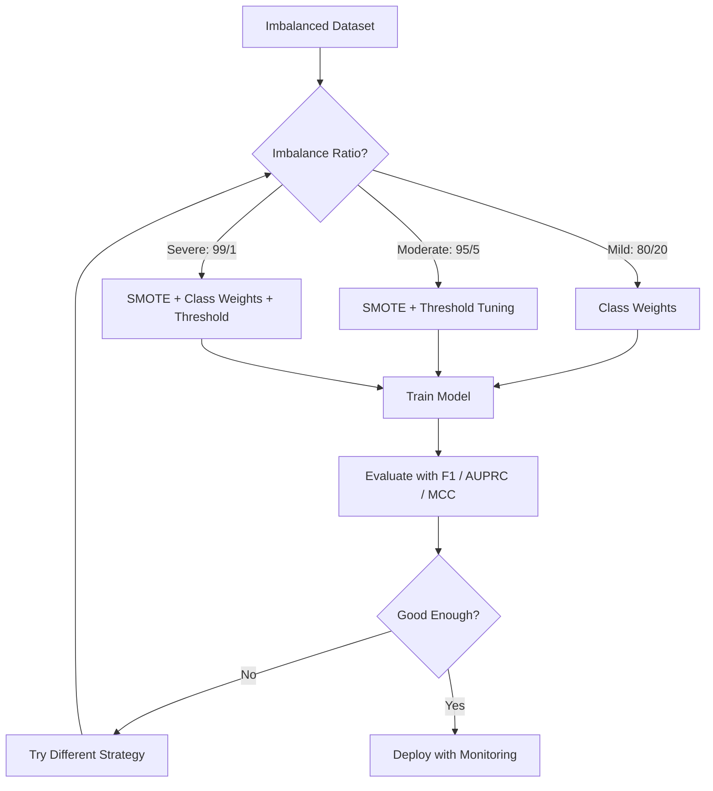
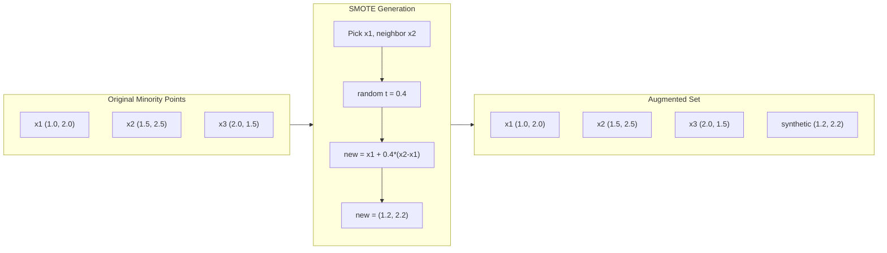
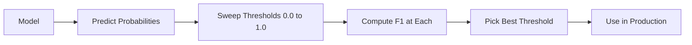
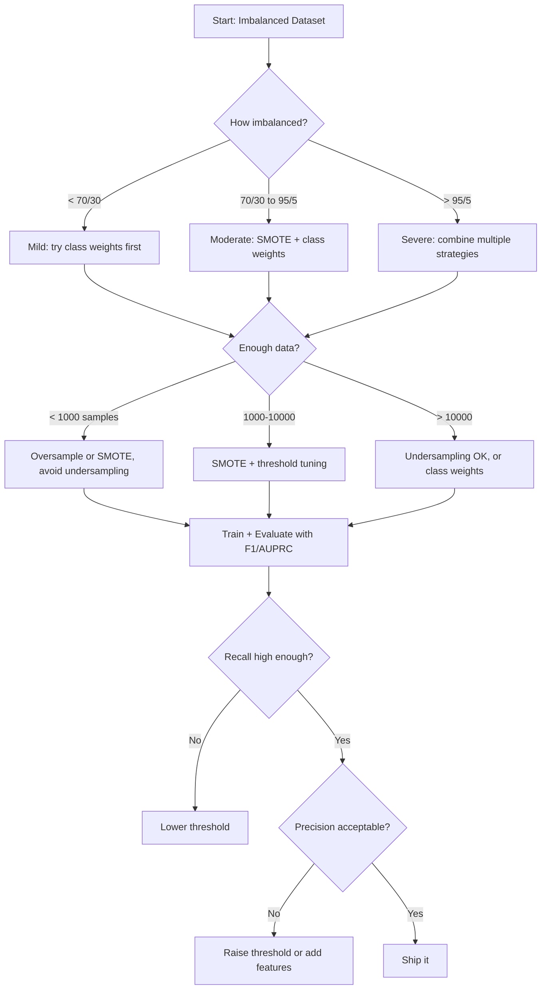

# Работа с несбалансированными данными

> Когда 99% ваших данных «норма», accuracy лжёт.

**Тип:** Build
**Язык:** Python
**Предварительные требования:** Фаза 2, Уроки 01-09 (особенно метрики оценивания)
**Время:** ~90 минут

## Цели обучения

- Реализовать SMOTE с нуля и объяснить, чем синтетический оверсэмплинг отличается от случайного дублирования
- Оценивать классификаторы на несбалансированных данных с помощью F1, AUPRC и коэффициента корреляции Мэттьюса вместо accuracy
- Сравнить взвешивание классов, настройку порога и стратегии ресэмплинга и выбрать подходящий подход для заданного коэффициента дисбаланса
- Построить полный конвейер работы с несбалансированными данными, сочетающий SMOTE, веса классов и оптимизацию порога

## Проблема

Вы строите модель обнаружения мошенничества. Она даёт 99.9% accuracy. Вы празднуете. Затем понимаете, что она предсказывает «не мошенничество» для каждой транзакции.

Это не баг. Это рациональное поведение, когда мошенническими являются только 0.1% транзакций. Модель учится, что предсказание мажоритарного класса всегда минимизирует общую ошибку. Она технически верна и совершенно бесполезна.

Это встречается везде, где классификация имеет реальное значение. Диагностика заболеваний: 1% положительных случаев. Сетевые вторжения: 0.01% атак. Производственный брак: 0.5% дефектных изделий. Фильтрация спама: 20% спама. Прогноз оттока: 5% ушедших клиентов. Чем важнее миноритарный класс, тем реже он встречается.

Accuracy не работает, потому что она трактует все правильные предсказания одинаково. Правильная маркировка легитимной транзакции и правильная поимка мошенничества одинаково засчитываются как один балл accuracy. Но именно поимка мошенничества — единственная причина существования модели. Нужны метрики, техники и стратегии обучения, которые заставляют модель обращать внимание на редкий, но важный класс.

## Концепция

### Почему accuracy не работает

Рассмотрим набор данных из 1000 образцов: 990 отрицательных, 10 положительных. Модель, всегда предсказывающая отрицательный класс:

|  | Предсказан положительный | Предсказан отрицательный |
|--|---|---|
| Фактически положительный | 0 (TP) | 10 (FN) |
| Фактически отрицательный | 0 (FP) | 990 (TN) |

Accuracy = (0 + 990) / 1000 = 99.0%

Модель не ловит ни одного случая мошенничества. Ни одного заболевания. Ни одного брака. Но accuracy показывает 99%. Именно поэтому accuracy опасна для несбалансированных задач.

### Более удачные метрики

**Precision (точность)** = TP / (TP + FP). Из всего, отмеченного как положительное, сколько действительно является таковым? Высокая точность означает мало ложных тревог.

**Recall (полнота)** = TP / (TP + FN). Из всего, что фактически положительно, сколько было поймано? Высокая полнота означает мало пропущенных положительных случаев.

**F1 Score** = 2 * precision * recall / (precision + recall). Среднее гармоническое. Сильнее штрафует за экстремальный дисбаланс между точностью и полнотой, чем среднее арифметическое.

**F-beta Score** = (1 + beta^2) * precision * recall / (beta^2 * precision + recall). При beta > 1 полнота важнее. При beta < 1 важнее точность. F2 часто используется при обнаружении мошенничества (пропустить мошенничество хуже, чем дать ложную тревогу).

**AUPRC** (площадь под кривой точность-полнота). Подобна AUC-ROC, но более информативна для несбалансированных данных. У случайного классификатора AUPRC равна доле положительного класса (а не 0.5, как у ROC). Это облегчает наблюдение улучшений.

**Коэффициент корреляции Мэттьюса** = (TP * TN - FP * FN) / sqrt((TP+FP)(TP+FN)(TN+FP)(TN+FN)). Диапазон от -1 до +1. Даёт высокий балл только тогда, когда модель хорошо справляется с обоими классами. Сбалансирован даже при очень разных размерах классов.

Для модели «всегда предсказывать отрицательный класс» выше: precision = 0/0 (не определено, часто устанавливается в 0), recall = 0/10 = 0, F1 = 0, MCC = 0. Эти метрики корректно определяют модель как бесполезную.

### Конвейер работы с несбалансированными данными



### SMOTE: техника синтетического оверсэмплинга миноритарного класса

Случайный оверсэмплинг дублирует существующие образцы миноритарного класса. Это работает, но рискует переобучением, потому что модель видит идентичные точки многократно.

SMOTE создаёт новые синтетические образцы миноритарного класса, которые правдоподобны, но не являются копиями. Алгоритм:

1. Для каждого образца миноритарного класса x найти его k ближайших соседей среди других образцов миноритарного класса
2. Случайно выбрать одного соседа
3. Создать новый образец на отрезке между x и этим соседом

Формула: `new_sample = x + random(0, 1) * (neighbor - x)`

Это интерполирует между реальными точками миноритарного класса, создавая образцы в той же области пространства признаков без простого копирования существующих данных.



### Сравнение стратегий сэмплирования

**Случайный оверсэмплинг**: дублирует образцы миноритарного класса до совпадения с числом образцов мажоритарного класса.
- Плюсы: просто, нет потери информации
- Минусы: точные дубликаты вызывают переобучение, увеличивают время обучения

**Случайный андерсэмплинг**: удаляет образцы мажоритарного класса до совпадения с числом образцов миноритарного класса.
- Плюсы: быстрое обучение, просто
- Минусы: отбрасывает потенциально полезные данные мажоритарного класса, более высокая дисперсия

**SMOTE**: создаёт синтетические образцы миноритарного класса путём интерполяции.
- Плюсы: генерирует новые точки данных, снижает переобучение по сравнению со случайным оверсэмплингом
- Минусы: может создавать зашумлённые образцы вблизи границы решения, не учитывает распределение мажоритарного класса

| Стратегия | Что меняется в данных | Риск | Когда использовать |
|----------|-------------|------|-------------|
| Оверсэмплинг | Дублирование миноритарного класса | Переобучение | Небольшие наборы данных, умеренный дисбаланс |
| Андерсэмплинг | Удаление мажоритарного класса | Потеря информации | Большие наборы данных, нужно быстрое обучение |
| SMOTE | Добавление синтетического миноритарного класса | Шум на границе | Умеренный дисбаланс, достаточно образцов миноритарного класса для k-NN |

### Веса классов

Вместо изменения данных меняется то, как модель относится к ошибкам. Ошибочной классификации миноритарного класса присваивается более высокий вес.

Для бинарной задачи с 950 отрицательными и 50 положительными образцами:
- Вес для отрицательного класса = n_samples / (2 * n_negative) = 1000 / (2 * 950) = 0.526
- Вес для положительного класса = n_samples / (2 * n_positive) = 1000 / (2 * 50) = 10.0

Положительный класс получает вес в 19 раз больше. Ошибка на одном положительном образце обходится так же дорого, как ошибка на 19 отрицательных образцах. Модель вынуждена обращать внимание на миноритарный класс.

В логистической регрессии это изменяет функцию потерь:

```
weighted_loss = -sum(w_i * [y_i * log(p_i) + (1-y_i) * log(1-p_i)])
```

где w_i зависит от класса образца i.

Веса классов математически эквивалентны оверсэмплингу в ожидании, но без создания новых точек данных. Это делает их быстрее и избавляет от риска переобучения на дубликатах.

### Настройка порога

Большинство классификаторов выдают вероятность. Порог по умолчанию — 0.5: если P(positive) >= 0.5, предсказывается положительный класс. Но 0.5 произвольно. При дисбалансе классов оптимальный порог обычно намного ниже.

Процесс:
1. Обучить модель
2. Получить предсказанные вероятности на валидационном наборе
3. Перебрать пороги от 0.0 до 1.0
4. Вычислить F1 (или выбранную метрику) для каждого порога
5. Выбрать порог, максимизирующий выбранную метрику



Модель может выдать P(fraud) = 0.15 для мошеннической транзакции. При пороге 0.5 она классифицируется как не мошенничество. При пороге 0.10 она правильно поймана. Калибровка вероятности важна меньше, чем ранжирование — пока мошенничество получает более высокие вероятности, чем не мошенничество, существует порог, который их разделяет.

### Обучение с учётом стоимости ошибок

Обобщение весов классов. Вместо единообразных издержек назначаются конкретные издержки ошибочной классификации:

| | Предсказан положительный | Предсказан отрицательный |
|--|---|---|
| Фактически положительный | 0 (верно) | C_FN = 100 |
| Фактически отрицательный | C_FP = 1 | 0 (верно) |

Пропуск мошеннической транзакции (FN) обходится в 100 раз дороже, чем ложная тревога (FP). Модель оптимизируется по суммарной стоимости, а не по числу ошибок.

Это самый обоснованный подход, когда реальные издержки можно оценить. Пропущенный диагноз рака имеет совсем другую стоимость, чем ложная тревога, приводящая к лишней биопсии. Явное указание этих издержек вынуждает делать правильные компромиссы.

### Блок-схема принятия решений



```figure
class-imbalance
```

## Реализация

### Шаг 1: генерация несбалансированного набора данных

```python
import numpy as np


def make_imbalanced_data(n_majority=950, n_minority=50, seed=42):
    rng = np.random.RandomState(seed)

    X_maj = rng.randn(n_majority, 2) * 1.0 + np.array([0.0, 0.0])
    X_min = rng.randn(n_minority, 2) * 0.8 + np.array([2.5, 2.5])

    X = np.vstack([X_maj, X_min])
    y = np.concatenate([np.zeros(n_majority), np.ones(n_minority)])

    shuffle_idx = rng.permutation(len(y))
    return X[shuffle_idx], y[shuffle_idx]
```

### Шаг 2: SMOTE с нуля

```python
def euclidean_distance(a, b):
    return np.sqrt(np.sum((a - b) ** 2))


def find_k_neighbors(X, idx, k):
    distances = []
    for i in range(len(X)):
        if i == idx:
            continue
        d = euclidean_distance(X[idx], X[i])
        distances.append((i, d))
    distances.sort(key=lambda x: x[1])
    return [d[0] for d in distances[:k]]


def smote(X_minority, k=5, n_synthetic=100, seed=42):
    rng = np.random.RandomState(seed)
    n_samples = len(X_minority)
    k = min(k, n_samples - 1)
    synthetic = []

    for _ in range(n_synthetic):
        idx = rng.randint(0, n_samples)
        neighbors = find_k_neighbors(X_minority, idx, k)
        neighbor_idx = neighbors[rng.randint(0, len(neighbors))]
        t = rng.random()
        new_point = X_minority[idx] + t * (X_minority[neighbor_idx] - X_minority[idx])
        synthetic.append(new_point)

    return np.array(synthetic)
```

### Шаг 3: случайные оверсэмплинг и андерсэмплинг

```python
def random_oversample(X, y, seed=42):
    rng = np.random.RandomState(seed)
    classes, counts = np.unique(y, return_counts=True)
    max_count = counts.max()

    X_resampled = list(X)
    y_resampled = list(y)

    for cls, count in zip(classes, counts):
        if count < max_count:
            cls_indices = np.where(y == cls)[0]
            n_needed = max_count - count
            chosen = rng.choice(cls_indices, size=n_needed, replace=True)
            X_resampled.extend(X[chosen])
            y_resampled.extend(y[chosen])

    X_out = np.array(X_resampled)
    y_out = np.array(y_resampled)
    shuffle = rng.permutation(len(y_out))
    return X_out[shuffle], y_out[shuffle]


def random_undersample(X, y, seed=42):
    rng = np.random.RandomState(seed)
    classes, counts = np.unique(y, return_counts=True)
    min_count = counts.min()

    X_resampled = []
    y_resampled = []

    for cls in classes:
        cls_indices = np.where(y == cls)[0]
        chosen = rng.choice(cls_indices, size=min_count, replace=False)
        X_resampled.extend(X[chosen])
        y_resampled.extend(y[chosen])

    X_out = np.array(X_resampled)
    y_out = np.array(y_resampled)
    shuffle = rng.permutation(len(y_out))
    return X_out[shuffle], y_out[shuffle]
```

### Шаг 4: логистическая регрессия с весами классов

```python
def sigmoid(z):
    return 1.0 / (1.0 + np.exp(-np.clip(z, -500, 500)))


def logistic_regression_weighted(X, y, weights, lr=0.01, epochs=200):
    n_samples, n_features = X.shape
    w = np.zeros(n_features)
    b = 0.0

    for _ in range(epochs):
        z = X @ w + b
        pred = sigmoid(z)
        error = pred - y
        weighted_error = error * weights

        gradient_w = (X.T @ weighted_error) / n_samples
        gradient_b = np.mean(weighted_error)

        w -= lr * gradient_w
        b -= lr * gradient_b

    return w, b


def compute_class_weights(y):
    classes, counts = np.unique(y, return_counts=True)
    n_samples = len(y)
    n_classes = len(classes)
    weight_map = {}
    for cls, count in zip(classes, counts):
        weight_map[cls] = n_samples / (n_classes * count)
    return np.array([weight_map[yi] for yi in y])
```

### Шаг 5: настройка порога

```python
def find_optimal_threshold(y_true, y_probs, metric="f1"):
    best_threshold = 0.5
    best_score = -1.0

    for threshold in np.arange(0.05, 0.96, 0.01):
        y_pred = (y_probs >= threshold).astype(int)
        tp = np.sum((y_pred == 1) & (y_true == 1))
        fp = np.sum((y_pred == 1) & (y_true == 0))
        fn = np.sum((y_pred == 0) & (y_true == 1))

        if metric == "f1":
            precision = tp / (tp + fp) if (tp + fp) > 0 else 0.0
            recall = tp / (tp + fn) if (tp + fn) > 0 else 0.0
            score = 2 * precision * recall / (precision + recall) if (precision + recall) > 0 else 0.0
        elif metric == "recall":
            score = tp / (tp + fn) if (tp + fn) > 0 else 0.0
        elif metric == "precision":
            score = tp / (tp + fp) if (tp + fp) > 0 else 0.0

        if score > best_score:
            best_score = score
            best_threshold = threshold

    return best_threshold, best_score
```

### Шаг 6: функции оценивания

```python
def confusion_matrix_values(y_true, y_pred):
    tp = np.sum((y_pred == 1) & (y_true == 1))
    tn = np.sum((y_pred == 0) & (y_true == 0))
    fp = np.sum((y_pred == 1) & (y_true == 0))
    fn = np.sum((y_pred == 0) & (y_true == 1))
    return tp, tn, fp, fn


def compute_metrics(y_true, y_pred):
    tp, tn, fp, fn = confusion_matrix_values(y_true, y_pred)
    accuracy = (tp + tn) / (tp + tn + fp + fn)
    precision = tp / (tp + fp) if (tp + fp) > 0 else 0.0
    recall = tp / (tp + fn) if (tp + fn) > 0 else 0.0
    f1 = 2 * precision * recall / (precision + recall) if (precision + recall) > 0 else 0.0

    denom = np.sqrt(float((tp + fp) * (tp + fn) * (tn + fp) * (tn + fn)))
    mcc = (tp * tn - fp * fn) / denom if denom > 0 else 0.0

    return {
        "accuracy": accuracy,
        "precision": precision,
        "recall": recall,
        "f1": f1,
        "mcc": mcc,
    }
```

### Шаг 7: сравнение всех подходов

```python
X, y = make_imbalanced_data(950, 50, seed=42)
split = int(0.8 * len(y))
X_train, X_test = X[:split], X[split:]
y_train, y_test = y[:split], y[split:]

# Baseline: no treatment
w_base, b_base = logistic_regression_weighted(
    X_train, y_train, np.ones(len(y_train)), lr=0.1, epochs=300
)
probs_base = sigmoid(X_test @ w_base + b_base)
preds_base = (probs_base >= 0.5).astype(int)

# Oversampled
X_over, y_over = random_oversample(X_train, y_train)
w_over, b_over = logistic_regression_weighted(
    X_over, y_over, np.ones(len(y_over)), lr=0.1, epochs=300
)
preds_over = (sigmoid(X_test @ w_over + b_over) >= 0.5).astype(int)

# SMOTE
minority_mask = y_train == 1
X_minority = X_train[minority_mask]
synthetic = smote(X_minority, k=5, n_synthetic=len(y_train) - 2 * int(minority_mask.sum()))
X_smote = np.vstack([X_train, synthetic])
y_smote = np.concatenate([y_train, np.ones(len(synthetic))])
w_sm, b_sm = logistic_regression_weighted(
    X_smote, y_smote, np.ones(len(y_smote)), lr=0.1, epochs=300
)
preds_smote = (sigmoid(X_test @ w_sm + b_sm) >= 0.5).astype(int)

# Class weights
sample_weights = compute_class_weights(y_train)
w_cw, b_cw = logistic_regression_weighted(
    X_train, y_train, sample_weights, lr=0.1, epochs=300
)
probs_cw = sigmoid(X_test @ w_cw + b_cw)
preds_cw = (probs_cw >= 0.5).astype(int)

# Threshold tuning (tune on held-out validation set, not test set)
probs_val = sigmoid(X_val @ w_cw + b_cw)
best_thresh, best_f1 = find_optimal_threshold(y_val, probs_val, metric="f1")
preds_thresh = (probs_cw >= best_thresh).astype(int)
```

Файл с кодом запускает всё это в одном скрипте и выводит результаты.

## Использование

С scikit-learn и imbalanced-learn эти техники сводятся к однострочникам:

```python
from sklearn.linear_model import LogisticRegression
from sklearn.metrics import classification_report, f1_score
from sklearn.model_selection import train_test_split
from imblearn.over_sampling import SMOTE
from imblearn.under_sampling import RandomUnderSampler
from imblearn.pipeline import Pipeline

X_train, X_test, y_train, y_test = train_test_split(X, y, stratify=y)

model_weighted = LogisticRegression(class_weight="balanced")
model_weighted.fit(X_train, y_train)
print(classification_report(y_test, model_weighted.predict(X_test)))

smote = SMOTE(random_state=42)
X_resampled, y_resampled = smote.fit_resample(X_train, y_train)
model_smote = LogisticRegression()
model_smote.fit(X_resampled, y_resampled)
print(classification_report(y_test, model_smote.predict(X_test)))

pipeline = Pipeline([
    ("smote", SMOTE()),
    ("model", LogisticRegression(class_weight="balanced")),
])
pipeline.fit(X_train, y_train)
print(classification_report(y_test, pipeline.predict(X_test)))
```

Реализации с нуля показывают в точности, что делает каждая техника. SMOTE — это просто интерполяция k-NN на миноритарном классе. Веса классов умножают функцию потерь. Настройка порога — это цикл перебора пороговых значений. Никакой магии.

## Поставка

Этот урок производит:
- `outputs/skill-imbalanced-data.md` — чек-лист для работы с несбалансированными задачами классификации

## Упражнения

1. **Borderline-SMOTE**: модифицируйте реализацию SMOTE так, чтобы синтетические образцы генерировались только для точек миноритарного класса, находящихся вблизи границы решения (тех, чьи k ближайших соседей включают образцы мажоритарного класса). Сравните результаты со стандартным SMOTE на наборе данных, где классы пересекаются.

2. **Оптимизация матрицы издержек**: реализуйте обучение с учётом стоимости ошибок, где матрица издержек — параметр. Создайте функцию, принимающую матрицу издержек и возвращающую оптимальные предсказания, минимизирующие ожидаемую стоимость. Протестируйте с разными соотношениями издержек (1:10, 1:100, 1:1000) и постройте графики того, как меняется компромисс между точностью и полнотой.

3. **Калибровка порога**: реализуйте Platt scaling (обучите логистическую регрессию на сырых выходах модели, чтобы получить калиброванные вероятности). Сравните кривую точность-полнота до и после калибровки. Покажите, что калибровка не меняет ранжирование (AUC остаётся тем же), но делает вероятности более осмысленными.

4. **Ансамбль с balanced bagging**: обучите несколько моделей, каждую на сбалансированной бутстрэп-выборке (весь миноритарный класс + случайное подмножество мажоритарного). Усредните их предсказания. Сравните этот подход с одной моделью с SMOTE. Измерьте и качество, и дисперсию по прогонам.

5. **Эксперимент с коэффициентом дисбаланса**: возьмите сбалансированный набор данных и постепенно увеличивайте коэффициент дисбаланса (50/50, 70/30, 90/10, 95/5, 99/1). Для каждого коэффициента обучите модель с SMOTE и без него. Постройте график F1 в зависимости от коэффициента дисбаланса для обоих подходов. При каком коэффициенте SMOTE начинает давать значимую разницу?

## Ключевые термины

| Термин | Что говорят люди | Что это на самом деле означает |
|------|----------------|----------------------|
| Дисбаланс классов | «У одного класса намного больше образцов» | Распределение классов в наборе данных значительно скошено, из-за чего модели склоняются к мажоритарному классу |
| SMOTE | «Синтетический оверсэмплинг» | Создаёт новые образцы миноритарного класса путём интерполяции между существующими образцами миноритарного класса и их k ближайшими соседями из того же класса |
| Веса классов | «Ошибки на редких классах делаются дороже» | Умножение функции потерь на веса, специфичные для класса, чтобы модель сильнее штрафовалась за ошибки на миноритарном классе |
| Настройка порога | «Сдвиг границы решения» | Изменение порогового значения вероятности для классификации с 0.5 по умолчанию на значение, оптимизирующее нужную метрику |
| Компромисс точность-полнота | «Нельзя получить и то, и другое» | Снижение порога ловит больше положительных случаев (выше полнота), но также отмечает больше ложноположительных (ниже точность), и наоборот |
| AUPRC | «Площадь под PR-кривой» | Обобщает кривую точность-полнота в одно число; более информативна, чем AUC-ROC, при сильном дисбалансе классов |
| Коэффициент корреляции Мэттьюса | «Сбалансированная метрика» | Корреляция между предсказанными и фактическими метками, дающая высокий балл только тогда, когда модель хорошо работает на обоих классах |
| Обучение с учётом стоимости ошибок | «Разные ошибки стоят по-разному» | Включение реальных издержек ошибочной классификации в цель обучения, чтобы модель оптимизировалась по суммарной стоимости, а не по числу ошибок |
| Случайный оверсэмплинг | «Дублировать миноритарный класс» | Повторение образцов миноритарного класса для выравнивания числа образцов по классам; просто, но рискует переобучением на дубликатах |

## Дополнительные материалы

- [SMOTE: Synthetic Minority Over-sampling Technique (Chawla et al., 2002)](https://arxiv.org/abs/1106.1813) — оригинальная статья про SMOTE, до сих пор самая цитируемая работа по обучению на несбалансированных данных
- [Learning from Imbalanced Data (He & Garcia, 2009)](https://ieeexplore.ieee.org/document/5128907) — всесторонний обзор методов сэмплирования, учёта стоимости ошибок и алгоритмических подходов
- [imbalanced-learn documentation](https://imbalanced-learn.org/stable/) — библиотека Python с вариантами SMOTE, стратегиями андерсэмплинга и интеграцией в конвейеры
- [The Precision-Recall Plot Is More Informative than the ROC Plot (Saito & Rehmsmeier, 2015)](https://journals.plos.org/plosone/article?id=10.1371/journal.pone.0118432) — когда и почему PR-кривые предпочтительнее ROC-кривых для несбалансированных задач
