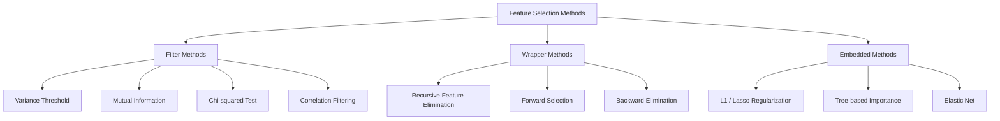
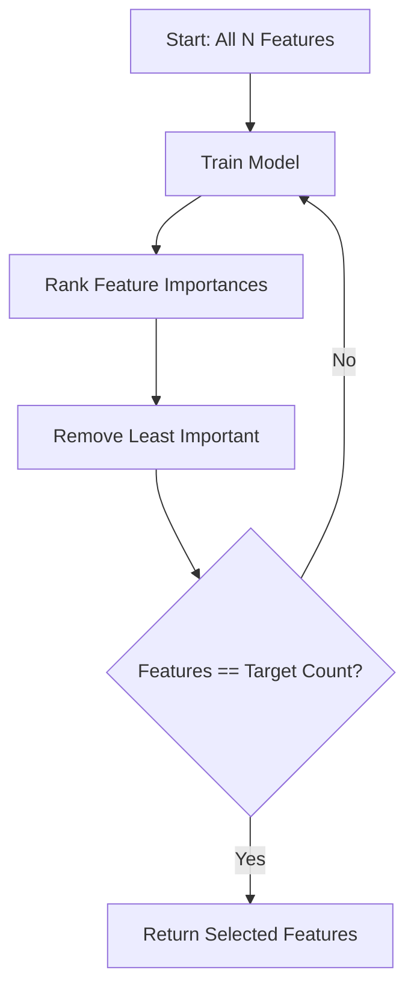
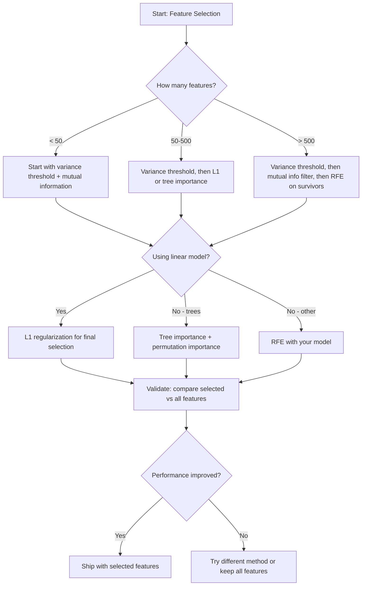

# Отбор признаков

> Больше признаков — не значит лучше. Лучше — правильные признаки.

**Тип:** Build
**Язык:** Python
**Предварительные требования:** Фаза 2, Уроки 01-09, 08 (проектирование признаков)
**Время:** ~75 минут

## Цели обучения

- Реализовать фильтрующие методы (порог дисперсии, взаимная информация, хи-квадрат) и обёрточные методы (RFE, прямой отбор) с нуля
- Объяснить, почему взаимная информация улавливает нелинейные связи между признаком и целевой переменной, которые упускает корреляция
- Сравнить L1-регуляризацию (встроенный отбор) с RFE (обёрточный отбор) и оценить их вычислительные компромиссы
- Построить конвейер отбора признаков, объединяющий несколько методов, и продемонстрировать улучшение обобщающей способности на отложенных данных

## Проблема

У вас 500 признаков. Модель обучается медленно, постоянно переобучается, и никто не может объяснить, что она выучила. Вы добавляете больше признаков в надежде улучшить результат. Становится только хуже.

Это проклятие размерности в действии. По мере роста числа признаков объём пространства признаков стремительно растёт. Точки данных становятся разреженными. Расстояния между точками сближаются. Модели требуется экспоненциально больше данных, чтобы найти реальные закономерности. Шумовые признаки заглушают информативные. Переобучение становится нормой.

Отбор признаков — противоядие. Уберите шум. Устраните избыточность. Оставьте признаки, которые несут реальную информацию о целевой переменной. Результат: более быстрое обучение, лучшее обобщение и модели, которые действительно можно объяснить.

Цель — не использовать всю доступную информацию. Цель — использовать правильную информацию.

## Концепция

### Три категории отбора признаков

Каждый метод отбора признаков относится к одной из трёх категорий:



**Фильтрующие методы** оценивают каждый признак независимо, используя статистическую меру. Они не используют модель. Быстро, но упускают взаимодействия между признаками.

**Обёрточные методы** обучают модель для оценки подмножеств признаков. В качестве оценки используется качество модели. Результаты лучше, но метод дорог, поскольку модель переобучается много раз.

**Встроенные методы** отбирают признаки в процессе обучения модели. L1-регуляризация обнуляет веса. Деревья решений разбивают выборку по наиболее полезным признакам. Отбор происходит во время подгонки, а не как отдельный шаг.

### Порог дисперсии

Самый простой фильтр. Если признак почти не меняется от образца к образцу, он почти не несёт информации.

Рассмотрим признак, который равен 0.0 для 999 из 1000 образцов. Его дисперсия близка к нулю. Ни одна модель не сможет использовать его, чтобы различать классы. Удалите его.

```
variance(x) = mean((x - mean(x))^2)
```

Задайте порог (например, 0.01). Отбросьте все признаки с дисперсией ниже него. Это удаляет постоянные или почти постоянные признаки, вообще не глядя на целевую переменную.

Когда использовать: как этап предобработки перед другими методами. Он отсеивает явно бесполезные признаки практически без затрат.

Ограничение: признак может иметь высокую дисперсию и при этом оставаться чистым шумом. Порог дисперсии необходим, но не достаточен.

### Взаимная информация

Взаимная информация измеряет, насколько знание значения признака X снижает неопределённость относительно целевой переменной Y.

```
I(X; Y) = sum_x sum_y p(x, y) * log(p(x, y) / (p(x) * p(y)))
```

Если X и Y независимы, p(x, y) = p(x) * p(y), поэтому логарифмический член равен нулю и I(X; Y) = 0. Чем больше X говорит вам о Y, тем выше взаимная информация.

Ключевое преимущество перед корреляцией: взаимная информация улавливает нелинейные зависимости. Признак может иметь нулевую корреляцию с целевой переменной, но высокую взаимную информацию, потому что зависимость квадратичная или периодическая.

Для непрерывных признаков сначала дискретизируйте их по интервалам (оценка на основе гистограммы). Число интервалов влияет на оценку — слишком мало интервалов теряет информацию, слишком много добавляет шум. Распространённый выбор: sqrt(n) интервалов или правило Стёрджеса (1 + log2(n)).


### Рекурсивное исключение признаков (RFE)

RFE — это обёрточный метод. Он использует собственную оценку важности признаков модели для итеративного отсечения:

1. Обучите модель на всех признаках
2. Ранжируйте признаки по важности (коэффициенты для линейных моделей, снижение примеси для деревьев)
3. Удалите наименее важный(е) признак(и)
4. Повторяйте, пока не останется нужное количество признаков



RFE учитывает взаимодействия между признаками, потому что модель видит все оставшиеся признаки вместе. Удаление одного признака меняет важность остальных. Это делает метод более тщательным, чем фильтрующие методы.

Цена: модель обучается N - target раз. При 500 признаках и целевом значении 10 это 490 запусков обучения. Для дорогих моделей это медленно. Ускорить процесс можно, удаляя несколько признаков за шаг (например, отбрасывая нижние 10% на каждом раунде).

### L1-регуляризация (Lasso)

L1-регуляризация добавляет к функции потерь сумму абсолютных значений весов:

```
loss = prediction_error + alpha * sum(|w_i|)
```

Параметр alpha определяет, насколько агрессивно отсекаются признаки. Чем выше alpha, тем больше весов становятся точно равны нулю.

Почему именно ноль? L1-штраф создаёт в пространстве весов область ограничений в форме ромба. Оптимальное решение обычно оказывается в одном из углов этого ромба, где один или несколько весов равны нулю. L2-регуляризация (ridge) создаёт круговое ограничение, при котором веса уменьшаются, но редко достигают нуля.

Это встроенный отбор признаков: модель в процессе обучения сама решает, какие признаки игнорировать. Признаки с нулевым весом фактически удаляются.

Преимущества: один запуск обучения, устойчивость к коррелирующим признакам (выбирает один, остальные обнуляет), встроена в большинство реализаций линейных моделей.

Ограничение: работает только для линейных моделей. Не способна улавливать нелинейную важность признаков.

### Важность признаков на основе деревьев

Деревья решений и их ансамбли (случайные леса, градиентный бустинг) естественным образом ранжируют признаки. Каждое разбиение снижает примесь (Gini или энтропия для классификации, дисперсия для регрессии). Признаки, дающие большее снижение примеси, считаются более важными.

Для случайного леса с T деревьями:

```
importance(feature_j) = (1/T) * sum over all trees of
    sum over all nodes splitting on feature_j of
        (n_samples * impurity_decrease)
```

Это даёт нормализованную оценку важности для каждого признака. Метод автоматически учитывает нелинейные зависимости и взаимодействия признаков.

Осторожно: важность на основе деревьев смещена в сторону признаков с большим числом уникальных значений (высокой кардинальностью). Случайный столбец ID будет казаться важным, поскольку он идеально разбивает каждый образец. Используйте важность на основе перестановок как проверку на здравый смысл.

### Важность на основе перестановок

Метод, не зависящий от модели:

1. Обучите модель и зафиксируйте базовое качество на валидационных данных
2. Для каждого признака: случайным образом перемешайте его значения, измерьте падение качества
3. Чем больше падение, тем важнее признак

Если перемешивание признака не ухудшает качество, модель от него не зависит. Если качество резко падает, этот признак критически важен.

Важность на основе перестановок избегает смещения по кардинальности, свойственного важности на основе деревьев. Но метод медленный: одна полная оценка на признак, повторяемая несколько раз для устойчивости.

### Сравнительная таблица

| Метод | Тип | Скорость | Нелинейность | Взаимодействия признаков |
|--------|------|-------|-----------|---------------------|
| Порог дисперсии | Фильтрующий | Очень быстро | Нет | Нет |
| Взаимная информация | Фильтрующий | Быстро | Да | Нет |
| Корреляционный фильтр | Фильтрующий | Быстро | Нет | Нет |
| RFE | Обёрточный | Медленно | Зависит от модели | Да |
| L1 / Lasso | Встроенный | Быстро | Нет (линейный) | Нет |
| Важность деревьев | Встроенный | Средне | Да | Да |
| Важность на основе перестановок | Не зависит от модели | Медленно | Да | Да |

### Схема принятия решений



```figure
f3-feature-prune
```

## Создаём

### Шаг 1: Сгенерируйте синтетические данные с известной структурой признаков

```python
import numpy as np


def make_feature_selection_data(n_samples=500, seed=42):
    rng = np.random.RandomState(seed)

    x1 = rng.randn(n_samples)
    x2 = rng.randn(n_samples)
    x3 = rng.randn(n_samples)
    x4 = x1 + 0.1 * rng.randn(n_samples)
    x5 = x2 + 0.1 * rng.randn(n_samples)

    informative = np.column_stack([x1, x2, x3, x4, x5])

    correlated = np.column_stack([
        x1 * 0.9 + 0.1 * rng.randn(n_samples),
        x2 * 0.8 + 0.2 * rng.randn(n_samples),
        x3 * 0.7 + 0.3 * rng.randn(n_samples),
        x1 * 0.5 + x2 * 0.5 + 0.1 * rng.randn(n_samples),
        x2 * 0.6 + x3 * 0.4 + 0.1 * rng.randn(n_samples),
    ])

    noise = rng.randn(n_samples, 10) * 0.5

    X = np.hstack([informative, correlated, noise])
    y = (2 * x1 - 1.5 * x2 + x3 + 0.5 * rng.randn(n_samples) > 0).astype(int)

    feature_names = (
        [f"info_{i}" for i in range(5)]
        + [f"corr_{i}" for i in range(5)]
        + [f"noise_{i}" for i in range(10)]
    )

    return X, y, feature_names
```

Мы знаем истинную структуру: признаки 0-4 информативны (при этом 3 и 4 — коррелированные копии 0 и 1), признаки 5-9 коррелируют с информативными признаками, признаки 10-19 — чистый шум. Хороший метод отбора должен присвоить признакам 0-4 самый высокий ранг, а 10-19 — самый низкий.

### Шаг 2: Порог дисперсии

```python
def variance_threshold(X, threshold=0.01):
    variances = np.var(X, axis=0)
    mask = variances > threshold
    return mask, variances
```

### Шаг 3: Взаимная информация (дискретная)

```python
def discretize(x, n_bins=10):
    min_val, max_val = x.min(), x.max()
    if max_val == min_val:
        return np.zeros_like(x, dtype=int)
    bin_edges = np.linspace(min_val, max_val, n_bins + 1)
    binned = np.digitize(x, bin_edges[1:-1])
    return binned


def mutual_information(X, y, n_bins=10):
    n_samples, n_features = X.shape
    mi_scores = np.zeros(n_features)

    y_vals, y_counts = np.unique(y, return_counts=True)
    p_y = y_counts / n_samples

    for f in range(n_features):
        x_binned = discretize(X[:, f], n_bins)
        x_vals, x_counts = np.unique(x_binned, return_counts=True)
        p_x = dict(zip(x_vals, x_counts / n_samples))

        mi = 0.0
        for xv in x_vals:
            for yi, yv in enumerate(y_vals):
                joint_mask = (x_binned == xv) & (y == yv)
                p_xy = np.sum(joint_mask) / n_samples
                if p_xy > 0:
                    mi += p_xy * np.log(p_xy / (p_x[xv] * p_y[yi]))
        mi_scores[f] = mi

    return mi_scores
```

### Шаг 4: Рекурсивное исключение признаков

```python
def simple_logistic_importance(X, y, lr=0.1, epochs=100):
    n_samples, n_features = X.shape
    w = np.zeros(n_features)
    b = 0.0

    for _ in range(epochs):
        z = X @ w + b
        pred = 1.0 / (1.0 + np.exp(-np.clip(z, -500, 500)))
        error = pred - y
        w -= lr * (X.T @ error) / n_samples
        b -= lr * np.mean(error)

    return w, b


def rfe(X, y, n_features_to_select=5, lr=0.1, epochs=100):
    n_total = X.shape[1]
    remaining = list(range(n_total))
    rankings = np.ones(n_total, dtype=int)
    rank = n_total

    while len(remaining) > n_features_to_select:
        X_subset = X[:, remaining]
        w, _ = simple_logistic_importance(X_subset, y, lr, epochs)
        importances = np.abs(w)

        least_idx = np.argmin(importances)
        original_idx = remaining[least_idx]
        rankings[original_idx] = rank
        rank -= 1
        remaining.pop(least_idx)

    for idx in remaining:
        rankings[idx] = 1

    selected_mask = rankings == 1
    return selected_mask, rankings
```

### Шаг 5: Отбор признаков L1

```python
def soft_threshold(w, alpha):
    return np.sign(w) * np.maximum(np.abs(w) - alpha, 0)


def l1_feature_selection(X, y, alpha=0.1, lr=0.01, epochs=500):
    n_samples, n_features = X.shape
    w = np.zeros(n_features)
    b = 0.0

    for _ in range(epochs):
        z = X @ w + b
        pred = 1.0 / (1.0 + np.exp(-np.clip(z, -500, 500)))
        error = pred - y

        gradient_w = (X.T @ error) / n_samples
        gradient_b = np.mean(error)

        w -= lr * gradient_w
        w = soft_threshold(w, lr * alpha)
        b -= lr * gradient_b

    selected_mask = np.abs(w) > 1e-6
    return selected_mask, w
```

### Шаг 6: Важность на основе деревьев (простое дерево решений)

```python
def gini_impurity(y):
    if len(y) == 0:
        return 0.0
    classes, counts = np.unique(y, return_counts=True)
    probs = counts / len(y)
    return 1.0 - np.sum(probs ** 2)


def best_split(X, y, feature_idx):
    values = np.unique(X[:, feature_idx])
    if len(values) <= 1:
        return None, -1.0

    best_threshold = None
    best_gain = -1.0
    parent_gini = gini_impurity(y)
    n = len(y)

    for i in range(len(values) - 1):
        threshold = (values[i] + values[i + 1]) / 2.0
        left_mask = X[:, feature_idx] <= threshold
        right_mask = ~left_mask

        n_left = np.sum(left_mask)
        n_right = np.sum(right_mask)

        if n_left == 0 or n_right == 0:
            continue

        gain = parent_gini - (n_left / n) * gini_impurity(y[left_mask]) - (n_right / n) * gini_impurity(y[right_mask])

        if gain > best_gain:
            best_gain = gain
            best_threshold = threshold

    return best_threshold, best_gain


def tree_importance(X, y, n_trees=50, max_depth=5, seed=42):
    rng = np.random.RandomState(seed)
    n_samples, n_features = X.shape
    importances = np.zeros(n_features)

    for _ in range(n_trees):
        sample_idx = rng.choice(n_samples, size=n_samples, replace=True)
        feature_subset = rng.choice(n_features, size=max(1, int(np.sqrt(n_features))), replace=False)

        X_boot = X[sample_idx]
        y_boot = y[sample_idx]

        tree_imp = _build_tree_importance(X_boot, y_boot, feature_subset, max_depth)
        importances += tree_imp

    total = importances.sum()
    if total > 0:
        importances /= total

    return importances


def _build_tree_importance(X, y, feature_subset, max_depth, depth=0):
    n_features = X.shape[1]
    importances = np.zeros(n_features)

    if depth >= max_depth or len(np.unique(y)) <= 1 or len(y) < 4:
        return importances

    best_feature = None
    best_threshold = None
    best_gain = -1.0

    for f in feature_subset:
        threshold, gain = best_split(X, y, f)
        if gain > best_gain:
            best_gain = gain
            best_feature = f
            best_threshold = threshold

    if best_feature is None or best_gain <= 0:
        return importances

    importances[best_feature] += best_gain * len(y)

    left_mask = X[:, best_feature] <= best_threshold
    right_mask = ~left_mask

    importances += _build_tree_importance(X[left_mask], y[left_mask], feature_subset, max_depth, depth + 1)
    importances += _build_tree_importance(X[right_mask], y[right_mask], feature_subset, max_depth, depth + 1)

    return importances
```

### Шаг 7: Запустите все методы и сравните

Файл с кодом запускает все пять методов на одном и том же синтетическом наборе данных и выводит сравнительную таблицу, показывающую, какие признаки отбирает каждый метод.

## Применяем

В scikit-learn отбор признаков встроен в конвейер:

```python
from sklearn.feature_selection import (
    VarianceThreshold,
    mutual_info_classif,
    RFE,
    SelectFromModel,
)
from sklearn.linear_model import Lasso, LogisticRegression
from sklearn.ensemble import RandomForestClassifier

vt = VarianceThreshold(threshold=0.01)
X_filtered = vt.fit_transform(X)

mi_scores = mutual_info_classif(X, y)
top_k = np.argsort(mi_scores)[-10:]

rfe_selector = RFE(LogisticRegression(), n_features_to_select=10)
rfe_selector.fit(X, y)
X_rfe = rfe_selector.transform(X)

lasso_selector = SelectFromModel(Lasso(alpha=0.01))
lasso_selector.fit(X, y)
X_lasso = lasso_selector.transform(X)

rf = RandomForestClassifier(n_estimators=100)
rf.fit(X, y)
importances = rf.feature_importances_
```

Реализации с нуля показывают, что именно происходит внутри каждого метода. Порог дисперсии — это просто вычисление `var(X, axis=0)` и применение маски. Взаимная информация — это подсчёт совместных и маргинальных частот в таблице сопряжённости. RFE — это цикл, который обучает, ранжирует и отсекает. L1 — это градиентный спуск с шагом мягкого пороговой обработки. Важность деревьев накапливает снижения примеси по всем разбиениям. Никакой магии — только статистика и циклы.

Версии из sklearn добавляют устойчивость (например, mutual_info_classif использует оценку плотности методом k-NN вместо биннинга), скорость (реализации на C) и интеграцию в конвейер.

## Публикуем

Этот урок производит:
- `outputs/skill-feature-selector.md` — краткий справочник-дерево решений для выбора подходящего метода отбора признаков

## Упражнения

1. **Прямой отбор**: реализуйте метод, противоположный RFE. Начните с нуля признаков. На каждом шаге добавляйте признак, который сильнее всего улучшает качество модели. Остановитесь, когда добавление признаков перестаёт помогать. Сравните отобранные признаки с результатами RFE. Что быстрее? Что даёт лучшие результаты?

2. **Стабильный отбор**: запустите отбор признаков L1 50 раз, каждый раз на случайной 80%-й подвыборке данных, с немного разными значениями alpha. Подсчитайте, как часто отбирается каждый признак. Признаки, отобранные более чем в 80% запусков, считаются «стабильными». Сравните стабильные признаки с результатами однократного отбора L1. Что надёжнее?

3. **Обнаружение мультиколлинеарности**: вычислите корреляционную матрицу для всех признаков. Реализуйте функцию, которая при заданном пороге корреляции (например, 0.9) удаляет по одному признаку из каждой сильно коррелирующей пары (оставляя тот, у которого выше взаимная информация с целевой переменной). Проверьте на синтетическом наборе данных и убедитесь, что она удаляет избыточные коррелированные признаки.

4. **Конвейер отбора признаков**: соедините порог дисперсии, фильтр по взаимной информации и RFE в единый конвейер. Сначала удалите признаки с почти нулевой дисперсией, затем оставьте топ-50% по взаимной информации, затем запустите RFE на оставшихся. Сравните этот конвейер с запуском одного RFE на всех признаках. Быстрее ли конвейер? Так же ли он точен?

5. **Важность на основе перестановок с нуля**: реализуйте важность на основе перестановок. Для каждого признака перемешайте его значения 10 раз, измерьте среднее падение F1-меры. Сравните полученное ранжирование с важностью на основе деревьев. Найдите случаи, где они расходятся, и объясните почему (подсказка: коррелированные признаки).

## Ключевые термины

| Термин | Что говорят | Что это на самом деле означает |
|------|----------------|----------------------|
| Filter method (фильтрующий метод) | «Оценивать признаки независимо» | Подход к отбору признаков, который ранжирует признаки с помощью статистической меры без обучения модели, оценивая каждый признак изолированно |
| Wrapper method (обёрточный метод) | «Использовать модель для выбора признаков» | Подход к отбору признаков, который оценивает подмножества признаков, обучая модель и используя её качество как критерий отбора |
| Embedded method (встроенный метод) | «Модель отбирает признаки в процессе обучения» | Отбор признаков, происходящий как часть подгонки модели, например обнуление весов с помощью L1-регуляризации |
| Mutual information (взаимная информация) | «Насколько одна переменная говорит о другой» | Мера снижения неопределённости относительно Y при знании X, улавливающая как линейные, так и нелинейные зависимости |
| Recursive Feature Elimination (рекурсивное исключение признаков) | «Обучить, ранжировать, отсечь, повторить» | Итеративный обёрточный метод, который обучает модель, удаляет наименее важный(е) признак(и) и повторяет процесс, пока не будет достигнуто целевое количество |
| L1 / Lasso regularization (L1-/Lasso-регуляризация) | «Штраф, убивающий признаки» | Добавление суммы абсолютных значений весов к функции потерь, что приводит к обнулению весов неважных признаков ровно до нуля |
| Variance threshold (порог дисперсии) | «Удалить постоянные признаки» | Отбрасывание признаков, дисперсия которых по образцам оказывается ниже заданного порога, отфильтровывая признаки, не несущие информации |
| Feature importance (важность признака) | «Какие признаки важнее всего» | Оценка того, насколько каждый признак вносит вклад в предсказания модели, вычисляемая на основе прироста при разбиении (деревья) или величины коэффициентов (линейные модели) |
| Permutation importance (важность на основе перестановок) | «Перемешать и измерить ущерб» | Оценка важности признаков путём случайного перемешивания значений каждого признака и измерения возникающего падения качества модели |
| Curse of dimensionality (проклятие размерности) | «Слишком много признаков, недостаточно данных» | Явление, при котором добавление признаков экспоненциально увеличивает объём пространства признаков, делая данные разреженными, а расстояния — бессмысленными |

## Дополнительные материалы

- [An Introduction to Variable and Feature Selection (Guyon & Elisseeff, 2003)](https://jmlr.org/papers/v3/guyon03a.html) — основополагающий обзор методов отбора признаков, до сих пор широко цитируемый
- [scikit-learn Feature Selection Guide](https://scikit-learn.org/stable/modules/feature_selection.html) — практический справочник по фильтрующим, обёрточным и встроенным методам с примерами кода
- [Stability Selection (Meinshausen & Buhlmann, 2010)](https://arxiv.org/abs/0809.2932) — сочетает подвыборку с отбором признаков для получения устойчивых, воспроизводимых результатов
- [Beware Default Random Forest Importances (Strobl et al., 2007)](https://bmcbioinformatics.biomedcentral.com/articles/10.1186/1471-2105-8-25) — демонстрирует смещение по кардинальности в важности на основе деревьев и предлагает условную важность как альтернативу
