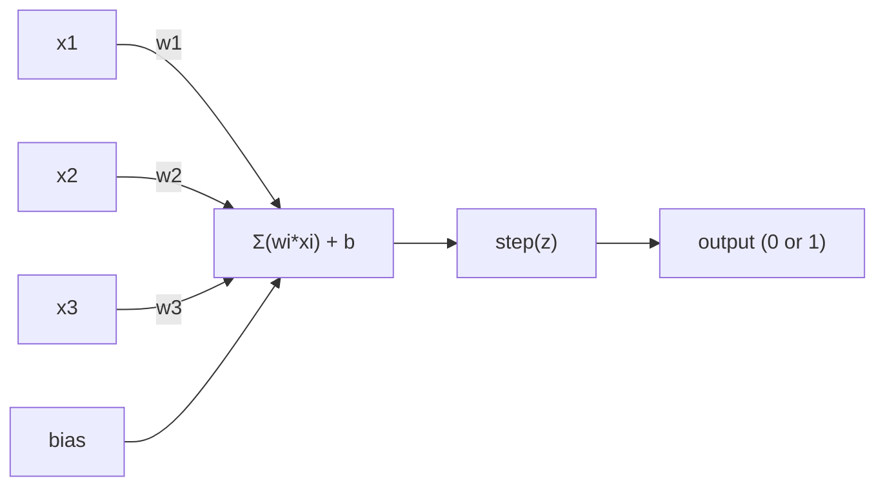
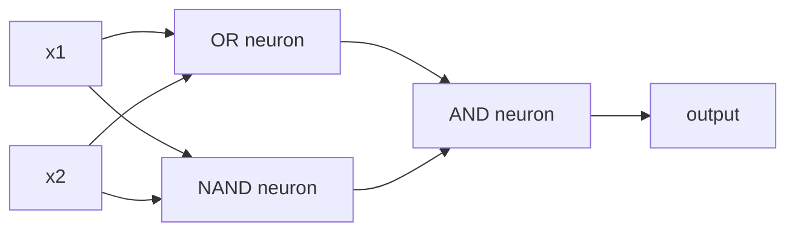

# Перцептрон

> Перцептрон — это атом нейронных сетей. Разберите его, и внутри найдутся веса, смещение (bias) и решение.

**Тип:** Build
**Языки:** Python
**Предварительные требования:** Фаза 1 (Интуитивное понимание линейной алгебры)
**Время:** ~60 минут

## Цели обучения

- Реализовать перцептрон с нуля на Python, включая правило обновления весов и ступенчатую функцию активации
- Объяснить, почему один перцептрон может решать только линейно разделимые задачи, и продемонстрировать случай сбоя на XOR
- Построить многослойный перцептрон, комбинируя вентили OR, NAND и AND, чтобы решить XOR
- Обучить двухслойную сеть с сигмоидной активацией и обратным распространением ошибки, чтобы она сама выучила XOR

## Проблема

Вы знаете векторы и скалярные произведения. Вы знаете, что матрица преобразует входы в выходы. Но как машина *обучается* тому, какое преобразование использовать?

Перцептрон отвечает на этот вопрос. Это простейшая из возможных обучающихся машин: взять входы, умножить на веса, добавить смещение и принять бинарное решение. Затем скорректировать. Вот и всё. Любая построенная нейронная сеть — это слои именно этой идеи, сложенные друг на друга.

Понять перцептрон — значит понять, что такое «обучение» в коде: подстройка чисел до тех пор, пока выход не совпадёт с реальностью.

## Концепция

### Один нейрон, одно решение

Перцептрон принимает n входов, умножает каждый на вес, суммирует их, добавляет смещение и пропускает результат через функцию активации.



Ступенчатая функция беспощадна: если взвешенная сумма плюс смещение >= 0, выход равен 1. Иначе — 0.

```
step(z) = 1  if z >= 0
           0  if z < 0
```

Это линейный классификатор. Веса и смещение задают прямую (или гиперплоскость в пространствах большей размерности), которая делит пространство входов на две области.

### Граница решения

Для двух входов перцептрон проводит прямую через 2D-пространство:

```
  x2
  ┤
  │  Class 1        /
  │    (0)          /
  │                /
  │               / w1·x1 + w2·x2 + b = 0
  │              /
  │             /     Class 2
  │            /        (1)
  ┼───────────/──────────── x1
```

Всё по одну сторону линии даёт на выходе 0. Всё по другую — 1. Обучение сдвигает эту линию, пока она не разделит классы корректно.

### Правило обучения

Правило обучения перцептрона простое:

```
For each training example (x, y_true):
    y_pred = predict(x)
    error = y_true - y_pred

    For each weight:
        w_i = w_i + learning_rate * error * x_i
    bias = bias + learning_rate * error
```

Если предсказание верно, error = 0, ничего не меняется. Если предсказан 0, а должна быть 1, веса увеличиваются. Если предсказана 1, а должен быть 0, веса уменьшаются. Скорость обучения (learning rate) определяет, насколько велика каждая корректировка.

### Проблема XOR

Вот где всё ломается. Посмотрите на эти логические вентили:

```
AND gate:           OR gate:            XOR gate:
x1  x2  out         x1  x2  out         x1  x2  out
0   0   0           0   0   0           0   0   0
0   1   0           0   1   1           0   1   1
1   0   0           1   0   1           1   0   1
1   1   1           1   1   1           1   1   0
```

AND и OR линейно разделимы: можно провести одну линию, отделяющую 0 от 1. XOR — нет. Ни одна линия не может отделить [0,1] и [1,0] от [0,0] и [1,1].

```
AND (separable):        XOR (not separable):

  x2                      x2
  1 ┤  0     1            1 ┤  1     0
    │     /                 │
  0 ┤  0 / 0              0 ┤  0     1
    ┼──/──────── x1         ┼──────────── x1
       line works!          no single line works!
```

Это фундаментальное ограничение. Один перцептрон способен решать только линейно разделимые задачи. Минский и Пейперт доказали это в 1969 году, и это почти на десятилетие похоронило исследования нейронных сетей.

Решение: складывать перцептроны в слои. Многослойный перцептрон может решить XOR, объединив два линейных решения в одно нелинейное.

```figure
perceptron-boundary
```

## Создаём

### Шаг 1: Класс Perceptron

```python
class Perceptron:
    def __init__(self, n_inputs, learning_rate=0.1):
        self.weights = [0.0] * n_inputs
        self.bias = 0.0
        self.lr = learning_rate

    def predict(self, inputs):
        total = sum(w * x for w, x in zip(self.weights, inputs))
        total += self.bias
        return 1 if total >= 0 else 0

    def train(self, training_data, epochs=100):
        for epoch in range(epochs):
            errors = 0
            for inputs, target in training_data:
                prediction = self.predict(inputs)
                error = target - prediction
                if error != 0:
                    errors += 1
                    for i in range(len(self.weights)):
                        self.weights[i] += self.lr * error * inputs[i]
                    self.bias += self.lr * error
            if errors == 0:
                print(f"Converged at epoch {epoch + 1}")
                return
        print(f"Did not converge after {epochs} epochs")
```

### Шаг 2: Обучение на логических вентилях

```python
and_data = [
    ([0, 0], 0),
    ([0, 1], 0),
    ([1, 0], 0),
    ([1, 1], 1),
]

or_data = [
    ([0, 0], 0),
    ([0, 1], 1),
    ([1, 0], 1),
    ([1, 1], 1),
]

not_data = [
    ([0], 1),
    ([1], 0),
]

print("=== AND Gate ===")
p_and = Perceptron(2)
p_and.train(and_data)
for inputs, _ in and_data:
    print(f"  {inputs} -> {p_and.predict(inputs)}")

print("\n=== OR Gate ===")
p_or = Perceptron(2)
p_or.train(or_data)
for inputs, _ in or_data:
    print(f"  {inputs} -> {p_or.predict(inputs)}")

print("\n=== NOT Gate ===")
p_not = Perceptron(1)
p_not.train(not_data)
for inputs, _ in not_data:
    print(f"  {inputs} -> {p_not.predict(inputs)}")
```

### Шаг 3: Наблюдаем провал XOR

```python
xor_data = [
    ([0, 0], 0),
    ([0, 1], 1),
    ([1, 0], 1),
    ([1, 1], 0),
]

print("\n=== XOR Gate (single perceptron) ===")
p_xor = Perceptron(2)
p_xor.train(xor_data, epochs=1000)
for inputs, expected in xor_data:
    result = p_xor.predict(inputs)
    status = "OK" if result == expected else "WRONG"
    print(f"  {inputs} -> {result} (expected {expected}) {status}")
```

Сеть никогда не сойдётся. Это строгое доказательство того, что один перцептрон не может выучить XOR.

### Шаг 4: Решаем XOR с помощью двух слоёв

Хитрость: XOR = (x1 OR x2) AND NOT (x1 AND x2). Скомбинируем три перцептрона:



```python
def xor_network(x1, x2):
    or_neuron = Perceptron(2)
    or_neuron.weights = [1.0, 1.0]
    or_neuron.bias = -0.5

    nand_neuron = Perceptron(2)
    nand_neuron.weights = [-1.0, -1.0]
    nand_neuron.bias = 1.5

    and_neuron = Perceptron(2)
    and_neuron.weights = [1.0, 1.0]
    and_neuron.bias = -1.5

    hidden1 = or_neuron.predict([x1, x2])
    hidden2 = nand_neuron.predict([x1, x2])
    output = and_neuron.predict([hidden1, hidden2])
    return output


print("\n=== XOR Gate (multi-layer network) ===")
for inputs, expected in xor_data:
    result = xor_network(inputs[0], inputs[1])
    print(f"  {inputs} -> {result} (expected {expected})")
```

Все четыре случая верны. Сложение перцептронов в слои создаёт границы решений, которые ни один отдельный перцептрон построить не может.

### Шаг 5: Обучаем двухслойную сеть

В шаге 4 веса были подобраны вручную. Это работает для XOR, но не для реальных задач, где правильные веса заранее неизвестны. Решение: заменить ступенчатую функцию сигмоидой и обучать веса автоматически с помощью обратного распространения ошибки.

```python
class TwoLayerNetwork:
    def __init__(self, learning_rate=0.5):
        import random
        random.seed(0)
        self.w_hidden = [[random.uniform(-1, 1), random.uniform(-1, 1)] for _ in range(2)]
        self.b_hidden = [random.uniform(-1, 1), random.uniform(-1, 1)]
        self.w_output = [random.uniform(-1, 1), random.uniform(-1, 1)]
        self.b_output = random.uniform(-1, 1)
        self.lr = learning_rate

    def sigmoid(self, x):
        import math
        x = max(-500, min(500, x))
        return 1.0 / (1.0 + math.exp(-x))

    def forward(self, inputs):
        self.inputs = inputs
        self.hidden_outputs = []
        for i in range(2):
            z = sum(w * x for w, x in zip(self.w_hidden[i], inputs)) + self.b_hidden[i]
            self.hidden_outputs.append(self.sigmoid(z))
        z_out = sum(w * h for w, h in zip(self.w_output, self.hidden_outputs)) + self.b_output
        self.output = self.sigmoid(z_out)
        return self.output

    def train(self, training_data, epochs=10000):
        for epoch in range(epochs):
            total_error = 0
            for inputs, target in training_data:
                output = self.forward(inputs)
                error = target - output
                total_error += error ** 2

                d_output = error * output * (1 - output)

                saved_w_output = self.w_output[:]
                hidden_deltas = []
                for i in range(2):
                    h = self.hidden_outputs[i]
                    hd = d_output * saved_w_output[i] * h * (1 - h)
                    hidden_deltas.append(hd)

                for i in range(2):
                    self.w_output[i] += self.lr * d_output * self.hidden_outputs[i]
                self.b_output += self.lr * d_output

                for i in range(2):
                    for j in range(len(inputs)):
                        self.w_hidden[i][j] += self.lr * hidden_deltas[i] * inputs[j]
                    self.b_hidden[i] += self.lr * hidden_deltas[i]
```

```python
net = TwoLayerNetwork(learning_rate=2.0)
net.train(xor_data, epochs=10000)
for inputs, expected in xor_data:
    result = net.forward(inputs)
    predicted = 1 if result >= 0.5 else 0
    print(f"  {inputs} -> {result:.4f} (rounded: {predicted}, expected {expected})")
```

Есть два ключевых отличия от шага 4. Во-первых, сигмоида заменяет ступенчатую функцию — она гладкая, поэтому у неё есть градиенты. Во-вторых, метод `train` распространяет ошибку назад от выхода к скрытому слою, подстраивая каждый вес пропорционально его вкладу в ошибку. Это и есть обратное распространение ошибки в 20 строках.

Это мост к уроку 03. Математика за `d_output` и `hidden_deltas` — это правило цепочки (chain rule), применённое к графу вычислений сети. Там мы выведем её строго.

## Применяем

Всё, что вы только что построили с нуля, существует в одном импорте:

```python
from sklearn.linear_model import Perceptron as SkPerceptron
import numpy as np

X = np.array([[0,0],[0,1],[1,0],[1,1]])
y = np.array([0, 0, 0, 1])

clf = SkPerceptron(max_iter=100, tol=1e-3)
clf.fit(X, y)
print([clf.predict([x])[0] for x in X])
```

Пять строк. Ваш класс `Perceptron` из 30 строк делает то же самое. Версия sklearn добавляет проверки сходимости, несколько функций потерь и поддержку разреженных входов — но основной цикл идентичен: взвешенная сумма, ступенчатая функция, обновление весов по ошибке.

Настоящий разрыв проявляется на масштабе. Что меняется в производственных сетях:

- Ступенчатая функция становится сигмоидой, ReLU или другими гладкими активациями
- Веса обучаются автоматически через обратное распространение ошибки (урок 03)
- Слои становятся глубже: 3, 10, 100+ слоёв
- Принцип остаётся тем же: каждый слой создаёт новые признаки из выходов предыдущего слоя

Один перцептрон может рисовать только прямые линии. Сложите их вместе — и вы сможете нарисовать любую форму.

## Публикуем

Этот урок создаёт:
- `outputs/skill-perceptron.md` — навык, описывающий, когда нужна однослойная, а когда многослойная архитектура

## Упражнения

1. Обучите перцептрон на вентиле NAND (универсальный вентиль — из NAND можно построить любую логическую схему). Проверьте, что его веса и смещение образуют корректную границу решения.
2. Измените класс Perceptron так, чтобы он отслеживал границу решения (w1*x1 + w2*x2 + b = 0) на каждой эпохе. Выведите, как линия сдвигается в процессе обучения на вентиле AND.
3. Постройте перцептрон с тремя входами, который выдаёт 1, только если хотя бы 2 из 3 входов равны 1 (функция голосования большинством). Линейно ли это разделимо? Почему?

## Ключевые термины

| Термин | Как обычно говорят | Что это означает на самом деле |
|------|----------------|----------------------|
| Перцептрон | «Ненастоящий нейрон» | Линейный классификатор: скалярное произведение входов и весов плюс смещение, пропущенное через ступенчатую функцию |
| Вес | «Насколько важен вход» | Множитель, масштабирующий вклад каждого входа в решение |
| Смещение | «Порог» | Константа, сдвигающая границу решения и позволяющая перцептрону срабатывать даже при нулевых входах |
| Функция активации | «Штука, которая сжимает значения» | Функция, применяемая после взвешенной суммы — ступенчатая функция для перцептронов, сигмоида/ReLU для современных сетей |
| Линейная разделимость | «Между ними можно провести линию» | Набор данных, который единая гиперплоскость может идеально разделить на классы |
| Проблема XOR | «То, что перцептроны не умеют» | Доказательство того, что однослойные сети не могут выучить линейно неразделимые функции |
| Граница решения | «Где классификатор переключается» | Гиперплоскость w*x + b = 0, разделяющая пространство входов на два класса |
| Многослойный перцептрон | «Настоящая нейронная сеть» | Перцептроны, сложенные в слои, где выход каждого слоя подаётся на вход следующего |

## Дополнительные материалы

- Frank Rosenblatt, "The Perceptron: A Probabilistic Model for Information Storage and Organization in the Brain" (1958) — оригинальная статья, с которой всё началось
- Minsky & Papert, "Perceptrons" (1969) — книга, доказавшая неразрешимость XOR для однослойных сетей и на десятилетие остановившая исследования перцептронов
- Michael Nielsen, "Neural Networks and Deep Learning", глава 1 (http://neuralnetworksanddeeplearning.com/) — бесплатно онлайн, лучшее наглядное объяснение того, как перцептроны складываются в сети
