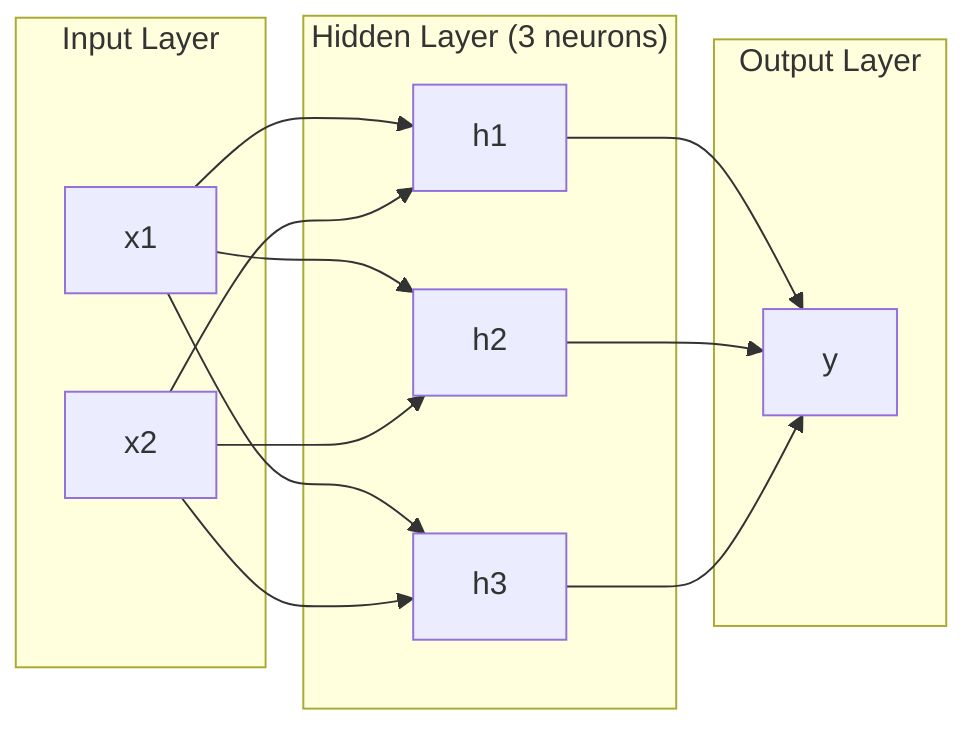
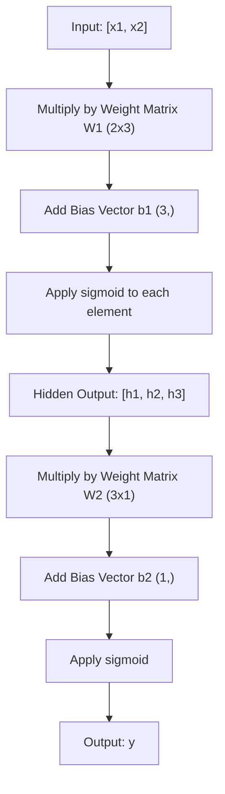
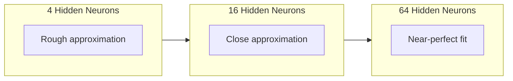

# Многослойные сети и прямой проход

> Один нейрон рисует линию. Сложите их вместе — и вы сможете нарисовать что угодно.

**Тип:** Build
**Языки:** Python
**Предварительные требования:** Фаза 01 (Основы математики), Урок 03.01 (Перцептрон)
**Время:** ~90 минут

## Цели обучения

- Построить многослойную сеть с нуля с классами Layer и Network, выполняющими полный прямой проход
- Отслеживать размерности матриц через каждый слой сети и выявлять несовпадения форм
- Объяснить, как складывание нелинейных активаций позволяет сети выучивать криволинейные границы решений
- Решить задачу XOR с помощью архитектуры 2-2-1 с вручную подобранными сигмоидными весами

## Проблема

Один нейрон умеет рисовать только линии. Одна прямая линия через ваши данные. Любая реальная задача в области ИИ — распознавание изображений, понимание языка, игра в Го — требует кривых. Складывание нейронов в слои — это способ получить кривые.

В 1969 году Минский и Пейперт доказали, что это ограничение фатально: однослойная сеть не может выучить XOR. Не «испытывает трудности» — математически не может. Таблица истинности XOR помещает [0,1] и [1,0] по одну сторону, [0,0] и [1,1] — по другую. Ни одна линия не разделяет их.

Это на десятилетие с лишним остановило финансирование исследований нейронных сетей. Решение, очевидное задним числом: перестать использовать один слой. Складывать нейроны в слои. Пусть первый слой разбивает пространство входов на новые признаки, а второй слой объединяет эти признаки в решения, которые не могла бы дать ни одна отдельная линия.

Этот стек и есть многослойная сеть. Она лежит в основе любой продакшен-модели глубокого обучения сегодня. Прямой проход — данные текут от входа через скрытые слои к выходу — это первое, что нужно построить, прежде чем всё остальное заработает.

## Концепция

### Слои: входной, скрытый, выходной

Многослойная сеть состоит из трёх типов слоёв:

**Входной слой** — на самом деле не слой. Он хранит ваши исходные данные. Два признака означают два входных узла. Никаких вычислений здесь не происходит.

**Скрытые слои** — здесь происходит вся работа. Каждый нейрон принимает все выходы предыдущего слоя, применяет веса и смещение, затем пропускает результат через функцию активации. «Скрытые» — потому что вы никогда не видите эти значения напрямую в обучающих данных.

**Выходной слой** — итоговый ответ. Для бинарной классификации — один нейрон с сигмоидой. Для многоклассовой — по одному нейрону на класс.



Это сеть 2-3-1. Два входа, три скрытых нейрона, один выход. Каждая связь несёт вес. Каждый нейрон (кроме входных) несёт смещение.

Каждый слой производит вектор чисел, называемый скрытым состоянием (hidden state). Для текста скрытые состояния увеличивают размерность — кодируя слово в виде 768 чисел, чтобы захватить семантическое значение. Для изображений они уменьшают размерность — сжимая миллионы пикселей в компактное представление. Именно в скрытом состоянии живёт обучение.

### Нейроны и активации

Каждый нейрон делает три вещи:

1. Умножает каждый вход на соответствующий вес
2. Суммирует все произведения и добавляет смещение
3. Пропускает сумму через функцию активации

Пока что активация — сигмоида:

```
sigmoid(z) = 1 / (1 + e^(-z))
```

Сигмоида сжимает любое число в диапазон (0, 1). Большие положительные входы стремятся к 1. Большие отрицательные входы стремятся к 0. Ноль отображается в 0.5. Именно эта гладкая кривая делает обучение возможным — в отличие от жёсткой ступеньки перцептрона, у сигмоиды везде есть градиент.

### Прямой проход: как текут данные

Прямой проход проталкивает входные данные через сеть, слой за слоем, пока они не достигнут выхода. Во время прямого прохода обучения не происходит. Это чистое вычисление: умножить, сложить, активировать, повторить.



На каждом слое последовательно происходят три операции:

```
z = W * input + b       (linear transformation)
a = sigmoid(z)           (activation)
```

Выход одного слоя становится входом следующего. Это и есть весь прямой проход.

### Размерности матриц

Отслеживание размерностей — самый важный навык отладки в глубоком обучении. Вот сеть 2-3-1:

| Шаг | Операция | Размерности | Форма результата |
|------|-----------|------------|-------------|
| Вход | x | -- | (2,) |
| Линейное преобразование скрытого слоя | W1 * x + b1 | W1: (3, 2), b1: (3,) | (3,) |
| Активация скрытого слоя | sigmoid(z1) | -- | (3,) |
| Линейное преобразование выходного слоя | W2 * h + b2 | W2: (1, 3), b2: (1,) | (1,) |
| Активация выходного слоя | sigmoid(z2) | -- | (1,) |

Правило: матрица весов W на слое k имеет форму (нейроны_слоя_k, нейроны_слоя_k_минус_1). Строки соответствуют текущему слою. Столбцы соответствуют предыдущему слою. Если формы не совпадают, у вас баг.

### Теорема универсальной аппроксимации

В 1989 году Джордж Сайбенко доказал нечто примечательное: нейронная сеть с одним скрытым слоем и достаточным числом нейронов может приблизить любую непрерывную функцию с любой желаемой точностью.

Это не означает, что один скрытый слой всегда лучший выбор. Это означает, что архитектура теоретически способна на это. На практике более глубокие сети (больше слоёв, меньше нейронов на слой) выучивают те же функции с гораздо меньшим общим числом параметров, чем неглубокие широкие сети. Именно поэтому работает глубокое обучение.

Интуиция: каждый нейрон скрытого слоя выучивает один «бугорок» или признак. Достаточное число бугорков, размещённых в нужных местах, может приблизить любую гладкую кривую. Больше нейронов — больше бугорков — лучше аппроксимация.



### Композируемость

Нейронные сети композируемы. Их можно складывать в стек, соединять в цепочку, запускать параллельно. Модель Whisper использует сеть-кодировщик для обработки аудио и отдельную сеть-декодировщик для генерации текста. Современные LLM работают только с декодировщиком. BERT работает только с кодировщиком. T5 — кодировщик-декодировщик. Выбор архитектуры определяет, что модель способна делать.

```figure
mlp-forward
```

## Создаём

Чистый Python. Без numpy. Каждая операция с матрицами написана с нуля.

### Шаг 1: Сигмоидная активация

```python
import math

def sigmoid(x):
    x = max(-500.0, min(500.0, x))
    return 1.0 / (1.0 + math.exp(-x))
```

Ограничение до [-500, 500] предотвращает переполнение. `math.exp(500)` — большое, но конечное число. `math.exp(1000)` — бесконечность.

### Шаг 2: Класс Layer

Самая важная операция во всём глубоком обучении — умножение матриц. Каждый слой, каждая голова внимания, каждый прямой проход — это матричные умножения от начала до конца. Линейный слой принимает входной вектор, умножает его на матрицу весов и добавляет вектор смещения: y = Wx + b. Одно это уравнение — 90% всех вычислений в нейронной сети.

Слой хранит матрицу весов и вектор смещения. Его метод forward принимает входной вектор и возвращает активированный выход.

```python
class Layer:
    def __init__(self, n_inputs, n_neurons, weights=None, biases=None):
        if weights is not None:
            self.weights = weights
        else:
            import random
            self.weights = [
                [random.uniform(-1, 1) for _ in range(n_inputs)]
                for _ in range(n_neurons)
            ]
        if biases is not None:
            self.biases = biases
        else:
            self.biases = [0.0] * n_neurons

    def forward(self, inputs):
        self.last_input = inputs
        self.last_output = []
        for neuron_idx in range(len(self.weights)):
            z = sum(
                w * x for w, x in zip(self.weights[neuron_idx], inputs)
            )
            z += self.biases[neuron_idx]
            self.last_output.append(sigmoid(z))
        return self.last_output
```

Матрица весов имеет форму (n_neurons, n_inputs). Каждая строка — веса одного нейрона по всем входам. Метод forward проходит по нейронам, вычисляет взвешенную сумму плюс смещение, применяет сигмоиду и собирает результаты.

### Шаг 3: Класс Network

Сеть — это список слоёв. Прямой проход соединяет их цепочкой: выход слоя k подаётся на вход слоя k+1.

```python
class Network:
    def __init__(self, layers):
        self.layers = layers

    def forward(self, inputs):
        current = inputs
        for layer in self.layers:
            current = layer.forward(current)
        return current
```

Это весь прямой проход. Четыре строки логики. Данные входят, проходят через каждый слой, выходят с другой стороны.

### Шаг 4: XOR с вручную подобранными весами

В уроке 01 мы решили XOR, комбинируя перцептроны OR, NAND и AND. Теперь сделаем то же самое с нашими классами Layer и Network. Архитектура 2-2-1: два входа, два скрытых нейрона, один выход.

```python
hidden = Layer(
    n_inputs=2,
    n_neurons=2,
    weights=[[20.0, 20.0], [-20.0, -20.0]],
    biases=[-10.0, 30.0],
)

output = Layer(
    n_inputs=2,
    n_neurons=1,
    weights=[[20.0, 20.0]],
    biases=[-30.0],
)

xor_net = Network([hidden, output])

xor_data = [
    ([0, 0], 0),
    ([0, 1], 1),
    ([1, 0], 1),
    ([1, 1], 0),
]

for inputs, expected in xor_data:
    result = xor_net.forward(inputs)
    predicted = 1 if result[0] >= 0.5 else 0
    print(f"  {inputs} -> {result[0]:.6f} (rounded: {predicted}, expected: {expected})")
```

Большие веса (20, -20) заставляют сигмоиду вести себя как ступенчатая функция. Первый скрытый нейрон приближает OR. Второй приближает NAND. Выходной нейрон объединяет их в AND, что и есть XOR.

### Шаг 5: Классификация круга

Более сложная задача: классифицировать 2D-точки как находящиеся внутри или снаружи круга радиусом 0.5 с центром в начале координат. Это требует криволинейной границы решения — невозможной для одного перцептрона.

```python
import random
import math

random.seed(42)

data = []
for _ in range(200):
    x = random.uniform(-1, 1)
    y = random.uniform(-1, 1)
    label = 1 if (x * x + y * y) < 0.25 else 0
    data.append(([x, y], label))

circle_net = Network([
    Layer(n_inputs=2, n_neurons=8),
    Layer(n_inputs=8, n_neurons=1),
])
```

Со случайными весами сеть не будет хорошо классифицировать. Но прямой проход всё равно работает. В этом и суть — прямой проход это просто вычисление. Обучение правильным весам — это обратное распространение ошибки, о котором пойдёт речь в уроке 03.

```python
correct = 0
for inputs, expected in data:
    result = circle_net.forward(inputs)
    predicted = 1 if result[0] >= 0.5 else 0
    if predicted == expected:
        correct += 1

print(f"Accuracy with random weights: {correct}/{len(data)} ({100*correct/len(data):.1f}%)")
```

Случайные веса дают низкую точность — часто хуже, чем угадывание преобладающего класса. После обучения (урок 03) та же архитектура с 8 скрытыми нейронами проведёт криволинейную границу, отделяющую «внутри» от «снаружи».

## Применяем

PyTorch делает всё вышеперечисленное в четырёх строках:

```python
import torch
import torch.nn as nn

model = nn.Sequential(
    nn.Linear(2, 8),
    nn.Sigmoid(),
    nn.Linear(8, 1),
    nn.Sigmoid(),
)

x = torch.tensor([[0.0, 0.0], [0.0, 1.0], [1.0, 0.0], [1.0, 1.0]])
output = model(x)
print(output)
```

`nn.Linear(2, 8)` — это ваш класс Layer: матрица весов формы (8, 2), вектор смещения формы (8,). `nn.Sigmoid()` — это ваша функция sigmoid, применённая поэлементно. `nn.Sequential` — это ваш класс Network: слои, соединённые по порядку.

Разница — в скорости и масштабе. PyTorch работает на GPU, обрабатывает пакеты из миллионов образцов и автоматически вычисляет градиенты для обратного распространения ошибки. Но логика прямого прохода идентична тому, что вы только что построили с нуля.

## Публикуем

Этот урок создаёт переиспользуемый промпт для проектирования архитектур сетей:

- `outputs/prompt-network-architect.md`

Используйте его, когда нужно решить, сколько слоёв, сколько нейронов на слой и какие функции активации использовать для конкретной задачи.

## Упражнения

1. Постройте сеть 2-4-2-1 (два скрытых слоя) и запустите прямой проход на данных XOR со случайными весами. Выведите промежуточные выходы скрытых слоёв, чтобы увидеть, как представление преобразуется на каждом слое.

2. Измените размер скрытого слоя в классификаторе круга с 8 на 2, затем на 32. Каждый раз запускайте прямой проход со случайными весами. Меняет ли число скрытых нейронов диапазон или распределение выхода? Почему?

3. Реализуйте метод `count_parameters` в классе Network, возвращающий общее число обучаемых весов и смещений. Проверьте его на сети 784-256-128-10 (классическая архитектура для MNIST). Сколько у неё параметров?

4. Постройте прямой проход для сети 3-4-4-2. Подайте ей значения цвета RGB (нормализованные к диапазону 0-1) и посмотрите на два выхода. Это архитектура для простого классификатора цвета с двумя классами.

5. Замените sigmoid «ступенчатой функцией с утечкой»: верните 0.01 * z, если z < 0, иначе 1.0. Запустите прямой проход на XOR с теми же вручную подобранными весами из шага 4. Работает ли это по-прежнему? Почему гладкая сигмоида предпочтительнее жёстких пороговых значений?

## Ключевые термины

| Термин | Как обычно говорят | Что это на самом деле означает |
|------|----------------|----------------------|
| Прямой проход | «Запуск модели» | Проталкивание входа через каждый слой — умножение на веса, добавление смещения, активация — для получения выхода |
| Скрытый слой | «Средняя часть» | Любой слой между входом и выходом, значения которого не наблюдаются напрямую в данных |
| Многослойная сеть | «Глубокая нейронная сеть» | Слои нейронов, сложенные последовательно, где выход каждого слоя подаётся на вход следующего |
| Функция активации | «Нелинейность» | Функция, применяемая после линейного преобразования, которая вносит кривизну в границу решения |
| Сигмоида | «S-образная кривая» | sigma(z) = 1/(1+e^(-z)), сжимает любое вещественное число в (0,1), гладкая и всюду дифференцируемая |
| Матрица весов | «Параметры» | Матрица W формы (нейроны_текущего_слоя, нейроны_предыдущего_слоя), содержащая обучаемые силы связей |
| Вектор смещения | «Смещение» | Вектор, добавляемый после матричного умножения, позволяющий нейронам активироваться даже при нулевых входах |
| Универсальная аппроксимация | «Нейросети могут выучить всё» | Один скрытый слой с достаточным числом нейронов может приблизить любую непрерывную функцию — но «достаточное» может означать миллиарды |
| Линейное преобразование | «Шаг матричного умножения» | z = W * x + b, вычисление перед активацией, отображающее входы в новое пространство |
| Граница решения | «Где классификатор переключается» | Поверхность в пространстве входов, где выход сети пересекает порог классификации |

## Дополнительные материалы

- Michael Nielsen, "Neural Networks and Deep Learning", главы 1-2 (http://neuralnetworksanddeeplearning.com/) — самое понятное бесплатное объяснение прямых проходов и структуры сетей с интерактивными визуализациями
- Cybenko, "Approximation by Superpositions of a Sigmoidal Function" (1989) — оригинальная статья с теоремой универсальной аппроксимации, на удивление читаемая
- 3Blue1Brown, "But what is a neural network?" (https://www.youtube.com/watch?v=aircAruvnKk) — 20-минутный наглядный разбор слоёв, весов и прямых проходов, формирующий верную ментальную модель
- Goodfellow, Bengio, Courville, "Deep Learning", глава 6 (https://www.deeplearningbook.org/) — стандартный справочник по многослойным сетям, бесплатно онлайн
