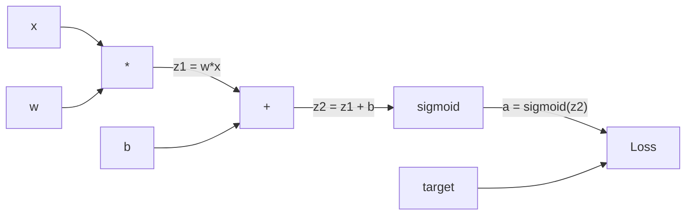
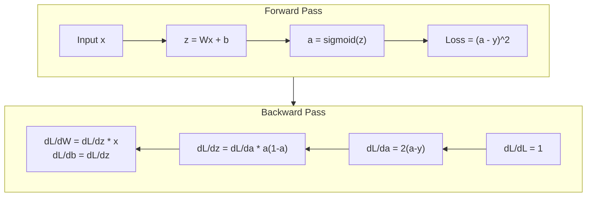
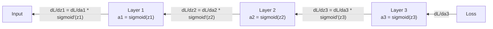

# Обратное распространение ошибки с нуля

> Обратное распространение ошибки — это алгоритм, который делает обучение возможным. Без него нейронные сети были бы просто дорогими генераторами случайных чисел.

**Тип:** Build
**Языки:** Python
**Предварительные требования:** Урок 03.02 (Многослойные сети)
**Время:** ~120 минут

## Цели обучения

- Реализовать autograd-движок на основе Value, который строит граф вычислений и вычисляет градиенты через топологическую сортировку
- Вывести обратный проход для сложения, умножения и сигмоиды с помощью правила цепочки
- Обучить многослойную сеть на XOR и классификации круга, используя только собственный движок обратного распространения ошибки
- Выявить проблему затухающих градиентов в глубоких сигмоидных сетях и объяснить, почему градиенты уменьшаются экспоненциально

## Проблема

У вашей сети один скрытый слой с 768 входами и 3072 выходами. Это 2 359 296 весов. Она сделала неверное предсказание. Какие веса вызвали ошибку? Проверка каждого веса по отдельности означает 2,3 миллиона прямых проходов. Обратное распространение ошибки вычисляет все 2,3 миллиона градиентов за один обратный проход. Это не оптимизация. Это разница между обучаемым и невозможным.

Наивный подход: взять один вес, сдвинуть его на крошечную величину, снова запустить прямой проход, измерить, выросла или снизилась функция потерь. Это даёт градиент для этого веса. Теперь сделайте то же самое для каждого веса в сети. Умножьте на тысячи шагов обучения и миллионы точек данных. Понадобится геологическое время, чтобы обучить что-либо полезное.

Обратное распространение ошибки решает эту проблему. Один прямой проход, один обратный проход, все градиенты вычислены. Хитрость — в правиле цепочки из математического анализа, применённом систематически к графу вычислений. Это алгоритм, который сделал глубокое обучение практически применимым. Без него мы бы всё ещё застряли на игрушечных задачах.

## Концепция

### Правило цепочки, применённое к сетям

Вы видели правило цепочки в Фазе 01, Уроке 05. Краткое напоминание: если y = f(g(x)), то dy/dx = f'(g(x)) * g'(x). Производные вдоль цепочки перемножаются.

В нейронной сети «цепочка» — это последовательность операций от входа к функции потерь. Каждый слой применяет веса, добавляет смещения, пропускает через активацию. Функция потерь сравнивает итоговый выход с целевым значением. Обратное распространение ошибки проходит по этой цепочке в обратном направлении, вычисляя вклад каждой операции в ошибку.

### Графы вычислений

Каждый прямой проход строит граф. Каждый узел — операция (умножение, сложение, сигмоида). Каждое ребро несёт значение вперёд и градиент назад.



Прямой проход: значения текут слева направо. x и w дают z1 = w*x. Добавляем b, получаем z2. Сигмоида даёт активацию a. Сравниваем a с целью y с помощью функции потерь.

Обратный проход: градиенты текут справа налево. Начинаем с dL/da (как потери меняются от активации). Умножаем на da/dz2 (производная сигмоиды). Это даёт dL/dz2. Разделяем на dL/db (которое равно dL/dz2, поскольку z2 = z1 + b) и dL/dz1. Затем dL/dw = dL/dz1 * x и dL/dx = dL/dz1 * w.

У каждого узла графа во время обратного прохода одна задача: взять градиент, пришедший сверху, умножить на свою локальную производную и передать вниз.

### Прямой проход против обратного



Прямой проход сохраняет каждое промежуточное значение: z, a, входы каждого слоя. Обратному проходу эти сохранённые значения нужны для вычисления градиентов. Это компромисс между памятью и вычислениями, лежащий в основе обратного распространения ошибки. Вы обмениваете память (хранение активаций) на скорость (один проход вместо миллионов).

### Поток градиента через сеть

Для трёхслойной сети градиенты проходят цепочкой через каждый слой:



На каждом слое градиент умножается на производную сигмоиды. Производная сигмоиды равна a * (1 - a), которая достигает максимума 0.25 (при a = 0.5). На глубине трёх слоёв градиент был умножен максимум на 0.25^3 = 0.0156. На глубине десяти слоёв: 0.25^10 = 0.000001.

### Затухающие градиенты

Это и есть проблема затухающих градиентов. Сигмоида сжимает свой выход между 0 и 1. Её производная всегда меньше 0.25. Сложите достаточно сигмоидных слоёв, и градиенты уменьшатся до нуля. Ранние слои почти не обучаются, потому что получают близкие к нулю градиенты.

```
sigmoid(z):     Output range [0, 1]
sigmoid'(z):    Max value 0.25 (at z = 0)

After 5 layers:   gradient * 0.25^5 = 0.001x original
After 10 layers:  gradient * 0.25^10 = 0.000001x original
```

Именно поэтому глубокие сигмоидные сети практически невозможно обучить. Решение — ReLU и её варианты — тема урока 04. Пока что важно понять: обратное распространение ошибки работает безупречно. Проблема в том, через что оно работает.

### Вывод градиентов для двухслойной сети

Конкретная математика для сети со входом x, скрытым слоем с сигмоидой, выходным слоем с сигмоидой и MSE-функцией потерь.

Прямой проход:
```
z1 = W1 * x + b1
a1 = sigmoid(z1)
z2 = W2 * a1 + b2
a2 = sigmoid(z2)
L = (a2 - y)^2
```

Обратный проход (применяем правило цепочки шаг за шагом):
```
dL/da2 = 2(a2 - y)
da2/dz2 = a2 * (1 - a2)
dL/dz2 = dL/da2 * da2/dz2 = 2(a2 - y) * a2 * (1 - a2)

dL/dW2 = dL/dz2 * a1
dL/db2 = dL/dz2

dL/da1 = dL/dz2 * W2
da1/dz1 = a1 * (1 - a1)
dL/dz1 = dL/da1 * da1/dz1

dL/dW1 = dL/dz1 * x
dL/db1 = dL/dz1
```

Каждый градиент — произведение локальных производных, прослеженных назад от функции потерь. Это и есть всё обратное распространение ошибки.

```figure
backprop-vanishing
```

## Создаём

### Шаг 1: Узел Value

Каждое число в наших вычислениях становится Value. Он хранит своё значение, свой градиент и то, как он был создан (чтобы знать, как вычислять градиенты в обратном направлении).

```python
class Value:
    def __init__(self, data, children=(), op=''):
        self.data = data
        self.grad = 0.0
        self._backward = lambda: None
        self._children = set(children)
        self._op = op

    def __repr__(self):
        return f"Value(data={self.data:.4f}, grad={self.grad:.4f})"
```

Градиента пока нет (0.0). Обратной функции пока нет (выполняется пустая операция). `_children` отслеживает, какие Value породили этот, чтобы позже можно было топологически отсортировать граф.

### Шаг 2: Операции с обратными функциями

Каждая операция создаёт новый Value и определяет, как через него текут градиенты назад.

```python
def __add__(self, other):
    other = other if isinstance(other, Value) else Value(other)
    out = Value(self.data + other.data, (self, other), '+')

    def _backward():
        self.grad += out.grad
        other.grad += out.grad

    out._backward = _backward
    return out

def __mul__(self, other):
    other = other if isinstance(other, Value) else Value(other)
    out = Value(self.data * other.data, (self, other), '*')

    def _backward():
        self.grad += other.data * out.grad
        other.grad += self.data * out.grad

    out._backward = _backward
    return out
```

Для сложения: d(a+b)/da = 1, d(a+b)/db = 1. Поэтому оба входа получают градиент выхода напрямую.

Для умножения: d(a*b)/da = b, d(a*b)/db = a. Каждый вход получает значение другого, умноженное на градиент выхода.

`+=` здесь критически важен. Value может использоваться в нескольких операциях. Его градиент — это сумма градиентов от всех путей.

### Шаг 3: Сигмоида и функция потерь

```python
import math

def sigmoid(self):
    x = self.data
    x = max(-500, min(500, x))
    s = 1.0 / (1.0 + math.exp(-x))
    out = Value(s, (self,), 'sigmoid')

    def _backward():
        self.grad += (s * (1 - s)) * out.grad

    out._backward = _backward
    return out
```

Производная сигмоиды: sigmoid(x) * (1 - sigmoid(x)). Мы уже вычислили sigmoid(x) = s во время прямого прохода. Переиспользуем это. Никакой лишней работы.

```python
def mse_loss(predicted, target):
    diff = predicted + Value(-target)
    return diff * diff
```

MSE для одного выхода: (predicted - target)^2. Мы выражаем вычитание как сложение с отрицательным Value.

### Шаг 4: Обратный проход

Топологическая сортировка гарантирует, что мы обрабатываем узлы в правильном порядке — градиент узла полностью накоплен, прежде чем мы распространим его дальше.

```python
def backward(self):
    topo = []
    visited = set()

    def build_topo(v):
        if v not in visited:
            visited.add(v)
            for child in v._children:
                build_topo(child)
            topo.append(v)

    build_topo(self)
    self.grad = 1.0
    for v in reversed(topo):
        v._backward()
```

Начинаем с функции потерь (градиент = 1.0, поскольку dL/dL = 1). Проходим назад по отсортированному графу. `_backward` каждого узла проталкивает градиенты его дочерним узлам.

### Шаг 5: Layer и Network

```python
import random

class Neuron:
    def __init__(self, n_inputs):
        scale = (2.0 / n_inputs) ** 0.5
        self.weights = [Value(random.uniform(-scale, scale)) for _ in range(n_inputs)]
        self.bias = Value(0.0)

    def __call__(self, x):
        act = sum((wi * xi for wi, xi in zip(self.weights, x)), self.bias)
        return act.sigmoid()

    def parameters(self):
        return self.weights + [self.bias]


class Layer:
    def __init__(self, n_inputs, n_outputs):
        self.neurons = [Neuron(n_inputs) for _ in range(n_outputs)]

    def __call__(self, x):
        out = [n(x) for n in self.neurons]
        return out[0] if len(out) == 1 else out

    def parameters(self):
        params = []
        for n in self.neurons:
            params.extend(n.parameters())
        return params


class Network:
    def __init__(self, sizes):
        self.layers = []
        for i in range(len(sizes) - 1):
            self.layers.append(Layer(sizes[i], sizes[i + 1]))

    def __call__(self, x):
        for layer in self.layers:
            x = layer(x)
            if not isinstance(x, list):
                x = [x]
        return x[0] if len(x) == 1 else x

    def parameters(self):
        params = []
        for layer in self.layers:
            params.extend(layer.parameters())
        return params

    def zero_grad(self):
        for p in self.parameters():
            p.grad = 0.0
```

Neuron принимает входы, вычисляет взвешенную сумму + смещение и применяет сигмоиду. Инициализация весов масштабируется на sqrt(2/n_inputs), чтобы предотвратить насыщение сигмоиды в более глубоких сетях. Layer — это список Neuron. Network — это список Layer. Метод `parameters()` собирает все обучаемые Value, чтобы мы могли их обновлять.

### Шаг 6: Обучение на XOR

```python
random.seed(42)
net = Network([2, 4, 1])

xor_data = [
    ([0.0, 0.0], 0.0),
    ([0.0, 1.0], 1.0),
    ([1.0, 0.0], 1.0),
    ([1.0, 1.0], 0.0),
]

learning_rate = 1.0

for epoch in range(1000):
    total_loss = Value(0.0)
    for inputs, target in xor_data:
        x = [Value(i) for i in inputs]
        pred = net(x)
        loss = mse_loss(pred, target)
        total_loss = total_loss + loss

    net.zero_grad()
    total_loss.backward()

    for p in net.parameters():
        p.data -= learning_rate * p.grad

    if epoch % 100 == 0:
        print(f"Epoch {epoch:4d} | Loss: {total_loss.data:.6f}")

print("\nXOR Results:")
for inputs, target in xor_data:
    x = [Value(i) for i in inputs]
    pred = net(x)
    print(f"  {inputs} -> {pred.data:.4f} (expected {target})")
```

Смотрите, как убывает потеря. От случайных предсказаний до правильных выходов XOR, полностью движимая обратным распространением ошибки, вычисляющим градиенты и подталкивающим веса в нужную сторону.

### Шаг 7: Классификация круга

В уроке 02 вы вручную подобрали веса для классификации круга. Теперь пусть сеть выучит их сама.

```python
random.seed(7)

def generate_circle_data(n=100):
    data = []
    for _ in range(n):
        x1 = random.uniform(-1.5, 1.5)
        x2 = random.uniform(-1.5, 1.5)
        label = 1.0 if x1 * x1 + x2 * x2 < 1.0 else 0.0
        data.append(([x1, x2], label))
    return data

circle_data = generate_circle_data(80)

circle_net = Network([2, 8, 1])
learning_rate = 0.5

for epoch in range(2000):
    random.shuffle(circle_data)
    total_loss_val = 0.0
    for inputs, target in circle_data:
        x = [Value(i) for i in inputs]
        pred = circle_net(x)
        loss = mse_loss(pred, target)
        circle_net.zero_grad()
        loss.backward()
        for p in circle_net.parameters():
            p.data -= learning_rate * p.grad
        total_loss_val += loss.data

    if epoch % 200 == 0:
        correct = 0
        for inputs, target in circle_data:
            x = [Value(i) for i in inputs]
            pred = circle_net(x)
            predicted_class = 1.0 if pred.data > 0.5 else 0.0
            if predicted_class == target:
                correct += 1
        accuracy = correct / len(circle_data) * 100
        print(f"Epoch {epoch:4d} | Loss: {total_loss_val:.4f} | Accuracy: {accuracy:.1f}%")
```

Мы используем здесь онлайн SGD — обновляем веса после каждого образца вместо накопления по всему пакету. Это быстрее нарушает симметрию и избегает насыщения сигмоиды на всём ландшафте потерь. Перемешивание данных на каждой эпохе не даёт сети запомнить порядок.

Никакой ручной подстройки. Сеть сама обнаруживает круговую границу решения. В этом и есть сила обратного распространения ошибки: вы задаёте архитектуру, функцию потерь и данные. Алгоритм сам находит веса.

## Применяем

PyTorch делает всё вышеперечисленное в нескольких строках. Основная идея идентична — autograd строит граф вычислений во время прямого прохода и проходит его в обратном направлении, чтобы вычислить градиенты.

```python
import torch
import torch.nn as nn

model = nn.Sequential(
    nn.Linear(2, 4),
    nn.Sigmoid(),
    nn.Linear(4, 1),
    nn.Sigmoid(),
)
optimizer = torch.optim.SGD(model.parameters(), lr=1.0)
criterion = nn.MSELoss()

X = torch.tensor([[0,0],[0,1],[1,0],[1,1]], dtype=torch.float32)
y = torch.tensor([[0],[1],[1],[0]], dtype=torch.float32)

for epoch in range(1000):
    pred = model(X)
    loss = criterion(pred, y)
    optimizer.zero_grad()
    loss.backward()
    optimizer.step()

print("PyTorch XOR Results:")
with torch.no_grad():
    for i in range(4):
        pred = model(X[i])
        print(f"  {X[i].tolist()} -> {pred.item():.4f} (expected {y[i].item()})")
```

`loss.backward()` — это ваш `total_loss.backward()`. `optimizer.step()` — это ваше ручное `p.data -= lr * p.grad`. `optimizer.zero_grad()` — это ваш `net.zero_grad()`. Тот же алгоритм, промышленная реализация. PyTorch обрабатывает ускорение на GPU, вычисления со смешанной точностью, контрольные точки градиентов и сотни типов слоёв. Но обратный проход — это то же самое правило цепочки, применённое к тому же графу вычислений.

Обучение запускает прямой проход, затем обратный проход, затем обновляет веса. Инференс запускает только прямой проход. Без градиентов, без обновлений. Это различие важно, потому что именно инференс происходит в продакшене. Когда вы вызываете API вроде Claude или GPT, вы запускаете инференс — ваш промпт течёт вперёд через сеть, а на выходе появляются токены. Веса не меняются. Понимание обратного распространения ошибки важно, потому что именно оно сформировало каждый вес в этой сети.

## Публикуем

Этот урок создаёт:
- `outputs/prompt-gradient-debugger.md` — переиспользуемый промпт для диагностики проблем с градиентами (затухание, взрыв, NaN) в любой нейронной сети

## Упражнения

1. Добавьте метод `__sub__` в класс Value (a - b = a + (-1 * b)). Затем реализуйте метод `__neg__`. Проверьте корректность градиентов, сравнив их с ручным вычислением для простого выражения вроде (a - b)^2.

2. Добавьте метод `relu` в Value (выход max(0, x), производная равна 1, если x > 0, иначе 0). Замените sigmoid на relu в скрытых слоях и снова обучите сеть на XOR. Сравните скорость сходимости. Вы должны увидеть более быстрое обучение — это предвосхищает урок 04.

3. Реализуйте метод `__pow__` в Value для целых степеней. Используйте его, чтобы заменить `mse_loss` на полноценное выражение `(predicted - target) ** 2`. Проверьте, что градиенты совпадают с исходной реализацией.

4. Добавьте отсечение градиентов (gradient clipping) в цикл обучения: после вызова `backward()` отсеките все градиенты до диапазона [-1, 1]. Обучите более глубокую сеть (4+ слоя с sigmoid) и сравните кривые потерь с отсечением и без него. Это ваша первая защита от взрывающихся градиентов.

5. Постройте визуализацию: после обучения на XOR выведите градиент каждого параметра сети. Определите, у какого слоя градиенты наименьшие. Это демонстрирует проблему затухающих градиентов, о которой вы читали в разделе «Концепция».

## Ключевые термины

| Термин | Как обычно говорят | Что это означает на самом деле |
|------|----------------|----------------------|
| Обратное распространение ошибки | «Сеть учится» | Алгоритм, который вычисляет dL/dw для каждого веса, применяя правило цепочки в обратном направлении по графу вычислений |
| Граф вычислений | «Структура сети» | Ориентированный ациклический граф, где узлы — операции, а рёбра несут значения (вперёд) и градиенты (назад) |
| Правило цепочки | «Перемножить производные» | Если y = f(g(x)), то dy/dx = f'(g(x)) * g'(x) — математическая основа обратного распространения ошибки |
| Градиент | «Направление наискорейшего подъёма» | Частная производная функции потерь по параметру — показывает, как изменить этот параметр, чтобы уменьшить потери |
| Затухающий градиент | «Глубокие сети не учатся» | Градиенты экспоненциально уменьшаются по мере распространения через слои с насыщающимися активациями вроде sigmoid |
| Прямой проход | «Запуск сети» | Вычисление выхода из входов путём последовательного применения операций каждого слоя и сохранения промежуточных значений |
| Обратный проход | «Вычисление градиентов» | Обход графа вычислений в обратном направлении с накоплением градиентов в каждом узле по правилу цепочки |
| Скорость обучения | «Насколько быстро она учится» | Скаляр, управляющий размером шага при обновлении весов: w_new = w_old - lr * gradient |
| Топологическая сортировка | «Правильный порядок» | Упорядочивание узлов графа, при котором каждый узел идёт после всех узлов, от которых он зависит — гарантирует, что градиенты полностью накоплены перед распространением |
| Автоматическое дифференцирование | «Автоматическое дифференцирование» | Система, строящая графы вычислений во время прямого вычисления и автоматически вычисляющая градиенты — то, что делает движок PyTorch |

## Дополнительные материалы

- Rumelhart, Hinton & Williams, "Learning representations by back-propagating errors" (1986) — статья, сделавшая обратное распространение ошибки массовым и открывшая возможность обучения многослойных сетей
- Цикл 3Blue1Brown "Neural Networks" (https://www.youtube.com/playlist?list=PLZHQObOWTQDNU6R1_67000Dx_ZCJB-3pi) — лучшее наглядное объяснение обратного распространения ошибки и потока градиентов через сети
