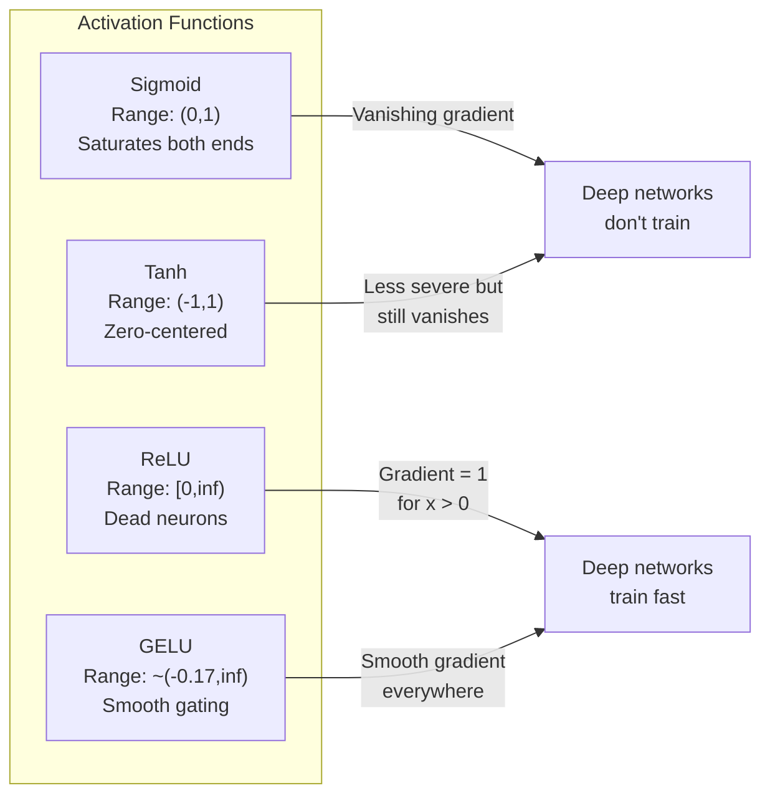
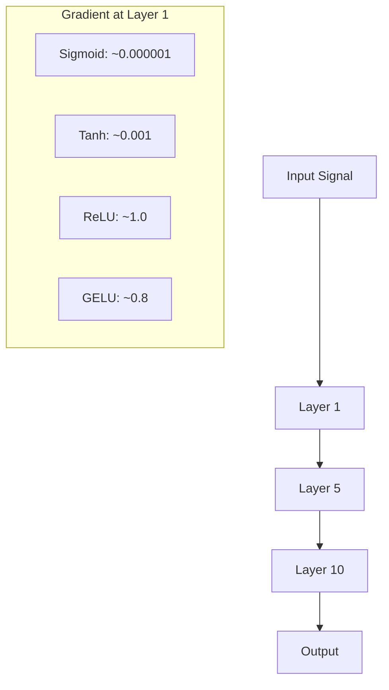
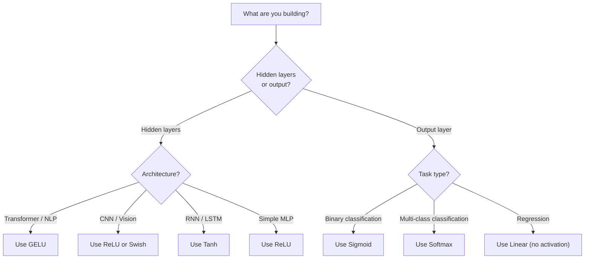

# Функции активации

> Без нелинейности ваша 100-слойная сеть — это всего лишь навороченное умножение матриц. Активации — это врата, которые позволяют нейронным сетям мыслить кривыми.

**Тип:** Build
**Языки:** Python
**Предварительные требования:** Урок 03.03 (Обратное распространение ошибки)
**Время:** ~75 минут

## Цели обучения

- Реализовать с нуля сигмоиду, tanh, ReLU, Leaky ReLU, GELU, Swish и softmax вместе с их производными
- Диагностировать проблему затухающего градиента, измеряя величину активаций на протяжении 10+ слоёв с разными активациями
- Обнаружить мёртвые нейроны в сети с ReLU и объяснить, почему GELU избегает этого режима отказа
- Выбрать правильную функцию активации для заданной архитектуры (трансформер, CNN, RNN, выходной слой)

## Проблема

Сложите два линейных преобразования: y = W2(W1x + b1) + b2. Раскройте: y = W2W1x + W2b1 + b2. Это просто y = Ax + c — одно линейное преобразование. Сколько бы линейных слоёв вы ни складывали, результат схлопывается в одно умножение матриц. Ваша 100-слойная сеть обладает той же репрезентативной мощностью, что и один слой.

Это не теоретическая курьёзность. Это означает, что глубокая линейная сеть буквально не может выучить XOR, не может классифицировать спиральный набор данных, не может распознать лицо. Без функций активации глубина — иллюзия.

Функции активации разрушают линейность. Они искажают выход каждого слоя через нелинейную функцию, давая сети возможность изгибать границы решений, аппроксимировать произвольные функции и по-настоящему обучаться. Но выберите неправильную активацию — и ваши градиенты затухнут до нуля (сигмоида в глубоких сетях), взорвутся до бесконечности (неограниченные активации без аккуратной инициализации) или ваши нейроны навсегда умрут (ReLU с большими отрицательными смещениями). Выбор функции активации напрямую определяет, будет ли ваша сеть вообще обучаться.

## Концепция

### Почему нелинейность необходима

Умножение матриц композируемо. Умножение вектора на матрицу A, а затем на матрицу B идентично умножению на AB. Это означает, что складывание десяти линейных слоёв математически эквивалентно одному линейному слою с одной большой матрицей. Все эти параметры, вся эта глубина — потрачены впустую. Нужно что-то, что разорвёт эту цепочку. Именно это делают функции активации.

Вот доказательство. Линейный слой вычисляет f(x) = Wx + b. Сложим два:

```
Layer 1: h = W1 * x + b1
Layer 2: y = W2 * h + b2
```

Подставим:

```
y = W2 * (W1 * x + b1) + b2
y = (W2 * W1) * x + (W2 * b1 + b2)
y = A * x + c
```

Один слой. Вставим нелинейную активацию g() между слоями:

```
h = g(W1 * x + b1)
y = W2 * h + b2
```

Теперь подстановка не работает. W2 * g(W1 * x + b1) + b2 нельзя свести к одному линейному преобразованию. Сеть может представлять нелинейные функции. Каждый дополнительный слой с активацией добавляет репрезентативную мощность.

### Сигмоида

Первая функция активации, использовавшаяся в нейронных сетях.

```
sigmoid(x) = 1 / (1 + e^(-x))
```

Диапазон значений: (0, 1). Гладкая, дифференцируемая, отображает любое вещественное число в значение, похожее на вероятность.

Производная:

```
sigmoid'(x) = sigmoid(x) * (1 - sigmoid(x))
```

Максимальное значение этой производной равно 0.25 и достигается при x = 0. При обратном распространении ошибки градиенты перемножаются через слои. Десять слоёв сигмоиды означают, что градиент умножается максимум на 0.25 десять раз:

```
0.25^10 = 0.000000953674
```

Меньше одной миллионной от исходного сигнала. Это и есть проблема затухающего градиента. Градиенты в ранних слоях становятся настолько малыми, что веса почти не обновляются. Кажется, что сеть учится — потери снижаются в поздних слоях, — но первые слои заморожены. Глубокие сигмоидные сети попросту не обучаются.

Дополнительная проблема: выходы сигмоиды всегда положительны (от 0 до 1), а значит градиенты весов всегда имеют один и тот же знак. Это вызывает зигзагообразное движение во время градиентного спуска.

### Tanh

Центрированная версия сигмоиды.

```
tanh(x) = (e^x - e^(-x)) / (e^x + e^(-x))
```

Диапазон значений: (-1, 1). Центрирована относительно нуля, что устраняет проблему зигзагов.

Производная:

```
tanh'(x) = 1 - tanh(x)^2
```

Максимум производной равен 1.0 при x = 0 — в четыре раза лучше, чем у сигмоиды. Но проблема затухающего градиента всё равно существует. При больших положительных или отрицательных входах производная стремится к нулю. Десять слоёв всё ещё подавляют градиент, просто менее агрессивно.

### ReLU: прорыв

Rectified Linear Unit (выпрямленный линейный элемент). Популяризирована для глубокого обучения Наиром и Хинтоном в 2010 году (сама функция восходит к работе Фукусимы 1969 года), она изменила всё.

```
relu(x) = max(0, x)
```

Диапазон значений: [0, infinity). Производная тривиально проста:

```
relu'(x) = 1  if x > 0
            0  if x <= 0
```

Нет затухающего градиента для положительных входов. Градиент равен ровно 1 и передаётся напрямую. Именно поэтому глубокие сети стали обучаемыми — ReLU сохраняет величину градиента при прохождении через слои.

Но есть режим отказа: проблема мёртвых нейронов. Если взвешенный вход нейрона всегда отрицателен (из-за большого отрицательного смещения или неудачной инициализации весов), его выход всегда равен нулю, его градиент всегда равен нулю, и он никогда не обновляется. Он навсегда мёртв. На практике 10–40% нейронов в сети с ReLU могут погибнуть во время обучения.

### Leaky ReLU

Простейшее решение проблемы мёртвых нейронов.

```
leaky_relu(x) = x        if x > 0
                alpha * x if x <= 0
```

Где alpha — небольшая константа, обычно 0.01. Отрицательная сторона имеет небольшой наклон вместо нуля, поэтому мёртвые нейроны всё же получают сигнал градиента и могут восстановиться.

### GELU: современный выбор по умолчанию

Gaussian Error Linear Unit (GELU) — функция активации, основанная на функции распределения стандартного нормального распределения. Представлена Хендриксом и Гимпелем в 2016 году. Активация по умолчанию в BERT, GPT и большинстве современных трансформеров.

```
gelu(x) = x * Phi(x)
```

Где Phi(x) — функция распределения стандартного нормального распределения. Приближение, используемое на практике:

```
gelu(x) ~= 0.5 * x * (1 + tanh(sqrt(2/pi) * (x + 0.044715 * x^3)))
```

GELU гладкая везде, допускает небольшие отрицательные значения (в отличие от ReLU, которая жёстко обрезает до нуля), и имеет вероятностную интерпретацию: она взвешивает каждый вход по тому, насколько вероятно, что он положителен согласно гауссовому распределению. Такое плавное гейтирование превосходит ReLU в архитектурах трансформеров, потому что обеспечивает лучший поток градиента и полностью избегает проблемы мёртвых нейронов.

### Swish / SiLU

Функция активации с самогейтированием, обнаруженная Рамачандраном и соавторами в 2017 году с помощью автоматизированного поиска.

```
swish(x) = x * sigmoid(x)
```

Формально Swish — это x * sigmoid(x). Google обнаружила её с помощью автоматизированного поиска в пространстве функций активации — нейронная сеть проектирует части нейронных сетей.

Как и GELU, она гладкая, немонотонная и допускает небольшие отрицательные значения. Разница тонкая: Swish использует сигмоиду для гейтирования, а GELU — функцию распределения Гаусса. На практике производительность почти идентична. Swish используется в EfficientNet и некоторых моделях компьютерного зрения. GELU доминирует в языковых моделях.

### Softmax: активация выходного слоя

Не используется в скрытых слоях. Softmax преобразует вектор необработанных оценок (логитов) в распределение вероятностей.

```
softmax(x_i) = e^(x_i) / sum(e^(x_j) for all j)
```

Каждый выход лежит между 0 и 1. Сумма всех выходов равна 1. Это делает её стандартной финальной активацией для многоклассовой классификации. Наибольший логит получает наибольшую вероятность, но, в отличие от argmax, softmax дифференцируема и сохраняет информацию об относительной уверенности.

### Сравнение форм



### Сравнение потока градиента



### Какую активацию когда использовать



```figure
softmax-temperature
```

## Создаём

### Шаг 1: реализуем все функции активации с производными

Каждая функция принимает одно число с плавающей точкой и возвращает число с плавающей точкой. Каждая функция производной принимает тот же вход и возвращает градиент.

```python
import math

def sigmoid(x):
    x = max(-500, min(500, x))
    return 1.0 / (1.0 + math.exp(-x))

def sigmoid_derivative(x):
    s = sigmoid(x)
    return s * (1 - s)

def tanh_act(x):
    return math.tanh(x)

def tanh_derivative(x):
    t = math.tanh(x)
    return 1 - t * t

def relu(x):
    return max(0.0, x)

def relu_derivative(x):
    return 1.0 if x > 0 else 0.0

def leaky_relu(x, alpha=0.01):
    return x if x > 0 else alpha * x

def leaky_relu_derivative(x, alpha=0.01):
    return 1.0 if x > 0 else alpha

def gelu(x):
    return 0.5 * x * (1 + math.tanh(math.sqrt(2 / math.pi) * (x + 0.044715 * x ** 3)))

def gelu_derivative(x):
    phi = 0.5 * (1 + math.erf(x / math.sqrt(2)))
    pdf = math.exp(-0.5 * x * x) / math.sqrt(2 * math.pi)
    return phi + x * pdf

def swish(x):
    return x * sigmoid(x)

def swish_derivative(x):
    s = sigmoid(x)
    return s + x * s * (1 - s)

def softmax(xs):
    max_x = max(xs)
    exps = [math.exp(x - max_x) for x in xs]
    total = sum(exps)
    return [e / total for e in exps]
```

### Шаг 2: визуализируем, где градиенты умирают

Вычислите градиент в 100 равномерно распределённых точках от -5 до 5. Выведите текстовую гистограмму, показывающую, где градиент каждой активации близок к нулю.

```python
def gradient_scan(name, derivative_fn, start=-5, end=5, n=100):
    step = (end - start) / n
    near_zero = 0
    healthy = 0
    for i in range(n):
        x = start + i * step
        g = derivative_fn(x)
        if abs(g) < 0.01:
            near_zero += 1
        else:
            healthy += 1
    pct_dead = near_zero / n * 100
    print(f"{name:15s}: {healthy:3d} healthy, {near_zero:3d} near-zero ({pct_dead:.0f}% dead zone)")

gradient_scan("Sigmoid", sigmoid_derivative)
gradient_scan("Tanh", tanh_derivative)
gradient_scan("ReLU", relu_derivative)
gradient_scan("Leaky ReLU", leaky_relu_derivative)
gradient_scan("GELU", gelu_derivative)
gradient_scan("Swish", swish_derivative)
```

### Шаг 3: эксперимент с затухающим градиентом

Пропустите сигнал через N слоёв прямым проходом, используя сигмоиду и ReLU. Измерьте, как меняется величина активации.

```python
import random

def vanishing_gradient_experiment(activation_fn, name, n_layers=10, n_inputs=5):
    random.seed(42)
    values = [random.gauss(0, 1) for _ in range(n_inputs)]

    print(f"\n{name} through {n_layers} layers:")
    for layer in range(n_layers):
        weights = [random.gauss(0, 1) for _ in range(n_inputs)]
        z = sum(w * v for w, v in zip(weights, values))
        activated = activation_fn(z)
        magnitude = abs(activated)
        bar = "#" * int(magnitude * 20)
        print(f"  Layer {layer+1:2d}: magnitude = {magnitude:.6f} {bar}")
        values = [activated] * n_inputs

vanishing_gradient_experiment(sigmoid, "Sigmoid")
vanishing_gradient_experiment(relu, "ReLU")
vanishing_gradient_experiment(gelu, "GELU")
```

### Шаг 4: детектор мёртвых нейронов

Создайте сеть с ReLU, пропустите через неё случайные входы, посчитайте, сколько нейронов никогда не активируется.

```python
def dead_neuron_detector(n_inputs=5, hidden_size=20, n_samples=1000):
    random.seed(0)
    weights = [[random.gauss(0, 1) for _ in range(n_inputs)] for _ in range(hidden_size)]
    biases = [random.gauss(0, 1) for _ in range(hidden_size)]

    fire_counts = [0] * hidden_size

    for _ in range(n_samples):
        inputs = [random.gauss(0, 1) for _ in range(n_inputs)]
        for neuron_idx in range(hidden_size):
            z = sum(w * x for w, x in zip(weights[neuron_idx], inputs)) + biases[neuron_idx]
            if relu(z) > 0:
                fire_counts[neuron_idx] += 1

    dead = sum(1 for c in fire_counts if c == 0)
    rarely_fire = sum(1 for c in fire_counts if 0 < c < n_samples * 0.05)
    healthy = hidden_size - dead - rarely_fire

    print(f"\nDead Neuron Report ({hidden_size} neurons, {n_samples} samples):")
    print(f"  Dead (never fired):     {dead}")
    print(f"  Barely alive (<5%):     {rarely_fire}")
    print(f"  Healthy:                {healthy}")
    print(f"  Dead neuron rate:       {dead/hidden_size*100:.1f}%")

    for i, c in enumerate(fire_counts):
        status = "DEAD" if c == 0 else "WEAK" if c < n_samples * 0.05 else "OK"
        bar = "#" * (c * 40 // n_samples)
        print(f"  Neuron {i:2d}: {c:4d}/{n_samples} fires [{status:4s}] {bar}")

dead_neuron_detector()
```

### Шаг 5: сравнение обучения — сигмоида против ReLU против GELU

Обучите одну и ту же двухслойную сеть на наборе данных «круг» (точки внутри круга — класс 1, снаружи — класс 0) с тремя разными активациями. Сравните скорость сходимости.

```python
def make_circle_data(n=200, seed=42):
    random.seed(seed)
    data = []
    for _ in range(n):
        x = random.uniform(-2, 2)
        y = random.uniform(-2, 2)
        label = 1.0 if x * x + y * y < 1.5 else 0.0
        data.append(([x, y], label))
    return data


class ActivationNetwork:
    def __init__(self, activation_fn, activation_deriv, hidden_size=8, lr=0.1):
        random.seed(0)
        self.act = activation_fn
        self.act_d = activation_deriv
        self.lr = lr
        self.hidden_size = hidden_size

        self.w1 = [[random.gauss(0, 0.5) for _ in range(2)] for _ in range(hidden_size)]
        self.b1 = [0.0] * hidden_size
        self.w2 = [random.gauss(0, 0.5) for _ in range(hidden_size)]
        self.b2 = 0.0

    def forward(self, x):
        self.x = x
        self.z1 = []
        self.h = []
        for i in range(self.hidden_size):
            z = self.w1[i][0] * x[0] + self.w1[i][1] * x[1] + self.b1[i]
            self.z1.append(z)
            self.h.append(self.act(z))

        self.z2 = sum(self.w2[i] * self.h[i] for i in range(self.hidden_size)) + self.b2
        self.out = sigmoid(self.z2)
        return self.out

    def backward(self, target):
        error = self.out - target
        d_out = error * self.out * (1 - self.out)

        for i in range(self.hidden_size):
            d_h = d_out * self.w2[i] * self.act_d(self.z1[i])
            self.w2[i] -= self.lr * d_out * self.h[i]
            for j in range(2):
                self.w1[i][j] -= self.lr * d_h * self.x[j]
            self.b1[i] -= self.lr * d_h
        self.b2 -= self.lr * d_out

    def train(self, data, epochs=200):
        losses = []
        for epoch in range(epochs):
            total_loss = 0
            correct = 0
            for x, y in data:
                pred = self.forward(x)
                self.backward(y)
                total_loss += (pred - y) ** 2
                if (pred >= 0.5) == (y >= 0.5):
                    correct += 1
            avg_loss = total_loss / len(data)
            accuracy = correct / len(data) * 100
            losses.append(avg_loss)
            if epoch % 50 == 0 or epoch == epochs - 1:
                print(f"    Epoch {epoch:3d}: loss={avg_loss:.4f}, accuracy={accuracy:.1f}%")
        return losses


data = make_circle_data()

configs = [
    ("Sigmoid", sigmoid, sigmoid_derivative),
    ("ReLU", relu, relu_derivative),
    ("GELU", gelu, gelu_derivative),
]

results = {}
for name, act_fn, act_d_fn in configs:
    print(f"\n=== Training with {name} ===")
    net = ActivationNetwork(act_fn, act_d_fn, hidden_size=8, lr=0.1)
    losses = net.train(data, epochs=200)
    results[name] = losses

print("\n=== Final Loss Comparison ===")
for name, losses in results.items():
    print(f"  {name:10s}: start={losses[0]:.4f} -> end={losses[-1]:.4f} (improvement: {(1 - losses[-1]/losses[0])*100:.1f}%)")
```

## Применяем

PyTorch предоставляет все эти функции как в функциональной форме, так и в виде модулей:

```python
import torch
import torch.nn as nn
import torch.nn.functional as F

x = torch.randn(4, 10)

relu_out = F.relu(x)
gelu_out = F.gelu(x)
sigmoid_out = torch.sigmoid(x)
swish_out = F.silu(x)

logits = torch.randn(4, 5)
probs = F.softmax(logits, dim=1)

model = nn.Sequential(
    nn.Linear(10, 64),
    nn.GELU(),
    nn.Linear(64, 32),
    nn.GELU(),
    nn.Linear(32, 5),
)
```

Скрытые слои в трансформере: GELU. Скрытые слои в CNN: ReLU. Выходной слой для классификации: softmax. Выходной слой для регрессии: никакой (линейный). Выходной слой для вероятностей: сигмоида. Вот и всё. Начинайте с этих значений по умолчанию. Меняйте их только тогда, когда у вас есть доказательства.

RNN и LSTM используют tanh для скрытого состояния и сигмоиду для вентилей, но если вы строите что-то с нуля сегодня, вы, вероятно, не используете RNN. Если нейроны умирают в вашей сети с ReLU, переключитесь на GELU. Не тянитесь к Leaky ReLU без конкретной причины — GELU решает проблему мёртвых нейронов и даёт лучший поток градиента.

## Публикуем

Этот урок создаёт:
- `outputs/prompt-activation-selector.md` — переиспользуемый промпт, который помогает выбрать правильную функцию активации для любой архитектуры

## Упражнения

1. Реализуйте Parametric ReLU (PReLU), где отрицательный наклон alpha — обучаемый параметр. Обучите её на наборе данных «круг» и сравните с фиксированным Leaky ReLU.

2. Запустите эксперимент с затухающим градиентом на 50 слоях вместо 10. Постройте график величины на каждом слое для сигмоиды, tanh, ReLU и GELU. На каком слое сигнал каждой активации фактически достигает нуля?

3. Реализуйте ELU (Exponential Linear Unit): elu(x) = x if x > 0, alpha * (e^x - 1) if x <= 0. Сравните её долю мёртвых нейронов с ReLU на той же сети.

4. Постройте «монитор здоровья градиента», работающий во время обучения: на каждой эпохе вычисляйте среднюю величину градиента на каждом слое. Выводите предупреждение, когда градиент любого слоя опускается ниже 0.001 или превышает 100.

5. Измените сравнение обучения так, чтобы использовать набор данных XOR из Урока 01 вместо кругов. Какая активация сходится быстрее всего на XOR? Почему это отличается от результатов на круге?

## Ключевые термины

| Термин | Как обычно говорят | Что это означает на самом деле |
|--------|--------------------|-------------------------------|
| Функция активации | «Нелинейная часть» | Функция, применяемая к выходу каждого нейрона, которая разрушает линейность и позволяет сети обучаться нелинейным отображениям |
| Затухающий градиент | «Градиенты исчезают в глубоких сетях» | Градиенты уменьшаются экспоненциально при прохождении через слои, когда производная активации меньше 1, что делает ранние слои необучаемыми |
| Взрывающийся градиент | «Градиенты взрываются» | Градиенты растут экспоненциально при прохождении через слои, когда эффективный множитель превышает 1, что вызывает нестабильное обучение |
| Мёртвый нейрон | «Нейрон, который перестал учиться» | ReLU-нейрон, вход которого навсегда отрицателен, из-за чего он даёт нулевой выход и нулевой градиент |
| Сигмоида | «Сжимает значения в диапазон 0–1» | Логистическая функция 1/(1+e^-x), исторически важная, но вызывающая затухающие градиенты в глубоких сетях |
| ReLU | «Обрезает отрицательные значения до нуля» | max(0, x) — активация, которая сделала глубокое обучение практически применимым, сохраняя величину градиента |
| GELU | «Активация трансформеров» | Gaussian Error Linear Unit (GELU) — гладкая функция активации, взвешивающая входы по вероятности того, что они положительны |
| Swish/SiLU | «ReLU с самогейтированием» | x * sigmoid(x) — активация, обнаруженная с помощью автоматизированного поиска и используемая в EfficientNet |
| Softmax | «Превращает оценки в вероятности» | Нормализует вектор логитов в распределение вероятностей, где все значения лежат в (0,1) и в сумме дают 1 |
| Leaky ReLU | «ReLU, который не умирает» | max(alpha*x, x), где alpha мало (0.01), что предотвращает гибель нейронов, допуская небольшие отрицательные градиенты |
| Насыщение | «Плоская часть сигмоиды» | Области, где производная активации приближается к нулю, блокируя поток градиента |
| Логит | «Необработанная оценка перед softmax» | Ненормализованный выход последнего слоя перед применением softmax или сигмоиды |

## Дополнительные материалы

- Nair & Hinton, «Rectified Linear Units Improve Restricted Boltzmann Machines» (2010) — статья, представившая ReLU и сделавшая возможным обучение глубоких сетей
- Hendrycks & Gimpel, «Gaussian Error Linear Units (GELUs)» (2016) — представили функцию активации, ставшую стандартом для трансформеров
- Ramachandran et al., «Searching for Activation Functions» (2017) — с помощью автоматизированного поиска обнаружили Swish, показав, что проектирование активаций можно автоматизировать
- Glorot & Bengio, «Understanding the difficulty of training deep feedforward neural networks» (2010) — статья, диагностировавшая затухающие/взрывающиеся градиенты и предложившая инициализацию Ксавье
- Goodfellow, Bengio, Courville, «Deep Learning», глава 6.3 (https://www.deeplearningbook.org/) — строгое рассмотрение скрытых элементов и функций активации
