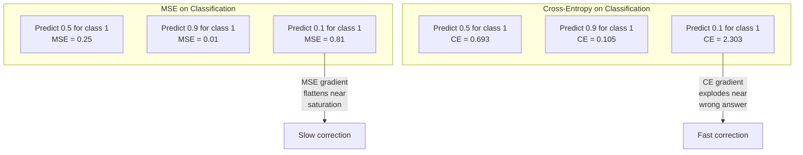
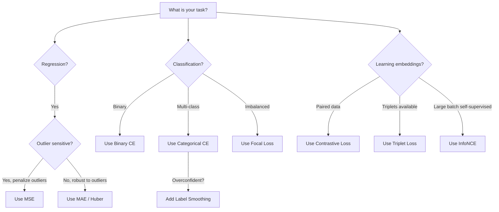
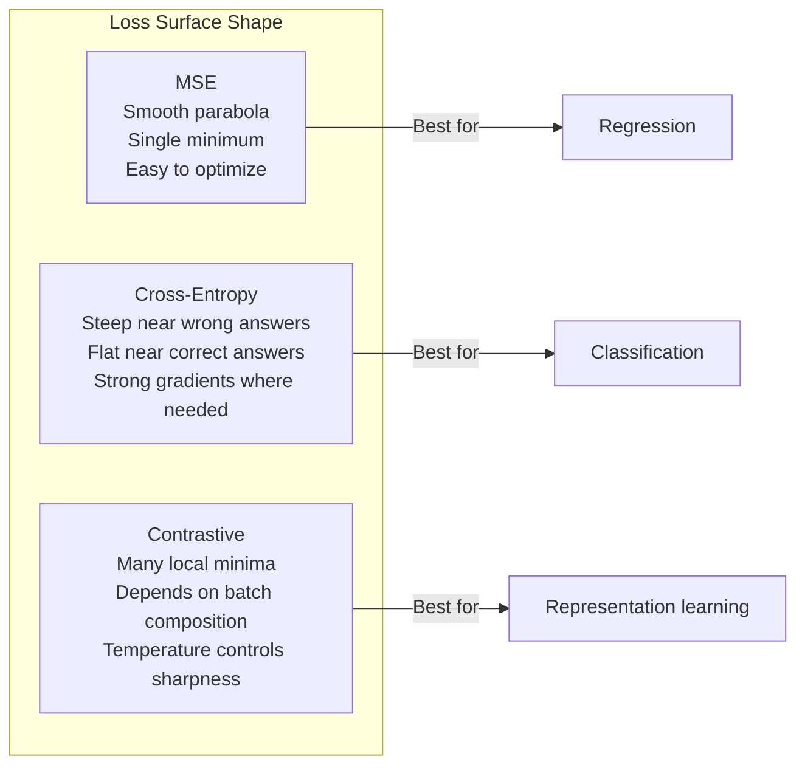

# Функции потерь

> Ваша сеть делает предсказание. Истинное значение говорит иное. Насколько сильно она ошиблась? Это число и есть потери. Выберите не ту функцию потерь — и ваша модель будет оптимизировать совсем не то, что нужно.

**Тип:** Build
**Языки:** Python
**Предварительные требования:** Урок 03.04 (Функции активации)
**Время:** ~75 минут

## Цели обучения

- Реализовать с нуля MSE, бинарную кросс-энтропию, категориальную кросс-энтропию и контрастивную функцию потерь (InfoNCE) вместе с их градиентами
- Объяснить, почему MSE не подходит для классификации, продемонстрировав режим отказа «предсказывать 0.5 для всего»
- Применить сглаживание меток к кросс-энтропии и описать, как оно предотвращает чрезмерно уверенные предсказания
- Выбрать правильную функцию потерь для регрессии, бинарной классификации, многоклассовой классификации и задач, в которых обучается векторное представление (эмбеддинг)

## Проблема

Модель, минимизирующая MSE на задаче классификации, будет уверенно предсказывать 0.5 для всего. Она минимизирует потери. Она же совершенно бесполезна.

Функция потерь — единственное, что ваша модель на самом деле оптимизирует. Не точность (accuracy). Не F1-метрику. Не что бы то ни было ещё, что вы докладываете руководителю. Оптимизатор берёт градиент функции потерь и подстраивает веса так, чтобы уменьшить это число. Если функция потерь не отражает то, что вам важно, модель найдёт математически самый дешёвый способ её удовлетворить, и этот способ почти никогда не будет тем, что вы хотели.

Вот конкретный пример. У вас задача бинарной классификации. Два класса, разделение 50/50. Вы используете MSE в качестве функции потерь. Модель предсказывает 0.5 для абсолютно каждого входа. Среднее значение MSE равно 0.25 — это минимально возможное значение без реального обучения чему-либо. У модели нулевая различающая способность, но она технически минимизировала вашу функцию потерь. Переключитесь на кросс-энтропию, и та же модель будет вынуждена подталкивать предсказания к 0 или 1, потому что -log(0.5) = 0.693 — это ужасное значение потерь, тогда как -log(0.99) = 0.01 вознаграждает уверенные правильные предсказания. Выбор функции потерь — это разница между моделью, которая обучается, и моделью, которая обманывает метрику.

Дальше — хуже. В обучении с самоконтролем (self-supervised learning) у вас вообще нет меток. Контрастивная функция потерь целиком определяет обучающий сигнал: что считается похожим, что считается разным и насколько сильно модель должна их разводить. Ошибитесь с контрастивной функцией потерь — и ваши эмбеддинги схлопнутся в одну точку: каждый вход отображается в один и тот же вектор. Технически нулевые потери. Полностью бесполезно.

## Концепция

### Среднеквадратичная ошибка (MSE)

Стандарт для регрессии. Вычислите квадрат разности между предсказанием и целью, усредните по всем образцам.

```
MSE = (1/n) * sum((y_pred - y_true)^2)
```

Почему важно возведение в квадрат: оно штрафует крупные ошибки квадратично. Ошибка в 2 стоит в 4 раза дороже, чем ошибка в 1. Ошибка в 10 стоит в 100 раз дороже. Это делает MSE чувствительной к выбросам — одно катастрофически неверное предсказание доминирует в потерях.

Конкретные числа: если ваша модель предсказывает цены на жильё и ошибается на $10,000 для большинства домов, но на $200,000 для одного особняка, MSE будет агрессивно пытаться исправить именно этот особняк, потенциально ухудшая качество для остальных 99 домов.

Градиент MSE по предсказанию:

```
dMSE/dy_pred = (2/n) * (y_pred - y_true)
```

Линеен по ошибке. Большие ошибки получают большие градиенты. Это достоинство для регрессии (крупные ошибки требуют крупных поправок) и недостаток для классификации (вы хотите штрафовать уверенные неверные ответы экспоненциально, а не линейно).

### Функция потерь на основе кросс-энтропии

Функция потерь для классификации. Уходит корнями в теорию информации — измеряет расхождение между предсказанным распределением вероятностей и истинным распределением.

**Бинарная кросс-энтропия (BCE):**

```
BCE = -(y * log(p) + (1 - y) * log(1 - p))
```

Где y — истинная метка (0 или 1), а p — предсказанная вероятность.

Почему работает -log(p): когда истинная метка равна 1, а вы предсказываете p = 0.99, потери равны -log(0.99) = 0.01. Когда вы предсказываете p = 0.01, потери равны -log(0.01) = 4.6. Именно эта разница в 460 раз объясняет, почему кросс-энтропия работает. Она беспощадно наказывает уверенные неверные предсказания, почти не штрафуя уверенные верные.

Градиент рассказывает ту же историю:

```
dBCE/dp = -(y/p) + (1-y)/(1-p)
```

Когда y = 1, а p близко к нулю, градиент равен -1/p и стремится к минус бесконечности. Модель получает огромный сигнал, чтобы исправить свою ошибку. Когда p близко к 1, градиент крошечный. Уже правильно, исправлять нечего.

**Категориальная кросс-энтропия:**

Для многоклассовой классификации с one-hot-кодированными целями.

```
CCE = -sum(y_i * log(p_i))
```

Только истинный класс вносит вклад в потери (потому что все остальные y_i равны нулю). Если есть 10 классов и правильный класс получает вероятность 0.1 (случайное угадывание), потери равны -log(0.1) = 2.3. Если правильный класс получает вероятность 0.9, потери равны -log(0.9) = 0.105. Модель учится концентрировать вероятностную массу на правильном ответе.

### Почему MSE не подходит для классификации



Градиенты MSE выравниваются, когда предсказания близки к 0 или 1 (из-за насыщения сигмоиды). Градиенты кросс-энтропии компенсируют это — -log компенсирует плоские участки сигмоиды, давая сильные градиенты именно там, где они нужнее всего.

### Сглаживание меток

Стандартные one-hot-метки говорят «это на 100% класс 3 и на 0% всё остальное». Это сильное утверждение. Сглаживание меток смягчает его:

```
smooth_label = (1 - alpha) * one_hot + alpha / num_classes
```

При alpha = 0.1 и 10 классах: вместо [0, 0, 1, 0, ...] цель становится [0.01, 0.01, 0.91, 0.01, ...]. Модель нацеливается на 0.91 вместо 1.0.

Почему это работает: модель, пытающаяся вывести ровно 1.0 через функцию softmax, должна подталкивать логиты к бесконечности. Это вызывает чрезмерную уверенность, ухудшает обобщающую способность и делает модель хрупкой к сдвигу распределения. Сглаживание меток ограничивает цель значением 0.9 (при alpha=0.1), удерживая логиты в разумном диапазоне. GPT и большинство современных моделей используют сглаживание меток или его эквивалент.

### Контрастивная функция потерь

Нет меток. Нет классов. Есть только пары входов и вопрос: они похожи или различны?

**Контрастивная функция потерь в стиле SimCLR (NT-Xent / InfoNCE):**

Возьмите одно изображение. Создайте два его аугментированных представления (обрезка, поворот, изменение цвета). Это «положительная пара» — их эмбеддинги должны быть похожи. Каждое другое изображение в пакете образует «отрицательную пару» — их эмбеддинги должны различаться.

```
L = -log(exp(sim(z_i, z_j) / tau) / sum(exp(sim(z_i, z_k) / tau)))
```

Где sim() — косинусное сходство, z_i и z_j — положительная пара, суммирование идёт по всем отрицательным примерам, а tau (температура) управляет резкостью распределения. Более низкая температура означает более «жёсткие» отрицательные примеры и более агрессивное разделение.

Конкретные числа: размер пакета 256 означает 255 отрицательных примеров на каждую положительную пару. Температура tau = 0.07 (значение по умолчанию в SimCLR). Функция потерь выглядит как softmax по сходствам — она хочет, чтобы сходство положительной пары было наибольшим среди всех 256 вариантов.

**Triplet Loss (тройная функция потерь):**

Принимает три входа: якорь (anchor), положительный пример (тот же класс), отрицательный пример (другой класс).

```
L = max(0, d(anchor, positive) - d(anchor, negative) + margin)
```

Отступ margin (обычно 0.2–1.0) задаёт минимальный зазор между расстояниями до положительного и отрицательного примеров. Если отрицательный пример уже достаточно далеко, потери равны нулю — нет градиента, нет обновления. Это делает обучение эффективным, но требует аккуратного подбора троек (triplet mining) — выбора трудных отрицательных примеров, близких к якорю.

### Фокальная функция потерь (Focal Loss)

Для несбалансированных наборов данных. Стандартная кросс-энтропия одинаково относится ко всем верно классифицированным примерам. Focal loss снижает вес лёгких примеров:

```
FL = -alpha * (1 - p_t)^gamma * log(p_t)
```

Где p_t — предсказанная вероятность истинного класса, а gamma управляет фокусировкой. При gamma = 0 это стандартная кросс-энтропия. При gamma = 2 (значение по умолчанию):

- Лёгкий пример (p_t = 0.9): вес = (0.1)^2 = 0.01. Фактически игнорируется.
- Трудный пример (p_t = 0.1): вес = (0.9)^2 = 0.81. Полный сигнал градиента.

Focal loss была представлена Lin и соавторами для детекции объектов, где 99% кандидатных регионов — фон (лёгкие отрицательные примеры). Без focal loss модель тонет в лёгких фоновых примерах и никогда не учится обнаруживать объекты. С ней модель концентрирует свою мощность на трудных, неоднозначных случаях, которые имеют значение.

### Дерево решений для выбора функции потерь



### Ландшафт функции потерь



```figure
cross-entropy-loss
```

## Создаём

### Шаг 1: MSE и её градиент

```python
def mse(predictions, targets):
    n = len(predictions)
    total = 0.0
    for p, t in zip(predictions, targets):
        total += (p - t) ** 2
    return total / n

def mse_gradient(predictions, targets):
    n = len(predictions)
    grads = []
    for p, t in zip(predictions, targets):
        grads.append(2.0 * (p - t) / n)
    return grads
```

### Шаг 2: бинарная кросс-энтропия

Проблема log(0) реальна. Если модель предсказывает ровно 0 для положительного примера, log(0) = минус бесконечность. Отсечение (clipping) это предотвращает.

```python
import math

def binary_cross_entropy(predictions, targets, eps=1e-15):
    n = len(predictions)
    total = 0.0
    for p, t in zip(predictions, targets):
        p_clipped = max(eps, min(1 - eps, p))
        total += -(t * math.log(p_clipped) + (1 - t) * math.log(1 - p_clipped))
    return total / n

def bce_gradient(predictions, targets, eps=1e-15):
    grads = []
    for p, t in zip(predictions, targets):
        p_clipped = max(eps, min(1 - eps, p))
        grads.append(-(t / p_clipped) + (1 - t) / (1 - p_clipped))
    return grads
```

### Шаг 3: категориальная кросс-энтропия с softmax

Softmax преобразует необработанные логиты в вероятности. Затем мы вычисляем кросс-энтропию относительно one-hot-целей.

```python
def softmax(logits):
    max_val = max(logits)
    exps = [math.exp(x - max_val) for x in logits]
    total = sum(exps)
    return [e / total for e in exps]

def categorical_cross_entropy(logits, target_index, eps=1e-15):
    probs = softmax(logits)
    p = max(eps, probs[target_index])
    return -math.log(p)

def cce_gradient(logits, target_index):
    probs = softmax(logits)
    grads = list(probs)
    grads[target_index] -= 1.0
    return grads
```

Градиент softmax в сочетании с кросс-энтропией упрощается изящно: это просто (предсказанная вероятность - 1) для истинного класса и (предсказанная вероятность) для всех остальных классов. Это элегантное упрощение — не совпадение, именно поэтому softmax и кросс-энтропия используются в паре.

### Шаг 4: сглаживание меток

```python
def label_smoothed_cce(logits, target_index, num_classes, alpha=0.1, eps=1e-15):
    probs = softmax(logits)
    loss = 0.0
    for i in range(num_classes):
        if i == target_index:
            smooth_target = 1.0 - alpha + alpha / num_classes
        else:
            smooth_target = alpha / num_classes
        p = max(eps, probs[i])
        loss += -smooth_target * math.log(p)
    return loss
```

### Шаг 5: контрастивная функция потерь (упрощённый InfoNCE)

```python
def cosine_similarity(a, b):
    dot = sum(x * y for x, y in zip(a, b))
    norm_a = math.sqrt(sum(x * x for x in a))
    norm_b = math.sqrt(sum(x * x for x in b))
    if norm_a < 1e-10 or norm_b < 1e-10:
        return 0.0
    return dot / (norm_a * norm_b)

def contrastive_loss(anchor, positive, negatives, temperature=0.07):
    sim_pos = cosine_similarity(anchor, positive) / temperature
    sim_negs = [cosine_similarity(anchor, neg) / temperature for neg in negatives]

    max_sim = max(sim_pos, max(sim_negs)) if sim_negs else sim_pos
    exp_pos = math.exp(sim_pos - max_sim)
    exp_negs = [math.exp(s - max_sim) for s in sim_negs]
    total_exp = exp_pos + sum(exp_negs)

    return -math.log(max(1e-15, exp_pos / total_exp))
```

### Шаг 6: MSE против кросс-энтропии на классификации

Обучите ту же сеть из урока 04 (набор данных «круг») с обеими функциями потерь. Понаблюдайте, как кросс-энтропия сходится быстрее.

```python
import random

def sigmoid(x):
    x = max(-500, min(500, x))
    return 1.0 / (1.0 + math.exp(-x))

def make_circle_data(n=200, seed=42):
    random.seed(seed)
    data = []
    for _ in range(n):
        x = random.uniform(-2, 2)
        y = random.uniform(-2, 2)
        label = 1.0 if x * x + y * y < 1.5 else 0.0
        data.append(([x, y], label))
    return data


class LossComparisonNetwork:
    def __init__(self, loss_type="bce", hidden_size=8, lr=0.1):
        random.seed(0)
        self.loss_type = loss_type
        self.lr = lr
        self.hidden_size = hidden_size

        self.w1 = [[random.gauss(0, 0.5) for _ in range(2)] for _ in range(hidden_size)]
        self.b1 = [0.0] * hidden_size
        self.w2 = [random.gauss(0, 0.5) for _ in range(hidden_size)]
        self.b2 = 0.0

    def forward(self, x):
        self.x = x
        self.z1 = []
        self.h = []
        for i in range(self.hidden_size):
            z = self.w1[i][0] * x[0] + self.w1[i][1] * x[1] + self.b1[i]
            self.z1.append(z)
            self.h.append(max(0.0, z))

        self.z2 = sum(self.w2[i] * self.h[i] for i in range(self.hidden_size)) + self.b2
        self.out = sigmoid(self.z2)
        return self.out

    def backward(self, target):
        if self.loss_type == "mse":
            d_loss = 2.0 * (self.out - target)
        else:
            eps = 1e-15
            p = max(eps, min(1 - eps, self.out))
            d_loss = -(target / p) + (1 - target) / (1 - p)

        d_sigmoid = self.out * (1 - self.out)
        d_out = d_loss * d_sigmoid

        for i in range(self.hidden_size):
            d_relu = 1.0 if self.z1[i] > 0 else 0.0
            d_h = d_out * self.w2[i] * d_relu
            self.w2[i] -= self.lr * d_out * self.h[i]
            for j in range(2):
                self.w1[i][j] -= self.lr * d_h * self.x[j]
            self.b1[i] -= self.lr * d_h
        self.b2 -= self.lr * d_out

    def compute_loss(self, pred, target):
        if self.loss_type == "mse":
            return (pred - target) ** 2
        else:
            eps = 1e-15
            p = max(eps, min(1 - eps, pred))
            return -(target * math.log(p) + (1 - target) * math.log(1 - p))

    def train(self, data, epochs=200):
        losses = []
        for epoch in range(epochs):
            total_loss = 0.0
            correct = 0
            for x, y in data:
                pred = self.forward(x)
                self.backward(y)
                total_loss += self.compute_loss(pred, y)
                if (pred >= 0.5) == (y >= 0.5):
                    correct += 1
            avg_loss = total_loss / len(data)
            accuracy = correct / len(data) * 100
            losses.append((avg_loss, accuracy))
            if epoch % 50 == 0 or epoch == epochs - 1:
                print(f"    Epoch {epoch:3d}: loss={avg_loss:.4f}, accuracy={accuracy:.1f}%")
        return losses
```

## Применяем

PyTorch предоставляет все стандартные функции потерь со встроенной численной устойчивостью:

```python
import torch
import torch.nn as nn
import torch.nn.functional as F

predictions = torch.tensor([0.9, 0.1, 0.7], requires_grad=True)
targets = torch.tensor([1.0, 0.0, 1.0])

mse_loss = F.mse_loss(predictions, targets)
bce_loss = F.binary_cross_entropy(predictions, targets)

logits = torch.randn(4, 10)
labels = torch.tensor([3, 7, 1, 9])
ce_loss = F.cross_entropy(logits, labels)
ce_smooth = F.cross_entropy(logits, labels, label_smoothing=0.1)
```

Используйте `F.cross_entropy` (а не `F.nll_loss` вместе с ручным softmax). Она объединяет log-softmax и отрицательное логарифмическое правдоподобие в одной численно устойчивой операции. Применение softmax отдельно с последующим взятием логарифма менее устойчиво — вы теряете точность при вычитании больших экспонент.

Для контрастивного обучения большинство команд используют собственные реализации или библиотеки вроде `lightly` или `pytorch-metric-learning`. Основной цикл всегда один и тот же: вычислить попарные сходства, построить softmax по положительным и отрицательным примерам, выполнить обратное распространение ошибки.

## Публикуем

Этот урок создаёт:
- `outputs/prompt-loss-function-selector.md` — переиспользуемый промпт для выбора правильной функции потерь
- `outputs/prompt-loss-debugger.md` — диагностический промпт на случай, если ваша кривая потерь выглядит неправильно

## Упражнения

1. Реализуйте Huber loss (сглаженную L1-функцию потерь), которая ведёт себя как MSE для малых ошибок и как MAE для крупных. Обучите сеть регрессии, предсказывающую y = sin(x), с MSE и с Huber loss, когда 5% обучающих целей содержат случайный шум (выбросы). Сравните итоговую ошибку на тесте.

2. Добавьте focal loss в цикл обучения бинарной классификации. Создайте несбалансированный набор данных (90% класс 0, 10% класс 1). Сравните стандартную BCE и focal loss (gamma=2) по полноте (recall) для миноритарного класса после 200 эпох.

3. Реализуйте triplet loss с полужёстким (semi-hard) подбором отрицательных примеров. Сгенерируйте 2D-данные эмбеддингов для 5 классов. Для каждого якоря найдите самый трудный отрицательный пример, который всё ещё дальше положительного (semi-hard). Сравните сходимость со случайным выбором троек.

4. Запустите сравнение MSE и кросс-энтропии, но отслеживайте величины градиентов на каждом слое во время обучения. Постройте график средней нормы градиента по эпохам. Убедитесь, что кросс-энтропия даёт более крупные градиенты на ранних эпохах, когда модель наименее уверена.

5. Реализуйте функцию потерь на основе дивергенции KL и убедитесь, что минимизация KL(true || predicted) даёт те же градиенты, что и кросс-энтропия, когда истинное распределение — one-hot. Затем попробуйте мягкие цели (как в дистилляции знаний), где «истинное» распределение берётся из выхода softmax модели-учителя.

## Ключевые термины

| Термин | Как обычно говорят | Что это на самом деле означает |
|------|----------------|----------------------|
| Функция потерь | «Насколько сильно ошибается модель» | Дифференцируемая функция, отображающая предсказания и цели в скаляр, который минимизирует оптимизатор |
| MSE | «Средняя квадратичная ошибка» | Среднее квадратов разностей между предсказаниями и целями; штрафует крупные ошибки квадратично |
| Кросс-энтропия | «Функция потерь для классификации» | Измеряет расхождение между предсказанным распределением вероятностей и истинным распределением с помощью -log(p) |
| Бинарная кросс-энтропия | «BCE» | Кросс-энтропия для двух классов: -(y*log(p) + (1-y)*log(1-p)) |
| Сглаживание меток | «Смягчение целей» | Замена жёстких целей 0/1 на мягкие значения (например, 0.1/0.9), чтобы предотвратить чрезмерную уверенность и улучшить обобщающую способность |
| Контрастивная функция потерь | «Притягивать похожее, отталкивать разное» | Функция потерь, обучающая представления так, чтобы похожие пары были близки, а непохожие — далеки в пространстве эмбеддингов |
| InfoNCE | «Функция потерь CLIP/SimCLR» | Нормализованная температурно-масштабированная кросс-энтропия по оценкам сходства; трактует контрастивное обучение как классификацию |
| Фокальная функция потерь | «Исправление для несбалансированных данных» | Кросс-энтропия, взвешенная множителем (1-p_t)^gamma, чтобы снизить вес лёгких примеров и сфокусироваться на трудных |
| Тройная функция потерь | «Якорь-положительный-отрицательный» | Подталкивает якорь ближе к положительному примеру, чем к отрицательному, минимум на величину отступа в пространстве эмбеддингов |
| Температура | «Регулятор резкости» | Скалярный делитель логитов/сходств, управляющий тем, насколько «острым» получается итоговое распределение; ниже значение — острее распределение |

## Дополнительные материалы

- Lin et al., «Focal Loss for Dense Object Detection» (2017) — представили focal loss для работы с экстремальным дисбалансом классов в детекции объектов (RetinaNet)
- Chen et al., «A Simple Framework for Contrastive Learning of Visual Representations» (SimCLR, 2020) — определили современный конвейер контрастивного обучения с NT-Xent loss
- Szegedy et al., «Rethinking the Inception Architecture» (2016) — представили сглаживание меток как метод регуляризации, ставший стандартом в большинстве крупных моделей
- Hinton et al., «Distilling the Knowledge in a Neural Network» (2015) — дистилляция знаний с использованием мягких целей и дивергенции KL, основополагающая работа для сжатия моделей
