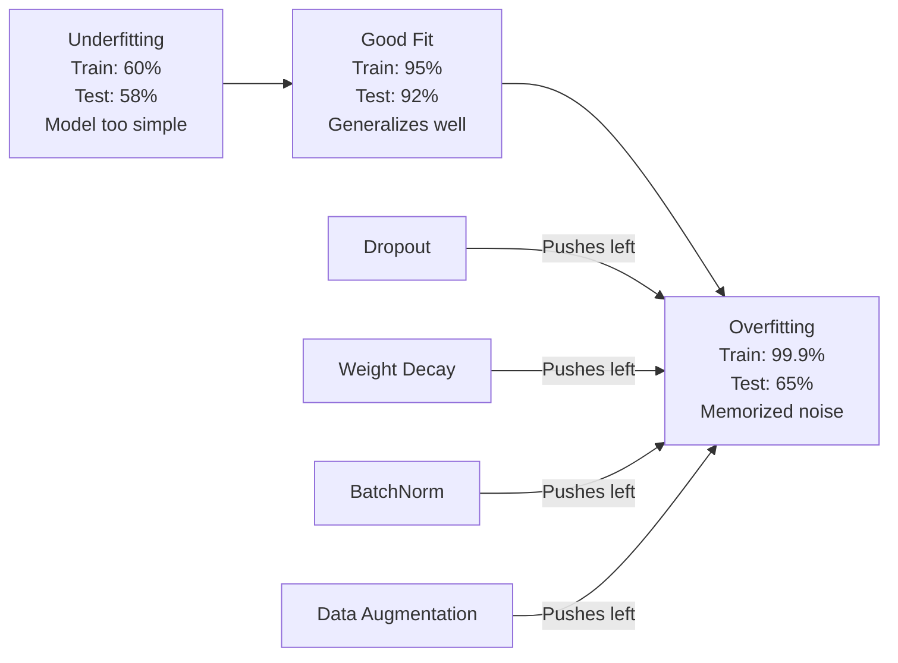
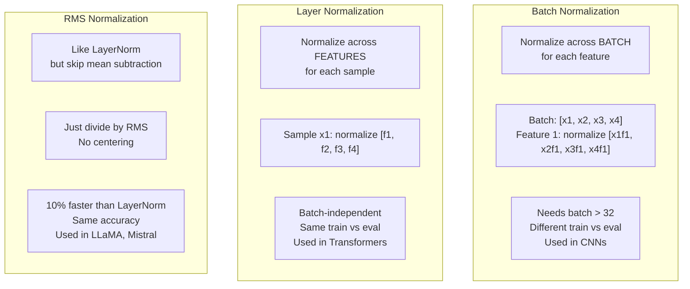
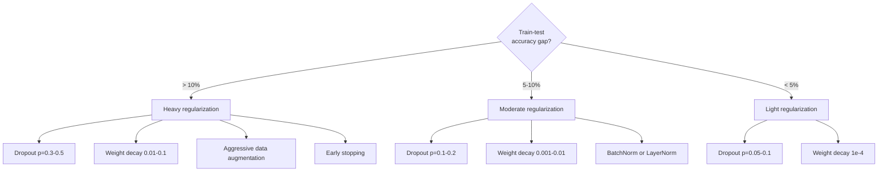

# Регуляризация

> Ваша модель получает 99% на обучающих данных и 60% на тестовых. Она запомнила, а не научилась. Регуляризация — это налог, который вы накладываете на сложность, чтобы заставить модель обобщать.

**Тип:** Build
**Языки:** Python
**Предварительные требования:** Урок 03.06 (Оптимизаторы)
**Время:** ~75 минут

## Цели обучения

- Реализовать дропаут с инвертированным масштабированием, L2-регуляризацию весов (weight decay), пакетную нормализацию, нормализацию слоя и RMSNorm с нуля
- Измерить разрыв между точностью на обучающей и тестовой выборках и диагностировать переобучение с помощью экспериментов с регуляризацией
- Объяснить, почему трансформеры используют LayerNorm вместо BatchNorm и почему современная большая языковая модель (LLM) предпочитает RMSNorm
- Применить правильную комбинацию методов регуляризации в зависимости от степени переобучения

## Проблема

Нейронная сеть с достаточным количеством параметров может запомнить любой набор данных. Это не гипотеза — Zhang et al. (2017) доказали это, обучив стандартные сети на ImageNet со случайными метками. Сети достигли почти нулевой ошибки на обучающих данных при полностью случайном назначении меток. Они запомнили миллион случайных пар вход-выход, в которых не было никакой закономерности для изучения. Ошибка на обучении была идеальной. Точность на тесте была нулевой.

Это и есть проблема переобучения, и она усугубляется по мере роста моделей. У GPT-3 175 миллиардов параметров. Обучающий набор содержит около 500 миллиардов токенов. При таком количестве параметров у модели достаточно ёмкости, чтобы запомнить значительные фрагменты обучающих данных дословно. Без регуляризации она просто воспроизводила бы примеры из обучения вместо изучения обобщаемых закономерностей.

Разрыв между качеством на обучении и качеством на тесте — это разрыв переобучения (overfitting gap). Каждый метод в этом уроке атакует этот разрыв под своим углом. Дропаут заставляет сеть не полагаться ни на один отдельный нейрон. Затухание весов не даёт ни одному весу вырасти слишком большим. Пакетная нормализация сглаживает ландшафт функции потерь, чтобы оптимизатор находил более плоские, лучше обобщаемые минимумы. Нормализация слоя делает то же самое, но работает там, где пакетная нормализация не справляется (маленькие пакеты, последовательности переменной длины). RMSNorm делает это на 10% быстрее, отбрасывая вычисление среднего. Каждый метод прост. Вместе они составляют разницу между моделью, которая запоминает, и моделью, которая обобщает.

## Концепция

### Спектр переобучения

Каждая модель находится где-то на спектре от недообучения (слишком проста, чтобы уловить закономерность) до переобучения (настолько сложна, что улавливает шум). Оптимальная точка находится между ними, и регуляризация подталкивает модели к ней со стороны переобучения.



### Дропаут

Простейший метод регуляризации с самой элегантной интерпретацией. Во время обучения выход каждого нейрона случайно обнуляется с вероятностью p.

```
output = activation(z) * mask    where mask[i] ~ Bernoulli(1 - p)
```

При p = 0.5 половина нейронов обнуляется на каждом прямом проходе. Сеть вынуждена изучать избыточные представления, потому что не может предсказать, какие нейроны будут доступны. Это предотвращает совместную адаптацию (co-adaptation) — ситуацию, когда нейроны учатся полагаться на присутствие определённых других нейронов.

Интерпретация в терминах ансамбля: сеть с N нейронами и дропаутом создаёт 2^N возможных подсетей (каждую комбинацию включённых/выключенных нейронов). Обучение с дропаутом приблизительно обучает все 2^N подсетей одновременно, каждую на разных мини-пакетах. Во время тестирования используются все нейроны (без дропаута), а выходы масштабируются на (1 - p), чтобы соответствовать ожидаемому значению во время обучения. Это эквивалентно усреднению предсказаний 2^N подсетей — огромного ансамбля из одной модели.

На практике масштабирование применяется во время обучения, а не тестирования (инвертированный дропаут, inverted dropout):

```
During training:  output = activation(z) * mask / (1 - p)
During testing:   output = activation(z)   (no change needed)
```

Так чище, потому что тестовому коду вообще не нужно знать о дропауте.

Значения по умолчанию: p = 0.1 для трансформеров, p = 0.5 для MLP, p = 0.2–0.3 для CNN. Более высокий дропаут = более сильная регуляризация = больший риск недообучения.

### Затухание весов (L2-регуляризация)

Добавьте сумму квадратов величин всех весов к функции потерь:

```
total_loss = task_loss + (lambda / 2) * sum(w_i^2)
```

Градиент члена регуляризации равен lambda * w. Это значит, что на каждом шаге каждый вес сжимается к нулю на долю, пропорциональную его величине. Большие веса штрафуются сильнее. Модель подталкивается к решениям, в которых ни один отдельный вес не доминирует.

Почему это помогает обобщению: переобученные модели, как правило, имеют большие веса, которые усиливают шум в обучающих данных. Затухание весов удерживает веса небольшими, что ограничивает эффективную ёмкость модели и вынуждает её полагаться на устойчивые, обобщаемые признаки, а не на запомненные особенности.

Гиперпараметр lambda управляет силой регуляризации. Типичные значения:

- 0.01 для AdamW на трансформерах
- 1e-4 для SGD на CNN
- 0.1 для сильно переобученных моделей

Как обсуждалось в уроке 06: затухание весов и L2-регуляризация эквивалентны в SGD, но не в Adam. При обучении с Adam всегда используйте AdamW, где затухание весов отделено от шага оптимизатора.

### Пакетная нормализация

Нормализуйте выход каждого слоя по мини-пакету перед передачей его следующему слою.

Для мини-пакета активаций на некотором слое:

```
mu = (1/B) * sum(x_i)           (batch mean)
sigma^2 = (1/B) * sum((x_i - mu)^2)   (batch variance)
x_hat = (x_i - mu) / sqrt(sigma^2 + eps)   (normalize)
y = gamma * x_hat + beta        (scale and shift)
```

Gamma и beta — обучаемые параметры, которые позволяют сети отменить нормализацию, если это оптимально. Без них вы бы принудительно делали выход каждого слоя нулевым по среднему и единичным по дисперсии, что не обязательно то, чего хочет сеть.

**Разделение на обучение и инференс:** во время обучения mu и sigma берутся из текущего мини-пакета. Во время инференса используются скользящие средние, накопленные во время обучения (экспоненциальное скользящее среднее с momentum = 0.1, то есть 90% старого + 10% нового).

Почему BatchNorm работает — до сих пор предмет споров. В оригинальной статье утверждалось, что он уменьшает «внутренний ковариационный сдвиг» (internal covariate shift) — изменение распределения входов слоя по мере обновления более ранних слоёв. Santurkar et al. (2018) показали, что это объяснение неверно. Настоящая причина: BatchNorm делает ландшафт функции потерь более гладким. Градиенты становятся более предсказуемыми, константы Липшица — меньше, и оптимизатор может безопасно делать более крупные шаги. Именно поэтому BatchNorm позволяет использовать более высокие скорости обучения и сходиться быстрее.

У BatchNorm есть фундаментальное ограничение: он зависит от статистики пакета. При размере пакета 1 среднее и дисперсия не имеют смысла. При маленьких пакетах (< 32) статистика зашумлена и вредит качеству. Это важно для таких задач, как обнаружение объектов (где размер пакета ограничен памятью) и языковое моделирование (где длины последовательностей различаются).

### Нормализация слоя

Нормализация по признакам, а не по пакету. Для одного образца:

```
mu = (1/D) * sum(x_j)           (feature mean)
sigma^2 = (1/D) * sum((x_j - mu)^2)   (feature variance)
x_hat = (x_j - mu) / sqrt(sigma^2 + eps)
y = gamma * x_hat + beta
```

D — размерность признакового пространства. Каждый образец нормализуется независимо — без зависимости от размера пакета. Именно поэтому трансформеры используют LayerNorm вместо BatchNorm. Последовательности имеют переменную длину, размеры пакетов часто малы (или равны 1 во время генерации), а вычисление идентично при обучении и инференсе.

LayerNorm в трансформерах применяется после каждого блока самовнимания (self-attention) и каждого блока прямого распространения (feed-forward) — Post-LN — или перед ними — Pre-LN, что обеспечивает более стабильное обучение.

### RMSNorm

LayerNorm без вычитания среднего. Предложен Zhang & Sennrich (2019).

```
rms = sqrt((1/D) * sum(x_j^2))
y = gamma * x / rms
```

И это всё. Никакого вычисления среднего, никакого параметра beta. Наблюдение: повторное центрирование (вычитание среднего) в LayerNorm вносит очень малый вклад в качество модели, но стоит вычислительных затрат. Убрав его, получаем ту же точность примерно с 10% меньшими накладными расходами.

LLaMA, LLaMA 2, LLaMA 3, Mistral и большинство современных LLM используют RMSNorm вместо LayerNorm. В масштабах миллиардов параметров и триллионов токенов эта экономия в 10% существенна.

### Сравнение методов нормализации



### Аугментация данных как регуляризация

Не модификация модели, а модификация данных. Преобразуйте обучающие входы, сохраняя метки:

- Изображения: случайная обрезка, отражение, поворот, изменение цвета, маскирование областей (cutout)
- Текст: замена синонимов, обратный перевод, случайное удаление
- Аудио: растяжение по времени, изменение высоты тона, добавление шума

Эффект идентичен регуляризации: увеличивается эффективный размер обучающего набора, что усложняет запоминание моделью конкретных примеров. Модель, которая видит каждое изображение только один раз в исходной форме, может его запомнить. Модель, которая видит 50 аугментированных версий каждого изображения, вынуждена изучать инвариантную структуру.

### Ранняя остановка

Простейший регуляризатор: остановить обучение, когда потери на валидации начинают расти. В этот момент модель ещё не переобучилась. На практике вы отслеживаете потери на валидации каждую эпоху, сохраняете лучшую модель и продолжаете обучение в течение окна «терпения» (patience, обычно 5–20 эпох). Если потери на валидации не улучшаются в пределах этого окна, вы останавливаетесь и загружаете лучшую сохранённую модель.

### Когда что применять



```figure
l2-regularization
```

## Создаём

### Шаг 1: Дропаут (режимы обучения и оценки)

```python
import random
import math


class Dropout:
    def __init__(self, p=0.5):
        self.p = p
        self.training = True
        self.mask = None

    def forward(self, x):
        if not self.training:
            return list(x)
        self.mask = []
        output = []
        for val in x:
            if random.random() < self.p:
                self.mask.append(0)
                output.append(0.0)
            else:
                self.mask.append(1)
                output.append(val / (1 - self.p))
        return output

    def backward(self, grad_output):
        grads = []
        for g, m in zip(grad_output, self.mask):
            if m == 0:
                grads.append(0.0)
            else:
                grads.append(g / (1 - self.p))
        return grads
```

### Шаг 2: L2-регуляризация весов

```python
def l2_regularization(weights, lambda_reg):
    penalty = 0.0
    for w in weights:
        penalty += w * w
    return lambda_reg * 0.5 * penalty

def l2_gradient(weights, lambda_reg):
    return [lambda_reg * w for w in weights]
```

### Шаг 3: Пакетная нормализация

```python
class BatchNorm:
    def __init__(self, num_features, momentum=0.1, eps=1e-5):
        self.gamma = [1.0] * num_features
        self.beta = [0.0] * num_features
        self.eps = eps
        self.momentum = momentum
        self.running_mean = [0.0] * num_features
        self.running_var = [1.0] * num_features
        self.training = True
        self.num_features = num_features

    def forward(self, batch):
        batch_size = len(batch)
        if self.training:
            mean = [0.0] * self.num_features
            for sample in batch:
                for j in range(self.num_features):
                    mean[j] += sample[j]
            mean = [m / batch_size for m in mean]

            var = [0.0] * self.num_features
            for sample in batch:
                for j in range(self.num_features):
                    var[j] += (sample[j] - mean[j]) ** 2
            var = [v / batch_size for v in var]

            for j in range(self.num_features):
                self.running_mean[j] = (1 - self.momentum) * self.running_mean[j] + self.momentum * mean[j]
                self.running_var[j] = (1 - self.momentum) * self.running_var[j] + self.momentum * var[j]
        else:
            mean = list(self.running_mean)
            var = list(self.running_var)

        self.x_hat = []
        output = []
        for sample in batch:
            normalized = []
            out_sample = []
            for j in range(self.num_features):
                x_h = (sample[j] - mean[j]) / math.sqrt(var[j] + self.eps)
                normalized.append(x_h)
                out_sample.append(self.gamma[j] * x_h + self.beta[j])
            self.x_hat.append(normalized)
            output.append(out_sample)
        return output
```

### Шаг 4: Нормализация слоя

```python
class LayerNorm:
    def __init__(self, num_features, eps=1e-5):
        self.gamma = [1.0] * num_features
        self.beta = [0.0] * num_features
        self.eps = eps
        self.num_features = num_features

    def forward(self, x):
        mean = sum(x) / len(x)
        var = sum((xi - mean) ** 2 for xi in x) / len(x)

        self.x_hat = []
        output = []
        for j in range(self.num_features):
            x_h = (x[j] - mean) / math.sqrt(var + self.eps)
            self.x_hat.append(x_h)
            output.append(self.gamma[j] * x_h + self.beta[j])
        return output
```

### Шаг 5: RMSNorm

```python
class RMSNorm:
    def __init__(self, num_features, eps=1e-6):
        self.gamma = [1.0] * num_features
        self.eps = eps
        self.num_features = num_features

    def forward(self, x):
        rms = math.sqrt(sum(xi * xi for xi in x) / len(x) + self.eps)
        output = []
        for j in range(self.num_features):
            output.append(self.gamma[j] * x[j] / rms)
        return output
```

### Шаг 6: Обучение с регуляризацией и без неё

```python
def sigmoid(x):
    x = max(-500, min(500, x))
    return 1.0 / (1.0 + math.exp(-x))


def make_circle_data(n=200, seed=42):
    random.seed(seed)
    data = []
    for _ in range(n):
        x = random.uniform(-2, 2)
        y = random.uniform(-2, 2)
        label = 1.0 if x * x + y * y < 1.5 else 0.0
        data.append(([x, y], label))
    return data


class RegularizedNetwork:
    def __init__(self, hidden_size=16, lr=0.05, dropout_p=0.0, weight_decay=0.0):
        random.seed(0)
        self.hidden_size = hidden_size
        self.lr = lr
        self.dropout_p = dropout_p
        self.weight_decay = weight_decay
        self.dropout = Dropout(p=dropout_p) if dropout_p > 0 else None

        self.w1 = [[random.gauss(0, 0.5) for _ in range(2)] for _ in range(hidden_size)]
        self.b1 = [0.0] * hidden_size
        self.w2 = [random.gauss(0, 0.5) for _ in range(hidden_size)]
        self.b2 = 0.0

    def forward(self, x, training=True):
        self.x = x
        self.z1 = []
        self.h = []
        for i in range(self.hidden_size):
            z = self.w1[i][0] * x[0] + self.w1[i][1] * x[1] + self.b1[i]
            self.z1.append(z)
            self.h.append(max(0.0, z))

        if self.dropout and training:
            self.dropout.training = True
            self.h = self.dropout.forward(self.h)
        elif self.dropout:
            self.dropout.training = False
            self.h = self.dropout.forward(self.h)

        self.z2 = sum(self.w2[i] * self.h[i] for i in range(self.hidden_size)) + self.b2
        self.out = sigmoid(self.z2)
        return self.out

    def backward(self, target):
        eps = 1e-15
        p = max(eps, min(1 - eps, self.out))
        d_loss = -(target / p) + (1 - target) / (1 - p)
        d_sigmoid = self.out * (1 - self.out)
        d_out = d_loss * d_sigmoid

        for i in range(self.hidden_size):
            d_relu = 1.0 if self.z1[i] > 0 else 0.0
            d_h = d_out * self.w2[i] * d_relu
            self.w2[i] -= self.lr * (d_out * self.h[i] + self.weight_decay * self.w2[i])
            for j in range(2):
                self.w1[i][j] -= self.lr * (d_h * self.x[j] + self.weight_decay * self.w1[i][j])
            self.b1[i] -= self.lr * d_h
        self.b2 -= self.lr * d_out

    def evaluate(self, data):
        correct = 0
        total_loss = 0.0
        for x, y in data:
            pred = self.forward(x, training=False)
            eps = 1e-15
            p = max(eps, min(1 - eps, pred))
            total_loss += -(y * math.log(p) + (1 - y) * math.log(1 - p))
            if (pred >= 0.5) == (y >= 0.5):
                correct += 1
        return total_loss / len(data), correct / len(data) * 100

    def train_model(self, train_data, test_data, epochs=300):
        history = []
        for epoch in range(epochs):
            total_loss = 0.0
            correct = 0
            for x, y in train_data:
                pred = self.forward(x, training=True)
                self.backward(y)
                eps = 1e-15
                p = max(eps, min(1 - eps, pred))
                total_loss += -(y * math.log(p) + (1 - y) * math.log(1 - p))
                if (pred >= 0.5) == (y >= 0.5):
                    correct += 1
            train_loss = total_loss / len(train_data)
            train_acc = correct / len(train_data) * 100
            test_loss, test_acc = self.evaluate(test_data)
            history.append((train_loss, train_acc, test_loss, test_acc))
            if epoch % 75 == 0 or epoch == epochs - 1:
                gap = train_acc - test_acc
                print(f"    Epoch {epoch:3d}: train_acc={train_acc:.1f}%, test_acc={test_acc:.1f}%, gap={gap:.1f}%")
        return history
```

## Применяем

PyTorch предоставляет всю нормализацию и регуляризацию в виде модулей:

```python
import torch
import torch.nn as nn

model = nn.Sequential(
    nn.Linear(784, 256),
    nn.BatchNorm1d(256),
    nn.ReLU(),
    nn.Dropout(0.3),
    nn.Linear(256, 128),
    nn.BatchNorm1d(128),
    nn.ReLU(),
    nn.Dropout(0.3),
    nn.Linear(128, 10),
)

model.train()
out_train = model(torch.randn(32, 784))

model.eval()
out_test = model(torch.randn(1, 784))
```

Переключение `model.train()` / `model.eval()` критически важно. Оно включает или отключает дропаут, а BatchNorm в зависимости от режима переключает между статистикой текущего пакета и накопленной скользящей статистикой. Забыть вызвать `model.eval()` перед инференсом — одна из самых распространённых ошибок в глубоком обучении. Точность на тесте будет случайно колебаться, потому что дропаут всё ещё активен, а BatchNorm использует статистику мини-пакета.

Для трансформеров паттерн другой:

```python
class TransformerBlock(nn.Module):
    def __init__(self, d_model=512, nhead=8, dropout=0.1):
        super().__init__()
        self.attention = nn.MultiheadAttention(d_model, nhead, dropout=dropout)
        self.norm1 = nn.LayerNorm(d_model)
        self.ff = nn.Sequential(
            nn.Linear(d_model, d_model * 4),
            nn.GELU(),
            nn.Linear(d_model * 4, d_model),
            nn.Dropout(dropout),
        )
        self.norm2 = nn.LayerNorm(d_model)
        self.dropout = nn.Dropout(dropout)

    def forward(self, x):
        attended, _ = self.attention(x, x, x)
        x = self.norm1(x + self.dropout(attended))
        x = self.norm2(x + self.ff(x))
        return x
```

LayerNorm, а не BatchNorm. Дропаут с p=0.1, а не с p=0.5. Это значения по умолчанию для трансформеров.

## Публикуем

Этот урок создаёт:
- `outputs/prompt-regularization-advisor.md` -- промпт, который диагностирует переобучение и рекомендует правильную стратегию регуляризации

## Упражнения

1. Реализуйте пространственный дропаут (spatial dropout) для 2D-данных: вместо отбрасывания отдельных нейронов отбрасывайте целые каналы признаков. Смоделируйте это, рассматривая группы последовательных признаков как каналы и отбрасывая целые группы. Сравните разрыв между обучением и тестом со стандартным дропаутом на наборе данных с круговой границей при hidden_size=32.

2. Реализуйте сглаживание меток (label smoothing) из урока 05 в сочетании с дропаутом из этого урока. Обучите с четырьмя конфигурациями: ни то ни другое, только дропаут, только сглаживание меток, оба метода. Измерьте итоговый разрыв между точностью на обучении и на тесте для каждой конфигурации. Какая комбинация даёт наименьший разрыв?

3. Добавьте слой BatchNorm между скрытым слоем и активацией в вашей сети для набора данных с круговой границей. Обучите с BatchNorm и без него при скоростях обучения 0.01, 0.05 и 0.1. BatchNorm должен позволить стабильное обучение при более высоких скоростях обучения, при которых обычная сеть расходится.

4. Реализуйте раннюю остановку: отслеживайте потери на тесте на каждой эпохе, сохраняйте лучшие веса и останавливайтесь, если потери на тесте не улучшались в течение 20 эпох. Запустите регуляризованную сеть на 1000 эпох. Сообщите, на какой эпохе была лучшая точность на тесте и сколько эпох вычислений вы сэкономили.

5. Сравните LayerNorm и RMSNorm на 4-слойной сети (а не только 2-слойной). Инициализируйте оба варианта одинаковыми весами. Обучайте 200 эпох и сравните итоговую точность, скорость обучения (время на эпоху) и величины градиентов на первом слое. Убедитесь, что RMSNorm работает быстрее при той же точности.

## Ключевые термины

| Термин | Как обычно говорят | Что это значит на самом деле |
|------|----------------|----------------------|
| Переобучение | «Модель запомнила данные» | Ситуация, когда качество модели на обучении значительно превышает качество на тесте, что указывает на изучение шума, а не сигнала |
| Регуляризация | «Предотвращение переобучения» | Любой метод, ограничивающий сложность модели для улучшения обобщения: дропаут, затухание весов, нормализация, аугментация |
| Дропаут | «Случайное удаление нейронов» | Обнуление случайных нейронов во время обучения с вероятностью p, вынуждающее изучать избыточные представления; эквивалентно обучению ансамбля |
| Затухание весов | «L2-штраф» | Сжатие всех весов к нулю путём вычитания lambda * w на каждом шаге; штрафует сложность через величину весов |
| Пакетная нормализация | «Нормализация по пакету» | Нормализация выходов слоя по измерению пакета с использованием статистики пакета при обучении и скользящих средних при инференсе |
| Нормализация слоя | «Нормализация по образцу» | Нормализация по признакам внутри каждого образца; не зависит от размера пакета, используется в трансформерах, где размер пакета варьируется |
| RMSNorm | «LayerNorm без среднего» | Нормализация по среднеквадратичному значению; убирает вычитание среднего из LayerNorm ради ускорения на 10% при равной точности |
| Ранняя остановка | «Остановка до переобучения» | Прекращение обучения, когда потери на валидации перестают улучшаться; простейший регуляризатор, часто применяется вместе с другими |
| Аугментация данных | «Больше данных из меньшего» | Преобразование обучающих входов (отражение, обрезка, шум) для увеличения эффективного размера набора данных и обучения инвариантности |
| Разрыв обобщения | «Разделение на обучение и тест» | Разница между качеством на обучении и на тесте; регуляризация направлена на минимизацию этого разрыва |

## Дополнительные материалы

- Srivastava et al., "Dropout: A Simple Way to Prevent Neural Networks from Overfitting" (2014) -- оригинальная статья о дропауте с интерпретацией в терминах ансамбля и обширными экспериментами
- Ioffe & Szegedy, "Batch Normalization: Accelerating Deep Network Training by Reducing Internal Covariate Shift" (2015) -- представила BatchNorm и процедуру его обучения, одна из самых цитируемых статей в глубоком обучении
- Zhang & Sennrich, "Root Mean Square Layer Normalization" (2019) -- показала, что RMSNorm соответствует точности LayerNorm при меньших вычислительных затратах; принята в LLaMA и Mistral
- Zhang et al., "Understanding Deep Learning Requires Rethinking Generalization" (2017) -- знаковая статья, показавшая, что нейронные сети могут запоминать случайные метки, что бросило вызов традиционным взглядам на обобщение
