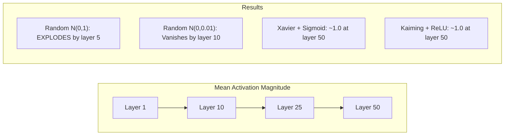
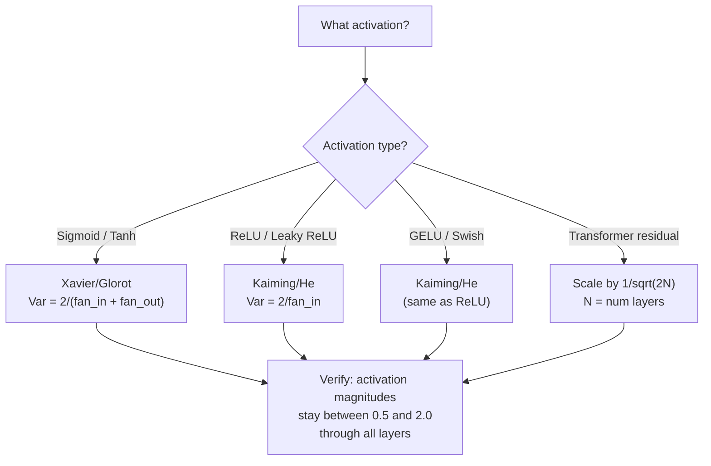

# Инициализация весов и устойчивость обучения

> Инициализируете неправильно — обучение никогда не начнётся. Инициализируете правильно — 50 слоёв обучаются так же гладко, как и 3.

**Тип:** Build
**Языки:** Python
**Предварительные требования:** Урок 03.04 (Функции активации), Урок 03.07 (Регуляризация)
**Время:** ~90 минут

## Цели обучения

- Реализовать стратегии инициализации нулём, случайными значениями, Xavier/Glorot и Kaiming/He и измерить их влияние на величину активаций через 50 слоёв
- Вывести, почему Xavier-инициализация использует Var(w) = 2/(fan_in + fan_out), а Kaiming — Var(w) = 2/fan_in
- Продемонстрировать проблему симметрии при нулевой инициализации и объяснить, почему одного лишь случайного масштаба недостаточно
- Сопоставить правильную стратегию инициализации с функцией активации: Xavier для sigmoid/tanh, Kaiming для ReLU/GELU

## Проблема

Инициализируйте все веса нулём. Ничего не обучается. Каждый нейрон вычисляет одну и ту же функцию, получает один и тот же градиент и обновляется одинаково. После 10 000 эпох ваш скрытый слой из 512 нейронов всё ещё представляет собой 512 копий одного и того же нейрона. Вы заплатили за 512 параметров, а получили 1.

Инициализируйте их слишком большими значениями. Активации взрываются по мере прохождения через сеть. К слою 10 значения достигают 1e15. К слою 20 они переполняются до бесконечности. Градиенты повторяют ту же траекторию в обратном направлении.

Инициализируйте их случайно из стандартного нормального распределения. Работает для 3 слоёв. При 50 слоях сигнал схлопывается до нуля или взрывается до бесконечности в зависимости от того, был ли случайный масштаб чуть меньше или чуть больше нужного. Граница между «работает» и «сломано» — очень тонкая.

Инициализация весов — самое недооценённое решение в глубоком обучении. Архитектуре посвящают статьи. Оптимизаторам посвящают посты в блогах. Инициализации достаётся сноска. Но ошибётесь здесь — и всё остальное уже не важно: ваша сеть мертва ещё до начала обучения.

## Концепция

### Проблема симметрии

Каждый нейрон в слое имеет одинаковую структуру: умножить входы на веса, добавить смещение, применить активацию. Если все веса начинаются с одного и того же значения (ноль — крайний случай), каждый нейрон вычисляет одинаковый выход. При обратном распространении каждый нейрон получает одинаковый градиент. На шаге обновления каждый нейрон меняется на одну и ту же величину.

Вы застряли. У сети сотни параметров, но все они движутся в унисон. Это называется симметрией, а случайная инициализация — грубый способ её сломать. Каждый нейрон начинает в разной точке пространства весов, поэтому каждый учит свой признак.

Но «случайно» — недостаточно. *Масштаб* случайности определяет, обучится ли сеть.

### Распространение дисперсии через слои

Рассмотрим один слой с fan_in входами:

```
z = w1*x1 + w2*x2 + ... + w_n*x_n
```

Если каждый вес wi взят из распределения с дисперсией Var(w), а каждый вход xi имеет дисперсию Var(x), дисперсия выхода равна:

```
Var(z) = fan_in * Var(w) * Var(x)
```

Если Var(w) = 1 и fan_in = 512, дисперсия выхода в 512 раз больше дисперсии входа. После 10 слоёв: 512^10 = 1.2e27. Ваш сигнал взорвался.

Если Var(w) = 0.001, дисперсия выхода на каждом слое сжимается на 0.001 * 512 = 0.512. После 10 слоёв: 0.512^10 = 0.00013. Ваш сигнал исчез.

Цель: подобрать Var(w) так, чтобы Var(z) = Var(x). Величина сигнала остаётся постоянной по всем слоям.

### Инициализация Xavier/Glorot

Glorot и Bengio (2010) вывели решение для активаций sigmoid и tanh. Чтобы сохранить постоянную дисперсию как в прямом, так и в обратном проходе:

```
Var(w) = 2 / (fan_in + fan_out)
```

На практике веса берутся из:

```
w ~ Uniform(-limit, limit)  where limit = sqrt(6 / (fan_in + fan_out))
```

или:

```
w ~ Normal(0, sqrt(2 / (fan_in + fan_out)))
```

Это работает, потому что sigmoid и tanh примерно линейны вблизи нуля — там, где живут правильно инициализированные активации. Дисперсия остаётся стабильной на протяжении десятков слоёв.

### Инициализация Kaiming/He

ReLU убивает половину выходов (всё отрицательное становится нулём). Эффективный fan_in уменьшается вдвое, потому что в среднем половина входов обнуляется. Xavier-инициализация это не учитывает — она недооценивает нужную дисперсию.

He и соавторы (2015) скорректировали формулу:

```
Var(w) = 2 / fan_in
```

Веса берутся из:

```
w ~ Normal(0, sqrt(2 / fan_in))
```

Коэффициент 2 компенсирует обнуление ReLU половины активаций. Без него сигнал сжимается примерно на 0.5x на каждом слое. При 50 слоях: 0.5^50 = 8.8e-16. Kaiming-инициализация это предотвращает.

### Инициализация трансформеров

GPT-2 ввёл другой паттерн. Остаточные соединения добавляют выход каждого подслоя к его входу:

```
x = x + sublayer(x)
```

Каждое сложение увеличивает дисперсию. При N остаточных слоях дисперсия растёт пропорционально N. GPT-2 масштабирует веса остаточных слоёв на 1/sqrt(2N), где N — число слоёв. Это удерживает накопленную величину сигнала стабильной.

Llama 3 (405 млрд параметров, 126 слоёв) использует похожую схему. Без этого масштабирования остаточный поток рос бы неограниченно на протяжении 126 слоёв блоков внимания и feedforward.

```mermaid
flowchart TD
    subgraph "Zero Init"
        Z1["Layer 1<br/>All weights = 0"] --> Z2["Layer 2<br/>All neurons identical"]
        Z2 --> Z3["Layer 3<br/>Still identical"]
        Z3 --> ZR["Result: 1 effective neuron<br/>regardless of width"]
    end

    subgraph "Xavier Init"
        X1["Layer 1<br/>Var = 2/(fan_in+fan_out)"] --> X2["Layer 2<br/>Signal stable"]
        X2 --> X3["Layer 50<br/>Signal stable"]
        X3 --> XR["Result: Trains with<br/>sigmoid/tanh"]
    end

    subgraph "Kaiming Init"
        K1["Layer 1<br/>Var = 2/fan_in"] --> K2["Layer 2<br/>Signal stable"]
        K2 --> K3["Layer 50<br/>Signal stable"]
        K3 --> KR["Result: Trains with<br/>ReLU/GELU"]
    end
```



### Величина активаций через 50 слоёв



### Выбор правильной инициализации



```figure
weight-init-variance
```

## Создаём

### Шаг 1: Стратегии инициализации

Четыре способа инициализировать матрицу весов. Каждый возвращает список списков (2D-матрицу) с fan_in столбцами и fan_out строками.

```python
import math
import random


def zero_init(fan_in, fan_out):
    return [[0.0 for _ in range(fan_in)] for _ in range(fan_out)]


def random_init(fan_in, fan_out, scale=1.0):
    return [[random.gauss(0, scale) for _ in range(fan_in)] for _ in range(fan_out)]


def xavier_init(fan_in, fan_out):
    std = math.sqrt(2.0 / (fan_in + fan_out))
    return [[random.gauss(0, std) for _ in range(fan_in)] for _ in range(fan_out)]


def kaiming_init(fan_in, fan_out):
    std = math.sqrt(2.0 / fan_in)
    return [[random.gauss(0, std) for _ in range(fan_in)] for _ in range(fan_out)]
```

### Шаг 2: Функции активации

Нам нужны sigmoid, tanh и ReLU, чтобы протестировать каждую стратегию инициализации с предназначенной для неё активацией.

```python
def sigmoid(x):
    x = max(-500, min(500, x))
    return 1.0 / (1.0 + math.exp(-x))


def tanh_act(x):
    return math.tanh(x)


def relu(x):
    return max(0.0, x)
```

### Шаг 3: Прямой проход через 50 слоёв

Пропустите случайные данные через глубокую сеть и измерьте среднюю величину активации на каждом слое.

```python
def forward_deep(init_fn, activation_fn, n_layers=50, width=64, n_samples=100):
    random.seed(42)
    layer_magnitudes = []

    inputs = [[random.gauss(0, 1) for _ in range(width)] for _ in range(n_samples)]

    for layer_idx in range(n_layers):
        weights = init_fn(width, width)
        biases = [0.0] * width

        new_inputs = []
        for sample in inputs:
            output = []
            for neuron_idx in range(width):
                z = sum(weights[neuron_idx][j] * sample[j] for j in range(width)) + biases[neuron_idx]
                output.append(activation_fn(z))
            new_inputs.append(output)
        inputs = new_inputs

        magnitudes = []
        for sample in inputs:
            magnitudes.append(sum(abs(v) for v in sample) / width)
        mean_mag = sum(magnitudes) / len(magnitudes)
        layer_magnitudes.append(mean_mag)

    return layer_magnitudes
```

### Шаг 4: Эксперимент

Запустите все комбинации: нулевая инициализация, случайная N(0,1), случайная N(0,0.01), Xavier с sigmoid, Xavier с tanh, Kaiming с ReLU. Выведите величину на ключевых слоях.

```python
def run_experiment():
    configs = [
        ("Zero init + Sigmoid", lambda fi, fo: zero_init(fi, fo), sigmoid),
        ("Random N(0,1) + ReLU", lambda fi, fo: random_init(fi, fo, 1.0), relu),
        ("Random N(0,0.01) + ReLU", lambda fi, fo: random_init(fi, fo, 0.01), relu),
        ("Xavier + Sigmoid", xavier_init, sigmoid),
        ("Xavier + Tanh", xavier_init, tanh_act),
        ("Kaiming + ReLU", kaiming_init, relu),
    ]

    print(f"{'Strategy':<30} {'L1':>10} {'L5':>10} {'L10':>10} {'L25':>10} {'L50':>10}")
    print("-" * 80)

    for name, init_fn, act_fn in configs:
        mags = forward_deep(init_fn, act_fn)
        row = f"{name:<30}"
        for idx in [0, 4, 9, 24, 49]:
            val = mags[idx]
            if val > 1e6:
                row += f" {'EXPLODED':>10}"
            elif val < 1e-6:
                row += f" {'VANISHED':>10}"
            else:
                row += f" {val:>10.4f}"
        print(row)
```

### Шаг 5: Демонстрация симметрии

Покажите, что нулевая инициализация даёт идентичные нейроны.

```python
def symmetry_demo():
    random.seed(42)
    weights = zero_init(2, 4)
    biases = [0.0] * 4

    inputs = [0.5, -0.3]
    outputs = []
    for neuron_idx in range(4):
        z = sum(weights[neuron_idx][j] * inputs[j] for j in range(2)) + biases[neuron_idx]
        outputs.append(sigmoid(z))

    print("\nSymmetry Demo (4 neurons, zero init):")
    for i, out in enumerate(outputs):
        print(f"  Neuron {i}: output = {out:.6f}")
    all_same = all(abs(outputs[i] - outputs[0]) < 1e-10 for i in range(len(outputs)))
    print(f"  All identical: {all_same}")
    print(f"  Effective parameters: 1 (not {len(weights) * len(weights[0])})")
```

### Шаг 6: Отчёт о величине по слоям

Выведите текстовую столбчатую диаграмму величины активаций через 50 слоёв.

```python
def magnitude_report(name, magnitudes):
    print(f"\n{name}:")
    for i, mag in enumerate(magnitudes):
        if i % 5 == 0 or i == len(magnitudes) - 1:
            if mag > 1e6:
                bar = "X" * 50 + " EXPLODED"
            elif mag < 1e-6:
                bar = "." + " VANISHED"
            else:
                bar_len = min(50, max(1, int(mag * 10)))
                bar = "#" * bar_len
            print(f"  Layer {i+1:3d}: {bar} ({mag:.6f})")
```

## Применяем

PyTorch предоставляет их как встроенные функции:

```python
import torch
import torch.nn as nn

layer = nn.Linear(512, 256)

nn.init.xavier_uniform_(layer.weight)
nn.init.xavier_normal_(layer.weight)

nn.init.kaiming_uniform_(layer.weight, nonlinearity='relu')
nn.init.kaiming_normal_(layer.weight, nonlinearity='relu')

nn.init.zeros_(layer.bias)
```

Когда вы вызываете `nn.Linear(512, 256)`, PyTorch по умолчанию использует Kaiming uniform инициализацию. Именно поэтому большинство простых сетей «просто работают» — PyTorch уже сделал правильный выбор. Но когда вы строите собственные архитектуры или уходите глубже 20 слоёв, нужно понимать, что происходит, и, возможно, переопределить значение по умолчанию.

Для трансформеров модели HuggingFace обычно обрабатывают инициализацию в своём методе `_init_weights`. Реализация GPT-2 масштабирует остаточные проекции на 1/sqrt(N). Если вы строите трансформер с нуля, вам нужно добавить это самостоятельно.

## Публикуем

Этот урок создаёт:
- `outputs/prompt-init-strategy.md` — промпт, который диагностирует проблемы инициализации весов и рекомендует правильную стратегию

## Упражнения

1. Добавьте LeCun-инициализацию (Var = 1/fan_in, предназначена для активации SELU). Запустите эксперимент с 50 слоями с LeCun-инициализацией + tanh и сравните с Xavier + tanh.

2. Реализуйте масштабирование остатков из GPT-2: умножьте выход каждого слоя на 1/sqrt(2*N) перед добавлением к остаточному потоку. Запустите 50 слоёв с масштабированием и без него, измерьте, насколько быстро растёт величина остатка.

3. Создайте функцию «проверки здоровья инициализации», которая принимает размерности слоёв сети и тип активации, а затем рекомендует правильную инициализацию и предупреждает, если текущая инициализация вызовет проблемы.

4. Запустите эксперимент с fan_in = 16 против fan_in = 1024. Xavier и Kaiming адаптируются к fan_in, а случайная инициализация — нет. Покажите, как разрыв между «работает» и «ломается» расширяется с ростом слоёв.

5. Реализуйте ортогональную инициализацию (сгенерируйте случайную матрицу, вычислите её SVD, используйте ортогональную матрицу U). Сравните с Kaiming для ReLU-сетей на 50 слоях.

## Ключевые термины

| Термин | Что говорят | Что это значит на самом деле |
|------|----------------|----------------------|
| Weight initialization | «Задать начальные веса случайно» | Стратегия выбора начальных значений весов, которая определяет, способна ли сеть вообще обучиться |
| Symmetry breaking | «Сделать нейроны разными» | Использование случайной инициализации, чтобы нейроны учили разные признаки вместо вычисления идентичных функций |
| Fan-in | «Число входов нейрона» | Число входящих соединений, определяющее, как накапливается дисперсия входа во взвешенной сумме |
| Fan-out | «Число выходов нейрона» | Число исходящих соединений, важное для сохранения дисперсии градиента при обратном распространении |
| Xavier/Glorot init | «Инициализация для sigmoid» | Var(w) = 2/(fan_in + fan_out), предназначена для сохранения дисперсии через активации sigmoid и tanh |
| Kaiming/He init | «Инициализация для ReLU» | Var(w) = 2/fan_in, учитывает обнуление ReLU половины активаций |
| Variance propagation | «Как сигналы растут или уменьшаются через слои» | Математический анализ того, как дисперсия активации меняется от слоя к слою в зависимости от масштаба весов |
| Residual scaling | «Трюк инициализации из GPT-2» | Масштабирование весов остаточных соединений на 1/sqrt(2N) для предотвращения роста дисперсии через N слоёв трансформера |
| Dead network | «Ничего не обучается» | Сеть, в которой плохая инициализация приводит к тому, что все градиенты равны нулю или все активации насыщаются |
| Exploding activations | «Значения уходят в бесконечность» | Когда дисперсия весов слишком высока, что приводит к экспоненциальному росту величины активаций через слои |

## Дополнительные материалы

- Glorot & Bengio, "Understanding the difficulty of training deep feedforward neural networks" (2010) — оригинальная статья про Xavier-инициализацию с анализом дисперсии
- He et al., "Delving Deep into Rectifiers" (2015) — представила Kaiming-инициализацию для сетей с ReLU
- Radford et al., "Language Models are Unsupervised Multitask Learners" (2019) — статья про GPT-2 с масштабированием инициализации остатков
- Mishkin & Matas, "All You Need is a Good Init" (2016) — послойная унитарно-дисперсионная инициализация, эмпирическая альтернатива аналитическим формулам
