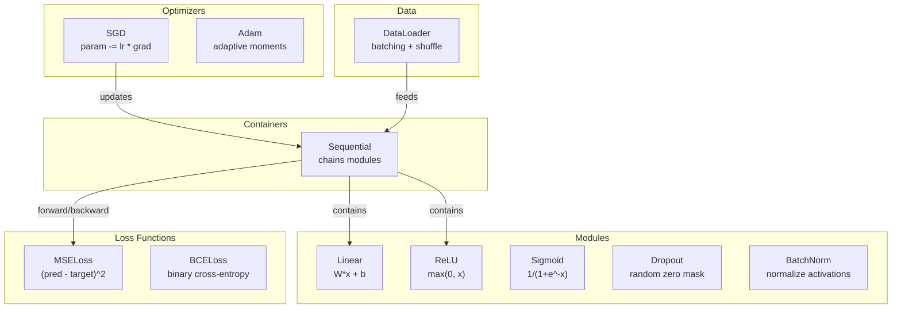
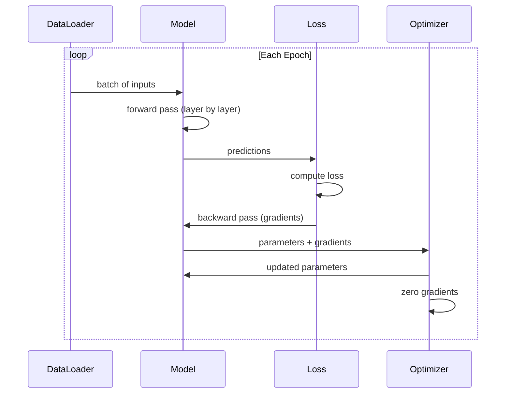
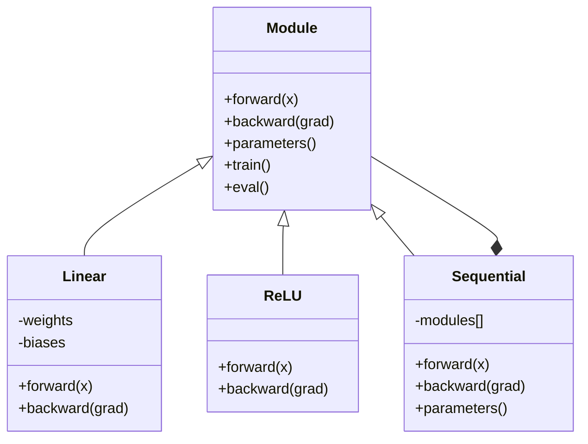

# Создайте свой мини-фреймворк

> Вы построили нейроны, слои, сети, обратное распространение, активации, функции потерь, оптимизаторы, регуляризацию, инициализацию и расписания скорости обучения. Всё это — отдельные части. Теперь соедините их в фреймворк. Не PyTorch. Не TensorFlow. Ваш собственный.

**Тип:** Build
**Языки:** Python
**Предварительные требования:** Вся Фаза 03 (Уроки 01-09)
**Время:** ~120 минут

## Цели обучения

- Построить полноценный фреймворк глубокого обучения (~500 строк) с Module, Linear, ReLU, Sigmoid, Dropout, BatchNorm, Sequential, функциями потерь, оптимизаторами и DataLoader
- Объяснить абстракцию Module (forward, backward, parameters) и почему необходимо переключение между режимами train/eval
- Соединить все компоненты в рабочий цикл обучения, который обучает 4-слойную сеть классификации круга
- Сопоставить каждый компонент вашего фреймворка с его эквивалентом в PyTorch (nn.Module, nn.Sequential, optim.Adam, DataLoader)

## Проблема

У вас десять уроков строительных блоков, разбросанных по отдельным файлам. Класс `Value` здесь, цикл обучения там, инициализация весов в другом файле, расписания скорости обучения ещё в одном. Чтобы обучить сеть, вы копируете и вставляете код из пяти разных уроков и соединяете его вручную.

Именно это решают фреймворки. PyTorch даёт вам `nn.Module`, `nn.Sequential`, `optim.Adam`, `DataLoader` и паттерн цикла обучения, который связывает всё это воедино. TensorFlow даёт вам `keras.Layer`, `keras.Sequential`, `keras.optimizers.Adam`. Это не магия. Это организационные паттерны, которые позволяют определять, обучать и оценивать сети, не изобретая заново всю сантехнику каждый раз.

Вы собираетесь построить то же самое на ~500 строках Python. Без numpy. Без внешних зависимостей. Фреймворк, который может определить любую прямую сеть (feedforward), обучить её с помощью SGD или Adam, разбить данные на пакеты, применить дропаут и пакетную нормализацию, использовать любую активацию и планировать скорость обучения.

Когда вы закончите, вы будете точно понимать, что происходит, когда вы пишете `model = nn.Sequential(...)` в PyTorch. Вы поймёте, зачем существуют `model.train()` и `model.eval()`. Вы поймёте, почему `optimizer.zero_grad()` — отдельный вызов. Вы поймёте всё это, потому что вы построили всё это сами.

## Концепция

### Абстракция Module

Каждый слой в PyTorch наследуется от `nn.Module`. У Module три обязанности:

1. **forward()** — вычислить выход по входам
2. **parameters()** — вернуть все обучаемые веса
3. **backward()** — вычислить градиенты (обрабатывается autograd в PyTorch, явно в нашем фреймворке)

Слой Linear — это Module. Активация ReLU — это Module. Слой dropout — это Module. Слой пакетной нормализации — это Module. У всех у них одинаковый интерфейс.

### Контейнер Sequential

`nn.Sequential` соединяет цепочкой модули Module. Прямой проход: пропускаем данные через Module 1, затем Module 2, затем Module 3. Обратный проход: разворачиваем цепочку. Сам контейнер — это Module — у него есть forward(), parameters() и backward(). Это композитный паттерн: последовательность Module сама по себе является Module.

### Режим обучения против режима оценки

Dropout случайным образом обнуляет нейроны во время обучения, но пропускает всё без изменений во время оценки. Пакетная нормализация использует статистику пакета во время обучения, но скользящие средние во время оценки. Методы `train()` и `eval()` переключают это поведение. У каждого Module есть флаг `training`.

### Оптимизатор

Оптимизатор обновляет параметры, используя их градиенты. SGD: `param -= lr * grad`. Adam: поддерживает оценки момента и дисперсии, затем обновляет. Оптимизатор ничего не знает об архитектуре сети — он видит только плоский список параметров и их градиентов.

### DataLoader

Разбиение на пакеты важно по двум причинам. Во-первых, вы не можете уместить весь набор данных в памяти для больших задач. Во-вторых, мини-пакетный градиентный спуск вносит шум, который помогает избегать локальных минимумов. DataLoader разбивает данные на пакеты и опционально перемешивает их между эпохами.

### Архитектура фреймворка



### Цикл обучения



### Иерархия Module



```figure
gradient-clipping
```

## Создаём

### Шаг 1: Базовый класс Module

Абстрактный интерфейс, который реализует каждый слой.

```python
class Module:
    def __init__(self):
        self.training = True

    def forward(self, x):
        raise NotImplementedError

    def backward(self, grad):
        raise NotImplementedError

    def parameters(self):
        return []

    def train(self):
        self.training = True

    def eval(self):
        self.training = False
```

### Шаг 2: Слой Linear

Фундаментальный строительный блок. Хранит веса и смещения, вычисляет Wx + b на прямом проходе и градиенты по весам/входу на обратном.

```python
import math
import random


class Linear(Module):
    def __init__(self, fan_in, fan_out):
        super().__init__()
        std = math.sqrt(2.0 / fan_in)
        self.weights = [[random.gauss(0, std) for _ in range(fan_in)] for _ in range(fan_out)]
        self.biases = [0.0] * fan_out
        self.weight_grads = [[0.0] * fan_in for _ in range(fan_out)]
        self.bias_grads = [0.0] * fan_out
        self.fan_in = fan_in
        self.fan_out = fan_out
        self.input = None

    def forward(self, x):
        self.input = x
        output = []
        for i in range(self.fan_out):
            val = self.biases[i]
            for j in range(self.fan_in):
                val += self.weights[i][j] * x[j]
            output.append(val)
        return output

    def backward(self, grad):
        input_grad = [0.0] * self.fan_in
        for i in range(self.fan_out):
            self.bias_grads[i] += grad[i]
            for j in range(self.fan_in):
                self.weight_grads[i][j] += grad[i] * self.input[j]
                input_grad[j] += grad[i] * self.weights[i][j]
        return input_grad

    def parameters(self):
        params = []
        for i in range(self.fan_out):
            for j in range(self.fan_in):
                params.append((self.weights, i, j, self.weight_grads))
            params.append((self.biases, i, None, self.bias_grads))
        return params
```

### Шаг 3: Модули активации

ReLU, Sigmoid и Tanh как Module. Каждый кэширует то, что ему нужно для обратного прохода.

```python
class ReLU(Module):
    def __init__(self):
        super().__init__()
        self.mask = None

    def forward(self, x):
        self.mask = [1.0 if v > 0 else 0.0 for v in x]
        return [max(0.0, v) for v in x]

    def backward(self, grad):
        return [g * m for g, m in zip(grad, self.mask)]


class Sigmoid(Module):
    def __init__(self):
        super().__init__()
        self.output = None

    def forward(self, x):
        self.output = []
        for v in x:
            v = max(-500, min(500, v))
            self.output.append(1.0 / (1.0 + math.exp(-v)))
        return self.output

    def backward(self, grad):
        return [g * o * (1 - o) for g, o in zip(grad, self.output)]


class Tanh(Module):
    def __init__(self):
        super().__init__()
        self.output = None

    def forward(self, x):
        self.output = [math.tanh(v) for v in x]
        return self.output

    def backward(self, grad):
        return [g * (1 - o * o) for g, o in zip(grad, self.output)]
```

### Шаг 4: Модуль Dropout

Случайным образом обнуляет элементы во время обучения. Масштабирует оставшиеся элементы на 1/(1-p), чтобы ожидаемые значения оставались прежними. Ничего не делает во время оценки.

```python
class Dropout(Module):
    def __init__(self, p=0.5):
        super().__init__()
        self.p = p
        self.mask = None

    def forward(self, x):
        if not self.training:
            return x
        self.mask = [0.0 if random.random() < self.p else 1.0 / (1 - self.p) for _ in x]
        return [v * m for v, m in zip(x, self.mask)]

    def backward(self, grad):
        if self.mask is None:
            return grad
        return [g * m for g, m in zip(grad, self.mask)]
```

### Шаг 5: Модуль BatchNorm

Нормализует активации к нулевому среднему и единичной дисперсии по каждому признаку в пределах пакета. Поддерживает скользящую статистику для режима оценки.

```python
class BatchNorm(Module):
    def __init__(self, size, momentum=0.1, eps=1e-5):
        super().__init__()
        self.size = size
        self.gamma = [1.0] * size
        self.beta = [0.0] * size
        self.gamma_grads = [0.0] * size
        self.beta_grads = [0.0] * size
        self.running_mean = [0.0] * size
        self.running_var = [1.0] * size
        self.momentum = momentum
        self.eps = eps
        self.x_norm = None
        self.std_inv = None
        self.batch_input = None

    def forward_batch(self, batch):
        batch_size = len(batch)
        output_batch = []

        if self.training:
            mean = [0.0] * self.size
            for sample in batch:
                for j in range(self.size):
                    mean[j] += sample[j]
            mean = [m / batch_size for m in mean]

            var = [0.0] * self.size
            for sample in batch:
                for j in range(self.size):
                    var[j] += (sample[j] - mean[j]) ** 2
            var = [v / batch_size for v in var]

            self.std_inv = [1.0 / math.sqrt(v + self.eps) for v in var]

            self.x_norm = []
            self.batch_input = batch
            for sample in batch:
                normed = [(sample[j] - mean[j]) * self.std_inv[j] for j in range(self.size)]
                self.x_norm.append(normed)
                output = [self.gamma[j] * normed[j] + self.beta[j] for j in range(self.size)]
                output_batch.append(output)

            for j in range(self.size):
                self.running_mean[j] = (1 - self.momentum) * self.running_mean[j] + self.momentum * mean[j]
                self.running_var[j] = (1 - self.momentum) * self.running_var[j] + self.momentum * var[j]
        else:
            std_inv = [1.0 / math.sqrt(v + self.eps) for v in self.running_var]
            for sample in batch:
                normed = [(sample[j] - self.running_mean[j]) * std_inv[j] for j in range(self.size)]
                output = [self.gamma[j] * normed[j] + self.beta[j] for j in range(self.size)]
                output_batch.append(output)

        return output_batch

    def forward(self, x):
        result = self.forward_batch([x])
        return result[0]

    def backward(self, grad):
        if self.x_norm is None:
            return grad
        for j in range(self.size):
            self.gamma_grads[j] += self.x_norm[0][j] * grad[j]
            self.beta_grads[j] += grad[j]
        return [grad[j] * self.gamma[j] * self.std_inv[j] for j in range(self.size)]

    def parameters(self):
        params = []
        for j in range(self.size):
            params.append((self.gamma, j, None, self.gamma_grads))
            params.append((self.beta, j, None, self.beta_grads))
        return params
```

### Шаг 6: Контейнер Sequential

Соединяет модули цепочкой. Прямой проход идёт слева направо, обратный — справа налево.

```python
class Sequential(Module):
    def __init__(self, *modules):
        super().__init__()
        self.modules = list(modules)

    def forward(self, x):
        for module in self.modules:
            x = module.forward(x)
        return x

    def backward(self, grad):
        for module in reversed(self.modules):
            grad = module.backward(grad)
        return grad

    def parameters(self):
        params = []
        for module in self.modules:
            params.extend(module.parameters())
        return params

    def train(self):
        self.training = True
        for module in self.modules:
            module.train()

    def eval(self):
        self.training = False
        for module in self.modules:
            module.eval()
```

### Шаг 7: Функции потерь

MSE и бинарная кросс-энтропия. Каждая возвращает значение потерь и предоставляет backward(), возвращающий градиент.

```python
class MSELoss:
    def __call__(self, predicted, target):
        self.predicted = predicted
        self.target = target
        n = len(predicted)
        self.loss = sum((p - t) ** 2 for p, t in zip(predicted, target)) / n
        return self.loss

    def backward(self):
        n = len(self.predicted)
        return [2 * (p - t) / n for p, t in zip(self.predicted, self.target)]


class BCELoss:
    def __call__(self, predicted, target):
        self.predicted = predicted
        self.target = target
        eps = 1e-7
        n = len(predicted)
        self.loss = 0
        for p, t in zip(predicted, target):
            p = max(eps, min(1 - eps, p))
            self.loss += -(t * math.log(p) + (1 - t) * math.log(1 - p))
        self.loss /= n
        return self.loss

    def backward(self):
        eps = 1e-7
        n = len(self.predicted)
        grads = []
        for p, t in zip(self.predicted, self.target):
            p = max(eps, min(1 - eps, p))
            grads.append((-t / p + (1 - t) / (1 - p)) / n)
        return grads
```

### Шаг 8: Оптимизаторы SGD и Adam

Оба принимают список параметров и обновляют веса, используя градиенты.

```python
class SGD:
    def __init__(self, parameters, lr=0.01):
        self.params = parameters
        self.lr = lr

    def step(self):
        for container, i, j, grad_container in self.params:
            if j is not None:
                container[i][j] -= self.lr * grad_container[i][j]
            else:
                container[i] -= self.lr * grad_container[i]

    def zero_grad(self):
        for container, i, j, grad_container in self.params:
            if j is not None:
                grad_container[i][j] = 0.0
            else:
                grad_container[i] = 0.0


class Adam:
    def __init__(self, parameters, lr=0.001, beta1=0.9, beta2=0.999, eps=1e-8):
        self.params = parameters
        self.lr = lr
        self.beta1 = beta1
        self.beta2 = beta2
        self.eps = eps
        self.t = 0
        self.m = [0.0] * len(parameters)
        self.v = [0.0] * len(parameters)

    def step(self):
        self.t += 1
        for idx, (container, i, j, grad_container) in enumerate(self.params):
            if j is not None:
                g = grad_container[i][j]
            else:
                g = grad_container[i]

            self.m[idx] = self.beta1 * self.m[idx] + (1 - self.beta1) * g
            self.v[idx] = self.beta2 * self.v[idx] + (1 - self.beta2) * g * g

            m_hat = self.m[idx] / (1 - self.beta1 ** self.t)
            v_hat = self.v[idx] / (1 - self.beta2 ** self.t)

            update = self.lr * m_hat / (math.sqrt(v_hat) + self.eps)

            if j is not None:
                container[i][j] -= update
            else:
                container[i] -= update

    def zero_grad(self):
        for container, i, j, grad_container in self.params:
            if j is not None:
                grad_container[i][j] = 0.0
            else:
                grad_container[i] = 0.0
```

### Шаг 9: DataLoader

Разбивает данные на пакеты, опционально перемешивает каждую эпоху.

```python
class DataLoader:
    def __init__(self, data, batch_size=32, shuffle=True):
        self.data = data
        self.batch_size = batch_size
        self.shuffle = shuffle

    def __iter__(self):
        indices = list(range(len(self.data)))
        if self.shuffle:
            random.shuffle(indices)
        for start in range(0, len(indices), self.batch_size):
            batch_indices = indices[start:start + self.batch_size]
            batch = [self.data[i] for i in batch_indices]
            inputs = [item[0] for item in batch]
            targets = [item[1] for item in batch]
            yield inputs, targets

    def __len__(self):
        return (len(self.data) + self.batch_size - 1) // self.batch_size
```

### Шаг 10: Обучение 4-слойной сети классификации круга

Соедините всё вместе. Определите модель, выберите потери, выберите оптимизатор, запустите цикл обучения.

```python
def make_circle_data(n=500, seed=42):
    random.seed(seed)
    data = []
    for _ in range(n):
        x = random.uniform(-2, 2)
        y = random.uniform(-2, 2)
        label = 1.0 if x * x + y * y < 1.5 else 0.0
        data.append(([x, y], [label]))
    return data


def train():
    random.seed(42)

    model = Sequential(
        Linear(2, 16),
        ReLU(),
        Linear(16, 16),
        ReLU(),
        Linear(16, 8),
        ReLU(),
        Linear(8, 1),
        Sigmoid(),
    )

    criterion = BCELoss()
    optimizer = Adam(model.parameters(), lr=0.01)

    data = make_circle_data(500)
    split = int(len(data) * 0.8)
    train_data = data[:split]
    test_data = data[split:]

    loader = DataLoader(train_data, batch_size=16, shuffle=True)

    model.train()

    for epoch in range(100):
        total_loss = 0
        total_correct = 0
        total_samples = 0

        for batch_inputs, batch_targets in loader:
            batch_loss = 0
            for x, t in zip(batch_inputs, batch_targets):
                pred = model.forward(x)
                loss = criterion(pred, t)
                batch_loss += loss

                optimizer.zero_grad()
                grad = criterion.backward()
                model.backward(grad)
                optimizer.step()

                predicted_class = 1.0 if pred[0] >= 0.5 else 0.0
                if predicted_class == t[0]:
                    total_correct += 1
                total_samples += 1

            total_loss += batch_loss

        avg_loss = total_loss / total_samples
        accuracy = total_correct / total_samples * 100

        if epoch % 10 == 0 or epoch == 99:
            print(f"Epoch {epoch:3d} | Loss: {avg_loss:.6f} | Train Accuracy: {accuracy:.1f}%")

    model.eval()
    correct = 0
    for x, t in test_data:
        pred = model.forward(x)
        predicted_class = 1.0 if pred[0] >= 0.5 else 0.0
        if predicted_class == t[0]:
            correct += 1
    test_accuracy = correct / len(test_data) * 100
    print(f"\nTest Accuracy: {test_accuracy:.1f}% ({correct}/{len(test_data)})")

    return model, test_accuracy
```

## Применяем

Вот эквивалент того, что вы только что построили, на PyTorch:

```python
import torch
import torch.nn as nn
from torch.utils.data import DataLoader, TensorDataset

model = nn.Sequential(
    nn.Linear(2, 16),
    nn.ReLU(),
    nn.Linear(16, 16),
    nn.ReLU(),
    nn.Linear(16, 8),
    nn.ReLU(),
    nn.Linear(8, 1),
    nn.Sigmoid(),
)

criterion = nn.BCELoss()
optimizer = torch.optim.Adam(model.parameters(), lr=0.01)

for epoch in range(100):
    model.train()
    for inputs, targets in dataloader:
        optimizer.zero_grad()
        predictions = model(inputs)
        loss = criterion(predictions, targets)
        loss.backward()
        optimizer.step()

    model.eval()
    with torch.no_grad():
        test_predictions = model(test_inputs)
```

Структура идентична. `Sequential`, `Linear`, `ReLU`, `Sigmoid`, `BCELoss`, `Adam`, `zero_grad`, `backward`, `step`, `train`, `eval`. Каждое понятие сопоставляется один к одному. Разница в том, что PyTorch обрабатывает autograd автоматически (не нужно реализовывать backward() в каждом модуле), работает на GPU и был оптимизирован годами. Но каркас — тот же самый.

Теперь, когда вы видите код PyTorch, вы точно знаете, что происходит на каждой строке. Это понимание и есть весь смысл.

## Публикуем

Этот урок создаёт:
- `outputs/prompt-framework-architect.md` — промпт для проектирования архитектур нейронных сетей с использованием абстракций фреймворка

## Упражнения

1. Добавьте класс `SoftmaxCrossEntropyLoss` для многоклассовой классификации. Примените softmax к предсказаниям, вычислите кросс-энтропийные потери и обработайте объединённый обратный проход. Проверьте на наборе данных «спираль» с 3 классами.

2. Реализуйте планирование скорости обучения в оптимизаторе: добавьте метод `set_lr()` и подключите косинусное расписание из урока 09. Обучите классификатор круга с разогревом + косинусом и сравните с постоянной LR.

3. Добавьте методы `save()` и `load()` в Sequential, которые сериализуют все веса в JSON-файл и загружают их обратно. Убедитесь, что загруженная модель выдаёт те же предсказания, что и исходная.

4. Реализуйте затухание весов (L2-регуляризацию) в оптимизаторе Adam. Добавьте параметр `weight_decay`, который сжимает веса к нулю на каждом шаге. Сравните обучение с decay=0 и decay=0.01.

5. Замените цикл обучения по образцам на правильное накопление градиентов мини-пакетами: накапливайте градиенты по всем образцам в пакете, затем разделите на размер пакета и сделайте один шаг оптимизатора. Измерьте, меняет ли это скорость сходимости.

## Ключевые термины

| Термин | Что говорят | Что это значит на самом деле |
|------|----------------|----------------------|
| Module | «Слой» | Базовая абстракция фреймворка — всё, у чего есть forward(), backward() и parameters() |
| Sequential | «Сложить слои по порядку» | Контейнер, соединяющий модули цепочкой, применяя их последовательно на прямом проходе и в обратном порядке на обратном |
| Forward pass | «Запустить сеть» | Вычисление выхода путём пропуска входа через каждый модуль по порядку |
| Backward pass | «Вычислить градиенты» | Распространение градиента потерь через каждый модуль в обратном порядке для вычисления градиентов параметров |
| Parameters | «Обучаемые веса» | Все значения в сети, которые может обновлять оптимизатор — веса и смещения |
| Optimizer | «То, что обновляет веса» | Алгоритм, использующий градиенты для обновления параметров, реализующий SGD, Adam или другие правила |
| DataLoader | «То, что подаёт данные» | Итератор, разбивающий набор данных на пакеты, опционально перемешивая их между эпохами |
| Training mode | «model.train()» | Флаг, включающий стохастическое поведение вроде dropout и пакетной нормализации со статистикой пакета |
| Evaluation mode | «model.eval()» | Флаг, отключающий dropout и использующий скользящую статистику для пакетной нормализации |
| Zero grad | «Очистить градиенты» | Сброс всех градиентов параметров в ноль перед вычислением градиентов следующего пакета |

## Дополнительные материалы

- Paszke et al., "PyTorch: An Imperative Style, High-Performance Deep Learning Library" (2019) — статья, описывающая проектные решения PyTorch
- Chollet, "Deep Learning with Python, Second Edition" (2021) — Глава 3 рассматривает внутреннее устройство Keras с той же абстракцией модуль/слой
- Johnson, "Tiny-DNN" (https://github.com/tiny-dnn/tiny-dnn) — заголовочный C++ фреймворк глубокого обучения для понимания внутреннего устройства фреймворков
