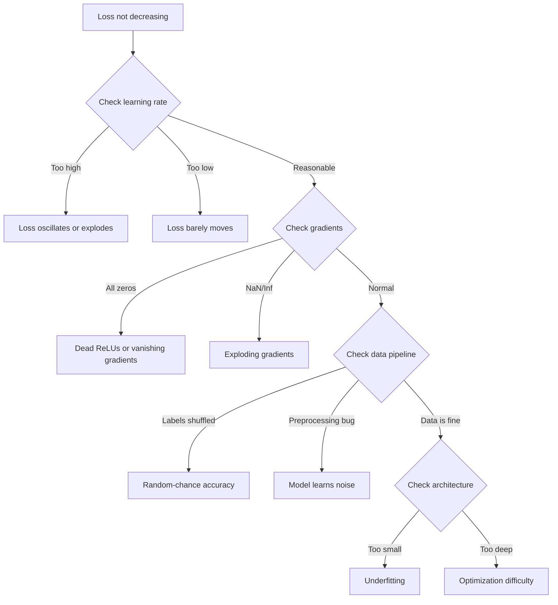
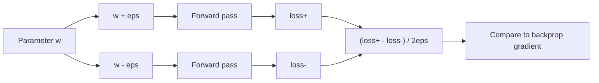
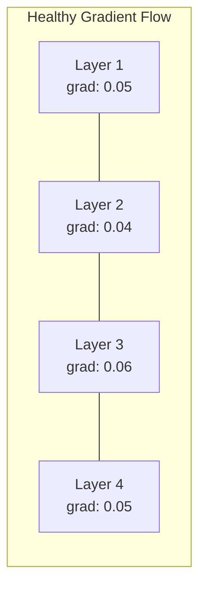
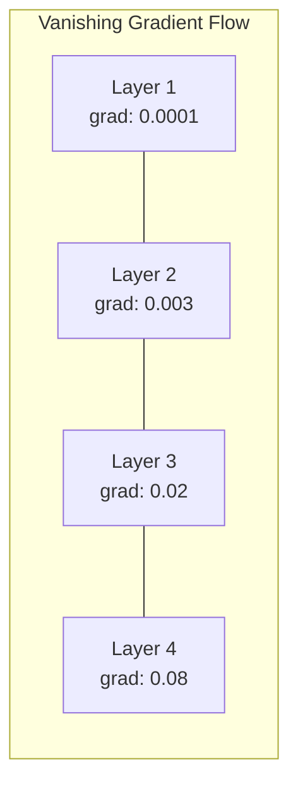
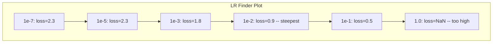

# Отладка нейронных сетей

> Ваша сеть скомпилировалась. Она запустилась. Она выдала число. Число неверно, и ничего не упало. Добро пожаловать в самый тяжёлый вид отладки — тот, где нет сообщения об ошибке.

**Тип:** Build
**Языки:** Python, PyTorch
**Предварительные требования:** Фаза 03, уроки 01-10 (особенно обратное распространение ошибки, функции потерь, оптимизаторы)
**Время:** ~90 минут

## Цели обучения

- Диагностировать типичные сбои нейронных сетей (потери NaN, плоская кривая потерь, переобучение, колебания) с помощью систематических стратегий отладки
- Применять технику «переобучение на одном пакете» для проверки правильности архитектуры модели и цикла обучения
- Проверять величины градиентов, распределения активаций и нормы весов, чтобы выявлять проблемы затухающих/взрывающихся градиентов
- Составить контрольный список отладки, охватывающий конвейер данных, архитектуру модели, функцию потерь, оптимизатор и скорость обучения

## Проблема

Традиционное программное обеспечение падает, когда оно сломано. Нулевой указатель выбрасывает исключение. Несовпадение типов приводит к ошибке компиляции. Ошибка на единицу даёт явно неверный результат.

Нейронные сети не дают вам такой роскоши.

Сломанная нейронная сеть выполняется до конца, печатает значение потерь и выдаёт предсказания. Потери могут уменьшаться. Предсказания могут выглядеть правдоподобно. Но модель молча неправа — учит обходные пути, запоминает шум или сходится к бесполезному локальному минимуму. Исследователи Google оценили, что 60-70% времени отладки ML тратится на «молчаливые» баги, которые не выдают ошибок, но снижают качество модели.

Разница между работающей моделью и сломанной часто заключается в одной неправильно расположенной строке: пропущенном `zero_grad()`, транспонированной размерности, скорости обучения, отличающейся в 10 раз. Каноническая статья «Recipe for Training Neural Networks» (2019) начинается с этого: «Самые распространённые ошибки в нейросетях — это баги, которые не приводят к сбою».

Этот урок учит находить такие баги.

## Концепция

### Мышление отладчика

Забудьте про отладку методом «print и молись». Отладка нейронных сетей требует систематического подхода, потому что цикл обратной связи медленный (минуты-часы на один запуск обучения), а симптомы неоднозначны (плохие потери могут означать 20 разных вещей).

Золотое правило: **начинайте с простого, добавляйте сложность по одному элементу за раз и проверяйте каждый элемент независимо.**



### Симптом 1: потери не уменьшаются

Это самая частая жалоба. Цикл обучения работает, эпохи идут одна за другой, а потери остаются плоскими или сильно колеблются.

**Неправильная скорость обучения.** Слишком высокая: потери колеблются или улетают в NaN. Слишком низкая: потери уменьшаются так медленно, что выглядят плоскими. Для Adam начинайте с 1e-3. Для SGD начинайте с 1e-1 или 1e-2. Всегда пробуйте 3 скорости обучения с шагом 10x (например, 1e-2, 1e-3, 1e-4), прежде чем делать вывод, что проблема в чём-то другом.

**Мёртвые ReLU.** Если нейрон ReLU получает большой отрицательный вход, он выдаёт 0, и его градиент равен 0. Он больше никогда не активируется. Если умирает достаточно нейронов, сеть не может обучаться. Проверка: выведите долю активаций, которые точно равны 0, после каждого слоя ReLU. Если >50% мертвы, переключитесь на LeakyReLU или уменьшите скорость обучения.

**Затухающие градиенты.** В глубоких сетях с активациями sigmoid или tanh градиенты экспоненциально уменьшаются по мере распространения назад. К моменту достижения первого слоя они ~0. Первые слои перестают обучаться. Исправление: используйте ReLU/GELU, добавьте остаточные связи или используйте пакетную нормализацию.

**Взрывающиеся градиенты.** Обратная проблема — градиенты растут экспоненциально. Часто встречается в RNN и очень глубоких сетях. Потери улетают в NaN. Исправление: отсечение градиента (`torch.nn.utils.clip_grad_norm_`), более низкая скорость обучения или добавление нормализации.

### Симптом 2: потери уменьшаются, но модель плоха

Потери уменьшаются. Точность на обучении достигает 99%. Но точность на тесте — 55%. Или модель выдаёт бессмысленные результаты на реальных данных.

**Переобучение.** Модель запоминает обучающие данные вместо того, чтобы выучить закономерности. Разрыв между потерями на обучении и валидации со временем растёт. Исправление: больше данных, дропаут, затухание весов, ранняя остановка, аугментация данных.

**Утечка данных.** Тестовые данные просочились в обучение. Точность подозрительно высока. Частые причины: перемешивание перед разбиением, предобработка со статистикой по всему набору данных, дублирующиеся образцы в разных частях разбиения. Исправление: сначала разбейте, затем предобрабатывайте, проверяйте на дубликаты.

**Ошибки меток.** 5-10% меток в большинстве реальных наборов данных неверны (Northcutt и др., 2021 — «Pervasive Label Errors in Test Sets»). Модель учит шум. Исправление: используйте confident learning для поиска и исправления неправильно размеченных примеров или используйте усечение потерь, чтобы игнорировать образцы с высокими потерями.

### Симптом 3: NaN или Inf в потерях

Значение потерь становится `nan` или `inf`. Обучение мертво.

**Слишком высокая скорость обучения.** Обновления градиента настолько перескакивают цель, что веса взрываются. Исправление: уменьшите в 10 раз.

**log(0) или log(отрицательного числа).** Функция потерь cross-entropy вычисляет `log(p)`. Если ваша модель выдаёт ровно 0 или отрицательную вероятность, логарифм взрывается. Исправление: ограничьте предсказания диапазоном `[eps, 1-eps]`, где `eps=1e-7`.

**Деление на ноль.** Пакетная нормализация делит на стандартное отклонение. Пакет с постоянными значениями имеет std=0. Исправление: добавьте эпсилон в знаменатель (PyTorch делает это по умолчанию, но пользовательские реализации могут этого не делать).

**Численное переполнение.** Большие активации, поданные в `exp()`, дают Inf. Softmax особенно склонен к этому. Исправление: вычтите максимум перед экспоненцированием (трюк log-sum-exp).

### Техника 1: проверка градиентов

Сравните ваши аналитические градиенты (из обратного распространения) с численными градиентами (из конечных разностей). Если они не совпадают, в вашем обратном проходе есть баг.

Численный градиент для параметра `w`:

```
grad_numerical = (loss(w + eps) - loss(w - eps)) / (2 * eps)
```

Метрика совпадения (относительная разница):

```
rel_diff = |grad_analytical - grad_numerical| / max(|grad_analytical|, |grad_numerical|, 1e-8)
```

Если `rel_diff < 1e-5`: верно. Если `rel_diff > 1e-3`: почти наверняка баг.



### Техника 2: статистика активаций

Отслеживайте среднее и стандартное отклонение активаций после каждого слоя во время обучения. Здоровые сети поддерживают активации со средним около 0 и std около 1 (после нормализации) или как минимум ограниченными.

| Индикатор здоровья | Среднее | Std | Диагноз |
|-----------------|------|-----|-----------|
| Здоровый | ~0 | ~1 | Сеть обучается нормально |
| Насыщенный | >>0 или <<0 | ~0 | Активации застряли на экстремальных значениях |
| Мёртвый | 0 | 0 | Нейроны мертвы (все нули) |
| Взрывающийся | >>10 | >>10 | Активации растут без ограничения |

### Техника 3: визуализация потока градиента

Постройте график средней величины градиента для каждого слоя. В здоровой сети величины градиентов должны быть примерно одинаковыми по всем слоям. Если у ранних слоёв градиенты в 1000 раз меньше, чем у поздних, у вас затухающие градиенты.





### Техника 4: тест «переобучение на одном пакете»

Самая важная техника отладки в глубоком обучении.

Возьмите один маленький пакет (8-32 образца). Обучайтесь на нём 100+ итераций. Потери должны упасть почти до нуля, а точность на обучении — достичь 100%. Если этого не происходит, в вашей модели или цикле обучения есть фундаментальный баг — не переходите к полному обучению.

Этот тест выявляет:
- Сломанные функции потерь
- Сломанные обратные проходы
- Архитектуру, слишком маленькую, чтобы представить данные
- Оптимизатор, не подключённый к параметрам модели
- Рассогласованные данные и метки

Это занимает 30 секунд и экономит часы отладки полных запусков обучения.

### Техника 5: поиск скорости обучения

Лесли Смит (2017) предложил проходить скорость обучения от очень маленькой (1e-7) до очень большой (10) в течение одной эпохи, записывая потери. Постройте график потерь от скорости обучения. Оптимальная скорость обучения примерно в 10 раз меньше той, при которой потери начинают уменьшаться быстрее всего.



Лучшая скорость обучения в этом примере: ~1e-3 (на один порядок раньше самой крутой точки).

### Типичные баги PyTorch

Это баги, которые отнимают больше всего совокупных часов у сообщества PyTorch:

| Баг | Симптом | Исправление |
|-----|---------|-----|
| Пропущен `optimizer.zero_grad()` | Градиенты накапливаются между пакетами, потери колеблются | Добавьте `optimizer.zero_grad()` перед `loss.backward()` |
| Пропущен `model.eval()` при тестировании | Дропаут и пакетная нормализация ведут себя по-разному, точность теста меняется между запусками | Добавьте `model.eval()` и `torch.no_grad()` |
| Неправильные формы тензоров | Молчаливое вещание (broadcasting) даёт неверные результаты, без ошибки | Выводите формы после каждой операции во время отладки |
| Несовпадение CPU/GPU | `RuntimeError: expected CUDA tensor` | Используйте `.to(device)` и для модели, И для данных |
| Тензоры не отсоединены | Граф вычислений растёт бесконечно, OOM | Используйте `.detach()` или `with torch.no_grad()` |
| Операции на месте ломают autograd | `RuntimeError: modified by in-place operation` | Замените `x += 1` на `x = x + 1` |
| Данные не нормализованы | Потери застревают на уровне случайного угадывания | Нормализуйте входы к mean=0, std=1 |
| Метки неправильного dtype | Cross-entropy ожидает `Long`, получен `Float` | Приведите метки: `labels.long()` |

### Главная таблица отладки

| Симптом | Вероятная причина | Что попробовать первым |
|---------|-------------|-------------------|
| Потери застряли на -log(1/num_classes) | Модель предсказывает равномерное распределение | Проверьте конвейер данных, убедитесь, что метки соответствуют входам |
| Потери NaN после нескольких шагов | Слишком высокая скорость обучения | Уменьшите скорость обучения в 10 раз |
| Потери NaN сразу | log(0) или деление на ноль | Добавьте эпсилон к операциям log/деления |
| Потери сильно колеблются | Слишком высокая скорость обучения или слишком маленький размер пакета | Уменьшите скорость обучения, увеличьте размер пакета |
| Потери уменьшаются, затем выходят на плато | Слишком высокая скорость обучения для этапа дообучения | Добавьте расписание скорости обучения (косинусное или ступенчатое затухание) |
| Точность на обучении высокая, на тесте низкая | Переобучение | Добавьте дропаут, затухание весов, больше данных |
| Точность на обучении = точности на тесте = случайной | Модель ничему не учится | Запустите тест «переобучение на одном пакете» |
| Точность на обучении = точности на тесте, но обе низкие | Недообучение | Более крупная модель, больше слоёв, больше признаков |
| Все градиенты нулевые | Мёртвые ReLU или отсоединённый граф вычислений | Переключитесь на LeakyReLU, проверьте `.requires_grad` |
| Нехватка памяти во время обучения | Слишком большой пакет или граф не освобождается | Уменьшите размер пакета, используйте `torch.no_grad()` для оценки |

```figure
learning-curves
```

## Создаём

Диагностический инструментарий, который отслеживает активации, градиенты и кривые потерь. Вы намеренно сломаете сеть и будете использовать инструментарий для диагностики каждой проблемы.

### Шаг 1: класс NetworkDebugger

Подключается к модели PyTorch хуками для записи статистики активаций и градиентов по каждому слою.

```python
import torch
import torch.nn as nn
import math


class NetworkDebugger:
    def __init__(self, model):
        self.model = model
        self.activation_stats = {}
        self.gradient_stats = {}
        self.loss_history = []
        self.lr_losses = []
        self.hooks = []
        self._register_hooks()

    def _register_hooks(self):
        for name, module in self.model.named_modules():
            if isinstance(module, (nn.Linear, nn.Conv2d, nn.ReLU, nn.LeakyReLU)):
                hook = module.register_forward_hook(self._make_activation_hook(name))
                self.hooks.append(hook)
                hook = module.register_full_backward_hook(self._make_gradient_hook(name))
                self.hooks.append(hook)

    def _make_activation_hook(self, name):
        def hook(module, input, output):
            with torch.no_grad():
                out = output.detach().float()
                self.activation_stats[name] = {
                    "mean": out.mean().item(),
                    "std": out.std().item(),
                    "fraction_zero": (out == 0).float().mean().item(),
                    "min": out.min().item(),
                    "max": out.max().item(),
                }
        return hook

    def _make_gradient_hook(self, name):
        def hook(module, grad_input, grad_output):
            if grad_output[0] is not None:
                with torch.no_grad():
                    grad = grad_output[0].detach().float()
                    self.gradient_stats[name] = {
                        "mean": grad.mean().item(),
                        "std": grad.std().item(),
                        "abs_mean": grad.abs().mean().item(),
                        "max": grad.abs().max().item(),
                    }
        return hook

    def record_loss(self, loss_value):
        self.loss_history.append(loss_value)

    def check_loss_health(self):
        if len(self.loss_history) < 2:
            return "NOT_ENOUGH_DATA"
        recent = self.loss_history[-10:]
        if any(math.isnan(v) or math.isinf(v) for v in recent):
            return "NAN_OR_INF"
        if len(self.loss_history) >= 20:
            first_half = sum(self.loss_history[:10]) / 10
            second_half = sum(self.loss_history[-10:]) / 10
            if second_half >= first_half * 0.99:
                return "NOT_DECREASING"
        if len(recent) >= 5:
            diffs = [recent[i+1] - recent[i] for i in range(len(recent)-1)]
            if max(diffs) - min(diffs) > 2 * abs(sum(diffs) / len(diffs)):
                return "OSCILLATING"
        return "HEALTHY"

    def check_activations(self):
        issues = []
        for name, stats in self.activation_stats.items():
            if stats["fraction_zero"] > 0.5:
                issues.append(f"DEAD_NEURONS: {name} has {stats['fraction_zero']:.0%} zero activations")
            if abs(stats["mean"]) > 10:
                issues.append(f"EXPLODING_ACTIVATIONS: {name} mean={stats['mean']:.2f}")
            if stats["std"] < 1e-6:
                issues.append(f"COLLAPSED_ACTIVATIONS: {name} std={stats['std']:.2e}")
        return issues if issues else ["HEALTHY"]

    def check_gradients(self):
        issues = []
        grad_magnitudes = []
        for name, stats in self.gradient_stats.items():
            grad_magnitudes.append((name, stats["abs_mean"]))
            if stats["abs_mean"] < 1e-7:
                issues.append(f"VANISHING_GRADIENT: {name} abs_mean={stats['abs_mean']:.2e}")
            if stats["abs_mean"] > 100:
                issues.append(f"EXPLODING_GRADIENT: {name} abs_mean={stats['abs_mean']:.2e}")
        if len(grad_magnitudes) >= 2:
            first_mag = grad_magnitudes[0][1]
            last_mag = grad_magnitudes[-1][1]
            if last_mag > 0 and first_mag / last_mag > 100:
                issues.append(f"GRADIENT_RATIO: first/last = {first_mag/last_mag:.0f}x (vanishing)")
        return issues if issues else ["HEALTHY"]

    def print_report(self):
        print("\n=== NETWORK DEBUGGER REPORT ===")
        print(f"\nLoss health: {self.check_loss_health()}")
        if self.loss_history:
            print(f"  Last 5 losses: {[f'{v:.4f}' for v in self.loss_history[-5:]]}")
        print("\nActivation diagnostics:")
        for item in self.check_activations():
            print(f"  {item}")
        print("\nGradient diagnostics:")
        for item in self.check_gradients():
            print(f"  {item}")
        print("\nPer-layer activation stats:")
        for name, stats in self.activation_stats.items():
            print(f"  {name}: mean={stats['mean']:.4f} std={stats['std']:.4f} zero={stats['fraction_zero']:.1%}")
        print("\nPer-layer gradient stats:")
        for name, stats in self.gradient_stats.items():
            print(f"  {name}: abs_mean={stats['abs_mean']:.2e} max={stats['max']:.2e}")

    def remove_hooks(self):
        for hook in self.hooks:
            hook.remove()
        self.hooks.clear()
```

### Шаг 2: тест «переобучение на одном пакете»

```python
def overfit_one_batch(model, x_batch, y_batch, criterion, lr=0.01, steps=200):
    optimizer = torch.optim.Adam(model.parameters(), lr=lr)
    model.train()
    print("\n=== OVERFIT ONE BATCH TEST ===")
    print(f"Batch size: {x_batch.shape[0]}, Steps: {steps}")

    for step in range(steps):
        optimizer.zero_grad()
        output = model(x_batch)
        loss = criterion(output, y_batch)
        loss.backward()
        optimizer.step()

        if step % 50 == 0 or step == steps - 1:
            with torch.no_grad():
                preds = (output > 0).float() if output.shape[-1] == 1 else output.argmax(dim=1)
                targets = y_batch if y_batch.dim() == 1 else y_batch.squeeze()
                acc = (preds.squeeze() == targets).float().mean().item()
            print(f"  Step {step:3d} | Loss: {loss.item():.6f} | Accuracy: {acc:.1%}")

    final_loss = loss.item()
    if final_loss > 0.1:
        print(f"\n  FAIL: Loss did not converge ({final_loss:.4f}). Model or training loop is broken.")
        return False
    print(f"\n  PASS: Loss converged to {final_loss:.6f}")
    return True
```

### Шаг 3: поиск скорости обучения

```python
def find_learning_rate(model, x_data, y_data, criterion, start_lr=1e-7, end_lr=10, steps=100):
    import copy
    original_state = copy.deepcopy(model.state_dict())
    optimizer = torch.optim.SGD(model.parameters(), lr=start_lr)
    lr_mult = (end_lr / start_lr) ** (1 / steps)

    model.train()
    results = []
    best_loss = float("inf")
    current_lr = start_lr

    print("\n=== LEARNING RATE FINDER ===")

    for step in range(steps):
        optimizer.zero_grad()
        output = model(x_data)
        loss = criterion(output, y_data)

        if math.isnan(loss.item()) or loss.item() > best_loss * 10:
            break

        best_loss = min(best_loss, loss.item())
        results.append((current_lr, loss.item()))

        loss.backward()
        optimizer.step()

        current_lr *= lr_mult
        for param_group in optimizer.param_groups:
            param_group["lr"] = current_lr

    model.load_state_dict(original_state)

    if len(results) < 10:
        print("  Could not complete LR sweep -- loss diverged too quickly")
        return results

    min_loss_idx = min(range(len(results)), key=lambda i: results[i][1])
    suggested_lr = results[max(0, min_loss_idx - 10)][0]

    print(f"  Swept {len(results)} steps from {start_lr:.0e} to {results[-1][0]:.0e}")
    print(f"  Minimum loss {results[min_loss_idx][1]:.4f} at lr={results[min_loss_idx][0]:.2e}")
    print(f"  Suggested learning rate: {suggested_lr:.2e}")

    return results
```

### Шаг 4: проверка градиентов

```python
def _flat_to_multi_index(flat_idx, shape):
    multi_idx = []
    remaining = flat_idx
    for dim in reversed(shape):
        multi_idx.insert(0, remaining % dim)
        remaining //= dim
    return tuple(multi_idx)


def gradient_check(model, x, y, criterion, eps=1e-4):
    model.train()
    x_double = x.double()
    y_double = y.double()
    model_double = model.double()

    print("\n=== GRADIENT CHECK ===")
    overall_max_diff = 0
    checked = 0

    for name, param in model_double.named_parameters():
        if not param.requires_grad:
            continue

        layer_max_diff = 0

        model_double.zero_grad()
        output = model_double(x_double)
        loss = criterion(output, y_double)
        loss.backward()
        analytical_grad = param.grad.clone()

        num_checks = min(5, param.numel())
        for i in range(num_checks):
            idx = _flat_to_multi_index(i, param.shape)
            original = param.data[idx].item()

            param.data[idx] = original + eps
            with torch.no_grad():
                loss_plus = criterion(model_double(x_double), y_double).item()

            param.data[idx] = original - eps
            with torch.no_grad():
                loss_minus = criterion(model_double(x_double), y_double).item()

            param.data[idx] = original

            numerical = (loss_plus - loss_minus) / (2 * eps)
            analytical = analytical_grad[idx].item()

            denom = max(abs(numerical), abs(analytical), 1e-8)
            rel_diff = abs(numerical - analytical) / denom

            layer_max_diff = max(layer_max_diff, rel_diff)
            checked += 1

        overall_max_diff = max(overall_max_diff, layer_max_diff)
        status = "OK" if layer_max_diff < 1e-5 else "MISMATCH"
        print(f"  {name}: max_rel_diff={layer_max_diff:.2e} [{status}]")

    model.float()

    print(f"\n  Checked {checked} parameters")
    if overall_max_diff < 1e-5:
        print("  PASS: Gradients match (rel_diff < 1e-5)")
    elif overall_max_diff < 1e-3:
        print("  WARN: Small differences (1e-5 < rel_diff < 1e-3)")
    else:
        print("  FAIL: Gradient mismatch detected (rel_diff > 1e-3)")
    return overall_max_diff
```

### Шаг 5: намеренно сломанные сети

Теперь примените инструментарий к сломанным сетям и продиагностируйте каждую из них.

```python
def demo_broken_networks():
    torch.manual_seed(42)
    x = torch.randn(64, 10)
    y = (x[:, 0] > 0).long()

    print("\n" + "=" * 60)
    print("BUG 1: Learning rate too high (lr=10)")
    print("=" * 60)
    model1 = nn.Sequential(nn.Linear(10, 32), nn.ReLU(), nn.Linear(32, 2))
    debugger1 = NetworkDebugger(model1)
    optimizer1 = torch.optim.SGD(model1.parameters(), lr=10.0)
    criterion = nn.CrossEntropyLoss()
    for step in range(20):
        optimizer1.zero_grad()
        out = model1(x)
        loss = criterion(out, y)
        debugger1.record_loss(loss.item())
        loss.backward()
        optimizer1.step()
    debugger1.print_report()
    debugger1.remove_hooks()

    print("\n" + "=" * 60)
    print("BUG 2: Dead ReLUs from bad initialization")
    print("=" * 60)
    model2 = nn.Sequential(nn.Linear(10, 32), nn.ReLU(), nn.Linear(32, 32), nn.ReLU(), nn.Linear(32, 2))
    with torch.no_grad():
        for m in model2.modules():
            if isinstance(m, nn.Linear):
                m.weight.fill_(-1.0)
                m.bias.fill_(-5.0)
    debugger2 = NetworkDebugger(model2)
    optimizer2 = torch.optim.Adam(model2.parameters(), lr=1e-3)
    for step in range(50):
        optimizer2.zero_grad()
        out = model2(x)
        loss = criterion(out, y)
        debugger2.record_loss(loss.item())
        loss.backward()
        optimizer2.step()
    debugger2.print_report()
    debugger2.remove_hooks()

    print("\n" + "=" * 60)
    print("BUG 3: Missing zero_grad (gradients accumulate)")
    print("=" * 60)
    model3 = nn.Sequential(nn.Linear(10, 32), nn.ReLU(), nn.Linear(32, 2))
    debugger3 = NetworkDebugger(model3)
    optimizer3 = torch.optim.SGD(model3.parameters(), lr=0.01)
    for step in range(50):
        out = model3(x)
        loss = criterion(out, y)
        debugger3.record_loss(loss.item())
        loss.backward()
        optimizer3.step()
    debugger3.print_report()
    debugger3.remove_hooks()

    print("\n" + "=" * 60)
    print("HEALTHY NETWORK: Correct setup for comparison")
    print("=" * 60)
    model_good = nn.Sequential(nn.Linear(10, 32), nn.ReLU(), nn.Linear(32, 2))
    debugger_good = NetworkDebugger(model_good)
    optimizer_good = torch.optim.Adam(model_good.parameters(), lr=1e-3)
    for step in range(50):
        optimizer_good.zero_grad()
        out = model_good(x)
        loss = criterion(out, y)
        debugger_good.record_loss(loss.item())
        loss.backward()
        optimizer_good.step()
    debugger_good.print_report()
    debugger_good.remove_hooks()

    print("\n" + "=" * 60)
    print("OVERFIT-ONE-BATCH TEST (healthy model)")
    print("=" * 60)
    model_test = nn.Sequential(nn.Linear(10, 32), nn.ReLU(), nn.Linear(32, 2))
    overfit_one_batch(model_test, x[:8], y[:8], criterion)

    print("\n" + "=" * 60)
    print("LEARNING RATE FINDER")
    print("=" * 60)
    model_lr = nn.Sequential(nn.Linear(10, 32), nn.ReLU(), nn.Linear(32, 2))
    find_learning_rate(model_lr, x, y, criterion)

    print("\n" + "=" * 60)
    print("GRADIENT CHECK")
    print("=" * 60)
    model_grad = nn.Sequential(nn.Linear(10, 8), nn.ReLU(), nn.Linear(8, 2))
    gradient_check(model_grad, x[:4], y[:4], criterion)
```

## Применяем

### Встроенные инструменты PyTorch

```python
import torch
import torch.nn as nn

model = nn.Sequential(
    nn.Linear(768, 256),
    nn.ReLU(),
    nn.Linear(256, 10),
)

with torch.autograd.detect_anomaly():
    output = model(input_tensor)
    loss = criterion(output, target)
    loss.backward()

for name, param in model.named_parameters():
    if param.grad is not None:
        print(f"{name}: grad_mean={param.grad.abs().mean():.2e}")
```

### Интеграция с Weights & Biases

```python
import wandb

wandb.init(project="debug-training")

for epoch in range(100):
    loss = train_one_epoch()
    wandb.log({
        "loss": loss,
        "lr": optimizer.param_groups[0]["lr"],
        "grad_norm": torch.nn.utils.clip_grad_norm_(model.parameters(), float("inf")),
    })

    for name, param in model.named_parameters():
        if param.grad is not None:
            wandb.log({f"grad/{name}": wandb.Histogram(param.grad.cpu().numpy())})
```

### TensorBoard

```python
from torch.utils.tensorboard import SummaryWriter

writer = SummaryWriter("runs/debug_experiment")

for epoch in range(100):
    loss = train_one_epoch()
    writer.add_scalar("Loss/train", loss, epoch)

    for name, param in model.named_parameters():
        writer.add_histogram(f"weights/{name}", param, epoch)
        if param.grad is not None:
            writer.add_histogram(f"gradients/{name}", param.grad, epoch)
```

### Контрольный список отладки (перед полным обучением)

1. Запустите тест «переобучение на одном пакете». Если он провален, остановитесь.
2. Выведите сводку модели — убедитесь, что число параметров разумно.
3. Выполните один прямой проход со случайными данными — проверьте форму выхода.
4. Обучайте 5 эпох — убедитесь, что потери уменьшаются.
5. Проверьте статистику активаций — нет мёртвых слоёв, нет взрывов.
6. Проверьте поток градиента — нет затухания, нет взрыва.
7. Проверьте конвейер данных — выведите 5 случайных образцов с метками.

## Публикуем

Этот урок производит:
- `outputs/prompt-nn-debugger.md` — промпт для диагностики сбоев обучения нейронных сетей
- `outputs/skill-debug-checklist.md` — контрольный список в виде дерева решений для отладки проблем обучения

Ключевые паттерны развёртывания для отладки:
- Добавляйте хуки мониторинга в производственные скрипты обучения
- Логируйте статистику активаций и градиентов в W&B или TensorBoard каждые N шагов
- Реализуйте автоматические оповещения для потерь NaN, мёртвых нейронов (>80% нулей) или взрыва градиента
- Всегда запускайте тест «переобучение на одном пакете» при изменении архитектур или конвейеров данных

## Упражнения

1. **Добавьте детектор взрывающегося градиента.** Модифицируйте `NetworkDebugger`, чтобы он обнаруживал превышение градиентами порога и автоматически предлагал значение для отсечения градиента. Проверьте на 20-слойной сети без нормализации.

2. **Постройте «воскреситель» мёртвых нейронов.** Напишите функцию, которая находит мёртвые нейроны ReLU (всегда выдающие 0) и переинициализирует их входящие веса с помощью инициализации Kaiming. Покажите, что это восстанавливает сеть, в которой мертвы >70% нейронов.

3. **Реализуйте поиск скорости обучения с построением графика.** Расширьте `find_learning_rate`, чтобы сохранять результаты в CSV, и напишите отдельный скрипт, который читает CSV и отображает кривую скорости обучения от потерь с помощью matplotlib. Определите оптимальную скорость обучения для ResNet-18 на CIFAR-10.

4. **Создайте валидатор конвейера данных.** Напишите функцию, которая проверяет: дублирующиеся образцы между обучающим и тестовым разбиениями, дисбаланс распределения меток (соотношение >10:1), нормализацию входов (среднее около 0, std около 1) и значения NaN/Inf в данных. Запустите её на намеренно повреждённом наборе данных.

5. **Отладьте реальный сбой.** Возьмите мини-фреймворк из урока 10, внесите тонкий баг (например, транспонируйте матрицу весов в обратном проходе) и используйте проверку градиентов, чтобы точно найти, у какого параметра неверные градиенты. Задокументируйте процесс отладки.

## Ключевые термины

| Термин | Как говорят люди | Что это на самом деле означает |
|------|----------------|----------------------|
| Молчаливый баг | «Оно работает, но выдаёт плохие результаты» | Баг, который не выдаёт ошибку, но снижает качество модели — доминирующий вид сбоя в ML |
| Мёртвый ReLU | «Нейроны умерли» | Нейрон ReLU, чей вход всегда отрицателен, поэтому он выдаёт 0 и навсегда получает нулевой градиент |
| Затухающие градиенты | «Ранние слои перестают учиться» | Градиенты экспоненциально уменьшаются по слоям, из-за чего веса в ранних слоях фактически замораживаются |
| Взрывающиеся градиенты | «Потери улетели в NaN» | Градиенты экспоненциально растут по слоям, вызывая настолько большие обновления весов, что происходит переполнение |
| Проверка градиентов | «Проверить, что обратное распространение корректно» | Сравнение аналитических градиентов из обратного распространения с численными градиентами из конечных разностей |
| Переобучение на одном пакете | «Самый важный тест отладки» | Обучение на одном маленьком пакете, чтобы убедиться, что модель МОЖЕТ учиться — если не может, что-то фундаментально сломано |
| Поиск скорости обучения | «Проход по диапазону для поиска правильной скорости обучения» | Экспоненциальное увеличение скорости обучения на протяжении одной эпохи с выбором скорости чуть до того, как потери начнут расходиться |
| Утечка данных | «Тестовые данные просочились в обучение» | Когда информация из тестового набора загрязняет обучение, давая искусственно завышенную точность |
| Статистика активаций | «Отслеживать здоровье слоя» | Отслеживание среднего, std и доли нулей на выходе каждого слоя для выявления мёртвых, насыщенных или взрывающихся нейронов |
| Отсечение градиента | «Ограничить величину градиента» | Уменьшение градиентов, когда их норма превышает порог, что предотвращает взрывающиеся обновления градиента |

## Дополнительные материалы

- Smith, «Cyclical Learning Rates for Training Neural Networks» (2017) — статья, представившая тест диапазона скорости обучения (поиск скорости обучения)
- Northcutt и др., «Pervasive Label Errors in Test Sets Destabilize Machine Learning Benchmarks» (2021) — показывает, что 3-6% меток в ImageNet, CIFAR-10 и других крупных бенчмарках неверны
- Zhang и др., «Understanding Deep Learning Requires Rethinking Generalization» (2017) — статья, показывающая, что нейронные сети могут запоминать случайные метки, поэтому и работает тест «переобучение на одном пакете»
- Документация PyTorch по `torch.autograd.detect_anomaly` и `torch.autograd.set_detect_anomaly` для встроенного обнаружения NaN/Inf
