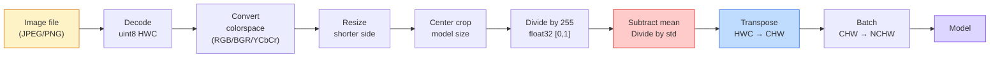
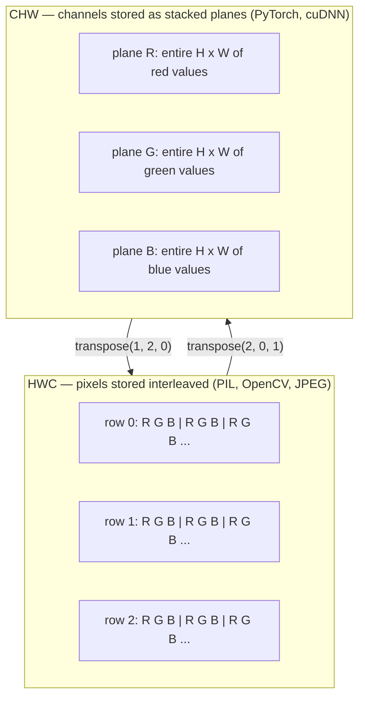

# Основы изображений — пиксели, каналы, цветовые пространства

> Изображение — это тензор отсчётов света. Любая модель компьютерного зрения, которую вы когда-либо будете использовать, начинается именно с этого факта.

**Тип:** Build
**Языки:** Python
**Предварительные требования:** Фаза 1, Урок 12 (Операции с тензорами), Фаза 3, Урок 11 (Введение в PyTorch)
**Время:** ~45 минут

## Цели обучения

- Объяснить, как непрерывная сцена дискретизируется в пиксели, и почему решения о сэмплировании и квантовании задают потолок для всех последующих моделей
- Читать, срезать и исследовать изображения как массивы NumPy, свободно переключаясь между раскладками HWC и CHW
- Преобразовывать между RGB, оттенками серого, HSV и YCbCr и обосновывать, зачем нужно каждое цветовое пространство
- Применять предобработку на уровне пикселей (нормализация, стандартизация, изменение размера, channel-first) именно так, как этого ожидает torchvision

## Проблема

Каждая статья, которую вы прочитаете, каждый предобученный набор весов, который вы скачаете, каждый API компьютерного зрения, который вы вызовете, предполагает конкретную кодировку входных данных. Передайте изображение `uint8` туда, где модель ожидает `float32`, — и код всё равно выполнится, молча выдав мусор. Подайте BGR на сеть, обученную на RGB, — и точность обвалится на десять пунктов. Дайте модели вход channels-last, когда она ожидает channels-first, — и первый свёрточный слой примет высоту за канал признаков. Ничто из этого не вызовет ошибку. Это просто испортит ваши метрики, и вы потратите неделю на поиск бага, который живёт в том, как вы загрузили файл.

Свёртка — операция несложная, если понимать, по чему именно она скользит. Сложность в том, что «изображение» означает разные вещи для камеры, JPEG-декодера, PIL, OpenCV, torchvision и CUDA-ядра. У каждого стека свой порядок осей, диапазон байтов и соглашение о каналах. Инженер по компьютерному зрению, который не удерживает всё это в голове, выпускает в продакшн сломанные конвейеры.

Этот урок закладывает фундамент, на который будет опираться остальная часть фазы. К концу урока вы будете знать, что такое пиксель, почему на пиксель приходится три числа, а не одно, что на самом деле означает «нормализация по статистике ImageNet», и как переходить между двумя-тремя раскладками, которые предполагаются во всех остальных уроках этой фазы.

## Концепция

### Полный конвейер предобработки одним взглядом

Любая продакшн-система компьютерного зрения — это одна и та же последовательность обратимых преобразований. Ошибитесь в одном шаге — и модель увидит вход, отличный от того, на котором она обучалась.



Красный и синий блоки — это места, где живут 80% тихих сбоев: отсутствующая стандартизация и неверная раскладка.

### Пиксель — это отсчёт, а не квадрат

Сенсор камеры считает фотоны, попадающие на сетку крошечных детекторов. Каждый детектор накапливает свет в течение доли секунды и выдаёт напряжение, пропорциональное числу попавших в него фотонов. Затем сенсор дискретизирует это напряжение в целое число. Один детектор становится одним пикселем.

```
Continuous scene                 Sensor grid                     Digital image
(infinite detail)                (H x W detectors)               (H x W integers)

    ~~~~~                        +--+--+--+--+--+                 210 198 180 155 120
   ~   ~   ~                     |  |  |  |  |  |                 205 195 178 152 118
  ~ light ~      ---->           +--+--+--+--+--+     ---->       200 190 175 150 115
   ~~~~~                         |  |  |  |  |  |                 195 185 170 148 112
                                 +--+--+--+--+--+                 188 180 165 145 108
```

На этом шаге происходят два выбора, которые задают потолок для всего, что будет дальше:

- **Пространственное сэмплирование** определяет, сколько детекторов приходится на градус сцены. Слишком мало — и края становятся зубчатыми (алиасинг). Слишком много — и хранение и вычисления взрываются.
- **Квантование интенсивности** определяет, насколько мелко разбивается напряжение на уровни. 8 бит дают 256 уровней и являются стандартом для отображения. 10, 12, 16 бит дают более плавные градиенты и важны для медицинской визуализации, HDR и конвейеров работы с сырыми данными сенсора (raw).

Пиксель — это не цветной квадрат с площадью. Это единичное измерение. Когда вы меняете размер изображения или поворачиваете его, вы пересэмплируете эту сетку измерений.

### Почему три канала

Один детектор считает фотоны по всему видимому спектру — это и есть оттенки серого. Чтобы получить цвет, сенсор покрывают мозаикой из красных, зелёных и синих фильтров. После демозаики в каждой пространственной точке оказываются три целых числа: отклик соседних детекторов с красным, зелёным и синим фильтром. Эти три числа образуют RGB-триплет пикселя.

```
One pixel in memory:

    (R, G, B) = (210, 140, 30)   <- reddish-orange

An H x W RGB image:

    shape (H, W, 3)     stored as   H rows of W pixels of 3 values
                                    each in [0, 255] for uint8
```

Число три не магическое. Камеры глубины добавляют канал Z. Спутники добавляют инфракрасные и ультрафиолетовые диапазоны. Медицинские снимки часто имеют один канал (рентген, КТ) или множество (гиперспектральные). Число каналов — это последняя ось; свёрточные слои учатся смешивать данные вдоль неё.

### Две раскладки: HWC и CHW

Один и тот же тензор, два порядка осей. Каждая библиотека выбирает свой.

```
HWC (height, width, channels)           CHW (channels, height, width)

   W ->                                    H ->
  +-----+-----+-----+                     +-----+-----+
H |R G B|R G B|R G B|                   C |R R R R R R|
| +-----+-----+-----+                   | +-----+-----+
v |R G B|R G B|R G B|                   v |G G G G G G|
  +-----+-----+-----+                     +-----+-----+
                                          |B B B B B B|
                                          +-----+-----+

   PIL, OpenCV, matplotlib,              PyTorch, most deep learning
   almost every image file on disk       frameworks, cuDNN kernels
```

CHW существует потому, что ядра свёртки скользят по H и W. Если ось каналов стоит первой, каждое ядро видит непрерывную 2D-плоскость на канал, что чисто векторизуется. Форматы файлов на диске сохраняют HWC, потому что это соответствует тому, как строки развёртки выходят из сенсора.

Однострочное преобразование, которое вы наберёте тысячу раз:

```
img_chw = img_hwc.transpose(2, 0, 1)      # NumPy
img_chw = img_hwc.permute(2, 0, 1)        # PyTorch tensor
```

Раскладка памяти, наглядно:



### Диапазоны байтов и dtype

Доминируют три соглашения:

| Соглашение | dtype | Диапазон | Где встречается |
|------------|-------|-------|------------------|
| Необработанные (raw) | `uint8` | [0, 255] | Файлы на диске, вывод PIL, OpenCV |
| Нормализованные | `float32` | [0.0, 1.0] | После `img.astype('float32') / 255` |
| Стандартизированные | `float32` | примерно [-2, +2] | После вычитания среднего и деления на std |

Свёрточные сети обучались на стандартизированных входах. Статистика ImageNet `mean=[0.485, 0.456, 0.406]`, `std=[0.229, 0.224, 0.225]` — это среднее арифметическое и стандартное отклонение трёх каналов по всему обучающему набору ImageNet, вычисленные на нормализованных в [0, 1] пикселях. Подача сырых `uint8` в модель, которая ожидает стандартизированный float, — самый распространённый тихий сбой в прикладном компьютерном зрении.

### Цветовые пространства и зачем они нужны

RGB — это формат съёмки, но не всегда самое полезное представление для модели.

```
 RGB               HSV                       YCbCr / YUV

 R red             H hue (angle 0-360)       Y luminance (brightness)
 G green           S saturation (0-1)        Cb chroma blue-yellow
 B blue            V value/brightness (0-1)  Cr chroma red-green

 Linear to         Separates color from      Separates brightness from
 sensor output     brightness. Useful for    color. JPEG and most video
                   color thresholding, UI    codecs compress the chroma
                   sliders, simple filters   channels harder because the
                                             human eye is less sensitive
                                             to chroma detail than to Y.
```

Для большинства современных CNN на вход подают RGB. С другими пространствами вы сталкиваетесь, когда:

- **HSV** — классический код компьютерного зрения, сегментация по цвету, баланс белого.
- **YCbCr** — чтение внутренностей JPEG, видеоконвейеры, модели суперразрешения, работающие только с Y.
- **Оттенки серого (Grayscale)** — OCR, модели для документов, любые случаи, где цвет — это мешающая переменная, а не сигнал.

Оттенки серого из RGB — это взвешенная сумма, а не среднее, потому что человеческий глаз чувствительнее к зелёному, чем к красному или синему:

```
Y = 0.299 R + 0.587 G + 0.114 B       (ITU-R BT.601, the classic weights)
```

### Соотношение сторон, изменение размера и интерполяция

У каждой модели фиксированный размер входа (224x224 для большинства классификаторов ImageNet, 384x384 или 512x512 для современных детекторов). Ваши изображения редко совпадают с ним. Есть три значимых варианта изменения размера:

- **Изменить размер по короткой стороне, затем взять центральный кроп** — стандартный рецепт ImageNet. Сохраняет соотношение сторон, отбрасывает полосу краевых пикселей.
- **Изменить размер и добавить паддинг** — сохраняет соотношение сторон и все пиксели, добавляет чёрные полосы. Стандарт для детекции и OCR.
- **Изменить размер напрямую до целевого** — растягивает изображение. Дёшево, искажает геометрию, приемлемо для многих задач классификации.

Метод интерполяции определяет, как вычисляются промежуточные пиксели, когда новая сетка не совпадает со старой:

```
Nearest neighbour     fastest, blocky, only choice for masks/labels
Bilinear              fast, smooth, default for most image resizing
Bicubic               slower, sharper on upscaling
Lanczos               slowest, best quality, used for final display
```

Эмпирическое правило: bilinear для обучения, bicubic или lanczos для материалов, на которые вы будете смотреть, nearest для всего, что содержит целочисленные ID классов.

```figure
conv-output-size
```

## Создаём

### Шаг 1: загрузите изображение и изучите его форму

Используйте Pillow, чтобы загрузить любой JPEG или PNG, преобразуйте в NumPy и выведите то, что получилось. Для детерминированного примера, который работает офлайн, сгенерируем изображение синтетически.

```python
import numpy as np
from PIL import Image

def synthetic_rgb(h=128, w=192, seed=0):
    rng = np.random.default_rng(seed)
    yy, xx = np.meshgrid(np.linspace(0, 1, h), np.linspace(0, 1, w), indexing="ij")
    r = (np.sin(xx * 6) * 0.5 + 0.5) * 255
    g = yy * 255
    b = (1 - yy) * xx * 255
    rgb = np.stack([r, g, b], axis=-1) + rng.normal(0, 6, (h, w, 3))
    return np.clip(rgb, 0, 255).astype(np.uint8)

arr = synthetic_rgb()
# Or load from disk:
# arr = np.asarray(Image.open("your_image.jpg").convert("RGB"))

print(f"type:   {type(arr).__name__}")
print(f"dtype:  {arr.dtype}")
print(f"shape:  {arr.shape}     # (H, W, C)")
print(f"min:    {arr.min()}")
print(f"max:    {arr.max()}")
print(f"pixel at (0, 0): {arr[0, 0]}")
```

Ожидаемый вывод: `shape: (H, W, 3)`, `dtype: uint8`, диапазон `[0, 255]`. Это каноническое представление на диске независимо от того, откуда взялись байты — с камеры, из JPEG-декодера или от синтетического генератора.

### Шаг 2: разделите каналы и переставьте раскладку

Извлеките R, G, B по отдельности, затем преобразуйте из HWC в CHW для PyTorch.

```python
R = arr[:, :, 0]
G = arr[:, :, 1]
B = arr[:, :, 2]
print(f"R shape: {R.shape}, mean: {R.mean():.1f}")
print(f"G shape: {G.shape}, mean: {G.mean():.1f}")
print(f"B shape: {B.shape}, mean: {B.mean():.1f}")

arr_chw = arr.transpose(2, 0, 1)
print(f"\nHWC shape: {arr.shape}")
print(f"CHW shape: {arr_chw.shape}")
```

Три плоскости в оттенках серого, по одной на канал. CHW просто переставляет оси; копирование данных строго не требуется, если это позволяет раскладка памяти.

### Шаг 3: преобразования в оттенки серого и HSV

Оттенки серого через взвешенную сумму, затем ручное преобразование RGB в HSV.

```python
def rgb_to_grayscale(rgb):
    weights = np.array([0.299, 0.587, 0.114], dtype=np.float32)
    return (rgb.astype(np.float32) @ weights).astype(np.uint8)

def rgb_to_hsv(rgb):
    rgb_f = rgb.astype(np.float32) / 255.0
    r, g, b = rgb_f[..., 0], rgb_f[..., 1], rgb_f[..., 2]
    cmax = np.max(rgb_f, axis=-1)
    cmin = np.min(rgb_f, axis=-1)
    delta = cmax - cmin

    h = np.zeros_like(cmax)
    mask = delta > 0
    rmax = mask & (cmax == r)
    gmax = mask & (cmax == g)
    bmax = mask & (cmax == b)
    h[rmax] = ((g[rmax] - b[rmax]) / delta[rmax]) % 6
    h[gmax] = ((b[gmax] - r[gmax]) / delta[gmax]) + 2
    h[bmax] = ((r[bmax] - g[bmax]) / delta[bmax]) + 4
    h = h * 60.0

    s = np.where(cmax > 0, delta / cmax, 0)
    v = cmax
    return np.stack([h, s, v], axis=-1)

gray = rgb_to_grayscale(arr)
hsv = rgb_to_hsv(arr)
print(f"gray shape: {gray.shape}, range: [{gray.min()}, {gray.max()}]")
print(f"hsv   shape: {hsv.shape}")
print(f"hue range: [{hsv[..., 0].min():.1f}, {hsv[..., 0].max():.1f}] degrees")
print(f"sat range: [{hsv[..., 1].min():.2f}, {hsv[..., 1].max():.2f}]")
print(f"val range: [{hsv[..., 2].min():.2f}, {hsv[..., 2].max():.2f}]")
```

Оттенок (hue) выражен в градусах, а насыщенность (saturation) и яркость (value) — в диапазоне [0, 1]. Это соответствует соглашению OpenCV `hsv_full`.

### Шаг 4: нормализуйте, стандартизируйте и отмените это

Пройдите путь от сырых байтов до того самого тензора, который ожидает предобученная модель ImageNet, а затем обратно.

```python
mean = np.array([0.485, 0.456, 0.406], dtype=np.float32)
std = np.array([0.229, 0.224, 0.225], dtype=np.float32)

def preprocess_imagenet(rgb_uint8):
    x = rgb_uint8.astype(np.float32) / 255.0
    x = (x - mean) / std
    x = x.transpose(2, 0, 1)
    return x

def deprocess_imagenet(chw_float32):
    x = chw_float32.transpose(1, 2, 0)
    x = x * std + mean
    x = np.clip(x * 255.0, 0, 255).astype(np.uint8)
    return x

x = preprocess_imagenet(arr)
print(f"preprocessed shape: {x.shape}     # (C, H, W)")
print(f"preprocessed dtype: {x.dtype}")
print(f"preprocessed mean per channel:  {x.mean(axis=(1, 2)).round(3)}")
print(f"preprocessed std  per channel:  {x.std(axis=(1, 2)).round(3)}")

roundtrip = deprocess_imagenet(x)
max_diff = np.abs(roundtrip.astype(int) - arr.astype(int)).max()
print(f"roundtrip max pixel diff: {max_diff}    # should be 0 or 1")
```

Среднее по каждому каналу должно быть близко к нулю, std — близко к единице. Пара preprocess/deprocess — это именно то, что под капотом делает каждый вызов `transforms.Normalize` в torchvision.

### Шаг 5: измените размер тремя методами интерполяции

Сравните nearest, bilinear и bicubic на увеличении масштаба, чтобы разница была заметна.

```python
target = (arr.shape[0] * 3, arr.shape[1] * 3)

nearest = np.asarray(Image.fromarray(arr).resize(target[::-1], Image.NEAREST))
bilinear = np.asarray(Image.fromarray(arr).resize(target[::-1], Image.BILINEAR))
bicubic = np.asarray(Image.fromarray(arr).resize(target[::-1], Image.BICUBIC))

def local_roughness(x):
    gy = np.diff(x.astype(float), axis=0)
    gx = np.diff(x.astype(float), axis=1)
    return float(np.abs(gy).mean() + np.abs(gx).mean())

for name, out in [("nearest", nearest), ("bilinear", bilinear), ("bicubic", bicubic)]:
    print(f"{name:>8}  shape={out.shape}  roughness={local_roughness(out):6.2f}")
```

Nearest набирает наибольшую «шероховатость», потому что сохраняет резкие края. Bilinear — самый гладкий. Bicubic находится между ними, сохраняя воспринимаемую резкость без ступенчатых артефактов.

## Применяем

`torchvision.transforms` объединяет всё вышеописанное в единый компонуемый конвейер. Код ниже воспроизводит именно то, что делает `preprocess_imagenet`, плюс изменение размера и кроп.

```python
import torch
from torchvision import transforms
from PIL import Image

img = Image.fromarray(synthetic_rgb(256, 256))

pipeline = transforms.Compose([
    transforms.Resize(256),
    transforms.CenterCrop(224),
    transforms.ToTensor(),
    transforms.Normalize(mean=[0.485, 0.456, 0.406], std=[0.229, 0.224, 0.225]),
])

x = pipeline(img)
print(f"tensor type:  {type(x).__name__}")
print(f"tensor dtype: {x.dtype}")
print(f"tensor shape: {tuple(x.shape)}      # (C, H, W)")
print(f"per-channel mean: {x.mean(dim=(1, 2)).tolist()}")
print(f"per-channel std:  {x.std(dim=(1, 2)).tolist()}")

batch = x.unsqueeze(0)
print(f"\nbatched shape: {tuple(batch.shape)}   # (N, C, H, W) — ready for a model")
```

Четыре шага строго в этом порядке: `Resize(256)` масштабирует короткую сторону до 256; `CenterCrop(224)` берёт из центра фрагмент 224x224; `ToTensor()` делит на 255 и меняет HWC на CHW; `Normalize` вычитает среднее ImageNet и делит на std. Изменение этого порядка молча меняет то, что попадает в модель.

## Публикуем

Этот урок производит:

- `outputs/prompt-vision-preprocessing-audit.md` — промпт, который превращает любую карточку модели или набора данных в чек-лист точных инвариантов предобработки, которые обязана соблюдать команда.
- `outputs/skill-image-tensor-inspector.md` — навык (skill), который для любого тензора или массива в форме изображения сообщает dtype, раскладку, диапазон и то, выглядит ли он сырым, нормализованным или стандартизированным.

## Упражнения

1. **(Лёгкий)** Загрузите JPEG с помощью OpenCV (`cv2.imread`) и с помощью Pillow. Выведите обе формы и пиксель в `(0, 0)`. Объясните разницу в порядке каналов, затем напишите однострочное преобразование, которое делает массив OpenCV идентичным массиву Pillow.
2. **(Средний)** Напишите `standardize(img, mean, std)` и обратную к ней функцию так, чтобы вместе они проходили тест `roundtrip_max_diff <= 1` на любом изображении uint8. Ваши функции должны работать и на одном изображении в HWC, и на пакете в NCHW при одном и том же вызове.
3. **(Сложный)** Возьмите 3-канальный тензор, стандартизированный по ImageNet, и пропустите его через свёртку 1x1, которая учит взвешенную смесь RGB в один канал оттенков серого. Инициализируйте веса как `[0.299, 0.587, 0.114]`, заморозьте их и убедитесь, что выход совпадает с вашей ручной `rgb_to_grayscale` в пределах ошибки округления. Какие ещё классические преобразования цветового пространства можно записать как свёртки 1x1?

## Ключевые термины

| Термин | Что говорят | Что это значит на самом деле |
|------|----------------|----------------------|
| Пиксель | «Цветной квадрат» | Один отсчёт интенсивности света в одной точке сетки — три числа для цвета, одно для оттенков серого |
| Канал | «Цвет» | Одна из параллельных пространственных сеток, сложенных в тензор изображения; последняя ось в HWC, первая в CHW |
| HWC / CHW | «Форма» | Порядок осей тензора изображения; диск и PIL используют HWC, PyTorch и cuDNN — CHW |
| Нормализация | «Масштабировать изображение» | Разделить на 255, чтобы пиксели оказались в [0, 1] — необходимо, но не достаточно |
| Стандартизация | «Центрировать в нуле» | Вычесть среднее и разделить на std по каждому каналу, чтобы распределение входа совпадало с тем, на котором обучалась модель |
| Преобразование в оттенки серого | «Усреднить каналы» | Взвешенная сумма с коэффициентами 0.299/0.587/0.114, соответствующая восприятию яркости человеческим глазом |
| Интерполяция | «Как resize выбирает пиксели» | Правило, определяющее выходные значения, когда новая сетка не совпадает со старой — nearest для меток, bilinear для обучения, bicubic для отображения |
| Соотношение сторон | «Ширина делить на высоту» | Отношение, которое отличает «изменить размер и добавить паддинг» от «изменить размер и растянуть» |

## Дополнительные материалы

- [Charles Poynton — A Guided Tour of Color Space](https://poynton.ca/PDFs/Guided_tour.pdf) — самое ясное техническое изложение того, почему существует так много цветовых пространств и когда какое из них важно
- [PyTorch Vision Transforms Docs](https://pytorch.org/vision/stable/transforms.html) — полный конвейер преобразований, которые вы будете реально компоновать в продакшне
- [How JPEG Works (Colt McAnlis)](https://www.youtube.com/watch?v=F1kYBnY6mwg) — чёткий наглядный обзор субдискретизации цветности (chroma subsampling), DCT и того, почему JPEG кодирует YCbCr, а не RGB
- [ImageNet Preprocessing Conventions (torchvision models)](https://pytorch.org/vision/stable/models.html) — источник истины для `mean=[0.485, 0.456, 0.406]` и того, почему этого ожидает каждая модель из зоопарка
