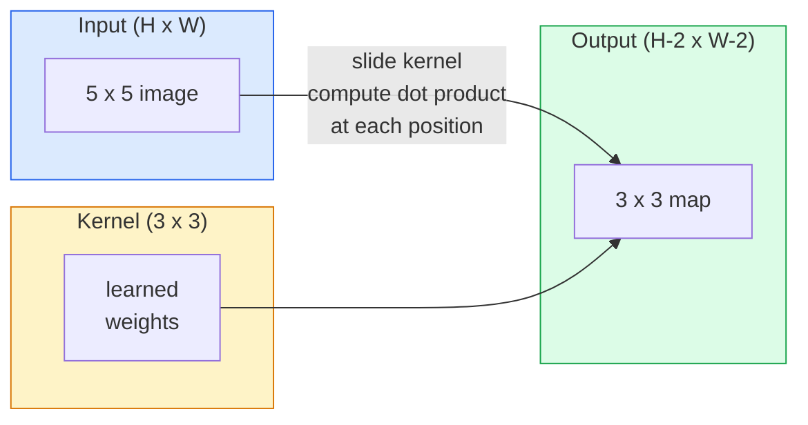
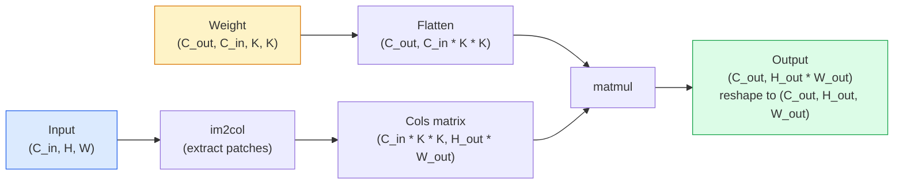

# Свёртки с нуля

> Свёртка — это крошечный полносвязный слой, который вы скользите по изображению, разделяя одни и те же веса в каждой позиции.

**Тип:** Build
**Языки:** Python
**Предварительные требования:** Фаза 3 (Глубокое обучение), Фаза 4, Урок 01 (Основы изображений)
**Время:** ~75 минут

## Цели обучения

- Реализовать 2D-свёртку с нуля, используя только NumPy, включая версию с вложенными циклами и векторизованную версию `im2col`
- Вычислить выходной пространственный размер для любого сочетания размера входа, размера ядра, паддинга и шага, и обосновать формулу `(H - K + 2P) / S + 1`
- Вручную спроектировать ядра (край, размытие, резкость, Собель) и объяснить, почему каждое из них даёт именно такой паттерн активаций
- Собрать свёртки в стек, извлекающий признаки, и связать глубину стека с размером рецептивного поля

## Проблема

Полносвязный слой на RGB-изображении 224x224 потребовал бы 224 * 224 * 3 = 150 528 входных весов на нейрон. Один скрытый слой из 1000 юнитов — это уже 150 миллионов параметров, прежде чем вы выучили хоть что-то полезное. Хуже того, у такого слоя нет понятия, что собака в верхнем левом углу и собака в нижнем правом — один и тот же паттерн. Он считает каждую позицию пикселя независимой, что в точности неверно для изображений: сдвиг кота на три пикселя не должен заставлять сеть переучивать понятие заново.

Два свойства, которые нужны модели для изображений, — это **эквивариантность к сдвигу** (translation equivariance: выход сдвигается, когда сдвигается вход) и **разделение параметров** (parameter sharing: один и тот же детектор признаков работает везде). Полносвязные слои не дают ни того, ни другого. Свёртка даёт оба свойства бесплатно.

Свёртка была придумана не для глубокого обучения. Это та же операция, что лежит в основе сжатия JPEG, гауссового размытия в Photoshop, обнаружения краёв в промышленном зрении и любого аудиофильтра, когда-либо выпущенного. Причина, по которой CNN доминировали на ImageNet с 2012 по 2020 год, в том, что свёртка — правильный априор для данных, где соседние значения связаны и один и тот же паттерн может встретиться где угодно.

## Концепция

### Одно ядро, скользящее по входу

2D-свёртка берёт небольшую матрицу весов, называемую ядром (или фильтром), скользит ею по входу и в каждой позиции вычисляет сумму поэлементных произведений. Эта сумма становится одним выходным пикселем.



Конкретный пример 3x3 на входе 5x5 (без паддинга, шаг 1):

```
Input X (5 x 5):                Kernel W (3 x 3):

  1  2  0  1  2                   1  0 -1
  0  1  3  1  0                   2  0 -2
  2  1  0  2  1                   1  0 -1
  1  0  2  1  3
  2  1  1  0  1

The kernel slides across every valid 3 x 3 window. Output Y is 3 x 3:

 Y[0,0] = sum( W * X[0:3, 0:3] )
 Y[0,1] = sum( W * X[0:3, 1:4] )
 Y[0,2] = sum( W * X[0:3, 2:5] )
 Y[1,0] = sum( W * X[1:4, 0:3] )
 ... and so on
```

Эта одна формула — **разделяемые веса, локальность, скользящее окно** — и есть вся идея целиком. Всё остальное — бухгалтерия.

### Формула выходного размера

При входном пространственном размере `H`, размере ядра `K`, паддинге `P`, шаге `S`:

```
H_out = floor( (H - K + 2P) / S ) + 1
```

Запомните это. Вы будете вычислять это десятки раз для каждой архитектуры.

| Сценарий | H | K | P | S | H_out |
|----------|---|---|---|---|-------|
| Свёртка без паддинга (valid) | 32 | 3 | 0 | 1 | 30 |
| Свёртка same (сохраняет размер) | 32 | 3 | 1 | 1 | 32 |
| Уменьшение разрешения в 2 раза | 32 | 3 | 1 | 2 | 16 |
| Пулинг 2x2 | 32 | 2 | 0 | 2 | 16 |
| Большое рецептивное поле | 32 | 7 | 3 | 2 | 16 |

«Same padding» означает выбор P так, чтобы H_out == H при S == 1. Для нечётного K это P = (K - 1) / 2. Именно поэтому доминируют ядра 3x3 — это наименьшее нечётное ядро, у которого всё ещё есть центр.

### Паддинг

Без паддинга каждая свёртка уменьшает карту признаков. Сложите 20 таких свёрток, и ваше изображение 224x224 станет 184x184, что расходует вычисления на границе и усложняет остаточные соединения, которым нужны совпадающие формы.

```
Zero padding (P = 1) on a 5 x 5 input:

  0  0  0  0  0  0  0
  0  1  2  0  1  2  0
  0  0  1  3  1  0  0
  0  2  1  0  2  1  0       Now the kernel can centre on pixel
  0  1  0  2  1  3  0       (0, 0) and still have three rows and
  0  2  1  1  0  1  0       three columns of values to multiply.
  0  0  0  0  0  0  0
```

Режимы, встречающиеся на практике: `zero` (самый распространённый), `reflect` (зеркальное отражение края, избегает жёстких границ в генеративных моделях), `replicate` (копирование края), `circular` (заворачивание, используется в тороидальных задачах).

### Шаг

Шаг (stride) — это размер шага скольжения. `stride=1` — значение по умолчанию. `stride=2` уменьшает пространственные размеры вдвое и является классическим способом уменьшить разрешение внутри CNN без отдельного слоя пулинга — каждая современная архитектура (ResNet, ConvNeXt, MobileNet) где-нибудь использует свёртки с шагом вместо max-pool.

```
Stride 1 on a 5 x 5 input, 3 x 3 kernel:

  starts: (0,0) (0,1) (0,2)        -> output row 0
          (1,0) (1,1) (1,2)        -> output row 1
          (2,0) (2,1) (2,2)        -> output row 2

  Output: 3 x 3

Stride 2 on the same input:

  starts: (0,0) (0,2)              -> output row 0
          (2,0) (2,2)              -> output row 1

  Output: 2 x 2
```

### Несколько входных каналов

Реальные изображения имеют три канала. Свёртка 3x3 на RGB-входе на самом деле является объёмом 3x3x3: одним срезом 3x3 на каждый входной канал. В каждой пространственной позиции вы умножаете и суммируете по всем трём срезам и добавляете смещение (bias).

```
Input:   (C_in,  H,  W)        3 x 5 x 5
Kernel:  (C_in,  K,  K)        3 x 3 x 3 (one kernel)
Output:  (1,     H', W')       2D map

For a layer that produces C_out output channels, you stack C_out kernels:

Weight:  (C_out, C_in, K, K)   e.g. 64 x 3 x 3 x 3
Output:  (C_out, H', W')       64 x 3 x 3

Parameter count: C_out * C_in * K * K + C_out   (the + C_out is biases)
```

Последняя строка — та, что вы будете вычислять при планировании модели. 64-канальная свёртка 3x3 на 3-канальном входе имеет `64 * 3 * 3 * 3 + 64 = 1,792` параметра. Дёшево.

### Приём im2col

Вложенные циклы легко читать, но они медленные. GPU хотят большие матричные умножения. Приём: развернуть каждое окно рецептивного поля входа в один столбец большой матрицы, развернуть ядро в строку, и вся свёртка становится единственным матричным умножением.



Каждая продакшн-реализация свёртки — это некоторый вариант этого приёма плюс приёмы разбиения на кэш-тайлы (прямая свёртка, Winograd, FFT-свёртка для больших ядер). Поймите im2col — и вы поймёте суть.

### Рецептивное поле

Одна свёртка 3x3 смотрит на 9 входных пикселей. Сложите две свёртки 3x3, и нейрон во втором слое смотрит на 5x5 входных пикселей. Три свёртки 3x3 дают 7x7. В общем виде:

```
RF after L stacked K x K convs (stride 1) = 1 + L * (K - 1)

With strides:   RF grows multiplicatively with stride along each layer.
```

Вся причина, по которой работает подход «3x3 и только 3x3» (VGG, ResNet, ConvNeXt), в том, что две свёртки 3x3 видят ту же область входа, что и одна свёртка 5x5, но с меньшим числом параметров и дополнительной нелинейностью между ними.

```figure
convolution-kernel
```

## Создаём

### Шаг 1: Дополните массив паддингом

Начните с наименьшего примитива: функции, которая дополняет нулями массив H x W.

```python
import numpy as np

def pad2d(x, p):
    if p == 0:
        return x
    h, w = x.shape[-2:]
    out = np.zeros(x.shape[:-2] + (h + 2 * p, w + 2 * p), dtype=x.dtype)
    out[..., p:p + h, p:p + w] = x
    return out

x = np.arange(9).reshape(3, 3)
print(x)
print()
print(pad2d(x, 1))
```

Приём с хвостовыми осями `x.shape[:-2]` означает, что одна и та же функция работает на `(H, W)`, `(C, H, W)` или `(N, C, H, W)` без изменений.

### Шаг 2: 2D-свёртка с вложенными циклами

Эталонная реализация — медленная, но однозначная. Именно это в принципе делает `torch.nn.functional.conv2d`.

```python
def conv2d_naive(x, w, b=None, stride=1, padding=0):
    c_in, h, w_in = x.shape
    c_out, c_in_w, kh, kw = w.shape
    assert c_in == c_in_w

    x_pad = pad2d(x, padding)
    h_out = (h + 2 * padding - kh) // stride + 1
    w_out = (w_in + 2 * padding - kw) // stride + 1

    out = np.zeros((c_out, h_out, w_out), dtype=np.float32)
    for oc in range(c_out):
        for i in range(h_out):
            for j in range(w_out):
                hs = i * stride
                ws = j * stride
                patch = x_pad[:, hs:hs + kh, ws:ws + kw]
                out[oc, i, j] = np.sum(patch * w[oc])
        if b is not None:
            out[oc] += b[oc]
    return out
```

Четыре вложенных цикла (выходной канал, строка, столбец, плюс неявная сумма по C_in, kh, kw). Это та эталонная истина, с которой вы будете сверять любую более быструю реализацию.

### Шаг 3: Проверьте на вручную спроектированном ядре

Постройте вертикальное ядро Собеля, примените его к синтетическому ступенчатому изображению и понаблюдайте, как загорается вертикальный край.

```python
def synthetic_step_image():
    img = np.zeros((1, 16, 16), dtype=np.float32)
    img[:, :, 8:] = 1.0
    return img

sobel_x = np.array([
    [[-1, 0, 1],
     [-2, 0, 2],
     [-1, 0, 1]]
], dtype=np.float32)[None]

x = synthetic_step_image()
y = conv2d_naive(x, sobel_x, padding=1)
print(y[0].round(1))
```

Ожидайте больших положительных значений в столбце 7 (рост яркости слева направо) и нулей везде остальных. Этот единственный print — ваша проверка того, что математика верна.

### Шаг 4: im2col

Преобразуйте каждое окно размера ядра во входе в столбец матрицы. Для `C_in=3, K=3` каждый столбец состоит из 27 чисел.

```python
def im2col(x, kh, kw, stride=1, padding=0):
    c_in, h, w = x.shape
    x_pad = pad2d(x, padding)
    h_out = (h + 2 * padding - kh) // stride + 1
    w_out = (w + 2 * padding - kw) // stride + 1

    cols = np.zeros((c_in * kh * kw, h_out * w_out), dtype=x.dtype)
    col = 0
    for i in range(h_out):
        for j in range(w_out):
            hs = i * stride
            ws = j * stride
            patch = x_pad[:, hs:hs + kh, ws:ws + kw]
            cols[:, col] = patch.reshape(-1)
            col += 1
    return cols, h_out, w_out
```

Это всё ещё цикл на Python, но теперь основную работу возьмёт на себя единственное векторизованное матричное умножение.

### Шаг 5: Быстрая свёртка через im2col + matmul

Замените четверной цикл одним матричным умножением.

```python
def conv2d_im2col(x, w, b=None, stride=1, padding=0):
    c_out, c_in, kh, kw = w.shape
    cols, h_out, w_out = im2col(x, kh, kw, stride, padding)
    w_flat = w.reshape(c_out, -1)
    out = w_flat @ cols
    if b is not None:
        out += b[:, None]
    return out.reshape(c_out, h_out, w_out)
```

Проверка корректности: запустите обе реализации и сравните.

```python
rng = np.random.default_rng(0)
x = rng.normal(0, 1, (3, 16, 16)).astype(np.float32)
w = rng.normal(0, 1, (8, 3, 3, 3)).astype(np.float32)
b = rng.normal(0, 1, (8,)).astype(np.float32)

y_naive = conv2d_naive(x, w, b, padding=1)
y_im2col = conv2d_im2col(x, w, b, padding=1)

print(f"max abs diff: {np.max(np.abs(y_naive - y_im2col)):.2e}")
```

`max abs diff` должен быть порядка `1e-5` — эта разница возникает из-за порядка накопления чисел с плавающей точкой, а не из-за ошибки.

### Шаг 6: Банк вручную спроектированных ядер

Пять фильтров, показывающих, что способен выразить один свёрточный слой ещё до какого-либо обучения.

```python
KERNELS = {
    "identity": np.array([[0, 0, 0], [0, 1, 0], [0, 0, 0]], dtype=np.float32),
    "blur_3x3": np.ones((3, 3), dtype=np.float32) / 9.0,
    "sharpen": np.array([[0, -1, 0], [-1, 5, -1], [0, -1, 0]], dtype=np.float32),
    "sobel_x": np.array([[-1, 0, 1], [-2, 0, 2], [-1, 0, 1]], dtype=np.float32),
    "sobel_y": np.array([[-1, -2, -1], [0, 0, 0], [1, 2, 1]], dtype=np.float32),
}

def apply_kernel(img2d, kernel):
    x = img2d[None].astype(np.float32)
    w = kernel[None, None]
    return conv2d_im2col(x, w, padding=1)[0]
```

Применённые к любому изображению в оттенках серого: blur смягчает, sharpen делает края резче, sobel_x подсвечивает вертикальные края, sobel_y подсвечивает горизонтальные края. Это ровно те паттерны, которые в итоге выучил *первый* обучаемый свёрточный слой в AlexNet и VGG — потому что хорошей модели для изображений нужны детекторы краёв и пятен независимо от того, какая задача будет дальше.

## Применяем

`nn.Conv2d` в PyTorch оборачивает ту же операцию автоматическим дифференцированием, CUDA-ядрами и оптимизацией cuDNN. Семантика форм идентична.

```python
import torch
import torch.nn as nn

conv = nn.Conv2d(in_channels=3, out_channels=64, kernel_size=3, stride=1, padding=1)
print(conv)
print(f"weight shape: {tuple(conv.weight.shape)}   # (C_out, C_in, K, K)")
print(f"bias shape:   {tuple(conv.bias.shape)}")
print(f"param count:  {sum(p.numel() for p in conv.parameters())}")

x = torch.randn(8, 3, 224, 224)
y = conv(x)
print(f"\ninput  shape: {tuple(x.shape)}")
print(f"output shape: {tuple(y.shape)}")
```

Замените `padding=1` на `padding=0`, и выход упадёт до 222x222. Замените `stride=1` на `stride=2`, и он упадёт до 112x112. Та же формула, которую вы запомнили выше.

## Публикуем

Этот урок производит:

- `outputs/prompt-cnn-architect.md` — промпт, который, получив размер входа, бюджет параметров и целевое рецептивное поле, проектирует стек слоёв `Conv2d` с правильными K/S/P на каждом шаге.
- `outputs/skill-conv-shape-calculator.md` — навык, который проходит по спецификации сети слой за слоем и возвращает выходную форму, рецептивное поле и число параметров для каждого блока.

## Упражнения

1. **(Лёгкий)** Для входа в оттенках серого 128x128 и стека `[Conv3x3(s=1,p=1), Conv3x3(s=2,p=1), Conv3x3(s=1,p=1), Conv3x3(s=2,p=1)]` вычислите вручную выходной пространственный размер и рецептивное поле на каждом слое. Проверьте результат с помощью PyTorch `nn.Sequential` из фиктивных свёрток.
2. **(Средний)** Расширьте `conv2d_naive` и `conv2d_im2col`, добавив аргумент `groups`. Покажите, что `groups=C_in=C_out` воспроизводит depthwise-свёртку и что число её параметров равно `C * K * K` вместо `C * C * K * K`.
3. **(Сложный)** Реализуйте вручную обратный проход `conv2d_im2col`: по градиенту выхода вычислите градиент `x` и `w`. Проверьте результат по `torch.autograd.grad` на тех же входах и весах. Приём: градиент im2col — это `col2im`, и он должен накапливать перекрывающиеся окна.

## Ключевые термины

| Термин | Что говорят | Что это значит на самом деле |
|------|----------------|----------------------|
| Convolution | «Скользим фильтром по картинке» | Обучаемое скалярное произведение, применяемое в каждой пространственной позиции с разделяемыми весами; математически это кросс-корреляция, но все называют это свёрткой |
| Kernel / filter | «Детектор признаков» | Небольшой тензор весов формы (C_in, K, K), скалярное произведение которого с окном входа даёт один выходной пиксель |
| Stride | «Насколько далеко прыгаем» | Размер шага между последовательными позициями ядра; шаг 2 уменьшает вдвое каждое пространственное измерение |
| Padding | «Нули по краям» | Дополнительные значения, добавленные вокруг входа, чтобы ядро могло центрироваться на граничных пикселях; паддинг `same` сохраняет выходной размер равным входному |
| Receptive field | «Сколько видит нейрон» | Область исходного входа, от которой зависит данная выходная активация; растёт с глубиной и шагом |
| im2col | «Трюк с GEMM» | Перестройка каждого рецептивного окна в столбцы, превращающая свёртку в одно большое матричное умножение — основа каждого быстрого ядра свёртки |
| Depthwise conv | «Одно ядро на канал» | Свёртка с `groups == C_in`, вычисляющая каждый выходной канал только из соответствующего входного канала; основа MobileNet и ConvNeXt |
| Translation equivariance | «Сдвинул вход — сдвинулся выход» | Свойство, при котором сдвиг входа на k пикселей сдвигает выход на k пикселей; достаётся бесплатно благодаря разделяемым весам |

## Дополнительные материалы

- [A guide to convolution arithmetic for deep learning (Dumoulin & Visin, 2016)](https://arxiv.org/abs/1603.07285) — эталонные диаграммы паддинга, шага и дилатации (dilation), которые незаметно копирует каждый курс
- [CS231n: Convolutional Neural Networks for Visual Recognition](https://cs231n.github.io/convolutional-networks/) — канонические конспекты лекций, включая оригинальное объяснение im2col
- [The Annotated ConvNet (fast.ai)](https://nbviewer.org/github/fastai/fastbook/blob/master/13_convolutions.ipynb) — ноутбук, который проходит путь от ручной свёртки до обученного классификатора цифр
- [Receptive Field Arithmetic for CNNs (Dang Ha The Hien)](https://distill.pub/2019/computing-receptive-fields/) — интерактивный разбор вычислений рецептивного поля на уровне научной статьи
