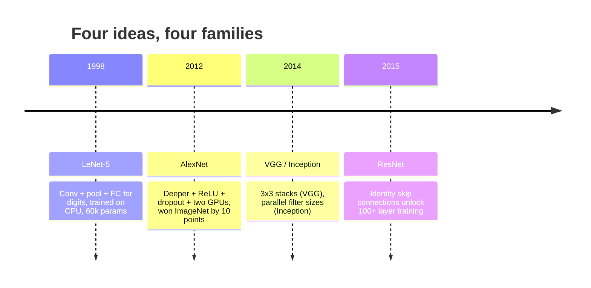
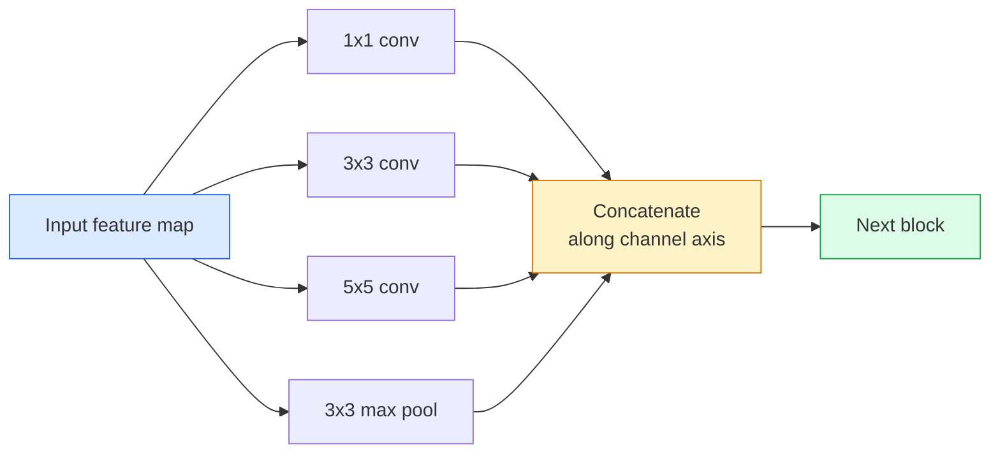
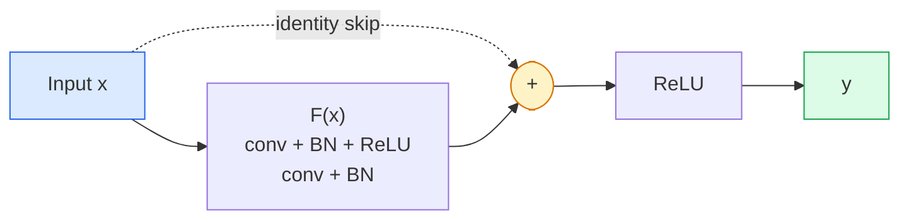

# CNN — от LeNet до ResNet

> Каждая крупная CNN последних тридцати лет — это один и тот же рецепт «свёртка — нелинейность — уменьшение разрешения» с одной новой идеей, добавленной сверху. Изучайте идеи по порядку.

**Тип:** Learn + Build
**Языки:** Python
**Предварительные требования:** Фаза 3, Урок 11 (PyTorch), Фаза 4, Урок 01 (Основы изображений), Фаза 4, Урок 02 (Свёртки с нуля)
**Время:** ~75 минут

## Цели обучения

- Проследить архитектурную линию LeNet-5 -> AlexNet -> VGG -> Inception -> ResNet и назвать единственную новую идею, которую внесло каждое семейство
- Реализовать LeNet-5, блок в стиле VGG и BasicBlock ResNet на PyTorch, каждый менее чем в 40 строк
- Объяснить, почему остаточные соединения превращают сеть из 1000 слоёв из необучаемой в state-of-the-art
- Прочитать современный backbone (ResNet-18, ResNet-50) и предсказать его выходную форму, рецептивное поле и число параметров, не заглядывая в исходный код

## Проблема

В 2011 году лучший классификатор ImageNet набирал около 74% top-5 accuracy. В 2012 AlexNet набрал 85%. В 2015 ResNet набрал 96%. Никаких новых данных. Никакого нового поколения GPU. Прирост дали архитектурные идеи. Практикующий инженер компьютерного зрения обязан знать, какая идея пришла из какой статьи, потому что любой продакшн-backbone, который вы выпустите в 2026 году, — это рекомбинация тех же самых элементов, а идеи продолжают перетекать друг в друга: групповые свёртки перешли из CNN в трансформеры, остаточные соединения перешли из ResNet в каждую существующую LLM, батч-нормализация живёт в диффузионных моделях.

Изучение этих сетей по порядку также вырабатывает иммунитет к распространённой ошибке: тянуться к самой большой доступной модели там, где решить задачу могла бы сеть размера LeNet. MNIST не нужен ResNet. Знание кривой масштабирования каждого семейства подсказывает, где вам следует находиться на этой кривой.

## Концепция

### Четыре идеи, изменившие компьютерное зрение



Ничто другое в классическом компьютерном зрении не имело такого значения, как эти четыре скачка.

### LeNet-5 (1998)

Распознаватель цифр Яна Лекуна. 60 000 параметров. Два блока conv-pool, два полносвязных слоя, активации tanh. Он задал шаблон, который наследует каждая CNN:

```
input (1, 32, 32)
  conv 5x5 -> (6, 28, 28)
  avg pool 2x2 -> (6, 14, 14)
  conv 5x5 -> (16, 10, 10)
  avg pool 2x2 -> (16, 5, 5)
  flatten -> 400
  dense -> 120
  dense -> 84
  dense -> 10
```

Всё, что современный мир называет CNN — чередование свёрток и уменьшения разрешения, подающих данные в небольшой классификатор в конце, — это LeNet с большим числом слоёв, более широкими каналами и лучшими активациями.

### AlexNet (2012)

Три изменения, которые вместе взломали ImageNet:

1. **ReLU** вместо tanh. Градиенты перестают затухать. Обучение ускоряется в шесть раз.
2. **Dropout** в полносвязной голове. Регуляризация становится слоем, а не трюком.
3. **Глубина и ширина**. Пять свёрточных слоёв, три полносвязных слоя, 60 млн параметров, обучение на двух GPU с моделью, разделённой между ними.

На рисунке 2 в статье до сих пор показано разделение по GPU как два параллельных потока. Этот параллелизм был обходным решением на уровне железа, а не архитектурным прозрением — но три идеи выше по-прежнему живут в каждой модели, которой вы пользуетесь.

### VGG (2014)

VGG задал вопрос: что произойдёт, если использовать только свёртки 3x3 и идти вглубь?

```
stack:   conv 3x3 -> conv 3x3 -> pool 2x2
repeat:  16 or 19 conv layers
```

Две свёртки 3x3 видят ту же область входа 5x5, что и одна свёртка 5x5, но с меньшим числом параметров (2*9*C^2 = 18C^2 против 25*C^2) и дополнительным ReLU между ними. VGG превратил это наблюдение в целую архитектуру. Простота — один тип блока, повторённый много раз — сделала её точкой отсчёта для всего, что появилось позже.

Цена: 138 млн параметров, медленное обучение, дорогой инференс.

### Inception (2014, тот же год)

Ответ Google на вопрос «какой размер ядра использовать?» был: все сразу, параллельно.



Каждая ветвь специализируется — 1x1 для смешивания каналов, 3x3 для локальной текстуры, 5x5 для более крупных паттернов, пулинг для признаков, устойчивых к сдвигу, — а конкатенация позволяет следующему слою выбрать ту ветвь, которая полезна. Inception v1 использовал свёртки 1x1 внутри каждой ветви как узкое место (bottleneck), чтобы удержать число параметров в разумных пределах.

### Проблема деградации

К 2015 году VGG-19 работала, а VGG-32 — нет. Предполагалось, что глубина помогает, но после ~20 слоёв и потери на обучении, и потери на тесте становились хуже. Это не переобучение. Это отказ оптимизатора найти полезные веса, потому что градиенты мультипликативно уменьшаются через каждый слой.

```
Plain deep network:
  y = f_L( f_{L-1}( ... f_1(x) ... ) )

Gradient wrt early layer:
  dL/dW_1 = dL/dy * df_L/df_{L-1} * ... * df_2/df_1 * df_1/dW_1

Each multiplicative term has magnitude roughly (weight magnitude) * (activation gain).
Stack 100 of them with gains < 1 and the gradient is effectively zero.
```

VGG работала на 19 слоях, потому что батч-норм (опубликованный одновременно) удерживал активации в хорошо масштабированном диапазоне. Но даже батч-норм не мог спасти глубину свыше примерно 30 слоёв.

### ResNet (2015)

Хэ, Чжан, Рен и Сунь предложили одно изменение, которое всё исправило:

```
standard block:   y = F(x)
residual block:   y = F(x) + x
```

`+ x` означает, что слой всегда может выбрать ничего не делать, обнулив `F(x)`. ResNet из 1000 слоёв теперь в худшем случае не хуже сети из 1 слоя, потому что у каждого дополнительного блока есть тривиальный аварийный выход. С такой гарантией оптимизатор готов сделать каждый блок *немного* полезным — а немного полезное, повторённое 100 раз, и есть state-of-the-art.



Два варианта блока встречаются повсюду:

- **BasicBlock** (ResNet-18, ResNet-34): две свёртки 3x3, обход вокруг обеих.
- **Bottleneck** (ResNet-50, -101, -152): 1x1 вниз, 3x3 посередине, 1x1 вверх, обход вокруг всей тройки. Дешевле при высоком числе каналов.

Когда обходной путь должен пересечь уменьшение разрешения (stride=2), путь идентичности заменяется свёрткой 1x1 с stride=2, чтобы формы совпали.

### Почему остаточные соединения важны не только для зрения

Идея была не столько про классификацию изображений. Она была про превращение глубоких сетей из «скрести пальцы и надеяться, что градиенты выживут» в надёжный, масштабируемый инженерный инструмент. У каждого трансформера, о котором вы прочитаете в следующей фазе, ровно то же самое обходное соединение в каждом блоке. Без ResNet не было бы GPT.

```figure
pooling
```

## Создаём

### Шаг 1: LeNet-5

Минимальная, верная оригиналу LeNet. Активации tanh, average pooling. Единственная уступка современности — использование `nn.CrossEntropyLoss` ниже по конвейеру вместо оригинальных гауссовых связей.

```python
import torch
import torch.nn as nn
import torch.nn.functional as F

class LeNet5(nn.Module):
    def __init__(self, num_classes=10):
        super().__init__()
        self.conv1 = nn.Conv2d(1, 6, kernel_size=5)
        self.conv2 = nn.Conv2d(6, 16, kernel_size=5)
        self.pool = nn.AvgPool2d(2)
        self.fc1 = nn.Linear(16 * 5 * 5, 120)
        self.fc2 = nn.Linear(120, 84)
        self.fc3 = nn.Linear(84, num_classes)

    def forward(self, x):
        x = self.pool(torch.tanh(self.conv1(x)))
        x = self.pool(torch.tanh(self.conv2(x)))
        x = torch.flatten(x, 1)
        x = torch.tanh(self.fc1(x))
        x = torch.tanh(self.fc2(x))
        return self.fc3(x)

net = LeNet5()
x = torch.randn(1, 1, 32, 32)
print(f"output: {net(x).shape}")
print(f"params: {sum(p.numel() for p in net.parameters()):,}")
```

Ожидаемый результат: `output: torch.Size([1, 10])`, `params: 61,706`. Это и есть целиком классификатор цифр, с которого началось современное компьютерное зрение.

### Шаг 2: Блок VGG

Один переиспользуемый блок: две свёртки 3x3, ReLU, батч-норм, max pool.

```python
class VGGBlock(nn.Module):
    def __init__(self, in_c, out_c):
        super().__init__()
        self.conv1 = nn.Conv2d(in_c, out_c, kernel_size=3, padding=1)
        self.bn1 = nn.BatchNorm2d(out_c)
        self.conv2 = nn.Conv2d(out_c, out_c, kernel_size=3, padding=1)
        self.bn2 = nn.BatchNorm2d(out_c)
        self.pool = nn.MaxPool2d(2)

    def forward(self, x):
        x = F.relu(self.bn1(self.conv1(x)))
        x = F.relu(self.bn2(self.conv2(x)))
        return self.pool(x)

class MiniVGG(nn.Module):
    def __init__(self, num_classes=10):
        super().__init__()
        self.stack = nn.Sequential(
            VGGBlock(3, 32),
            VGGBlock(32, 64),
            VGGBlock(64, 128),
        )
        self.head = nn.Sequential(
            nn.AdaptiveAvgPool2d(1),
            nn.Flatten(),
            nn.Linear(128, num_classes),
        )

    def forward(self, x):
        return self.head(self.stack(x))

net = MiniVGG()
x = torch.randn(1, 3, 32, 32)
print(f"output: {net(x).shape}")
print(f"params: {sum(p.numel() for p in net.parameters()):,}")
```

Три блока VGG на входе размера CIFAR, адаптивный пулинг, один линейный слой. ~290 тыс. параметров. Более чем достаточно для CIFAR-10.

### Шаг 3: BasicBlock ResNet

Ключевой строительный блок ResNet-18 и ResNet-34.

```python
class BasicBlock(nn.Module):
    def __init__(self, in_c, out_c, stride=1):
        super().__init__()
        self.conv1 = nn.Conv2d(in_c, out_c, kernel_size=3, stride=stride, padding=1, bias=False)
        self.bn1 = nn.BatchNorm2d(out_c)
        self.conv2 = nn.Conv2d(out_c, out_c, kernel_size=3, stride=1, padding=1, bias=False)
        self.bn2 = nn.BatchNorm2d(out_c)
        if stride != 1 or in_c != out_c:
            self.shortcut = nn.Sequential(
                nn.Conv2d(in_c, out_c, kernel_size=1, stride=stride, bias=False),
                nn.BatchNorm2d(out_c),
            )
        else:
            self.shortcut = nn.Identity()

    def forward(self, x):
        out = F.relu(self.bn1(self.conv1(x)))
        out = self.bn2(self.conv2(out))
        out = out + self.shortcut(x)
        return F.relu(out)
```

`bias=False` на свёрточных слоях — это соглашение, связанное с батч-нормом: параметр beta слоя BN уже отвечает за смещение, поэтому нести ещё и bias свёртки — расточительно. `shortcut` нуждается в настоящей свёртке только тогда, когда меняется stride или число каналов; в остальных случаях это тождественная операция без действия.

### Шаг 4: Крошечный ResNet

Соберите четыре группы BasicBlock, чтобы получить рабочий ResNet для входов размера CIFAR.

```python
class TinyResNet(nn.Module):
    def __init__(self, num_classes=10):
        super().__init__()
        self.stem = nn.Sequential(
            nn.Conv2d(3, 32, kernel_size=3, stride=1, padding=1, bias=False),
            nn.BatchNorm2d(32),
            nn.ReLU(inplace=True),
        )
        self.layer1 = self._make_group(32, 32, num_blocks=2, stride=1)
        self.layer2 = self._make_group(32, 64, num_blocks=2, stride=2)
        self.layer3 = self._make_group(64, 128, num_blocks=2, stride=2)
        self.layer4 = self._make_group(128, 256, num_blocks=2, stride=2)
        self.head = nn.Sequential(
            nn.AdaptiveAvgPool2d(1),
            nn.Flatten(),
            nn.Linear(256, num_classes),
        )

    def _make_group(self, in_c, out_c, num_blocks, stride):
        blocks = [BasicBlock(in_c, out_c, stride=stride)]
        for _ in range(num_blocks - 1):
            blocks.append(BasicBlock(out_c, out_c, stride=1))
        return nn.Sequential(*blocks)

    def forward(self, x):
        x = self.stem(x)
        x = self.layer1(x)
        x = self.layer2(x)
        x = self.layer3(x)
        x = self.layer4(x)
        return self.head(x)

net = TinyResNet()
x = torch.randn(1, 3, 32, 32)
print(f"output: {net(x).shape}")
print(f"params: {sum(p.numel() for p in net.parameters()):,}")
```

Четыре группы по два блока каждая. Stride 2 в начале групп 2, 3, 4. Число каналов удваивается при каждом уменьшении разрешения. Примерно 2,8 млн параметров. Это стандартный рецепт, который чисто масштабируется вплоть до ResNet-152.

### Шаг 5: Сравните эффективность параметров относительно признаков

Пропустите один и тот же вход через все три сети и сравните число параметров.

```python
def summary(name, net, x):
    y = net(x)
    params = sum(p.numel() for p in net.parameters())
    print(f"{name:12s}  input {tuple(x.shape)} -> output {tuple(y.shape)}  params {params:>10,}")

x = torch.randn(1, 3, 32, 32)
summary("LeNet5",     LeNet5(),       torch.randn(1, 1, 32, 32))
summary("MiniVGG",    MiniVGG(),      x)
summary("TinyResNet", TinyResNet(),   x)
```

Три модели, три эпохи, три порядка величины по числу параметров. Для точности на CIFAR-10 нужно приблизительно: LeNet 60%, MiniVGG 89%, TinyResNet 93% после нескольких эпох обучения.

## Применяем

`torchvision.models` предоставляет предобученные версии всего вышеперечисленного. Сигнатура вызова одинакова во всех семействах, и это ровно смысл абстракции backbone.

```python
from torchvision.models import resnet18, ResNet18_Weights, vgg16, VGG16_Weights

r18 = resnet18(weights=ResNet18_Weights.IMAGENET1K_V1)
r18.eval()

print(f"ResNet-18 params: {sum(p.numel() for p in r18.parameters()):,}")
print(r18.layer1[0])
print()

v16 = vgg16(weights=VGG16_Weights.IMAGENET1K_V1)
v16.eval()
print(f"VGG-16   params: {sum(p.numel() for p in v16.parameters()):,}")
```

У ResNet-18 11,7 млн параметров. У VGG-16 138 млн. Похожая точность top-1 на ImageNet (69,8% против 71,6%). Остаточные соединения покупают вам 12-кратный выигрыш в эффективности по параметрам. Именно поэтому варианты ResNet доминировали с 2016 года до появления ViT в 2021-м — и до сих пор доминируют в реальных развёртываниях, где вычисления являются ограничивающим фактором.

Для transfer learning рецепт всегда один и тот же: загрузить предобученную модель, заморозить backbone, заменить голову классификатора.

```python
for p in r18.parameters():
    p.requires_grad = False
r18.fc = nn.Linear(r18.fc.in_features, 10)
```

Три строки. Теперь у вас есть 10-классовый классификатор для CIFAR, унаследовавший представления, за которые заплатил ImageNet.

## Публикуем

Этот урок производит:

- `outputs/prompt-backbone-selector.md` — промпт, который выбирает подходящее семейство CNN (LeNet/VGG/ResNet/MobileNet/ConvNeXt) исходя из задачи, размера набора данных и бюджета вычислений.
- `outputs/skill-residual-block-reviewer.md` — навык, который читает модуль PyTorch и отмечает ошибки в обходных соединениях (отсутствующий shortcut при изменении stride, порядок активации в shortcut, расположение BN относительно сложения).

## Упражнения

1. **(Лёгкий)** Посчитайте вручную число параметров `TinyResNet` слой за слоем. Сравните с `sum(p.numel() for p in net.parameters())`. Куда уходит основная часть бюджета параметров — на свёртки, на BN или на классификатор в голове?
2. **(Средний)** Реализуйте блок Bottleneck (1x1 -> 3x3 -> 1x1 со skip) и постройте с его помощью сеть в стиле ResNet-50 для CIFAR. Сравните число параметров с `TinyResNet`.
3. **(Сложный)** Уберите остаточное соединение из `BasicBlock`, обучите «плоскую» сеть из 34 блоков и ResNet из 34 блоков на CIFAR-10 по 10 эпох каждую. Постройте график потерь на обучении в зависимости от эпохи для обеих сетей. Воспроизведите результат рисунка 1 из статьи He et al., где плоская глубокая сеть сходится к более высоким потерям, чем её более мелкий двойник.

## Ключевые термины

| Термин | Что говорят | Что это значит на самом деле |
|------|----------------|----------------------|
| Backbone | «Модель» | Стек свёрточных блоков, производящий карту признаков, подаваемую в голову задачи |
| Residual connection | «Skip-соединение» | `y = F(x) + x`; позволяет оптимизатору выучить тождество, обнулив F, что делает произвольную глубину обучаемой |
| BasicBlock | «Две свёртки 3x3 со skip-соединением» | Строительный блок ResNet-18/34: conv-BN-ReLU-conv-BN-сложение-ReLU |
| Bottleneck | «1x1 вниз, 3x3, 1x1 вверх» | Блок ResNet-50/101/152; дёшев при высоком числе каналов, потому что 3x3 работает на уменьшенной ширине |
| Degradation problem | «Чем глубже, тем хуже» | После примерно 20 обычных свёрточных слоёв растут и ошибка на обучении, и ошибка на тесте; решается остаточными соединениями, а не большим объёмом данных |
| Stem | «Первый слой» | Начальная свёртка, преобразующая 3-канальный вход в базовую ширину признаков; обычно 7x7 stride 2 для ImageNet, 3x3 stride 1 для CIFAR |
| Head | «Классификатор» | Слои после последнего блока backbone: адаптивный пулинг, flatten, линейный слой (слои) |
| Transfer learning | «Предобученные веса» | Загрузка backbone, обученного на ImageNet, и дообучение только головы под вашу задачу |

## Дополнительные материалы

- [Deep Residual Learning for Image Recognition (He et al., 2015)](https://arxiv.org/abs/1512.03385) — статья ResNet; каждый рисунок в ней стоит внимательного изучения
- [Very Deep Convolutional Networks (Simonyan & Zisserman, 2014)](https://arxiv.org/abs/1409.1556) — статья VGG; всё ещё лучший источник ответа на вопрос «почему 3x3»
- [ImageNet Classification with Deep CNNs (Krizhevsky et al., 2012)](https://papers.nips.cc/paper_files/paper/2012/hash/c399862d3b9d6b76c8436e924a68c45b-Abstract.html) — AlexNet; статья, положившая конец эпохе вручную спроектированных признаков
- [Going Deeper with Convolutions (Szegedy et al., 2014)](https://arxiv.org/abs/1409.4842) — Inception v1; идея параллельных фильтров, которая до сих пор встречается в vision-трансформерах
