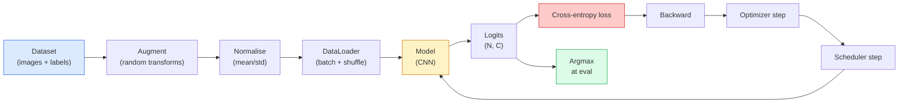

# Классификация изображений

> Классификатор — это функция от пикселей к распределению вероятностей по классам. Всё остальное — сантехника.

**Тип:** Build
**Языки:** Python
**Предварительные требования:** Фаза 2, урок 09 (Оценка модели), Фаза 3, урок 10 (Мини-фреймворк), Фаза 4, урок 03 (CNN)
**Время:** ~75 минут

## Цели обучения

- Построить полный конвейер классификации изображений на CIFAR-10: набор данных, аугментация, модель, цикл обучения, оценивание
- Объяснить роль каждого компонента (dataloader, функция потерь, оптимизатор, планировщик, аугментация) и предсказать, как поломка любого из них проявится на кривой потерь
- Реализовать mixup, cutout и сглаживание меток с нуля и обосновать, когда каждый из них стоит добавлять
- Читать матрицу ошибок и таблицу precision/recall по классам, чтобы диагностировать сбои набора данных и модели за пределами агрегированной точности

## Проблема

Любая продакшн-задача компьютерного зрения на каком-то уровне сводится к классификации изображений. Детекция классифицирует области. Сегментация классифицирует пиксели. Поиск ранжирует по сходству с центроидами классов. Умение правильно построить классификацию — цикл по набору данных, политику аугментации, функцию потерь, оценивание — это навык, который переносится на любую другую задачу этой фазы.

Большинство багов классификации живёт не в модели. Они живут в конвейере: сломанная нормализация, неперемешанный обучающий набор, аугментация, искажающая метки, валидационное разбиение, загрязнённое обучающими данными, скорость обучения, которая незаметно расходится после 30-й эпохи. CNN, которая при правильной настройке достигла бы 93% на CIFAR-10, при сломанной обычно набирает 70-75%, и при этом кривая потерь всё время выглядит правдоподобно.

В этом уроке весь конвейер собирается вручную, чтобы каждая часть была доступна для проверки. Вы не будете использовать ничего из `torchvision.datasets`, что могло бы скрыть баг.

## Концепция

### Конвейер классификации



Каждая строка этого цикла — место, где может жить баг. Cross-entropy принимает сырые логиты, а не выходы softmax, поэтому любой `model(x).softmax()` перед функцией потерь незаметно вычисляет неверный градиент. Аугментации применяются только к входам, но не к меткам — за исключением mixup, который смешивает и то, и другое. `optimizer.zero_grad()` должен вызываться ровно один раз за шаг; пропуск этого вызова накапливает градиенты и выглядит как дико нестабильная скорость обучения. Каждый из этих багов уплощает кривую обучения, не выбрасывая ошибку.

### Cross-entropy, логиты и softmax

Классификатор выдаёт `C` чисел на изображение, называемых логитами. Применение softmax превращает их в распределение вероятностей:

```
softmax(z)_i = exp(z_i) / sum_j exp(z_j)
```

Cross-entropy измеряет отрицательную логарифмическую вероятность правильного класса:

```
CE(z, y) = -log( softmax(z)_y )
        = -z_y + log( sum_j exp(z_j) )
```

Форма справа — численно устойчивая (log-sum-exp). `nn.CrossEntropyLoss` в PyTorch объединяет softmax и NLL в одну устойчивую операцию и принимает сырые логиты напрямую. Применение softmax самостоятельно перед этим — почти всегда баг: вы вычисляете log(softmax(softmax(z))), бессмысленную величину.

### Почему работает аугментация

У CNN есть индуктивное смещение к трансляционной инвариантности (за счёт разделяемых весов), но нет встроенной инвариантности к обрезке, отражению, изменению цвета или окклюзии. Единственный способ научить её этим инвариантностям — показать ей пиксели, которые их задействуют. Каждое случайное преобразование во время обучения — это способ сказать: «у этих двух изображений одна и та же метка; выучи признаки, которые игнорируют разницу».

```
Original crop:  "dog facing left"
Flip:           "dog facing right"       <- same label, different pixels
Rotate(+15):    "dog, slight tilt"
Colour jitter:  "dog in warmer light"
RandomErasing:  "dog with patch missing"
```

Правило: аугментация должна сохранять метку. Cutout и вращение на изображении цифры могут превратить «6» в «9»; для такого набора данных используют меньшие диапазоны вращения и подбирают аугментации, уважающие специфичные для цифр инвариантности.

### Mixup и cutmix

Обычная аугментация преобразует пиксели, но оставляет метки one-hot. **Mixup** и **cutmix** нарушают это, интерполируя и то, и другое.

```
Mixup:
  lambda ~ Beta(a, a)
  x = lambda * x_i + (1 - lambda) * x_j
  y = lambda * y_i + (1 - lambda) * y_j

Cutmix:
  paste a random rectangle of x_j into x_i
  y = area-weighted mix of y_i and y_j
```

Почему это помогает: модель перестаёт запоминать острые one-hot цели и учится интерполировать между классами. Потери на обучении растут, точность на тесте растёт. Это самое дешёвое улучшение устойчивости для любого классификатора.

### Сглаживание меток

Родственник mixup. Вместо обучения против `[0, 0, 1, 0, 0]` обучение идёт против `[eps/C, eps/C, 1-eps, eps/C, eps/C]` для небольшого `eps`, например 0.1. Не даёт модели производить произвольно резкие логиты и улучшает калибровку почти без затрат. Встроено в `nn.CrossEntropyLoss(label_smoothing=0.1)` начиная с PyTorch 1.10.

### Оценивание за пределами точности

Агрегированная точность скрывает дисбаланс. Бинарный классификатор с распределением 90-10, всегда предсказывающий класс большинства, набирает 90%. Инструменты, которые действительно показывают, что происходит:

- **Точность по классам** — одно число на класс; сразу выявляет недостаточно работающие категории.
- **Матрица ошибок** — сетка C x C, где строка i, столбец j = количество примеров истинного класса i, предсказанных как класс j; диагональ — правильные ответы, недиагональные элементы — то, где живёт ваша модель.
- **Top-1 / Top-5** — находится ли правильный класс среди 1 или 5 самых вероятных предсказаний; Top-5 важен для ImageNet, потому что такие классы, как «Norwich terrier» и «Norfolk terrier», действительно неоднозначны.
- **Калибровка (ECE)** — предсказание с уверенностью 0.8 оказывается правильным в 80% случаев? Современные сети систематически переуверены; исправляется температурным масштабированием или сглаживанием меток.

```figure
receptive-field
```

## Создаём

### Шаг 1: детерминированный синтетический набор данных

CIFAR-10 хранится на диске. Чтобы сделать этот урок воспроизводимым и быстрым, мы построим синтетический набор данных, похожий на CIFAR — изображения 32x32 RGB со специфичной для класса структурой, которую модель должна выучить. Тот же самый конвейер без изменений работает на настоящем CIFAR-10.

```python
import numpy as np
import torch
from torch.utils.data import Dataset


def synthetic_cifar(num_per_class=1000, num_classes=10, seed=0):
    rng = np.random.default_rng(seed)
    X = []
    Y = []
    for c in range(num_classes):
        centre = rng.uniform(0, 1, (3,))
        freq = 2 + c
        for _ in range(num_per_class):
            yy, xx = np.meshgrid(np.linspace(0, 1, 32), np.linspace(0, 1, 32), indexing="ij")
            r = np.sin(xx * freq) * 0.5 + centre[0]
            g = np.cos(yy * freq) * 0.5 + centre[1]
            b = (xx + yy) * 0.5 * centre[2]
            img = np.stack([r, g, b], axis=-1)
            img += rng.normal(0, 0.08, img.shape)
            img = np.clip(img, 0, 1)
            X.append(img.astype(np.float32))
            Y.append(c)
    X = np.stack(X)
    Y = np.array(Y)
    idx = rng.permutation(len(X))
    return X[idx], Y[idx]


class ArrayDataset(Dataset):
    def __init__(self, X, Y, transform=None):
        self.X = X
        self.Y = Y
        self.transform = transform

    def __len__(self):
        return len(self.X)

    def __getitem__(self, i):
        img = self.X[i]
        if self.transform is not None:
            img = self.transform(img)
        img = torch.from_numpy(img).permute(2, 0, 1)
        return img, int(self.Y[i])
```

Каждый класс получает свою цветовую палитру и частотный паттерн, плюс гауссов шум, заставляющий модель учить сигнал, а не запоминать пиксели. Десять классов, по тысяче изображений каждый, перемешанные.

### Шаг 2: нормализация и аугментация

Два преобразования, которые есть в любом конвейере компьютерного зрения.

```python
def standardize(mean, std):
    mean = np.array(mean, dtype=np.float32)
    std = np.array(std, dtype=np.float32)
    def _fn(img):
        return (img - mean) / std
    return _fn


def random_hflip(p=0.5):
    def _fn(img):
        if np.random.random() < p:
            return img[:, ::-1, :].copy()
        return img
    return _fn


def random_crop(pad=4):
    def _fn(img):
        h, w = img.shape[:2]
        padded = np.pad(img, ((pad, pad), (pad, pad), (0, 0)), mode="reflect")
        y = np.random.randint(0, 2 * pad)
        x = np.random.randint(0, 2 * pad)
        return padded[y:y + h, x:x + w, :]
    return _fn


def compose(*fns):
    def _fn(img):
        for fn in fns:
            img = fn(img)
        return img
    return _fn
```

Дополнение отражением перед обрезкой, а не дополнение нулями, потому что чёрные границы — это сигнал, который модель выучила бы игнорировать, но неполезным образом.

### Шаг 3: mixup

Смешивает два изображения и две метки внутри шага обучения. Реализовано как преобразование пакета, поэтому живёт рядом с прямым проходом, а не внутри набора данных.

```python
def mixup_batch(x, y, num_classes, alpha=0.2):
    if alpha <= 0:
        return x, torch.nn.functional.one_hot(y, num_classes).float()
    lam = float(np.random.beta(alpha, alpha))
    idx = torch.randperm(x.size(0), device=x.device)
    x_mixed = lam * x + (1 - lam) * x[idx]
    y_onehot = torch.nn.functional.one_hot(y, num_classes).float()
    y_mixed = lam * y_onehot + (1 - lam) * y_onehot[idx]
    return x_mixed, y_mixed


def soft_cross_entropy(logits, soft_targets):
    log_probs = torch.log_softmax(logits, dim=-1)
    return -(soft_targets * log_probs).sum(dim=-1).mean()
```

`soft_cross_entropy` — это cross-entropy относительно распределения мягких меток. Она сводится к обычному one-hot случаю, когда цель — точно one-hot.

### Шаг 4: цикл обучения

Полный рецепт: один проход по данным, градиенты один раз на пакет, шаг планировщика один раз на эпоху.

```python
import torch
import torch.nn as nn
from torch.utils.data import DataLoader
from torch.optim import SGD
from torch.optim.lr_scheduler import CosineAnnealingLR

def train_one_epoch(model, loader, optimizer, device, num_classes, use_mixup=True):
    model.train()
    total, correct, loss_sum = 0, 0, 0.0
    for x, y in loader:
        x, y = x.to(device), y.to(device)
        if use_mixup:
            x_m, y_soft = mixup_batch(x, y, num_classes)
            logits = model(x_m)
            loss = soft_cross_entropy(logits, y_soft)
        else:
            logits = model(x)
            loss = nn.functional.cross_entropy(logits, y, label_smoothing=0.1)
        optimizer.zero_grad()
        loss.backward()
        optimizer.step()
        loss_sum += loss.item() * x.size(0)
        total += x.size(0)
        # Training accuracy vs the un-mixed labels `y` is only an approximation
        # when mixup is on (the model saw soft targets, not y). Treat it as a
        # rough progress signal; rely on val accuracy for real performance.
        with torch.no_grad():
            pred = logits.argmax(dim=-1)
            correct += (pred == y).sum().item()
    return loss_sum / total, correct / total


@torch.no_grad()
def evaluate(model, loader, device, num_classes):
    model.eval()
    total, correct = 0, 0
    loss_sum = 0.0
    cm = torch.zeros(num_classes, num_classes, dtype=torch.long)
    for x, y in loader:
        x, y = x.to(device), y.to(device)
        logits = model(x)
        loss = nn.functional.cross_entropy(logits, y)
        pred = logits.argmax(dim=-1)
        for t, p in zip(y.cpu(), pred.cpu()):
            cm[t, p] += 1
        loss_sum += loss.item() * x.size(0)
        total += x.size(0)
        correct += (pred == y).sum().item()
    return loss_sum / total, correct / total, cm
```

Пять инвариантов, которые нужно проверять каждый раз при написании цикла обучения:

1. `model.train()` перед обучением, `model.eval()` перед оцениванием — переключает поведение dropout и batchnorm.
2. `.zero_grad()` перед `.backward()`.
3. `.item()` при накоплении метрик, чтобы ничто не удерживало граф вычислений живым.
4. `@torch.no_grad()` во время оценивания — экономит память и время, предотвращает тонкие ошибки.
5. Argmax по сырым логитам, а не по softmax — тот же результат, на одну операцию меньше.

### Шаг 5: собираем всё вместе

Используем `TinyResNet` из предыдущего урока, обучаем несколько эпох, оцениваем.

```python
from main import synthetic_cifar, ArrayDataset
from main import standardize, random_hflip, random_crop, compose
from main import mixup_batch, soft_cross_entropy
from main import train_one_epoch, evaluate
# TinyResNet comes from the previous lesson (03-cnns-lenet-to-resnet).
# Adjust the import path to wherever you stored the previous lesson's code.
from cnns_lenet_to_resnet import TinyResNet  # example placeholder

X, Y = synthetic_cifar(num_per_class=500)
split = int(0.9 * len(X))
X_train, Y_train = X[:split], Y[:split]
X_val, Y_val = X[split:], Y[split:]

mean = [0.5, 0.5, 0.5]
std = [0.25, 0.25, 0.25]
train_tf = compose(random_hflip(), random_crop(pad=4), standardize(mean, std))
eval_tf = standardize(mean, std)

train_ds = ArrayDataset(X_train, Y_train, transform=train_tf)
val_ds = ArrayDataset(X_val, Y_val, transform=eval_tf)

train_loader = DataLoader(train_ds, batch_size=128, shuffle=True, num_workers=0)
val_loader = DataLoader(val_ds, batch_size=256, shuffle=False, num_workers=0)

device = "cuda" if torch.cuda.is_available() else "cpu"
model = TinyResNet(num_classes=10).to(device)
optimizer = SGD(model.parameters(), lr=0.1, momentum=0.9, weight_decay=5e-4, nesterov=True)
scheduler = CosineAnnealingLR(optimizer, T_max=10)

for epoch in range(10):
    tr_loss, tr_acc = train_one_epoch(model, train_loader, optimizer, device, 10, use_mixup=True)
    va_loss, va_acc, _ = evaluate(model, val_loader, device, 10)
    scheduler.step()
    print(f"epoch {epoch:2d}  lr {scheduler.get_last_lr()[0]:.4f}  "
          f"train {tr_loss:.3f}/{tr_acc:.3f}  val {va_loss:.3f}/{va_acc:.3f}")
```

На синтетическом наборе данных это достигает почти идеальной точности на валидации за пять эпох, что и есть суть: конвейер корректен, модель может выучить то, что можно выучить. Замените набор данных на настоящий CIFAR-10, и тот же цикл без изменений обучается до ~90%.

### Шаг 6: читаем матрицу ошибок

Одна лишь точность никогда не показывает, где модель ошибается. Матрица ошибок показывает.

```python
def print_confusion(cm, labels=None):
    c = cm.shape[0]
    labels = labels or [str(i) for i in range(c)]
    print(f"{'':>6}" + "".join(f"{l:>5}" for l in labels))
    for i in range(c):
        row = cm[i].tolist()
        print(f"{labels[i]:>6}" + "".join(f"{v:>5}" for v in row))
    print()
    tp = cm.diag().float()
    fp = cm.sum(dim=0).float() - tp
    fn = cm.sum(dim=1).float() - tp
    prec = tp / (tp + fp).clamp_min(1)
    rec = tp / (tp + fn).clamp_min(1)
    f1 = 2 * prec * rec / (prec + rec).clamp_min(1e-9)
    for i in range(c):
        print(f"{labels[i]:>6}  prec {prec[i]:.3f}  rec {rec[i]:.3f}  f1 {f1[i]:.3f}")

_, _, cm = evaluate(model, val_loader, device, 10)
print_confusion(cm)
```

Строки — истинные классы, столбцы — предсказания. Скопление недиагональных значений между классами 3 и 5 означает, что модель путает эти два класса, и даёт вам отправную точку для целевого сбора данных или аугментации, специфичной для класса.

## Применяем

`torchvision` оборачивает всё вышеописанное в идиоматичные компоненты. Для настоящего CIFAR-10 весь конвейер — это четыре строки плюс цикл обучения.

```python
from torchvision.datasets import CIFAR10
from torchvision.transforms import Compose, RandomCrop, RandomHorizontalFlip, ToTensor, Normalize

mean = (0.4914, 0.4822, 0.4465)
std = (0.2470, 0.2435, 0.2616)
train_tf = Compose([
    RandomCrop(32, padding=4, padding_mode="reflect"),
    RandomHorizontalFlip(),
    ToTensor(),
    Normalize(mean, std),
])
eval_tf = Compose([ToTensor(), Normalize(mean, std)])

train_ds = CIFAR10(root="./data", train=True,  download=True, transform=train_tf)
val_ds   = CIFAR10(root="./data", train=False, download=True, transform=eval_tf)
```

Стоит заметить две вещи: mean/std **специфичны для набора данных** — вычислены на обучающем наборе CIFAR-10, а не ImageNet — и дополнение отражением является стандартной для сообщества политикой обрезки. Копирование сюда статистик ImageNet — это утечка точности на ~1%, которую никто не замечает, пока кто-нибудь не профилирует модель.

## Публикуем

Этот урок производит:

- `outputs/prompt-classifier-pipeline-auditor.md` — промпт, который проверяет скрипт обучения на пять инвариантов выше и выявляет первое нарушение.
- `outputs/skill-classification-diagnostics.md` — навык, который по матрице ошибок и списку имён классов суммирует сбои по классам и предлагает одно наиболее эффективное исправление.

## Упражнения

1. **(Лёгкий)** Обучите одну и ту же модель с mixup и без него в течение пяти эпох на синтетическом наборе данных. Постройте графики потерь на обучении и валидации для обоих случаев. Объясните, почему потери на обучении с mixup выше, а точность на валидации при этом такая же или лучше.
2. **(Средний)** Реализуйте Cutout — обнуление случайного квадрата 8x8 в каждом обучающем изображении — и проведите абляцию: без аугментации, hflip+crop, hflip+crop+cutout, hflip+crop+mixup. Сообщите точность на валидации для каждого варианта.
3. **(Сложный)** Постройте конвейер для CIFAR-100 (100 классов, тот же размер входа) и воспроизведите обучение ResNet-34 с точностью в пределах 1% от опубликованной. Дополнительно: переберите три скорости обучения и два значения затухания весов, логируйте в локальный CSV, постройте итоговую таблицу самых частых путаниц по матрице ошибок.

## Ключевые термины

| Термин | Как говорят люди | Что это на самом деле означает |
|------|----------------|----------------------|
| Логиты | «Сырые выходы» | Вектор из C чисел на изображение до softmax; cross-entropy ожидает именно их, а не значения после softmax |
| Cross-entropy | «Функция потерь» | Отрицательная логарифмическая вероятность правильного класса; объединяет log-softmax и NLL в одной устойчивой операции |
| DataLoader | «Пакетировщик» | Оборачивает набор данных перемешиванием, разбиением на пакеты и (опционально) многопоточной загрузкой; на него списывают половину багов обучения |
| Аугментация | «Случайные преобразования» | Любое пиксельное преобразование во время обучения, сохраняющее метку; учит инвариантностям, которых у CNN нет от природы |
| Mixup / Cutmix | «Смешать два изображения» | Смешивают и входы, и метки, чтобы классификатор учил плавные интерполяции вместо жёстких границ |
| Сглаживание меток | «Более мягкие цели» | Замена one-hot на (1-eps, eps/(C-1), ...); улучшает калибровку и слегка повышает точность |
| Top-k accuracy | «Top-5» | Правильный класс входит в k предсказаний с наибольшей вероятностью; используется на наборах данных с действительно неоднозначными классами |
| Матрица ошибок | «Где живут ошибки» | Таблица C x C, где элемент (i, j) считает изображения истинного класса i, предсказанные как j; диагональ верна, недиагональные элементы говорят, что исправлять |

## Дополнительные материалы

- [CS231n: Training Neural Networks](https://cs231n.github.io/neural-networks-3/) — всё ещё самый ясный обзор конвейера обучения на одной странице
- [Bag of Tricks for Image Classification (He et al., 2019)](https://arxiv.org/abs/1812.01187) — каждый маленький трюк, который в сумме даёт 3-4% к точности ResNet на ImageNet
- [mixup: Beyond Empirical Risk Minimization (Zhang et al., 2017)](https://arxiv.org/abs/1710.09412) — оригинальная статья про mixup; три страницы теории плюс убедительные эксперименты
- [Why temperature scaling matters (Guo et al., 2017)](https://arxiv.org/abs/1706.04599) — статья, доказавшая, что современные сети плохо откалиброваны, и исправившая это одним скалярным параметром
