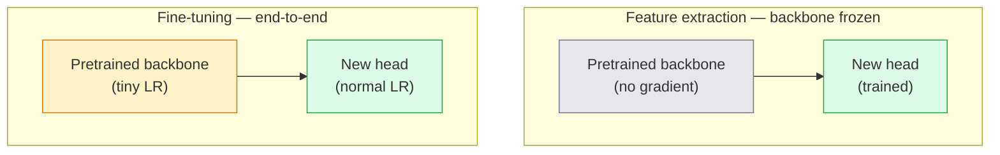

# Перенос обучения и дообучение

> Кто-то другой потратил миллион GPU-часов, обучая сеть тому, как выглядят края, текстуры и части объектов. Вам стоит одолжить эти признаки, прежде чем обучать собственную модель.

**Тип:** Build
**Языки:** Python
**Предварительные требования:** Фаза 4, урок 03 (CNN), Фаза 4, урок 04 (Классификация изображений)
**Время:** ~75 минут

## Цели обучения

- Отличать извлечение признаков от дообучения и выбирать нужный вариант, исходя из размера набора данных, дистанции домена и вычислительного бюджета
- Загрузить предобученный backbone, заменить его классификационную головку и обучить только головку до рабочего базового уровня менее чем за 20 строк
- Постепенно размораживать слои с дифференцированными скоростями обучения, чтобы ранние общие признаки получали меньшие обновления, чем поздние специфичные для задачи
- Диагностировать три типичных сбоя: дрейф признаков из-за слишком высокой скорости обучения на размороженных блоках, коллапс статистик BN на крошечных наборах данных и катастрофическое забывание

## Проблема

Обучение ResNet-50 на ImageNet стоит около 2000 GPU-часов. Очень мало команд располагают таким бюджетом для каждой задачи, которую они выпускают. То, что почти каждая команда реально выпускает в продакшн, — это предобученный backbone с новой головкой, обученной на нескольких сотнях или тысячах специфичных для задачи изображений.

Это не срезание пути. Первый свёрточный блок любой CNN, обученной на ImageNet, учит края и Gabor-подобные фильтры. Следующие несколько блоков учат текстуры и простые мотивы. Средние блоки учат части объектов. Последние блоки учат комбинации, которые начинают напоминать 1000 категорий ImageNet. Первые 90% этой иерархии переносятся почти без изменений на медицинскую визуализацию, промышленный контроль, спутниковые данные и любую другую задачу компьютерного зрения — потому что у природы ограниченный словарь краёв и текстур. Последние 10% — это то, что вы реально обучаете.

Правильный перенос обучения подстерегают три бага: разрушение предобученных признаков слишком высокой скоростью обучения, лишение модели информации из-за чрезмерной заморозки и дрейф скользящих статистик BatchNorm к крошечному набору данных, на котором остальная часть сети никогда не обучалась. Этот урок намеренно проходит через каждый из них.

## Концепция

### Извлечение признаков против дообучения

Два режима, выбираемых в зависимости от того, насколько вы доверяете предобученным признакам и сколько у вас данных.



Практические правила:

| Размер набора данных | Дистанция домена | Рецепт |
|--------------|-----------------|--------|
| < 1k изображений | близко к ImageNet | Заморозить backbone, обучать только головку |
| 1k-10k | близко | Заморозить первые 2-3 стадии, дообучить остальное |
| 10k-100k | любая | Дообучить сквозным образом с дифференцированной LR |
| 100k+ | далеко | Дообучить всё; рассмотреть обучение с нуля, если домен достаточно далёкий |

«Близко к ImageNet» примерно означает натуральные RGB-фотографии с объектным содержанием. Медицинские КТ-снимки, спутниковая съёмка сверху и микроскопия — это далёкие домены: признаки всё ещё помогают, но вам придётся дать большему числу слоёв адаптироваться.

### Почему заморозка вообще работает

Признаки ImageNet, которые учит CNN, не специализированы под 1000 категорий. Они специализированы под статистику натуральных изображений: края определённых ориентаций, текстуры, контрастные паттерны, примитивы формы. Эта статистика стабильна почти во всех визуальных доменах, которые может назвать человек. Именно поэтому модель, обученная на ImageNet и оценённая без дообучения (zero-shot) на CIFAR-10 всего лишь с новой линейной головкой (без дообучения backbone), достигает точности 80%+. Головка учится тому, какие из уже выученных признаков взвешивать для этой задачи.

### Дифференцированные скорости обучения

Когда вы всё же размораживаете слои, ранние слои должны обучаться медленнее, чем поздние. Ранние слои кодируют общие признаки, которые вы хотите сохранить; поздние слои кодируют специфичную для задачи структуру, которую вам нужно сильно сдвинуть.

```
Typical recipe:

  stage 0 (stem + first group): lr = base_lr / 100    (mostly fixed)
  stage 1:                       lr = base_lr / 10
  stage 2:                       lr = base_lr / 3
  stage 3 (last backbone group): lr = base_lr
  head:                          lr = base_lr  (or slightly higher)
```

В PyTorch это просто список групп параметров, передаваемый оптимизатору. Одна модель, пять скоростей обучения, ноль дополнительного кода.

### Проблема BatchNorm

Слои BN хранят буферы `running_mean` и `running_var`, вычисленные на ImageNet. Если у вашей задачи другое распределение пикселей — другое освещение, другой сенсор, другое цветовое пространство — эти буферы неверны. Три варианта в порядке предпочтения:

1. **Дообучать с BN в режиме train.** Пусть BN обновляет свои скользящие статистики вместе со всем остальным. Выбор по умолчанию, когда набор данных задачи среднего размера (>= 5000 примеров).
2. **Заморозить BN в режиме eval.** Сохранить статистики ImageNet и обучать только веса. Правильно, когда ваш набор данных настолько мал, что скользящее среднее BN было бы шумным.
3. **Заменить BN на GroupNorm.** Полностью устраняет проблему скользящего среднего. Используется в backbone для детекции и сегментации, где размер пакета на GPU крошечный.

Ошибка здесь незаметно проседает точность на 5-15%.

### Дизайн головки

Классификационная головка — это 1-3 линейных слоя плюс опциональный dropout. Каждый backbone из torchvision поставляется со стандартной головкой, которую вы заменяете:

```
backbone.fc = nn.Linear(backbone.fc.in_features, num_classes)          # ResNet
backbone.classifier[1] = nn.Linear(..., num_classes)                    # EfficientNet, MobileNet
backbone.heads.head = nn.Linear(..., num_classes)                       # torchvision ViT
```

Для маленьких наборов данных обычно достаточно одного линейного слоя. Добавление скрытого слоя (Linear -> ReLU -> Dropout -> Linear) помогает, когда распределение задачи дальше от обучающего распределения backbone.

### Послойное затухание скорости обучения

Более плавная версия дифференцированной LR, используемая в современном дообучении (BEiT, DINOv2, дообучения ViT-B). Вместо группировки слоёв в стадии каждому слою даётся немного меньшая LR, чем у слоя над ним:

```
lr_layer_k = base_lr * decay^(L - k)
```

При decay = 0.75 и L = 12 трансформерных блоках первый блок обучается со скоростью `0.75^11 ≈ 0.04x` от LR головки. Имеет большее значение для дообучения трансформеров, чем для CNN, где обычно достаточно LR, сгруппированных по стадиям.

### Что оценивать

Запуски переноса обучения требуют двух чисел, которые вы бы не отслеживали при обучении с нуля:

- **Точность только предобученной модели** — точность головки при замороженном backbone. Это ваш пол.
- **Точность после дообучения** — та же модель после сквозного обучения. Это ваш потолок.

Если точность после дообучения меньше, чем только у предобученной, у вас баг в скорости обучения или в BN. Всегда печатайте оба числа.

```figure
transfer-learning
```

## Создаём

### Шаг 1: загружаем предобученный backbone и осматриваем его

```python
import torch
import torch.nn as nn
from torchvision.models import resnet18, ResNet18_Weights

backbone = resnet18(weights=ResNet18_Weights.IMAGENET1K_V1)
print(backbone)
print()
print("classifier head:", backbone.fc)
print("feature dim:", backbone.fc.in_features)
```

У `ResNet18` четыре стадии (`layer1..layer4`) плюс stem и головка `fc`. У каждого классификационного backbone из torchvision аналогичная структура.

### Шаг 2: извлечение признаков — заморозить всё, заменить головку

```python
def make_feature_extractor(num_classes=10):
    model = resnet18(weights=ResNet18_Weights.IMAGENET1K_V1)
    for p in model.parameters():
        p.requires_grad = False
    model.fc = nn.Linear(model.fc.in_features, num_classes)
    return model

model = make_feature_extractor(num_classes=10)
trainable = sum(p.numel() for p in model.parameters() if p.requires_grad)
frozen = sum(p.numel() for p in model.parameters() if not p.requires_grad)
print(f"trainable: {trainable:>10,}")
print(f"frozen:    {frozen:>10,}")
```

Обучаем только `model.fc`. Backbone — замороженный экстрактор признаков.

### Шаг 3: дифференцированное дообучение

Утилита, строящая группы параметров со специфичными для стадии скоростями обучения.

```python
def discriminative_param_groups(model, base_lr=1e-3, decay=0.3):
    stages = [
        ["conv1", "bn1"],
        ["layer1"],
        ["layer2"],
        ["layer3"],
        ["layer4"],
        ["fc"],
    ]
    groups = []
    for i, names in enumerate(stages):
        lr = base_lr * (decay ** (len(stages) - 1 - i))
        params = [p for n, p in model.named_parameters()
                  if any(n.startswith(k) for k in names)]
        if params:
            groups.append({"params": params, "lr": lr, "name": "_".join(names)})
    return groups

model = resnet18(weights=ResNet18_Weights.IMAGENET1K_V1)
model.fc = nn.Linear(model.fc.in_features, 10)
for p in model.parameters():
    p.requires_grad = True

groups = discriminative_param_groups(model)
for g in groups:
    print(f"{g['name']:>10s}  lr={g['lr']:.2e}  params={sum(p.numel() for p in g['params']):>8,}")
```

`decay=0.3` означает, что каждая стадия обучается на 30% от скорости следующей. `fc` получает `base_lr`, `layer4` получает `0.3 * base_lr`, `conv1` получает `0.3^5 * base_lr ≈ 0.00243 * base_lr`. Звучит экстремально; на практике работает.

### Шаг 4: работа с BatchNorm

Вспомогательная функция для заморозки скользящих статистик BN без заморозки его весов.

```python
def freeze_bn_stats(model):
    for m in model.modules():
        if isinstance(m, (nn.BatchNorm1d, nn.BatchNorm2d, nn.BatchNorm3d)):
            m.eval()
            for p in m.parameters():
                p.requires_grad = False
    return model
```

Вызывайте её после `model.train()` в начале каждой эпохи. `model.train()` переключает всё в режим обучения; эта функция отменяет это только для слоёв BN.

### Шаг 5: минимальный сквозной цикл дообучения

```python
from torch.optim import SGD
from torch.utils.data import DataLoader
from torch.optim.lr_scheduler import CosineAnnealingLR
import torch.nn.functional as F

def fine_tune(model, train_loader, val_loader, device, epochs=5, base_lr=1e-3, freeze_bn=False):
    model = model.to(device)
    groups = discriminative_param_groups(model, base_lr=base_lr)
    optimizer = SGD(groups, momentum=0.9, weight_decay=1e-4, nesterov=True)
    scheduler = CosineAnnealingLR(optimizer, T_max=epochs)

    for epoch in range(epochs):
        model.train()
        if freeze_bn:
            freeze_bn_stats(model)
        tr_loss, tr_correct, tr_total = 0.0, 0, 0
        for x, y in train_loader:
            x, y = x.to(device), y.to(device)
            logits = model(x)
            loss = F.cross_entropy(logits, y, label_smoothing=0.1)
            optimizer.zero_grad()
            loss.backward()
            optimizer.step()
            tr_loss += loss.item() * x.size(0)
            tr_total += x.size(0)
            tr_correct += (logits.argmax(-1) == y).sum().item()
        scheduler.step()

        model.eval()
        va_total, va_correct = 0, 0
        with torch.no_grad():
            for x, y in val_loader:
                x, y = x.to(device), y.to(device)
                pred = model(x).argmax(-1)
                va_total += x.size(0)
                va_correct += (pred == y).sum().item()
        print(f"epoch {epoch}  train {tr_loss/tr_total:.3f}/{tr_correct/tr_total:.3f}  "
              f"val {va_correct/va_total:.3f}")
    return model
```

Пять эпох по этому рецепту на CIFAR-10 поднимают `ResNet18-IMAGENET1K_V1` с ~70% точности линейного пробника без дообучения до ~93% точности после дообучения. Одна лишь головка вышла бы на плато около 86%, вообще не трогая backbone.

### Шаг 6: постепенная разморозка

Расписание, размораживающее по одной стадии на эпоху с конца к началу. Смягчает дрейф признаков ценой нескольких дополнительных эпох.

```python
def progressive_unfreeze_schedule(model):
    stages = ["layer4", "layer3", "layer2", "layer1"]
    yielded = set()

    def start():
        for p in model.parameters():
            p.requires_grad = False
        for p in model.fc.parameters():
            p.requires_grad = True

    def unfreeze(epoch):
        if epoch < len(stages):
            name = stages[epoch]
            yielded.add(name)
            for n, p in model.named_parameters():
                if n.startswith(name):
                    p.requires_grad = True
            return name
        return None

    return start, unfreeze
```

Вызовите `start()` один раз перед первой эпохой. Вызывайте `unfreeze(epoch)` в начале каждой эпохи. Пересоздавайте оптимизатор каждый раз, когда меняется набор обучаемых параметров, иначе замороженные параметры всё ещё держат закешированные моменты, которые сбивают его с толку.

## Применяем

Для большинства реальных задач `torchvision.models` плюс три строки — этого достаточно. Более тяжёлый инструментарий выше нужен, когда вы упираетесь в проблемы, которые настройки по умолчанию в библиотеке не могут исправить.

```python
from torchvision.models import resnet50, ResNet50_Weights

model = resnet50(weights=ResNet50_Weights.IMAGENET1K_V2)
model.fc = nn.Linear(model.fc.in_features, num_classes)
optimizer = torch.optim.AdamW(model.parameters(), lr=1e-4, weight_decay=1e-4)
```

Ещё два продакшн-стандарта:

- `timm` поставляет ~800 предобученных backbone для компьютерного зрения с единообразным API (`timm.create_model("resnet50", pretrained=True, num_classes=10)`). Для любого дообучения за пределами зоопарка torchvision это стандарт.
- Для трансформеров `transformers.AutoModelForImageClassification.from_pretrained(name, num_labels=N)` даёт вам ViT / BEiT / DeiT с той же семантикой загрузки, что и текстовые модели.

## Публикуем

Этот урок производит:

- `outputs/prompt-fine-tune-planner.md` — промпт, который выбирает между извлечением признаков, постепенным и сквозным дообучением на основе размера набора данных, дистанции домена и вычислительного бюджета.
- `outputs/skill-freeze-inspector.md` — навык, который по модели PyTorch сообщает, какие параметры обучаемы, какие слои BatchNorm находятся в режиме eval и действительно ли оптимизатор получает обучаемые параметры.

## Упражнения

1. **(Лёгкий)** Обучите `ResNet18` как линейный пробник (backbone заморожен) и как полное дообучение на том же синтетическом наборе данных CIFAR. Сообщите обе точности рядом. Объясните, какой разрыв говорит о том, что признаки хорошо переносятся, а какой — о том, что нет.
2. **(Средний)** Намеренно внесите баг: установите `base_lr = 1e-1` на стадии backbone вместо головки. Покажите, что потери на обучении взрываются, затем восстановите работу, применив вспомогательную функцию `discriminative_param_groups`. Зафиксируйте LR, при которой каждая стадия начинает расходиться.
3. **(Сложный)** Возьмите набор данных медицинской визуализации (например, CheXpert-small, PatchCamelyon или HAM10000) и сравните три режима: (a) предобученный на ImageNet замороженный backbone + линейная головка; (b) предобученный на ImageNet сквозной дообучение; (c) обучение с нуля. Сообщите точность и вычислительную стоимость для каждого. При каком размере набора данных обучение с нуля становится конкурентоспособным?

## Ключевые термины

| Термин | Как говорят люди | Что это на самом деле означает |
|------|----------------|----------------------|
| Извлечение признаков | «Заморозить и обучить головку» | Параметры backbone заморожены, градиент получает только новая классификационная головка |
| Дообучение | «Переобучить сквозным образом» | Все параметры обучаемы, обычно с гораздо меньшей LR, чем при обучении с нуля |
| Дифференцированная LR | «Меньшая LR для ранних слоёв» | Группы параметров оптимизатора, где LR ранней стадии — доля LR поздней стадии |
| Послойное затухание LR | «Плавный градиент LR» | LR на слой, умноженная на decay^(L - k); распространено в дообучении трансформеров |
| Катастрофическое забывание | «Модель потеряла ImageNet» | Слишком высокая LR перезаписывает предобученные признаки прежде, чем выучен сигнал новой задачи |
| Дрейф статистик BN | «Скользящее среднее неверно» | running_mean/var в BatchNorm вычислены на распределении, отличном от текущей задачи, что незаметно вредит точности |
| Линейный пробник | «Замороженный backbone + линейная головка» | Оценка предобученных признаков — точность наилучшего линейного классификатора поверх замороженного представления |
| Катастрофический коллапс | «Всё предсказывает один класс» | Происходит при дообучении с LR, достаточно высокой, чтобы разрушить признаки прежде, чем градиенты от головки успеют стабилизироваться |

## Дополнительные материалы

- [How transferable are features in deep neural networks? (Yosinski et al., 2014)](https://arxiv.org/abs/1411.1792) — статья, количественно оценившая переносимость признаков по слоям
- [Universal Language Model Fine-tuning (ULMFiT, Howard & Ruder, 2018)](https://arxiv.org/abs/1801.06146) — оригинальный рецепт дифференцированной LR / постепенной разморозки; идеи напрямую переносятся в компьютерное зрение
- [timm documentation](https://huggingface.co/docs/timm) — справочник по современным backbone для компьютерного зрения и точным настройкам дообучения по умолчанию, с которыми они были обучены
- [A Simple Framework for Linear-Probe Evaluation (Kornblith et al., 2019)](https://arxiv.org/abs/1805.08974) — почему важна точность линейного пробника и как правильно её сообщать
