# Детекция объектов — YOLO с нуля

> Детекция — это классификация плюс регрессия, выполняемые в каждой позиции карты признаков, а затем очищенные с помощью подавления немаксимумов.

**Тип:** Build
**Языки:** Python
**Предварительные требования:** Фаза 4, урок 03 (CNN), Фаза 4, урок 04 (Классификация изображений), Фаза 4, урок 05 (Перенос обучения)
**Время:** ~75 минут

## Цели обучения

- Объяснить дизайн на основе сетки и якорей, превращающий детекцию в задачу плотного предсказания, и сформулировать, что означает каждое число в выходном тензоре
- Вычислить Intersection-over-Union между рамками и реализовать подавление немаксимумов с нуля
- Построить минимальную головку в стиле YOLO поверх предобученного backbone, включая функции потерь классификации, объектности и регрессии рамок
- Читать строку метрик детекции (precision@0.5, recall, mAP@0.5, mAP@0.5:0.95) и выбирать, какой параметр крутить дальше

## Проблема

Классификация говорит: «на этом изображении собака». Детекция говорит: «есть собака в пикселях (112, 40, 280, 210), есть кошка в (400, 180, 560, 310), и больше ничего в кадре нет». Именно это структурное изменение — предсказание переменного числа размеченных рамок вместо одной метки на изображение — то, от чего зависит любая автономная система, любой продукт видеонаблюдения, любой парсер разметки документов и любая заводская линия компьютерного зрения.

Детекция — это ещё и место, где одновременно проявляются все инженерные компромиссы компьютерного зрения. Вам нужны точные рамки (головка регрессии), вам нужен правильный класс для каждой рамки (головка классификации), вам нужно, чтобы модель знала, когда обнаруживать нечего (оценка объектности), и вам нужно ровно одно предсказание на реальный объект (подавление немаксимумов). Упустите любое из этого, и конвейер либо пропускает объекты, либо сообщает о галлюцинированных рамках, либо предсказывает один и тот же объект пятнадцать раз в чуть разных позициях.

YOLO (You Only Look Once, Redmon et al. 2016) — это дизайн, который заставил всё это работать в реальном времени за счёт единственного прямого прохода свёрточной сети, и те же структурные решения по-прежнему лежат в основе современных детекторов (YOLOv8, YOLOv9, YOLO-NAS, RT-DETR). Выучите основу, и каждый вариант станет перестановкой тех же частей.

## Концепция

### Детекция как плотное предсказание

Классификатор выдаёт C чисел на изображение. Детектор в стиле YOLO выдаёт `(S x S x (5 + C))` чисел на изображение, где S — размер пространственной сетки.

```mermaid
flowchart LR
    IMG["Input 416x416 RGB"] --> BB["Backbone<br/>(ResNet, DarkNet, ...)"]
    BB --> FM["Feature map<br/>(C_feat, 13, 13)"]
    FM --> HEAD["Detection head<br/>(1x1 convs)"]
    HEAD --> OUT["Output tensor<br/>(13, 13, B * (5 + C))"]
    OUT --> DEC["Decode<br/>(grid + sigmoid + exp)"]
    DEC --> NMS["Non-max suppression"]
    NMS --> RESULT["Final boxes"]

    style IMG fill:#dbeafe,stroke:#2563eb
    style HEAD fill:#fef3c7,stroke:#d97706
    style NMS fill:#fecaca,stroke:#dc2626
    style RESULT fill:#dcfce7,stroke:#16a34a
```



Каждая из `S * S` ячеек сетки предсказывает `B` рамок. Для каждой рамки:

- 4 числа описывают геометрию: `tx, ty, tw, th`.
- 1 число — оценка объектности: «есть ли объект, центрированный в этой ячейке?»
- C чисел — вероятности классов.

Всего на ячейку: `B * (5 + C)`. Для VOC с `S=13, B=2, C=20` это 50 чисел на ячейку.

### Почему сетки и якоря

Обычная регрессия предсказывала бы `(x, y, w, h)` для каждого объекта в виде абсолютных координат. Это сложно для свёрточной сети, потому что смещение изображения не должно смещать все предсказания на одну и ту же величину — каждый объект пространственно привязан. Сетка решает это, назначая каждую истинную рамку той ячейке сетки, в которую попадает её центр; только эта ячейка отвечает за этот объект.

Якоря решают вторую проблему. Свёртка 3x3 не может легко регрессировать рамку шириной 500 пикселей из ячейки карты признаков с рецептивным полем 16 пикселей. Вместо этого мы заранее задаём `B` эталонных форм рамок (якорей) на ячейку и предсказываем небольшие смещения от каждого якоря. Модель учится выбирать нужный якорь и подталкивать его, а не регрессировать из ничего.

```
Anchor box priors (example for 416x416 input):

  small:   (30,  60)
  medium:  (75,  170)
  large:   (200, 380)

At each grid cell, every anchor emits (tx, ty, tw, th, obj, c_1, ..., c_C).
```

Современные детекторы часто используют FPN с разными наборами якорей на каждое разрешение — маленькие якоря на неглубоких картах высокого разрешения, большие якоря на глубоких картах низкого разрешения. Та же идея, больше масштабов.

### Декодирование предсказаний

Сырые `tx, ty, tw, th` — это не координаты рамки; это цели регрессии, которые нужно преобразовать перед отрисовкой:

```
centre x  = (sigmoid(tx) + cell_x) * stride
centre y  = (sigmoid(ty) + cell_y) * stride
width     = anchor_w * exp(tw)
height    = anchor_h * exp(th)
```

`sigmoid` удерживает смещения центра внутри ячейки. `exp` позволяет ширине свободно масштабироваться от якоря без смены знака. `stride` масштабирует координаты сетки обратно в пиксели. Этот шаг декодирования одинаков в каждой версии YOLO начиная с v2.

### IoU

Универсальная метрика сходства между двумя рамками в детекции:

```
IoU(A, B) = area(A intersect B) / area(A union B)
```

IoU = 1 означает идентичность; IoU = 0 означает отсутствие пересечения. IoU между предсказанием и истинной рамкой определяет, засчитывается ли предсказание как истинноположительное (обычно IoU >= 0.5). IoU между двумя предсказаниями — это то, что использует NMS для дедупликации.

### Подавление немаксимумов

Свёрточная сеть, обученная на соседних якорях, часто предсказывает перекрывающиеся рамки для одного и того же объекта. NMS сохраняет предсказание с наибольшей уверенностью и удаляет любое другое предсказание с IoU выше порога.

```
NMS(boxes, scores, iou_threshold):
    sort boxes by score descending
    keep = []
    while boxes not empty:
        pick the top-scoring box, add to keep
        remove every box with IoU > iou_threshold to the picked box
    return keep
```

Типичный порог: 0.45 для детекции объектов. Современные детекторы заменяют стандартный NMS на `soft-NMS`, `DIoU-NMS` или учат подавление напрямую (RT-DETR), но структурное назначение остаётся тем же.

### Функция потерь

Потери YOLO — это три взвешенные и сложенные функции потерь:

```
L = lambda_coord * L_box(pred, target, where obj=1)
  + lambda_obj   * L_obj(pred, 1,     where obj=1)
  + lambda_noobj * L_obj(pred, 0,     where obj=0)
  + lambda_cls   * L_cls(pred, target, where obj=1)
```

В потери регрессии рамок и классификации вносят вклад только ячейки, содержащие объект. Ячейки без объектов вносят вклад только в потери объектности (обучая модель молчать). `lambda_noobj` обычно мала (~0.5), потому что подавляющее большинство ячеек пусты и иначе доминировали бы в общих потерях.

Современные варианты заменяют MSE-потери рамок на CIoU / DIoU (которые оптимизируют IoU напрямую), используют focal loss для дисбаланса классов и балансируют объектность с помощью quality focal loss. Трёхкомпонентная структура остаётся неизменной.

### Метрики детекции

Точность не переносится на детекцию. Четыре числа, которые переносятся:

- **Precision@IoU=0.5** — из предсказаний, засчитанных как положительные, сколько действительно верны.
- **Recall@IoU=0.5** — из реальных объектов, сколько мы нашли.
- **AP@0.5** — площадь под кривой precision-recall при пороге IoU 0.5; одно число на класс.
- **mAP@0.5:0.95** — среднее AP по порогам IoU 0.5, 0.55, ..., 0.95. Метрика COCO; самая строгая и информативная.

Сообщайте все четыре. Детектор, сильный по mAP@0.5, но слабый по mAP@0.5:0.95, локализует приблизительно, но не точно; исправляется лучшей функцией потерь регрессии рамок. Детектор с высокой точностью и низкой полнотой слишком консервативен; понизьте порог уверенности или увеличьте вес объектности.

```figure
object-detection-nms
```

## Создаём

### Шаг 1: IoU

Рабочая лошадка всего урока. Работает на двух массивах рамок в формате `(x1, y1, x2, y2)`.

```python
import numpy as np

def box_iou(boxes_a, boxes_b):
    ax1, ay1, ax2, ay2 = boxes_a[:, 0], boxes_a[:, 1], boxes_a[:, 2], boxes_a[:, 3]
    bx1, by1, bx2, by2 = boxes_b[:, 0], boxes_b[:, 1], boxes_b[:, 2], boxes_b[:, 3]

    inter_x1 = np.maximum(ax1[:, None], bx1[None, :])
    inter_y1 = np.maximum(ay1[:, None], by1[None, :])
    inter_x2 = np.minimum(ax2[:, None], bx2[None, :])
    inter_y2 = np.minimum(ay2[:, None], by2[None, :])

    inter_w = np.clip(inter_x2 - inter_x1, 0, None)
    inter_h = np.clip(inter_y2 - inter_y1, 0, None)
    inter = inter_w * inter_h

    area_a = (ax2 - ax1) * (ay2 - ay1)
    area_b = (bx2 - bx1) * (by2 - by1)
    union = area_a[:, None] + area_b[None, :] - inter
    return inter / np.clip(union, 1e-8, None)
```

Возвращает матрицу попарных IoU размера `(N_a, N_b)`. Используйте её против одной истинной рамки, сделав один из массивов формы `(1, 4)`.

### Шаг 2: подавление немаксимумов

```python
def nms(boxes, scores, iou_threshold=0.45):
    order = np.argsort(-scores)
    keep = []
    while len(order) > 0:
        i = order[0]
        keep.append(i)
        if len(order) == 1:
            break
        rest = order[1:]
        ious = box_iou(boxes[[i]], boxes[rest])[0]
        order = rest[ious <= iou_threshold]
    return np.array(keep, dtype=np.int64)
```

Детерминированно, `O(N log N)` из-за сортировки, и совпадает с поведением `torchvision.ops.nms` на идентичных входах.

### Шаг 3: кодирование и декодирование рамок

Преобразование между пиксельными координатами и целями `(tx, ty, tw, th)`, которые реально регрессирует сеть.

```python
def encode(box_xyxy, cell_x, cell_y, stride, anchor_wh):
    x1, y1, x2, y2 = box_xyxy
    cx = 0.5 * (x1 + x2)
    cy = 0.5 * (y1 + y2)
    w = x2 - x1
    h = y2 - y1
    tx = cx / stride - cell_x
    ty = cy / stride - cell_y
    tw = np.log(w / anchor_wh[0] + 1e-8)
    th = np.log(h / anchor_wh[1] + 1e-8)
    return np.array([tx, ty, tw, th])


def decode(tx_ty_tw_th, cell_x, cell_y, stride, anchor_wh):
    tx, ty, tw, th = tx_ty_tw_th
    cx = (sigmoid(tx) + cell_x) * stride
    cy = (sigmoid(ty) + cell_y) * stride
    w = anchor_wh[0] * np.exp(tw)
    h = anchor_wh[1] * np.exp(th)
    return np.array([cx - w / 2, cy - h / 2, cx + w / 2, cy + h / 2])


def sigmoid(x):
    return 1.0 / (1.0 + np.exp(-x))
```

Тест: закодируйте рамку, затем декодируйте — вы должны получить обратно почти то же самое (с точностью до того, что обратная функция к sigmoid не идеально обратима, когда `tx` не лежит в диапазоне после sigmoid).

### Шаг 4: минимальная головка YOLO

Одна свёртка 1x1 на карте признаков, с изменением формы в `(B, S, S, num_anchors, 5 + C)`.

```python
import torch
import torch.nn as nn

class YOLOHead(nn.Module):
    def __init__(self, in_c, num_anchors, num_classes):
        super().__init__()
        self.num_anchors = num_anchors
        self.num_classes = num_classes
        self.conv = nn.Conv2d(in_c, num_anchors * (5 + num_classes), kernel_size=1)

    def forward(self, x):
        n, _, h, w = x.shape
        y = self.conv(x)
        y = y.view(n, self.num_anchors, 5 + self.num_classes, h, w)
        y = y.permute(0, 3, 4, 1, 2).contiguous()
        return y
```

Форма выхода: `(N, H, W, num_anchors, 5 + C)`. Последняя размерность содержит `[tx, ty, tw, th, obj, cls_0, ..., cls_{C-1}]`.

### Шаг 5: назначение истинных значений

Для каждой истинной рамки решить, какая пара `(cell, anchor)` за неё отвечает.

```python
def assign_targets(boxes_xyxy, classes, anchors, stride, grid_size, num_classes):
    num_anchors = len(anchors)
    target = np.zeros((grid_size, grid_size, num_anchors, 5 + num_classes), dtype=np.float32)
    has_obj = np.zeros((grid_size, grid_size, num_anchors), dtype=bool)

    for box, cls in zip(boxes_xyxy, classes):
        x1, y1, x2, y2 = box
        cx, cy = 0.5 * (x1 + x2), 0.5 * (y1 + y2)
        gx, gy = int(cx / stride), int(cy / stride)
        bw, bh = x2 - x1, y2 - y1

        ious = np.array([
            (min(bw, aw) * min(bh, ah)) / (bw * bh + aw * ah - min(bw, aw) * min(bh, ah))
            for aw, ah in anchors
        ])
        best = int(np.argmax(ious))
        aw, ah = anchors[best]

        target[gy, gx, best, 0] = cx / stride - gx
        target[gy, gx, best, 1] = cy / stride - gy
        target[gy, gx, best, 2] = np.log(bw / aw + 1e-8)
        target[gy, gx, best, 3] = np.log(bh / ah + 1e-8)
        target[gy, gx, best, 4] = 1.0
        target[gy, gx, best, 5 + cls] = 1.0
        has_obj[gy, gx, best] = True
    return target, has_obj
```

Выбор якоря — это «наилучшее сходство форм по IoU с истинной рамкой» — дешёвая аппроксимация, соответствующая назначению YOLOv2/v3. v5 и более поздние версии используют более изощрённые стратегии (согласованное с задачей сопоставление, динамическое k), которые уточняют ту же идею.

### Шаг 6: три функции потерь

```python
def yolo_loss(pred, target, has_obj, lambda_coord=5.0, lambda_obj=1.0, lambda_noobj=0.5, lambda_cls=1.0):
    has_obj_t = torch.from_numpy(has_obj).bool()
    target_t = torch.from_numpy(target).float()

    # box-regression loss: only on cells with objects
    box_pred = pred[..., :4][has_obj_t]
    box_true = target_t[..., :4][has_obj_t]
    loss_box = torch.nn.functional.mse_loss(box_pred, box_true, reduction="sum")

    # objectness loss
    obj_pred = pred[..., 4]
    obj_true = target_t[..., 4]
    loss_obj_pos = torch.nn.functional.binary_cross_entropy_with_logits(
        obj_pred[has_obj_t], obj_true[has_obj_t], reduction="sum")
    loss_obj_neg = torch.nn.functional.binary_cross_entropy_with_logits(
        obj_pred[~has_obj_t], obj_true[~has_obj_t], reduction="sum")

    # classification loss on cells with objects
    cls_pred = pred[..., 5:][has_obj_t]
    cls_true = target_t[..., 5:][has_obj_t]
    loss_cls = torch.nn.functional.binary_cross_entropy_with_logits(
        cls_pred, cls_true, reduction="sum")

    total = (lambda_coord * loss_box
             + lambda_obj * loss_obj_pos
             + lambda_noobj * loss_obj_neg
             + lambda_cls * loss_cls)
    return total, {"box": loss_box.item(), "obj_pos": loss_obj_pos.item(),
                   "obj_neg": loss_obj_neg.item(), "cls": loss_cls.item()}
```

Пять гиперпараметров, которые каждый туториал по YOLO либо жёстко задаёт, либо перебирает. Соотношения важны: `lambda_coord=5, lambda_noobj=0.5` повторяет оригинальную статью YOLOv1 и до сих пор работает как разумное значение по умолчанию.

### Шаг 7: конвейер инференса

Декодировать сырой выход головки, применить sigmoid/exp, отсечь по порогу объектности и выполнить NMS.

```python
def postprocess(pred_tensor, anchors, stride, img_size, conf_threshold=0.25, iou_threshold=0.45):
    pred = pred_tensor.detach().cpu().numpy()
    grid_h, grid_w = pred.shape[1], pred.shape[2]
    num_anchors = len(anchors)

    boxes, scores, classes = [], [], []
    for gy in range(grid_h):
        for gx in range(grid_w):
            for a in range(num_anchors):
                tx, ty, tw, th, obj, *cls = pred[0, gy, gx, a]
                score = sigmoid(obj) * sigmoid(np.array(cls)).max()
                if score < conf_threshold:
                    continue
                cls_idx = int(np.argmax(cls))
                cx = (sigmoid(tx) + gx) * stride
                cy = (sigmoid(ty) + gy) * stride
                w = anchors[a][0] * np.exp(tw)
                h = anchors[a][1] * np.exp(th)
                boxes.append([cx - w / 2, cy - h / 2, cx + w / 2, cy + h / 2])
                scores.append(float(score))
                classes.append(cls_idx)

    if not boxes:
        return np.zeros((0, 4)), np.zeros((0,)), np.zeros((0,), dtype=int)
    boxes = np.array(boxes)
    scores = np.array(scores)
    classes = np.array(classes)
    keep = nms(boxes, scores, iou_threshold)
    return boxes[keep], scores[keep], classes[keep]
```

Это полный путь оценивания: головка -> декодирование -> порог -> NMS.

## Применяем

`torchvision.models.detection` поставляет продакшн-детекторы с той же концептуальной структурой. Загрузка предобученной модели занимает три строки.

```python
import torch
from torchvision.models.detection import fasterrcnn_resnet50_fpn_v2

model = fasterrcnn_resnet50_fpn_v2(weights="DEFAULT")
model.eval()
with torch.no_grad():
    predictions = model([torch.randn(3, 400, 600)])
print(predictions[0].keys())
print(f"boxes:  {predictions[0]['boxes'].shape}")
print(f"scores: {predictions[0]['scores'].shape}")
print(f"labels: {predictions[0]['labels'].shape}")
```

Для конвейеров инференса в реальном времени `ultralytics` (YOLOv8/v9) — это стандарт: `from ultralytics import YOLO; model = YOLO('yolov8n.pt'); model(img)`. Модель внутри сама выполняет декодирование и NMS и возвращает ту же тройку `boxes / scores / labels`, которую вы построили выше.

## Публикуем

Этот урок производит:

- `outputs/prompt-detection-metric-reader.md` — промпт, который превращает строку `precision, recall, AP, mAP@0.5:0.95` в однострочный диагноз и следующий самый полезный эксперимент.
- `outputs/skill-anchor-designer.md` — навык, который по набору данных с истинными рамками запускает k-means на `(w, h)` и возвращает наборы якорей по уровням FPN плюс статистику покрытия, нужную для выбора правильного числа якорей.

## Упражнения

1. **(Лёгкий)** Реализуйте `box_iou` и запустите её против `torchvision.ops.box_iou` на 1000 случайных пар рамок. Проверьте, что максимальная абсолютная разница ниже `1e-6`.
2. **(Средний)** Портируйте `yolo_loss` в версию, использующую `CIoU`-потери рамок вместо MSE. Покажите на синтетическом наборе данных из 100 изображений, что CIoU сходится к лучшему итоговому mAP@0.5:0.95, чем MSE, за то же число эпох.
3. **(Сложный)** Реализуйте многомасштабный инференс: подайте одно и то же изображение в трёх разрешениях в модель, объедините предсказания рамок и выполните один NMS в конце. Измерьте прирост mAP относительно инференса на одном масштабе на отложенном наборе.

## Ключевые термины

| Термин | Как говорят люди | Что это на самом деле означает |
|------|----------------|----------------------|
| Якорь | «Эталон рамки» | Заранее заданная форма рамки в каждой ячейке сетки, от которой сеть предсказывает смещения вместо абсолютных координат |
| IoU | «Перекрытие» | Intersection-over-union двух рамок; универсальная мера сходства в детекции |
| NMS | «Дедупликация» | Жадный алгоритм, сохраняющий предсказания с наивысшей оценкой и удаляющий перекрывающиеся выше порога |
| Объектность | «Есть ли здесь что-то» | Скаляр на якорь и ячейку, предсказывающий, центрирован ли объект в этой ячейке |
| Шаг сетки | «Коэффициент понижения разрешения» | Пикселей на ячейку сетки; вход 416 px с головкой на сетке 13 имеет шаг 32 |
| mAP | «Средняя средняя точность» | Среднее площади под кривой precision-recall, усреднённое по классам и (для COCO) порогам IoU |
| AP@0.5 | «PASCAL VOC AP» | Average precision при пороге IoU 0.5; мягкая версия метрики |
| mAP@0.5:0.95 | «COCO AP» | Среднее по порогам IoU 0.5..0.95 с шагом 0.05; строгая версия и текущий стандарт сообщества |

## Дополнительные материалы

- [YOLOv1: You Only Look Once (Redmon et al., 2016)](https://arxiv.org/abs/1506.02640) — основополагающая статья; каждая версия YOLO с тех пор — уточнение этой структуры
- [YOLOv3 (Redmon & Farhadi, 2018)](https://arxiv.org/abs/1804.02767) — статья, представившая многомасштабные головки в стиле FPN; всё ещё самая ясная диаграмма
- [Ultralytics YOLOv8 docs](https://docs.ultralytics.com) — актуальный продакшн-справочник; охватывает форматы наборов данных, аугментации, рецепты обучения
- [The Illustrated Guide to Object Detection (Jonathan Hui)](https://jonathan-hui.medium.com/object-detection-series-24d03a12f904) — лучший обзор всего зоопарка детекторов простым языком; бесценен для понимания того, как связаны DETR, RetinaNet, FCOS и YOLO
