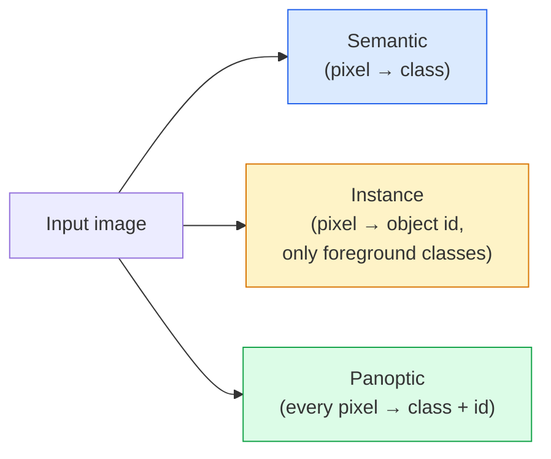
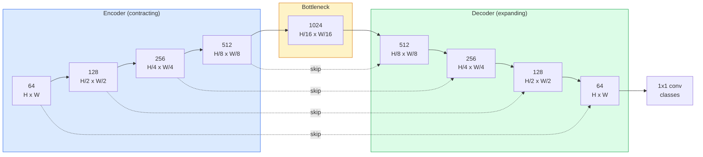

# Семантическая сегментация — U-Net

> Сегментация — это классификация каждого пикселя. U-Net решает эту задачу, соединяя понижающий разрешение энкодер с повышающим разрешение декодером и связывая их skip-соединениями (skip connections).

**Тип:** Build
**Языки:** Python
**Предварительные требования:** Фаза 4, урок 03 (CNN), Фаза 4, урок 04 (Классификация изображений)
**Время:** ~75 минут

## Цели обучения

- Различать семантическую, инстанс- и паноптическую сегментацию и выбирать подходящую задачу для конкретной проблемы
- Построить U-Net с нуля на PyTorch с блоками энкодера, боттлнеком, декодером с транспонированными свёртками и skip-соединениями
- Реализовать поэлементную кросс-энтропию, функцию потерь Dice и комбинированную функцию потерь, которая сегодня является стандартом по умолчанию для медицинской и промышленной сегментации
- Читать метрики IoU и Dice по классам и диагностировать, вызвана ли низкая оценка недостаточной полнотой на мелких объектах, точностью границ или дисбалансом классов

## Проблема

Классификация выдаёт одну метку на изображение. Детекция выдаёт горстку рамок на изображение. Сегментация выдаёт одну метку на пиксель. Для входа размером `H x W` выход — это тензор формы `H x W` (семантическая сегментация) или `H x W x N_instances` (инстанс-сегментация). Это миллионы предсказаний на изображение, а не одно.

Именно эта структура делает сегментацию основой почти каждого продукта плотного предсказания в компьютерном зрении: медицинская визуализация (маски опухолей), беспилотное вождение (дорога, полоса, препятствие), спутниковая съёмка (контуры зданий, границы полей), разбор документов (зоны разметки), робототехника (области, пригодные для захвата). Ни одну из этих задач нельзя решить, просто обведя объект рамкой; нужен точный силуэт.

Архитектурную проблему легко сформулировать, но нелегко решить: сети нужно одновременно видеть глобальный контекст изображения (что это за сцена) и локальную деталь на уровне пикселя (какой именно пиксель — дорога, а какой — тротуар). Стандартная CNN сжимает пространственное измерение, чтобы получить контекст, и тем самым теряет деталь. U-Net — это архитектура, которая добилась и того, и другого.

## Концепция

### Семантическая, инстанс- и паноптическая сегментация



- **Семантическая сегментация** говорит «этот пиксель — дорога, тот пиксель — машина». Две машины рядом друг с другом сливаются в одно пятно.
- **Инстанс-сегментация (instance segmentation)** говорит «этот пиксель — машина №3, тот пиксель — машина №5». Игнорирует фоновые сущности («stuff» — небо, дорога, трава).
- **Паноптическая сегментация (panoptic segmentation)** объединяет оба подхода: каждый пиксель получает метку класса, каждый экземпляр получает уникальный идентификатор, сегментируются и фон, и объекты.

Этот урок посвящён семантической сегментации. Следующий урок (Mask R-CNN) посвящён инстанс-сегментации.

### Форма U-Net



Энкодер четыре раза уменьшает пространственное разрешение вдвое и удваивает число каналов. Декодер делает обратное: четыре раза удваивает пространственное разрешение и уменьшает число каналов вдвое. Skip-соединения конкатенируют совпадающие признаки энкодера с признаками декодера на каждом уровне разрешения. Финальная свёртка 1x1 отображает `64 -> num_classes` при полном разрешении.

Почему skip-соединения необходимы: к моменту, когда декодер пытается выдать предсказания на уровне пикселей, он видел только маленькие карты признаков. Без skip-соединений он не может точно локализовать края, потому что эта информация была сжата ещё в энкодере. Skip-соединения передают ему карты признаков высокого разрешения, которые энкодер вычислил на пути вниз.

### Транспонированная свёртка против билинейного апсемплинга

Декодеру нужно расширять пространственные размерности. Есть два варианта:

- **Транспонированная свёртка** (`nn.ConvTranspose2d`) — обучаемый апсемплинг. Исторический вариант по умолчанию для U-Net. Может давать артефакты «шахматной доски», если шаг и размер ядра не делятся друг на друга без остатка.
- **Билинейный апсемплинг + свёртка 3x3** — плавный апсемплинг, за которым следует свёртка. Меньше артефактов, меньше параметров, сейчас это современный вариант по умолчанию.

Оба варианта встречаются на практике. Для первого U-Net билинейный апсемплинг безопаснее.

### Кросс-энтропия на пиксельной сетке

Для семантической сегментации с C классами выход модели — `(N, C, H, W)`. Целевые значения — `(N, H, W)` с целочисленными ID классов. Кросс-энтропия идентична случаю классификации, просто применяется в каждой пространственной позиции:

```
Loss = mean over (n, h, w) of -log( softmax(logits[n, :, h, w])[target[n, h, w]] )
```

`F.cross_entropy` в PyTorch нативно обрабатывает такую форму. Изменять форму тензора не нужно.

### Функция потерь Dice и зачем она нужна

Кросс-энтропия рассматривает каждый пиксель одинаково. Это неверно, когда один класс доминирует в кадре (медицинская визуализация: 99% фон, 1% опухоль). Сеть может набрать 99% точности, предсказывая фон везде, и при этом быть бесполезной.

Функция потерь Dice решает эту проблему, напрямую оптимизируя перекрытие между предсказанной и истинной маской:

```
Dice(p, y) = 2 * sum(p * y) / (sum(p) + sum(y) + epsilon)
Dice_loss = 1 - Dice
```

где `p` — карта вероятностей sigmoid/softmax для класса, а `y` — бинарная маска истинной разметки. Функция потерь равна нулю только при идеальном перекрытии. Поскольку она основана на отношении, дисбаланс классов не имеет значения.

На практике используйте **комбинированную функцию потерь**:

```
L = L_cross_entropy + lambda * L_dice       (lambda ~ 1)
```

Кросс-энтропия даёт стабильные градиенты на раннем этапе обучения; Dice фокусирует финальную часть обучения на реальном совпадении формы маски. Эта комбинация — стандарт по умолчанию в медицинской визуализации, и её трудно превзойти на любом наборе данных с дисбалансом классов.

### Метрики оценивания

- **Точность по пикселям (pixel accuracy)** — процент верно предсказанных пикселей. Дёшево. Ломается на несбалансированных данных по той же причине, что и точность в классификации.
- **IoU по классам** — пересечение над объединением (intersection over union) для маски каждого класса; среднее по классам = mIoU.
- **Dice (F1 по пикселям)** — похожа на IoU; `Dice = 2 * IoU / (1 + IoU)`. Медицинская визуализация предпочитает Dice, сообщество беспилотного вождения предпочитает IoU; они монотонно связаны друг с другом.
- **Граничная F1-мера** — измеряет, насколько предсказанные границы близки к границам истинной разметки, штрафуя даже небольшие смещения. Важна для задач, требующих высокой точности, например инспекции полупроводников.

Отчитывайтесь по IoU для каждого класса, а не только по mIoU. Средний IoU может скрыть класс на уровне 15%, когда девять других классов на уровне 85%.

### Компромисс с разрешением входа

Энкодер U-Net четыре раза уменьшает разрешение вдвое, поэтому вход должен делиться на 16 без остатка. Медицинские изображения часто имеют размер 512x512 или 1024x1024. Кропы для беспилотного вождения — 2048x1024. Затраты памяти U-Net масштабируются как `H * W * C_max`, и при 1024x1024 с 1024 каналами в боттлнеке прямой проход уже занимает гигабайты видеопамяти.

Два стандартных обходных пути:
1. Разбить вход на тайлы — обрабатывать тайлы 256x256 с перекрытием и сшивать.
2. Заменить боттлнек расширенными (dilated) свёртками, которые сохраняют более высокое пространственное разрешение, расширяя рецептивное поле (семейство DeepLab).

Для первой модели вход 256x256 с базовым U-Net на 64 канала комфортно обучается на 8 ГБ видеопамяти.

```figure
segmentation-flood
```

## Создаём

### Шаг 1: блок энкодера

Две свёртки 3x3 с пакетной нормализацией и ReLU. Первая свёртка меняет число каналов; вторая сохраняет его.

```python
import torch
import torch.nn as nn
import torch.nn.functional as F

class DoubleConv(nn.Module):
    def __init__(self, in_c, out_c):
        super().__init__()
        self.net = nn.Sequential(
            nn.Conv2d(in_c, out_c, kernel_size=3, padding=1, bias=False),
            nn.BatchNorm2d(out_c),
            nn.ReLU(inplace=True),
            nn.Conv2d(out_c, out_c, kernel_size=3, padding=1, bias=False),
            nn.BatchNorm2d(out_c),
            nn.ReLU(inplace=True),
        )

    def forward(self, x):
        return self.net(x)
```

Этот блок используется повторно на протяжении всей сети. `bias=False`, потому что beta в BN сама выполняет роль смещения.

### Шаг 2: блоки понижения и повышения разрешения

```python
class Down(nn.Module):
    def __init__(self, in_c, out_c):
        super().__init__()
        self.net = nn.Sequential(
            nn.MaxPool2d(2),
            DoubleConv(in_c, out_c),
        )

    def forward(self, x):
        return self.net(x)


class Up(nn.Module):
    def __init__(self, in_c, out_c):
        super().__init__()
        self.up = nn.Upsample(scale_factor=2, mode="bilinear", align_corners=False)
        self.conv = DoubleConv(in_c, out_c)

    def forward(self, x, skip):
        x = self.up(x)
        if x.shape[-2:] != skip.shape[-2:]:
            x = F.interpolate(x, size=skip.shape[-2:], mode="bilinear", align_corners=False)
        x = torch.cat([skip, x], dim=1)
        return self.conv(x)
```

Проверка только пространственной формы (`shape[-2:]`) обрабатывает входы, размерности которых не делятся на 16 без остатка; безопасный `F.interpolate` выравнивает тензор перед конкатенацией. Сравнение полной формы также срабатывало бы на различиях в числе каналов, а это должно быть громкой ошибкой, а не тихой интерполяцией.

### Шаг 3: сама U-Net

```python
class UNet(nn.Module):
    def __init__(self, in_channels=3, num_classes=2, base=64):
        super().__init__()
        self.inc = DoubleConv(in_channels, base)
        self.d1 = Down(base, base * 2)
        self.d2 = Down(base * 2, base * 4)
        self.d3 = Down(base * 4, base * 8)
        self.d4 = Down(base * 8, base * 16)
        self.u1 = Up(base * 16 + base * 8, base * 8)
        self.u2 = Up(base * 8 + base * 4, base * 4)
        self.u3 = Up(base * 4 + base * 2, base * 2)
        self.u4 = Up(base * 2 + base, base)
        self.outc = nn.Conv2d(base, num_classes, kernel_size=1)

    def forward(self, x):
        x1 = self.inc(x)
        x2 = self.d1(x1)
        x3 = self.d2(x2)
        x4 = self.d3(x3)
        x5 = self.d4(x4)
        x = self.u1(x5, x4)
        x = self.u2(x, x3)
        x = self.u3(x, x2)
        x = self.u4(x, x1)
        return self.outc(x)

net = UNet(in_channels=3, num_classes=2, base=32)
x = torch.randn(1, 3, 256, 256)
print(f"output: {net(x).shape}")
print(f"params: {sum(p.numel() for p in net.parameters()):,}")
```

Форма выхода `(1, 2, 256, 256)` — то же пространственное разрешение, что и у входа, `num_classes` каналов. Около 7,7 млн параметров при `base=32`.

### Шаг 4: функции потерь

```python
def dice_loss(logits, targets, num_classes, eps=1e-6):
    probs = F.softmax(logits, dim=1)
    targets_one_hot = F.one_hot(targets, num_classes).permute(0, 3, 1, 2).float()
    dims = (0, 2, 3)
    intersection = (probs * targets_one_hot).sum(dim=dims)
    denom = probs.sum(dim=dims) + targets_one_hot.sum(dim=dims)
    dice = (2 * intersection + eps) / (denom + eps)
    return 1 - dice.mean()


def combined_loss(logits, targets, num_classes, lam=1.0):
    ce = F.cross_entropy(logits, targets)
    dc = dice_loss(logits, targets, num_classes)
    return ce + lam * dc, {"ce": ce.item(), "dice": dc.item()}
```

Dice вычисляется по классам, затем усредняется (макро-Dice). `eps` предотвращает деление на ноль для классов, отсутствующих в пакете.

### Шаг 5: метрика IoU

```python
@torch.no_grad()
def iou_per_class(logits, targets, num_classes):
    preds = logits.argmax(dim=1)
    ious = torch.zeros(num_classes)
    for c in range(num_classes):
        pred_c = (preds == c)
        true_c = (targets == c)
        inter = (pred_c & true_c).sum().float()
        union = (pred_c | true_c).sum().float()
        ious[c] = (inter / union) if union > 0 else torch.tensor(float("nan"))
    return ious
```

Возвращает вектор длины C. `nan` помечает классы, отсутствующие в пакете — не усредняйте по ним при вычислении mIoU.

### Шаг 6: синтетический набор данных для сквозной проверки

Сгенерируйте фигуры на цветных фонах, чтобы сети пришлось учить форму, а не цвет пикселей.

```python
import numpy as np
from torch.utils.data import Dataset, DataLoader

def synthetic_segmentation(num_samples=200, size=64, seed=0):
    rng = np.random.default_rng(seed)
    images = np.zeros((num_samples, size, size, 3), dtype=np.float32)
    masks = np.zeros((num_samples, size, size), dtype=np.int64)
    for i in range(num_samples):
        bg = rng.uniform(0, 1, (3,))
        images[i] = bg
        masks[i] = 0
        num_shapes = rng.integers(1, 4)
        for _ in range(num_shapes):
            cls = int(rng.integers(1, 3))
            color = rng.uniform(0, 1, (3,))
            cx, cy = rng.integers(10, size - 10, size=2)
            r = int(rng.integers(4, 12))
            yy, xx = np.meshgrid(np.arange(size), np.arange(size), indexing="ij")
            if cls == 1:
                mask = (xx - cx) ** 2 + (yy - cy) ** 2 < r ** 2
            else:
                mask = (np.abs(xx - cx) < r) & (np.abs(yy - cy) < r)
            images[i][mask] = color
            masks[i][mask] = cls
        images[i] += rng.normal(0, 0.02, images[i].shape)
        images[i] = np.clip(images[i], 0, 1)
    return images, masks


class SegDataset(Dataset):
    def __init__(self, images, masks):
        self.images = images
        self.masks = masks

    def __len__(self):
        return len(self.images)

    def __getitem__(self, i):
        img = torch.from_numpy(self.images[i]).permute(2, 0, 1).float()
        mask = torch.from_numpy(self.masks[i]).long()
        return img, mask
```

Три класса: фон (0), круги (1), квадраты (2). Сеть должна научиться различать форму.

### Шаг 7: цикл обучения

```python
def train_one_epoch(model, loader, optimizer, device, num_classes):
    model.train()
    loss_sum, total = 0.0, 0
    iou_sum = torch.zeros(num_classes)
    for x, y in loader:
        x, y = x.to(device), y.to(device)
        logits = model(x)
        loss, _ = combined_loss(logits, y, num_classes)
        optimizer.zero_grad()
        loss.backward()
        optimizer.step()
        loss_sum += loss.item() * x.size(0)
        total += x.size(0)
        iou_sum += iou_per_class(logits, y, num_classes).nan_to_num(0)
    return loss_sum / total, iou_sum / len(loader)
```

Запустите это на 10-30 эпох на синтетическом наборе данных и понаблюдайте, как mIoU поднимается выше 0,9 для классов-фигур. Обратите внимание, что `nan_to_num(0)` считает отсутствующие в пакете классы нулевыми; для точного IoU по классам маскируйте по присутствию и используйте `torch.nanmean` по пакетам на этапе оценивания, а не усредняйте здесь.

## Применяем

Для продакшена `segmentation_models_pytorch` («smp») оборачивает любую стандартную архитектуру сегментации с любым бэкбоном torchvision или timm. Три строки:

```python
import segmentation_models_pytorch as smp

model = smp.Unet(
    encoder_name="resnet34",
    encoder_weights="imagenet",
    in_channels=3,
    classes=3,
)
```

Также стоит знать для реальной работы:
- **DeepLabV3+** заменяет понижение разрешения на основе максимального пулинга расширенными (dilated) свёртками, так что боттлнек сохраняет разрешение; быстрее по границам на спутниковых данных и данных беспилотного вождения.
- **SegFormer** заменяет свёрточный энкодер иерархическим трансформером; текущий SOTA на многих бенчмарках.
- **Mask2Former** / **OneFormer** объединяют семантическую, инстанс- и паноптическую сегментацию в единой архитектуре.

Все три — взаимозаменяемые варианты в `smp` или `transformers` с тем же загрузчиком данных.

## Публикуем

Этот урок производит:

- `outputs/prompt-segmentation-task-picker.md` — промпт, который выбирает между семантической, инстанс- и паноптической сегментацией и называет архитектуру для конкретной задачи.
- `outputs/skill-segmentation-mask-inspector.md` — скилл, который сообщает распределение классов, статистику предсказанной маски и классы, которые недопредсказаны или имеют размытые границы.

## Упражнения

1. **(Лёгкое)** Реализуйте `bce_dice_loss` для задачи бинарной сегментации (передний план против фона). Проверьте на синтетическом двухклассовом наборе данных, что комбинированная функция потерь сходится быстрее, чем одна только BCE, когда передний план занимает 5% пикселей.
2. **(Среднее)** Замените блок повышения разрешения `nn.Upsample + conv` на блок повышения разрешения `nn.ConvTranspose2d`. Обучите оба варианта на синтетическом наборе данных и сравните mIoU. Понаблюдайте, где в варианте с транспонированной свёрткой появляются артефакты «шахматной доски».
3. **(Сложное)** Возьмите реальный набор данных для сегментации (Oxford-IIIT Pets, мини-разбиение Cityscapes или медицинское подмножество) и обучите U-Net до значения в пределах 2 пунктов IoU от эталона `smp.Unet`. Сообщите IoU по классам и определите, каким классам комбинация с Dice в функции потерь приносит наибольшую пользу.

## Ключевые термины

| Термин | Как обычно говорят | Что это означает на самом деле |
|------|----------------|----------------------|
| Семантическая сегментация | «Разметить каждый пиксель» | Поклассовая классификация каждого пикселя из C классов; экземпляры одного класса сливаются |
| Инстанс-сегментация | «Разметить каждый объект» | Разделяет различные экземпляры одного класса; только передний план |
| Паноптическая сегментация | «Семантическая + инстанс-сегментация» | Каждый пиксель получает класс; каждый экземпляр объекта также получает уникальный идентификатор |
| Skip-соединение | «Мост U-Net» | Конкатенация признаков энкодера с признаками декодера того же разрешения; сохраняет высокочастотную деталь |
| Транспонированная свёртка | «Деконволюция» | Обучаемый апсемплинг; может давать артефакты «шахматной доски» |
| Функция потерь Dice | «Функция потерь на перекрытии» | 1 - 2|A ∩ B| / (|A| + |B|); напрямую оптимизирует перекрытие маски и устойчива к дисбалансу классов |
| mIoU | «Среднее пересечение над объединением» | Средний IoU по классам; стандартная в сообществе метрика для сегментации |
| Граничная F1-мера | «Точность границ» | F1-оценка, вычисленная только по граничным пикселям; важна для задач, критичных к точности |

## Дополнительные материалы

- [U-Net: Convolutional Networks for Biomedical Image Segmentation (Ronneberger et al., 2015)](https://arxiv.org/abs/1505.04597) — оригинальная статья; рисунок, который все копируют, находится на странице 2
- [Fully Convolutional Networks (Long et al., 2015)](https://arxiv.org/abs/1411.4038) — статья, впервые сделавшая сегментацию сквозной свёрточной задачей
- [segmentation_models_pytorch](https://github.com/qubvel/segmentation_models.pytorch) — эталон для сегментации в продакшене; все стандартные архитектуры плюс все стандартные функции потерь
- [Уроки обучения сегментации уровня SOTA (соревнования kaggle.com)](https://www.kaggle.com/code/iafoss/carvana-unet-pytorch) — разбор того, почему TTA, псевдоразметка и веса классов важны на реальных данных
