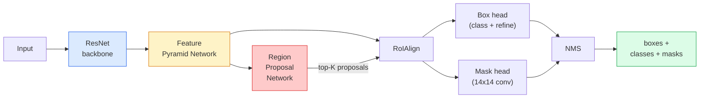

# Инстанс-сегментация — Mask R-CNN

> Добавьте крошечную ветвь предсказания маски к детектору Faster R-CNN — и вы получите инстанс-сегментацию (instance segmentation). Сложная часть — RoIAlign, и она сложнее, чем кажется на первый взгляд.

**Тип:** Build + Learn
**Языки:** Python
**Предварительные требования:** Фаза 4, урок 06 (YOLO), Фаза 4, урок 07 (U-Net)
**Время:** ~75 минут

## Цели обучения

- Проследить архитектуру Mask R-CNN от начала до конца: бэкбон, FPN, RPN, RoIAlign, голова предсказания рамок, голова предсказания масок
- Реализовать RoIAlign с нуля и объяснить, почему RoIPool больше не используется
- Использовать предобученную модель torchvision `maskrcnn_resnet50_fpn_v2` для получения масок инстансов продакшен-качества и правильно читать формат её выхода
- Дообучить Mask R-CNN на небольшом пользовательском наборе данных, заменив головы предсказания рамок и масок и заморозив бэкбон

## Проблема

Семантическая сегментация даёт вам одну маску на класс. Инстанс-сегментация даёт вам одну маску на объект, даже когда два объекта относятся к одному классу. Подсчёт отдельных экземпляров, отслеживание по кадрам и измерение объектов (ограничивающая рамка каждого кирпича в стене, каждой клетки на изображении с микроскопа) — всё это требует инстанс-сегментации.

Mask R-CNN (He et al., 2017) решила эту задачу, переформулировав инстанс-сегментацию как детекцию плюс маску. Дизайн получился настолько чистым, что следующие пять лет почти каждая статья по инстанс-сегментации была вариантом Mask R-CNN, и реализация из torchvision до сих пор остаётся стандартом по умолчанию для продакшена на малых и средних наборах данных.

Сложная инженерная проблема — сэмплирование: как вырезать область признаков фиксированного размера из рамки-предложения, углы которой не совпадают с границами пикселей? Ошибка здесь стоит десятых долей пункта mAP везде. RoIAlign — это ответ.

## Концепция

### Архитектура



Пять составляющих, которые нужно понять:

1. **Бэкбон** — ResNet-50 или ResNet-101, обученный на ImageNet. Выдаёт иерархию карт признаков со страйдами 4, 8, 16, 32.
2. **FPN (Feature Pyramid Network)** — связи «сверху вниз» плюс латеральные связи, дающие каждому уровню C каналов семантически насыщенных признаков. Детекция обращается к тому уровню FPN, который соответствует размеру объекта.
3. **RPN (Region Proposal Network)** — небольшая свёрточная голова, которая в каждой позиции якоря предсказывает «есть ли здесь объект?» и «как уточнить рамку?». Выдаёт ~1000 предложений на изображение.
4. **RoIAlign** — сэмплирует патч признаков фиксированного размера (например, 7x7) из любой рамки на любом уровне FPN. Билинейное сэмплирование, без квантования.
5. **Головы** — двухслойная голова предсказания рамок, которая уточняет рамку и выбирает класс, плюс небольшая свёрточная голова, выдающая бинарную маску `28x28` для каждого предложения.

### Почему RoIAlign, а не RoIPool

Оригинальный Fast R-CNN использовал RoIPool, который разбивает рамку-предложение на сетку, берёт максимум признака в каждой ячейке и округляет все координаты до целых чисел. Это округление смещает карту признаков относительно координат входных пикселей на величину до целого пикселя карты признаков — небольшая ошибка на изображении 224x224, катастрофическая, когда карта признаков имеет страйд 32.

```
RoIPool:
  box (34.7, 51.3, 98.2, 142.9)
  round -> (34, 51, 98, 142)
  split grid -> round each cell boundary
  misalignment accumulates at every step

RoIAlign:
  box (34.7, 51.3, 98.2, 142.9)
  sample at exact float coordinates using bilinear interpolation
  no rounding anywhere
```

RoIAlign бесплатно поднимает AP масок на 3-4 пункта на COCO. Любой детектор, для которого важна локализация, теперь использует его — и YOLOv7 seg, и RT-DETR, и Mask2Former.

### RPN в один абзац

В каждой позиции карты признаков размещается K якорных рамок разных размеров и форм. Для каждого якоря предсказывается оценка объектности и регрессионное смещение, превращающее якорь в более точно подогнанную рамку. Оставляют ~1000 лучших по оценке рамок, применяют NMS при IoU 0,7 и передают уцелевшие рамки головам. RPN обучается со своей собственной мини-функцией потерь — той же структуры, что и функция потерь YOLO из урока 6, только с двумя классами (объект / не объект).

### Голова предсказания маски

Для каждого предложения (после RoIAlign) голова предсказания масок представляет собой крошечную FCN: четыре свёртки 3x3, деконволюция с шагом 2, финальная свёртка 1x1, выдающая `num_classes` выходных каналов при разрешении `28x28`. Сохраняется только канал, соответствующий предсказанному классу; остальные игнорируются. Это отделяет предсказание маски от классификации.

Маска 28x28 апсемплится до исходного пиксельного размера предложения, чтобы получить финальную бинарную маску.

### Функции потерь

Mask R-CNN складывает четыре функции потерь:

```
L = L_rpn_cls + L_rpn_box + L_box_cls + L_box_reg + L_mask
```

- `L_rpn_cls`, `L_rpn_box` — объектность + регрессия рамки для предложений RPN.
- `L_box_cls` — кросс-энтропия по (C+1) классам (включая фон) на классификаторе головы.
- `L_box_reg` — smooth L1 на уточнении рамки головой.
- `L_mask` — поэлементная бинарная кросс-энтропия на выходе маски 28x28.

У каждой функции потерь свой вес по умолчанию; реализация torchvision предоставляет их как аргументы конструктора.

### Формат выхода

`torchvision.models.detection.maskrcnn_resnet50_fpn_v2` возвращает список словарей, по одному на изображение:

```
{
    "boxes":  (N, 4) in (x1, y1, x2, y2) pixel coordinates,
    "labels": (N,) class IDs, 0 = background so indices are 1-based,
    "scores": (N,) confidence scores,
    "masks":  (N, 1, H, W) float masks in [0, 1] — threshold at 0.5 for binary,
}
```

Маска уже имеет полное разрешение изображения. Выход головы 28x28 был апсемплирован внутри модели.

```figure
cv3-roialign-sampling
```

## Создаём

### Шаг 1: RoIAlign с нуля

Это единственный компонент Mask R-CNN, который проще понять как код, чем как прозу.

```python
import torch
import torch.nn.functional as F

def roi_align_single(feature, box, output_size=7, spatial_scale=1 / 16.0):
    """
    feature: (C, H, W) single-image feature map
    box: (x1, y1, x2, y2) in original image pixel coordinates
    output_size: side of the output grid (7 for box head, 14 for mask head)
    spatial_scale: reciprocal of the feature map stride
    """
    C, H, W = feature.shape
    x1, y1, x2, y2 = [c * spatial_scale - 0.5 for c in box]
    bin_w = (x2 - x1) / output_size
    bin_h = (y2 - y1) / output_size

    grid_y = torch.linspace(y1 + bin_h / 2, y2 - bin_h / 2, output_size)
    grid_x = torch.linspace(x1 + bin_w / 2, x2 - bin_w / 2, output_size)
    yy, xx = torch.meshgrid(grid_y, grid_x, indexing="ij")

    gx = 2 * (xx + 0.5) / W - 1
    gy = 2 * (yy + 0.5) / H - 1
    grid = torch.stack([gx, gy], dim=-1).unsqueeze(0)
    sampled = F.grid_sample(feature.unsqueeze(0), grid, mode="bilinear",
                            align_corners=False)
    return sampled.squeeze(0)
```

Каждое число берётся из билинейно сэмплированной позиции. Никакого округления, никакого квантования, никаких потерянных градиентов.

### Шаг 2: сравнение с RoIAlign из torchvision

```python
from torchvision.ops import roi_align

feature = torch.randn(1, 16, 50, 50)
boxes = torch.tensor([[0, 10, 20, 100, 90]], dtype=torch.float32)  # (batch_idx, x1, y1, x2, y2)

ours = roi_align_single(feature[0], boxes[0, 1:].tolist(), output_size=7, spatial_scale=1/4)
theirs = roi_align(feature, boxes, output_size=(7, 7), spatial_scale=1/4, sampling_ratio=1, aligned=True)[0]

print(f"shape ours:   {tuple(ours.shape)}")
print(f"shape theirs: {tuple(theirs.shape)}")
print(f"max|diff|:    {(ours - theirs).abs().max().item():.3e}")
```

При `sampling_ratio=1` и `aligned=True` оба варианта совпадают с точностью до `1e-5`.

### Шаг 3: загрузка предобученной Mask R-CNN

```python
import torch
from torchvision.models.detection import maskrcnn_resnet50_fpn_v2, MaskRCNN_ResNet50_FPN_V2_Weights

model = maskrcnn_resnet50_fpn_v2(weights=MaskRCNN_ResNet50_FPN_V2_Weights.DEFAULT)
model.eval()
print(f"params: {sum(p.numel() for p in model.parameters()):,}")
print(f"classes (including background): {len(model.roi_heads.box_predictor.cls_score.out_features * [0])}")
```

46 млн параметров, 91 класс (COCO). Первый класс (id 0) — фон; всё, что модель действительно детектирует, начинается с id 1.

### Шаг 4: запуск инференса

```python
with torch.no_grad():
    x = torch.randn(3, 400, 600)
    predictions = model([x])
p = predictions[0]
print(f"boxes:  {tuple(p['boxes'].shape)}")
print(f"labels: {tuple(p['labels'].shape)}")
print(f"scores: {tuple(p['scores'].shape)}")
print(f"masks:  {tuple(p['masks'].shape)}")
```

Тензор маски имеет форму `(N, 1, H, W)`. Примените порог 0,5, чтобы получить бинарную маску для каждого объекта:

```python
binary_masks = (p['masks'] > 0.5).squeeze(1)  # (N, H, W) boolean
```

### Шаг 5: замена голов под пользовательское число классов

Типичный рецепт дообучения: переиспользовать бэкбон, FPN и RPN; заменить две головы-классификатора.

```python
from torchvision.models.detection.faster_rcnn import FastRCNNPredictor
from torchvision.models.detection.mask_rcnn import MaskRCNNPredictor

def build_custom_maskrcnn(num_classes):
    model = maskrcnn_resnet50_fpn_v2(weights=MaskRCNN_ResNet50_FPN_V2_Weights.DEFAULT)
    in_features = model.roi_heads.box_predictor.cls_score.in_features
    model.roi_heads.box_predictor = FastRCNNPredictor(in_features, num_classes)
    in_features_mask = model.roi_heads.mask_predictor.conv5_mask.in_channels
    hidden_layer = 256
    model.roi_heads.mask_predictor = MaskRCNNPredictor(in_features_mask, hidden_layer, num_classes)
    return model

custom = build_custom_maskrcnn(num_classes=5)
print(f"custom cls_score.out_features: {custom.roi_heads.box_predictor.cls_score.out_features}")
```

`num_classes` должен включать класс фона, поэтому для набора данных с 4 классами объектов используется `num_classes=5`.

### Шаг 6: замораживание того, что не нужно обучать

На небольших наборах данных заморозьте бэкбон и FPN. Обучаться будут только объектность + регрессия RPN и две головы.

```python
def freeze_backbone_and_fpn(model):
    # torchvision Mask R-CNN packs the FPN inside `model.backbone` (as
    # `model.backbone.fpn`), so iterating `model.backbone.parameters()` covers
    # both the ResNet feature layers and the FPN lateral/output convs.
    for p in model.backbone.parameters():
        p.requires_grad = False
    return model

custom = freeze_backbone_and_fpn(custom)
trainable = sum(p.numel() for p in custom.parameters() if p.requires_grad)
print(f"trainable after freeze: {trainable:,}")
```

На наборах данных из 500 изображений это разница между сходимостью и переобучением.

## Применяем

Полный цикл обучения Mask R-CNN в torchvision занимает 40 строк и не меняется существенно от задачи к задаче — замените наборы данных и запускайте.

```python
def train_step(model, images, targets, optimizer):
    model.train()
    loss_dict = model(images, targets)
    losses = sum(loss for loss in loss_dict.values())
    optimizer.zero_grad()
    losses.backward()
    optimizer.step()
    return {k: v.item() for k, v in loss_dict.items()}
```

Список `targets` должен содержать словари на каждое изображение с `boxes`, `labels` и `masks` (в виде бинарных тензоров `(num_instances, H, W)`). Во время обучения модель возвращает словарь из четырёх функций потерь, а во время оценивания — список предсказаний, в зависимости от значения `model.training`.

Оценщик `pycocotools` выдаёт mAP@IoU=0.5:0.95 отдельно для рамок и для масок; вам нужны оба числа, чтобы понять, что является узким местом — голова предсказания рамок или голова предсказания масок.

## Публикуем

Этот урок производит:

- `outputs/prompt-instance-vs-semantic-router.md` — промпт, который задаёт три вопроса и выбирает между инстанс-, семантической и паноптической сегментацией, а также называет конкретную модель для старта.
- `outputs/skill-mask-rcnn-head-swapper.md` — скилл, который генерирует 10 строк кода для замены голов в любой детекционной модели torchvision, учитывая новое значение `num_classes`.

## Упражнения

1. **(Лёгкое)** Проверьте вашу RoIAlign против `torchvision.ops.roi_align` на 100 случайных рамках. Сообщите максимальную абсолютную разницу. Также запустите RoIPool (поведение до 2017 года) и покажите, что она расходится на ~1-2 пикселя карты признаков на рамках у границы.
2. **(Среднее)** Дообучите `maskrcnn_resnet50_fpn_v2` на пользовательском наборе данных из 50 изображений (любые два класса: воздушные шары, рыбы, выбоины, логотипы). Заморозьте бэкбон, обучайте 20 эпох, сообщите AP масок при IoU 0.5.
3. **(Сложное)** Замените голову предсказания масок Mask R-CNN на голову, предсказывающую при разрешении 56x56 вместо 28x28. Измерьте mAP@IoU=0.75 до и после. Объясните, почему прирост (или его отсутствие) соответствует ожидаемому компромиссу между точностью границ и памятью.

## Ключевые термины

| Термин | Как обычно говорят | Что это означает на самом деле |
|------|----------------|----------------------|
| Mask R-CNN | «Детекция плюс маски» | Faster R-CNN + небольшая голова FCN, предсказывающая маску 28x28 для каждого предложения и каждого класса |
| FPN | «Пирамида признаков» | Связи «сверху вниз» плюс латеральные связи, дающие каждому уровню страйда C каналов семантически насыщенных признаков |
| RPN | «Предлагатель регионов» | Небольшая свёрточная голова, выдающая ~1000 предложений «объект/не объект» на изображение |
| RoIAlign | «Вырезка без округления» | Билинейно сэмплирует сетку признаков фиксированного размера из любой рамки с координатами с плавающей точкой |
| RoIPool | «Вырезка до 2017 года» | Та же цель, что у RoIAlign, но с округлением координат рамки; устарела |
| Mask AP | «mAP для инстансов» | Средняя точность, вычисленная по IoU масок вместо IoU рамок; метрика инстанс-сегментации в COCO |
| Голова предсказания бинарных масок | «Маска на класс» | Предсказывает одну бинарную маску на класс для каждого предложения; сохраняется только канал предсказанного класса |
| Фоновый класс | «Класс 0» | Класс-«всё остальное», означающий «нет объекта»; индексы реальных классов начинаются с 1 |

## Дополнительные материалы

- [Mask R-CNN (He et al., 2017)](https://arxiv.org/abs/1703.06870) — статья; раздел 3 о RoIAlign — критически важное чтение
- [FPN: Feature Pyramid Networks (Lin et al., 2017)](https://arxiv.org/abs/1612.03144) — статья про FPN; используется в каждом современном детекторе
- [Руководство по Mask R-CNN в torchvision](https://pytorch.org/tutorials/intermediate/torchvision_tutorial.html) — эталон для цикла дообучения
- [Каталог моделей Detectron2](https://github.com/facebookresearch/detectron2/blob/main/MODEL_ZOO.md) — продакшен-реализации с обученными весами почти для каждого варианта детекции и сегментации
