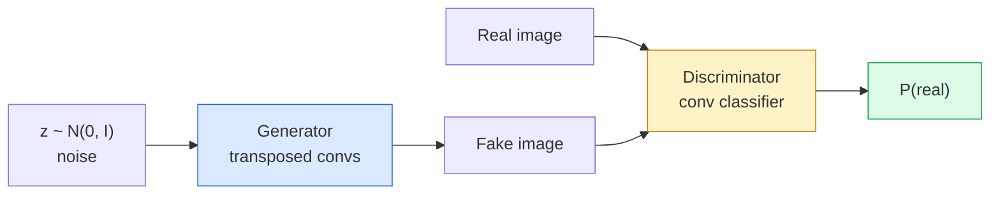
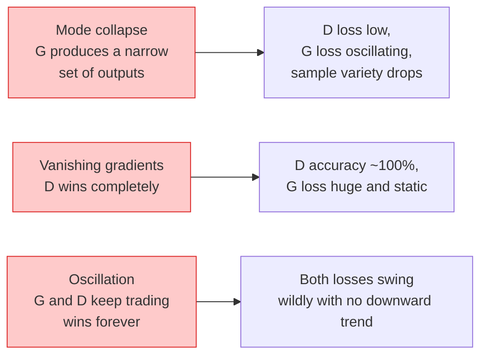

# Генерация изображений — GAN

> GAN — это две нейронные сети в фиксированной игре. Одна рисует, другая критикует. Они улучшаются вместе, пока рисунки не начинают обманывать критика.

**Тип:** Build
**Языки:** Python
**Предварительные требования:** Фаза 4, урок 03 (CNN), Фаза 3, урок 06 (Оптимизаторы), Фаза 3, урок 07 (Регуляризация)
**Время:** ~75 минут

## Цели обучения

- Объяснить минимаксную игру между генератором и дискриминатором и почему равновесие соответствует p_model = p_data
- Реализовать DCGAN на PyTorch и заставить его генерировать связные синтетические изображения 32x32 менее чем за 60 строк
- Стабилизировать обучение GAN тремя стандартными приёмами: ненасыщающая функция потерь, спектральная нормализация, TTUR (правило обновления с двумя временными масштабами)
- Читать кривые обучения, которые различают здоровую сходимость, коллапс мод, колебания и полную победу дискриминатора

## Проблема

Классификация учит сеть отображать изображения в метки. Генерация переворачивает задачу: сэмплировать новые изображения, которые выглядят так, будто они пришли из того же распределения. Здесь нет «правильного» выхода, с которым можно было бы сравнить через diff; есть только распределение, которое нужно имитировать.

Стандартные функции потерь (MSE, кросс-энтропия) не могут измерить «пришёл ли этот образец из реального распределения». Минимизация поэлементной ошибки даёт размытые усреднения, а не реалистичные образцы. Прорыв состоял в том, чтобы выучить саму функцию потерь: обучить вторую сеть, чья задача — отличать реальное от поддельного, и использовать её суждение, чтобы подталкивать генератор.

GAN (Goodfellow et al., 2014) определили эту схему. К 2018 году StyleGAN уже генерировал лица 1024x1024, неотличимые от фотографий. С тех пор диффузионные модели захватили трон по качеству и управляемости, но каждый приём, который сделал диффузию практичной — выбор нормализации, латентные пространства, функции потерь по признакам, — был впервые понят именно на GAN.

## Концепция

### Две сети



**Генератор** G берёт вектор шума `z` и выдаёт изображение. **Дискриминатор** D берёт изображение и выдаёт единственное скалярное значение: вероятность того, что изображение реально.

### Игра

G хочет, чтобы D ошибался. D хочет быть правым. Формально:

```
min_G max_D  E_x[log D(x)] + E_z[log(1 - D(G(z)))]
```

Читайте справа налево: D максимизирует точность на реальных (`log D(real)`) и поддельных (`log (1 - D(fake))`) изображениях. G минимизирует точность D на подделках — он хочет, чтобы `D(G(z))` было высоким.

Гудфеллоу доказал, что у этой минимаксной игры есть глобальное равновесие, при котором `p_G = p_data`, D везде выдаёт 0,5, а дивергенция Йенсена-Шеннона между сгенерированным и реальным распределениями равна нулю. Сложная часть — добраться до этого равновесия.

### Ненасыщающая функция потерь

Форма выше численно нестабильна. На раннем этапе обучения `D(G(z))` близко к нулю для каждой подделки, поэтому `log(1 - D(G(z)))` даёт исчезающие градиенты по отношению к G. Решение: перевернуть функцию потерь G.

```
L_D = -E_x[log D(x)] - E_z[log(1 - D(G(z)))]
L_G = -E_z[log D(G(z))]                          # non-saturating
```

Теперь, когда `D(G(z))` близко к нулю, потери G велики, и их градиент информативен. Каждый современный GAN обучается с этим вариантом.

### Правила архитектуры DCGAN

Рэдфорд, Метц и Чинтала (2015) обобщили годы неудачных экспериментов в пять правил, делающих обучение GAN стабильным:

1. Заменить пулинг свёртками с шагом (в обеих сетях).
2. Использовать пакетную нормализацию и в генераторе, и в дискриминаторе, кроме выхода G и входа D.
3. Убрать полносвязные слои в более глубоких архитектурах.
4. G использует ReLU на всех слоях, кроме выхода (tanh для выхода в диапазоне [-1, 1]).
5. D использует LeakyReLU (negative_slope=0.2) на всех слоях.

Каждый современный свёрточный GAN (StyleGAN, BigGAN, GigaGAN) до сих пор отталкивается от этих правил и по очереди заменяет отдельные части.

### Режимы сбоя и их признаки



- **Коллапс мод (mode collapse)**: G находит одно изображение, которое обманывает D, и генерирует только его. Решение: добавить дискриминацию мини-пакетов, спектральную нормализацию или обусловливание по меткам.
- **Дискриминатор побеждает**: D становится слишком сильным слишком быстро, градиенты G исчезают. Решение: меньший D, более низкая скорость обучения D или сглаживание меток на реальных примерах.
- **Колебания**: две сети обмениваются победами, так и не приближаясь к равновесию. Решение: TTUR (D обучается быстрее G в 2-4 раза) или переход на функцию потерь Вассерштейна.

### Оценивание

У GAN нет эталонной истины, так как же понять, что они работают?

- **Визуальный осмотр образцов** — просто смотрите на 64 образца в конце каждой эпохи. Обязательно.
- **FID (Fréchet Inception Distance)** — расстояние между распределениями признаков Inception-v3 для реальных и сгенерированных наборов. Чем меньше, тем лучше. Стандарт сообщества.
- **Inception Score** — более старая, более хрупкая метрика; предпочитайте FID.
- **Точность и полнота для генеративных моделей** — измеряет качество (точность) и охват (полноту) по отдельности. Информативнее, чем один только FID.

Для небольшого прогона на синтетических данных достаточно визуального осмотра образцов.

```figure
cv-gan-image
```

## Создаём

### Шаг 1: генератор

Небольшой генератор DCGAN, который берёт 64-мерный шум и выдаёт изображение 32x32.

```python
import torch
import torch.nn as nn

class Generator(nn.Module):
    def __init__(self, z_dim=64, img_channels=3, feat=64):
        super().__init__()
        self.net = nn.Sequential(
            nn.ConvTranspose2d(z_dim, feat * 4, kernel_size=4, stride=1, padding=0, bias=False),
            nn.BatchNorm2d(feat * 4),
            nn.ReLU(inplace=True),
            nn.ConvTranspose2d(feat * 4, feat * 2, kernel_size=4, stride=2, padding=1, bias=False),
            nn.BatchNorm2d(feat * 2),
            nn.ReLU(inplace=True),
            nn.ConvTranspose2d(feat * 2, feat, kernel_size=4, stride=2, padding=1, bias=False),
            nn.BatchNorm2d(feat),
            nn.ReLU(inplace=True),
            nn.ConvTranspose2d(feat, img_channels, kernel_size=4, stride=2, padding=1, bias=False),
            nn.Tanh(),
        )

    def forward(self, z):
        return self.net(z.view(z.size(0), -1, 1, 1))
```

Четыре транспонированные свёртки, каждая с `kernel_size=4, stride=2, padding=1`, чтобы чисто удваивать пространственный размер. Выходные активации в диапазоне [-1, 1] через tanh.

### Шаг 2: дискриминатор

Зеркальное отражение генератора. LeakyReLU, свёртки с шагом, заканчивается скалярным логитом.

```python
class Discriminator(nn.Module):
    def __init__(self, img_channels=3, feat=64):
        super().__init__()
        self.net = nn.Sequential(
            nn.Conv2d(img_channels, feat, kernel_size=4, stride=2, padding=1),
            nn.LeakyReLU(0.2, inplace=True),
            nn.Conv2d(feat, feat * 2, kernel_size=4, stride=2, padding=1, bias=False),
            nn.BatchNorm2d(feat * 2),
            nn.LeakyReLU(0.2, inplace=True),
            nn.Conv2d(feat * 2, feat * 4, kernel_size=4, stride=2, padding=1, bias=False),
            nn.BatchNorm2d(feat * 4),
            nn.LeakyReLU(0.2, inplace=True),
            nn.Conv2d(feat * 4, 1, kernel_size=4, stride=1, padding=0),
        )

    def forward(self, x):
        return self.net(x).view(-1)
```

Последняя свёртка сжимает карту признаков `4x4` до `1x1`. Выход — единственный скаляр на изображение; sigmoid применяется только при вычислении функции потерь.

### Шаг 3: шаг обучения

Чередование: сначала обновить D, затем G, на каждом пакете.

```python
import torch.nn.functional as F

def train_step(G, D, real, z, opt_g, opt_d, device):
    real = real.to(device)
    bs = real.size(0)

    # D step
    opt_d.zero_grad()
    d_real = D(real)
    d_fake = D(G(z).detach())
    loss_d = (F.binary_cross_entropy_with_logits(d_real, torch.ones_like(d_real))
              + F.binary_cross_entropy_with_logits(d_fake, torch.zeros_like(d_fake)))
    loss_d.backward()
    opt_d.step()

    # G step
    opt_g.zero_grad()
    d_fake = D(G(z))
    loss_g = F.binary_cross_entropy_with_logits(d_fake, torch.ones_like(d_fake))
    loss_g.backward()
    opt_g.step()

    return loss_d.item(), loss_g.item()
```

`G(z).detach()` на шаге D критически важен: мы не хотим, чтобы градиенты текли в G во время обновления D. Забыть об этом — классическая ошибка новичка.

### Шаг 4: полный цикл обучения на синтетических фигурах

```python
from torch.utils.data import DataLoader, TensorDataset
import numpy as np

def synthetic_images(num=2000, size=32, seed=0):
    rng = np.random.default_rng(seed)
    imgs = np.zeros((num, 3, size, size), dtype=np.float32) - 1.0
    for i in range(num):
        r = rng.uniform(6, 12)
        cx, cy = rng.uniform(r, size - r, size=2)
        yy, xx = np.meshgrid(np.arange(size), np.arange(size), indexing="ij")
        mask = (xx - cx) ** 2 + (yy - cy) ** 2 < r ** 2
        color = rng.uniform(-0.5, 1.0, size=3)
        for c in range(3):
            imgs[i, c][mask] = color[c]
    return torch.from_numpy(imgs)

device = "cuda" if torch.cuda.is_available() else "cpu"
data = synthetic_images()
loader = DataLoader(TensorDataset(data), batch_size=64, shuffle=True)

G = Generator(z_dim=64, img_channels=3, feat=32).to(device)
D = Discriminator(img_channels=3, feat=32).to(device)
opt_g = torch.optim.Adam(G.parameters(), lr=2e-4, betas=(0.5, 0.999))
opt_d = torch.optim.Adam(D.parameters(), lr=2e-4, betas=(0.5, 0.999))

for epoch in range(10):
    for (batch,) in loader:
        z = torch.randn(batch.size(0), 64, device=device)
        ld, lg = train_step(G, D, batch, z, opt_g, opt_d, device)
    print(f"epoch {epoch}  D {ld:.3f}  G {lg:.3f}")
```

`Adam(lr=2e-4, betas=(0.5, 0.999))` — вариант по умолчанию для DCGAN: низкий beta1 не даёт моменту чрезмерно стабилизировать состязательную игру.

### Шаг 5: сэмплирование

```python
@torch.no_grad()
def sample(G, n=16, z_dim=64, device="cpu"):
    G.eval()
    z = torch.randn(n, z_dim, device=device)
    imgs = G(z)
    imgs = (imgs + 1) / 2
    return imgs.clamp(0, 1)
```

Всегда переключайтесь в режим eval перед сэмплированием. Для DCGAN это важно, потому что вместо статистик пакета используются накопленные статистики пакетной нормализации.

### Шаг 6: спектральная нормализация

Прямая замена BN в дискриминаторе, гарантирующая, что сеть является 1-липшицевой. Устраняет большинство сбоев вида «D побеждает слишком уверенно».

```python
from torch.nn.utils import spectral_norm

def build_sn_discriminator(img_channels=3, feat=64):
    return nn.Sequential(
        spectral_norm(nn.Conv2d(img_channels, feat, 4, 2, 1)),
        nn.LeakyReLU(0.2, inplace=True),
        spectral_norm(nn.Conv2d(feat, feat * 2, 4, 2, 1)),
        nn.LeakyReLU(0.2, inplace=True),
        spectral_norm(nn.Conv2d(feat * 2, feat * 4, 4, 2, 1)),
        nn.LeakyReLU(0.2, inplace=True),
        spectral_norm(nn.Conv2d(feat * 4, 1, 4, 1, 0)),
    )
```

Замените `Discriminator` на `build_sn_discriminator()`, и часто трюк TTUR уже не понадобится. Спектральная нормализация — самое простое и эффективное улучшение устойчивости, которое можно применить.

## Применяем

Для серьёзной генерации используйте предобученные веса или переходите на диффузию. Две стандартные библиотеки:

- `torch_fidelity` вычисляет FID / IS для вашего генератора без написания собственного кода оценивания.
- `pytorch-gan-zoo` (устаревшая) и `StudioGAN` содержат протестированные реализации DCGAN, WGAN-GP, SN-GAN, StyleGAN и BigGAN.

В 2026 году GAN всё ещё остаются лучшим выбором для: генерации изображений в реальном времени (задержка <10 мс), переноса стиля, преобразования изображение-в-изображение с точным контролем (Pix2Pix, CycleGAN). Диффузия побеждает по фотореализму и обусловливанию по тексту.

## Публикуем

Этот урок производит:

- `outputs/prompt-gan-training-triage.md` — промпт, который читает описание кривой обучения и определяет режим сбоя (коллапс мод, победа D, колебания) плюс единственную рекомендуемую меру исправления.
- `outputs/skill-dcgan-scaffold.md` — скилл, который пишет каркас DCGAN на основе `z_dim`, целевого `image_size` и `num_channels`, включая цикл обучения и сохранение образцов.

## Упражнения

1. **(Лёгкое)** Обучите DCGAN выше на синтетическом наборе данных с кругами и сохраняйте сетку из 16 образцов в конце каждой эпохи. К какой эпохе сгенерированные круги становятся отчётливо круглыми?
2. **(Среднее)** Замените пакетную нормализацию дискриминатора на спектральную нормализацию. Обучите обе версии параллельно. Какая сходится быстрее? У какой ниже дисперсия по трём сидам?
3. **(Сложное)** Реализуйте условный DCGAN: подайте метку класса и в G, и в D (конкатенируйте вектор унитарного кодирования с шумом в G, конкатенируйте канал эмбеддинга класса в D). Обучите на синтетическом наборе данных «круги против квадратов» из урока 7 и покажите, что обусловливание по классу работает, сэмплируя с конкретными метками.

## Ключевые термины

| Термин | Как это называют | Что это означает на самом деле |
|------|----------------|----------------------|
| Генератор (G) | «Сеть, которая рисует» | Отображает шум в изображения; обучается обманывать дискриминатор |
| Дискриминатор (D) | «Критик» | Бинарный классификатор; обучается отличать реальные изображения от сгенерированных |
| Минимакс | «Игра» | Минимум по G и максимум по D состязательной функции потерь; равновесие — p_G = p_data |
| Ненасыщающая функция потерь | «Численно разумный вариант» | Функция потерь G — это -log(D(G(z))) вместо log(1 - D(G(z))), чтобы избежать исчезающих градиентов на раннем этапе обучения |
| Коллапс мод | «Генератор делает одно и то же» | G производит лишь небольшое подмножество распределения данных; исправляется спектральной нормализацией, дискриминацией мини-пакетов или увеличением пакета |
| TTUR | «Две скорости обучения» | D обучается быстрее G, обычно в 2-4 раза; стабилизирует обучение |
| Спектральная нормализация | «1-липшицев слой» | Нормализация весов, ограничивающая липшицеву константу каждого слоя; не даёт D становиться сколь угодно «крутым» |
| FID | «Fréchet Inception Distance» | Расстояние между распределениями признаков Inception-v3 для реальных и сгенерированных наборов; стандартная метрика оценивания |

## Дополнительные материалы

- [Generative Adversarial Networks (Goodfellow et al., 2014)](https://arxiv.org/abs/1406.2661) — статья, с которой всё началось
- [DCGAN (Radford, Metz, Chintala, 2015)](https://arxiv.org/abs/1511.06434) — архитектурные правила, сделавшие GAN обучаемыми
- [Spectral Normalization for GANs (Miyato et al., 2018)](https://arxiv.org/abs/1802.05957) — самый полезный приём стабилизации из всех
- [StyleGAN3 (Karras et al., 2021)](https://arxiv.org/abs/2106.12423) — передовая модель GAN; читается как сборник лучших хитов всех приёмов последнего десятилетия
