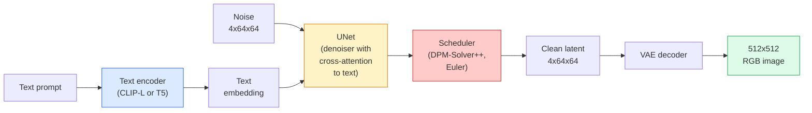

# Stable Diffusion — архитектура и дообучение

> Stable Diffusion — это DDPM, который работает в латентном пространстве предобученного VAE, обусловлен текстом через перекрёстное внимание (cross-attention), сэмплируется быстрым детерминированным решателем ОДУ (ODE solver) и управляется направлением без классификатора (classifier-free guidance).

**Тип:** Learn + Use
**Языки:** Python
**Предварительные требования:** Фаза 4, урок 10 (Диффузия), Фаза 7, урок 02 (Самовнимание)
**Время:** ~75 минут

## Цели обучения

- Проследить пять компонентов конвейера Stable Diffusion: VAE, текстовый энкодер, U-Net, планировщик, фильтр безопасности — и что каждый из них на самом деле делает
- Объяснить латентную диффузию (latent diffusion) и почему обучение в латентном пространстве 4x64x64 (вместо изображения 3x512x512) сокращает вычисления в 48 раз без потери качества
- Использовать `diffusers` для генерации изображений, а также для image-to-image, инпейнтинга и генерации под управлением ControlNet
- Дообучить Stable Diffusion с помощью LoRA на небольшом собственном наборе данных и загрузить LoRA-адаптер при инференсе

## Проблема

Обучение DDPM напрямую на RGB-изображениях 512x512 обходится дорого. Каждый шаг обучения выполняет обратное распространение ошибки через U-Net, который видит 3x512x512 = 786,432 входных значения, а сэмплирование требует 50+ прямых проходов через тот же U-Net. При уровне качества Stable Diffusion 1.5 (выпущена в 2022 году) диффузия в пространстве пикселей потребовала бы примерно 256 GPU-месяцев обучения и 10-30 секунд на изображение на потребительском GPU.

Приём, который сделал text-to-image с открытыми весами практичным, — это **латентная диффузия** (Rombach et al., CVPR 2022). Обучите VAE, который отображает изображение 3x512x512 в латентный тензор 4x64x64 и обратно, а затем выполняйте диффузию в этом латентном пространстве. Объём вычислений падает по формуле `(3*512*512)/(4*64*64) = 48x`. Сэмплирование сокращается с десятков секунд до менее двух секунд на том же GPU.

Почти каждая современная модель генерации изображений — SDXL, SD3, FLUX, HunyuanDiT, Wan-Video — представляет собой модель латентной диффузии с вариациями автокодировщика, шумоподавителя (denoiser; U-Net или DiT) и текстового кондиционирования. Изучив Stable Diffusion, вы изучите этот шаблон.

## Концепция

### Конвейер



- **VAE** — замороженный автокодировщик. Энкодер превращает изображение в латенты (используется для image-to-image и обучения). Декодер превращает латенты обратно в изображение.
- **Текстовый энкодер** — текстовый энкодер CLIP (SD 1.x/2.x), CLIP-L + CLIP-G (SDXL) или T5-XXL (SD3/FLUX). Выдаёт последовательность эмбеддингов токенов.
- **U-Net** — шумоподавитель. Содержит слои перекрёстного внимания, которые обращаются от латентов к текстовому эмбеддингу на каждом уровне разрешения.
- **Планировщик** — алгоритм сэмплирования (DDIM, Euler, DPM-Solver++). Выбирает значения sigma, подмешивает предсказанный шум обратно в латент.
- **Фильтр безопасности** — необязательный фильтр NSFW/незаконного контента для выходного изображения.

### Направление без классификатора (CFG)

Обычное текстовое кондиционирование обучает `epsilon_theta(x_t, t, c)` для каждого промпта `c`. CFG обучает ту же сеть с `c`, отбрасываемым в 10% случаев (заменяемым пустым эмбеддингом), что даёт единую модель, предсказывающую и условный, и безусловный шум. При инференсе:

```
eps = eps_uncond + w * (eps_cond - eps_uncond)
```

`w` — это коэффициент направления (guidance scale). При `w=0` — безусловная генерация, при `w=1` — обычная условная генерация, при `w>1` вывод сильнее «следует промпту» за счёт разнообразия. По умолчанию в SD `w=7.5`.

Именно благодаря CFG text-to-image работает на уровне продакшн-качества. Без него промпты слабо влияют на результат; с ним — промпты доминируют.

### Геометрия латентного пространства

4-канальный латент VAE — это не просто сжатое изображение. Это многообразие, в котором арифметические операции примерно соответствуют семантическим правкам (здесь работают и проектирование промптов, и интерполяция), и на которое диффузионный U-Net обучен тратить весь свой бюджет моделирования. Декодирование случайного латента 4x64x64 не даёт изображение, похожее на случайное, — оно даёт мусор, потому что в валидные изображения декодируется лишь определённое подмногообразие латентов.

Два следствия:

1. **Img2img** = закодировать изображение в латент, добавить частичный шум, запустить шумоподавитель, декодировать. Структура изображения сохраняется, потому что кодирование почти обратимо; содержание меняется в зависимости от промпта.
2. **Inpainting** = то же самое, что и img2img, но шумоподавитель обновляет только замаскированные области; немаскированные области остаются на уровне закодированного латента.

### Архитектура U-Net

U-Net в SD — это увеличенная версия TinyUNet из урока 10 с тремя дополнениями:

- **Блоки трансформера** на каждом пространственном разрешении, содержащие самовнимание (self-attention) и перекрёстное внимание к текстовому эмбеддингу.
- **Временной эмбеддинг** через MLP на синусоидальном кодировании.
- **Skip-соединения** между энкодером и декодером на соответствующих разрешениях.

Общее число параметров в SD 1.5: ~860M. SDXL: ~2.6B. FLUX: ~12B. Рост числа параметров приходится в основном на слои внимания.

### Дообучение с LoRA

Полное дообучение Stable Diffusion требует 20+ ГБ VRAM и обновляет 860M параметров. LoRA (низкоранговая адаптация, Low-Rank Adaptation) оставляет базовую модель замороженной и внедряет небольшие матрицы низкорангового разложения в слои внимания. LoRA-адаптер для SD обычно весит 10-50 МБ, обучается за 10-60 минут на одном потребительском GPU и загружается во время инференса как готовая надстройка.

```
Original: W_q : (d_in, d_out)   frozen
LoRA:     W_q + alpha * (A @ B)   where A : (d_in, r), B : (r, d_out)

r is typically 4-32.
```

LoRA — это то, как распространяется почти каждая дообученная сообществом модель. CivitAI и Hugging Face размещают миллионы таких адаптеров.

### Планировщики, которые вы увидите

- **DDIM** — детерминированный, ~50 шагов, простой.
- **Euler ancestral** — стохастический, 30-50 шагов, слегка более креативные сэмплы.
- **DPM-Solver++ 2M Karras** — детерминированный, 20-30 шагов, стандарт по умолчанию для продакшна.
- **LCM / TCD / Turbo** — consistency-модели и их дистиллированные варианты; 1-4 шага ценой некоторой потери качества.

Замена планировщика — это изменение в одну строку в `diffusers`, и иногда она устраняет проблемы с сэмплами без какого-либо переобучения.

```figure
cv3-latent-compression
```

## Создаём

Этот урок использует `diffusers` целиком, вместо того чтобы собирать Stable Diffusion с нуля. Компоненты, которые пришлось бы воссоздавать (VAE, текстовый энкодер, U-Net, планировщик), — темы отдельных уроков; здесь цель — свободное владение продакшн-API.

### Шаг 1: Text-to-image

```python
import torch
from diffusers import StableDiffusionPipeline

pipe = StableDiffusionPipeline.from_pretrained(
    "runwayml/stable-diffusion-v1-5",
    torch_dtype=torch.float16,
).to("cuda")

image = pipe(
    prompt="a dog riding a skateboard in tokyo, studio ghibli style",
    guidance_scale=7.5,
    num_inference_steps=25,
    generator=torch.Generator("cuda").manual_seed(42),
).images[0]
image.save("dog.png")
```

`float16` вдвое снижает потребление VRAM без заметной потери качества. `num_inference_steps=25` с планировщиком DPM-Solver++ по умолчанию даёт результат, сопоставимый с `num_inference_steps=50` при DDIM.

### Шаг 2: замена планировщика

```python
from diffusers import DPMSolverMultistepScheduler, EulerAncestralDiscreteScheduler

pipe.scheduler = DPMSolverMultistepScheduler.from_config(pipe.scheduler.config)
pipe.scheduler = EulerAncestralDiscreteScheduler.from_config(pipe.scheduler.config)
```

Состояние планировщика отделено от весов U-Net. Можно обучать на DDPM, а сэмплировать любым планировщиком.

### Шаг 3: Image-to-image

```python
from diffusers import StableDiffusionImg2ImgPipeline
from PIL import Image

img2img = StableDiffusionImg2ImgPipeline.from_pretrained(
    "runwayml/stable-diffusion-v1-5",
    torch_dtype=torch.float16,
).to("cuda")

init_image = Image.open("dog.png").convert("RGB").resize((512, 512))
out = img2img(
    prompt="a dog riding a skateboard, oil painting",
    image=init_image,
    strength=0.6,
    guidance_scale=7.5,
).images[0]
```

`strength` — это то, сколько шума добавляется перед шумоподавлением (0.0 = без изменений, 1.0 = полная регенерация). 0.5-0.7 — стандартный диапазон для переноса стиля.

### Шаг 4: Inpainting

```python
from diffusers import StableDiffusionInpaintPipeline

inpaint = StableDiffusionInpaintPipeline.from_pretrained(
    "runwayml/stable-diffusion-inpainting",
    torch_dtype=torch.float16,
).to("cuda")

image = Image.open("dog.png").convert("RGB").resize((512, 512))
mask = Image.open("dog_mask.png").convert("L").resize((512, 512))

out = inpaint(
    prompt="a cat",
    image=image,
    mask_image=mask,
    guidance_scale=7.5,
).images[0]
```

Белые пиксели маски — это область, которую нужно перегенерировать. Чёрные пиксели сохраняются.

### Шаг 5: загрузка LoRA

```python
pipe.load_lora_weights("sayakpaul/sd-lora-ghibli")
pipe.fuse_lora(lora_scale=0.8)

image = pipe(prompt="a village square in ghibli style").images[0]
```

`lora_scale` управляет силой эффекта; 0.0 = нет эффекта, 1.0 = полный эффект. `fuse_lora` «запекает» адаптер в веса на месте ради скорости, но не позволяет его заменить. Перед загрузкой другого адаптера вызовите `pipe.unfuse_lora()`.

### Шаг 6: обучение LoRA (набросок)

Реальное обучение LoRA находится в `peft` или `diffusers.training`. Общая схема:

```python
# Pseudocode
for step, batch in enumerate(dataloader):
    images, prompts = batch
    latents = vae.encode(images).latent_dist.sample() * 0.18215

    t = torch.randint(0, num_train_timesteps, (batch_size,))
    noise = torch.randn_like(latents)
    noisy_latents = scheduler.add_noise(latents, noise, t)

    text_emb = text_encoder(tokenizer(prompts))

    pred_noise = unet(noisy_latents, t, text_emb)  # LoRA weights injected here

    loss = F.mse_loss(pred_noise, noise)
    loss.backward()
    optimizer.step()
```

Градиент получают только матрицы LoRA; базовые U-Net, VAE и текстовый энкодер заморожены. При размере пакета 1 и использовании контрольных точек градиента (gradient checkpointing) это помещается в 8 ГБ VRAM.

## Применяем

В продакшне вам реально приходится принимать такие решения:

- **Семейство модели**: SD 1.5 для дообученных моделей сообщества с открытым исходным кодом, SDXL для более высокой точности, SD3 / FLUX для state of the art и строгих требований к лицензированию.
- **Планировщик**: DPM-Solver++ 2M Karras для 20-30 шагов, LCM-LoRA — когда задержка должна быть меньше 1с.
- **Точность**: `float16` на 4080/4090, `bfloat16` на A100 и новее, `int8` (через `bitsandbytes` или `compel`) при нехватке VRAM.
- **Кондиционирование**: обычный текст работает; для более сильного контроля добавьте ControlNet (canny, depth, pose) поверх базового конвейера.

Для пакетной генерации инструменты сообщества — `AUTO1111` / `ComfyUI`; для продакшн-API — `diffusers` + `accelerate` или `optimum-nvidia` с компиляцией TensorRT.

## Публикуем

Этот урок производит:

- `outputs/prompt-sd-pipeline-planner.md` — промпт, который выбирает SD 1.5 / SDXL / SD3 / FLUX, а также планировщик и точность, исходя из бюджета задержки, целевой точности и ограничений лицензирования.
- `outputs/skill-lora-training-setup.md` — навык, который пишет полную конфигурацию обучения LoRA для собственного набора данных, включая подписи, ранг, размер пакета и скорость обучения.

## Упражнения

1. **(Легко)** Сгенерируйте один и тот же промпт с `guidance_scale` из `[1, 3, 5, 7.5, 10, 15]`. Опишите, как меняется изображение. При каком значении guidance появляются артефакты?
2. **(Средне)** Возьмите любую реальную фотографию и пропустите её через `StableDiffusionImg2ImgPipeline` со `strength` из `[0.2, 0.4, 0.6, 0.8, 1.0]`. Какое значение strength сохраняет композицию, меняя при этом стиль? Почему при 1.0 входное изображение полностью игнорируется?
3. **(Сложно)** Обучите LoRA на 10-20 изображениях одного объекта (питомец, логотип, персонаж) и сгенерируйте новые сцены с этим объектом. Укажите ранг LoRA и число шагов обучения, при которых достигается наилучшее сохранение идентичности без переобучения на входных изображениях.

## Ключевые термины

| Термин | Как говорят люди | Что это на самом деле означает |
|------|----------------|----------------------|
| Латентная диффузия | «Диффузия в латентах» | Выполнение всего DDPM в латентном пространстве VAE (4x64x64) вместо пространства пикселей (3x512x512); экономия вычислений в 48 раз |
| Коэффициент масштабирования VAE | «0.18215» | Константа, которая масштабирует исходный латент VAE примерно до единичной дисперсии; зашита в каждом SD-конвейере |
| Направление без классификатора | «CFG» | Смешивание условных и безусловных предсказаний шума; самый влиятельный параметр инференса |
| Планировщик | «Сэмплер» | Алгоритм, который превращает шум и предсказания модели в траекторию шумоподавления латента |
| LoRA | «Низкоранговый адаптер» | Небольшие матрицы низкорангового разложения, которые дообучают слои внимания, не затрагивая базовые веса |
| Перекрёстное внимание | «Внимание между текстом и изображением» | Внимание от латентных токенов к текстовым токенам; внедряет информацию из промпта на каждом уровне U-Net |
| ControlNet | «Кондиционирование по структуре» | Отдельно обученный адаптер, который направляет SD с помощью дополнительного входа (canny, depth, pose, segmentation) |
| DPM-Solver++ | «Планировщик по умолчанию» | Детерминированный решатель ОДУ второго порядка; лучшее качество при малом числе шагов (20-30) в 2026 году |

## Дополнительные материалы

- [High-Resolution Image Synthesis with Latent Diffusion (Rombach et al., 2022)](https://arxiv.org/abs/2112.10752) — статья о Stable Diffusion; включает все абляции, обосновывающие дизайн
- [Classifier-Free Diffusion Guidance (Ho & Salimans, 2022)](https://arxiv.org/abs/2207.12598) — статья о CFG
- [LoRA: Low-Rank Adaptation of Large Language Models (Hu et al., 2021)](https://arxiv.org/abs/2106.09685) — LoRA изначально появилась в NLP; она перенеслась в SD почти без изменений
- [diffusers documentation](https://huggingface.co/docs/diffusers) — справочник по любому конвейеру SD / SDXL / SD3 / FLUX
