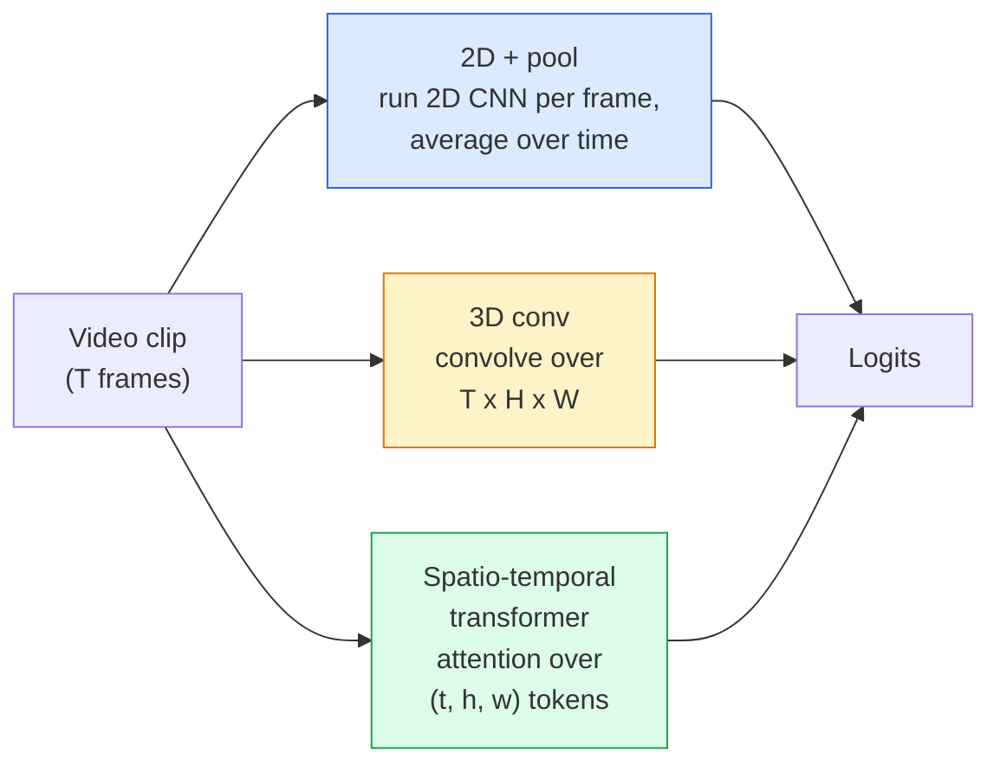

# Понимание видео — временное моделирование

> Видео — это последовательность изображений плюс физика, которая их связывает. Любая модель видео либо рассматривает время как дополнительную ось (3D-свёртка), либо как последовательность для внимания (трансформер), либо как признак, который извлекается один раз и затем усредняется (2D + пулинг).

**Тип:** Learn + Build
**Языки:** Python
**Предварительные требования:** Фаза 4, урок 03 (CNN), Фаза 4, урок 04 (классификация изображений)
**Время:** ~45 минут

## Цели обучения

- Различать три основных подхода к моделированию видео (2D + пулинг, 3D-свёртка, пространственно-временной трансформер) и предсказывать их соотношение затрат и точности
- Реализовать сэмплирование кадров, временной пулинг и базовый классификатор 2D + пулинг на PyTorch
- Объяснить, почему «раздутые» 3D-ядра I3D хорошо переносятся из весов ImageNet и чем факторизованная (2+1)D-свёртка отличается от них
- Ознакомиться со стандартными наборами данных и метриками для распознавания действий: Kinetics-400/600, UCF101, Something-Something V2; точность top-1 на уровне клипа и видео

## Проблема

30-секундное видео при 30 кадрах в секунду — это 900 изображений. Наивно, классификация видео — это классификация изображений, выполненная 900 раз, за которой следует некая агрегация. Это работает, когда действие видно почти на каждом кадре (спорт, готовка, видео с упражнениями), и сильно проваливается, когда действие определяется самим движением: «толкнуть что-то слева направо» выглядит как два неподвижных объекта на каждом отдельном кадре.

Главный вопрос для любой архитектуры видео: когда моделируется временная структура и как? Ответ определяет всё остальное — вычислительные затраты, стратегию предварительного обучения, возможность переиспользовать веса ImageNet, на каких наборах данных обучается модель.

Этот урок намеренно короче уроков про статичные изображения. Основной аппарат для изображений уже на месте, и понимание видео — это в основном про временную составляющую: сэмплирование, моделирование и агрегацию.

## Концепция

### Три архитектурных семейства



### 2D + пулинг

Возьмите 2D CNN (ResNet, EfficientNet, ViT). Запустите её независимо на каждом сэмплированном кадре. Усредните (либо возьмите max-pool, либо attention-pool) покадровые эмбеддинги. Подайте усреднённый вектор в классификатор.

Плюсы:
- Предварительное обучение на ImageNet переносится напрямую.
- Проще всего реализовать.
- Дёшево: T кадров * стоимость инференса одного изображения.

Минусы:
- Не может моделировать движение. Действие = агрегат внешнего вида.
- Временной пулинг инвариантен к порядку; «открыть дверь» и «закрыть дверь» выглядят одинаково.

Когда использовать: задачи, где важен внешний вид, transfer learning на небольших наборах видеоданных, начальные базовые решения.

### 3D-свёртки

Замените 2D-ядра (H, W) на 3D-ядра (T, H, W). Сеть выполняет свёртку и по пространству, и по времени. Раннее семейство: C3D, I3D, SlowFast.

Приём I3D: возьмите предварительно обученную 2D-модель ImageNet и «раздуйте» каждое 2D-ядро, скопировав его вдоль новой временной оси. 2D-свёртка 3x3 становится 3D-свёрткой 3x3x3. Это даёт 3D-модели сильные предобученные веса вместо обучения с нуля.

Плюсы:
- Напрямую моделирует движение.
- Раздувание I3D даёт бесплатный transfer learning.

Минусы:
- В T/8 раз больше FLOPs, чем у 2D-аналога (для временного ядра размера 3, применённого трижды подряд).
- Временные ядра малы; движение на большой дистанции требует пирамиды или двухпотокового подхода.

Когда использовать: распознавание действий, где сигналом является движение (Something-Something V2, Kinetics с классами, богатыми движением).

### Пространственно-временные трансформеры

Токенизируйте видео в сетку пространственно-временных патчей и применяйте внимание ко всем им. TimeSformer, ViViT, Video Swin, VideoMAE.

Паттерны внимания, которые имеют значение:
- **Joint (совместное)** — одно большое внимание по (t, h, w). Квадратичная сложность по `T*H*W`; дорого.
- **Divided (разделённое)** — два внимания на блок: одно по времени, одно по пространству. Почти линейное масштабирование.
- **Factorised (факторизованное)** — внимание по времени чередуется с вниманием по пространству между блоками.

Плюсы:
- SOTA-точность на всех основных бенчмарках.
- Переносится из трансформеров изображений (ViT) через раздувание патчей.
- Поддерживает видео с длинным контекстом через разреженное внимание.

Минусы:
- Требователен к вычислениям.
- Требует тщательного выбора паттерна внимания, иначе время выполнения резко растёт.

Когда использовать: большие наборы данных, высокоточное понимание видео, мультимодальные задачи видео+текст.

### Сэмплирование кадров

10-секундный клип при 30 кадрах в секунду — это 300 кадров; подавать все 300 в любую модель расточительно. Стандартные стратегии:

- **Равномерное сэмплирование (uniform sampling)** — выбрать T кадров равномерно по клипу. По умолчанию для 2D + пулинг.
- **Плотное сэмплирование (dense sampling)** — случайное непрерывное окно из T кадров. Распространено для 3D-свёрток, поскольку движение требует соседних кадров.
- **Мульти-клип (multi-clip)** — сэмплировать несколько окон из T кадров из одного и того же видео, классифицировать каждое, усреднить предсказания на этапе тестирования.

T обычно равно 8, 16, 32 или 64. Более высокое T = больше временного сигнала при больших вычислительных затратах.

### Оценивание

Два уровня:
- **Точность на уровне клипа (clip-level accuracy)** — модель видит один клип из T кадров, выдаёт top-k.
- **Точность на уровне видео (video-level accuracy)** — усреднение предсказаний на уровне клипа по нескольким клипам на видео; выше и стабильнее.

Всегда указывайте оба показателя. Модель, набравшая 78% на клипах / 82% на видео, сильно полагается на усреднение на этапе тестирования; та, что набрала 80% / 81%, более устойчива на уровне отдельного клипа.

### Наборы данных, с которыми вы столкнётесь

- **Kinetics-400 / 600 / 700** — универсальный набор данных с действиями. 400 тыс. клипов; URL-адреса YouTube (многие сейчас недоступны).
- **Something-Something V2** — действия, определяемые движением («перемещение X слева направо»). Не решается с помощью 2D + пулинг.
- **UCF-101**, **HMDB-51** — старее, меньше, всё ещё используются в отчётах.
- **AVA** — *локализация* действий в пространстве и времени; сложнее классификации.

```figure
v4-video-temporal
```

## Создаём

### Шаг 1: сэмплер кадров

Равномерный и плотный сэмплеры, работающие со списком кадров (или тензором видео).

```python
import numpy as np

def sample_uniform(num_frames_total, T):
    if num_frames_total <= T:
        return list(range(num_frames_total)) + [num_frames_total - 1] * (T - num_frames_total)
    step = num_frames_total / T
    return [int(i * step) for i in range(T)]


def sample_dense(num_frames_total, T, rng=None):
    rng = rng or np.random.default_rng()
    if num_frames_total <= T:
        return list(range(num_frames_total)) + [num_frames_total - 1] * (T - num_frames_total)
    start = int(rng.integers(0, num_frames_total - T + 1))
    return list(range(start, start + T))
```

Обе функции возвращают `T` индексов, которые вы используете для нарезки тензора видео.

### Шаг 2: базовый вариант 2D + пулинг

Запустите 2D ResNet-18 на каждом кадре, усредните признаки пулингом, классифицируйте.

```python
import torch
import torch.nn as nn
from torchvision.models import resnet18, ResNet18_Weights

class FramePool(nn.Module):
    def __init__(self, num_classes=400, pretrained=True):
        super().__init__()
        weights = ResNet18_Weights.IMAGENET1K_V1 if pretrained else None
        backbone = resnet18(weights=weights)
        self.features = nn.Sequential(*(list(backbone.children())[:-1]))  # global avg pool kept
        self.head = nn.Linear(512, num_classes)

    def forward(self, x):
        # x: (N, T, 3, H, W)
        N, T = x.shape[:2]
        x = x.view(N * T, *x.shape[2:])
        feats = self.features(x).view(N, T, -1)
        pooled = feats.mean(dim=1)
        return self.head(pooled)

model = FramePool(num_classes=10)
x = torch.randn(2, 8, 3, 224, 224)
print(f"output: {model(x).shape}")
print(f"params: {sum(p.numel() for p in model.parameters()):,}")
```

Одиннадцать миллионов параметров, предобучение на ImageNet, работает покадрово, усредняет, классифицирует. Этот базовый вариант часто оказывается в пределах 5-10 пунктов от полноценных 3D-моделей на задачах, где важен внешний вид, — иногда даже лучше, потому что переиспользует более сильный backbone ImageNet.

### Шаг 3: раздутая 3D-свёртка в стиле I3D

Превратите одиночную 2D-свёртку в 3D-свёртку, повторив веса вдоль новой временной оси.

```python
def inflate_2d_to_3d(conv2d, time_kernel=3):
    out_c, in_c, kh, kw = conv2d.weight.shape
    weight_3d = conv2d.weight.data.unsqueeze(2)  # (out, in, 1, kh, kw)
    weight_3d = weight_3d.repeat(1, 1, time_kernel, 1, 1) / time_kernel
    conv3d = nn.Conv3d(in_c, out_c, kernel_size=(time_kernel, kh, kw),
                        padding=(time_kernel // 2, conv2d.padding[0], conv2d.padding[1]),
                        stride=(1, conv2d.stride[0], conv2d.stride[1]),
                        bias=False)
    conv3d.weight.data = weight_3d
    return conv3d

conv2d = nn.Conv2d(3, 64, kernel_size=3, padding=1, bias=False)
conv3d = inflate_2d_to_3d(conv2d, time_kernel=3)
print(f"2D weight shape:  {tuple(conv2d.weight.shape)}")
print(f"3D weight shape:  {tuple(conv3d.weight.shape)}")
x = torch.randn(1, 3, 8, 56, 56)
print(f"3D output shape:  {tuple(conv3d(x).shape)}")
```

Деление на `time_kernel` удерживает величины активаций примерно постоянными — это важно, чтобы не сломать статистику batch-norm на первом проходе.

### Шаг 4: факторизованная (2+1)D-свёртка

Разделите 3D-свёртку на 2D-свёртку (пространственную) и 1D-свёртку (временную). Такое же рецептивное поле, меньше параметров, лучшая точность на некоторых бенчмарках.

```python
class Conv2Plus1D(nn.Module):
    def __init__(self, in_c, out_c, kernel_size=3):
        super().__init__()
        mid_c = (in_c * out_c * kernel_size * kernel_size * kernel_size) \
                // (in_c * kernel_size * kernel_size + out_c * kernel_size)
        self.spatial = nn.Conv3d(in_c, mid_c, kernel_size=(1, kernel_size, kernel_size),
                                 padding=(0, kernel_size // 2, kernel_size // 2), bias=False)
        self.bn = nn.BatchNorm3d(mid_c)
        self.act = nn.ReLU(inplace=True)
        self.temporal = nn.Conv3d(mid_c, out_c, kernel_size=(kernel_size, 1, 1),
                                  padding=(kernel_size // 2, 0, 0), bias=False)

    def forward(self, x):
        return self.temporal(self.act(self.bn(self.spatial(x))))

c = Conv2Plus1D(3, 64)
x = torch.randn(1, 3, 8, 56, 56)
print(f"(2+1)D output: {tuple(c(x).shape)}")
```

Полноценная сеть R(2+1)D — это то же самое, что ResNet-18, где каждая свёртка 3x3 заменена на `Conv2Plus1D`.

## Применяем

Две библиотеки покрывают промышленную работу с видео:

- `torchvision.models.video` — R(2+1)D, MViT, Swin3D с предобученными весами на Kinetics. Тот же API, что и у моделей изображений.
- `pytorchvideo` (Meta) — зоопарк моделей, загрузчики данных для Kinetics / SSv2 / AVA, стандартные преобразования.

Для моделей видео с языком (Vision-Language) (создание подписей к видео, ответы на вопросы по видео) используйте `transformers` (`VideoMAE`, `VideoLLaMA`, `InternVideo`).

## Публикуем

Этот урок производит:

- `outputs/prompt-video-architecture-picker.md` — промпт, который выбирает 2D+pool / I3D / (2+1)D / трансформер на основе соотношения внешний вид/движение, размера набора данных и вычислительного бюджета.
- `outputs/skill-frame-sampler-auditor.md` — навык, который проверяет сэмплер видеоконвейера и отмечает типичные баги: смещение индекса на единицу, неравномерное сэмплирование при `num_frames < T`, отсутствие обрезки с сохранением пропорций и т. д.

## Упражнения

1. **(Лёгкое)** Вычислите приближённое число FLOPs для FramePool с T=8 в сравнении с 3D ResNet в стиле I3D с T=8. Обоснуйте, почему 2D + пулинг в 3-5 раз дешевле.
2. **(Среднее)** Сгенерируйте синтетический набор видеоданных: случайные шары, движущиеся в случайных направлениях, размеченные по направлению движения («слева направо», «справа налево», «по диагонали вверх»). Обучите на нём FramePool. Покажите, что он достигает точности, близкой к случайной, доказывая, что одного внешнего вида недостаточно для задач с движением.
3. **(Сложное)** Постройте R(2+1)D-18, заменив каждый Conv2d в ResNet-18 на `Conv2Plus1D`. Раздуйте веса первой свёртки из предобученного на ImageNet ResNet-18. Обучите на наборе данных с движением из упражнения 2 и превзойдите FramePool.

## Ключевые термины

| Термин | Как говорят люди | Что это на самом деле означает |
|------|----------------|----------------------|
| 2D + пулинг | «Покадровый классификатор» | Запуск 2D CNN на каждом сэмплированном кадре, усреднение признаков пулингом по времени, классификация |
| 3D-свёртка | «Пространственно-временное ядро» | Ядро, выполняющее свёртку по (T, H, W); может моделировать движение нативно |
| Раздувание (inflation) | «Поднять 2D-веса до 3D» | Инициализация весов 3D-свёртки путём повторения весов 2D-свёртки вдоль новой временной оси с последующим делением на kernel_T для сохранения масштаба активаций |
| (2+1)D | «Факторизованная свёртка» | Разделение 3D на 2D-пространственную + 1D-временную; меньше параметров, дополнительная нелинейность между ними |
| Разделённое внимание (Divided attention) | «Сначала время, потом пространство» | Блок трансформера с двумя вниманиями на слой: одно по токенам того же кадра, другое по токенам той же позиции |
| Клип (Clip) | «Окно из T кадров» | Сэмплированная подпоследовательность из T кадров; единица, которую потребляет модель видео |
| Точность на уровне клипа и видео | «Два режима оценивания» | Клип = один сэмпл на видео, видео = усреднение по нескольким сэмплированным клипам |
| Kinetics | «ImageNet для видео» | 400-700 классов действий, более 300 тыс. клипов YouTube, стандартный корпус для предварительного обучения на видео |

## Дополнительные материалы

- [I3D: Quo Vadis, Action Recognition (Carreira & Zisserman, 2017)](https://arxiv.org/abs/1705.07750) — вводит раздувание и набор данных Kinetics
- [R(2+1)D: A Closer Look at Spatiotemporal Convolutions (Tran et al., 2018)](https://arxiv.org/abs/1711.11248) — факторизованная свёртка, всё ещё сильный базовый вариант
- [TimeSformer: Is Space-Time Attention All You Need? (Bertasius et al., 2021)](https://arxiv.org/abs/2102.05095) — первый сильный трансформер для видео
- [VideoMAE (Tong et al., 2022)](https://arxiv.org/abs/2203.12602) — предварительное обучение маскированного автокодировщика для видео; текущий доминирующий рецепт предобучения
