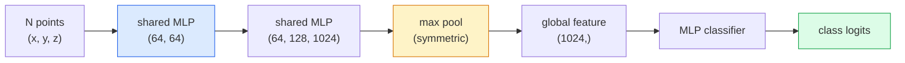

# 3D-зрение — облака точек и NeRF

> 3D-зрение существует в двух разновидностях. Облака точек — это сырой вывод сенсора. NeRF — это обученное объёмное поле. Обе отвечают на вопрос «что где находится в пространстве».

**Тип:** Learn + Build
**Языки:** Python
**Предварительные требования:** Фаза 4, урок 03 (свёрточные сети), Фаза 1, урок 12 (операции с тензорами)
**Время:** ~45 минут

## Цели обучения

- Различать явные (облако точек, меш, воксель) и неявные (поле знаковых расстояний, NeRF) 3D-представления и понимать, когда используется каждое
- Понимать приём с симметричной функцией в PointNet, который делает нейронную сеть инвариантной к перестановкам на неупорядоченном наборе точек
- Проследить прямой проход NeRF: трассировку лучей, объёмный рендеринг, позиционное кодирование, MLP-голову плотности и цвета
- Использовать `nerfstudio` или `instant-ngp` для предобученной 3D-реконструкции по небольшому набору изображений с известными позами камеры

## Проблема

Камера даёт 2D-изображение. LIDAR даёт набор 3D-точек без какого-либо порядка. Конвейер structure-from-motion даёт разреженное облако 3D-ключевых точек. NeRF реконструирует целую 3D-сцену по горстке изображений с известными позами камеры. Всё это «зрение», но ни одно из них не выглядит как плотный тензор, который хочет получить свёрточная сеть.

3D-зрение важно, потому что почти любая ценная роботизированная задача выполняется в 3D: захват объектов, обход препятствий, навигация, окклюзия в AR, захват 3D-контента. Инженер по зрению, понимающий только 2D-изображения, лишён доступа к самой быстрорастущей части области (контент AR/VR, робототехника, стеки автономного вождения, 3D-реконструкция на основе NeRF для недвижимости или строительства).

Оба представления доминируют по разным причинам. Облака точек — это то, что сенсоры дают бесплатно. NeRF и их наследники (3D Gaussian splatting, нейронные SDF) — это то, что вы получаете, когда просите нейронную сеть выучить сцену.

## Концепция

### Облака точек

Облако точек — это неупорядоченный набор из N точек в R^3, опционально с признаками для каждой точки (цвет, интенсивность, нормаль).

```
cloud = [
  (x1, y1, z1, r1, g1, b1),
  (x2, y2, z2, r2, g2, b2),
  ...
  (xN, yN, zN, rN, gN, bN),
]
```

Нет ни сетки, ни связности. Два свойства делают это сложным для нейронных сетей:

- **Инвариантность к перестановкам** — выход не должен зависеть от порядка точек.
- **Переменное N** — одна модель должна обрабатывать облака разного размера.

PointNet (Qi et al., 2017) решил обе проблемы одной идеей: применить общий MLP к каждой точке, затем агрегировать симметричной функцией (max pool). Результат — вектор фиксированного размера, не зависящий от порядка.

```
f(P) = max_{p in P} MLP(p)
```

Это и есть всё ядро PointNet. Более глубокие варианты (PointNet++, Point Transformer) добавляют иерархическую выборку и локальную агрегацию, но приём с симметричной функцией остаётся неизменным.

### Архитектура PointNet



«Общий MLP» означает, что один и тот же MLP выполняется на каждой точке независимо. Реализуется как свёртка 1x1 по измерению точек ради эффективности.

### Neural Radiance Fields (NeRF)

NeRF (Mildenhall et al., 2020) взял вопрос «можем ли мы реконструировать 3D-сцену по N фотографиям?» и ответил на него нейронной сетью, которая сама является сценой. Сеть отображает `(x, y, z, viewing_direction)` в `(density, colour)`. Рендеринг нового вида — это цикл трассировки лучей поверх этой сети.

```
NeRF MLP:  (x, y, z, theta, phi) -> (sigma, r, g, b)

To render a pixel (u, v) of a new view:
  1. Cast a ray from the camera through pixel (u, v)
  2. Sample points along the ray at distances t_1, t_2, ..., t_N
  3. Query the MLP at each point
  4. Composite the colours weighted by (1 - exp(-sigma * dt))
  5. The sum is the rendered pixel colour
```

Функция потерь сравнивает отрендеренный пиксель с эталонным пикселем на обучающих фотографиях. Обратное распространение ошибки через шаг рендеринга обновляет MLP. Нет 3D-эталонных данных, нет явной геометрии — сцена хранится в весах MLP.

### Позиционное кодирование в NeRF

Обычный MLP на `(x, y, z)` не может представить детали высокой частоты, потому что MLP спектрально смещены в сторону низких частот. NeRF исправляет это, кодируя каждую координату в вектор признаков Фурье перед подачей в MLP:

```
gamma(p) = (sin(2^0 pi p), cos(2^0 pi p), sin(2^1 pi p), cos(2^1 pi p), ...)
```

До L=10 уровней частоты. Это тот же приём, что трансформеры используют для позиций, и он снова появляется в кондиционировании по времени в диффузии (урок 10). Без него NeRF выглядят размытыми.

### Объёмный рендеринг

```
C(r) = sum_i T_i * (1 - exp(-sigma_i * delta_i)) * c_i

T_i  = exp(- sum_{j<i} sigma_j * delta_j)
delta_i = t_{i+1} - t_i
```

`T_i` — это пропускание (transmittance): сколько света доходит до точки i. `(1 - exp(-sigma_i * delta_i))` — непрозрачность в точке i. `c_i` — цвет. Итоговый пиксель — это взвешенная сумма вдоль луча.

### Что пришло на смену NeRF

Чистые NeRF медленно обучаются (часы) и медленно рендерят (секунды на изображение). Родословная с тех пор:

- **Instant-NGP** (2022) — кодирование хеш-сеткой заменяет позиционный вход MLP; обучается за секунды.
- **Mip-NeRF 360** — обрабатывает неограниченные сцены и сглаживание.
- **3D Gaussian Splatting** (2023) — заменяет объёмное поле миллионами 3D-гауссиан; обучается за минуты, рендерит в реальном времени. Текущий стандарт для продакшена.

Почти каждый реальный NeRF-продукт в 2026 году на самом деле использует 3D Gaussian splatting. Ментальная модель при этом остаётся NeRF.

### Наборы данных и бенчмарки

- **ShapeNet** — классификация и сегментация 3D CAD-моделей в виде облаков точек.
- **ScanNet** — реальные сканы интерьеров для сегментации.
- **KITTI** — облака точек LIDAR для автономного вождения на улице.
- **NeRF Synthetic** / **Blended MVS** — наборы данных с изображениями, снабжёнными позами камеры, для синтеза видов.
- **Mip-NeRF 360** dataset — неограниченные реальные сцены.

```figure
nerf-rays
```

## Создаём

### Шаг 1: классификатор PointNet

```python
import torch
import torch.nn as nn

class PointNet(nn.Module):
    def __init__(self, num_classes=10):
        super().__init__()
        self.mlp1 = nn.Sequential(
            nn.Conv1d(3, 64, 1),    nn.BatchNorm1d(64),   nn.ReLU(inplace=True),
            nn.Conv1d(64, 64, 1),   nn.BatchNorm1d(64),   nn.ReLU(inplace=True),
        )
        self.mlp2 = nn.Sequential(
            nn.Conv1d(64, 128, 1),  nn.BatchNorm1d(128),  nn.ReLU(inplace=True),
            nn.Conv1d(128, 1024, 1), nn.BatchNorm1d(1024), nn.ReLU(inplace=True),
        )
        self.head = nn.Sequential(
            nn.Linear(1024, 512),   nn.BatchNorm1d(512),  nn.ReLU(inplace=True),
            nn.Dropout(0.3),
            nn.Linear(512, 256),    nn.BatchNorm1d(256),  nn.ReLU(inplace=True),
            nn.Dropout(0.3),
            nn.Linear(256, num_classes),
        )

    def forward(self, x):
        # x: (N, 3, num_points) — transposed for Conv1d
        x = self.mlp1(x)
        x = self.mlp2(x)
        x = torch.max(x, dim=-1)[0]       # (N, 1024)
        return self.head(x)

pts = torch.randn(4, 3, 1024)
net = PointNet(num_classes=10)
print(f"output: {net(pts).shape}")
print(f"params: {sum(p.numel() for p in net.parameters()):,}")
```

Около 1,6 млн параметров. Работает с 1024 точками на облако.

### Шаг 2: позиционное кодирование

```python
def positional_encoding(x, L=10):
    """
    x: (..., D) -> (..., D * 2 * L)
    """
    freqs = 2.0 ** torch.arange(L, dtype=x.dtype, device=x.device)
    args = x.unsqueeze(-1) * freqs * 3.141592653589793
    sinc = torch.cat([args.sin(), args.cos()], dim=-1)
    return sinc.reshape(*x.shape[:-1], -1)

x = torch.randn(5, 3)
y = positional_encoding(x, L=10)
print(f"input:  {x.shape}")
print(f"encoded: {y.shape}     # (5, 60)")
```

Умножение на `2^l * pi` даёт постепенно более высокие частоты.

### Шаг 3: миниатюрный MLP NeRF

```python
class TinyNeRF(nn.Module):
    def __init__(self, L_pos=10, L_dir=4, hidden=128):
        super().__init__()
        self.L_pos = L_pos
        self.L_dir = L_dir
        pos_dim = 3 * 2 * L_pos
        dir_dim = 3 * 2 * L_dir
        self.trunk = nn.Sequential(
            nn.Linear(pos_dim, hidden), nn.ReLU(inplace=True),
            nn.Linear(hidden, hidden),  nn.ReLU(inplace=True),
            nn.Linear(hidden, hidden),  nn.ReLU(inplace=True),
            nn.Linear(hidden, hidden),  nn.ReLU(inplace=True),
        )
        self.sigma = nn.Linear(hidden, 1)
        self.color = nn.Sequential(
            nn.Linear(hidden + dir_dim, hidden // 2), nn.ReLU(inplace=True),
            nn.Linear(hidden // 2, 3), nn.Sigmoid(),
        )

    def forward(self, x, d):
        x_enc = positional_encoding(x, self.L_pos)
        d_enc = positional_encoding(d, self.L_dir)
        h = self.trunk(x_enc)
        sigma = torch.relu(self.sigma(h)).squeeze(-1)
        rgb = self.color(torch.cat([h, d_enc], dim=-1))
        return sigma, rgb

nerf = TinyNeRF()
x = torch.randn(128, 3)
d = torch.randn(128, 3)
s, c = nerf(x, d)
print(f"sigma: {s.shape}   rgb: {c.shape}")
```

Крошечная по сравнению с оригинальным NeRF (у которого 2 ствола MLP глубиной 8). Достаточно, чтобы продемонстрировать архитектуру.

### Шаг 4: объёмный рендеринг вдоль луча

```python
def volumetric_render(sigma, rgb, t_vals):
    """
    sigma: (..., N_samples)
    rgb:   (..., N_samples, 3)
    t_vals: (N_samples,) distances along the ray
    """
    delta = torch.cat([t_vals[1:] - t_vals[:-1], torch.full_like(t_vals[:1], 1e10)])
    alpha = 1.0 - torch.exp(-sigma * delta)
    trans = torch.cumprod(torch.cat([torch.ones_like(alpha[..., :1]), 1.0 - alpha + 1e-10], dim=-1), dim=-1)[..., :-1]
    weights = alpha * trans
    rendered = (weights.unsqueeze(-1) * rgb).sum(dim=-2)
    depth = (weights * t_vals).sum(dim=-1)
    return rendered, depth, weights


N = 64
t_vals = torch.linspace(2.0, 6.0, N)
sigma = torch.rand(N) * 0.5
rgb = torch.rand(N, 3)
rendered, depth, weights = volumetric_render(sigma, rgb, t_vals)
print(f"rendered colour: {rendered.tolist()}")
print(f"depth:           {depth.item():.2f}")
```

Один луч, 64 сэмпла, композитинг в один RGB-пиксель и глубину.

## Применяем

Для реальной работы:

- `nerfstudio` (Tancik et al.) — текущая референсная библиотека для NeRF / Instant-NGP / Gaussian Splatting. Командная строка плюс веб-просмотрщик.
- `pytorch3d` (Meta) — дифференцируемый рендеринг, утилиты для облаков точек, операции с мешами.
- `open3d` — обработка облаков точек, регистрация, визуализация.

Для развёртывания 3D Gaussian splatting в значительной степени заменил чистые NeRF, потому что рендерит в 100 раз быстрее. Качество реконструкции сопоставимо.

## Публикуем

Этот урок производит:

- `outputs/prompt-3d-task-router.md` — промпт, который направляет к правильному 3D-представлению (облако точек, меш, воксель, NeRF, Gaussian splat) на основе задачи и входных данных.
- `outputs/skill-point-cloud-loader.md` — навык, который пишет PyTorch `Dataset` для файлов .ply / .pcd / .xyz с корректной нормализацией, центрированием и сэмплированием точек.

## Упражнения

1. **(Лёгкое)** Покажите, что PointNet инвариантен к перестановкам: пропустите одно и то же облако дважды, один раз с перемешанными точками. Убедитесь, что выходы совпадают с точностью до шума с плавающей точкой.
2. **(Среднее)** Реализуйте минимальную функцию генерации лучей, которая по внутренним параметрам камеры и позе выдаёт начала и направления лучей для каждого пикселя изображения H x W.
3. **(Сложное)** Обучите TinyNeRF на синтетическом наборе данных из отрендеренных видов цветного куба (сгенерированных с помощью дифференцируемого рендеринга или простого трассировщика лучей). Сообщите значение функции потерь рендеринга на эпохах 1, 10 и 100. На какой эпохе модель начинает выдавать узнаваемые виды?

## Ключевые термины

| Термин | Как говорят люди | Что это на самом деле означает |
|------|----------------|----------------------|
| Point cloud | «3D-точки от LIDAR» | Неупорядоченный набор (x, y, z) + опциональные признаки для каждой точки |
| PointNet | «Первая нейросеть на облаках точек» | Общий MLP для каждой точки + симметричный (max) pool; инвариантен к перестановкам по построению |
| NeRF | «MLP, который является сценой» | Сеть, отображающая (x, y, z, dir) в (density, colour); рендерится трассировкой лучей |
| Позиционное кодирование | «Признаки Фурье» | Кодирование каждой координаты в sin/cos на нескольких частотах, чтобы преодолеть смещение MLP к низким частотам |
| Объёмный рендеринг | «Интегрирование по лучу» | Композитинг сэмплов вдоль луча в один пиксель с использованием пропускания и альфы |
| Instant-NGP | «NeRF на хеш-сетке» | Заменяет координатный MLP NeRF мультиразрешающей хеш-сеткой; в 100-1000 раз быстрее |
| 3D Gaussian splatting | «Миллионы гауссиан» | Сцена = набор 3D-гауссиан; рендерит в реальном времени, обучается за минуты |
| SDF | «Поле знаковых расстояний» | Функция, возвращающая знаковое расстояние до ближайшей поверхности; ещё одно неявное представление |

## Дополнительные материалы

- [PointNet (Qi et al., 2017)](https://arxiv.org/abs/1612.00593) — классификатор, инвариантный к перестановкам
- [NeRF (Mildenhall et al., 2020)](https://arxiv.org/abs/2003.08934) — статья, которая сделала 3D-реконструкцию по фотографиям задачей нейронных сетей
- [Instant-NGP (Müller et al., 2022)](https://arxiv.org/abs/2201.05989) — хеш-сетки, ускорение в 1000 раз
- [3D Gaussian Splatting (Kerbl et al., 2023)](https://arxiv.org/abs/2308.04079) — архитектура, заменившая NeRF в продакшене
