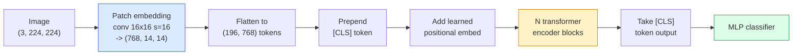

# Трансформеры для зрения (ViT)

> Разрежьте изображение на патчи, обращайтесь с каждым патчем как со словом, пропустите через обычный трансформер. Не оглядывайтесь назад.

**Тип:** Build
**Языки:** Python
**Предварительные требования:** Фаза 7, урок 02 (Self-Attention), Фаза 4, урок 04 (классификация изображений)
**Время:** ~45 минут

## Цели обучения

- Реализовать патч-эмбеддинг, обучаемый позиционный эмбеддинг, класс-токен и блоки трансформерного энкодера с нуля, чтобы собрать минимальный ViT
- Объяснить, почему считалось, что ViT требует огромных объёмов данных для предобучения, пока DeiT и MAE не доказали обратное
- Сравнить ViT, Swin и ConvNeXt по их архитектурным приорам (отсутствие приоров, локальное оконное внимание, свёрточный бэкбон)
- Дообучить предобученный ViT на небольшом наборе данных с помощью `timm` по стандартному рецепту linear-probe / fine-tune

## Проблема

В течение десятилетия свёртка была синонимом компьютерного зрения. У CNN были сильные индуктивные приоры — локальность, эквивариантность к сдвигу — которые, как считалось, невозможно заменить. Затем Dosovitskiy et al. (2020) показали, что обычный трансформер, применённый к развёрнутым в последовательность патчам изображения, вообще без какой-либо свёрточной машинерии, может сравняться или превзойти лучшие CNN при достаточном масштабе.

Загвоздка была именно в «при достаточном масштабе». ViT, обученный на ImageNet-1k, проигрывал ResNet. ViT, предобученный на ImageNet-21k или JFT-300M и затем дообученный на ImageNet-1k, побеждал его. Вывод состоял в том, что трансформерам не хватает полезных приоров, но они способны выучить их при достаточном количестве данных. Последующие работы (DeiT, MAE, DINO) показали, что при правильных рецептах обучения — сильной аугментации, самообучении с предобучением, дистилляции — ViT нормально обучаются и на небольших данных.

К 2026 году чистые CNN всё ещё конкурентоспособны на edge-устройствах (ConvNeXt — сильнейший среди них), но трансформеры доминируют во всём остальном: сегментация (Mask2Former, SegFormer), детекция (DETR, RT-DETR), мультимодальные модели (CLIP, SigLIP), видео (VideoMAE, VJEPA). Структуру блока ViT нужно знать обязательно.

## Концепция

### Конвейер



Семь шагов. Патчи -> токены -> внимание -> классификатор. Каждый вариант (DeiT, Swin, ConvNeXt, предобучение MAE) меняет один-два из этих семи шагов, оставляя остальные без изменений.

### Патч-эмбеддинг

Весь секрет — в первой свёртке. Размер ядра 16, шаг 16, поэтому изображение 224x224 превращается в сетку 14x14 патчей размером 16x16, каждый из которых проецируется в 768-мерный эмбеддинг. Эта единственная свёртка одновременно разбивает изображение на патчи и линейно проецирует их.

```
Input:  (3, 224, 224)
Conv (3 -> 768, k=16, s=16, no padding):
Output: (768, 14, 14)
Flatten spatial: (196, 768)
```

196 патчей = 196 токенов. Размерность признаков каждого токена — 768 (ViT-B), 1024 (ViT-L) или 1280 (ViT-H).

### Класс-токен

Единственный обучаемый вектор, добавляемый в начало последовательности:

```
tokens = [CLS; patch_1; patch_2; ...; patch_196]   shape (197, 768)
```

После N блоков трансформера выход `[CLS]` становится глобальным представлением изображения. Классификационная голова читает только этот единственный вектор.

### Позиционный эмбеддинг

У трансформеров нет встроенного понятия пространственной позиции. К каждому токену добавляется обучаемый вектор:

```
tokens = tokens + learned_pos_embedding   (also shape (197, 768))
```

Эмбеддинг — это параметр модели; обучение градиентным спуском подстраивает его под 2D-структуру изображения. Существуют синусоидальные 2D-альтернативы, но на практике они используются редко.

### Блок трансформерного энкодера

Стандартный. Многоголовое внимание (self-attention), MLP, остаточные связи, pre-LayerNorm.

```
x = x + MSA(LN(x))
x = x + MLP(LN(x))

MLP is two-layer with GELU: Linear(d -> 4d) -> GELU -> Linear(4d -> d)
```

ViT-B/16 состоит из 12 таких блоков, в каждом по 12 голов внимания, итого 86M параметров.

### Почему pre-LN

Ранние трансформеры использовали post-LN (`x = LN(x + sublayer(x))`) и с трудом обучались глубже 6-8 слоёв без прогрева (warmup). Pre-LN (`x = x + sublayer(LN(x))`) позволяет стабильно обучать более глубокие сети без прогрева. Каждый ViT и каждая современная LLM используют pre-LN.

### Компромисс размера патча

- Патчи 16x16 -> 196 токенов, стандарт.
- Патчи 32x32 -> 49 токенов, быстрее, но ниже разрешение.
- Патчи 8x8 -> 784 токена, детальнее, но стоимость внимания O(n^2) масштабируется плохо.

Крупнее патчи = меньше токенов = быстрее, но меньше пространственной детализации. SwinV2 использует патчи 4x4 в иерархических окнах.

### Рецепт DeiT для обучения ViT на ImageNet-1k

Оригинальному ViT требовался JFT-300M, чтобы превзойти CNN. DeiT (Touvron et al., 2020) обучил ViT-B до 81,8% top-1 только на ImageNet-1k благодаря четырём изменениям:

1. Интенсивная аугментация: RandAugment, Mixup, CutMix, Random Erasing.
2. Stochastic depth (случайное исключение целых блоков во время обучения).
3. Повторная аугментация (одно и то же изображение сэмплируется 3 раза за батч).
4. Дистилляция от CNN-учителя (опционально, дополнительно повышает точность).

Каждый современный рецепт обучения ViT происходит от DeiT.

### Swin против ConvNeXt

- **Swin** (Liu et al., 2021) — внимание на основе окон. Каждый блок работает с вниманием внутри локального окна; чередующиеся блоки сдвигают окно, чтобы смешивать информацию между окнами. Возвращает CNN-подобный приор локальности, сохраняя при этом оператор внимания.
- **ConvNeXt** (Liu et al., 2022) — переработанная CNN, повторяющая архитектурные решения Swin (depthwise-свёртки, LayerNorm, GELU, инвертированный bottleneck). Показала, что разрыв — это не «внимание против свёртки», а «современный рецепт обучения + архитектура».

В 2026 году и ConvNeXt-V2, и Swin-V2 готовы к продакшену; правильный выбор зависит от вашего инференс-стека (ConvNeXt лучше компилируется для edge) и корпуса для предобучения.

### Предобучение MAE

Masked Autoencoder (He et al., 2022): маскируется 75% патчей случайным образом, энкодер обучается обрабатывать только видимые 25%, небольшой декодер обучается восстанавливать замаскированные патчи по выходу энкодера. После предобучения декодер отбрасывается, а энкодер дообучается.

MAE делает ViT обучаемым только на ImageNet-1k, достигает SOTA и является текущим стандартным рецептом самообучения.

```figure
batchnorm-inference
```

## Создаём

### Шаг 1: патч-эмбеддинг

```python
import torch
import torch.nn as nn

class PatchEmbedding(nn.Module):
    def __init__(self, in_channels=3, patch_size=16, dim=192, image_size=64):
        super().__init__()
        assert image_size % patch_size == 0
        self.proj = nn.Conv2d(in_channels, dim, kernel_size=patch_size, stride=patch_size)
        num_patches = (image_size // patch_size) ** 2
        self.num_patches = num_patches

    def forward(self, x):
        x = self.proj(x)
        return x.flatten(2).transpose(1, 2)
```

Одна свёртка, один flatten, один transpose. Это весь шаг превращения изображения в токены.

### Шаг 2: блок трансформера

Pre-LN, многоголовое self-attention, MLP с GELU, остаточные связи.

```python
class Block(nn.Module):
    def __init__(self, dim, num_heads, mlp_ratio=4, dropout=0.0):
        super().__init__()
        self.ln1 = nn.LayerNorm(dim)
        self.attn = nn.MultiheadAttention(dim, num_heads, dropout=dropout, batch_first=True)
        self.ln2 = nn.LayerNorm(dim)
        self.mlp = nn.Sequential(
            nn.Linear(dim, dim * mlp_ratio),
            nn.GELU(),
            nn.Dropout(dropout),
            nn.Linear(dim * mlp_ratio, dim),
            nn.Dropout(dropout),
        )

    def forward(self, x):
        a, _ = self.attn(self.ln1(x), self.ln1(x), self.ln1(x), need_weights=False)
        x = x + a
        x = x + self.mlp(self.ln2(x))
        return x
```

`nn.MultiheadAttention` берёт на себя разбиение на головы, масштабированное скалярное произведение и выходную проекцию. `batch_first=True`, поэтому формы имеют вид `(N, seq, dim)`.

### Шаг 3: сам ViT

```python
class ViT(nn.Module):
    def __init__(self, image_size=64, patch_size=16, in_channels=3,
                 num_classes=10, dim=192, depth=6, num_heads=3, mlp_ratio=4):
        super().__init__()
        self.patch = PatchEmbedding(in_channels, patch_size, dim, image_size)
        num_patches = self.patch.num_patches
        self.cls_token = nn.Parameter(torch.zeros(1, 1, dim))
        self.pos_embed = nn.Parameter(torch.zeros(1, num_patches + 1, dim))
        self.blocks = nn.ModuleList([
            Block(dim, num_heads, mlp_ratio) for _ in range(depth)
        ])
        self.ln = nn.LayerNorm(dim)
        self.head = nn.Linear(dim, num_classes)
        nn.init.trunc_normal_(self.pos_embed, std=0.02)
        nn.init.trunc_normal_(self.cls_token, std=0.02)

    def forward(self, x):
        x = self.patch(x)
        cls = self.cls_token.expand(x.size(0), -1, -1)
        x = torch.cat([cls, x], dim=1)
        x = x + self.pos_embed
        for blk in self.blocks:
            x = blk(x)
        x = self.ln(x[:, 0])
        return self.head(x)

vit = ViT(image_size=64, patch_size=16, num_classes=10, dim=192, depth=6, num_heads=3)
x = torch.randn(2, 3, 64, 64)
print(f"output: {vit(x).shape}")
print(f"params: {sum(p.numel() for p in vit.parameters()):,}")
```

Около 2,8M параметров — крошечный ViT, с которым можно работать на CPU. Настоящий ViT-B — это 86M; тот же класс с `dim=768, depth=12, num_heads=12`.

### Шаг 4: проверка на здравый смысл — инференс на одном изображении

```python
logits = vit(torch.randn(1, 3, 64, 64))
print(f"logits: {logits}")
print(f"probs:  {logits.softmax(-1)}")
```

Должно выполниться без ошибок. Вероятности в сумме дают 1.

## Применяем

`timm` поставляет каждый вариант ViT с весами, предобученными на ImageNet. Одна строка:

```python
import timm

model = timm.create_model("vit_base_patch16_224", pretrained=True, num_classes=10)
```

`timm` — стандарт продакшена для визуальных трансформеров в 2026 году. Поддерживает ViT, DeiT, Swin, Swin-V2, ConvNeXt, ConvNeXt-V2, MaxViT, MViT, EfficientFormer и десятки других моделей под одним и тем же API.

Для мультимодальной работы (изображение + текст) `transformers` поставляет CLIP, SigLIP, BLIP-2, LLaVA. Энкодер изображений во всех них — это вариант ViT.

## Публикуем

Этот урок производит:

- `outputs/prompt-vit-vs-cnn-picker.md` — промпт, который выбирает между ViT, ConvNeXt и Swin на основе размера набора данных, вычислительных ресурсов и инференс-стека.
- `outputs/skill-vit-patch-and-pos-embed-inspector.md` — навык, который проверяет, что формы патч-эмбеддинга и позиционного эмбеддинга ViT совпадают с ожидаемой длиной последовательности модели, отлавливая самые распространённые ошибки переноса.

## Упражнения

1. **(Лёгкое)** Выведите формы всех промежуточных тензоров для прямого прохода через крошечный ViT выше. Убедитесь: вход `(N, 3, 64, 64)` -> патчи `(N, 16, 192)` -> с CLS `(N, 17, 192)` -> вход классификатора `(N, 192)` -> выход `(N, num_classes)`.
2. **(Среднее)** Дообучите предобученный `timm` ViT-S/16 на наборе данных synthetic-CIFAR из урока 4. Сравните с дообучением ResNet-18 на тех же данных. Сообщите время обучения и итоговую точность.
3. **(Сложное)** Реализуйте предобучение MAE для крошечного ViT: маскируйте 75% патчей, обучите энкодер + небольшой декодер восстанавливать замаскированные патчи. Оцените точность linear-probe на синтетических данных до и после предобучения.

## Ключевые термины

| Термин | Как говорят люди | Что это на самом деле означает |
|------|----------------|----------------------|
| Patch embedding | «Первая свёртка» | Свёртка с размером ядра, равным шагу и размеру патча; превращает изображение в сетку эмбеддингов-токенов |
| Class token | «[CLS]» | Обучаемый вектор, добавляемый в начало последовательности токенов; его итоговый выход — глобальное представление изображения |
| Positional embedding | «Обучаемая позиция» | Обучаемый вектор, добавляемый к каждому токену, чтобы трансформер знал, откуда взялся каждый патч |
| Pre-LN | «LayerNorm перед подслоем» | Стабильный вариант трансформера: `x + sublayer(LN(x))` вместо `LN(x + sublayer(x))` |
| Multi-head attention | «Параллельное внимание» | Стандартное внимание трансформера, разделённое на num_heads независимых подпространств и затем объединённое |
| ViT-B/16 | «Base, patch 16» | Каноничный размер: dim=768, depth=12, heads=12, patch_size=16, image=224; ~86M параметров |
| DeiT | «Data-efficient ViT» | ViT, обученный только на ImageNet-1k с сильной аугментацией; доказал, что большие наборы данных для предобучения не являются строго обязательными |
| MAE | «Masked autoencoder» | Самообучаемое предобучение: маскировать 75% патчей, восстановить; доминирующий рецепт предобучения ViT |

## Дополнительные материалы

- [An Image is Worth 16x16 Words (Dosovitskiy et al., 2020)](https://arxiv.org/abs/2010.11929) — статья про ViT
- [DeiT: Data-efficient Image Transformers (Touvron et al., 2020)](https://arxiv.org/abs/2012.12877) — как обучить ViT только на ImageNet-1k
- [Masked Autoencoders are Scalable Vision Learners (He et al., 2022)](https://arxiv.org/abs/2111.06377) — предобучение MAE
- [timm documentation](https://huggingface.co/docs/timm) — справочник по каждому визуальному трансформеру, который вы будете использовать в продакшене
