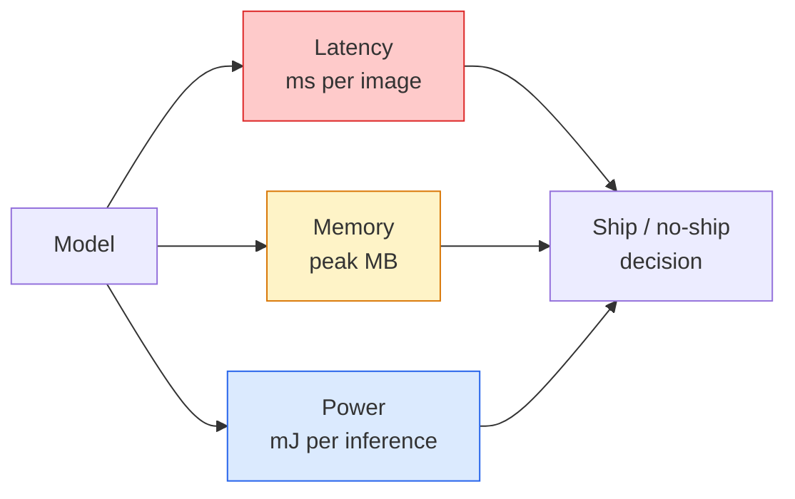

# Зрение в реальном времени — развёртывание на edge

> Edge-инференс — это дисциплина, позволяющая модели с точностью 90 работать при 30 fps на устройстве с 2 ГБ оперативной памяти. Каждый процентный пункт точности обменивается на миллисекунды задержки.

**Тип:** Learn + Build
**Языки:** Python
**Предварительные требования:** Фаза 4, урок 04 (классификация изображений), Фаза 10, урок 11 (квантование)
**Время:** ~75 минут

## Цели обучения

- Измерять задержку инференса, пиковую память и пропускную способность для любой модели PyTorch и интерпретировать компромисс FLOPs / параметры / задержка
- Квантовать визуальную модель в INT8 с помощью post-training-квантования PyTorch и убедиться, что потеря точности < 1%
- Экспортировать модель в ONNX и скомпилировать её с помощью ONNX Runtime или TensorRT; назвать три самые распространённые ошибки экспорта и способы их исправления
- Объяснить, когда выбирать MobileNetV3, EfficientNet-Lite, ConvNeXt-Tiny или MobileViT при ограничениях edge-устройства

## Проблема

Модель зрения на этапе обучения — это чудовище с плавающей точкой. 100M параметров, 10 GFLOPs на прямой проход, 2 ГБ видеопамяти. Ничего из этого не помещается на телефон, в инфотейнмент-систему автомобиля, промышленную камеру или дрон. Поставить систему зрения в продакшен значит уместить те же предсказания в бюджет, который в 100 раз меньше.

Основную работу выполняют три рычага: выбор модели (более компактная архитектура с тем же рецептом обучения), квантование (INT8 вместо FP32) и среда выполнения инференса (ONNX Runtime, TensorRT, Core ML, TFLite). Правильная настройка этих рычагов — это разница между демо, работающим на рабочей станции, и продуктом, который поставляется на камерном модуле за $30.

Этот урок сначала выстраивает дисциплину измерений (нельзя оптимизировать то, что нельзя измерить), а затем разбирает все три рычага. Цель — не выучить каждую edge-среду выполнения, а знать, какие рычаги существуют и как проверить, что каждый из них действительно делает то, что вы думаете.

## Концепция

### Три бюджета



- **Задержка (Latency)**: p50, p95, p99. Усреднение только по p50 скрывает поведение хвоста распределения, важное для систем реального времени.
- **Пиковая память**: максимум, который когда-либо видит устройство, а не среднее в установившемся режиме. Это важно, потому что OOM фатален на встраиваемых целевых платформах.
- **Мощность / энергия**: миллиджоули на инференс на устройстве с батарейным питанием. Часто оценивается через загрузку CPU/GPU, умноженную на время.

Решение об edge-развёртывании принимается на основе таблицы (модель, задержка, память, точность). Каждая ячейка измеряется на целевом устройстве, а не на рабочей станции.

### Дисциплина измерений

Три правила, которым должен следовать любой edge-профиль:

1. **Прогрейте** модель 5-10 фиктивными прямыми проходами перед измерением. Холодные кеши и JIT-компиляция дают нерепрезентативные первые числа.
2. **Синхронизируйте** GPU-нагрузку с помощью `torch.cuda.synchronize()` до и после измеряемого блока. Без этого вы измеряете диспетчеризацию ядра, а не его выполнение.
3. **Зафиксируйте размеры входа** на продакшен-разрешении. Задержка на 224x224 — не то же самое, что задержка на 512x512.

### FLOPs как прокси-метрика

FLOPs (операции с плавающей точкой на инференс) — дешёвая, независимая от устройства прокси-метрика задержки. Полезна для сравнения архитектур, но вводит в заблуждение как абсолютное время выполнения. Модель с на 10% большим числом FLOPs может быть на практике в 2 раза быстрее, потому что использует аппаратно-дружественные операции (depthwise-свёртки хорошо компилируются, большие свёртки 7x7 — нет).

Правило: используйте FLOPs для поиска архитектуры, а задержку на реальном устройстве — для решений о развёртывании.

### Квантование в одном абзаце

Замените веса и активации FP32 на INT8. Размер модели уменьшается в 4 раза, пропускная способность памяти — в 4 раза, вычисления — в 2-4 раза на оборудовании с INT8-ядрами (каждый современный мобильный SoC, каждый GPU NVIDIA с Tensor Cores). Потеря точности на задачах зрения обычно составляет 0,1-1 процентный пункт при статическом post-training-квантовании.

Типы:

- **Динамическое (Dynamic)** — веса квантуются в INT8, активации вычисляются в FP. Просто, небольшое ускорение.
- **Статическое (post-training)** — квантуются веса + калибруются диапазоны активаций на небольшом калибровочном наборе. Гораздо быстрее динамического.
- **Quantisation-aware training (QAT)** — квантование имитируется прямо во время обучения, чтобы модель к нему приспособилась. Лучшая точность, требует размеченных данных.

Для задач зрения статическое post-training-квантование даёт 95% выгоды при 5% усилий. Используйте QAT только тогда, когда потеря точности от PTQ неприемлема.

### Прунинг и дистилляция

- **Прунинг (Pruning)** — удаление неважных весов (по величине) или каналов (структурированный). Хорошо работает на переопараметризованных моделях; менее полезен на уже компактных архитектурах.
- **Дистилляция (Distillation)** — обучение небольшого «ученика» воспроизводить логиты большого «учителя». Часто восстанавливает большую часть точности, потерянной при уменьшении модели. Стандарт для продакшен-моделей на edge.

### Среды выполнения инференса

- **PyTorch eager** — медленно, не для развёртывания. Использовать только для разработки.
- **TorchScript** — устаревший. Заменён `torch.compile` и экспортом в ONNX.
- **ONNX Runtime** — нейтральная среда выполнения. У CPU, CUDA, CoreML, TensorRT, OpenVINO есть ONNX-провайдеры. Начинайте отсюда.
- **TensorRT** — компилятор NVIDIA. Лучшая задержка на GPU NVIDIA (рабочая станция и Jetson). Интегрируется с ONNX Runtime или работает автономно.
- **Core ML** — среда выполнения Apple для iOS/macOS. Требует `.mlmodel` или `.mlpackage`.
- **TFLite** — среда выполнения Google для Android/ARM. Требует `.tflite`.
- **OpenVINO** — среда выполнения Intel для CPU/VPU. Требует `.xml` + `.bin`.

На практике: экспортируйте PyTorch -> ONNX -> выберите среду выполнения под целевую платформу. ONNX — это общий язык.

### Выбор архитектуры для edge

| Бюджет | Модель | Почему |
|--------|-------|-----|
| < 3M параметров | MobileNetV3-Small | Компилируется везде, хороший базовый вариант |
| 3-10M | EfficientNet-Lite-B0 | Лучшая точность на параметр на TFLite |
| 10-20M | ConvNeXt-Tiny | Лучшая точность на параметр, дружелюбна к CPU |
| 20-30M | MobileViT-S или EfficientViT | Трансформер с точностью уровня ImageNet |
| 30-80M | Swin-V2-Tiny | Если стек поддерживает оконное внимание |

Квантуйте все эти модели в INT8, если у вас нет особой причины этого не делать.

```figure
cnn-param-count
```

## Создаём

### Шаг 1: правильно измеряем задержку

```python
import time
import torch

def measure_latency(model, input_shape, device="cpu", warmup=10, iters=50):
    model = model.to(device).eval()
    x = torch.randn(input_shape, device=device)
    with torch.no_grad():
        for _ in range(warmup):
            model(x)
        if device == "cuda":
            torch.cuda.synchronize()
        times = []
        for _ in range(iters):
            if device == "cuda":
                torch.cuda.synchronize()
            t0 = time.perf_counter()
            model(x)
            if device == "cuda":
                torch.cuda.synchronize()
            times.append((time.perf_counter() - t0) * 1000)
    times.sort()
    return {
        "p50_ms": times[len(times) // 2],
        "p95_ms": times[int(len(times) * 0.95)],
        "p99_ms": times[int(len(times) * 0.99)],
        "mean_ms": sum(times) / len(times),
    }
```

Прогрейте, синхронизируйте, используйте `time.perf_counter()`. Сообщайте перцентили, а не только среднее.

### Шаг 2: подсчёт параметров и FLOP

```python
def parameter_count(model):
    return sum(p.numel() for p in model.parameters())

def flops_estimate(model, input_shape):
    """
    Rough FLOP count for a conv/linear-only model. For production use `fvcore` or `ptflops`.
    """
    total = 0
    def conv_hook(m, inp, out):
        nonlocal total
        c_out, c_in, kh, kw = m.weight.shape
        h, w = out.shape[-2:]
        total += 2 * c_in * c_out * kh * kw * h * w
    def linear_hook(m, inp, out):
        nonlocal total
        total += 2 * m.in_features * m.out_features
    hooks = []
    for m in model.modules():
        if isinstance(m, torch.nn.Conv2d):
            hooks.append(m.register_forward_hook(conv_hook))
        elif isinstance(m, torch.nn.Linear):
            hooks.append(m.register_forward_hook(linear_hook))
    model.eval()
    with torch.no_grad():
        model(torch.randn(input_shape))
    for h in hooks:
        h.remove()
    return total
```

Для реальных проектов используйте `fvcore.nn.FlopCountAnalysis` или `ptflops`; они корректно обрабатывают все типы модулей.

### Шаг 3: статическое post-training-квантование

```python
def quantise_ptq(model, calibration_loader, backend="x86"):
    import torch.ao.quantization as tq
    model = model.eval().cpu()
    model.qconfig = tq.get_default_qconfig(backend)
    tq.prepare(model, inplace=True)
    with torch.no_grad():
        for x, _ in calibration_loader:
            model(x)
    tq.convert(model, inplace=True)
    return model
```

Три шага: настройка, подготовка (вставка наблюдателей), калибровка на реальных данных, конвертация (слияние + квантование). Требует, чтобы модель была слита (`Conv -> BN -> ReLU` -> `ConvBnReLU`), чем занимается `torch.ao.quantization.fuse_modules`.

### Шаг 4: экспорт в ONNX

```python
def export_onnx(model, sample_input, path="model.onnx"):
    model = model.eval()
    torch.onnx.export(
        model,
        sample_input,
        path,
        input_names=["input"],
        output_names=["output"],
        dynamic_axes={"input": {0: "batch"}, "output": {0: "batch"}},
        opset_version=17,
    )
    return path
```

`opset_version=17` — безопасное значение по умолчанию в 2026 году. `dynamic_axes` позволяет запускать ONNX-модель с произвольным размером батча.

### Шаг 5: бенчмарк и сравнение режимов

```python
import torch.nn as nn
from torchvision.models import mobilenet_v3_small

def compare_regimes():
    model = mobilenet_v3_small(weights=None, num_classes=10)
    params = parameter_count(model)
    flops = flops_estimate(model, (1, 3, 224, 224))
    lat_fp32 = measure_latency(model, (1, 3, 224, 224), device="cpu")
    print(f"FP32 MobileNetV3-Small: {params:,} params  {flops/1e9:.2f} GFLOPs  "
          f"p50={lat_fp32['p50_ms']:.2f}ms  p95={lat_fp32['p95_ms']:.2f}ms")
```

Запустите ту же функцию для `resnet50`, `efficientnet_v2_s` и `convnext_tiny`, и у вас будет таблица сравнения, необходимая для решения о развёртывании.

## Применяем

Продакшен-стеки сходятся к одному из трёх путей:

- **Web / serverless**: PyTorch -> ONNX -> ONNX Runtime (провайдер CPU или CUDA). Проще всего, достаточно для большинства случаев.
- **NVIDIA edge (Jetson, GPU-сервер)**: PyTorch -> ONNX -> TensorRT. Лучшая задержка, наибольшие инженерные усилия.
- **Mobile**: PyTorch -> ONNX -> Core ML (iOS) или TFLite (Android). Квантуйте до экспорта.

Для измерений `torch-tb-profiler`, `nvprof` / `nsys` и Instruments на macOS дают разбивку по слоям. `benchmark_app` (OpenVINO) и `trtexec` (TensorRT) дают автономные CLI-цифры.

## Публикуем

Этот урок производит:

- `outputs/prompt-edge-deployment-planner.md` — промпт, который выбирает бэкбон, стратегию квантования и среду выполнения по целевому устройству и SLA по задержке.
- `outputs/skill-latency-profiler.md` — навык, который пишет полный скрипт бенчмаркинга задержки с прогревом, синхронизацией, перцентилями и отслеживанием памяти.

## Упражнения

1. **(Лёгкое)** Измерьте задержку p50 для `resnet18`, `mobilenet_v3_small`, `efficientnet_v2_s` и `convnext_tiny` при 224x224 на CPU. Сообщите таблицу и определите, у какой архитектуры лучшее соотношение точности к миллисекунде.
2. **(Среднее)** Примените статическое post-training-квантование к `mobilenet_v3_small`. Сообщите задержку FP32 против INT8 и потерю точности на отложенном подмножестве CIFAR-10 или аналогичного набора.
3. **(Сложное)** Экспортируйте `convnext_tiny` в ONNX, запустите его через `onnxruntime` с `CPUExecutionProvider` и сравните задержку с базовым вариантом на PyTorch eager. Определите первый слой, на котором ONNX Runtime быстрее, и объясните почему.

## Ключевые термины

| Термин | Как говорят люди | Что это на самом деле означает |
|------|----------------|----------------------|
| Latency | «Насколько быстро» | Время от входа до выхода; перцентили p50/p95/p99, а не среднее |
| FLOPs | «Размер модели» | Операции с плавающей точкой на прямой проход; грубая прокси-метрика вычислительной стоимости |
| INT8-квантование | «8 бит» | Замена весов/активаций FP32 на 8-битные целые числа; ~в 4 раза меньше, в 2-4 раза быстрее |
| PTQ | «Post-training quantisation» | Квантование обученной модели без переобучения; просто и обычно достаточно |
| QAT | «Quantisation-aware training» | Имитация квантования во время обучения; лучшая точность, требует размеченных данных |
| ONNX | «Нейтральный формат» | Формат обмена моделями, поддерживаемый каждой основной средой выполнения инференса |
| TensorRT | «Компилятор NVIDIA» | Компилирует ONNX в оптимизированный движок для GPU NVIDIA |
| Distillation | «Учитель -> ученик» | Обучение небольшой модели воспроизводить логиты большой модели; восстанавливает большую часть потерянной точности |

## Дополнительные материалы

- [EfficientNet (Tan & Le, 2019)](https://arxiv.org/abs/1905.11946) — составное масштабирование для эффективных архитектур
- [MobileNetV3 (Howard et al., 2019)](https://arxiv.org/abs/1905.02244) — архитектура mobile-first с h-swish и squeeze-excite
- [A Practical Guide to TensorRT Optimization (NVIDIA)](https://developer.nvidia.com/blog/accelerating-model-inference-with-tensorrt-tips-and-best-practices-for-pytorch-users/) — как на самом деле получить цифры пропускной способности из статьи
- [ONNX Runtime docs](https://onnxruntime.ai/docs/) — квантование, оптимизация графа, выбор провайдера
