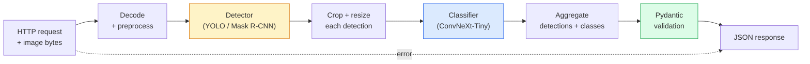

# Собираем полный конвейер зрения — капстоун

> Продакшен-система зрения — это цепочка моделей и правил, сшитая контрактами данных. Все части уже есть в этой фазе; капстоун соединяет их вместе от начала до конца.

**Тип:** Build
**Языки:** Python
**Предварительные требования:** Фаза 4, уроки 01-15
**Время:** ~120 минут

## Цели обучения

- Спроектировать продакшен-конвейер зрения, который детектирует объекты, классифицирует их и выдаёт структурированный JSON — с обработкой каждого пути отказа
- Подключить детектор (Mask R-CNN или YOLO), классификатор (ConvNeXt-Tiny) и контракт данных (Pydantic) в единый сервис
- Прогнать бенчмарк сквозного конвейера и определить первое узкое место (обычно предобработка, затем детектор)
- Поставить минимальный сервис на FastAPI, который принимает загрузку изображения, прогоняет конвейер и возвращает детекции с классификациями

## Проблема

Отдельные модели зрения полезны сами по себе; продукты зрения — это цепочки таких моделей. Аудит полок в ритейле — это детектор плюс классификатор товаров плюс конвейер OCR для цен. Автономное вождение — это 2D-детектор плюс 3D-детектор плюс сегментатор плюс трекер плюс планировщик. Медицинский предскрининг — это сегментатор плюс классификатор регионов плюс интерфейс для клинициста.

Именно соединение этих цепочек отделяет ML-прототип от продукта. Каждый интерфейс между моделями — это новое место для багов. Каждое преобразование координат, каждая нормализация, каждое изменение размера маски — кандидат на тихий отказ. Конвейер настолько прочен, насколько прочен его самый слабый интерфейс.

Этот капстоун выстраивает минимально жизнеспособный конвейер: детекция + классификация + структурированный вывод + слой обслуживания. Всё остальное из Фазы 4 встраивается в этот скелет: замените Mask R-CNN на YOLOv8, добавьте голову OCR, добавьте ветку сегментации, добавьте трекер. Архитектура стабильна; части подключаемые.

## Концепция

### Конвейер



Семь стадий. Две модельные стадии — дорогие; пять остальных стадий — там, где живут баги.

### Контракты данных с Pydantic

Каждая граница между моделями становится типизированным объектом. Это превращает тихие отказы в громкие.

```
Detection(
    box: tuple[float, float, float, float],   # (x1, y1, x2, y2), absolute pixels
    score: float,                              # [0, 1]
    class_id: int,                             # from detector's label map
    mask: Optional[list[list[int]]],           # RLE-encoded if present
)

PipelineResult(
    image_id: str,
    detections: list[Detection],
    classifications: list[Classification],
    inference_ms: float,
)
```

Когда детектор возвращает боксы в формате `(cx, cy, w, h)` вместо `(x1, y1, x2, y2)`, валидация Pydantic падает прямо на границе, и вы узнаёте об этом немедленно, вместо того чтобы отлаживать нижестоящий crop, который молча возвращает пустые области.

### Куда уходит задержка

Три истины справедливы почти для любого конвейера зрения:

1. **Предобработка часто оказывается самым крупным отдельным блоком.** Декодирование JPEG, преобразование цветовых пространств, изменение размера — всё это упирается в CPU, и про это легко забыть.
2. **Детектор доминирует по времени GPU.** 70-90% времени GPU уходит на прямой проход детекции.
3. **Постобработка (NMS, кодирование/декодирование RLE) дёшева на GPU и дорога на CPU.** Всегда профилируйте на реальной целевой платформе.

Знание этого распределения превращает оптимизацию в приоритизированный список.

### Режимы отказа

- **Пустые детекции** — вернуть пустой список, не падать. Логировать.
- **Выходящие за границы боксы** — обрезать по размеру изображения перед вырезанием.
- **Слишком маленькие вырезки** — пропускать классификацию для боксов меньше минимального входа классификатора.
- **Повреждённая загрузка** — ответ 400 с конкретным кодом ошибки, а не 500.
- **Ошибка загрузки модели** — падать при старте сервиса, а не на первом запросе.

Продакшен-конвейер обрабатывает каждый из этих случаев без общего `try/except`, который скрывает отказ. У каждого отказа есть именованный код и ответ.

### Батчинг

Продакшен-сервис обслуживает множество клиентов. Батчинг детекций и классификаций между запросами кратно увеличивает пропускную способность. Компромисс: дополнительная задержка из-за ожидания заполнения батча. Типичная настройка: собирать запросы до 20 мс, объединять в батч, обрабатывать, раздавать ответы. `torchserve` и `triton` делают это нативно; небольшие сервисы с предсказуемой нагрузкой пишут собственный микробатчер.

```figure
v4-vision-pipeline
```

## Создаём

### Шаг 1: контракты данных

```python
from pydantic import BaseModel, Field
from typing import List, Optional, Tuple

class Detection(BaseModel):
    box: Tuple[float, float, float, float]
    score: float = Field(ge=0, le=1)
    class_id: int = Field(ge=0)
    mask_rle: Optional[str] = None


class Classification(BaseModel):
    detection_index: int
    class_id: int
    class_name: str
    score: float = Field(ge=0, le=1)


class PipelineResult(BaseModel):
    image_id: str
    detections: List[Detection]
    classifications: List[Classification]
    inference_ms: float
```

Пять секунд кода экономят час отладки на любом серьёзном конвейере.

### Шаг 2: минимальный класс Pipeline

```python
import time
import numpy as np
import torch
from PIL import Image

class VisionPipeline:
    def __init__(self, detector, classifier, class_names,
                 device="cpu", min_crop=32):
        self.detector = detector.to(device).eval()
        self.classifier = classifier.to(device).eval()
        self.class_names = class_names
        self.device = device
        self.min_crop = min_crop

    def preprocess(self, image):
        """
        image: PIL.Image or np.ndarray (H, W, 3) uint8
        returns: CHW float tensor on device
        """
        if isinstance(image, Image.Image):
            image = np.asarray(image.convert("RGB"))
        tensor = torch.from_numpy(image).permute(2, 0, 1).float() / 255.0
        return tensor.to(self.device)

    @torch.no_grad()
    def detect(self, image_tensor):
        return self.detector([image_tensor])[0]

    @torch.no_grad()
    def classify(self, crops):
        if len(crops) == 0:
            return []
        batch = torch.stack(crops).to(self.device)
        logits = self.classifier(batch)
        probs = logits.softmax(-1)
        scores, cls = probs.max(-1)
        return list(zip(cls.tolist(), scores.tolist()))

    def run(self, image, image_id="anonymous"):
        t0 = time.perf_counter()
        tensor = self.preprocess(image)
        det = self.detect(tensor)

        crops = []
        detections = []
        valid_indices = []
        for i, (box, score, cls) in enumerate(zip(det["boxes"], det["scores"], det["labels"])):
            x1, y1, x2, y2 = [max(0, int(b)) for b in box.tolist()]
            x2 = min(x2, tensor.shape[-1])
            y2 = min(y2, tensor.shape[-2])
            detections.append(Detection(
                box=(x1, y1, x2, y2),
                score=float(score),
                class_id=int(cls),
            ))
            if (x2 - x1) < self.min_crop or (y2 - y1) < self.min_crop:
                continue
            crop = tensor[:, y1:y2, x1:x2]
            crop = torch.nn.functional.interpolate(
                crop.unsqueeze(0),
                size=(224, 224),
                mode="bilinear",
                align_corners=False,
            )[0]
            crops.append(crop)
            valid_indices.append(i)

        class_preds = self.classify(crops)

        classifications = []
        for valid_idx, (cls_id, cls_score) in zip(valid_indices, class_preds):
            classifications.append(Classification(
                detection_index=valid_idx,
                class_id=int(cls_id),
                class_name=self.class_names[cls_id],
                score=float(cls_score),
            ))

        return PipelineResult(
            image_id=image_id,
            detections=detections,
            classifications=classifications,
            inference_ms=(time.perf_counter() - t0) * 1000,
        )
```

Каждый интерфейс типизирован. У каждого пути отказа есть конкретное решение по обработке.

### Шаг 3: подключаем детектор и классификатор

```python
from torchvision.models.detection import maskrcnn_resnet50_fpn_v2
from torchvision.models import convnext_tiny

# Use ImageNet-pretrained weights for a realistic pipeline without training
detector = maskrcnn_resnet50_fpn_v2(weights="DEFAULT")
classifier = convnext_tiny(weights="DEFAULT")
class_names = [f"imagenet_class_{i}" for i in range(1000)]

pipe = VisionPipeline(detector, classifier, class_names)

# Smoke test with a synthetic image
test_image = (np.random.rand(400, 600, 3) * 255).astype(np.uint8)
result = pipe.run(test_image, image_id="demo")
print(result.model_dump_json(indent=2)[:500])
```

### Шаг 4: сервис FastAPI

```python
from fastapi import FastAPI, UploadFile, HTTPException
from io import BytesIO

app = FastAPI()
pipe = None  # initialised on startup

@app.on_event("startup")
def load():
    global pipe
    detector = maskrcnn_resnet50_fpn_v2(weights="DEFAULT").eval()
    classifier = convnext_tiny(weights="DEFAULT").eval()
    pipe = VisionPipeline(detector, classifier, class_names=[f"c{i}" for i in range(1000)])

@app.post("/detect")
async def detect_endpoint(file: UploadFile):
    if file.content_type not in {"image/jpeg", "image/png", "image/webp"}:
        raise HTTPException(status_code=400, detail="unsupported image type")
    data = await file.read()
    try:
        img = Image.open(BytesIO(data)).convert("RGB")
    except Exception:
        raise HTTPException(status_code=400, detail="cannot decode image")
    result = pipe.run(img, image_id=file.filename or "upload")
    return result.model_dump()
```

Запустите с помощью `uvicorn main:app --host 0.0.0.0 --port 8000`. Протестируйте с помощью `curl -F 'file=@dog.jpg' http://localhost:8000/detect`.

### Шаг 5: бенчмарк конвейера

```python
import time

def benchmark(pipe, num_runs=20, image_size=(400, 600)):
    img = (np.random.rand(*image_size, 3) * 255).astype(np.uint8)
    pipe.run(img)  # warm up

    stages = {"preprocess": [], "detect": [], "classify": [], "total": []}
    for _ in range(num_runs):
        t0 = time.perf_counter()
        tensor = pipe.preprocess(img)
        t1 = time.perf_counter()
        det = pipe.detect(tensor)
        t2 = time.perf_counter()
        crops = []
        for box in det["boxes"]:
            x1, y1, x2, y2 = [max(0, int(b)) for b in box.tolist()]
            x2 = min(x2, tensor.shape[-1])
            y2 = min(y2, tensor.shape[-2])
            if (x2 - x1) >= pipe.min_crop and (y2 - y1) >= pipe.min_crop:
                crop = tensor[:, y1:y2, x1:x2]
                crop = torch.nn.functional.interpolate(
                    crop.unsqueeze(0), size=(224, 224), mode="bilinear", align_corners=False
                )[0]
                crops.append(crop)
        pipe.classify(crops)
        t3 = time.perf_counter()
        stages["preprocess"].append((t1 - t0) * 1000)
        stages["detect"].append((t2 - t1) * 1000)
        stages["classify"].append((t3 - t2) * 1000)
        stages["total"].append((t3 - t0) * 1000)

    for stage, times in stages.items():
        times.sort()
        print(f"{stage:12s}  p50={times[len(times)//2]:7.1f} ms  p95={times[int(len(times)*0.95)]:7.1f} ms")
```

Типичный вывод на CPU: предобработка ~3 мс, детекция 300-500 мс, классификация 20-40 мс, итого 350-550 мс. На GPU детекция занимает 20-40 мс, и предобработка + классификация начинают иметь большее относительное значение.

## Применяем

Продакшен-шаблоны сходятся к одной и той же структуре, плюс:

- **Версионирование моделей** — всегда логировать имя модели и хеш весов в ответе.
- **Trace ID на каждый запрос** — логировать тайминг каждой стадии для каждого запроса, чтобы можно было соотнести медленные ответы со стадиями.
- **Резервный путь (fallback)** — если у классификатора истекло время ожидания, возвращать детекции без классификаций, а не проваливать весь запрос.
- **Фильтры безопасности** — фильтры NSFW / PII запускаются после классификации, перед тем как ответ покинет сервис.
- **Батч-эндпоинт** — `/detect_batch`, принимающий список URL изображений для массовой обработки.

Для продакшен-обслуживания `torchserve`, `Triton Inference Server` и `BentoML` из коробки берут на себя батчинг, версионирование, метрики и health-check. Запуск `FastAPI` напрямую подходит для прототипов и продуктов небольшого масштаба.

## Публикуем

Этот урок производит:

- `outputs/prompt-vision-service-shape-reviewer.md` — промпт, который проверяет код сервиса зрения на нарушения формы контракта/ответа и называет первый критичный баг.
- `outputs/skill-pipeline-budget-planner.md` — навык, который по целевой задержке и пропускной способности распределяет временной бюджет по каждой стадии конвейера и отмечает, какая стадия первой выйдет за бюджет.

## Упражнения

1. **(Лёгкое)** Прогоните конвейер на 10 изображениях из любого открытого набора данных. Сообщите среднее время на стадию и распределение количества детекций на изображение.
2. **(Среднее)** Добавьте поле вывода маски в `Detection` и закодируйте его как RLE. Убедитесь, что JSON остаётся меньше 1 МБ даже для изображения с 10 объектами.
3. **(Сложное)** Добавьте микробатчер перед классификатором: собирайте вырезки до 10 мс, классифицируйте их все одним вызовом на GPU, возвращайте результаты по каждому запросу. Измерьте прирост пропускной способности при 5 одновременных запросах в секунду и добавленную задержку.

## Ключевые термины

| Термин | Как говорят люди | Что это на самом деле означает |
|------|----------------|----------------------|
| Pipeline | «Система» | Упорядоченная цепочка шагов предобработки, инференса и постобработки с типизированным интерфейсом между каждой парой |
| Data contract | «Схема» | Определения Pydantic / dataclass, которым соответствует вход и выход каждой стадии; отлавливает интеграционные баги на границе |
| Preprocessing | «До модели» | Декодирование, преобразование цвета, изменение размера, нормализация; обычно крупнейший потребитель времени CPU |
| Postprocessing | «После модели» | NMS, изменение размера маски, пороговая обработка, кодирование RLE; дёшево на GPU, дорого на CPU |
| Microbatcher | «Собрать, потом прогнать» | Агрегатор, ждущий фиксированное окно времени для нескольких запросов и выполняющий один батчевый прямой проход |
| Trace ID | «ID запроса» | Идентификатор на каждый запрос, логируемый на каждой стадии, чтобы медленные запросы можно было отследить от начала до конца |
| Failure code | «Именованная ошибка» | Конкретный код ошибки для каждого класса отказа вместо общего 500; позволяет клиенту реализовать логику повторных попыток |
| Health check | «Проверка готовности» | Дешёвый эндпоинт, сообщающий, может ли сервис отвечать; на него полагаются балансировщики нагрузки |

## Дополнительные материалы

- [Full Stack Deep Learning — Deploying Models](https://fullstackdeeplearning.com/course/2022/lecture-5-deployment/) — канонический обзор продакшен-развёртывания ML
- [BentoML docs](https://docs.bentoml.com) — фреймворк обслуживания с батчингом, версионированием и метриками
- [torchserve docs](https://pytorch.org/serve/) — официальная библиотека обслуживания PyTorch
- [NVIDIA Triton Inference Server](https://developer.nvidia.com/triton-inference-server) — высокопроизводительное обслуживание с батчингом и поддержкой множества моделей
