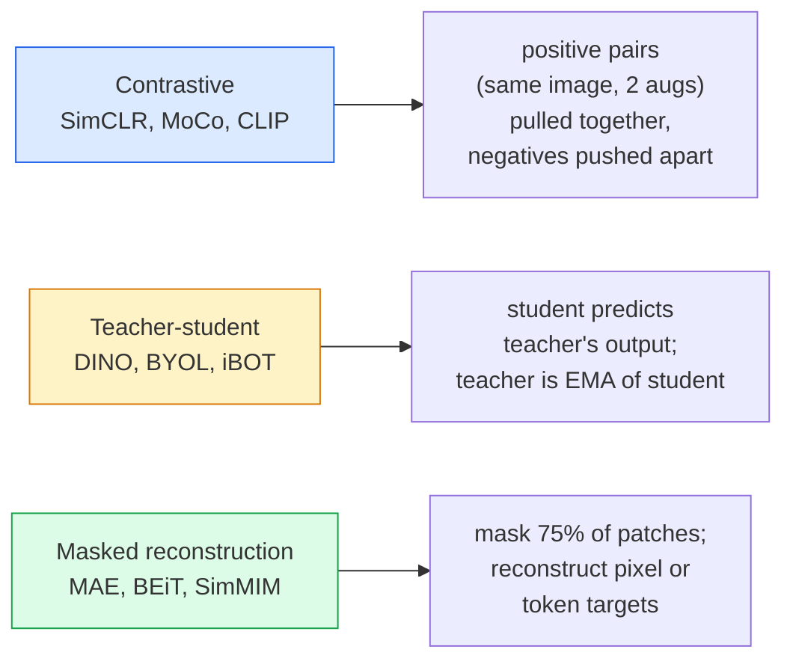

# Самообучение в зрении — SimCLR, DINO, MAE

> Метки — узкое место обучения с учителем в задачах зрения. Самообучаемое предобучение устраняет их: выучите визуальные признаки на 100M неразмеченных изображений, дообучите на 10 тыс. размеченных.

**Тип:** Learn + Build
**Языки:** Python
**Предварительные требования:** Фаза 4, урок 04 (классификация изображений), Фаза 4, урок 14 (ViT)
**Время:** ~75 минут

## Цели обучения

- Проследить три основных семейства самообучения — контрастивное (SimCLR), «учитель-ученик» (DINO), маскированную реконструкцию (MAE) — и сформулировать, что оптимизирует каждое из них
- Реализовать функцию потерь InfoNCE с нуля и объяснить, почему батч в 512 работает, а батч в 32 — нет
- Объяснить, почему доля маскирования 75% в MAE не произвольна и чем она отличается от 15% у BERT для текста
- Использовать чекпоинты DINOv2 или MAE на ImageNet для linear probing и поиска без примеров (zero-shot retrieval)

## Проблема

ImageNet с учителем содержит 1,3M размеченных изображений, разметка которых, по оценкам, обошлась в $10M. Медицинские и промышленные наборы данных меньше и обходятся ещё дороже при разметке. Каждая команда, работающая со зрением, задаётся вопросом: можно ли предобучиться на дешёвых неразмеченных данных — кадрах YouTube, веб-краулинге, записях с веб-камер, спутниковых снимках — а затем дообучиться на небольшом размеченном наборе?

Ответ — самообучение (self-supervised learning). Современный самообучаемый ViT, обученный на LAION или JFT, при дообучении достигает или превосходит точность ImageNet с учителем. Он также лучше переносится на нижестоящие задачи (детекция, сегментация, глубина), чем предобучение с учителем. DINOv2 (Meta, 2023) и MAE (Meta, 2022) — текущие стандарты продакшена для переносимых визуальных признаков.

Концептуальный сдвиг в том, что предтекстовая задача (pretext task) — то, чему обучается модель — не обязана совпадать с нижестоящей задачей. Важно лишь то, что она заставляет модель выучить полезные признаки. Предсказание цвета изображений в градациях серого, поворот изображений с классификацией угла поворота, маскирование патчей с их реконструкцией — всё это работало. Три подхода, которые масштабируются — это контрастивное обучение, дистилляция «учитель-ученик» и маскированная реконструкция.

## Концепция

### Три семейства



### Контрастивное обучение (SimCLR)

Возьмите одно изображение, примените две случайные аугментации, получите два вида. Пропустите оба через один и тот же энкодер плюс проекционную голову. Минимизируйте функцию потерь, которая говорит «эти два эмбеддинга должны быть близки» и «этот эмбеддинг должен быть далёк от эмбеддингов всех остальных изображений в батче».

```
Loss for positive pair (z_i, z_j) among 2N views per batch:

   L_ij = -log( exp(sim(z_i, z_j) / tau) / sum_k in batch \ {i} exp(sim(z_i, z_k) / tau) )

sim = cosine similarity
tau = temperature (0.1 standard)
```

Это и есть функция потерь InfoNCE. Она требует много негативных примеров на каждый позитивный, поэтому размер батча важен — SimCLR нужно 512-8192. MoCo ввёл momentum-очередь из прошлых батчей, чтобы отвязать количество негативных примеров от размера батча.

### «Учитель-ученик» (DINO)

Две сети одной архитектуры: ученик и учитель. Учитель — это экспоненциальное скользящее среднее (EMA) весов ученика. Обе сети видят аугментированные виды изображения. Выход ученика обучается совпадать с выходом учителя — явных негативных примеров нет.

```
loss = CE( student_output(view_1),  teacher_output(view_2) )
     + CE( student_output(view_2),  teacher_output(view_1) )

teacher_weights = m * teacher_weights + (1 - m) * student_weights   (m ≈ 0.996)
```

Почему это не схлопывается в «предсказывать константу»: выход учителя центрируется (вычитается среднее по каждой размерности) и заостряется (делится на маленькую температуру). Центрирование не даёт одной размерности доминировать; заострение не даёт выходу схлопнуться в равномерное распределение.

Именно DINO масштабирует DINOv2, на 142M отобранных изображений. Получившиеся признаки — текущий SOTA для визуального поиска без примеров (zero-shot) и плотного предсказания.

### Маскированная реконструкция (MAE)

Маскируются 75% патчей входа ViT. Через энкодер проходят только видимые 25%. Небольшой декодер получает выход энкодера плюс токены маски на местах замаскированных патчей и обучается восстанавливать пиксели замаскированных патчей.

```
Encoder:  visible 25% of patches -> features
Decoder:  features + mask tokens at masked positions -> reconstructed pixels
Loss:     MSE between reconstructed and original pixels on masked patches only
```

Ключевые проектные решения, благодаря которым MAE работает:

- **Доля маскирования 75%** — высокая. Заставляет энкодер выучить семантические признаки; восстановление 25% было бы почти тривиальным (соседние пиксели настолько коррелированы, что с этим справилась бы даже CNN).
- **Асимметричные энкодер/декодер** — большой энкодер ViT видит только видимые патчи; небольшой декодер (8 слоёв, 512 измерений) занимается реконструкцией. Предобучение в 3 раза быстрее, чем у наивного BEiT.
- **Цель реконструкции в пространстве пикселей** — проще, чем токенизированная цель BEiT, и лучше работает на ViT.

После предобучения декодер отбрасывается. Энкодер становится экстрактором признаков.

### Почему 75%, а не 15%

BERT маскирует 15% токенов. MAE маскирует 75%. Разница — в плотности информации.

- У естественного языка высокая энтропия на токен. Предсказание 15% токенов всё равно сложно, потому что у каждой замаскированной позиции много правдоподобных завершений.
- У патчей изображения низкая энтропия — незамаскированное окружение часто определяет пиксели замаскированного патча почти точно. Чтобы предсказание требовало семантического понимания, маскировать нужно агрессивно.

75% — это достаточно высокая доля, при которой простая пространственная экстраполяция не решает задачу; энкодеру приходится представлять содержимое изображения.

### Оценка linear-probe

После самообучаемого предобучения стандартной оценкой является **linear probe**: энкодер замораживается, поверх него обучается один линейный классификатор на метках ImageNet. Отчитывается точность top-1.

- SimCLR ResNet-50: ~71% (2020)
- DINO ViT-S/16: ~77% (2021)
- MAE ViT-L/16: ~76% (2022)
- DINOv2 ViT-g/14: ~86% (2023)

Linear probe — это чистая мера качества признаков; дообучение (fine-tuning) обычно добавляет 2-5 пунктов, но также примешивает эффект переобучения головы.

```figure
data-augmentation
```

## Создаём

### Шаг 1: конвейер аугментации с двумя видами

```python
import torch
import torchvision.transforms as T

two_view_train = lambda: T.Compose([
    T.RandomResizedCrop(96, scale=(0.2, 1.0)),
    T.RandomHorizontalFlip(),
    T.ColorJitter(0.4, 0.4, 0.4, 0.1),
    T.RandomGrayscale(p=0.2),
    T.ToTensor(),
])


class TwoViewDataset(torch.utils.data.Dataset):
    def __init__(self, base):
        self.base = base
        self.aug = two_view_train()

    def __len__(self):
        return len(self.base)

    def __getitem__(self, i):
        img, _ = self.base[i]
        v1 = self.aug(img)
        v2 = self.aug(img)
        return v1, v2
```

Каждый __getitem__ возвращает два аугментированных вида одного и того же изображения; метки не нужны.

### Шаг 2: функция потерь InfoNCE

```python
import torch.nn.functional as F

def info_nce(z1, z2, tau=0.1):
    """
    z1, z2: (N, D) L2-normalised embeddings of paired views
    """
    N, D = z1.shape
    z = torch.cat([z1, z2], dim=0)  # (2N, D)
    sim = z @ z.T / tau              # (2N, 2N)

    mask = torch.eye(2 * N, dtype=torch.bool, device=z.device)
    sim = sim.masked_fill(mask, float("-inf"))

    targets = torch.cat([torch.arange(N, 2 * N), torch.arange(0, N)]).to(z.device)
    return F.cross_entropy(sim, targets)
```

Нормализуйте эмбеддинги по L2 перед вызовом. `tau=0.1` — значение по умолчанию в SimCLR; при уменьшении функция потерь становится острее и требует больше негативных примеров.

### Шаг 3: проверка InfoNCE на здравый смысл

```python
z1 = F.normalize(torch.randn(16, 32), dim=-1)
z2 = z1.clone()
loss_same = info_nce(z1, z2, tau=0.1).item()
z2_random = F.normalize(torch.randn(16, 32), dim=-1)
loss_random = info_nce(z1, z2_random, tau=0.1).item()
print(f"InfoNCE with identical pairs:  {loss_same:.3f}")
print(f"InfoNCE with random pairs:     {loss_random:.3f}")
```

Идентичные пары должны давать низкое значение потерь (близкое к 0 для большого батча и низкой температуры). Случайные пары должны давать log(2N-1) = ~log(31) = ~3,4 для батча из 16 пар.

### Шаг 4: маскирование в стиле MAE

```python
def random_mask_indices(num_patches, mask_ratio=0.75, seed=0):
    g = torch.Generator().manual_seed(seed)
    n_keep = int(num_patches * (1 - mask_ratio))
    perm = torch.randperm(num_patches, generator=g)
    visible = perm[:n_keep]
    masked = perm[n_keep:]
    return visible.sort().values, masked.sort().values


num_patches = 196
visible, masked = random_mask_indices(num_patches, mask_ratio=0.75)
print(f"visible: {len(visible)} / {num_patches}")
print(f"masked:  {len(masked)} / {num_patches}")
```

Просто, быстро и детерминированно для заданного seed. Реальные реализации MAE делают это батчами и хранят маски для каждого сэмпла отдельно.

## Применяем

DINOv2 — продакшен-стандарт в 2026 году:

```python
import torch
from transformers import AutoImageProcessor, AutoModel

processor = AutoImageProcessor.from_pretrained("facebook/dinov2-base")
model = AutoModel.from_pretrained("facebook/dinov2-base")
model.eval()

# Per-image embeddings for zero-shot retrieval
with torch.no_grad():
    inputs = processor(images=[pil_image], return_tensors="pt")
    outputs = model(**inputs)
    embedding = outputs.last_hidden_state[:, 0]  # CLS token
```

Получившийся 768-мерный эмбеддинг — основа современных конвейеров поиска изображений, плотного сопоставления и переноса без примеров (zero-shot). Дообучение на нижестоящей задаче редко требует больше, чем линейная голова.

Для эмбеддингов изображение-текст эквивалентом являются SigLIP или OpenCLIP; для дообучения в стиле MAE репозиторий `timm` поставляет каждый чекпоинт MAE.

## Публикуем

Этот урок производит:

- `outputs/prompt-ssl-pretraining-picker.md` — промпт, который выбирает SimCLR / MAE / DINOv2 по размеру набора данных, вычислительным ресурсам и нижестоящей задаче.
- `outputs/skill-linear-probe-runner.md` — навык, который пишет оценку linear-probe для любого замороженного энкодера + размеченного набора данных.

## Упражнения

1. **(Лёгкое)** Убедитесь, что функция потерь InfoNCE падает при уменьшении температуры для хорошо выровненных эмбеддингов и растёт при уменьшении температуры для случайных эмбеддингов. Постройте график `tau in [0.05, 0.1, 0.2, 0.5]` против значения потерь.
2. **(Среднее)** Реализуйте буфер центрирования в стиле DINO. Покажите, что без центрирования ученик за несколько эпох схлопывается в постоянный вектор.
3. **(Сложное)** Обучите MAE на CIFAR-100, используя TinyUNet из урока 10 в качестве бэкбона. Сообщите точность linear-probe на 10, 50 и 200 эпохах. Покажите, что linear-probe, предобученный MAE, превосходит linear-probe с обучением с учителем с нуля на том же подмножестве из 1000 изображений.

## Ключевые термины

| Термин | Как говорят люди | Что это на самом деле означает |
|------|----------------|----------------------|
| Self-supervised | «Без меток» | Предтекстовая задача, порождающая полезные представления из неразмеченных данных |
| Pretext task | «Фиктивная задача» | Целевая функция, используемая во время SSL (реконструкция патчей, сопоставление видов); отбрасывается после предобучения |
| Linear probe | «Замороженный энкодер + линейная голова» | Стандартная оценка SSL: обучается только линейный классификатор поверх замороженных признаков |
| InfoNCE | «Контрастивная функция потерь» | softmax по косинусным сходствам; позитивная пара — целевой класс, все остальные — негативные |
| EMA teacher | «Учитель со скользящим средним» | Учитель, чьи веса являются экспоненциальным скользящим средним весов ученика; используется в BYOL, MoCo, DINO |
| Mask ratio | «% скрытых патчей» | Доля патчей, маскируемых во время MAE; 75% для зрения, 15% для текста |
| Representation collapse | «Постоянный выход» | Отказ SSL, при котором энкодер выдаёт постоянный вектор для всех входов; предотвращается центрированием, заострением или негативными примерами |
| DINOv2 | «Продакшен-бэкбон SSL» | Самообучаемый ViT от Meta 2023 года; сильнейшие универсальные визуальные признаки в 2026 году |

## Дополнительные материалы

- [SimCLR (Chen et al., 2020)](https://arxiv.org/abs/2002.05709) — базовая работа по контрастивному обучению
- [DINO (Caron et al., 2021)](https://arxiv.org/abs/2104.14294) — «учитель-ученик» с momentum, центрированием, заострением
- [MAE (He et al., 2022)](https://arxiv.org/abs/2111.06377) — предобучение masked autoencoder для ViT
- [DINOv2 (Oquab et al., 2023)](https://arxiv.org/abs/2304.07193) — масштабирование самообучаемого ViT до продакшен-признаков
