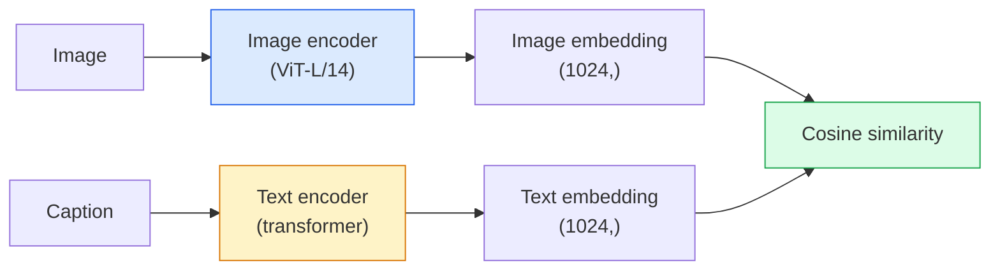

# Зрение с открытым словарём — CLIP

> Обучите энкодер изображений и энкодер текста совместно так, чтобы совпадающие пары (изображение, подпись) оказывались в одной точке общего пространства. В этом весь фокус.

**Тип:** Build + Use
**Языки:** Python
**Предварительные требования:** Фаза 4, урок 14 (ViT), Фаза 4, урок 17 (самообучение)
**Время:** ~45 минут

## Цели обучения

- Объяснить двухбашенную архитектуру CLIP и контрастную целевую функцию обучения
- Использовать предобученный CLIP (или SigLIP) для классификации без примеров (zero-shot) без какого-либо дообучения под конкретную задачу
- Реализовать классификацию без примеров с нуля: закодировать промпты классов, вычислить косинусное сходство, взять argmax
- Различать модели CLIP, SigLIP, OpenCLIP и LLaVA/LLaMA-vision — для чего нужна каждая в 2026 году

## Проблема

Традиционные классификаторы работают с закрытым словарём: модель ImageNet на 1000 классов может предсказывать только эти 1000 меток. Каждая новая категория требует размеченных данных и переобучения головы.

CLIP (Radford et al., OpenAI, 2021) показал, что обучение на 400M парах (изображение, подпись), собранных из интернета, даёт модель, способную на этапе выполнения вывода (инференса) классифицировать по любому набору категорий, описанных исключительно на естественном языке. Новый класс вы задаёте, просто написав предложение.

Эта способность — перенос без примеров (zero-shot) — причина, по которой каждая современная система зрения начинается с контрольной точки семейства CLIP. Детекция (Grounding DINO, OWL-ViT), сегментация (CLIPSeg, SAM), поиск, модерация контента, VLM и генерация изображений по тексту — всё это построено на совместных векторных представлениях (эмбеддингах) в стиле CLIP.

## Концепция

### Две башни



Оба энкодера заканчиваются линейной проекцией в одну и ту же размерность эмбеддинга (512 для CLIP-B/32, 1024 для CLIP-L/14). Выполните L2-нормализацию и вычислите косинусное сходство.

### Целевая функция

Дан пакет из N пар (изображение, подпись); постройте матрицу сходства N x N. Обучите оба энкодера так, чтобы диагональ (совпадающие пары) имела высокое сходство, а внедиагональные элементы (несовпадающие пары) — низкое.

```
sim_matrix = image_embeddings @ text_embeddings.T / tau

loss_i2t = cross_entropy(sim_matrix,       targets=arange(N))
loss_t2i = cross_entropy(sim_matrix.T,     targets=arange(N))
loss = (loss_i2t + loss_t2i) / 2
```

Симметрично, потому что должен работать и поиск изображения по тексту, и текста по изображению. `tau` (температура) обычно обучается как скалярный параметр, инициализированный значением 0.07.

### SigLIP: более совершенная функция потерь

SigLIP (Zhai et al., 2023) заменил softmax на попарную сигмоиду:

```
loss = mean over pairs of log(1 + exp(-y_ij * sim_ij))
y_ij = +1 if matching, -1 otherwise
```

Функция потерь на уровне пары убирает нормализацию на уровне пакета, которую требует CLIP. SigLIP лучше обучается на пакетах малого размера и не уступает CLIP (или превосходит его) при равном объёме данных.

### Классификация без примеров (zero-shot)

Дан обученный CLIP:

1. Для каждого класса составьте промпт: «фотография объекта класса {class}».
2. Закодируйте все промпты классов текстовым энкодером -> `T` формы (C, d).
3. Закодируйте тестовое изображение -> `I` формы (1, d).
4. Сходство = `I @ T.T` формы (1, C).
5. Argmax -> предсказанный класс.

Проектирование промптов имеет значение. OpenAI опубликовал 80 шаблонов промптов для ImageNet («фотография объекта класса {}», «размытая фотография объекта класса {}», «набросок объекта класса {}», ...). Усреднение эмбеддингов всех шаблонов для класса даёт дополнительные 1-3% точности top-1.

### Где модели в стиле CLIP используются в 2026 году

- **Классификация без примеров** — прямое применение.
- **Поиск изображений** — закодируйте все изображения один раз, эмбеддинг запроса вычисляется на этапе инференса.
- **Детекция с текстовым условием** — Grounding DINO, OWL-ViT оборачивают текстовую башню CLIP вокруг детектора.
- **Сегментация с текстовым условием** — CLIPSeg; SAM использует текстовые промпты через CLIP.
- **VLM** — LLaVA, Qwen-VL, InternVL встраивают визуальный энкодер семейства CLIP в большую языковую модель (LLM).
- **Генерация изображений по тексту** — Stable Diffusion, DALL-E 3 обусловливаются текстовыми эмбеддингами CLIP.

Как только у вас есть общее пространство эмбеддингов, любая задача на стыке зрения и языка превращается в вычисление расстояния.

```figure
clip-contrastive
```

## Создаём

### Шаг 1: миниатюрная двухбашенная модель

Настоящий CLIP — это ViT + трансформер. В этом уроке башни — маленькие MLP над заранее извлечёнными признаками, чтобы сигнал обучения был виден на CPU.

```python
import torch
import torch.nn as nn
import torch.nn.functional as F


class TwoTower(nn.Module):
    def __init__(self, img_in=128, txt_in=64, emb=64):
        super().__init__()
        self.image_proj = nn.Sequential(nn.Linear(img_in, 128), nn.ReLU(), nn.Linear(128, emb))
        self.text_proj = nn.Sequential(nn.Linear(txt_in, 128), nn.ReLU(), nn.Linear(128, emb))
        self.logit_scale = nn.Parameter(torch.ones([]) * 2.6592)  # ln(1/0.07)

    def forward(self, img_feats, txt_feats):
        i = F.normalize(self.image_proj(img_feats), dim=-1)
        t = F.normalize(self.text_proj(txt_feats), dim=-1)
        return i, t, self.logit_scale.exp()
```

Две проекции, выход общей размерности, обучаемая температура. Та же форма, что и у настоящего API CLIP.

### Шаг 2: контрастная функция потерь

```python
def clip_loss(image_emb, text_emb, logit_scale):
    N = image_emb.size(0)
    sim = logit_scale * image_emb @ text_emb.T
    targets = torch.arange(N, device=sim.device)
    l_i = F.cross_entropy(sim, targets)
    l_t = F.cross_entropy(sim.T, targets)
    return (l_i + l_t) / 2
```

Симметрично. Более высокий logit_scale = более резкий softmax = увереннее, но выше риск нестабильности.

### Шаг 3: классификатор без примеров

```python
@torch.no_grad()
def zero_shot_classify(model, image_feats, class_text_feats, class_names):
    """
    image_feats:      (N, img_in)
    class_text_feats: (C, txt_in)   one averaged embedding per class
    """
    i = F.normalize(model.image_proj(image_feats), dim=-1)
    t = F.normalize(model.text_proj(class_text_feats), dim=-1)
    sim = i @ t.T
    pred = sim.argmax(dim=-1)
    return [class_names[p] for p in pred.tolist()]
```

Одна строка на шаг. Это точная процедура классификации без примеров, применяемая с контрольной точкой CLIP для промышленного использования.

### Шаг 4: проверка на здравый смысл

```python
torch.manual_seed(0)
model = TwoTower()

img = torch.randn(8, 128)
txt = torch.randn(8, 64)
i, t, scale = model(img, txt)
loss = clip_loss(i, t, scale)
print(f"batch size: {i.size(0)}   loss: {loss.item():.3f}")
```

Значение потерь должно быть близко к `log(N) = log(8) = 2.08` для модели со случайной инициализацией — это симметричная целевая величина кросс-энтропии, когда структура ещё не выучена.

## Применяем

OpenCLIP — стандарт сообщества в 2026 году:

```python
import open_clip
import torch
from PIL import Image

model, _, preprocess = open_clip.create_model_and_transforms("ViT-B-32", pretrained="laion2b_s34b_b79k")
tokenizer = open_clip.get_tokenizer("ViT-B-32")

image = preprocess(Image.open("dog.jpg")).unsqueeze(0)
text = tokenizer(["a photo of a dog", "a photo of a cat", "a photo of a car"])

with torch.no_grad():
    image_features = model.encode_image(image)
    text_features = model.encode_text(text)
    image_features = image_features / image_features.norm(dim=-1, keepdim=True)
    text_features = text_features / text_features.norm(dim=-1, keepdim=True)
    probs = (100.0 * image_features @ text_features.T).softmax(dim=-1)

print(probs)
```

SigLIP новее, лучше обучается на малых масштабах и предпочтителен для новых проектов: `google/siglip-base-patch16-224`. Hugging Face поставляет обе модели.

## Публикуем

Этот урок производит:

- `outputs/prompt-zero-shot-class-picker.md` — промпт, который проектирует шаблоны классов для классификации без примеров с CLIP по списку классов и домену.
- `outputs/skill-image-text-retriever.md` — скилл, который строит индекс эмбеддингов изображений с любой контрольной точкой CLIP, поддерживает запрос по тексту и запрос по изображению.

## Упражнения

1. **(Лёгкое)** Используйте предобученный OpenCLIP ViT-B/32 и выполните классификацию без примеров на CIFAR-10 с набором из 80 шаблонов промптов. Сообщите точность top-1; она должна быть около 85-90%.
2. **(Среднее)** Сравните эмбеддинги с одним шаблоном («фотография объекта класса {}») и усреднённые эмбеддинги с 80 шаблонами на той же задаче CIFAR-10. Оцените разрыв численно и объясните, почему шаблоны помогают.
3. **(Сложное)** Постройте индекс поиска изображений без примеров: закодируйте 1,000 изображений с помощью CLIP, постройте индекс FAISS, выполните запрос текстовым описанием на естественном языке. Сообщите полноту@5 для 20 отложенных запросов, написанных вами вручную.

## Ключевые термины

| Термин | Как его называют | Что он означает на самом деле |
|------|----------------|----------------------|
| Двухбашенная архитектура | «Двойной энкодер» | Раздельные энкодеры изображения и текста, заканчивающиеся проекционной головой общей размерности |
| Классификация без примеров (zero-shot) | «Без обучения под задачу» | Классификация по классам, описанным только текстом на этапе инференса; метки не используются |
| Температура / logit_scale | «tau» | Обучаемый скаляр, масштабирующий матрицу сходства перед softmax |
| Шаблон промпта | «Фотография объекта класса {}» | Обёртка на естественном языке вокруг имён классов; усреднение множества шаблонов повышает точность классификации без примеров |
| CLIP | «Модель "изображение+текст"» | Модель OpenAI 2021 года; словарь области в 2026 году |
| SigLIP | «Сигмоидный CLIP» | Заменяет softmax на попарную сигмоиду; лучше обучается на малых пакетах |
| OpenCLIP | «Открытая реплика» | Обученные сообществом варианты CLIP на LAION; стандарт продакшена для открытых конвейеров |
| VLM | «Модель "зрение-язык"» | Энкодер семейства CLIP плюс LLM, обученные отвечать на вопросы об изображениях |

## Дополнительные материалы

- [CLIP: Learning Transferable Visual Models from Natural Language Supervision (Radford et al., 2021)](https://arxiv.org/abs/2103.00020)
- [SigLIP: Sigmoid Loss for Language-Image Pre-Training (Zhai et al., 2023)](https://arxiv.org/abs/2303.15343)
- [OpenCLIP](https://github.com/mlfoundations/open_clip) — кодовая база сообщества
- [DINOv2, CLIP и MAE: сравнение признаков](https://huggingface.co/blog/dinov2) — руководство HF со сравнением сценариев использования
