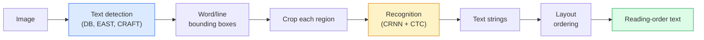

# OCR и понимание документов

> OCR — это трёхэтапный конвейер: обнаружить текстовые области, распознать символы и затем расположить их по макету. Каждая современная система OCR переставляет эти этапы или объединяет их.

**Тип:** Learn + Use
**Языки:** Python
**Предварительные требования:** Фаза 4, урок 06 (Детекция), Фаза 7, урок 02 (Самовнимание)
**Время:** ~45 минут

## Цели обучения

- Проследить классический конвейер OCR (обнаружение -> распознавание -> макет) и современные сквозные альтернативы (Donut, Qwen-VL-OCR)
- Реализовать функцию потерь CTC (Connectionist Temporal Classification) для обучения OCR по схеме "последовательность в последовательность"
- Использовать PaddleOCR или EasyOCR для продакшен-разбора документов без обучения
- Различать OCR, разбор макета и понимание документов — и выбирать подходящий инструмент под задачу

## Проблема

Изображения, полные текста, повсюду: чеки, счета, документы, удостоверяющие личность, отсканированные книги, формы, доски, вывески, скриншоты. Извлечение из них структурированных данных — не просто символов, а «это итоговая сумма» — одна из самых ценных прикладных задач в области зрения.

Область делится на три уровня навыков:

1. **Собственно OCR**: превратить пиксели в текст.
2. **Разбор макета**: сгруппировать вывод OCR в области (заголовок, тело, таблица, шапка).
3. **Понимание документов**: извлечь структурированные поля («invoice_total = $42.50») из макета.

У каждого уровня есть классические и современные подходы, и разрыв между «я хочу текст с изображения» и «мне нужна итоговая сумма из этого чека» больше, чем осознаёт большинство команд.

## Концепция

### Классический конвейер



- **Обнаружение текста** даёт четырёхугольники по строкам или по словам.
- **Распознавание** обрезает каждую область до фиксированной высоты и прогоняет через CNN + BiLSTM + CTC, получая последовательность символов.
- **Макет** восстанавливает порядок чтения (сверху вниз, слева направо для латиницы; иначе для арабского, японского).

### CTC в одном абзаце

Распознавание OCR выдаёт последовательность переменной длины из карты признаков фиксированной длины. CTC (Graves et al., 2006) позволяет обучать это без посимвольного выравнивания. Модель выдаёт распределение по (словарю + пустому символу) на каждом временном шаге; функция потерь CTC маргинализирует по всем выравниваниям, которые после слияния повторов и удаления пустых символов сводятся к целевому тексту.

```
raw output: "h h h _ _ e e l l _ l l o _ _"
after merge repeats and remove blanks: "hello"
```

CTC — причина, по которой CRNN работал в 2015 году и до сих пор обучает большинство продакшен-моделей OCR в 2026 году.

### Современные сквозные модели

- **Donut** (Kim et al., 2022) — энкодер ViT + текстовый декодер; читает изображение и сразу выдаёт JSON. Без детектора текста, без модуля макета.
- **TrOCR** — ViT + трансформерный декодер для построчного OCR.
- **Qwen-VL-OCR / InternVL** — полноценные визуально-языковые модели, дообученные под задачи OCR; лучшая точность в 2026 году на сложных документах.
- **PaddleOCR** — классический конвейер DB + CRNN в зрелом продакшен-пакете; всё ещё рабочая лошадка среди решений с открытым исходным кодом.

Сквозным моделям нужно больше данных и вычислений, но они избегают накопления ошибок многоэтапных конвейеров.

### Разбор макета

Для структурированных документов запустите детектор макета (LayoutLMv3, DocLayNet), который размечает каждую область: заголовок, абзац, рисунок, таблица, сноска. Порядок чтения тогда сводится к «пройтись по областям в порядке макета, конкатенировать».

Для форм используйте модели **извлечения пар "ключ-значение"** (Donut для визуально насыщенных документов, LayoutLMv3 для простых сканов). Они принимают изображение + распознанный текст + позиции и предсказывают структурированные пары ключ-значение.

### Метрики оценивания

- **Доля ошибок на уровне символов (Character Error Rate, CER)** — расстояние Левенштейна / длина эталона. Чем меньше, тем лучше. Продакшен-цель: < 2% на чистых сканах.
- **Доля ошибок на уровне слов (Word Error Rate, WER)** — то же самое на уровне слов.
- **F1 по структурированным полям** — для задач "ключ-значение"; измеряет, корректно ли появляется `{invoice_total: 42.50}`.
- **Расстояние редактирования по JSON** — для сквозного разбора документов; статья Donut ввела нормализованное расстояние редактирования по дереву.

```figure
cv3-ctc-collapse
```

## Создаём

### Шаг 1: функция потерь CTC + жадный декодер

```python
import torch
import torch.nn as nn
import torch.nn.functional as F


def ctc_loss(log_probs, targets, input_lengths, target_lengths, blank=0):
    """
    log_probs:      (T, N, C) log-softmax over vocab including blank at index 0
    targets:        (N, S) int targets (no blanks)
    input_lengths:  (N,) per-sample time steps used
    target_lengths: (N,) per-sample target length
    """
    return F.ctc_loss(log_probs, targets, input_lengths, target_lengths,
                      blank=blank, reduction="mean", zero_infinity=True)


def greedy_ctc_decode(log_probs, blank=0):
    """
    log_probs: (T, N, C) log-softmax
    returns: list of index sequences (blanks removed, repeats merged)
    """
    preds = log_probs.argmax(dim=-1).transpose(0, 1).cpu().tolist()
    out = []
    for seq in preds:
        decoded = []
        prev = None
        for idx in seq:
            if idx != prev and idx != blank:
                decoded.append(idx)
            prev = idx
        out.append(decoded)
    return out
```

`F.ctc_loss` использует эффективную реализацию CuDNN, когда она доступна. Жадный декодер проще, чем поиск по лучу, и обычно в пределах 1% CER от него.

### Шаг 2: миниатюрный распознаватель CRNN

Минимальные CNN + BiLSTM для построчного OCR.

```python
class TinyCRNN(nn.Module):
    def __init__(self, vocab_size=40, hidden=128, feat=32):
        super().__init__()
        self.cnn = nn.Sequential(
            nn.Conv2d(1, feat, 3, 1, 1), nn.BatchNorm2d(feat), nn.ReLU(inplace=True),
            nn.MaxPool2d(2),
            nn.Conv2d(feat, feat * 2, 3, 1, 1), nn.BatchNorm2d(feat * 2), nn.ReLU(inplace=True),
            nn.MaxPool2d(2),
            nn.Conv2d(feat * 2, feat * 4, 3, 1, 1), nn.BatchNorm2d(feat * 4), nn.ReLU(inplace=True),
            nn.MaxPool2d((2, 1)),
            nn.Conv2d(feat * 4, feat * 4, 3, 1, 1), nn.BatchNorm2d(feat * 4), nn.ReLU(inplace=True),
            nn.MaxPool2d((2, 1)),
        )
        self.rnn = nn.LSTM(feat * 4, hidden, bidirectional=True, batch_first=True)
        self.head = nn.Linear(hidden * 2, vocab_size)

    def forward(self, x):
        # x: (N, 1, H, W)
        f = self.cnn(x)                # (N, C, H', W')
        f = f.mean(dim=2).transpose(1, 2)  # (N, W', C)
        h, _ = self.rnn(f)
        return F.log_softmax(self.head(h).transpose(0, 1), dim=-1)  # (W', N, vocab)
```

Вход фиксированной высоты (CNN сводит высоту к 1 максимальным пулингом). Ширина — временное измерение для CTC.

### Шаг 3: синтетический OCR

Сгенерируйте строки цифр чёрным по белому для сквозного дымового теста.

```python
import numpy as np

def synthetic_line(text, height=32, char_width=16):
    W = char_width * len(text)
    img = np.ones((height, W), dtype=np.float32)
    for i, c in enumerate(text):
        x = i * char_width
        shade = 0.0 if c.isalnum() else 0.5
        img[6:height - 6, x + 2:x + char_width - 2] = shade
    return img


def build_batch(strings, vocab):
    H = 32
    W = 16 * max(len(s) for s in strings)
    imgs = np.ones((len(strings), 1, H, W), dtype=np.float32)
    target_lengths = []
    targets = []
    for i, s in enumerate(strings):
        imgs[i, 0, :, :16 * len(s)] = synthetic_line(s)
        ids = [vocab.index(c) for c in s]
        targets.extend(ids)
        target_lengths.append(len(ids))
    return torch.from_numpy(imgs), torch.tensor(targets), torch.tensor(target_lengths)


vocab = ["_"] + list("0123456789abcdefghijklmnopqrstuvwxyz")
imgs, targets, lengths = build_batch(["hello", "world"], vocab)
print(f"images: {imgs.shape}   targets: {targets.shape}   lengths: {lengths.tolist()}")
```

Настоящий набор данных OCR добавляет шрифты, шум, поворот, размытие и цвет. Конвейер выше идентичен.

### Шаг 4: набросок обучения

```python
model = TinyCRNN(vocab_size=len(vocab))
opt = torch.optim.Adam(model.parameters(), lr=1e-3)

for step in range(200):
    strings = ["abc" + str(step % 10)] * 4 + ["xyz" + str((step + 1) % 10)] * 4
    imgs, targets, target_lens = build_batch(strings, vocab)
    log_probs = model(imgs)  # (W', 8, vocab)
    input_lens = torch.full((8,), log_probs.size(0), dtype=torch.long)
    loss = ctc_loss(log_probs, targets, input_lens, target_lens, blank=0)
    opt.zero_grad(); loss.backward(); opt.step()
```

Значение потерь должно упасть примерно с 3 до 0.2 за 200 шагов на этих тривиальных синтетических данных.

## Применяем

Три продакшен-пути:

- **PaddleOCR** — зрелый, быстрый, многоязычный. Использование в одну строку: `paddleocr.PaddleOCR(lang="en").ocr(image_path)`.
- **EasyOCR** — нативный для Python, многоязычный, бэкбон на PyTorch.
- **Tesseract** — классический; всё ещё полезен для старых отсканированных документов, когда модели не справляются.

Для сквозного разбора документов используйте Donut или VLM:

```python
from transformers import DonutProcessor, VisionEncoderDecoderModel

processor = DonutProcessor.from_pretrained("naver-clova-ix/donut-base-finetuned-cord-v2")
model = VisionEncoderDecoderModel.from_pretrained("naver-clova-ix/donut-base-finetuned-cord-v2")
```

Для чеков, счетов и форм с повторяющейся структурой дообучите Donut. Для произвольных документов или OCR с рассуждением текущий выбор по умолчанию — VLM вроде Qwen-VL-OCR.

## Публикуем

Этот урок производит:

- `outputs/prompt-ocr-stack-picker.md` — промпт, который выбирает Tesseract / PaddleOCR / Donut / VLM-OCR по типу документа, языку и структуре.
- `outputs/skill-ctc-decoder.md` — скилл, который пишет с нуля жадный декодер и декодер CTC с поиском по лучу, включая нормализацию по длине.

## Упражнения

1. **(Лёгкое)** Обучите TinyCRNN на случайных пятизначных числовых строках за 500 шагов. Сообщите CER на отложенном наборе.
2. **(Среднее)** Замените жадное декодирование поиском по лучу (beam_width=5). Сообщите изменение CER. На каких входных данных поиск по лучу выигрывает?
3. **(Сложное)** Примените PaddleOCR к набору из 20 чеков, извлеките позиции товаров и вычислите F1 относительно вручную размеченного эталона для пар {item_name, price}.

## Ключевые термины

| Термин | Как обычно говорят | Что это означает на самом деле |
|------|----------------|----------------------|
| OCR | «Текст из пикселей» | Превращение областей изображения в последовательности символов |
| CTC | «Функция потерь без выравнивания» | Функция потерь, обучающая модель последовательности без меток на каждом временном шаге; маргинализирует по выравниваниям |
| CRNN | «Классическая модель OCR» | Свёрточный экстрактор признаков + BiLSTM + CTC; базовая модель 2015 года, всё ещё используемая в продакшене |
| Donut | «Сквозной OCR» | Энкодер ViT + текстовый декодер; выдаёт JSON прямо из изображения |
| Разбор макета | «Найти области» | Обнаружение и разметка областей заголовка/таблицы/рисунка/абзаца в документе |
| Порядок чтения | «Последовательность текста» | Упорядочивание распознанных областей в предложение; тривиально для латиницы, нетривиально для смешанных макетов |
| CER / WER | «Частота ошибок» | Расстояние Левенштейна / длина эталона на уровне символов или слов |
| VLM-OCR | «LLM, который читает» | Визуально-языковая модель, обученная или промптированная для задач OCR; демонстрирует лучшие современные результаты на сложных документах |

## Дополнительные материалы

- [CRNN (Shi et al., 2015)](https://arxiv.org/abs/1507.05717) — оригинальная архитектура CNN+RNN+CTC
- [CTC (Graves et al., 2006)](https://www.cs.toronto.edu/~graves/icml_2006.pdf) — оригинальная статья про CTC; плотно упакована алгоритмическими идеями
- [Donut (Kim et al., 2022)](https://arxiv.org/abs/2111.15664) — трансформер для понимания документов без OCR
- [PaddleOCR](https://github.com/PaddlePaddle/PaddleOCR) — открытый продакшен-стек OCR
