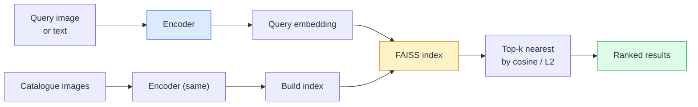

# Поиск изображений и метрическое обучение

> Система поиска ранжирует кандидатов по расстоянию в пространстве эмбеддингов. Метрическое обучение — это дисциплина формирования такого пространства, чтобы расстояния означали именно то, что нужно.

**Тип:** Build
**Языки:** Python
**Предварительные требования:** Фаза 4, урок 14 (ViT), Фаза 4, урок 18 (CLIP)
**Время:** ~45 минут

## Цели обучения

- Объяснить триплетные, контрастные и прокси-функции потерь метрического обучения и выбирать подходящую для конкретного набора данных
- Корректно реализовать L2-нормализацию и косинусное сходство и различать поиск «того же объекта» и поиск «того же класса»
- Построить индекс FAISS, выполнить запрос по тексту и по изображению и сообщить полноту@K для отложенного набора запросов
- Использовать DINOv2, CLIP и SigLIP как готовые бэкбоны эмбеддингов и знать, когда какой выигрывает

## Проблема

Поиск повсюду в продакшен-системах зрения: обнаружение дубликатов, обратный поиск изображений, визуальный поиск («найти похожие товары»), повторная идентификация лиц, повторная идентификация людей для видеонаблюдения, сопоставление на уровне экземпляров для электронной коммерции. Продуктовый вопрос всегда один и тот же: «дано это изображение-запрос, ранжируй мой каталог».

Два проектных решения формируют всю систему. Эмбеддинг — какая модель производит векторы. Индекс — как находить ближайших соседей в масштабе. Оба стали товарной технологией в 2026 году (DINOv2 для эмбеддинга, FAISS для индекса), что поднимает планку: сложная часть — определить, *что считается похожим* для вашего приложения, а затем сформировать пространство эмбеддингов так, чтобы расстояния этому соответствовали.

Это формирование и есть метрическое обучение. Небольшая, но крайне влиятельная дисциплина.

## Концепция

### Поиск в общих чертах



### Четыре семейства функций потерь

| Функция потерь | Требования | Преимущества | Недостатки |
|------|----------|------|------|
| **Контрастная** | (якорь, позитив) + негативы | Просто, работает с любой разметкой пар | Медленно сходится без большого числа негативов |
| **Триплетная** | (якорь, позитив, негатив) | Интуитивно; прямой контроль отступа | Майнинг сложных триплетов затратен |
| **NT-Xent / InfoNCE** | Пары + негативы, добытые внутри батча | Масштабируется на большие батчи | Требует большого батча или очереди с инерционным обновлением |
| **Прокси-метод (ProxyNCA)** | Только метки классов | Быстро, стабильно, без майнинга | Может переобучаться на прокси на малых наборах данных |

Для большинства продакшен-сценариев начните с предобученного бэкбона и добавляйте дообучение методом метрического обучения только если готовые эмбеддинги показывают недостаточную точность на вашем тестовом наборе.

### Триплетная функция потерь формально

```
L = max(0, ||f(a) - f(p)||^2 - ||f(a) - f(n)||^2 + margin)
```

Притяните якорь `a` к позитиву `p`, оттолкните его от негатива `n`, с отступом `margin`, обеспечивающим зазор. Структура из трёх изображений обобщается на любой порядок сходства.

Майнинг важен: лёгкие триплеты (`n` уже далеко от `a`) дают нулевую потерю; учат сеть только сложные триплеты. Полусложный майнинг (`n` дальше, чем `p`, но в пределах отступа) — рецепт FaceNet 2016 года, который до сих пор доминирует.

### Косинусное сходство против L2

Две метрики, две конвенции:

- **Косинусное**: угол между векторами. Требует L2-нормализованных эмбеддингов.
- **L2**: евклидово расстояние. Работает на сырых или нормализованных эмбеддингах, но обычно сочетается с L2-нормализацией + квадратом L2.

Для большинства современных сетей эти две метрики эквивалентны: `||a - b||^2 = 2 - 2 cos(a, b)` при `||a|| = ||b|| = 1`. Выбирайте конвенцию, соответствующую обучению вашего эмбеддинга; их смешение незаметно меняет то, что означает «ближайший».

### Полнота@K

Стандартная метрика поиска:

```
recall@K = fraction of queries where at least one correct match is in the top K results
```

Сообщайте полноту@1, @5, @10 рядом друг с другом. Полнота@10 выше 0.95 при полноте@1 ниже 0.5 означает, что пространство эмбеддингов имеет правильную структуру, но ранжирование зашумлено — попробуйте более долгое дообучение или этап повторного ранжирования.

Для обнаружения дубликатов важнее точность@K, потому что каждый ложноположительный результат — это заметная пользователю ошибка. Для визуального поиска полнота@K — продуктовый сигнал.

### FAISS в одном абзаце

Facebook AI Similarity Search. Фактическая стандартная библиотека для поиска ближайших соседей. Три варианта индекса:

- `IndexFlatIP` / `IndexFlatL2` — полный перебор, точный, без обучения. Используйте до ~1M векторов.
- `IndexIVFFlat` — разбиение на K ячеек, поиск только в ближайших нескольких ячейках. Приближённый, быстрый, нужны обучающие данные.
- `IndexHNSW` — на основе графа, самый быстрый для множества запросов, большой размер индекса.

Для 100k векторов вам, вероятно, нужен `IndexFlatIP` на косинусном сходстве. Для 10M — `IndexIVFFlat`. Для 100M+ в сочетании с квантованием произведения (`IndexIVFPQ`).

### Поиск на уровне экземпляра против поиска на уровне категории

Две очень разные задачи с одинаковым названием:

- **Поиск на уровне категории** — «найти кошек в моём каталоге». Классово-обусловленное сходство; готовые эмбеддинги CLIP / DINOv2 работают хорошо.
- **Поиск на уровне экземпляра** — «найти *именно этот товар* в моём каталоге». Требует тонкого различения визуально похожих объектов одного класса; готовые эмбеддинги показывают недостаточную точность; важно дообучение методом метрического обучения.

Всегда спрашивайте, какую именно задачу вы решаете, прежде чем выбирать модель.

```figure
metric-embedding
```

## Создаём

### Шаг 1: триплетная функция потерь

```python
import torch
import torch.nn.functional as F

def triplet_loss(anchor, positive, negative, margin=0.2):
    d_ap = F.pairwise_distance(anchor, positive, p=2)
    d_an = F.pairwise_distance(anchor, negative, p=2)
    return F.relu(d_ap - d_an + margin).mean()
```

Одна строка. Работает на L2-нормализованных или сырых эмбеддингах.

### Шаг 2: полусложный майнинг

Дан батч эмбеддингов и меток; найдите самый сложный полусложный негатив для каждого якоря.

```python
def semi_hard_negatives(emb, labels, margin=0.2):
    dist = torch.cdist(emb, emb)
    same_class = labels[:, None] == labels[None, :]
    diff_class = ~same_class
    N = emb.size(0)

    positives = dist.clone()
    positives[~same_class] = float("-inf")
    positives.fill_diagonal_(float("-inf"))
    pos_idx = positives.argmax(dim=1)

    semi_hard = dist.clone()
    semi_hard[same_class] = float("inf")
    d_ap = dist[torch.arange(N), pos_idx].unsqueeze(1)
    semi_hard[dist <= d_ap] = float("inf")
    neg_idx = semi_hard.argmin(dim=1)

    fallback_mask = semi_hard[torch.arange(N), neg_idx] == float("inf")
    if fallback_mask.any():
        hardest = dist.clone()
        hardest[same_class] = float("inf")
        neg_idx = torch.where(fallback_mask, hardest.argmin(dim=1), neg_idx)
    return pos_idx, neg_idx
```

Каждый якорь получает самый сложный позитив внутри класса и полусложный негатив, который дальше, чем позитив, но в пределах отступа.

### Шаг 3: полнота@K

```python
def recall_at_k(query_emb, gallery_emb, query_labels, gallery_labels, k=1):
    sim = query_emb @ gallery_emb.T
    _, top_k = sim.topk(k, dim=-1)
    matches = (gallery_labels[top_k] == query_labels[:, None]).any(dim=-1)
    return matches.float().mean().item()
```

Первые k результатов по скалярному произведению на L2-нормализованных эмбеддингах совпадают с первыми k результатами по косинусному сходству. Сообщайте среднюю долю запросов хотя бы с одним верным соседом.

### Шаг 4: собираем всё вместе

```python
import torch
import torch.nn as nn
from torch.optim import Adam

class Encoder(nn.Module):
    def __init__(self, in_dim=128, emb_dim=64):
        super().__init__()
        self.net = nn.Sequential(
            nn.Linear(in_dim, 128), nn.ReLU(),
            nn.Linear(128, emb_dim),
        )

    def forward(self, x):
        return F.normalize(self.net(x), dim=-1)

torch.manual_seed(0)
num_classes = 6
protos = F.normalize(torch.randn(num_classes, 128), dim=-1)

def sample_batch(bs=32):
    labels = torch.randint(0, num_classes, (bs,))
    x = protos[labels] + 0.15 * torch.randn(bs, 128)
    return x, labels

enc = Encoder()
opt = Adam(enc.parameters(), lr=3e-3)

for step in range(200):
    x, y = sample_batch(32)
    emb = enc(x)
    pos_idx, neg_idx = semi_hard_negatives(emb, y)
    loss = triplet_loss(emb, emb[pos_idx], emb[neg_idx])
    opt.zero_grad(); loss.backward(); opt.step()
```

После нескольких сотен шагов кластеры эмбеддингов образуют по одному кластеру на класс.

## Применяем

Продакшен-стеки в 2026 году:

- **DINOv2 + FAISS** — визуальный поиск общего назначения. Работает "из коробки".
- **CLIP + FAISS** — когда запросы текстовые.
- **Дообученный DINOv2 + FAISS** — поиск на уровне экземпляра, повторная идентификация лиц, мода, электронная коммерция.
- **Milvus / Weaviate / Qdrant** — управляемые обёртки векторных БД поверх FAISS или HNSW.

Для передового поиска экземпляров рецепт таков: бэкбон DINOv2, добавьте голову эмбеддинга, дообучите с триплетной или InfoNCE-функцией потерь на парах с метками экземпляра, проиндексируйте в FAISS.

## Публикуем

Этот урок производит:

- `outputs/prompt-retrieval-loss-picker.md` — промпт, который выбирает триплетную функцию потерь / InfoNCE / ProxyNCA для заданной задачи поиска.
- `outputs/skill-recall-at-k-runner.md` — скилл, который пишет чистый инструмент оценивания для полноты@K с разбиением на обучающую, валидационную и поисковую выборки и корректным контрактом данных.

## Упражнения

1. **(Лёгкое)** Запустите игрушечный пример выше. Постройте график эмбеддингов методом PCA до и после обучения, чтобы увидеть, как формируются шесть кластеров.
2. **(Среднее)** Добавьте реализацию функции потерь ProxyNCA: один обучаемый «прокси» на класс, стандартная кросс-энтропия по косинусному сходству. Сравните скорость сходимости с триплетной функцией потерь на игрушечных данных.
3. **(Сложное)** Возьмите 1,000 изображений из валидационного набора ImageNet, закодируйте с помощью DINOv2 через HuggingFace, постройте плоский индекс FAISS и сообщите полноту@{1, 5, 10} относительно тех же изображений в роли запросов (должно быть 1.0) и относительно отложенного разбиения с метками ImageNet в качестве эталона.

## Ключевые термины

| Термин | Как обычно говорят | Что это означает на самом деле |
|------|----------------|----------------------|
| Метрическое обучение | «Формирование пространства» | Обучение энкодера так, чтобы расстояния в его выходном пространстве отражали целевое сходство |
| Триплетная функция потерь | «Притянуть и оттолкнуть» | L = max(0, d(a, p) - d(a, n) + margin); каноническая функция потерь метрического обучения |
| Полусложный майнинг | «Полезные негативы» | Негативы дальше от якоря, чем позитив, но в пределах отступа; эмпирически наиболее информативны |
| Прокси-функция потерь | «Прототипы классов» | Один обучаемый прокси на класс; кросс-энтропия по сходству с прокси; без майнинга пар |
| Полнота@K | «Доля попаданий в первые K результатов» | Доля запросов хотя бы с одним верным результатом среди первых K |
| Поиск экземпляров | «Найти именно эту вещь» | Тонкое сопоставление; готовые признаки обычно показывают недостаточную точность |
| FAISS | «Библиотека ближайших соседей» | Библиотека ближайших соседей от Facebook; поддерживает точные и приближённые индексы |
| HNSW | «Графовый индекс» | Иерархический граф навигации в малом мире; быстрый приближённый поиск соседей с малыми накладными расходами по памяти |

## Дополнительные материалы

- [FaceNet: A Unified Embedding for Face Recognition (Schroff et al., 2015)](https://arxiv.org/abs/1503.03832) — статья о триплетной функции потерь / полусложном майнинге
- [In Defense of the Triplet Loss for Person Re-Identification (Hermans et al., 2017)](https://arxiv.org/abs/1703.07737) — практическое руководство по дообучению с триплетной функцией потерь
- [Документация FAISS](https://github.com/facebookresearch/faiss/wiki) — каждый индекс, каждый компромисс
- [SMoT: Metric Learning Taxonomy (Kim et al., 2021)](https://arxiv.org/abs/2010.06927) — обзор современных функций потерь и связей между ними
