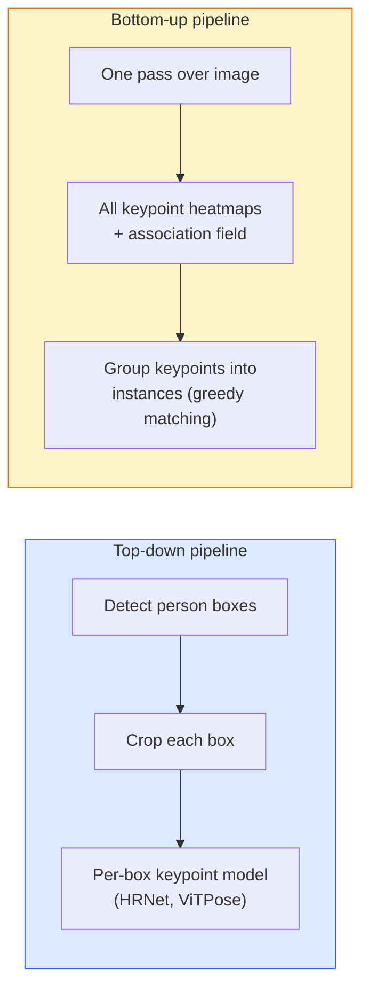

# Обнаружение ключевых точек и оценка позы

> Поза — это набор упорядоченных ключевых точек. Детектор ключевых точек — это регрессор тепловых карт. Всё остальное — техническая обвязка.

**Тип:** Build
**Языки:** Python
**Предварительные требования:** Фаза 4, урок 06 (Детекция), Фаза 4, урок 07 (U-Net)
**Время:** ~45 минут

## Цели обучения

- Различать нисходящую (top-down) и восходящую (bottom-up) оценку позы и понимать, когда используется каждая
- Регрессировать тепловые карты для K ключевых точек с гауссовой целью на каждую ключевую точку и извлекать координаты ключевых точек на этапе инференса
- Объяснить поля сродства частей (Part Affinity Fields, PAF) и то, как восходящие конвейеры связывают ключевые точки в экземпляры
- Использовать MediaPipe Pose или MMPose для продакшен-оценки ключевых точек и понимать формат их вывода

## Проблема

Задачи с ключевыми точками скрываются под многими названиями: поза человека (17 суставов тела), ориентиры лица (68 или 478 точек), рука (21 точка), поза животного, поза объекта для робота, анатомические ориентиры в медицине. У всех у них одна и та же структура: обнаружить K дискретных точек на объекте и вывести их координаты (x, y).

Оценка позы — основа захвата движения, фитнес-приложений, спортивной аналитики, управления жестами, анимации, AR-примерки и захвата объектов роботом. Двумерный случай зрелый; трёхмерная поза (оценка положения суставов в мировых координатах по одной камере) — текущий передний край исследований.

Инженерный вопрос — это масштаб. Поза одного человека на одном изображении — задача на 20 мс. Поза нескольких людей в толпе при 30 кадрах в секунду — совсем другая задача с другими архитектурами.

## Концепция

### Нисходящий подход против восходящего



- **Нисходящий (top-down)** — сначала обнаружить людей, затем применить отдельную модель ключевых точек к фрагменту изображения с каждым человеком. Наивысшая точность; масштабируется линейно с числом людей.
- **Восходящий (bottom-up)** — один прямой проход предсказывает все ключевые точки плюс поле связей; затем их группируют. Постоянное время независимо от размера толпы.

Нисходящий подход (HRNet, ViTPose) — лидер по точности; восходящий (OpenPose, HigherHRNet) — лидер по пропускной способности для многолюдных сцен.

### Регрессия тепловых карт

Вместо прямой регрессии `(x, y)` предсказывайте тепловую карту `H x W` для каждой ключевой точки с гауссовым пятном по центру истинного положения.

```
target[k, y, x] = exp(-((x - cx_k)^2 + (y - cy_k)^2) / (2 sigma^2))
```

На этапе инференса argmax каждой тепловой карты — это предсказанное положение ключевой точки.

Почему тепловые карты работают лучше прямой регрессии: пространственная структура сети (карта свёрточных признаков) естественно согласуется с пространственным выводом. Гауссовы цели также регуляризуют — небольшая ошибка локализации даёт небольшую потерю, а не нулевую.

### Субпиксельная локализация

Argmax даёт целочисленные координаты. Для субпиксельной точности уточните, подогнав параболу к argmax и его соседям, либо используйте хорошо известное смещение `(dx, dy) = 0.25 * (heatmap[y, x+1] - heatmap[y, x-1], ...)`.

### Поля сродства частей (PAF)

Приём OpenPose для восходящей ассоциации. Для каждой пары связанных ключевых точек (например, левое плечо — левый локоть) предскажите двухканальное поле, кодирующее единичный вектор, направленный от одной точки к другой. Чтобы связать плечо с его локтем, проинтегрируйте PAF вдоль линии, соединяющей кандидатов; сопоставляется пара с наибольшим интегралом.

```
For each connection (limb):
  PAF channels: 2 (unit vector x, y)
  Line integral: sum over sample points of (PAF . line_direction)
  Higher integral = stronger match
```

Элегантное решение, которое масштабируется на произвольный размер толпы без отдельных фрагментов изображения для каждого человека.

### Ключевые точки COCO

Стандартный набор данных для позы тела: 17 ключевых точек на человека, PCK (Percentage of Correct Keypoints) и OKS (Object Keypoint Similarity) в качестве метрик. OKS — это аналог IoU для ключевых точек, именно его отражает COCO mAP@OKS.

### 2D против 3D

- **2D-поза** — координаты изображения; решена на продакшен-уровне (MediaPipe, HRNet, ViTPose).
- **3D-поза** — мировые / камерные координаты; всё ещё активная область исследований. Распространённые подходы:
  - Поднять 2D-предсказания в 3D маленьким MLP (VideoPose3D).
  - Прямая 3D-регрессия по изображению (PyMAF, MHFormer).
  - Мультиракурсные установки (CMU Panoptic) для получения эталона.

```figure
cv3-pose-heatmap
```

## Создаём

### Шаг 1: гауссова цель тепловой карты

```python
import numpy as np
import torch

def gaussian_heatmap(size, cx, cy, sigma=2.0):
    yy, xx = np.meshgrid(np.arange(size), np.arange(size), indexing="ij")
    return np.exp(-((xx - cx) ** 2 + (yy - cy) ** 2) / (2 * sigma ** 2)).astype(np.float32)

hm = gaussian_heatmap(64, 32, 32, sigma=2.0)
print(f"peak: {hm.max():.3f} at ({hm.argmax() % 64}, {hm.argmax() // 64})")
```

Тепловые карты для каждой ключевой точки, сложенные по канальной оси, дают полный целевой тензор.

### Шаг 2: миниатюрная голова ключевых точек

Модель в стиле U-Net, выдающая K каналов тепловых карт.

```python
import torch.nn as nn
import torch.nn.functional as F

class TinyKeypointNet(nn.Module):
    def __init__(self, num_keypoints=4, base=16):
        super().__init__()
        self.down1 = nn.Sequential(nn.Conv2d(3, base, 3, 2, 1), nn.ReLU(inplace=True))
        self.down2 = nn.Sequential(nn.Conv2d(base, base * 2, 3, 2, 1), nn.ReLU(inplace=True))
        self.mid = nn.Sequential(nn.Conv2d(base * 2, base * 2, 3, 1, 1), nn.ReLU(inplace=True))
        self.up1 = nn.ConvTranspose2d(base * 2, base, 2, 2)
        self.up2 = nn.ConvTranspose2d(base, num_keypoints, 2, 2)

    def forward(self, x):
        h1 = self.down1(x)
        h2 = self.down2(h1)
        h3 = self.mid(h2)
        u1 = self.up1(h3)
        return self.up2(u1)
```

Вход `(N, 3, H, W)`, выход `(N, K, H, W)`. Потеря — это попиксельный MSE относительно гауссовых целей.

### Шаг 3: инференс — извлечение координат ключевых точек

```python
def heatmap_to_coords(heatmaps):
    """
    heatmaps: (N, K, H, W)
    returns:  (N, K, 2) float coordinates in image pixels
    """
    N, K, H, W = heatmaps.shape
    hm = heatmaps.reshape(N, K, -1)
    idx = hm.argmax(dim=-1)
    ys = (idx // W).float()
    xs = (idx % W).float()
    return torch.stack([xs, ys], dim=-1)

coords = heatmap_to_coords(torch.randn(2, 4, 32, 32))
print(f"coords: {coords.shape}")  # (2, 4, 2)
```

Одна строка на этапе инференса. Для субпиксельного уточнения интерполируйте вокруг argmax.

### Шаг 4: синтетический набор данных ключевых точек

Просто: нарисуйте четыре точки на белом холсте и научитесь их предсказывать.

```python
def make_synthetic_sample(size=64):
    img = np.ones((3, size, size), dtype=np.float32)
    rng = np.random.default_rng()
    kps = rng.integers(8, size - 8, size=(4, 2))
    for cx, cy in kps:
        img[:, cy - 2:cy + 2, cx - 2:cx + 2] = 0.0
    hms = np.stack([gaussian_heatmap(size, cx, cy) for cx, cy in kps])
    return img, hms, kps
```

Достаточно просто, чтобы миниатюрная модель выучила это за минуту.

### Шаг 5: обучение

```python
model = TinyKeypointNet(num_keypoints=4)
opt = torch.optim.Adam(model.parameters(), lr=3e-3)

for step in range(200):
    batch = [make_synthetic_sample() for _ in range(16)]
    imgs = torch.from_numpy(np.stack([b[0] for b in batch]))
    hms = torch.from_numpy(np.stack([b[1] for b in batch]))
    pred = model(imgs)
    # Upsample pred to full resolution
    pred = F.interpolate(pred, size=hms.shape[-2:], mode="bilinear", align_corners=False)
    loss = F.mse_loss(pred, hms)
    opt.zero_grad(); loss.backward(); opt.step()
```

## Применяем

- **MediaPipe Pose** — продакшен-оценщик позы от Google; поставляется со средами выполнения для WebGL и мобильных платформ с задержкой менее 10 мс.
- **MMPose** (OpenMMLab) — исчерпывающая исследовательская кодовая база со всеми передовыми архитектурами и предобученными весами.
- **YOLOv8-pose** — самая быстрая оценка позы нескольких людей в реальном времени за один прямой проход.
- **transformers HumanDPT / PoseAnything** — более новые визуально-языковые подходы к оценке позы с открытым словарём (любой объект, любой набор ключевых точек).

## Публикуем

В результате этого урока вы создадите:

- `outputs/prompt-pose-stack-picker.md` — промпт, который выбирает MediaPipe / YOLOv8-pose / HRNet / ViTPose исходя из задержки, размера толпы и потребности в 2D или 3D.
- `outputs/skill-heatmap-to-coords.md` — скилл, который пишет субпиксельную процедуру перевода тепловой карты в координаты, используемую каждой продакшен-моделью позы.

## Упражнения

1. **(Лёгкое)** Обучите миниатюрную модель ключевых точек на синтетическом наборе данных с 4 точками. Сообщите среднюю L2-ошибку между предсказанными и истинными ключевыми точками после 200 шагов.
2. **(Среднее)** Добавьте субпиксельное уточнение: по позиции argmax подгоните одномерную параболу вдоль x и y по соседним пикселям. Сообщите прирост точности относительно целочисленного argmax.
3. **(Сложное)** Постройте синтетический набор данных с двумя людьми, где на каждом изображении показаны два экземпляра паттерна с 4 ключевыми точками. Обучите восходящий конвейер с PAF, предсказывающий, какая ключевая точка принадлежит какому экземпляру, и оцените OKS.

## Ключевые термины

| Термин | Как обычно говорят | Что это означает на самом деле |
|------|----------------|----------------------|
| Ключевая точка | «Ориентир» | Конкретная упорядоченная точка на объекте (сустав, угол, признак) |
| Поза | «Скелет» | Упорядоченный набор ключевых точек, принадлежащих одному экземпляру |
| Нисходящий подход | «Сначала детекция, потом поза» | Двухэтапный конвейер: детектор людей + модель ключевых точек для каждого фрагмента изображения; обеспечивает наивысшую точность |
| Восходящий подход | «Сначала поза, потом группировка» | Предсказание всех ключевых точек за один проход с последующей группировкой; время работы не зависит от размера толпы |
| Тепловая карта | «Гауссова цель» | Тензор H x W для каждой ключевой точки с пиком в истинном положении; предпочтительная цель регрессии |
| PAF | «Поле сродства частей» | Двухканальное поле единичных векторов, кодирующее направления конечностей; используется для группировки ключевых точек в экземпляры |
| OKS | «IoU для ключевых точек» | Сходство ключевых точек объектов (Object Keypoint Similarity); метрика COCO для оценки позы |
| HRNet | «Сеть высокого разрешения» | Доминирующая нисходящая архитектура для ключевых точек; сохраняет признаки высокого разрешения на всех этапах |

## Дополнительные материалы

- [OpenPose (Cao et al., 2017)](https://arxiv.org/abs/1812.08008) — восходящий подход с PAF; всё ещё лучшее описание этого подхода
- [HRNet (Sun et al., 2019)](https://arxiv.org/abs/1902.09212) — эталонная нисходящая архитектура
- [ViTPose (Xu et al., 2022)](https://arxiv.org/abs/2204.12484) — обычный ViT в качестве бэкбона позы; текущий SOTA на многих бенчмарках
- [MediaPipe Pose](https://developers.google.com/mediapipe/solutions/vision/pose_landmarker) — продакшен-поза в реальном времени; самый быстрый развёрнутый стек в 2026 году
