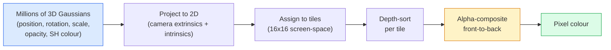

# 3D Gaussian Splatting с нуля

> Сцена — это облако из миллионов 3D-гауссианов. У каждого есть позиция, ориентация, масштаб, непрозрачность и цвет, зависящий от направления обзора. Растеризуйте их, выполните обратное распространение ошибки через растеризацию — готово.

**Тип:** Build
**Языки:** Python
**Предварительные требования:** этап 4, урок 13 («3D-зрение и NeRF»), этап 1, урок 12 («Операции с тензорами»), этап 4, урок 10 («Основы диффузии», опционально)
**Время:** ~90 минут

## Учебные цели

- Объяснить, почему 3D Gaussian Splatting заменил NeRF в качестве стандарта для фотореалистичной 3D-реконструкции в продакшене в 2026 году
- Перечислить шесть параметров на гауссиан (позиция, кватернион вращения, масштаб, непрозрачность, цвет через сферические гармоники, опциональный признак) и сколько чисел с плавающей точкой даёт каждый
- Реализовать 2D-растеризатор гауссовского сплаттинга с нуля с помощью `alpha`-компоузинга, а затем показать, как 3D-случай проецируется на тот же цикл
- Использовать `nerfstudio`, `gsplat` или `SuperSplat` для реконструкции сцены из 20-50 фотографий и экспорта в расширение glTF `KHR_gaussian_splatting` или схему OpenUSD 26.03 `UsdVolParticleField3DGaussianSplat`

## Проблема

NeRF хранит сцену как веса MLP. Каждый отрендеренный пиксель — это сотни запросов MLP вдоль луча. Обучение занимает часы, рендеринг — секунды, а веса нельзя редактировать: если нужно передвинуть стул внутри сцены, придётся переобучать модель.

3D Gaussian Splatting (Kerbl, Kopanas, Leimkühler, Drettakis, SIGGRAPH 2023) заменил всё это. Сцена — это явный набор 3D-гауссианов. Рендеринг — это GPU-растеризация со скоростью 100+ fps. Обучение занимает минуты. Редактирование прямое: перенесите подмножество гауссианов — и стул передвинут. К 2026 году Khronos Group ратифицировала расширение glTF для гауссовских сплатов, OpenUSD 26.03 поставляется со схемой для гауссовских сплатов, Zillow и Apartments.com рендерят недвижимость с их помощью, а большинство новых исследовательских статей о 3D-реконструкции — это варианты базовой идеи 3DGS.

Ментальная модель проста, но в математике достаточно движущихся частей, поэтому большинство введений начинают сразу с растеризации и пропускают проекции и сферические гармоники. Этот урок выстраивает всё целиком — сначала 2D-версию, затем 3D-расширение.

## Концепция

### Что несёт в себе гауссиан

Один 3D-гауссиан — это параметрический сгусток в пространстве со следующими атрибутами:

```
position         mu         (3,)    centre in world coordinates
rotation         q          (4,)    unit quaternion encoding orientation
scale            s          (3,)    log-scales per axis (exponentiated at render time)
opacity          alpha      (1,)    post-sigmoid opacity [0, 1]
SH coefficients  c_lm       (3 * (L+1)^2,)   view-dependent colour
```

Вращение + масштаб образуют матрицу ковариации 3x3: `Sigma = R S S^T R^T`. Это форма гауссиана в 3D. Сферические гармоники позволяют цвету меняться в зависимости от направления обзора — блики, тонкий блеск, зависящее от ракурса свечение — без хранения текстур для каждого ракурса. При степени SH 3 получаем 16 коэффициентов на цветовой канал, 48 чисел с плавающей точкой на гауссиан только для цвета.

Типичная сцена содержит 1-5 миллионов гауссианов. Каждый хранит примерно 60 чисел с плавающей точкой (3 + 4 + 3 + 1 + 48 + прочее). Это 240 МБ для сцены с пятью миллионами гауссианов — намного меньше эквивалентного облака точек с текстурой на каждую точку и на порядок меньше весов MLP NeRF, отрендеренных заново в высоком разрешении.

### Растеризация, а не маршинг лучей



Пять шагов, все дружественны к GPU. Никаких запросов MLP на пиксель. Одна RTX 3080 Ti рендерит 6 миллионов сплатов со скоростью 147 fps.

### Шаг проекции

3D-гауссиан в мировой позиции `mu` с 3D-ковариацией `Sigma` проецируется в 2D-гауссиан на экранной позиции `mu'` с 2D-ковариацией `Sigma'`:

```
mu' = project(mu)
Sigma' = J W Sigma W^T J^T          (2 x 2)

W = viewing transform (rotation + translation of camera)
J = Jacobian of the perspective projection at mu'
```

Проекция 2D-гауссиана — это эллипс, оси которого являются собственными векторами `Sigma'`. Каждый пиксель внутри этого эллипса получает вклад гауссиана, взвешенный по формуле `exp(-0.5 * (p - mu')^T Sigma'^-1 (p - mu'))`.

### Правило alpha-компоузинга

Для одного пикселя гауссианы, покрывающие его, сортируются от заднего плана к переднему (или, эквивалентно, от переднего к заднему с инвертированной формулой). Цвет компоузится по тому же уравнению, что и в любом полупрозрачном растеризаторе с 1980-х годов:

```
C_pixel = sum_i alpha_i * T_i * c_i

T_i = prod_{j < i} (1 - alpha_j)       transmittance up to i
alpha_i = opacity_i * exp(-0.5 * d^T Sigma'^-1 d)   local contribution
c_i = eval_SH(SH_i, view_direction)    view-dependent colour
```

Это **то же самое уравнение, что и объёмный рендер NeRF**, только над явным разреженным набором гауссианов вместо плотных сэмплов вдоль луча. Именно это тождество объясняет, почему качество рендера совпадает с NeRF — оба интегрируют одно и то же уравнение поля излучения.

### Почему это дифференцируемо

Каждый шаг — проекция, распределение по тайлам, alpha-компоузинг, вычисление SH — дифференцируем по параметрам гауссиана. Имея эталонное изображение, вычисляем потери на отрендеренных пикселях, выполняем обратное распространение ошибки через растеризатор, обновляем все `(mu, q, s, alpha, c_lm)` градиентным спуском. За ~30 000 итераций гауссианы находят правильные позиции, масштабы и цвета.

### Уплотнение и обрезка

Фиксированный набор гауссианов не способен покрыть сложную сцену. Обучение включает два адаптивных механизма:

- **Клонирование** гауссиана на его текущей позиции, когда величина градиента высока, а масштаб мал — реконструкции здесь не хватает детализации.
- **Разделение** крупномасштабного гауссиана на два меньших, когда его градиент высок — один большой гауссиан слишком гладкий, чтобы подстроиться под область.
- **Обрезка (pruning)** гауссианов, чья непрозрачность падает ниже порога — они не вносят вклад.

Уплотнение выполняется каждые N итераций. Сцена обычно растёт с ~100 тыс. начальных гауссианов (посеянных из точек SfM) до 1-5 млн к концу обучения.

### Сферические гармоники в одном абзаце

Зависящий от ракурса цвет — это функция `c(direction)` на единичной сфере. Сферические гармоники — это базис Фурье для сферы. Обрежьте на степени `L` — и получите `(L+1)^2` базисных функций на канал. Вычисление цвета для нового ракурса — это скалярное произведение между обученными коэффициентами SH и базисом, вычисленным в направлении обзора. Степень 0 = один коэффициент = постоянный цвет. Степень 3 = 16 коэффициентов = достаточно, чтобы захватить ламбертово затенение, зеркальные блики и лёгкое отражение. Статьи о 3D Gaussian Splatting по умолчанию используют степень 3.

### Продакшен-стек 2026 года

```
1. Capture         smartphone / DJI drone / handheld scanner
2. SfM / MVS       COLMAP or GLOMAP derives camera poses + sparse points
3. Train 3DGS      nerfstudio / gsplat / inria official / PostShot (~10-30 min on RTX 4090)
4. Edit            SuperSplat / SplatForge (clean floaters, segment)
5. Export          .ply -> glTF KHR_gaussian_splatting or .usd (OpenUSD 26.03)
6. View            Cesium / Unreal / Babylon.js / Three.js / Vision Pro
```

### 4D и генеративные варианты

- **4D Gaussian Splatting** — гауссианы становятся функциями времени; используется для объёмного видео (Superman 2026, «Helicopter» A$AP Rocky).
- **Генеративные сплаты** — модели преобразования текста в сплаты (text-to-splat), например Marble от World Labs, которые галлюцинируют целые сцены.
- **3D Gaussian Unscented Transform** — вариант NVIDIA NuRec для симуляции автономного вождения.

```figure
cv3-gaussian-splat
```

## Реализация

### Шаг 1: 2D-гауссиан

Сначала построим 2D-растеризатор. 3D-случай сводится к нему после проекции.

```python
import torch
import torch.nn as nn
import torch.nn.functional as F


def eval_2d_gaussian(means, covs, points):
    """
    means:  (G, 2)      centres
    covs:   (G, 2, 2)   covariance matrices
    points: (H, W, 2)   pixel coordinates
    returns: (G, H, W)  density at every pixel for every Gaussian
    """
    G = means.size(0)
    H, W, _ = points.shape
    flat = points.view(-1, 2)
    inv = torch.linalg.inv(covs)
    diff = flat[None, :, :] - means[:, None, :]
    d = torch.einsum("gpi,gij,gpj->gp", diff, inv, diff)
    density = torch.exp(-0.5 * d)
    return density.view(G, H, W)
```

`einsum` вычисляет квадратичную форму `diff^T Sigma^-1 diff` для каждой пары (гауссиан, пиксель).

### Шаг 2: 2D-растеризатор сплаттинга

Alpha-компоузинг от переднего плана к заднему. Глубина в 2D не имеет смысла, поэтому мы используем обучаемый скаляр на гауссиан для определения порядка.

```python
def rasterise_2d(means, covs, colours, opacities, depths, image_size):
    """
    means:     (G, 2)
    covs:      (G, 2, 2)
    colours:   (G, 3)
    opacities: (G,)     in [0, 1]
    depths:    (G,)     per-Gaussian scalar used for ordering
    image_size: (H, W)
    returns:   (H, W, 3) rendered image
    """
    H, W = image_size
    yy, xx = torch.meshgrid(
        torch.arange(H, dtype=torch.float32, device=means.device),
        torch.arange(W, dtype=torch.float32, device=means.device),
        indexing="ij",
    )
    points = torch.stack([xx, yy], dim=-1)

    densities = eval_2d_gaussian(means, covs, points)
    alphas = opacities[:, None, None] * densities
    alphas = alphas.clamp(0.0, 0.99)

    order = torch.argsort(depths)
    alphas = alphas[order]
    colours_sorted = colours[order]

    T = torch.ones(H, W, device=means.device)
    out = torch.zeros(H, W, 3, device=means.device)
    for i in range(means.size(0)):
        a = alphas[i]
        out += (T * a)[..., None] * colours_sorted[i][None, None, :]
        T = T * (1.0 - a)
    return out
```

Не быстро — реальная реализация использует тайловые CUDA-ядра — но математика полностью верная и полностью дифференцируемая.

### Шаг 3: Обучаемая 2D-сцена сплатов

```python
class Splats2D(nn.Module):
    def __init__(self, num_splats=128, image_size=64, seed=0):
        super().__init__()
        g = torch.Generator().manual_seed(seed)
        H, W = image_size, image_size
        self.means = nn.Parameter(torch.rand(num_splats, 2, generator=g) * torch.tensor([W, H]))
        self.log_scale = nn.Parameter(torch.ones(num_splats, 2) * math.log(2.0))
        self.rot = nn.Parameter(torch.zeros(num_splats))  # single angle in 2D
        self.colour_logits = nn.Parameter(torch.randn(num_splats, 3, generator=g) * 0.5)
        self.opacity_logit = nn.Parameter(torch.zeros(num_splats))
        self.depth = nn.Parameter(torch.rand(num_splats, generator=g))

    def covs(self):
        s = torch.exp(self.log_scale)
        c, si = torch.cos(self.rot), torch.sin(self.rot)
        R = torch.stack([
            torch.stack([c, -si], dim=-1),
            torch.stack([si, c], dim=-1),
        ], dim=-2)
        S = torch.diag_embed(s ** 2)
        return R @ S @ R.transpose(-1, -2)

    def forward(self, image_size):
        covs = self.covs()
        colours = torch.sigmoid(self.colour_logits)
        opacities = torch.sigmoid(self.opacity_logit)
        return rasterise_2d(self.means, covs, colours, opacities, self.depth, image_size)
```

`log_scale`, `opacity_logit` и `colour_logits` — все они неограниченные параметры, преобразуемые через нужную функцию активации во время рендеринга. Это стандартный паттерн для любой реализации 3DGS.

### Шаг 4: Подгонка 2D-гауссианов под целевое изображение

```python
import math
import numpy as np

def make_target(size=64):
    yy, xx = np.meshgrid(np.arange(size), np.arange(size), indexing="ij")
    img = np.zeros((size, size, 3), dtype=np.float32)
    # Red circle
    mask = (xx - 20) ** 2 + (yy - 20) ** 2 < 10 ** 2
    img[mask] = [1.0, 0.2, 0.2]
    # Blue square
    mask = (np.abs(xx - 45) < 8) & (np.abs(yy - 40) < 8)
    img[mask] = [0.2, 0.3, 1.0]
    return torch.from_numpy(img)


target = make_target(64)
model = Splats2D(num_splats=64, image_size=64)
opt = torch.optim.Adam(model.parameters(), lr=0.05)

for step in range(200):
    pred = model((64, 64))
    loss = F.mse_loss(pred, target)
    opt.zero_grad(); loss.backward(); opt.step()
    if step % 40 == 0:
        print(f"step {step:3d}  mse {loss.item():.4f}")
```

За 200 шагов 64 гауссиана выстраиваются в две фигуры. В этом и заключается вся идея — градиентный спуск по явным геометрическим примитивам.

### Шаг 5: От 2D к 3D

3D-расширение сохраняет тот же цикл. Дополнения:

1. Вращение на гауссиан — это кватернион вместо одного угла.
2. Ковариация — `R S S^T R^T`, где `R` строится из кватерниона, а `S = diag(exp(log_scale))`.
3. Проекция `(mu, Sigma) -> (mu', Sigma')` использует внешние параметры камеры и Якобиан перспективной проекции в точке `mu`.
4. Цвет становится разложением по сферическим гармоникам; вычисляется в направлении обзора.
5. Сортировка по глубине идёт по реальной z-координате в пространстве камеры вместо обучаемого скаляра.

Каждая продакшен-реализация (`gsplat`, `inria/gaussian-splatting`, `nerfstudio`) делает именно это на GPU с помощью тайловых CUDA-ядер.

### Шаг 6: Вычисление сферических гармоник

Базис SH до степени 3 содержит 16 членов на канал. Вычисление:

```python
def eval_sh_degree_3(sh_coeffs, dirs):
    """
    sh_coeffs: (..., 16, 3)   last dim is RGB channels
    dirs:      (..., 3)       unit vectors
    returns:   (..., 3)
    """
    C0 = 0.282094791773878
    C1 = 0.488602511902920
    C2 = [1.092548430592079, 1.092548430592079,
          0.315391565252520, 1.092548430592079,
          0.546274215296039]
    x, y, z = dirs[..., 0], dirs[..., 1], dirs[..., 2]
    x2, y2, z2 = x * x, y * y, z * z
    xy, yz, xz = x * y, y * z, x * z

    result = C0 * sh_coeffs[..., 0, :]
    result = result - C1 * y[..., None] * sh_coeffs[..., 1, :]
    result = result + C1 * z[..., None] * sh_coeffs[..., 2, :]
    result = result - C1 * x[..., None] * sh_coeffs[..., 3, :]

    result = result + C2[0] * xy[..., None] * sh_coeffs[..., 4, :]
    result = result + C2[1] * yz[..., None] * sh_coeffs[..., 5, :]
    result = result + C2[2] * (2.0 * z2 - x2 - y2)[..., None] * sh_coeffs[..., 6, :]
    result = result + C2[3] * xz[..., None] * sh_coeffs[..., 7, :]
    result = result + C2[4] * (x2 - y2)[..., None] * sh_coeffs[..., 8, :]

    # degree 3 terms omitted here for brevity; full 16-coefficient version in the code file
    return result
```

Обученные `sh_coeffs` хранят «цвет в каждом направлении» для этого гауссиана. Во время рендеринга вы вычисляете значение относительно текущего направления обзора и получаете RGB-вектор из трёх компонент.

## Использование

Для реальной работы с 3DGS используйте `gsplat` (Meta) или `nerfstudio`:

```bash
pip install nerfstudio gsplat
ns-download-data example
ns-train splatfacto --data path/to/data
```

`splatfacto` — это тренер 3DGS в составе nerfstudio. Запуск занимает 10-30 минут на RTX 4090 для типичной сцены.

Варианты экспорта, которые важны в 2026 году:

- `.ply` — исходное облако гауссианов (портативный, самый большой файл).
- `.splat` — квантованный формат PlayCanvas / SuperSplat.
- glTF `KHR_gaussian_splatting` — стандарт Khronos, портативен между вьюерами (RC от февраля 2026).
- OpenUSD `UsdVolParticleField3DGaussianSplat` — нативный для USD, для пайплайнов NVIDIA Omniverse и Vision Pro.

Для 4D / динамических сцен `4DGS` и `Deformable-3DGS` расширяют тот же механизм переменными во времени центрами и непрозрачностями.

## Итоговые артефакты

Этот урок производит:

- `outputs/prompt-3dgs-capture-planner.md` — промпт, который планирует сессию съёмки (количество фотографий, путь камеры, освещение) для заданного типа сцены.
- `outputs/skill-3dgs-export-router.md` — навык, который выбирает подходящий формат экспорта (`.ply` / `.splat` / glTF / USD) в зависимости от целевого вьюера или движка.

## Упражнения

1. **(Лёгкое)** Запустите приведённый выше 2D-тренер сплатов на другом синтетическом изображении. Варьируйте `num_splats` в диапазоне `[16, 64, 256]` и постройте график MSE от шага для каждого значения. Определите точку убывающей отдачи.
2. **(Среднее)** Расширьте 2D-растеризатор для поддержки RGB-цветов на гауссиан, зависящих от скалярного «угла обзора» через гармонику степени 2. Обучите на паре целевых изображений и проверьте, что модель реконструирует оба.
3. **(Сложное)** Клонируйте `nerfstudio` и обучите `splatfacto` на съёмке из 20 фотографий любой доступной сцены (стол, растение, лицо, комната). Экспортируйте в glTF `KHR_gaussian_splatting` и откройте во вьюере (Three.js `GaussianSplats3D`, SuperSplat, Babylon.js V9). Сообщите время обучения, количество гауссианов и fps рендеринга.

## Ключевые термины

| Термин | Как обычно говорят | Что это означает на самом деле |
|------|----------------|----------------------|
| 3DGS | «Гауссовские сплаты» | Явное представление сцены в виде миллионов 3D-гауссианов, у каждого из которых заданы позиция, вращение, масштаб, непрозрачность и цвет через SH |
| Ковариация | «Форма гауссиана» | `Sigma = R S S^T R^T`; задаёт ориентацию и анизотропный масштаб одного гауссиана |
| Альфа-компоузинг | «Смешивание от заднего плана к переднему» | То же уравнение, что и для объёмного рендеринга NeRF, но теперь применяемое к явному разреженному набору |
| Уплотнение | «Клонирование и разделение» | Адаптивное добавление новых гауссианов там, где реконструкция недостаточно точно соответствует данным |
| Обрезка | «Удаление элементов с низкой непрозрачностью» | Удаление гауссианов, непрозрачность которых в ходе обучения снизилась почти до нуля |
| Сферические гармоники | «Зависимость цвета от ракурса» | Базис Фурье на сфере, позволяющий представить цвет как функцию направления обзора |
| Splatfacto | «Средство 3DGS в составе nerfstudio» | Самый простой способ обучить 3DGS в 2026 году |
| `KHR_gaussian_splatting` | «Стандарт glTF» | Расширение Khronos 2026 года, обеспечивающее переносимость 3DGS между вьюерами и движками |

## Дополнительные материалы

- [3D Gaussian Splatting for Real-Time Radiance Field Rendering (Kerbl et al., SIGGRAPH 2023)](https://repo-sam.inria.fr/fungraph/3d-gaussian-splatting/) — оригинальная статья
- [gsplat (Meta/nerfstudio)](https://github.com/nerfstudio-project/gsplat) — CUDA-растеризатор промышленного качества
- [nerfstudio Splatfacto](https://docs.nerf.studio/nerfology/methods/splat.html) — эталонная методика обучения
- [Расширение Khronos KHR_gaussian_splatting](https://github.com/KhronosGroup/glTF/blob/main/extensions/2.0/Khronos/KHR_gaussian_splatting/README.md) — переносимый формат 2026 года
- [Примечания к выпуску OpenUSD 26.03](https://openusd.org/release/) — схема `UsdVolParticleField3DGaussianSplat`
- [THE FUTURE 3D: состояние Gaussian Splatting в 2026 году](https://www.thefuture3d.com/blog-0/2026/4/4/state-of-gaussian-splatting-2026) — обзор отрасли
